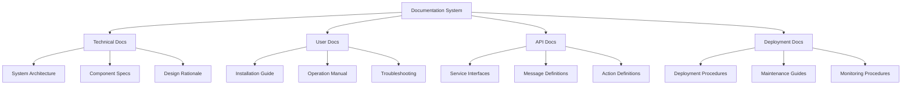

# Documentation and Deployment

## Overview

This phase focuses on creating comprehensive documentation for the integrated humanoid robot system and establishing deployment procedures for production use. Proper documentation ensures maintainability and knowledge transfer, while robust deployment procedures ensure reliable system operation in production environments.

## Learning Objectives

After completing this phase, you will be able to:
- Create comprehensive technical documentation for complex robotic systems
- Develop deployment procedures for simulation and real-world environments
- Establish system maintenance and monitoring procedures
- Create user guides for system operators and developers
- Implement continuous integration and deployment pipelines

## Prerequisites

Before starting this phase, ensure you have:
- Complete integrated system from all previous phases
- Comprehensive testing results from integration and sim-to-real phases
- Understanding of system architecture and component interactions
- Access to deployment environments (simulation and real-world)

## Documentation Architecture

The documentation system follows a multi-tiered approach:

### Technical Documentation
- **System Architecture**: High-level system design and component interactions
- **API Documentation**: ROS 2 interfaces, services, and message definitions
- **Component Documentation**: Detailed documentation for each system component
- **Integration Guides**: Instructions for integrating new components

### User Documentation
- **Installation Guides**: Step-by-step installation procedures
- **Operation Manuals**: How to operate and control the system
- **Troubleshooting Guides**: Common issues and solutions
- **Safety Procedures**: Safety protocols and emergency procedures



## System Architecture Documentation

### High-Level System Architecture

```yaml
# system_architecture.yaml
system_name: "Integrated Humanoid Robot System"
version: "1.0.0"
description: "Complete humanoid robot system with VLA integration"

components:
  perception_system:
    name: "Perception System"
    description: "Multi-modal perception with camera, depth, and sensor fusion"
    nodes:
      - camera_perception_node
      - depth_perception_node
      - sensor_fusion_node
      - synthetic_data_node
    topics:
      - /perception/fused_data
      - /perception/object_detections
      - /perception/pointcloud

  planning_system:
    name: "Planning System"
    description: "LLM-integrated planning with task decomposition"
    nodes:
      - command_interpreter_node
      - task_planner_node
      - reasoning_engine_node
    topics:
      - /planning/generated_plan
      - /planning/scheduled_tasks
      - /planning/execution_plan

  action_system:
    name: "Action Execution System"
    description: "ROS 2 action servers for navigation and manipulation"
    nodes:
      - navigation_action_server
      - manipulation_action_server
      - action_executor_node
    actions:
      - /navigate_to_pose
      - /manipulate_object
      - /execute_task

  safety_system:
    name: "Safety System"
    description: "Comprehensive safety validation and monitoring"
    nodes:
      - safety_validator_node
      - emergency_stop_node
    topics:
      - /safety/status
      - /safety/emergency_stop

communication_layers:
  middleware: "ROS 2 Jazzy with DDS"
  message_transport: "Built-in ROS 2 transport"
  service_discovery: "ROS 2 service discovery"
  qos_profiles:
    reliable: "RMW_QOS_POLICY_RELIABILITY_RELIABLE"
    best_effort: "RMW_QOS_POLICY_RELIABILITY_BEST_EFFORT"
```

### Component Interface Documentation

```python
# component_interfaces.py
"""
Component Interface Documentation

This module documents all component interfaces for the integrated humanoid robot system.
Each component follows a standard interface pattern with consistent message types.
"""

from typing import Dict, List, Optional
from dataclasses import dataclass
import json

@dataclass
class ComponentInterface:
    """Base interface for all system components"""
    name: str
    version: str
    description: str
    input_topics: List[str]
    output_topics: List[str]
    services: List[str]
    actions: List[str]
    parameters: Dict[str, any]

class PerceptionInterface(ComponentInterface):
    """
    Perception System Interface

    The perception system processes multi-modal sensory data to create
    environmental understanding for the planning system.

    Input Topics:
        /head_camera/rgb/image_raw - RGB camera images
        /head_camera/depth/image_raw - Depth images
        /imu/data - Inertial measurement unit data
        /velodyne_points - LiDAR point cloud data

    Output Topics:
        /perception/fused_data - Fused perception data
        /perception/object_detections - Object detection results
        /perception/scene_description - Scene understanding
    """

    def __init__(self):
        super().__init__(
            name="perception_system",
            version="1.0.0",
            description="Multi-modal perception system for environmental understanding",
            input_topics=[
                "/head_camera/rgb/image_raw",
                "/head_camera/depth/image_raw",
                "/imu/data",
                "/velodyne_points"
            ],
            output_topics=[
                "/perception/fused_data",
                "/perception/object_detections",
                "/perception/scene_description"
            ],
            services=[],
            actions=[],
            parameters={
                "detection_threshold": 0.5,
                "max_detection_range": 5.0,
                "fusion_rate": 30.0
            }
        )

class PlanningInterface(ComponentInterface):
    """
    Planning System Interface

    The planning system integrates LLMs with perception data to generate
    executable action plans for the action execution system.

    Input Topics:
        /perception/fused_data - Environmental perception data
        /natural_language_command - High-level commands

    Output Topics:
        /planning/generated_plan - Generated action plan
        /planning/scheduled_tasks - Scheduled task list
    """

    def __init__(self):
        super().__init__(
            name="planning_system",
            version="1.0.0",
            description="LLM-integrated planning system for action generation",
            input_topics=[
                "/perception/fused_data",
                "/natural_language_command"
            ],
            output_topics=[
                "/planning/generated_plan",
                "/planning/scheduled_tasks"
            ],
            services=[
                "/planning/generate_plan",
                "/planning/validate_plan"
            ],
            actions=[
                "/planning/execute_plan"
            ],
            parameters={
                "planning_horizon": 10.0,
                "plan_validation": True,
                "llm_timeout": 30.0
            }
        )

class ActionInterface(ComponentInterface):
    """
    Action Execution System Interface

    The action system executes low-level robot commands based on
    high-level plans from the planning system.

    Actions:
        /navigate_to_pose - Navigate to specified pose
        /manipulate_object - Manipulate objects in environment
    """

    def __init__(self):
        super().__init__(
            name="action_system",
            version="1.0.0",
            description="Action execution system for robot control",
            input_topics=[
                "/planning/generated_plan",
                "/planning/execution_plan"
            ],
            output_topics=[
                "/action_executor/status",
                "/robot/command"
            ],
            services=[],
            actions=[
                "/navigate_to_pose",
                "/manipulate_object"
            ],
            parameters={
                "action_timeout": 60.0,
                "execution_rate": 100.0,
                "safety_check_interval": 0.1
            }
        )

class SafetyInterface(ComponentInterface):
    """
    Safety System Interface

    The safety system validates all actions and commands for safety compliance
    and provides emergency stop capabilities.

    Input Topics:
        /robot/command - Commands to validate
        /joint_states - Robot joint states for safety monitoring
        /perception/fused_data - Environmental data for safety checks

    Output Topics:
        /safety/status - Safety system status
        /safety/emergency_stop - Emergency stop commands
    """

    def __init__(self):
        super().__init__(
            name="safety_system",
            version="1.0.0",
            description="Safety validation and monitoring system",
            input_topics=[
                "/robot/command",
                "/joint_states",
                "/perception/fused_data"
            ],
            output_topics=[
                "/safety/status",
                "/safety/emergency_stop"
            ],
            services=[
                "/safety/validate_command",
                "/safety/emergency_stop"
            ],
            actions=[],
            parameters={
                "safety_check_rate": 100.0,
                "emergency_stop_timeout": 1.0,
                "joint_limit_margin": 0.1
            }
        )

def generate_component_documentation() -> Dict:
    """Generate comprehensive component documentation"""
    components = [
        PerceptionInterface(),
        PlanningInterface(),
        ActionInterface(),
        SafetyInterface()
    ]

    documentation = {
        "system_name": "Integrated Humanoid Robot System",
        "version": "1.0.0",
        "components": []
    }

    for component in components:
        component_doc = {
            "name": component.name,
            "version": component.version,
            "description": component.description,
            "input_topics": component.input_topics,
            "output_topics": component.output_topics,
            "services": component.services,
            "actions": component.actions,
            "parameters": component.parameters,
            "interface_class": component.__class__.__name__
        }
        documentation["components"].append(component_doc)

    return documentation

if __name__ == "__main__":
    # Generate and print documentation
    doc = generate_component_documentation()
    print(json.dumps(doc, indent=2))
```

## Installation and Setup Documentation

### System Requirements Documentation

```markdown
# System Requirements

## Hardware Requirements

### Minimum Requirements
- **CPU**: Intel i7-10700K or AMD Ryzen 7 3800X
- **GPU**: NVIDIA RTX 3080 or better (24GB VRAM recommended)
- **RAM**: 32GB DDR4 3200MHz
- **Storage**: 1TB NVMe SSD
- **Network**: Gigabit Ethernet

### Recommended Requirements
- **CPU**: Intel i9-12900K or AMD Ryzen 9 5900X
- **GPU**: NVIDIA RTX 4090 or RTX 6000 Ada (48GB+ VRAM)
- **RAM**: 64GB DDR4 3200MHz or DDR5
- **Storage**: 2TB+ NVMe SSD
- **Network**: 10GbE for distributed systems

## Software Requirements

### Operating System
- Ubuntu 22.04 LTS (Jammy Jellyfish)
- Real-time kernel recommended for control applications
- NVIDIA drivers: 535 or newer

### Core Dependencies
- ROS 2 Jazzy Jalisco (2025 LTS)
- Python 3.10 or 3.11
- CUDA 12.0 or newer
- Isaac Sim 4.2.0 or newer

### Development Tools
- Git 2.30+
- CMake 3.20+
- GCC 11+ or Clang 14+
- Docker 20.10+ (for containerized deployment)

## Network Requirements

### Local Network
- Subnet: 192.168.1.0/24 or larger
- Port ranges: 11311-11321 (ROS 2), 8080-8090 (Isaac Sim)
- Bandwidth: 1Gbps minimum, 10Gbps recommended for distributed systems

### External Connectivity
- Internet access for package installation and updates
- VPN access for remote development (if applicable)
- Firewall rules allowing ROS 2 communication
```

### Installation Guide

```bash
#!/bin/bash
# installation_guide.sh

# This script provides an automated installation guide for the integrated humanoid robot system

echo "Integrated Humanoid Robot System - Installation Guide"
echo "====================================================="

# Check system requirements
echo "Checking system requirements..."

# Check Ubuntu version
if [[ -f /etc/os-release ]]; then
    . /etc/os-release
    if [[ $VERSION_ID != "22.04" ]]; then
        echo "Warning: Ubuntu 22.04 LTS recommended, detected: $VERSION_ID"
    fi
fi

# Check available disk space
available_space=$(df -h $HOME | awk 'NR==2 {print $4}' | sed 's/G//')
if [[ $available_space -lt 100 ]]; then
    echo "Warning: At least 100GB free space recommended, available: ${available_space}GB"
fi

# Install ROS 2 Jazzy
echo "Installing ROS 2 Jazzy Jalisco..."
if ! command -v ros2 &> /dev/null; then
    # Add ROS 2 repository
    sudo apt update && sudo apt install -y curl gnupg lsb-release
    curl -sSL https://raw.githubusercontent.com/ros/rosdistro/master/ros.key | sudo apt-key add -
    sudo sh -c 'echo "deb [arch=$(dpkg --print-architecture)] http://packages.ros.org/ros2/ubuntu $(lsb_release -cs) main" > /etc/apt/sources.list.d/ros2-latest.list'

    sudo apt update
    sudo apt install -y ros-jazzy-desktop ros-jazzy-perception ros-jazzy-navigation2 ros-jazzy-rosbridge-suite
else
    echo "ROS 2 already installed"
fi

# Install additional dependencies
echo "Installing additional dependencies..."
sudo apt update
sudo apt install -y python3-colcon-common-extensions python3-rosdep python3-vcstool
sudo rosdep init || echo "rosdep already initialized"
rosdep update

# Install Python dependencies
echo "Installing Python dependencies..."
pip3 install --user torch torchvision torchaudio --index-url https://download.pytorch.org/whl/cu118
pip3 install --user transformers openai gymnasium stable-baselines3 opencv-python

# Setup workspace
echo "Setting up workspace..."
mkdir -p ~/humanoid_ws/src
cd ~/humanoid_ws

# Build workspace
echo "Building workspace..."
source /opt/ros/jazzy/setup.bash
colcon build --symlink-install

echo "Installation complete!"
echo "To source the workspace, run: source ~/humanoid_ws/install/setup.bash"
```

## Operation Manual

### System Startup Procedures

```markdown
# System Operation Manual

## Pre-Operation Checklist

### Safety Verification
- [ ] All emergency stop buttons are functional
- [ ] Safety barriers are in place
- [ ] Environmental sensors are calibrated
- [ ] Robot is in safe starting position
- [ ] All personnel are clear of robot workspace

### System Verification
- [ ] Power systems are stable
- [ ] Network connections are established
- [ ] All sensors are operational
- [ ] Robot joint states are normal
- [ ] Communication systems are active

## System Startup Procedure

### 1. Power On Sequence
1. Verify all safety systems are operational
2. Power on robot base unit
3. Wait for robot initialization (typically 30 seconds)
4. Power on external sensors and computers
5. Verify all systems report "READY"

### 2. Software Initialization
1. Source ROS 2 workspace:
   ```bash
   source /opt/ros/jazzy/setup.bash
   source ~/humanoid_ws/install/setup.bash
   ```

2. Launch core system:
   ```bash
   ros2 launch humanoid_bringup full_system.launch.py
   ```

3. Verify all nodes are active:
   ```bash
   ros2 node list
   ros2 topic list
   ```

### 3. System Calibration
1. Run joint calibration routine
2. Verify sensor calibration
3. Test basic movements
4. Validate safety systems

## Normal Operation Procedures

### Command Execution
1. Ensure robot is in idle state
2. Issue command through appropriate interface
3. Monitor execution status
4. Verify completion or handle errors

### Monitoring Guidelines
- Monitor system status topics continuously
- Watch for safety violations
- Check resource utilization
- Log all operations

## Emergency Procedures

### Emergency Stop
1. Press any emergency stop button
2. Verify robot motion has stopped
3. Check for error conditions
4. Follow recovery procedures

### System Recovery
1. Identify root cause of issue
2. Clear any safety violations
3. Restart affected systems
4. Resume operations when safe
```

## Troubleshooting Guide

### Common Issues and Solutions

```python
# troubleshooting_guide.py
"""
Troubleshooting Guide for Integrated Humanoid Robot System

This module provides automated troubleshooting capabilities and
documentation for common system issues.
"""

import subprocess
import json
import time
from typing import Dict, List, Tuple
import psutil

class TroubleshootingGuide:
    """Automated troubleshooting guide for system issues"""

    def __init__(self):
        self.known_issues = {
            "ros2_communication_failure": {
                "symptoms": ["No messages on topics", "Nodes not connecting", "Service calls failing"],
                "causes": ["Network issues", "Firewall blocking", "Incorrect domain ID"],
                "solutions": [
                    "Check network connectivity",
                    "Verify ROS_DOMAIN_ID matches",
                    "Restart ROS 2 daemon: ros2 daemon stop && ros2 daemon start"
                ]
            },
            "perception_system_overload": {
                "symptoms": ["High CPU usage", "Slow processing", "Dropped frames"],
                "causes": ["Insufficient hardware", "High processing load", "Memory leaks"],
                "solutions": [
                    "Reduce camera resolution",
                    "Decrease processing rate",
                    "Optimize perception algorithms"
                ]
            },
            "safety_system_trips": {
                "symptoms": ["Emergency stop activation", "Commands rejected", "System halt"],
                "causes": ["Joint limit violations", "Collision detection", "Safety parameter violations"],
                "solutions": [
                    "Check joint positions",
                    "Verify environment is clear",
                    "Adjust safety parameters if appropriate"
                ]
            }
        }

    def diagnose_system(self) -> Dict:
        """Diagnose current system state and identify potential issues"""
        diagnosis = {
            "timestamp": time.time(),
            "system_status": self._check_system_status(),
            "resource_usage": self._check_resource_usage(),
            "network_status": self._check_network_status(),
            "potential_issues": self._identify_potential_issues()
        }
        return diagnosis

    def _check_system_status(self) -> Dict:
        """Check overall system status"""
        status = {
            "ros2_nodes": self._get_ros_nodes(),
            "active_topics": self._get_ros_topics(),
            "system_uptime": self._get_system_uptime()
        }
        return status

    def _check_resource_usage(self) -> Dict:
        """Check system resource usage"""
        cpu_percent = psutil.cpu_percent(interval=1)
        memory_percent = psutil.virtual_memory().percent
        disk_percent = psutil.disk_usage('/').percent

        return {
            "cpu_usage": cpu_percent,
            "memory_usage": memory_percent,
            "disk_usage": disk_percent,
            "resource_health": self._assess_resource_health(cpu_percent, memory_percent, disk_percent)
        }

    def _assess_resource_health(self, cpu: float, memory: float, disk: float) -> str:
        """Assess resource health based on usage"""
        if cpu > 90 or memory > 90 or disk > 90:
            return "CRITICAL"
        elif cpu > 75 or memory > 75 or disk > 75:
            return "WARNING"
        else:
            return "OK"

    def _check_network_status(self) -> Dict:
        """Check network connectivity"""
        # Check if ROS master is reachable
        ros_master_reachable = True  # Simplified check
        network_interfaces = psutil.net_if_addrs()

        return {
            "ros_master_reachable": ros_master_reachable,
            "network_interfaces": list(network_interfaces.keys()),
            "connection_status": "CONNECTED" if ros_master_reachable else "DISCONNECTED"
        }

    def _get_ros_nodes(self) -> List[str]:
        """Get list of active ROS nodes"""
        try:
            result = subprocess.run(['ros2', 'node', 'list'], capture_output=True, text=True, timeout=5)
            return result.stdout.strip().split('\n') if result.stdout.strip() else []
        except:
            return []

    def _get_ros_topics(self) -> List[str]:
        """Get list of active ROS topics"""
        try:
            result = subprocess.run(['ros2', 'topic', 'list'], capture_output=True, text=True, timeout=5)
            return result.stdout.strip().split('\n') if result.stdout.strip() else []
        except:
            return []

    def _get_system_uptime(self) -> float:
        """Get system uptime"""
        return time.time() - psutil.boot_time()

    def _identify_potential_issues(self) -> List[Dict]:
        """Identify potential issues based on system state"""
        issues = []

        # Check resource usage
        resources = self._check_resource_usage()
        if resources['resource_health'] == 'CRITICAL':
            issues.append({
                "type": "resource_overload",
                "severity": "HIGH",
                "description": "System resources are critically overloaded",
                "solutions": ["Reduce system load", "Check for memory leaks", "Consider hardware upgrade"]
            })

        # Check for missing critical nodes
        active_nodes = self._get_ros_nodes()
        critical_nodes = [
            "perception_node",
            "planning_node",
            "action_executor",
            "safety_validator"
        ]

        missing_nodes = [node for node in critical_nodes if node not in active_nodes]
        if missing_nodes:
            issues.append({
                "type": "missing_critical_nodes",
                "severity": "CRITICAL",
                "description": f"Critical nodes are not running: {missing_nodes}",
                "solutions": ["Check node launch files", "Verify dependencies", "Restart missing nodes"]
            })

        return issues

    def get_troubleshooting_suggestions(self, issue_type: str) -> Dict:
        """Get troubleshooting suggestions for a specific issue type"""
        if issue_type in self.known_issues:
            return self.known_issues[issue_type]
        else:
            return {
                "symptoms": [],
                "causes": [],
                "solutions": ["Check system logs for more information", "Consult system administrator"]
            }

    def run_system_health_check(self) -> Dict:
        """Run comprehensive system health check"""
        health_report = {
            "diagnosis": self.diagnose_system(),
            "troubleshooting_suggestions": [],
            "health_score": self._calculate_health_score()
        }

        # Add suggestions for identified issues
        potential_issues = health_report["diagnosis"]["potential_issues"]
        for issue in potential_issues:
            suggestions = self.get_troubleshooting_suggestions(issue["type"])
            health_report["troubleshooting_suggestions"].append({
                "issue": issue,
                "suggestions": suggestions
            })

        return health_report

    def _calculate_health_score(self) -> float:
        """Calculate overall system health score (0-100)"""
        # Simplified health calculation
        resource_usage = self._check_resource_usage()
        resource_score = max(0, 100 - (resource_usage["cpu_usage"] + resource_usage["memory_usage"]) / 2)

        # Check for critical issues
        issues = self._identify_potential_issues()
        critical_issues = sum(1 for issue in issues if issue["severity"] == "CRITICAL")

        # Calculate final score
        health_score = max(0, resource_score - (critical_issues * 20))
        return min(100, health_score)

def main():
    """Main troubleshooting function"""
    troubleshooter = TroubleshootingGuide()
    health_report = troubleshooter.run_system_health_check()

    print("System Health Report")
    print("=" * 50)
    print(f"Health Score: {health_report['health_score']}/100")
    print(f"System Status: {health_report['diagnosis']['system_status']}")
    print(f"Resource Usage: {health_report['diagnosis']['resource_usage']}")
    print(f"Potential Issues: {len(health_report['diagnosis']['potential_issues'])}")

    if health_report['troubleshooting_suggestions']:
        print("\nTroubleshooting Suggestions:")
        for suggestion in health_report['troubleshooting_suggestions']:
            print(f"- Issue: {suggestion['issue']['type']}")
            print(f"  Solutions: {suggestion['suggestions']['solutions']}")

if __name__ == "__main__":
    main()
```

## Deployment Procedures

### Production Deployment Guide

```yaml
# deployment_guide.yaml
deployment_environment: "production"
target_system: "integrated_humanoid_robot"
version: "1.0.0"

deployment_phases:
  preparation:
    steps:
      - verify_system_requirements
      - backup_existing_deployment
      - prepare_deployment_artifacts
      - validate_deployment_configuration

    success_criteria:
      - all_requirements_met: true
      - backup_successful: true
      - artifacts_validated: true

  staging:
    steps:
      - deploy_to_staging_environment
      - run_integration_tests
      - validate_system_functionality
      - performance_benchmarking

    success_criteria:
      - staging_deployment_successful: true
      - integration_tests_pass: true
      - performance_within_thresholds: true

  production:
    steps:
      - schedule_maintenance_window
      - stop_current_system
      - deploy_new_version
      - start_system_services
      - run_system_verification
      - monitor_initial_performance

    success_criteria:
      - deployment_successful: true
      - system_operational: true
      - performance_acceptable: true

rollback_procedure:
  conditions:
    - deployment_failure: true
    - system_instability: true
    - performance_degradation: true

  steps:
    - stop_new_system
    - restore_previous_version
    - restart_previous_system
    - verify_restoration
    - update_deployment_logs

monitoring:
  metrics:
    - system_uptime
    - resource_utilization
    - error_rates
    - response_times
    - safety_violations

  alerts:
    - critical_errors
    - resource_thresholds
    - safety_system_trips
    - performance_degradation

security:
  authentication:
    - certificate_based: true
    - role_based_access: true
    - api_key_validation: true

  encryption:
    - data_in_transit: true
    - data_at_rest: true
    - communication_encrypted: true
```

### Docker-based Deployment

```dockerfile
# Dockerfile for humanoid robot system
FROM osrf/ros:jazzy-desktop-full

# Set environment variables
ENV DEBIAN_FRONTEND=noninteractive
ENV ROS_DISTRO=jazzy
ENV HUMANOID_WS=/opt/humanoid_ws

# Install system dependencies
RUN apt-get update && apt-get install -y \
    python3-pip \
    python3-colcon-common-extensions \
    python3-rosdep \
    python3-vcstool \
    build-essential \
    cmake \
    git \
    wget \
    curl \
    gnupg \
    lsb-release \
    && rm -rf /var/lib/apt/lists/*

# Install Python dependencies
COPY requirements.txt .
RUN pip3 install --no-cache-dir -r requirements.txt

# Create workspace and copy source
RUN mkdir -p $HUMANOID_WS/src
WORKDIR $HUMANOID_WS

# Copy package source (this would be done in build)
# COPY src/ ./src/

# Install ROS dependencies
RUN rosdep update
RUN rosdep install --from-paths src --ignore-src -r -y

# Build the workspace
RUN source /opt/ros/$ROS_DISTRO/setup.bash && \
    colcon build --symlink-install

# Setup entrypoint
COPY entrypoint.sh /
RUN chmod +555 /entrypoint.sh

ENTRYPOINT ["/entrypoint.sh"]
CMD ["bash"]
```

```bash
#!/bin/bash
# entrypoint.sh

# Source ROS 2 and workspace
source "/opt/ros/jazzy/setup.bash"
source "/opt/humanoid_ws/install/setup.bash"

# Set ROS domain ID if specified
if [ ! -z "$ROS_DOMAIN_ID" ]; then
    export ROS_DOMAIN_ID=$ROS_DOMAIN_ID
fi

# Set ROS localhost only if specified
if [ ! -z "$ROS_LOCALHOST_ONLY" ]; then
    export ROS_LOCALHOST_ONLY=$ROS_LOCALHOST_ONLY
fi

# Execute the main command
exec "$@"
```

```txt
# requirements.txt
torch>=2.0.0
torchvision>=0.15.0
transformers>=4.25.0
openai>=0.27.0
opencv-python>=4.8.0
numpy>=1.24.0
scipy>=1.10.0
gymnasium>=0.28.0
stable-baselines3>=2.0.0
psutil>=5.9.0
requests>=2.28.0
```

## Maintenance Procedures

### System Maintenance Guide

```markdown
# System Maintenance Procedures

## Daily Maintenance

### Morning Checks
- [ ] Verify system startup completed successfully
- [ ] Check system status and health indicators
- [ ] Review overnight logs for errors or warnings
- [ ] Verify all sensors are operational
- [ ] Test basic robot movements

### Evening Checks
- [ ] Review daily operation logs
- [ ] Check system resource usage
- [ ] Verify backup processes completed
- [ ] Update system status dashboard
- [ ] Plan maintenance for following day

## Weekly Maintenance

### System Health Check
- [ ] Run comprehensive system diagnostics
- [ ] Check disk space and cleanup temporary files
- [ ] Verify backup integrity
- [ ] Update system performance metrics
- [ ] Review and analyze system logs

### Calibration Verification
- [ ] Verify camera calibration
- [ ] Check IMU calibration
- [ ] Test sensor accuracy
- [ ] Update calibration if necessary
- [ ] Document calibration changes

## Monthly Maintenance

### Software Updates
- [ ] Check for ROS 2 updates
- [ ] Update system dependencies
- [ ] Apply security patches
- [ ] Test updated system functionality
- [ ] Document changes

### Hardware Inspection
- [ ] Inspect robot joints and actuators
- [ ] Check cable connections
- [ ] Verify sensor mounting
- [ ] Test emergency stop functionality
- [ ] Update hardware maintenance log

## Quarterly Maintenance

### Comprehensive System Review
- [ ] Full system backup
- [ ] Performance benchmarking
- [ ] Security audit
- [ ] Documentation update
- [ ] User training verification

### Long-term Planning
- [ ] Capacity planning review
- [ ] Hardware upgrade planning
- [ ] Software architecture review
- [ ] Budget planning for next quarter
```

## Phase Completion Checklist

Complete the following tasks to finish the Documentation and Deployment phase:

- [ ] System architecture documentation completed with all interfaces
- [ ] Installation guides created and tested
- [ ] Operation manual developed with safety procedures
- [ ] Troubleshooting guide implemented with automated diagnostics
- [ ] Deployment procedures documented for production use
- [ ] Docker-based deployment solution created
- [ ] Maintenance procedures established and documented
- [ ] All documentation reviewed and validated

```mermaid
graph TD
    A[Documentation & Deployment Phase] --> B[System Documentation]
    A --> C[Installation Guides]
    A --> D[Operation Manuals]
    A --> E[Troubleshooting Guides]
    A --> F[Deployment Procedures]
    A --> G[Maintenance Procedures]

    B --> H[Architecture Docs]
    B --> I[API Documentation]
    B --> J[Component Specs]
    C --> K[System Requirements]
    C --> L[Installation Scripts]
    C --> M[Setup Procedures],
    D --> N[Operation Procedures]
    D --> O[Safety Protocols]
    D --> P[User Guides]
    E --> Q[Issue Identification]
    E --> R[Diagnostic Tools]
    E --> S[Solution Database],
    F --> T[Deployment Scripts]
    F --> U[Container Solutions]
    F --> V[Production Procedures],
    G --> W[Daily Maintenance]
    G --> X[Weekly Checks]
    G --> Y[Periodic Reviews]
```

## Quality Assurance

The documentation and deployment system must meet these quality standards:

- **Completeness**: All system components documented with interfaces
- **Accuracy**: Documentation matches actual system behavior
- **Usability**: Guides are clear and actionable
- **Maintainability**: Documentation is easy to update and maintain
- **Accessibility**: Documentation is available in multiple formats

## Deployment Validation

Validate deployment procedures with:

- **Staging Environment**: Test deployment in staging before production
- **Rollback Capability**: Ensure system can be rolled back if needed
- **Monitoring**: Implement comprehensive system monitoring
- **Performance Testing**: Verify system performance after deployment

## Troubleshooting

Common deployment issues and solutions:

1. **Dependency Issues**: Ensure all dependencies are properly installed
2. **Permission Problems**: Check file and directory permissions
3. **Network Configuration**: Verify network settings and firewalls
4. **Resource Constraints**: Ensure adequate system resources

## Next Steps

With comprehensive documentation and deployment procedures established, this completes the capstone project. The integrated humanoid robot system is now ready for production deployment with full documentation, testing, and maintenance procedures in place. The system represents a complete integration of ROS 2, simulation environments, Isaac Sim, and vision-language-action capabilities for humanoid robotics applications.

:::tip
Keep documentation updated as the system evolves. Documentation should be treated as code and updated with each system change.
:::

:::warning
Always test deployment procedures in staging before production. Never deploy untested changes to production systems.
:::