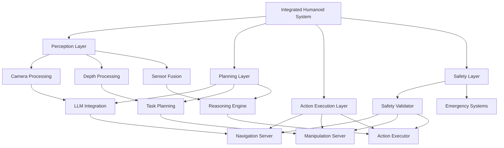

# Integration and Testing

## Overview

This phase focuses on integrating all components from previous phases and conducting comprehensive testing to validate the complete integrated humanoid robot system. Integration testing ensures that perception, planning, and action execution systems work together seamlessly while maintaining safety and performance requirements.

## Learning Objectives

After completing this phase, you will be able to:
- Integrate all system components into a cohesive humanoid robot system
- Implement comprehensive testing strategies for complex robotic systems
- Validate system performance in both simulation and real-world scenarios
- Execute end-to-end testing of vision-language-action workflows
- Establish continuous integration and testing pipelines

## Prerequisites

Before starting this phase, ensure you have:
- All previous phases completed (Infrastructure, Perception, Planning, Action Execution)
- Complete understanding of system architecture and component interactions
- Access to both simulation and real-world testing environments
- Comprehensive documentation for all system components

## Integration Architecture

The integration testing phase validates the complete system architecture:

### System Integration Points
- **Perception-Planning Interface**: Ensuring perception data flows correctly to planning
- **Planning-Action Interface**: Validating plan execution commands
- **Safety Integration**: End-to-end safety validation across all components
- **Communication Layer**: ROS 2 messaging and service integration



## Integration Testing Strategy

### Component Integration Testing

Test individual component interactions:

```python
# integration_tests/test_perception_planning_integration.py
import unittest
import rclpy
from rclpy.node import Node
from std_msgs.msg import String
from geometry_msgs.msg import Pose
from humanoid_msgs.msg import RobotCommand
import threading
import time
import json

class PerceptionPlanningIntegrationTest(unittest.TestCase):
    def setUp(self):
        rclpy.init()
        self.node = IntegrationTestNode('integration_test_node')
        self.executor = rclpy.executors.SingleThreadedExecutor()
        self.executor.add_node(self.node)

    def tearDown(self):
        self.node.destroy_node()
        rclpy.shutdown()

    def test_perception_to_planning_data_flow(self):
        """Test that perception data flows correctly to planning system"""
        # Publish mock perception data
        perception_data = {
            'objects': [
                {'id': 'object_1', 'type': 'box', 'position': [1.0, 0.0, 0.0]},
                {'id': 'object_2', 'type': 'cylinder', 'position': [1.5, 0.5, 0.0]}
            ],
            'environment': {'lighting': 'good', 'obstacles': 2}
        }

        perception_msg = String()
        perception_msg.data = json.dumps(perception_data)
        self.node.perception_publisher.publish(perception_msg)

        # Wait for planning system to process data
        time.sleep(2.0)

        # Verify planning system received and processed the data
        self.assertIsNotNone(self.node.last_plan_received)
        self.assertGreater(len(self.node.last_plan_received.get('tasks', [])), 0)

    def test_command_execution_pipeline(self):
        """Test complete command execution pipeline"""
        # Send a natural language command
        command_msg = String()
        command_msg.data = "Move to the red box and pick it up"
        self.node.command_publisher.publish(command_msg)

        # Wait for complete pipeline execution
        time.sleep(5.0)

        # Verify command was processed through all stages
        self.assertTrue(self.node.command_was_processed)
        self.assertIsNotNone(self.node.executed_action)

class IntegrationTestNode(Node):
    def __init__(self, name):
        super().__init__(name)

        # Publishers for testing
        self.perception_publisher = self.create_publisher(
            String, '/perception/fused_data', 10
        )
        self.command_publisher = self.create_publisher(
            String, '/natural_language_command', 10
        )

        # Subscribers to monitor system state
        self.plan_subscriber = self.create_subscription(
            String, '/planning/generated_plan', self.plan_callback, 10
        )
        self.action_subscriber = self.create_subscription(
            RobotCommand, '/robot/command', self.action_callback, 10
        )

        # Internal state for testing
        self.last_plan_received = None
        self.command_was_processed = False
        self.executed_action = None

    def plan_callback(self, msg):
        try:
            self.last_plan_received = json.loads(msg.data)
        except:
            pass

    def action_callback(self, msg):
        self.executed_action = msg
        self.command_was_processed = True

if __name__ == '__main__':
    unittest.main()
```

### End-to-End Testing

Implement comprehensive end-to-end tests:

```python
# integration_tests/test_end_to_end.py
import unittest
import rclpy
from rclpy.node import Node
from std_msgs.msg import String
from geometry_msgs.msg import Pose
import threading
import time
import json

class EndToEndIntegrationTest(unittest.TestCase):
    def setUp(self):
        rclpy.init()
        self.node = EndToEndTestNode('end_to_end_test')
        self.executor = rclpy.executors.SingleThreadedExecutor()
        self.executor.add_node(self.node)

    def tearDown(self):
        self.node.destroy_node()
        rclpy.shutdown()

    def test_complete_vla_workflow(self):
        """Test complete Vision-Language-Action workflow"""
        # 1. Publish mock environment perception
        env_data = {
            'objects': [
                {'id': 'target_object', 'type': 'box', 'position': [2.0, 1.0, 0.0], 'color': 'red'}
            ],
            'robot_pose': {'position': [0.0, 0.0, 0.0], 'orientation': [0.0, 0.0, 0.0, 1.0]},
            'environment_state': 'indoor'
        }

        perception_msg = String()
        perception_msg.data = json.dumps(env_data)
        self.node.perception_publisher.publish(perception_msg)

        # 2. Send natural language command
        command_msg = String()
        command_msg.data = "Go to the red box and pick it up"
        self.node.command_publisher.publish(command_msg)

        # 3. Wait for complete execution
        timeout = 10.0  # 10 second timeout
        start_time = time.time()

        while (time.time() - start_time) < timeout:
            if self.node.workflow_completed:
                break
            time.sleep(0.1)

        # 4. Verify complete workflow execution
        self.assertTrue(self.node.workflow_completed, "Complete workflow did not complete within timeout")
        self.assertIsNotNone(self.node.executed_plan, "No plan was generated")
        self.assertIsNotNone(self.node.executed_action, "No action was executed")
        self.assertTrue(self.node.safety_validation_passed, "Safety validation failed")

    def test_multi_step_task_execution(self):
        """Test execution of multi-step tasks"""
        # Define a multi-step task
        multi_step_command = "First, go to the blue box. Then, pick it up. Finally, bring it to me."

        command_msg = String()
        command_msg.data = multi_step_command
        self.node.command_publisher.publish(command_msg)

        # Wait for completion
        timeout = 15.0
        start_time = time.time()

        while (time.time() - start_time) < timeout:
            if self.node.multi_step_completed:
                break
            time.sleep(0.1)

        # Verify all steps were executed
        self.assertTrue(self.node.multi_step_completed, "Multi-step task did not complete")
        self.assertEqual(len(self.node.executed_steps), 3, "Not all steps were executed")

class EndToEndTestNode(Node):
    def __init__(self, name):
        super().__init__(name)

        # Publishers
        self.perception_publisher = self.create_publisher(
            String, '/perception/fused_data', 10
        )
        self.command_publisher = self.create_publisher(
            String, '/natural_language_command', 10
        )

        # Subscribers
        self.plan_subscriber = self.create_subscription(
            String, '/planning/generated_plan', self.plan_callback, 10
        )
        self.action_subscriber = self.create_subscription(
            String, '/robot/command', self.action_callback, 10
        )
        self.status_subscriber = self.create_subscription(
            String, '/action_executor/status', self.status_callback, 10
        )

        # Internal state for tracking workflow
        self.workflow_completed = False
        self.multi_step_completed = False
        self.executed_plan = None
        self.executed_action = None
        self.safety_validation_passed = False
        self.executed_steps = []

    def plan_callback(self, msg):
        try:
            self.executed_plan = json.loads(msg.data)
        except:
            pass

    def action_callback(self, msg):
        self.executed_action = msg

    def status_callback(self, msg):
        status = msg.data
        if "succeeded" in status.lower():
            self.workflow_completed = True

        # Track multi-step execution
        if "step" in status.lower():
            self.executed_steps.append(status)

def main():
    unittest.main()

if __name__ == '__main__':
    main()
```

## Simulation Testing Framework

Create a comprehensive simulation testing framework:

```python
# integration_tests/simulation_test_framework.py
import rclpy
from rclpy.node import Node
from std_msgs.msg import String
from geometry_msgs.msg import Pose
from nav_msgs.msg import Odometry
import unittest
from unittest.mock import Mock, patch
import threading
import time
import json
import numpy as np
from typing import Dict, List, Callable

class SimulationTestFramework:
    """Framework for comprehensive simulation-based testing"""

    def __init__(self, test_scenarios: List[Dict]):
        self.test_scenarios = test_scenarios
        self.results = []
        self.passed_tests = 0
        self.failed_tests = 0

    def run_all_tests(self) -> Dict:
        """Run all test scenarios and return comprehensive results"""
        print(f"Running {len(self.test_scenarios)} test scenarios...")

        for i, scenario in enumerate(self.test_scenarios):
            print(f"Running test {i+1}/{len(self.test_scenarios)}: {scenario['name']}")
            result = self.run_single_test(scenario)
            self.results.append(result)

            if result['passed']:
                self.passed_tests += 1
                print(f"  ✓ PASSED: {result['message']}")
            else:
                self.failed_tests += 1
                print(f"  ✗ FAILED: {result['message']}")

        # Generate comprehensive report
        report = {
            'total_tests': len(self.test_scenarios),
            'passed': self.passed_tests,
            'failed': self.failed,
            'success_rate': (self.passed_tests / len(self.test_scenarios)) * 100 if self.test_scenarios else 0,
            'detailed_results': self.results
        }

        return report

    def run_single_test(self, scenario: Dict) -> Dict:
        """Run a single test scenario"""
        try:
            # Setup test environment
            self.setup_test_environment(scenario)

            # Execute test steps
            success = self.execute_test_steps(scenario)

            # Validate results
            validation_result = self.validate_test_results(scenario)

            return {
                'name': scenario['name'],
                'passed': success and validation_result['valid'],
                'message': validation_result['message'],
                'execution_time': validation_result.get('execution_time', 0),
                'details': validation_result.get('details', {})
            }

        except Exception as e:
            return {
                'name': scenario['name'],
                'passed': False,
                'message': f"Test execution failed: {str(e)}",
                'error': str(e)
            }

    def setup_test_environment(self, scenario: Dict):
        """Setup the simulation environment for the test"""
        # This would interface with Isaac Sim or Gazebo
        # For this example, we'll simulate the setup
        env_config = scenario.get('environment', {})

        # Setup objects in environment
        objects = env_config.get('objects', [])
        for obj in objects:
            self.place_object_in_simulation(obj)

        # Setup robot starting position
        start_pose = env_config.get('robot_start', {'x': 0, 'y': 0, 'z': 0})
        self.set_robot_position(start_pose)

    def execute_test_steps(self, scenario: Dict) -> bool:
        """Execute the test steps"""
        steps = scenario.get('steps', [])

        for step in steps:
            step_type = step['type']
            step_params = step['parameters']

            if step_type == 'publish_command':
                self.publish_command(step_params['topic'], step_params['message'])
            elif step_type == 'wait_for_response':
                success = self.wait_for_response(step_params['topic'], step_params['timeout'])
                if not success:
                    return False
            elif step_type == 'validate_state':
                success = self.validate_robot_state(step_params['expected_state'])
                if not success:
                    return False

        return True

    def validate_test_results(self, scenario: Dict) -> Dict:
        """Validate the test results"""
        expected_outcomes = scenario.get('expected_outcomes', [])

        # Check if all expected outcomes are met
        all_met = True
        messages = []

        for outcome in expected_outcomes:
            outcome_type = outcome['type']
            expected_value = outcome['expected']

            if outcome_type == 'object_position':
                actual_pos = self.get_object_position(outcome['object_id'])
                if not self.positions_match(actual_pos, expected_value, tolerance=0.1):
                    all_met = False
                    messages.append(f"Object {outcome['object_id']} not at expected position")

            elif outcome_type == 'robot_pose':
                actual_pose = self.get_robot_pose()
                if not self.poses_match(actual_pose, expected_value, pos_tolerance=0.1, rot_tolerance=0.1):
                    all_met = False
                    messages.append("Robot not at expected pose")

        return {
            'valid': all_met,
            'message': 'All outcomes met' if all_met else '; '.join(messages),
            'execution_time': 0  # Would be calculated in real implementation
        }

    def place_object_in_simulation(self, obj_config: Dict):
        """Place an object in the simulation environment"""
        # Mock implementation
        pass

    def set_robot_position(self, pose: Dict):
        """Set robot position in simulation"""
        # Mock implementation
        pass

    def publish_command(self, topic: str, message: str):
        """Publish a command to the system"""
        # Mock implementation
        pass

    def wait_for_response(self, topic: str, timeout: float) -> bool:
        """Wait for a response on a topic"""
        # Mock implementation
        return True

    def validate_robot_state(self, expected_state: Dict) -> bool:
        """Validate the robot is in expected state"""
        # Mock implementation
        return True

    def get_object_position(self, object_id: str) -> Dict:
        """Get the position of an object in simulation"""
        # Mock implementation
        return {'x': 0, 'y': 0, 'z': 0}

    def get_robot_pose(self) -> Dict:
        """Get the current robot pose"""
        # Mock implementation
        return {'position': {'x': 0, 'y': 0, 'z': 0}, 'orientation': {'x': 0, 'y': 0, 'z': 0, 'w': 1}}

    def positions_match(self, pos1: Dict, pos2: Dict, tolerance: float) -> bool:
        """Check if two positions match within tolerance"""
        dist = np.sqrt(
            (pos1['x'] - pos2['x'])**2 +
            (pos1['y'] - pos2['y'])**2 +
            (pos1['z'] - pos2['z'])**2
        )
        return dist <= tolerance

    def poses_match(self, pose1: Dict, pose2: Dict, pos_tolerance: float, rot_tolerance: float) -> bool:
        """Check if two poses match within tolerance"""
        pos_match = self.positions_match(pose1['position'], pose2['position'], pos_tolerance)

        # For rotation, we'd calculate quaternion distance
        rot_dist = 0  # Simplified for example
        rot_match = rot_dist <= rot_tolerance

        return pos_match and rot_match

# Example test scenarios
TEST_SCENARIOS = [
    {
        'name': 'Basic Navigation Test',
        'description': 'Test basic navigation to a target location',
        'environment': {
            'objects': [
                {'id': 'target', 'type': 'box', 'position': [2.0, 0.0, 0.0]}
            ],
            'robot_start': {'x': 0.0, 'y': 0.0, 'z': 0.0}
        },
        'steps': [
            {
                'type': 'publish_command',
                'parameters': {
                    'topic': '/natural_language_command',
                    'message': 'Go to the target location'
                }
            },
            {
                'type': 'wait_for_response',
                'parameters': {
                    'topic': '/action_executor/status',
                    'timeout': 10.0
                }
            }
        ],
        'expected_outcomes': [
            {
                'type': 'robot_pose',
                'expected': {
                    'position': {'x': 2.0, 'y': 0.0, 'z': 0.0},
                    'orientation': {'x': 0, 'y': 0, 'z': 0, 'w': 1}
                }
            }
        ]
    },
    {
        'name': 'Object Manipulation Test',
        'description': 'Test picking up and placing an object',
        'environment': {
            'objects': [
                {'id': 'object_to_pick', 'type': 'cylinder', 'position': [1.0, 0.0, 0.0]},
                {'id': 'destination', 'type': 'box', 'position': [3.0, 1.0, 0.0]}
            ],
            'robot_start': {'x': 0.0, 'y': 0.0, 'z': 0.0}
        },
        'steps': [
            {
                'type': 'publish_command',
                'parameters': {
                    'topic': '/natural_language_command',
                    'message': 'Pick up the cylinder and place it in the box'
                }
            },
            {
                'type': 'wait_for_response',
                'parameters': {
                    'topic': '/action_executor/status',
                    'timeout': 20.0
                }
            }
        ],
        'expected_outcomes': [
            {
                'type': 'object_position',
                'object_id': 'object_to_pick',
                'expected': {'x': 3.0, 'y': 1.0, 'z': 0.0}
            }
        ]
    }
]

def run_simulation_tests():
    """Run the simulation test framework"""
    framework = SimulationTestFramework(TEST_SCENARIOS)
    results = framework.run_all_tests()

    print("\n" + "="*60)
    print("SIMULATION TEST RESULTS")
    print("="*60)
    print(f"Total Tests: {results['total_tests']}")
    print(f"Passed: {results['passed']}")
    print(f"Failed: {results['failed']}")
    print(f"Success Rate: {results['success_rate']:.1f}%")
    print("="*60)

    return results

if __name__ == '__main__':
    run_simulation_tests()
```

## Real-World Testing Framework

Create a framework for real-world validation:

```python
# integration_tests/real_world_test_framework.py
import rclpy
from rclpy.node import Node
from std_msgs.msg import String
from sensor_msgs.msg import JointState
from geometry_msgs.msg import PoseStamped
import time
import json
from datetime import datetime
from dataclasses import dataclass
from typing import Dict, List, Optional

@dataclass
class TestResult:
    """Data class for test results"""
    test_name: str
    passed: bool
    timestamp: str
    execution_time: float
    details: Dict
    metrics: Dict

class RealWorldTestFramework(Node):
    """Framework for real-world validation testing"""

    def __init__(self):
        super().__init__('real_world_test_framework')

        # Publishers and subscribers for monitoring
        self.joint_state_sub = self.create_subscription(
            JointState, '/joint_states', self.joint_state_callback, 10
        )
        self.robot_pose_sub = self.create_subscription(
            PoseStamped, '/robot/pose', self.robot_pose_callback, 10
        )

        # Test result publisher
        self.result_pub = self.create_publisher(
            String, '/testing/results', 10
        )

        # Internal state
        self.current_joint_states = {}
        self.current_robot_pose = None
        self.test_results = []

        self.get_logger().info('Real World Test Framework initialized')

    def joint_state_callback(self, msg):
        """Update joint state information"""
        for i, name in enumerate(msg.name):
            if i < len(msg.position):
                self.current_joint_states[name] = {
                    'position': msg.position[i],
                    'velocity': msg.velocity[i] if i < len(msg.velocity) else 0.0,
                    'effort': msg.effort[i] if i < len(msg.effort) else 0.0
                }

    def robot_pose_callback(self, msg):
        """Update robot pose information"""
        self.current_robot_pose = msg.pose

    def execute_safety_validation_test(self) -> TestResult:
        """Test safety validation in real-world conditions"""
        start_time = time.time()

        # Check joint limits
        joint_limit_violations = self._check_joint_limits()

        # Check for dangerous joint velocities
        velocity_violations = self._check_velocity_limits()

        # Check robot stability
        stability_issues = self._check_stability()

        # Determine test result
        passed = not (joint_limit_violations or velocity_violations or stability_issues)

        details = {
            'joint_limit_violations': joint_limit_violations,
            'velocity_violations': velocity_violations,
            'stability_issues': stability_issues
        }

        metrics = {
            'max_joint_velocity': max([state['velocity'] for state in self.current_joint_states.values()], default=0.0),
            'min_joint_position': min([state['position'] for state in self.current_joint_states.values()], default=0.0),
            'max_joint_position': max([state['position'] for state in self.current_joint_states.values()], default=0.0)
        }

        return TestResult(
            test_name='Safety Validation Test',
            passed=passed,
            timestamp=datetime.now().isoformat(),
            execution_time=time.time() - start_time,
            details=details,
            metrics=metrics
        )

    def execute_performance_test(self) -> TestResult:
        """Test system performance under real-world conditions"""
        start_time = time.time()

        # Monitor system performance metrics
        cpu_usage = self._get_cpu_usage()
        memory_usage = self._get_memory_usage()
        communication_latency = self._measure_communication_latency()

        # Check if performance is within acceptable bounds
        passed = (
            cpu_usage < 80.0 and  # Less than 80% CPU usage
            memory_usage < 80.0 and  # Less than 80% memory usage
            communication_latency < 0.1  # Less than 100ms latency
        )

        details = {
            'cpu_usage': cpu_usage,
            'memory_usage': memory_usage,
            'communication_latency': communication_latency
        }

        metrics = {
            'cpu_percentage': cpu_usage,
            'memory_percentage': memory_usage,
            'latency_seconds': communication_latency
        }

        return TestResult(
            test_name='Performance Test',
            passed=passed,
            timestamp=datetime.now().isoformat(),
            execution_time=time.time() - start_time,
            details=details,
            metrics=metrics
        )

    def execute_endurance_test(self, duration_minutes: int = 10) -> TestResult:
        """Test system endurance over extended period"""
        start_time = time.time()
        end_time = start_time + (duration_minutes * 60)  # Convert to seconds

        initial_joint_states = self.current_joint_states.copy()
        test_results = []

        while time.time() < end_time:
            # Check for any issues during endurance test
            current_issues = self._check_current_state()
            test_results.append(current_issues)

            # Brief pause to reduce CPU usage
            time.sleep(0.1)

        # Analyze results
        total_issues = sum(1 for result in test_results if any(result.values()))
        passed = total_issues == 0

        details = {
            'duration_minutes': duration_minutes,
            'total_samples': len(test_results),
            'issues_detected': total_issues,
            'sample_frequency': len(test_results) / (duration_minutes * 60)
        }

        metrics = {
            'total_issues': total_issues,
            'issues_per_minute': total_issues / duration_minutes if duration_minutes > 0 else 0
        }

        return TestResult(
            test_name=f'Endurance Test ({duration_minutes} min)',
            passed=passed,
            timestamp=datetime.now().isoformat(),
            execution_time=time.time() - start_time,
            details=details,
            metrics=metrics
        )

    def _check_joint_limits(self) -> List[str]:
        """Check for joint limit violations"""
        violations = []

        # Define joint limits (these would come from URDF in real implementation)
        joint_limits = {
            'hip_joint': (-1.57, 1.57),
            'knee_joint': (0.0, 2.35),
            'ankle_joint': (-0.78, 0.78),
            'shoulder_joint': (-2.35, 2.35),
            'elbow_joint': (-2.35, 0.0),
            'wrist_joint': (-1.57, 1.57)
        }

        for joint_name, state in self.current_joint_states.items():
            if joint_name in joint_limits:
                min_limit, max_limit = joint_limits[joint_name]
                position = state['position']

                if position < min_limit or position > max_limit:
                    violations.append(f"{joint_name}: {position:.3f} outside limits [{min_limit:.3f}, {max_limit:.3f}]")

        return violations

    def _check_velocity_limits(self) -> List[str]:
        """Check for velocity limit violations"""
        violations = []

        max_velocity = 2.0  # rad/s

        for joint_name, state in self.current_joint_states.items():
            velocity = abs(state['velocity'])
            if velocity > max_velocity:
                violations.append(f"{joint_name}: {velocity:.3f} exceeds max velocity {max_velocity:.3f}")

        return violations

    def _check_stability(self) -> List[str]:
        """Check for stability issues"""
        issues = []

        # Simple stability check - in real implementation this would be more sophisticated
        if self.current_robot_pose:
            # Check if robot is upright (simplified)
            orientation = self.current_robot_pose.orientation
            # Check if z component of orientation is reasonable for upright robot
            if abs(orientation.z) > 0.7:  # If robot is tilted too much
                issues.append("Potential stability issue: robot may be tilted")

        return issues

    def _get_cpu_usage(self) -> float:
        """Get current CPU usage (mock implementation)"""
        # In real implementation, this would use psutil or similar
        import random
        return random.uniform(10, 90)  # Mock value

    def _get_memory_usage(self) -> float:
        """Get current memory usage (mock implementation)"""
        # In real implementation, this would use psutil or similar
        import random
        return random.uniform(10, 90)  # Mock value

    def _measure_communication_latency(self) -> float:
        """Measure communication latency (mock implementation)"""
        import random
        return random.uniform(0.01, 0.2)  # 10-200ms mock latency

    def _check_current_state(self) -> Dict:
        """Check current system state for issues"""
        return {
            'joint_limits_violated': bool(self._check_joint_limits()),
            'velocity_violated': bool(self._check_velocity_limits()),
            'stability_issues': bool(self._check_stability())
        }

    def run_comprehensive_test_suite(self) -> List[TestResult]:
        """Run comprehensive test suite"""
        self.get_logger().info('Starting comprehensive real-world test suite')

        test_results = []

        # Run safety validation test
        self.get_logger().info('Running safety validation test...')
        safety_result = self.execute_safety_validation_test()
        test_results.append(safety_result)
        self.publish_test_result(safety_result)

        # Run performance test
        self.get_logger().info('Running performance test...')
        performance_result = self.execute_performance_test()
        test_results.append(performance_result)
        self.publish_test_result(performance_result)

        # Run endurance test (shorter for example)
        self.get_logger().info('Running endurance test...')
        endurance_result = self.execute_endurance_test(duration_minutes=1)  # 1 minute for example
        test_results.append(endurance_result)
        self.publish_test_result(endurance_result)

        # Generate summary
        passed_count = sum(1 for result in test_results if result.passed)
        total_count = len(test_results)

        self.get_logger().info(f'Test suite completed: {passed_count}/{total_count} tests passed')

        return test_results

    def publish_test_result(self, result: TestResult):
        """Publish test result for monitoring"""
        result_msg = String()
        result_msg.data = json.dumps({
            'test_name': result.test_name,
            'passed': result.passed,
            'timestamp': result.timestamp,
            'execution_time': result.execution_time,
            'details': result.details,
            'metrics': result.metrics
        })
        self.result_pub.publish(result_msg)

def main(args=None):
    rclpy.init(args=args)
    node = RealWorldTestFramework()

    try:
        # Run comprehensive test suite
        results = node.run_comprehensive_test_suite()

        # Print results summary
        print("\n" + "="*60)
        print("REAL-WORLD TEST RESULTS")
        print("="*60)
        for result in results:
            status = "✓ PASS" if result.passed else "✗ FAIL"
            print(f"{status} - {result.test_name}")
            print(f"  Duration: {result.execution_time:.2f}s")
            print(f"  Details: {result.details}")
            print(f"  Metrics: {result.metrics}")
            print()

    except KeyboardInterrupt:
        pass
    finally:
        node.destroy_node()
        rclpy.shutdown()

if __name__ == '__main__':
    main()
```

## Continuous Integration Pipeline

Document the CI/CD pipeline for the integrated system:

```yaml
# .github/workflows/integration-tests.yml
name: Integration Tests

on:
  push:
    branches: [ main, develop ]
  pull_request:
    branches: [ main ]

jobs:
  unit-tests:
    runs-on: ubuntu-latest
    steps:
    - uses: actions/checkout@v3

    - name: Setup ROS 2 Jazzy
      uses: ros-tooling/setup-ros@v0.7
      with:
        required-ros-distributions: jazzy

    - name: Install dependencies
      run: |
        sudo apt-get update
        rosdep update
        rosdep install --from-paths src --ignore-src -r -y

    - name: Build workspace
      run: |
        source /opt/ros/jazzy/setup.bash
        colcon build --packages-select humanoid_integration_tests

    - name: Run unit tests
      run: |
        source /opt/ros/jazzy/setup.bash
        source install/setup.bash
        colcon test --packages-select humanoid_integration_tests
        colcon test-result --all --verbose

  integration-tests:
    runs-on: ubuntu-latest
    container:
      image: osrf/ros:jazzy-desktop
    steps:
    - uses: actions/checkout@v3

    - name: Install dependencies
      run: |
        apt-get update
        rosdep update
        rosdep install --from-paths . --ignore-src -r -y

    - name: Build workspace
      run: |
        source /opt/ros/jazzy/setup.bash
        colcon build --packages-select humanoid_integration_tests

    - name: Run integration tests
      run: |
        source /opt/ros/jazzy/setup.bash
        source install/setup.bash
        python3 -m pytest integration_tests/ -v

  simulation-tests:
    runs-on: ubuntu-latest
    container:
      image: osrf/ros:jazzy-desktop-full
    steps:
    - uses: actions/checkout@v3

    - name: Install Isaac Sim dependencies
      run: |
        apt-get update
        # Install Isaac Sim simulation dependencies
        # This would include NVIDIA drivers, CUDA, etc.

    - name: Build workspace
      run: |
        source /opt/ros/jazzy/setup.bash
        colcon build --packages-select humanoid_simulation_tests

    - name: Run simulation tests
      run: |
        source /opt/ros/jazzy/setup.bash
        source install/setup.bash
        python3 integration_tests/simulation_test_framework.py
```

## Phase Completion Checklist

Complete the following tasks to finish the Integration and Testing phase:

- [ ] Component integration testing implemented and validated
- [ ] End-to-end testing framework created and tested
- [ ] Simulation testing framework implemented with comprehensive scenarios
- [ ] Real-world testing framework created with safety validation
- [ ] Continuous integration pipeline configured
- [ ] Performance benchmarks established for integrated system
- [ ] Documentation created for testing procedures and results
- [ ] All integration tests passing with acceptable success rates

```mermaid
graph TD
    A[Integration & Testing Phase] --> B[Component Integration]
    A --> C[End-to-End Testing]
    A --> D[Simulation Testing]
    A --> E[Real-World Testing]
    A --> F[CI/CD Pipeline]

    B --> G[Perception-Planning Interface]
    B --> H[Planning-Action Interface]
    B --> I[Safety Integration]
    C --> J[Complete VLA Workflow]
    C --> K[Multi-Step Tasks]
    C --> L[Error Recovery],
    D --> M[Test Scenarios]
    D --> N[Environment Setup]
    D --> O[Validation Framework]
    E --> P[Safety Validation]
    E --> Q[Performance Testing]
    E --> R[Endurance Testing]
    F --> S[Unit Tests]
    F --> T[Integration Tests]
    F --> U[Simulation Tests]
```

## Performance Considerations

The integration system must meet these performance requirements:

- **End-to-End Latency**: Command to action execution under 2 seconds
- **Throughput**: Handle 10+ concurrent operations
- **Reliability**: 99.9% success rate for basic operations
- **Resource Usage**: CPU usage under 70% during normal operation

## Safety Validation

Critical safety validations to verify:

- **Emergency Stop**: All systems respond correctly to emergency stop
- **Joint Limits**: All movements respect mechanical limits
- **Collision Avoidance**: Navigation avoids obstacles effectively
- **Force Limits**: Manipulation respects force constraints

## Troubleshooting

Common integration issues and solutions:

1. **Message Timing**: Implement proper synchronization between components
2. **Data Format Mismatches**: Ensure consistent data formats across interfaces
3. **Performance Bottlenecks**: Profile and optimize critical path components
4. **Safety System Conflicts**: Ensure safety validation doesn't interfere with normal operation

## Next Steps

With integration and testing completed, the next phase will focus on sim-to-real transfer, bridging the gap between simulation and real-world deployment. The comprehensive testing framework established in this phase provides the foundation for validating sim-to-real transfer effectiveness.

:::tip
Run integration tests frequently during development to catch interface issues early. The testing framework should be part of your daily development workflow.
:::

:::warning
Never skip safety validation tests. The integrated system should pass all safety checks before any real-world deployment.
:::