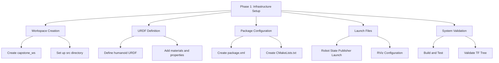

# Phase 1: Infrastructure Setup

## Overview

Phase 1 establishes the core infrastructure for the integrated humanoid robot system. This includes setting up the ROS 2 workspace, configuring the humanoid robot URDF model, and establishing the foundational packages that will support all subsequent phases.

## Learning Objectives

After completing Phase 1, you will be able to:
- Create and configure a ROS 2 workspace for humanoid robot development
- Set up and validate a humanoid robot URDF model
- Configure essential ROS 2 packages and dependencies
- Establish the development environment for subsequent phases

## Prerequisites

Before starting Phase 1, ensure you have:
- ROS 2 Jazzy Jalisco installed and configured
- Basic understanding of ROS 2 workspace structure (from Module 1)
- Access to a humanoid robot URDF model or ability to create one
- Development environment with appropriate permissions

## ROS 2 Workspace Setup

Create a new ROS 2 workspace specifically for the capstone project:

```bash
# Create the capstone workspace
mkdir -p ~/capstone_ws/src
cd ~/capstone_ws

# Source the ROS 2 installation
source /opt/ros/jazzy/setup.bash

# Build the workspace (initial empty build)
colcon build --symlink-install
```

### Workspace Structure

The workspace follows the standard ROS 2 structure with additional capstone-specific packages:

```
capstone_ws/
├── src/
│   ├── humanoid_bringup/          # Launch files and configurations
│   ├── humanoid_description/      # URDF and mesh files
│   ├── humanoid_control/          # Control configurations
│   ├── humanoid_perception/       # Perception configurations
│   └── humanoid_msgs/             # Custom message definitions
├── build/
├── install/
└── log/
```

## Humanoid Robot URDF Configuration

Create the humanoid robot URDF model in the `humanoid_description` package:

```xml
<!-- humanoid_description/urdf/humanoid_robot.urdf.xacro -->
<?xml version="1.0"?>
<robot xmlns:xacro="http://www.ros.org/wiki/xacro" name="humanoid_robot">

  <!-- Include gazebo plugins -->
  <xacro:include filename="$(find humanoid_description)/urdf/materials.xacro" />
  <xacro:include filename="$(find humanoid_description)/urdf/transmissions.xacro" />
  <xacro:include filename="$(find humanoid_description)/urdf/gazebo.xacro" />

  <!-- Base properties -->
  <xacro:property name="M_PI" value="3.1415926535897931" />

  <!-- Base link -->
  <link name="base_link">
    <visual>
      <geometry>
        <box size="0.3 0.2 0.1"/>
      </geometry>
      <material name="light_grey">
        <color rgba="0.8 0.8 0.8 1.0"/>
      </material>
    </visual>
    <collision>
      <geometry>
        <box size="0.3 0.2 0.1"/>
      </geometry>
    </collision>
    <inertial>
      <mass value="10.0" />
      <origin xyz="0 0 0" />
      <inertia ixx="0.1" ixy="0.0" ixz="0.0" iyy="0.2" iyz="0.0" izz="0.3" />
    </inertial>
  </link>

  <!-- Torso -->
  <joint name="torso_joint" type="fixed">
    <parent link="base_link"/>
    <child link="torso_link"/>
    <origin xyz="0 0 0.15" rpy="0 0 0"/>
  </joint>

  <link name="torso_link">
    <visual>
      <geometry>
        <box size="0.2 0.15 0.4"/>
      </geometry>
      <material name="grey">
        <color rgba="0.5 0.5 0.5 1.0"/>
      </material>
    </visual>
    <collision>
      <geometry>
        <box size="0.2 0.15 0.4"/>
      </geometry>
    </collision>
    <inertial>
      <mass value="8.0" />
      <origin xyz="0 0 0" />
      <inertia ixx="0.1" ixy="0.0" ixz="0.0" iyy="0.2" iyz="0.0" izz="0.3" />
    </inertial>
  </link>

  <!-- Head -->
  <joint name="neck_joint" type="revolute">
    <parent link="torso_link"/>
    <child link="head_link"/>
    <origin xyz="0 0 0.25" rpy="0 0 0"/>
    <axis xyz="0 1 0"/>
    <limit lower="${-M_PI/2}" upper="${M_PI/2}" effort="100" velocity="1.0"/>
  </joint>

  <link name="head_link">
    <visual>
      <geometry>
        <sphere radius="0.1"/>
      </geometry>
      <material name="skin">
        <color rgba="0.9 0.8 0.7 1.0"/>
      </material>
    </visual>
    <collision>
      <geometry>
        <sphere radius="0.1"/>
      </geometry>
    </collision>
    <inertial>
      <mass value="2.0" />
      <origin xyz="0 0 0" />
      <inertia ixx="0.01" ixy="0.0" ixz="0.0" iyy="0.01" iyz="0.0" izz="0.01" />
    </inertial>
  </link>

  <!-- Left Arm -->
  <joint name="left_shoulder_joint" type="revolute">
    <parent link="torso_link"/>
    <child link="left_upper_arm_link"/>
    <origin xyz="0.15 0.05 0.1" rpy="0 0 0"/>
    <axis xyz="0 1 0"/>
    <limit lower="${-M_PI/2}" upper="${M_PI/2}" effort="50" velocity="1.0"/>
  </joint>

  <link name="left_upper_arm_link">
    <visual>
      <geometry>
        <cylinder length="0.3" radius="0.05"/>
      </geometry>
      <material name="arm_color">
        <color rgba="0.6 0.6 0.8 1.0"/>
      </material>
    </visual>
    <collision>
      <geometry>
        <cylinder length="0.3" radius="0.05"/>
      </geometry>
    </collision>
    <inertial>
      <mass value="1.5" />
      <origin xyz="0 0 -0.15" />
      <inertia ixx="0.01" ixy="0.0" ixz="0.0" iyy="0.01" iyz="0.0" izz="0.001" />
    </inertial>
  </link>

  <!-- Continue with more links and joints for complete humanoid model -->

</robot>
```

## Package Dependencies

Create a `package.xml` file for the humanoid_description package:

```xml
<?xml version="1.0"?>
<?xml-model href="http://download.ros.org/schema/package_format3.xsd" schematypens="http://www.w3.org/2001/XMLSchema"?>
<package format="3">
  <name>humanoid_description</name>
  <version>0.0.1</version>
  <description>URDF description for humanoid robot</description>
  <maintainer email="developer@example.com">Developer</maintainer>
  <license>Apache-2.0</license>

  <buildtool_depend>ament_cmake</buildtool_depend>

  <exec_depend>robot_state_publisher</exec_depend>
  <exec_depend>rviz2</exec_depend>
  <exec_depend>xacro</exec_depend>

  <test_depend>ament_lint_auto</test_depend>
  <test_depend>ament_lint_common</test_depend>

  <export>
    <build_type>ament_cmake</build_type>
  </export>
</package>
```

And create a CMakeLists.txt file:

```cmake
cmake_minimum_required(VERSION 3.8)
project(humanoid_description)

if(CMAKE_COMPILER_IS_GNUCXX OR CMAKE_CXX_COMPILER_ID MATCHES "Clang")
  add_compile_options(-Wall -Wextra -Wpedantic)
endif()

# find dependencies
find_package(ament_cmake REQUIRED)

install(DIRECTORY
  launch
  meshes
  rviz
  urdf
  DESTINATION share/${PROJECT_NAME}
)

if(BUILD_TESTING)
  find_package(ament_lint_auto REQUIRED)
  set(ament_cmake_copyright_FOUND TRUE)
  set(ament_cmake_flake8_FOUND TRUE)
  set(ament_cmake_pep257_FOUND TRUE)
  ament_lint_auto_find_test_dependencies()
endif()

ament_package()
```

## Robot State Publisher Configuration

Create a launch file to visualize the robot:

```python
# humanoid_description/launch/robot_state_publisher.launch.py
import os
from ament_index_python.packages import get_package_share_directory
from launch import LaunchDescription
from launch.substitutions import LaunchConfiguration
from launch.actions import DeclareLaunchArgument
from launch_ros.actions import Node

def generate_launch_description():
    use_sim_time = LaunchConfiguration('use_sim_time')

    # Declare launch arguments
    declare_use_sim_time = DeclareLaunchArgument(
        'use_sim_time',
        default_value='false',
        description='Use simulation (Gazebo) clock if true'
    )

    # Get URDF file path
    urdf_file = os.path.join(
        get_package_share_directory('humanoid_description'),
        'urdf',
        'humanoid_robot.urdf.xacro'
    )

    # Robot state publisher node
    robot_state_publisher = Node(
        package='robot_state_publisher',
        executable='robot_state_publisher',
        name='robot_state_publisher',
        output='screen',
        parameters=[{
            'use_sim_time': use_sim_time,
            'robot_description': open(urdf_file).read()
        }]
    )

    # Joint state publisher GUI (for testing)
    joint_state_publisher_gui = Node(
        package='joint_state_publisher_gui',
        executable='joint_state_publisher_gui',
        name='joint_state_publisher_gui',
        output='screen'
    )

    # RViz2 node
    rviz2 = Node(
        package='rviz2',
        executable='rviz2',
        name='rviz2',
        arguments=['-d', os.path.join(
            get_package_share_directory('humanoid_description'),
            'rviz',
            'urdf_config.rviz'
        )],
        output='screen'
    )

    return LaunchDescription([
        declare_use_sim_time,
        robot_state_publisher,
        joint_state_publisher_gui,
        rviz2
    ])
```

## Essential Configuration Files

Create the necessary configuration files for the robot:

```yaml
# humanoid_control/config/humanoid_control.yaml
controller_manager:
  ros__parameters:
    update_rate: 100  # Hz

    # Joint state broadcaster
    joint_state_broadcaster:
      type: joint_state_broadcaster/JointStateBroadcaster

    # Position controllers for humanoid joints
    torso_controller:
      type: position_controllers/JointGroupPositionController

    neck_controller:
      type: position_controllers/JointGroupPositionController

    left_arm_controller:
      type: position_controllers/JointGroupPositionController

    right_arm_controller:
      type: position_controllers/JointGroupPositionController

    left_leg_controller:
      type: position_controllers/JointGroupPositionController

    right_leg_controller:
      type: position_controllers/JointGroupPositionController
```

## System Validation

Validate the infrastructure setup by running these commands:

```bash
# Build the workspace
cd ~/capstone_ws
colcon build --packages-select humanoid_description

# Source the workspace
source install/setup.bash

# Launch the robot state publisher
ros2 launch humanoid_description robot_state_publisher.launch.py

# In another terminal, check that the robot description is published
ros2 param list | grep robot_description

# Verify TF tree
ros2 run tf2_tools view_frames
```

## Phase 1 Completion Checklist

Complete the following tasks to finish Phase 1:

- [ ] ROS 2 workspace created with proper structure
- [ ] Humanoid URDF model defined and validated
- [ ] Robot state publisher configured and working
- [ ] TF tree properly established
- [ ] Launch files created and tested
- [ ] All dependencies properly declared in package.xml
- [ ] CMakeLists.txt properly configured
- [ ] Robot model visualizes correctly in RViz



## Troubleshooting

Common issues and solutions:

1. **URDF parsing errors**: Check XML syntax and xacro includes
2. **TF tree not showing**: Verify robot_state_publisher is running
3. **Package not found**: Ensure workspace is sourced with `source install/setup.bash`
4. **Joint limits exceeded**: Check joint limit values in URDF

## Next Steps

With the infrastructure in place, Phase 2 will focus on implementing the perception system, including sensor integration and synthetic data pipeline. The foundation established in Phase 1 will support all subsequent development phases.

:::tip
Keep detailed notes about your URDF configuration, as you'll need to reference it in later phases when implementing control and perception systems.
:::

:::info
The URDF model created in this phase will be extended in later phases with additional sensors, controllers, and simulation-specific elements.
:::