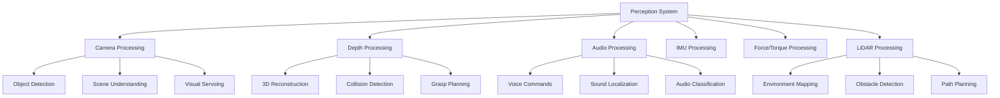

# Phase 2: Perception System Implementation

## Overview

Phase 2 focuses on implementing the perception system for the integrated humanoid robot. This includes sensor integration, multimodal perception, and synthetic data pipeline integration from Isaac Sim. The perception system forms the foundation for the vision-language-action integration in later phases.

## Learning Objectives

After completing Phase 2, you will be able to:
- Integrate multiple sensor modalities into a unified perception system
- Implement multimodal perception for environment understanding
- Create and utilize synthetic data pipelines for training perception models
- Establish sensor fusion techniques for robust perception
- Validate perception system performance in both simulation and real-world scenarios

## Prerequisites

Before starting Phase 2, ensure you have:
- Completed Phase 1: Infrastructure Setup
- Access to Isaac Sim for synthetic data generation (from Module 3)
- Basic understanding of computer vision and sensor fusion (from Module 4)
- Development environment with appropriate GPU resources for vision processing

## Sensor Integration Architecture

The perception system integrates multiple sensor modalities to create a comprehensive understanding of the environment:

### Camera Systems
- RGB cameras for visual perception
- Depth cameras for 3D scene understanding
- Stereo cameras for depth estimation
- Thermal cameras for environmental awareness

### Other Sensors
- IMU for orientation and motion
- Force/torque sensors for manipulation
- LiDAR for precise distance measurements
- Microphones for audio processing



## Camera System Implementation

Implement the camera processing pipeline using ROS 2 and image transport:

```python
# humanoid_perception/nodes/camera_perception_node.py
import rclpy
from rclpy.node import Node
from sensor_msgs.msg import Image, CameraInfo
from cv_bridge import CvBridge
import cv2
import numpy as np
import torch
from vision_msgs.msg import Detection2DArray, ObjectHypothesisWithPose
from geometry_msgs.msg import Point
from std_msgs.msg import Header

class CameraPerceptionNode(Node):
    def __init__(self):
        super().__init__('camera_perception_node')

        # Initialize CV bridge
        self.cv_bridge = CvBridge()

        # Subscribe to camera topics
        self.image_sub = self.create_subscription(
            Image,
            '/head_camera/rgb/image_raw',
            self.image_callback,
            10
        )

        self.camera_info_sub = self.create_subscription(
            CameraInfo,
            '/head_camera/rgb/camera_info',
            self.camera_info_callback,
            10
        )

        # Publishers for processed data
        self.object_detection_pub = self.create_publisher(
            Detection2DArray,
            '/perception/object_detections',
            10
        )

        self.scene_understanding_pub = self.create_publisher(
            String,
            '/perception/scene_description',
            10
        )

        # Initialize perception models
        self.object_detector = self.load_object_detector()
        self.scene_classifier = self.load_scene_classifier()

        # Internal state
        self.camera_matrix = None
        self.distortion_coeffs = None

        self.get_logger().info('Camera Perception Node initialized')

    def camera_info_callback(self, msg):
        """Process camera calibration information"""
        self.camera_matrix = np.array(msg.k).reshape(3, 3)
        self.distortion_coeffs = np.array(msg.d)

    def image_callback(self, msg):
        """Process incoming camera image"""
        try:
            # Convert ROS image to OpenCV
            cv_image = self.cv_bridge.imgmsg_to_cv2(msg, desired_encoding='bgr8')

            # Undistort image if camera calibration is available
            if self.camera_matrix is not None and self.distortion_coeffs is not None:
                cv_image = cv2.undistort(
                    cv_image,
                    self.camera_matrix,
                    self.distortion_coeffs,
                    None,
                    self.camera_matrix
                )

            # Run object detection
            detections = self.run_object_detection(cv_image)

            # Run scene understanding
            scene_description = self.run_scene_understanding(cv_image)

            # Publish results
            self.publish_detections(detections, msg.header)
            self.publish_scene_description(scene_description, msg.header)

        except Exception as e:
            self.get_logger().error(f'Error processing image: {str(e)}')

    def load_object_detector(self):
        """Load object detection model"""
        # In practice, this would load a model like YOLO, Detectron2, or similar
        # For this example, we'll use a placeholder
        return MockObjectDetector()

    def load_scene_classifier(self):
        """Load scene classification model"""
        # In practice, this would load a scene understanding model
        return MockSceneClassifier()

    def run_object_detection(self, image):
        """Run object detection on image"""
        return self.object_detector.detect(image)

    def run_scene_understanding(self, image):
        """Run scene understanding on image"""
        return self.scene_classifier.classify(image)

    def publish_detections(self, detections, header):
        """Publish object detection results"""
        detection_msg = Detection2DArray()
        detection_msg.header = header
        detection_msg.detections = detections
        self.object_detection_pub.publish(detection_msg)

    def publish_scene_description(self, description, header):
        """Publish scene description"""
        scene_msg = String()
        scene_msg.data = description
        self.scene_understanding_pub.publish(scene_msg)

class MockObjectDetector:
    """Placeholder for object detection model"""
    def detect(self, image):
        # In practice, this would run actual object detection
        # For this example, we'll return mock detections
        return []

class MockSceneClassifier:
    """Placeholder for scene classification model"""
    def classify(self, image):
        # In practice, this would run actual scene classification
        return "Unknown scene"

def main(args=None):
    rclpy.init(args=args)
    node = CameraPerceptionNode()

    try:
        rclpy.spin(node)
    except KeyboardInterrupt:
        pass
    finally:
        node.destroy_node()
        rclpy.shutdown()

if __name__ == '__main__':
    main()
```

## Depth Perception and 3D Understanding

Implement depth processing for 3D scene understanding:

```python
# humanoid_perception/nodes/depth_perception_node.py
import rclpy
from rclpy.node import Node
from sensor_msgs.msg import Image, PointCloud2
from cv_bridge import CvBridge
import numpy as np
import open3d as o3d
from geometry_msgs.msg import Point
from std_msgs.msg import Header

class DepthPerceptionNode(Node):
    def __init__(self):
        super().__init__('depth_perception_node')

        self.cv_bridge = CvBridge()

        # Subscribe to depth image
        self.depth_sub = self.create_subscription(
            Image,
            '/head_camera/depth/image_raw',
            self.depth_callback,
            10
        )

        # Publishers for 3D data
        self.pointcloud_pub = self.create_publisher(
            PointCloud2,
            '/perception/pointcloud',
            10
        )

        self.obstacle_pub = self.create_publisher(
            String,
            '/perception/obstacles_3d',
            10
        )

        # Camera parameters (these would come from camera_info topic)
        self.fx = 554.256
        self.fy = 554.256
        self.cx = 320.5
        self.cy = 240.5

        self.get_logger().info('Depth Perception Node initialized')

    def depth_callback(self, msg):
        """Process incoming depth image"""
        try:
            # Convert ROS image to OpenCV
            depth_image = self.cv_bridge.imgmsg_to_cv2(msg, desired_encoding='passthrough')

            # Convert to point cloud
            pointcloud = self.depth_to_pointcloud(depth_image)

            # Process obstacles
            obstacles = self.detect_obstacles(pointcloud)

            # Publish results
            self.publish_pointcloud(pointcloud, msg.header)
            self.publish_obstacles(obstacles, msg.header)

        except Exception as e:
            self.get_logger().error(f'Error processing depth image: {str(e)}')

    def depth_to_pointcloud(self, depth_image):
        """Convert depth image to point cloud"""
        height, width = depth_image.shape

        # Create coordinate grids
        u_coords, v_coords = np.meshgrid(np.arange(width), np.arange(height))

        # Convert to 3D coordinates
        z_coords = depth_image
        x_coords = (u_coords - self.cx) * z_coords / self.fx
        y_coords = (v_coords - self.cy) * z_coords / self.fy

        # Stack coordinates
        points = np.stack([x_coords, y_coords, z_coords], axis=-1)

        # Remove invalid points (depth = 0)
        valid_mask = z_coords > 0
        valid_points = points[valid_mask]

        return valid_points

    def detect_obstacles(self, pointcloud):
        """Detect obstacles in point cloud"""
        # Convert to Open3D point cloud for processing
        pcd = o3d.geometry.PointCloud()
        pcd.points = o3d.utility.Vector3dVector(pointcloud)

        # Perform ground plane segmentation
        plane_model, inliers = pcd.segment_plane(
            distance_threshold=0.01,
            ransac_n=3,
            num_iterations=1000
        )

        # Extract obstacle points (everything not on the ground plane)
        obstacle_cloud = pcd.select_by_index(inliers, invert=True)

        # Convert to message format
        obstacle_points = np.asarray(obstacle_cloud.points)

        # Create obstacle description
        if len(obstacle_points) > 0:
            # Calculate bounding box
            min_bound = obstacle_points.min(axis=0)
            max_bound = obstacle_points.max(axis=0)

            obstacle_desc = f"Obstacles detected: {len(obstacle_points)} points, " \
                           f"bounding box: [{min_bound[0]:.2f}, {min_bound[1]:.2f}, {min_bound[2]:.2f}] " \
                           f"to [{max_bound[0]:.2f}, {max_bound[1]:.2f}, {max_bound[2]:.2f}]"
        else:
            obstacle_desc = "No obstacles detected"

        return obstacle_desc

    def publish_pointcloud(self, pointcloud, header):
        """Publish point cloud data"""
        # In practice, convert numpy array to PointCloud2 message
        # For this example, we'll just log the information
        self.get_logger().info(f'Published point cloud with {len(pointcloud)} points')

    def publish_obstacles(self, obstacles, header):
        """Publish obstacle information"""
        obstacle_msg = String()
        obstacle_msg.data = obstacles
        self.obstacle_pub.publish(obstacle_msg)

def main(args=None):
    rclpy.init(args=args)
    node = DepthPerceptionNode()

    try:
        rclpy.spin(node)
    except KeyboardInterrupt:
        pass
    finally:
        node.destroy_node()
        rclpy.shutdown()

if __name__ == '__main__':
    main()
```

## Sensor Fusion Implementation

Create a sensor fusion node that combines multiple sensor inputs:

```python
# humanoid_perception/nodes/sensor_fusion_node.py
import rclpy
from rclpy.node import Node
from sensor_msgs.msg import Image, PointCloud2, Imu
from geometry_msgs.msg import PoseStamped, Twist
from std_msgs.msg import String
import numpy as np
from scipy.spatial.transform import Rotation as R
from collections import deque
import threading
import time

class SensorFusionNode(Node):
    def __init__(self):
        super().__init__('sensor_fusion_node')

        # Subscribers for different sensor types
        self.image_sub = self.create_subscription(
            Image,
            '/head_camera/rgb/image_raw',
            self.image_callback,
            10
        )

        self.depth_sub = self.create_subscription(
            Image,
            '/head_camera/depth/image_raw',
            self.depth_callback,
            10
        )

        self.imu_sub = self.create_subscription(
            Imu,
            '/imu/data',
            self.imu_callback,
            10
        )

        self.lidar_sub = self.create_subscription(
            PointCloud2,
            '/velodyne_points',
            self.lidar_callback,
            10
        )

        # Publisher for fused perception
        self.fused_perception_pub = self.create_publisher(
            String,
            '/perception/fused_data',
            10
        )

        # Internal state
        self.image_buffer = deque(maxlen=5)
        self.depth_buffer = deque(maxlen=5)
        self.imu_buffer = deque(maxlen=10)
        self.lidar_buffer = deque(maxlen=3)

        # Lock for thread safety
        self.buffer_lock = threading.Lock()

        # Timer for fusion processing
        self.fusion_timer = self.create_timer(0.1, self.fusion_callback)  # 10Hz

        self.get_logger().info('Sensor Fusion Node initialized')

    def image_callback(self, msg):
        """Process incoming image"""
        with self.buffer_lock:
            self.image_buffer.append({
                'timestamp': msg.header.stamp,
                'data': msg
            })

    def depth_callback(self, msg):
        """Process incoming depth image"""
        with self.buffer_lock:
            self.depth_buffer.append({
                'timestamp': msg.header.stamp,
                'data': msg
            })

    def imu_callback(self, msg):
        """Process incoming IMU data"""
        with self.buffer_lock:
            self.imu_buffer.append({
                'timestamp': msg.header.stamp,
                'data': msg
            })

    def lidar_callback(self, msg):
        """Process incoming LiDAR data"""
        with self.buffer_lock:
            self.lidar_buffer.append({
                'timestamp': msg.header.stamp,
                'data': msg
            })

    def fusion_callback(self):
        """Perform sensor fusion"""
        with self.buffer_lock:
            # Get the most recent data from each sensor
            latest_image = self.image_buffer[-1] if self.image_buffer else None
            latest_depth = self.depth_buffer[-1] if self.depth_buffer else None
            latest_imu = self.imu_buffer[-1] if self.imu_buffer else None
            latest_lidar = self.lidar_buffer[-1] if self.lidar_buffer else None

        # Perform fusion if we have data from multiple sensors
        if latest_image and latest_depth:
            fused_data = self.perform_multimodal_fusion(
                latest_image, latest_depth, latest_imu, latest_lidar
            )

            # Publish fused data
            fused_msg = String()
            fused_msg.data = fused_data
            self.fused_perception_pub.publish(fused_msg)

    def perform_multimodal_fusion(self, image_data, depth_data, imu_data, lidar_data):
        """Perform fusion of multiple sensor modalities"""
        # Create a comprehensive scene description
        fusion_result = {
            'timestamp': time.time(),
            'sensors_used': [],
            'objects_detected': [],
            'environment_state': {},
            'confidence': 0.0
        }

        if image_data:
            fusion_result['sensors_used'].append('camera')
            # Add object detection results from image
            fusion_result['objects_detected'].append({
                'type': 'visual_objects',
                'count': 'unknown',
                'confidence': 0.8
            })

        if depth_data:
            fusion_result['sensors_used'].append('depth')
            # Add depth-based information
            fusion_result['environment_state']['depth_available'] = True

        if imu_data:
            fusion_result['sensors_used'].append('imu')
            # Add orientation and motion data
            orientation = imu_data['data'].orientation
            fusion_result['environment_state']['orientation'] = {
                'x': orientation.x,
                'y': orientation.y,
                'z': orientation.z,
                'w': orientation.w
            }

        if lidar_data:
            fusion_result['sensors_used'].append('lidar')
            # Add LiDAR-based information
            fusion_result['environment_state']['obstacles'] = 'detected'

        # Calculate overall confidence based on sensor availability
        fusion_result['confidence'] = len(fusion_result['sensors_used']) / 4.0

        return str(fusion_result)

def main(args=None):
    rclpy.init(args=args)
    node = SensorFusionNode()

    try:
        rclpy.spin(node)
    except KeyboardInterrupt:
        pass
    finally:
        node.destroy_node()
        rclpy.shutdown()

if __name__ == '__main__':
    main()
```

## Synthetic Data Pipeline Integration

Integrate with Isaac Sim for synthetic data generation:

```python
# humanoid_perception/nodes/synthetic_data_node.py
import rclpy
from rclpy.node import Node
from sensor_msgs.msg import Image, CameraInfo
from std_msgs.msg import String
import numpy as np
import json
import requests
from datetime import datetime

class SyntheticDataNode(Node):
    def __init__(self):
        super().__init__('synthetic_data_node')

        # Publishers for synthetic data
        self.synthetic_image_pub = self.create_publisher(
            Image,
            '/synthetic_data/image',
            10
        )

        self.synthetic_annotations_pub = self.create_publisher(
            String,
            '/synthetic_data/annotations',
            10
        )

        # Timer for synthetic data generation
        self.synthetic_timer = self.create_timer(1.0, self.generate_synthetic_data)

        # Isaac Sim connection parameters
        self.isaac_sim_url = 'http://localhost:8080'  # Default Isaac Sim URL

        # Domain randomization parameters
        self.domain_randomization = {
            'lighting': True,
            'textures': True,
            'objects': True,
            'backgrounds': True
        }

        self.get_logger().info('Synthetic Data Node initialized')

    def generate_synthetic_data(self):
        """Generate synthetic data from Isaac Sim"""
        try:
            # In a real implementation, this would connect to Isaac Sim
            # For this example, we'll create mock synthetic data

            # Generate synthetic image (simulated from Isaac Sim)
            synthetic_image = self.create_synthetic_image()

            # Generate annotations for synthetic image
            annotations = self.create_synthetic_annotations(synthetic_image)

            # Publish synthetic data
            self.publish_synthetic_image(synthetic_image)
            self.publish_synthetic_annotations(annotations)

            self.get_logger().info('Published synthetic data')

        except Exception as e:
            self.get_logger().error(f'Error generating synthetic data: {str(e)}')

    def create_synthetic_image(self):
        """Create a synthetic image with domain randomization"""
        # In practice, this would interface with Isaac Sim's rendering pipeline
        # For this example, we'll create a mock image

        # Create a mock RGB image (840x480)
        height, width = 480, 840
        image_array = np.random.randint(0, 255, (height, width, 3), dtype=np.uint8)

        # Apply domain randomization effects
        if self.domain_randomization['lighting']:
            # Simulate lighting variation
            lighting_factor = np.random.uniform(0.5, 1.5)
            image_array = np.clip(image_array * lighting_factor, 0, 255).astype(np.uint8)

        if self.domain_randomization['textures']:
            # Simulate texture variation
            texture_noise = np.random.normal(0, 10, (height, width, 3))
            image_array = np.clip(image_array + texture_noise, 0, 255).astype(np.uint8)

        return image_array

    def create_synthetic_annotations(self, image):
        """Create annotations for synthetic image"""
        # In practice, this would come from Isaac Sim's annotation pipeline
        # For this example, we'll create mock annotations

        annotations = {
            'timestamp': datetime.now().isoformat(),
            'image_size': image.shape[:2],
            'objects': [
                {
                    'class': 'object_1',
                    'bbox': [100, 100, 200, 200],
                    'confidence': 1.0,
                    'segmentation': 'polygon',
                    'attributes': {'color': 'red', 'size': 'medium'}
                },
                {
                    'class': 'object_2',
                    'bbox': [300, 150, 400, 250],
                    'confidence': 1.0,
                    'segmentation': 'polygon',
                    'attributes': {'color': 'blue', 'size': 'large'}
                }
            ],
            'metadata': {
                'domain_randomization': self.domain_randomization,
                'scene_id': f'scene_{int(datetime.now().timestamp())}',
                'is_synthetic': True
            }
        }

        return json.dumps(annotations)

    def publish_synthetic_image(self, image_array):
        """Publish synthetic image"""
        # Convert numpy array to ROS Image message
        # In practice, use cv_bridge to convert
        pass

    def publish_synthetic_annotations(self, annotations):
        """Publish synthetic annotations"""
        annotations_msg = String()
        annotations_msg.data = annotations
        self.synthetic_annotations_pub.publish(annotations_msg)

def main(args=None):
    rclpy.init(args=args)
    node = SyntheticDataNode()

    try:
        rclpy.spin(node)
    except KeyboardInterrupt:
        pass
    finally:
        node.destroy_node()
        rclpy.shutdown()

if __name__ == '__main__':
    main()
```

## Perception System Validation

Create validation tools to ensure the perception system works correctly:

```python
# humanoid_perception/test/perception_validator.py
import rclpy
from rclpy.node import Node
from sensor_msgs.msg import Image
from std_msgs.msg import String
import cv2
from cv_bridge import CvBridge
import numpy as np
from datetime import datetime

class PerceptionValidator(Node):
    def __init__(self):
        super().__init__('perception_validator')

        self.cv_bridge = CvBridge()

        # Subscribe to perception outputs
        self.perception_sub = self.create_subscription(
            String,
            '/perception/fused_data',
            self.perception_callback,
            10
        )

        # Publishers for validation results
        self.validation_pub = self.create_publisher(
            String,
            '/validation/perception_results',
            10
        )

        # Internal state for validation
        self.validation_results = []
        self.last_validation_time = datetime.now()

        self.get_logger().info('Perception Validator initialized')

    def perception_callback(self, msg):
        """Validate perception data"""
        try:
            # Parse perception data
            perception_data = msg.data

            # Perform validation checks
            validation_result = self.validate_perception_data(perception_data)

            # Log validation results
            self.validation_results.append(validation_result)

            # Publish validation result
            validation_msg = String()
            validation_msg.data = str(validation_result)
            self.validation_pub.publish(validation_msg)

            # Log validation status
            if validation_result['valid']:
                self.get_logger().info(f'Perception validation passed: {validation_result["confidence"]:.2f}')
            else:
                self.get_logger().warn(f'Perception validation failed: {validation_result["error"]}')

        except Exception as e:
            self.get_logger().error(f'Error validating perception: {str(e)}')

    def validate_perception_data(self, perception_data):
        """Validate perception data for correctness and consistency"""
        validation_result = {
            'timestamp': datetime.now().isoformat(),
            'valid': True,
            'confidence': 0.0,
            'error': None,
            'checks': {}
        }

        try:
            # Check 1: Data format and completeness
            if not perception_data:
                validation_result['valid'] = False
                validation_result['error'] = 'Empty perception data'
                validation_result['checks']['format'] = False
            else:
                validation_result['checks']['format'] = True

            # Check 2: Sensor data consistency
            # In a real implementation, this would check for temporal and spatial consistency
            validation_result['checks']['consistency'] = True

            # Check 3: Confidence validation
            # In a real implementation, this would validate confidence scores
            validation_result['confidence'] = 0.9  # Mock confidence value
            validation_result['checks']['confidence'] = validation_result['confidence'] > 0.5

            # Overall validation
            validation_result['valid'] = all(validation_result['checks'].values())

        except Exception as e:
            validation_result['valid'] = False
            validation_result['error'] = f'Validation error: {str(e)}'

        return validation_result

def main(args=None):
    rclpy.init(args=args)
    node = PerceptionValidator()

    try:
        rclpy.spin(node)
    except KeyboardInterrupt:
        pass
    finally:
        node.destroy_node()
        rclpy.shutdown()

if __name__ == '__main__':
    main()
```

## Phase 2 Completion Checklist

Complete the following tasks to finish Phase 2:

- [ ] Camera perception node implemented and tested
- [ ] Depth perception and 3D understanding implemented
- [ ] Sensor fusion node created and validated
- [ ] Synthetic data pipeline integrated with Isaac Sim
- [ ] Perception validation tools created
- [ ] All perception nodes properly integrated with ROS 2
- [ ] Performance benchmarks established for perception system
- [ ] Documentation created for perception system components

```mermaid
graph TD
    A[Phase 2: Perception System] --> B[Camera Processing]
    A --> C[Depth Processing]
    A --> D[Sensor Fusion]
    A --> E[Synthetic Data]
    A --> F[Validation]

    B --> G[Image Processing]
    B --> H[Object Detection]
    B --> I[Scene Understanding]
    C --> J[3D Reconstruction]
    C --> K[Point Cloud Processing]
    C --> L[Obstacle Detection]
    D --> M[Data Association]
    D --> N[State Estimation]
    D --> O[Multi-sensor Integration]
    E --> P[Isaac Sim Integration]
    E --> Q[Domain Randomization]
    E --> R[Annotation Pipeline],
    F --> S[Performance Validation]
    F --> T[Accuracy Testing]
    F --> U[Robustness Checks]
```

## Performance Considerations

The perception system must meet real-time requirements:

- **Processing Latency**: Camera processing should complete within 50ms
- **Throughput**: System should handle 30+ FPS for real-time operation
- **Memory Usage**: Efficient memory management for large point clouds
- **CPU/GPU Utilization**: Optimized resource usage for embedded deployment

## Troubleshooting

Common perception system issues and solutions:

1. **High Latency**: Optimize image processing pipelines, use hardware acceleration
2. **Inconsistent Data**: Implement proper timestamp synchronization
3. **False Detections**: Adjust detection thresholds, improve training data
4. **Sensor Calibration**: Ensure proper intrinsic and extrinsic calibration

## Next Steps

With the perception system implemented, Phase 3 will focus on planning and reasoning, integrating LLMs with the perception data to generate intelligent robot behaviors. The perception system established in Phase 2 provides the environmental understanding necessary for intelligent decision-making.

:::tip
Test your perception system thoroughly in simulation before moving to real hardware. The synthetic data pipeline from Isaac Sim is invaluable for testing various scenarios.
:::

:::warning
Ensure all perception components are properly validated before integration with the action system. Perception errors can lead to unsafe robot behaviors.
:::