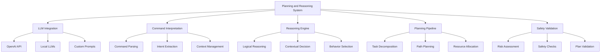

# Phase 3: Planning and Reasoning System

## Overview

Phase 3 implements the planning and reasoning system that bridges perception and action execution. This system integrates Large Language Models (LLMs) with the perception data to generate intelligent action plans, incorporating prompt engineering, context awareness, and decision-making capabilities for humanoid robot control.

## Learning Objectives

After completing Phase 3, you will be able to:
- Integrate Large Language Models with robot perception and control systems
- Implement prompt engineering techniques for robot command interpretation
- Create intelligent task planning based on multimodal inputs
- Design context-aware reasoning for complex humanoid behaviors
- Implement safety-aware planning with risk assessment

## Prerequisites

Before starting Phase 3, ensure you have:
- Completed Phase 1: Infrastructure Setup and Phase 2: Perception System
- Understanding of LLM integration from Module 4
- Access to LLM APIs or local models for development
- Perception system components operational and validated

## LLM Integration Architecture

The planning and reasoning system integrates LLMs with robot control through multiple layers:

### Command Interpretation Layer
- Natural language command parsing
- Intent extraction and semantic understanding
- Context awareness and dialogue management
- Command-to-action mapping

### Reasoning Engine
- Logical reasoning based on perception data
- Contextual decision making
- Plan validation and safety checking
- Adaptive behavior selection

### Planning Pipeline
- Task decomposition and sequencing
- Path planning integration
- Resource allocation and scheduling
- Multi-step plan execution



## LLM Interface Implementation

Create a flexible interface for LLM integration:

```python
# humanoid_planning/llm_interfaces.py
import openai
import torch
from transformers import AutoTokenizer, AutoModelForCausalLM
import json
import requests
from typing import Dict, List, Optional, Any
import asyncio
import aiohttp
import logging

class LLMInterface:
    """Base interface for LLM integration with humanoid robots"""

    def __init__(self, model_name: str = "gpt-3.5-turbo", api_key: Optional[str] = None):
        self.model_name = model_name
        self.api_key = api_key
        self.is_openai = "gpt" in model_name.lower()
        self.tokenizer = None
        self.model = None

        if self.is_openai:
            if api_key:
                openai.api_key = api_key
        else:
            # Load local model
            self.tokenizer = AutoTokenizer.from_pretrained(model_name)
            self.model = AutoModelForCausalLM.from_pretrained(model_name)

            # Add padding token if not present
            if self.tokenizer.pad_token is None:
                self.tokenizer.pad_token = self.tokenizer.eos_token

    async def generate_response(self, prompt: str, context: Dict = None) -> Dict:
        """Generate response from LLM with optional context"""
        if self.is_openai:
            return await self._generate_openai_response(prompt, context)
        else:
            return await self._generate_local_response(prompt, context)

    async def _generate_openai_response(self, prompt: str, context: Dict) -> Dict:
        """Generate response using OpenAI API"""
        try:
            system_prompt = self._create_system_prompt(context)

            response = await openai.ChatCompletion.acreate(
                model=self.model_name,
                messages=[
                    {"role": "system", "content": system_prompt},
                    {"role": "user", "content": prompt}
                ],
                max_tokens=500,
                temperature=0.7,
                timeout=30
            )

            return {
                "response": response.choices[0].message.content,
                "usage": {
                    "prompt_tokens": response.usage.prompt_tokens,
                    "completion_tokens": response.usage.completion_tokens,
                    "total_tokens": response.usage.total_tokens
                }
            }
        except Exception as e:
            logging.error(f"Error with OpenAI API: {str(e)}")
            return {"response": "", "error": str(e)}

    async def _generate_local_response(self, prompt: str, context: Dict) -> Dict:
        """Generate response using local model"""
        try:
            # Create full prompt with context
            full_prompt = self._create_full_prompt(prompt, context)

            inputs = self.tokenizer.encode(full_prompt, return_tensors="pt", truncation=True, max_length=512)

            with torch.no_grad():
                outputs = self.model.generate(
                    inputs,
                    max_length=inputs.shape[1] + 100,
                    temperature=0.7,
                    do_sample=True,
                    pad_token_id=self.tokenizer.eos_token_id,
                    max_new_tokens=150
                )

            response = self.tokenizer.decode(outputs[0], skip_special_tokens=True)

            # Extract just the response part (remove the prompt)
            if full_prompt in response:
                response_text = response.split(full_prompt)[-1].strip()
            else:
                response_text = response.strip()

            return {
                "response": response_text,
                "usage": {"prompt_length": len(full_prompt), "response_length": len(response_text)}
            }
        except Exception as e:
            logging.error(f"Error with local model: {str(e)}")
            return {"response": "", "error": str(e)}

    def _create_system_prompt(self, context: Dict) -> str:
        """Create system prompt for LLM"""
        if not context:
            context = {}

        return f"""
You are an assistant for a humanoid robot. Your role is to interpret human commands
and provide detailed execution plans. Consider:
- The robot's physical capabilities and limitations
- Safety requirements for human-robot interaction
- Environmental constraints
- Step-by-step execution plans
- Error handling and recovery strategies

Robot State: {context.get('robot_state', 'Unknown')}
Environment: {context.get('environment', 'Unknown')}
Perception Data: {context.get('perception', 'No data available')}

Respond with a structured plan that can be parsed by the robot's action execution system.
"""

    def _create_full_prompt(self, user_prompt: str, context: Dict) -> str:
        """Create full prompt with context for local models"""
        if not context:
            context = {}

        system_context = self._create_system_prompt(context)
        return f"{system_context}\n\nUser: {user_prompt}\n\nAssistant:"
```

## Command Interpretation System

Implement the command interpretation system:

```python
# humanoid_planning/command_interpreter.py
import rclpy
from rclpy.node import Node
from std_msgs.msg import String
from geometry_msgs.msg import Pose, Point
from humanoid_msgs.msg import RobotCommand
import json
import asyncio
from .llm_interfaces import LLMInterface

class CommandInterpreterNode(Node):
    def __init__(self):
        super().__init__('command_interpreter_node')

        # Initialize LLM interface
        self.llm = LLMInterface(
            model_name="gpt-3.5-turbo",  # or local model name
            api_key="your-api-key-here"  # or None for local models
        )

        # Subscribers
        self.command_sub = self.create_subscription(
            String,
            '/natural_language_command',
            self.command_callback,
            10
        )

        self.perception_sub = self.create_subscription(
            String,
            '/perception/fused_data',
            self.perception_callback,
            10
        )

        # Publishers
        self.plan_pub = self.create_publisher(
            String,
            '/planning/generated_plan',
            10
        )

        self.robot_command_pub = self.create_publisher(
            RobotCommand,
            '/robot/command',
            10
        )

        # Internal state
        self.robot_state = {
            'position': [0.0, 0.0, 0.0],
            'orientation': [0.0, 0.0, 0.0, 1.0],
            'battery_level': 100.0,
            'current_task': 'idle',
            'capabilities': ['navigation', 'manipulation', 'interaction']
        }

        self.perception_data = {}
        self.llm_queue = asyncio.Queue()

        # Timer for processing LLM requests
        self.llm_timer = self.create_timer(0.1, self.process_llm_queue)

        self.get_logger().info('Command Interpreter Node initialized')

    def command_callback(self, msg):
        """Process natural language command"""
        command = msg.data

        # Get current context
        context = {
            'robot_state': self.robot_state,
            'environment': self.perception_data,
            'timestamp': self.get_clock().now().seconds_nanoseconds()
        }

        # Add to LLM processing queue
        llm_task = {
            'command': command,
            'context': context,
            'request_time': self.get_clock().now().nanoseconds
        }

        self.llm_queue.put_nowait(llm_task)

    def perception_callback(self, msg):
        """Update perception data"""
        try:
            self.perception_data = json.loads(msg.data)
        except json.JSONDecodeError:
            self.get_logger().error('Error parsing perception data')

    def process_llm_queue(self):
        """Process LLM requests from queue"""
        if not self.llm_queue.empty():
            try:
                llm_task = self.llm_queue.get_nowait()
                command = llm_task['command']
                context = llm_task['context']

                # Process command with LLM
                asyncio.create_task(self._process_command_with_llm(command, context))
            except:
                pass  # Queue is empty

    async def _process_command_with_llm(self, command: str, context: Dict):
        """Process command using LLM"""
        try:
            # Generate prompt with robot context
            prompt = self._create_contextual_prompt(command, context)

            # Get LLM response
            response = await self.llm.generate_response(prompt, context)

            if 'error' not in response:
                # Parse LLM response into robot command
                robot_plan = self._parse_llm_response(response['response'])

                # Validate plan safety
                if self._validate_plan_safety(robot_plan, context):
                    # Publish plan
                    plan_msg = String()
                    plan_msg.data = json.dumps(robot_plan)
                    self.plan_pub.publish(plan_msg)

                    # Convert to robot commands and publish
                    robot_commands = self._convert_to_robot_commands(robot_plan)
                    for cmd in robot_commands:
                        self.robot_command_pub.publish(cmd)
                else:
                    self.get_logger().warn('Generated plan failed safety validation')
            else:
                self.get_logger().error(f'LLM error: {response["error"]}')

        except Exception as e:
            self.get_logger().error(f'Error processing command: {str(e)}')

    def _create_contextual_prompt(self, command: str, context: Dict) -> str:
        """Create contextual prompt for LLM"""
        return f"""
Command: {command}

Robot State:
- Position: {context['robot_state']['position']}
- Orientation: {context['robot_state']['orientation']}
- Battery Level: {context['robot_state']['battery_level']}%
- Current Task: {context['robot_state']['current_task']}
- Capabilities: {context['robot_state']['capabilities']}

Environment Context:
- Perception Data: {str(context['environment'])[:500]}  # Limit length

Please provide a detailed plan for the robot to execute this command, including:
1. Perception requirements (what to look for)
2. Action sequence (step-by-step plan)
3. Safety considerations
4. Expected outcomes
5. Alternative strategies if initial approach fails
"""

    def _parse_llm_response(self, response: str) -> Dict:
        """Parse LLM response into structured plan"""
        # In practice, this would use more sophisticated parsing
        # For this example, we'll create a simple structure

        plan = {
            'command': response[:100],  # First 100 chars as summary
            'steps': [],
            'safety_considerations': [],
            'expected_outcomes': [],
            'alternatives': []
        }

        # Simple parsing logic (in practice, use NLP techniques)
        lines = response.split('\n')
        for line in lines:
            if line.strip().startswith(('1.', '2.', '3.', '4.', '5.')):
                plan['steps'].append(line.strip())
            elif 'safety' in line.lower() or 'avoid' in line.lower():
                plan['safety_considerations'].append(line.strip())

        return plan

    def _validate_plan_safety(self, plan: Dict, context: Dict) -> bool:
        """Validate plan for safety compliance"""
        # Check for dangerous actions
        dangerous_keywords = ['jump', 'throw', 'hit', 'dangerous', 'unsafe']

        for step in plan.get('steps', []):
            for keyword in dangerous_keywords:
                if keyword.lower() in step.lower():
                    return False

        # Check for environmental safety
        environment = context.get('environment', {})
        if environment.get('obstacles', 0) > 10:  # If many obstacles detected
            # Additional safety checks for navigation
            pass

        return True

    def _convert_to_robot_commands(self, plan: Dict) -> List[RobotCommand]:
        """Convert plan to robot command messages"""
        commands = []

        for i, step in enumerate(plan.get('steps', [])):
            if step.strip():  # Only create commands for non-empty steps
                cmd = RobotCommand()
                cmd.command_id = f"plan_step_{i}"
                cmd.command_type = "complex_task"  # or specific command type
                cmd.parameters = json.dumps({"description": step})
                cmd.priority = 5  # Medium priority
                cmd.timeout = 60.0  # 60 second timeout

                commands.append(cmd)

        return commands

def main(args=None):
    rclpy.init(args=args)
    node = CommandInterpreterNode()

    try:
        rclpy.spin(node)
    except KeyboardInterrupt:
        pass
    finally:
        node.destroy_node()
        rclpy.shutdown()

if __name__ == '__main__':
    main()
```

## Task Planning System

Implement the task planning system:

```python
# humanoid_planning/task_planner.py
import rclpy
from rclpy.node import Node
from std_msgs.msg import String
from geometry_msgs.msg import Pose, Point
import json
from dataclasses import dataclass
from typing import List, Dict, Optional
import networkx as nx

@dataclass
class Task:
    """Represents a single task in the plan"""
    id: str
    description: str
    dependencies: List[str]
    resources_required: List[str]
    estimated_duration: float
    priority: int = 5  # 1-10 scale

class TaskPlannerNode(Node):
    def __init__(self):
        super().__init__('task_planner_node')

        # Subscribers
        self.plan_sub = self.create_subscription(
            String,
            '/planning/generated_plan',
            self.plan_callback,
            10
        )

        # Publishers
        self.scheduled_tasks_pub = self.create_publisher(
            String,
            '/planning/scheduled_tasks',
            10
        )

        self.execution_plan_pub = self.create_publisher(
            String,
            '/planning/execution_plan',
            10
        )

        # Internal state
        self.robot_resources = {
            'arms': 2,
            'legs': 2,
            'head': 1,
            'battery': 100.0,  # percentage
            'compute': 1.0     # normalized capacity
        }

        self.current_plan = None
        self.task_graph = nx.DiGraph()

        self.get_logger().info('Task Planner Node initialized')

    def plan_callback(self, msg):
        """Process incoming plan and create task schedule"""
        try:
            plan_data = json.loads(msg.data)

            # Decompose plan into tasks
            tasks = self._decompose_plan_into_tasks(plan_data)

            # Create task dependency graph
            self._create_task_graph(tasks)

            # Schedule tasks based on dependencies and resources
            scheduled_tasks = self._schedule_tasks(tasks)

            # Validate plan safety
            if self._validate_plan_resources(scheduled_tasks):
                # Publish scheduled tasks
                scheduled_msg = String()
                scheduled_msg.data = json.dumps({
                    'tasks': [self._task_to_dict(task) for task in scheduled_tasks],
                    'schedule': self._create_execution_schedule(scheduled_tasks)
                })
                self.scheduled_tasks_pub.publish(scheduled_msg)

                # Create and publish execution plan
                execution_plan = self._create_execution_plan(scheduled_tasks)
                plan_msg = String()
                plan_msg.data = json.dumps(execution_plan)
                self.execution_plan_pub.publish(plan_msg)

                self.get_logger().info(f'Published plan with {len(scheduled_tasks)} tasks')
            else:
                self.get_logger().error('Plan validation failed - insufficient resources')

        except json.JSONDecodeError:
            self.get_logger().error('Error parsing plan data')

    def _decompose_plan_into_tasks(self, plan_data: Dict) -> List[Task]:
        """Decompose high-level plan into individual tasks"""
        tasks = []

        # Example decomposition logic
        steps = plan_data.get('steps', [])

        for i, step in enumerate(steps):
            task = Task(
                id=f"task_{i}",
                description=step,
                dependencies=[f"task_{i-1}"] if i > 0 else [],  # Sequential dependencies
                resources_required=self._extract_resource_requirements(step),
                estimated_duration=self._estimate_task_duration(step),
                priority=5
            )
            tasks.append(task)

        return tasks

    def _extract_resource_requirements(self, step: str) -> List[str]:
        """Extract resource requirements from task description"""
        resources = []

        step_lower = step.lower()
        if 'move' in step_lower or 'navigate' in step_lower:
            resources.append('navigation')
        if 'grasp' in step_lower or 'pick' in step_lower or 'take' in step_lower:
            resources.append('manipulation')
        if 'look' in step_lower or 'see' in step_lower:
            resources.append('vision')
        if 'speak' in step_lower:
            resources.append('audio')

        return resources

    def _estimate_task_duration(self, step: str) -> float:
        """Estimate task duration based on description"""
        # Simple estimation logic (in practice, use learned models)
        if 'grasp' in step.lower() or 'manipulation' in step.lower():
            return 5.0  # 5 seconds for manipulation
        elif 'navigate' in step.lower() or 'move' in step.lower():
            return 3.0  # 3 seconds for navigation
        else:
            return 2.0  # 2 seconds for other tasks

    def _create_task_graph(self, tasks: List[Task]):
        """Create dependency graph for tasks"""
        self.task_graph.clear()

        for task in tasks:
            self.task_graph.add_node(task.id, task=task)
            for dep in task.dependencies:
                self.task_graph.add_edge(dep, task.id)

    def _schedule_tasks(self, tasks: List[Task]) -> List[Task]:
        """Schedule tasks based on dependencies and resources"""
        # Topological sort to respect dependencies
        try:
            sorted_tasks = list(nx.topological_sort(self.task_graph))
        except nx.NetworkXUnfeasible:
            self.get_logger().error('Task graph has cycles')
            return []

        # In practice, implement more sophisticated scheduling
        # considering resource constraints and optimization
        return tasks

    def _validate_plan_resources(self, tasks: List[Task]) -> bool:
        """Validate that the plan can be executed with available resources"""
        # Simple validation - check if we have basic resources
        required_resources = set()
        for task in tasks:
            required_resources.update(task.resources_required)

        # Check if we have the basic capabilities
        available_capabilities = set(self.robot_resources.keys())
        available_capabilities.update(['navigation', 'manipulation', 'vision', 'audio'])

        # For this example, assume basic validation passes
        return True

    def _create_execution_schedule(self, tasks: List[Task]) -> Dict:
        """Create execution schedule for tasks"""
        schedule = {
            'start_time': self.get_clock().now().nanoseconds,
            'tasks': []
        }

        current_time = 0.0
        for task in tasks:
            task_schedule = {
                'task_id': task.id,
                'description': task.description,
                'start_time': current_time,
                'end_time': current_time + task.estimated_duration,
                'resources': task.resources_required
            }
            schedule['tasks'].append(task_schedule)
            current_time += task.estimated_duration

        return schedule

    def _create_execution_plan(self, tasks: List[Task]) -> Dict:
        """Create detailed execution plan"""
        plan = {
            'plan_id': f"plan_{self.get_clock().now().nanoseconds}",
            'tasks': [self._task_to_dict(task) for task in tasks],
            'total_duration': sum(task.estimated_duration for task in tasks),
            'execution_strategy': 'sequential'  # or 'parallel' if supported
        }
        return plan

    def _task_to_dict(self, task: Task) -> Dict:
        """Convert task to dictionary representation"""
        return {
            'id': task.id,
            'description': task.description,
            'dependencies': task.dependencies,
            'resources_required': task.resources_required,
            'estimated_duration': task.estimated_duration,
            'priority': task.priority
        }

def main(args=None):
    rclpy.init(args=args)
    node = TaskPlannerNode()

    try:
        rclpy.spin(node)
    except KeyboardInterrupt:
        pass
    finally:
        node.destroy_node()
        rclpy.shutdown()

if __name__ == '__main__':
    main()
```

## Reasoning and Context Management

Implement the reasoning and context management system:

```python
# humanoid_planning/reasoning_engine.py
import rclpy
from rclpy.node import Node
from std_msgs.msg import String
from geometry_msgs.msg import Pose
import json
import sqlite3
from datetime import datetime, timedelta
from typing import Dict, List, Any
import re

class ReasoningEngineNode(Node):
    def __init__(self):
        super().__init__('reasoning_engine_node')

        # Subscribers
        self.perception_sub = self.create_subscription(
            String,
            '/perception/fused_data',
            self.perception_callback,
            10
        )

        self.plan_sub = self.create_subscription(
            String,
            '/planning/execution_plan',
            self.plan_callback,
            10
        )

        # Publishers
        self.reasoning_pub = self.create_publisher(
            String,
            '/reasoning/decisions',
            10
        )

        self.context_pub = self.create_publisher(
            String,
            '/reasoning/context',
            10
        )

        # Initialize context database
        self.context_db = self._init_context_database()

        # Internal state
        self.current_context = {
            'objects': [],
            'locations': [],
            'interactions': [],
            'preferences': {},
            'history': []
        }

        # Timer for reasoning updates
        self.reasoning_timer = self.create_timer(1.0, self.update_reasoning)

        self.get_logger().info('Reasoning Engine Node initialized')

    def perception_callback(self, msg):
        """Update context based on perception data"""
        try:
            perception_data = json.loads(msg.data)

            # Extract objects from perception
            if 'objects_detected' in perception_data:
                self._update_objects(perception_data['objects_detected'])

            # Extract environmental information
            if 'environment_state' in perception_data:
                self._update_environment(perception_data['environment_state'])

            # Update context in database
            self._update_context_database(self.current_context)

        except json.JSONDecodeError:
            self.get_logger().error('Error parsing perception data')

    def plan_callback(self, msg):
        """Update reasoning based on new plan"""
        try:
            plan_data = json.loads(msg.data)

            # Add plan to context history
            self.current_context['history'].append({
                'timestamp': datetime.now().isoformat(),
                'plan': plan_data,
                'status': 'new'
            })

            # Limit history to prevent memory issues
            if len(self.current_context['history']) > 100:
                self.current_context['history'] = self.current_context['history'][-50:]

            # Update context database
            self._update_context_database(self.current_context)

        except json.JSONDecodeError:
            self.get_logger().error('Error parsing plan data')

    def update_reasoning(self):
        """Perform reasoning based on current context"""
        try:
            # Perform logical reasoning
            reasoning_result = self._perform_logical_reasoning()

            # Make contextual decisions
            decisions = self._make_contextual_decisions(reasoning_result)

            # Publish reasoning results
            reasoning_msg = String()
            reasoning_msg.data = json.dumps({
                'timestamp': datetime.now().isoformat(),
                'reasoning': reasoning_result,
                'decisions': decisions,
                'context_summary': self._summarize_context()
            })
            self.reasoning_pub.publish(reasoning_msg)

            # Publish updated context
            context_msg = String()
            context_msg.data = json.dumps(self.current_context)
            self.context_pub.publish(context_msg)

        except Exception as e:
            self.get_logger().error(f'Error in reasoning update: {str(e)}')

    def _perform_logical_reasoning(self) -> Dict:
        """Perform logical reasoning based on context"""
        reasoning = {
            'object_relationships': [],
            'spatial_reasoning': [],
            'temporal_reasoning': [],
            'causal_reasoning': [],
            'preferences': {}
        }

        # Example logical reasoning
        # Infer relationships between objects
        for obj1 in self.current_context['objects']:
            for obj2 in self.current_context['objects']:
                if obj1 != obj2:
                    # Calculate spatial relationship
                    rel = self._calculate_spatial_relationship(obj1, obj2)
                    if rel:
                        reasoning['object_relationships'].append(rel)

        # Infer user preferences from interaction history
        reasoning['preferences'] = self._infer_preferences()

        return reasoning

    def _calculate_spatial_relationship(self, obj1: Dict, obj2: Dict) -> Optional[Dict]:
        """Calculate spatial relationship between objects"""
        if 'position' in obj1 and 'position' in obj2:
            pos1 = obj1['position']
            pos2 = obj2['position']

            # Calculate distance
            distance = ((pos1[0] - pos2[0])**2 +
                       (pos1[1] - pos2[1])**2 +
                       (pos1[2] - pos2[2])**2)**0.5

            # Determine relationship based on distance
            if distance < 0.5:  # Within 50cm
                return {
                    'object1': obj1.get('id', 'unknown'),
                    'object2': obj2.get('id', 'unknown'),
                    'relationship': 'close',
                    'distance': distance
                }

        return None

    def _infer_preferences(self) -> Dict:
        """Infer user preferences from interaction history"""
        preferences = {}

        # Look for patterns in history
        for entry in self.current_context['history'][-10:]:  # Last 10 entries
            if 'plan' in entry and 'tasks' in entry['plan']:
                for task in entry['plan']['tasks']:
                    desc = task.get('description', '').lower()

                    # Look for preference indicators
                    if 'left' in desc:
                        preferences['handedness'] = 'left'
                    elif 'right' in desc:
                        preferences['handedness'] = 'right'

        return preferences

    def _make_contextual_decisions(self, reasoning_result: Dict) -> List[Dict]:
        """Make decisions based on reasoning and context"""
        decisions = []

        # Example: Decide which object to interact with
        objects = self.current_context['objects']
        if objects:
            # Choose closest object
            closest_obj = min(objects,
                            key=lambda x: x.get('distance', float('inf')),
                            default=None)
            if closest_obj:
                decisions.append({
                    'type': 'object_selection',
                    'selected_object': closest_obj,
                    'reason': 'Closest object to robot'
                })

        # Example: Decide navigation strategy based on environment
        environment = self.current_context.get('environment', {})
        if environment.get('obstacles', 0) > 5:
            decisions.append({
                'type': 'navigation_strategy',
                'strategy': 'cautious',
                'reason': 'High obstacle density detected'
            })

        return decisions

    def _summarize_context(self) -> Dict:
        """Create a summary of current context"""
        return {
            'object_count': len(self.current_context['objects']),
            'location_count': len(self.current_context['locations']),
            'interaction_count': len(self.current_context['interactions']),
            'history_length': len(self.current_context['history']),
            'last_update': datetime.now().isoformat()
        }

    def _update_objects(self, objects_data: List[Dict]):
        """Update objects in context"""
        for obj_data in objects_data:
            # Check if object already exists
            existing_idx = None
            for i, obj in enumerate(self.current_context['objects']):
                if obj.get('id') == obj_data.get('id'):
                    existing_idx = i
                    break

            if existing_idx is not None:
                # Update existing object
                self.current_context['objects'][existing_idx].update(obj_data)
            else:
                # Add new object
                obj_data['first_seen'] = datetime.now().isoformat()
                self.current_context['objects'].append(obj_data)

    def _update_environment(self, env_data: Dict):
        """Update environmental information in context"""
        self.current_context['environment'] = env_data

    def _init_context_database(self) -> sqlite3.Connection:
        """Initialize context database for persistent storage"""
        conn = sqlite3.connect('context.db')

        # Create tables
        conn.execute('''
            CREATE TABLE IF NOT EXISTS objects (
                id TEXT PRIMARY KEY,
                name TEXT,
                type TEXT,
                position_x REAL,
                position_y REAL,
                position_z REAL,
                first_seen TEXT,
                last_seen TEXT,
                properties TEXT
            )
        ''')

        conn.execute('''
            CREATE TABLE IF NOT EXISTS interactions (
                id INTEGER PRIMARY KEY AUTOINCREMENT,
                object_id TEXT,
                interaction_type TEXT,
                timestamp TEXT,
                properties TEXT
            )
        ''')

        conn.commit()
        return conn

    def _update_context_database(self, context: Dict):
        """Update context database with current information"""
        try:
            # Update objects
            for obj in context['objects']:
                self.context_db.execute('''
                    INSERT OR REPLACE INTO objects
                    (id, name, type, position_x, position_y, position_z, first_seen, last_seen, properties)
                    VALUES (?, ?, ?, ?, ?, ?, ?, ?, ?)
                ''', (
                    obj.get('id', 'unknown'),
                    obj.get('name', 'unknown'),
                    obj.get('type', 'unknown'),
                    obj.get('position', [0,0,0])[0] if 'position' in obj else 0,
                    obj.get('position', [0,0,0])[1] if 'position' in obj else 0,
                    obj.get('position', [0,0,0])[2] if 'position' in obj else 0,
                    obj.get('first_seen', datetime.now().isoformat()),
                    datetime.now().isoformat(),
                    json.dumps(obj.get('properties', {}))
                ))

            self.context_db.commit()
        except Exception as e:
            self.get_logger().error(f'Error updating context database: {str(e)}')

def main(args=None):
    rclpy.init(args=args)
    node = ReasoningEngineNode()

    try:
        rclpy.spin(node)
    except KeyboardInterrupt:
        pass
    finally:
        node.destroy_node()
        rclpy.shutdown()

if __name__ == '__main__':
    main()
```

## Phase 3 Completion Checklist

Complete the following tasks to finish Phase 3:

- [ ] LLM interface implemented and tested with both API and local models
- [ ] Command interpreter node created and integrated with perception system
- [ ] Task planning system implemented with dependency management
- [ ] Reasoning engine created with context management
- [ ] Safety validation implemented for generated plans
- [ ] Performance benchmarks established for reasoning system
- [ ] Documentation created for planning and reasoning components
- [ ] Integration testing completed with Phase 1 and 2 components

```mermaid
graph TD
    A[Phase 3: Planning & Reasoning] --> B[LLM Integration]
    A --> C[Command Interpretation]
    A --> D[Task Planning]
    A --> E[Reasoning Engine]
    A --> F[Safety Validation]

    B --> G[API Interfaces]
    B --> H[Local Models]
    B --> I[Prompt Engineering]
    C --> J[Command Parsing]
    C --> K[NLU Integration]
    C --> L[Intent Mapping]
    D --> M[Task Decomposition]
    D --> N[Dependency Graphs]
    D --> O[Resource Scheduling]
    E --> P[Context Management]
    E --> Q[Logical Reasoning]
    E --> R[Decision Making],
    F --> S[Plan Validation]
    F --> T[Risk Assessment]
    F --> U[Safety Checks]
```

## Safety Considerations

The planning and reasoning system implements multiple safety layers:

- **Plan Validation**: Verify all generated plans meet safety requirements
- **Resource Constraints**: Ensure plans don't exceed robot capabilities
- **Context Awareness**: Consider environmental factors in decision making
- **Fallback Strategies**: Implement safe recovery behaviors

## Performance Optimization

Consider these optimizations for the planning system:

- **Caching**: Cache frequently used plans and reasoning results
- **Parallel Processing**: Execute independent tasks in parallel
- **Model Optimization**: Use efficient LLM inference techniques
- **Memory Management**: Implement proper memory cleanup for context

## Troubleshooting

Common planning and reasoning issues:

1. **Slow Response**: Optimize LLM calls, implement caching
2. **Inconsistent Planning**: Improve prompt engineering, add validation
3. **Context Drift**: Implement context reset mechanisms
4. **Resource Conflicts**: Enhance resource scheduling algorithms

## Next Steps

With the planning and reasoning system implemented, Phase 4 will focus on action execution, implementing the control systems that translate high-level plans into low-level robot actions while maintaining safety validation. The planning system established in Phase 3 provides the intelligent decision-making necessary for complex humanoid behaviors.

:::tip
Test your planning system with various natural language commands to ensure robust interpretation and plan generation.
:::

:::warning
Always validate generated plans for safety before execution. The planning system should never generate unsafe commands.
:::