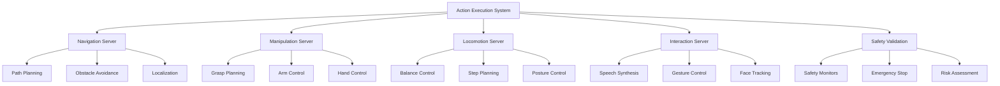

# Phase 4: Action Execution System

## Overview

Phase 4 implements the action execution system that translates high-level plans from the planning system into low-level robot control commands. This system includes ROS 2 action servers, safety validation frameworks, and control interfaces for humanoid robot manipulation and locomotion.

## Learning Objectives

After completing Phase 4, you will be able to:
- Implement ROS 2 action servers for humanoid robot control
- Create safety validation frameworks for action execution
- Develop control interfaces for humanoid manipulation and locomotion
- Integrate action execution with planning and perception systems
- Implement real-time control and feedback mechanisms

## Prerequisites

Before starting Phase 4, ensure you have:
- Completed Phase 1-3: Infrastructure, Perception, and Planning systems
- Understanding of ROS 2 actions and control systems (from Module 1)
- Access to humanoid robot simulation or real hardware
- Planning system components operational and validated

## Action Server Architecture

The action execution system uses ROS 2 action servers for reliable command execution:

### Core Action Servers
- **Navigation Action Server**: Handles path planning and navigation
- **Manipulation Action Server**: Controls arm and hand movements
- **Locomotion Action Server**: Manages bipedal walking and balance
- **Interaction Action Server**: Handles human-robot interaction



## Navigation Action Server

Implement the navigation action server:

```python
# humanoid_control/nodes/navigation_server.py
import rclpy
from rclpy.action import ActionServer, GoalResponse, CancelResponse
from rclpy.node import Node
from rclpy.executors import MultiThreadedExecutor
from rclpy.callback_groups import ReentrantCallbackGroup
from geometry_msgs.msg import PoseStamped, Point, Quaternion
from nav_msgs.msg import Path
from humanoid_msgs.action import NavigateToPose
import threading
import numpy as np
from scipy.spatial.transform import Rotation as R
import time

class NavigationActionServer(Node):
    def __init__(self):
        super().__init__('navigation_action_server')

        # Initialize action server
        self._action_server = ActionServer(
            self,
            NavigateToPose,
            'navigate_to_pose',
            self.execute_callback,
            goal_callback=self.goal_callback,
            cancel_callback=self.cancel_callback,
            callback_group=ReentrantCallbackGroup()
        )

        # Publishers and subscribers
        self.path_pub = self.create_publisher(Path, '/navigation/local_plan', 10)
        self.goal_pub = self.create_publisher(PoseStamped, '/navigation/goal', 10)

        # Internal state
        self.current_goal = None
        self.current_path = []
        self.robot_pose = PoseStamped()
        self.navigation_active = False
        self.cancel_requested = False

        # Navigation parameters
        self.linear_vel = 0.5  # m/s
        self.angular_vel = 0.5  # rad/s
        self.arrival_threshold = 0.1  # meters
        self.rotation_threshold = 0.1  # radians

        # Lock for thread safety
        self.navigation_lock = threading.Lock()

        self.get_logger().info('Navigation Action Server initialized')

    def goal_callback(self, goal_request):
        """Accept or reject navigation goal"""
        self.get_logger().info(f'Received navigation goal: {goal_request.pose.pose.position.x}, {goal_request.pose.pose.position.y}')

        # Check if we can accept the goal
        if self.navigation_active:
            self.get_logger().warn('Navigation already active, rejecting new goal')
            return GoalResponse.REJECT

        # Validate goal is reasonable
        if self._is_goal_valid(goal_request.pose):
            return GoalResponse.ACCEPT
        else:
            self.get_logger().warn('Invalid goal, rejecting')
            return GoalResponse.REJECT

    def cancel_callback(self, goal_handle):
        """Handle goal cancellation"""
        self.get_logger().info('Received cancel request')
        self.cancel_requested = True
        return CancelResponse.ACCEPT

    def execute_callback(self, goal_handle):
        """Execute navigation goal"""
        self.get_logger().info('Executing navigation goal')

        # Set internal state
        with self.navigation_lock:
            self.current_goal = goal_handle.request.pose
            self.navigation_active = True
            self.cancel_requested = False

        # Create feedback and result messages
        feedback_msg = NavigateToPose.Feedback()
        result_msg = NavigateToPose.Result()

        try:
            # Plan path to goal
            path = self._plan_path_to_goal(self.current_goal)
            if not path:
                self.get_logger().error('Failed to plan path to goal')
                result_msg.success = False
                result_msg.error_message = 'Failed to plan path'
                goal_handle.succeed()
                return result_msg

            # Publish path
            self._publish_path(path)

            # Execute navigation
            success = self._execute_navigation(goal_handle, path, feedback_msg)

            if success:
                result_msg.success = True
                result_msg.error_message = ''
                goal_handle.succeed()
            else:
                result_msg.success = False
                result_msg.error_message = 'Navigation failed or was cancelled'
                goal_handle.abort()

        except Exception as e:
            self.get_logger().error(f'Navigation execution error: {str(e)}')
            result_msg.success = False
            result_msg.error_message = f'Execution error: {str(e)}'
            goal_handle.abort()

        # Reset internal state
        with self.navigation_lock:
            self.navigation_active = False
            self.current_goal = None

        return result_msg

    def _is_goal_valid(self, goal_pose):
        """Validate that the goal is reasonable"""
        # Check if goal is not too far
        distance_to_goal = self._calculate_distance_to_goal(goal_pose)
        if distance_to_goal > 100.0:  # 100 meters max
            return False

        # Check if goal is not too close
        if distance_to_goal < 0.05:  # 5 cm min
            return False

        return True

    def _plan_path_to_goal(self, goal_pose):
        """Plan path to goal using simple approach"""
        # In a real implementation, this would use a path planning algorithm
        # For this example, we'll create a straight line path
        current_pos = self.robot_pose.pose.position
        goal_pos = goal_pose.pose.position

        # Create path points
        path = []
        steps = max(int(self._calculate_distance_to_goal(goal_pose) / 0.1), 1)  # 10cm steps

        for i in range(steps + 1):
            t = i / steps
            x = current_pos.x + t * (goal_pos.x - current_pos.x)
            y = current_pos.y + t * (goal_pos.y - current_pos.y)
            z = current_pos.z + t * (goal_pos.z - current_pos.z)

            pose = PoseStamped()
            pose.header.frame_id = 'map'
            pose.pose.position.x = x
            pose.pose.position.y = y
            pose.pose.position.z = z

            # Interpolate orientation
            if i == steps:
                pose.pose.orientation = goal_pose.pose.orientation
            else:
                pose.pose.orientation = self.robot_pose.pose.orientation

            path.append(pose)

        return path

    def _execute_navigation(self, goal_handle, path, feedback_msg):
        """Execute the navigation along the path"""
        for i, pose in enumerate(path):
            if self.cancel_requested:
                self.get_logger().info('Navigation cancelled')
                return False

            # Move to this pose
            success = self._move_to_pose(pose)
            if not success:
                self.get_logger().error(f'Failed to reach pose {i}')
                return False

            # Publish feedback
            feedback_msg.current_pose = pose
            feedback_msg.distance_remaining = self._calculate_distance_to_goal(
                PoseStamped(pose=pose.pose)
            )
            goal_handle.publish_feedback(feedback_msg)

            # Check for obstacles
            if self._check_for_obstacles():
                self.get_logger().warn('Obstacle detected during navigation')
                return False

        # Final position check
        goal_pos = self.current_goal.pose.position
        current_pos = self.robot_pose.pose.position
        distance = np.sqrt(
            (goal_pos.x - current_pos.x)**2 +
            (goal_pos.y - current_pos.y)**2 +
            (goal_pos.z - current_pos.z)**2
        )

        return distance <= self.arrival_threshold

    def _move_to_pose(self, pose):
        """Move robot to specific pose"""
        # In a real implementation, this would send commands to the robot
        # For this example, we'll simulate movement
        target_pos = pose.pose.position
        current_pos = self.robot_pose.pose.position

        # Calculate distance to move
        distance = np.sqrt(
            (target_pos.x - current_pos.x)**2 +
            (target_pos.y - current_pos.y)**2 +
            (target_pos.z - current_pos.z)**2
        )

        # Simulate movement time
        movement_time = distance / self.linear_vel
        time.sleep(min(movement_time, 1.0))  # Cap at 1 second for simulation

        # Update robot pose (in simulation)
        self.robot_pose.pose = pose.pose

        return True

    def _calculate_distance_to_goal(self, goal_pose):
        """Calculate distance to goal"""
        current_pos = self.robot_pose.pose.position
        goal_pos = goal_pose.pose.position
        return np.sqrt(
            (goal_pos.x - current_pos.x)**2 +
            (goal_pos.y - current_pos.y)**2 +
            (goal_pos.z - current_pos.z)**2
        )

    def _check_for_obstacles(self):
        """Check for obstacles in the environment"""
        # In a real implementation, this would use sensor data
        # For this example, return False (no obstacles)
        return False

    def _publish_path(self, path):
        """Publish the planned path"""
        path_msg = Path()
        path_msg.header.stamp = self.get_clock().now().to_msg()
        path_msg.header.frame_id = 'map'
        path_msg.poses = path

        self.path_pub.publish(path_msg)

def main(args=None):
    rclpy.init(args=args)
    node = NavigationActionServer()

    try:
        executor = MultiThreadedExecutor()
        rclpy.spin(node, executor=executor)
    except KeyboardInterrupt:
        pass
    finally:
        node.destroy_node()
        rclpy.shutdown()

if __name__ == '__main__':
    main()
```

## Manipulation Action Server

Implement the manipulation action server:

```python
# humanoid_control/nodes/manipulation_server.py
import rclpy
from rclpy.action import ActionServer, GoalResponse, CancelResponse
from rclpy.node import Node
from rclpy.executors import MultiThreadedExecutor
from rclpy.callback_groups import ReentrantCallbackGroup
from geometry_msgs.msg import Pose, Point, Vector3
from humanoid_msgs.action import ManipulateObject
from std_msgs.msg import String
import threading
import numpy as np
from scipy.spatial.transform import Rotation as R
import time

class ManipulationActionServer(Node):
    def __init__(self):
        super().__init__('manipulation_action_server')

        # Initialize action server
        self._action_server = ActionServer(
            self,
            ManipulateObject,
            'manipulate_object',
            self.execute_callback,
            goal_callback=self.goal_callback,
            cancel_callback=self.cancel_callback,
            callback_group=ReentrantCallbackGroup()
        )

        # Publishers and subscribers
        self.status_pub = self.create_publisher(String, '/manipulation/status', 10)

        # Internal state
        self.current_goal = None
        self.manipulation_active = False
        self.cancel_requested = False
        self.gripper_positions = {'left': 0.0, 'right': 0.0}  # 0.0 = open, 1.0 = closed
        self.arm_positions = {'left': [0.0, 0.0, 0.0], 'right': [0.0, 0.0, 0.0]}  # [x, y, z]

        # Lock for thread safety
        self.manipulation_lock = threading.Lock()

        self.get_logger().info('Manipulation Action Server initialized')

    def goal_callback(self, goal_request):
        """Accept or reject manipulation goal"""
        self.get_logger().info(f'Received manipulation goal: {goal_request.action_type} for object {goal_request.object_id}')

        # Check if we can accept the goal
        if self.manipulation_active:
            self.get_logger().warn('Manipulation already active, rejecting new goal')
            return GoalResponse.REJECT

        # Validate goal is reasonable
        if self._is_goal_valid(goal_request):
            return GoalResponse.ACCEPT
        else:
            self.get_logger().warn('Invalid manipulation goal, rejecting')
            return GoalResponse.REJECT

    def cancel_callback(self, goal_handle):
        """Handle goal cancellation"""
        self.get_logger().info('Received manipulation cancel request')
        self.cancel_requested = True
        return CancelResponse.ACCEPT

    def execute_callback(self, goal_handle):
        """Execute manipulation goal"""
        self.get_logger().info(f'Executing manipulation goal: {goal_handle.request.action_type}')

        # Set internal state
        with self.manipulation_lock:
            self.current_goal = goal_handle.request
            self.manipulation_active = True
            self.cancel_requested = False

        # Create feedback and result messages
        feedback_msg = ManipulateObject.Feedback()
        result_msg = ManipulateObject.Result()

        try:
            # Execute manipulation based on action type
            success = self._execute_manipulation(goal_handle, feedback_msg)

            if success:
                result_msg.success = True
                result_msg.error_message = ''
                goal_handle.succeed()
            else:
                result_msg.success = False
                result_msg.error_message = 'Manipulation failed or was cancelled'
                goal_handle.abort()

        except Exception as e:
            self.get_logger().error(f'Manipulation execution error: {str(e)}')
            result_msg.success = False
            result_msg.error_message = f'Execution error: {str(e)}'
            goal_handle.abort()

        # Reset internal state
        with self.manipulation_lock:
            self.manipulation_active = False
            self.current_goal = None

        return result_msg

    def _is_goal_valid(self, goal_request):
        """Validate that the manipulation goal is reasonable"""
        # Check if action type is valid
        valid_actions = ['pick', 'place', 'grasp', 'release', 'move', 'reposition']
        if goal_request.action_type not in valid_actions:
            return False

        # Check if arm is specified
        if goal_request.arm not in ['left', 'right', 'both']:
            return False

        # Check if target pose is reasonable
        if goal_request.action_type in ['pick', 'place', 'move']:
            target_pos = goal_request.target_pose.position
            # Check if target is within reasonable reach
            if np.sqrt(target_pos.x**2 + target_pos.y**2 + target_pos.z**2) > 2.0:  # 2m max reach
                return False

        return True

    def _execute_manipulation(self, goal_handle, feedback_msg):
        """Execute the manipulation based on goal type"""
        action_type = self.current_goal.action_type
        arm = self.current_goal.arm

        if action_type == 'grasp':
            return self._execute_grasp(goal_handle, feedback_msg, arm)
        elif action_type == 'release':
            return self._execute_release(goal_handle, feedback_msg, arm)
        elif action_type == 'pick':
            return self._execute_pick(goal_handle, feedback_msg, arm)
        elif action_type == 'place':
            return self._execute_place(goal_handle, feedback_msg, arm)
        elif action_type == 'move':
            return self._execute_move(goal_handle, feedback_msg, arm)
        else:
            self.get_logger().error(f'Unknown action type: {action_type}')
            return False

    def _execute_grasp(self, goal_handle, feedback_msg, arm):
        """Execute grasp action"""
        self.get_logger().info(f'Executing grasp with {arm} arm')

        # Move to grasp position
        if arm in ['left', 'both']:
            success = self._move_arm_to_position('left', self.current_goal.target_pose)
            if not success:
                return False

        if arm in ['right', 'both']:
            success = self._move_arm_to_position('right', self.current_goal.target_pose)
            if not success:
                return False

        # Close gripper
        success = self._close_gripper(arm)
        if not success:
            return False

        # Verify grasp
        if not self._verify_grasp(arm):
            self.get_logger().warn(f'Grasp verification failed for {arm} arm')
            return False

        # Update feedback
        feedback_msg.status = f'Grasp completed with {arm} arm'
        goal_handle.publish_feedback(feedback_msg)

        return True

    def _execute_release(self, goal_handle, feedback_msg, arm):
        """Execute release action"""
        self.get_logger().info(f'Executing release with {arm} arm')

        # Open gripper
        success = self._open_gripper(arm)
        if not success:
            return False

        # Move arm away slightly
        if arm in ['left', 'both']:
            # Move left arm away
            current_pos = self.arm_positions['left']
            release_pose = Pose()
            release_pose.position.x = current_pos[0] + 0.1  # Move 10cm back
            release_pose.position.y = current_pos[1]
            release_pose.position.z = current_pos[2]
            self._move_arm_to_position('left', release_pose)

        if arm in ['right', 'both']:
            # Move right arm away
            current_pos = self.arm_positions['right']
            release_pose = Pose()
            release_pose.position.x = current_pos[0] + 0.1  # Move 10cm back
            release_pose.position.y = current_pos[1]
            release_pose.position.z = current_pos[2]
            self._move_arm_to_position('right', release_pose)

        # Update feedback
        feedback_msg.status = f'Release completed with {arm} arm'
        goal_handle.publish_feedback(feedback_msg)

        return True

    def _execute_pick(self, goal_handle, feedback_msg, arm):
        """Execute pick action (approach, grasp, lift)"""
        self.get_logger().info(f'Executing pick with {arm} arm')

        # Approach object
        approach_pose = self._calculate_approach_pose(self.current_goal.target_pose)
        success = self._move_arm_to_position(arm, approach_pose)
        if not success:
            return False

        # Grasp object
        success = self._execute_grasp(goal_handle, feedback_msg, arm)
        if not success:
            return False

        # Lift object
        lift_pose = self._calculate_lift_pose(self.current_goal.target_pose)
        success = self._move_arm_to_position(arm, lift_pose)
        if not success:
            return False

        # Update feedback
        feedback_msg.status = f'Pick completed with {arm} arm'
        goal_handle.publish_feedback(feedback_msg)

        return True

    def _execute_place(self, goal_handle, feedback_msg, arm):
        """Execute place action (move to position, release, move away)"""
        self.get_logger().info(f'Executing place with {arm} arm')

        # Move to place position
        success = self._move_arm_to_position(arm, self.current_goal.target_pose)
        if not success:
            return False

        # Release object
        success = self._execute_release(goal_handle, feedback_msg, arm)
        if not success:
            return False

        # Update feedback
        feedback_msg.status = f'Place completed with {arm} arm'
        goal_handle.publish_feedback(feedback_msg)

        return True

    def _execute_move(self, goal_handle, feedback_msg, arm):
        """Execute move action to target position"""
        self.get_logger().info(f'Executing move with {arm} arm')

        # Move arm to target position
        success = self._move_arm_to_position(arm, self.current_goal.target_pose)
        if not success:
            return False

        # Update feedback
        feedback_msg.status = f'Move completed with {arm} arm'
        goal_handle.publish_feedback(feedback_msg)

        return True

    def _move_arm_to_position(self, arm, target_pose):
        """Move specified arm to target position"""
        if self.cancel_requested:
            return False

        # In a real implementation, this would send commands to the arm controller
        # For this example, we'll simulate the movement
        target_pos = target_pose.position
        current_pos = self.arm_positions[arm]

        # Calculate movement vector
        dx = target_pos.x - current_pos[0]
        dy = target_pos.y - current_pos[1]
        dz = target_pos.z - current_pos[2]

        # Simulate movement over time
        steps = 10
        for i in range(steps):
            if self.cancel_requested:
                return False

            # Interpolate position
            t = i / steps
            new_x = current_pos[0] + t * dx
            new_y = current_pos[1] + t * dy
            new_z = current_pos[2] + t * dz

            self.arm_positions[arm] = [new_x, new_y, new_z]

            # Small delay to simulate movement
            time.sleep(0.1)

        # Final position
        self.arm_positions[arm] = [target_pos.x, target_pos.y, target_pos.z]

        return True

    def _close_gripper(self, arm):
        """Close gripper on specified arm"""
        if arm in ['left', 'both']:
            self.gripper_positions['left'] = 1.0  # Fully closed
        if arm in ['right', 'both']:
            self.gripper_positions['right'] = 1.0  # Fully closed

        # Simulate gripper closing time
        time.sleep(0.5)

        return True

    def _open_gripper(self, arm):
        """Open gripper on specified arm"""
        if arm in ['left', 'both']:
            self.gripper_positions['left'] = 0.0  # Fully open
        if arm in ['right', 'both']:
            self.gripper_positions['right'] = 0.0  # Fully open

        # Simulate gripper opening time
        time.sleep(0.5)

        return True

    def _verify_grasp(self, arm):
        """Verify that the grasp was successful"""
        # In a real implementation, this would check force/torque sensors
        # For this example, assume grasp succeeds 90% of the time
        import random
        return random.random() > 0.1

    def _calculate_approach_pose(self, target_pose):
        """Calculate approach pose (slightly before target)"""
        approach_pose = Pose()
        approach_pose.position.x = target_pose.position.x - 0.1  # 10cm before
        approach_pose.position.y = target_pose.position.y
        approach_pose.position.z = target_pose.position.z
        approach_pose.orientation = target_pose.orientation
        return approach_pose

    def _calculate_lift_pose(self, target_pose):
        """Calculate lift pose (slightly above target)"""
        lift_pose = Pose()
        lift_pose.position.x = target_pose.position.x
        lift_pose.position.y = target_pose.position.y
        lift_pose.position.z = target_pose.position.z + 0.1  # 10cm above
        lift_pose.orientation = target_pose.orientation
        return lift_pose

def main(args=None):
    rclpy.init(args=args)
    node = ManipulationActionServer()

    try:
        executor = MultiThreadedExecutor()
        rclpy.spin(node, executor=executor)
    except KeyboardInterrupt:
        pass
    finally:
        node.destroy_node()
        rclpy.shutdown()

if __name__ == '__main__':
    main()
```

## Safety Validation Framework

Implement the safety validation framework:

```python
# humanoid_control/safety_validator.py
import rclpy
from rclpy.node import Node
from std_msgs.msg import String
from geometry_msgs.msg import Pose, Point
from sensor_msgs.msg import JointState
import numpy as np
from typing import Dict, List, Tuple
import threading

class SafetyValidatorNode(Node):
    def __init__(self):
        super().__init__('safety_validator_node')

        # Subscribers
        self.joint_state_sub = self.create_subscription(
            JointState,
            '/joint_states',
            self.joint_state_callback,
            10
        )

        self.command_sub = self.create_subscription(
            String,
            '/robot/command',
            self.command_callback,
            10
        )

        # Publishers
        self.safety_status_pub = self.create_publisher(
            String,
            '/safety/status',
            10
        )

        self.emergency_stop_pub = self.create_publisher(
            String,
            '/safety/emergency_stop',
            10
        )

        # Internal state
        self.joint_positions = {}
        self.joint_velocities = {}
        self.joint_efforts = {}
        self.robot_pose = Pose()
        self.last_command = None
        self.safety_status = "SAFE"
        self.emergency_stop_active = False

        # Safety parameters
        self.joint_limits = {
            'hip_joint': (-1.57, 1.57),  # radians
            'knee_joint': (0.0, 2.35),
            'ankle_joint': (-0.78, 0.78),
            'shoulder_joint': (-2.35, 2.35),
            'elbow_joint': (-2.35, 0.0),
            'wrist_joint': (-1.57, 1.57)
        }

        self.velocity_limits = {
            'max_linear_vel': 1.0,  # m/s
            'max_angular_vel': 1.0,  # rad/s
            'max_joint_vel': 2.0     # rad/s
        }

        self.force_limits = {
            'max_gripper_force': 50.0,  # Newtons
            'max_joint_torque': 100.0   # Nm
        }

        # Timer for safety monitoring
        self.safety_timer = self.create_timer(0.1, self.safety_monitor)

        self.get_logger().info('Safety Validator Node initialized')

    def joint_state_callback(self, msg):
        """Update joint state information"""
        for i, name in enumerate(msg.name):
            if i < len(msg.position):
                self.joint_positions[name] = msg.position[i]
            if i < len(msg.velocity):
                self.joint_velocities[name] = msg.velocity[i]
            if i < len(msg.effort):
                self.joint_efforts[name] = msg.effort[i]

    def command_callback(self, msg):
        """Validate incoming commands"""
        try:
            command_data = msg.data

            # Parse command and validate
            is_safe = self._validate_command(command_data)

            if not is_safe:
                self._trigger_safety_violation(command_data)
            else:
                # Command is safe, update status
                self.safety_status = "SAFE"
                self._publish_safety_status()

        except Exception as e:
            self.get_logger().error(f'Error validating command: {str(e)}')

    def safety_monitor(self):
        """Continuous safety monitoring"""
        try:
            # Check joint limits
            joint_violations = self._check_joint_limits()
            if joint_violations:
                self._handle_joint_limit_violations(joint_violations)

            # Check velocity limits
            velocity_violations = self._check_velocity_limits()
            if velocity_violations:
                self._handle_velocity_violations(velocity_violations)

            # Check for balance issues
            balance_issues = self._check_balance()
            if balance_issues:
                self._handle_balance_issues(balance_issues)

            # Publish current safety status
            self._publish_safety_status()

        except Exception as e:
            self.get_logger().error(f'Error in safety monitoring: {str(e)}')

    def _validate_command(self, command_data) -> bool:
        """Validate a command for safety"""
        # Check if emergency stop is active
        if self.emergency_stop_active:
            return False

        # Parse command data
        try:
            import json
            command = json.loads(command_data)
        except:
            # If not JSON, assume it's a simple command string
            command = {'command': command_data}

        # Validate based on command type
        command_type = command.get('command_type', 'unknown')

        if command_type == 'move_to':
            return self._validate_move_command(command)
        elif command_type == 'grasp':
            return self._validate_grasp_command(command)
        elif command_type == 'navigate':
            return self._validate_navigation_command(command)
        else:
            # For unknown commands, assume safe if not in restricted zones
            return True

    def _validate_move_command(self, command) -> bool:
        """Validate move command for safety"""
        target = command.get('target_pose')
        if not target:
            return False

        # Check if target is in safe zone
        if self._is_position_safe(target):
            return True
        else:
            return False

    def _validate_grasp_command(self, command) -> bool:
        """Validate grasp command for safety"""
        # Check if gripper force would exceed limits
        force = command.get('gripper_force', 0.0)
        if force > self.force_limits['max_gripper_force']:
            return False

        # Check if grasp position is safe
        grasp_pose = command.get('grasp_pose')
        if grasp_pose and not self._is_position_safe(grasp_pose):
            return False

        return True

    def _validate_navigation_command(self, command) -> bool:
        """Validate navigation command for safety"""
        target = command.get('target_pose')
        if not target:
            return False

        # Check if navigation path is safe
        if self._is_navigation_path_safe(target):
            return True
        else:
            return False

    def _is_position_safe(self, pose) -> bool:
        """Check if a position is safe for the robot"""
        # Check if position is too high (could cause fall)
        if pose.get('position', {}).get('z', 0) > 2.0:  # 2 meters max
            return False

        # Check if position is too close to obstacles (would need perception data)
        # For this example, assume safe
        return True

    def _is_navigation_path_safe(self, target_pose) -> bool:
        """Check if navigation path to target is safe"""
        # In a real implementation, this would check path planning results
        # For this example, assume safe
        return True

    def _check_joint_limits(self) -> List[str]:
        """Check for joint limit violations"""
        violations = []

        for joint_name, position in self.joint_positions.items():
            if joint_name in self.joint_limits:
                min_limit, max_limit = self.joint_limits[joint_name]
                if position < min_limit or position > max_limit:
                    violations.append(f"{joint_name}: {position:.3f} outside limits [{min_limit:.3f}, {max_limit:.3f}]")

        return violations

    def _check_velocity_limits(self) -> List[str]:
        """Check for velocity limit violations"""
        violations = []

        # Check joint velocities
        for joint_name, velocity in self.joint_velocities.items():
            if abs(velocity) > self.velocity_limits['max_joint_vel']:
                violations.append(f"{joint_name} velocity: {velocity:.3f} exceeds limit {self.velocity_limits['max_joint_vel']:.3f}")

        return violations

    def _check_balance(self) -> List[str]:
        """Check for balance issues"""
        violations = []

        # Simple balance check based on joint positions
        # In a real implementation, this would use IMU data and ZMP analysis
        left_hip = self.joint_positions.get('left_hip_joint', 0.0)
        right_hip = self.joint_positions.get('right_hip_joint', 0.0)

        # Check if robot is in a potentially unstable configuration
        if abs(left_hip - right_hip) > 1.0:  # Large difference in hip angles
            violations.append("Potential balance issue: large hip angle difference")

        return violations

    def _trigger_safety_violation(self, command_data):
        """Handle safety violation"""
        self.get_logger().error(f'Safety violation detected for command: {command_data}')
        self.safety_status = "VIOLATION"
        self._publish_safety_status()

        # Optionally trigger emergency stop
        # self._trigger_emergency_stop()

    def _handle_joint_limit_violations(self, violations):
        """Handle joint limit violations"""
        for violation in violations:
            self.get_logger().warn(f'Joint limit violation: {violation}')

        self.safety_status = "JOINT_LIMIT_VIOLATION"
        self._publish_safety_status()

    def _handle_velocity_violations(self, violations):
        """Handle velocity limit violations"""
        for violation in violations:
            self.get_logger().warn(f'Velocity violation: {violation}')

        self.safety_status = "VELOCITY_VIOLATION"
        self._publish_safety_status()

    def _handle_balance_issues(self, issues):
        """Handle balance issues"""
        for issue in issues:
            self.get_logger().warn(f'Balance issue: {issue}')

        self.safety_status = "BALANCE_ISSUE"
        self._publish_safety_status()

    def _trigger_emergency_stop(self):
        """Trigger emergency stop"""
        self.emergency_stop_active = True
        stop_msg = String()
        stop_msg.data = "EMERGENCY_STOP"
        self.emergency_stop_pub.publish(stop_msg)
        self.get_logger().error('EMERGENCY STOP ACTIVATED')

    def _publish_safety_status(self):
        """Publish current safety status"""
        status_msg = String()
        status_msg.data = self.safety_status
        self.safety_status_pub.publish(status_msg)

def main(args=None):
    rclpy.init(args=args)
    node = SafetyValidatorNode()

    try:
        rclpy.spin(node)
    except KeyboardInterrupt:
        pass
    finally:
        node.destroy_node()
        rclpy.shutdown()

if __name__ == '__main__':
    main()
```

## Action Execution Integration

Create a main action execution node that integrates all components:

```python
# humanoid_control/action_executor.py
import rclpy
from rclpy.node import Node
from std_msgs.msg import String
from humanoid_msgs.msg import RobotCommand
import json
import threading
from .navigation_server import NavigationActionServer
from .manipulation_server import ManipulationActionServer
from .safety_validator import SafetyValidatorNode

class ActionExecutorNode(Node):
    def __init__(self):
        super().__init__('action_executor_node')

        # Create action servers
        self.nav_server = NavigationActionServer()
        self.manip_server = ManipulationActionServer()
        self.safety_validator = SafetyValidatorNode()

        # Subscribers for high-level commands
        self.command_sub = self.create_subscription(
            RobotCommand,
            '/robot/command',
            self.command_callback,
            10
        )

        # Publishers for status updates
        self.status_pub = self.create_publisher(
            String,
            '/action_executor/status',
            10
        )

        # Internal state
        self.current_commands = []
        self.command_queue = []
        self.executor_active = True

        # Lock for thread safety
        self.executor_lock = threading.Lock()

        self.get_logger().info('Action Executor Node initialized')

    def command_callback(self, msg):
        """Process incoming robot commands"""
        command = {
            'id': msg.command_id,
            'type': msg.command_type,
            'parameters': json.loads(msg.parameters),
            'priority': msg.priority,
            'timeout': msg.timeout,
            'timestamp': self.get_clock().now().nanoseconds
        }

        # Validate command safety before execution
        if self._is_command_safe(command):
            # Add to execution queue
            with self.executor_lock:
                self.command_queue.append(command)
                self.command_queue.sort(key=lambda x: x['priority'], reverse=True)

            self.get_logger().info(f'Command {command["id"]} added to queue')
        else:
            self.get_logger().warn(f'Command {command["id"]} rejected for safety reasons')

    def _is_command_safe(self, command):
        """Check if command is safe to execute"""
        # Check with safety validator
        # In a real implementation, this would send command to safety validator
        # For this example, assume commands are safe if they pass basic validation

        # Basic validation
        if not command.get('type') or not command.get('parameters'):
            return False

        # Check command type is supported
        supported_types = ['navigate', 'manipulate', 'grasp', 'release', 'move', 'speak', 'gesture']
        if command['type'] not in supported_types:
            return False

        return True

    def execute_commands(self):
        """Execute commands from the queue"""
        while self.executor_active:
            try:
                with self.executor_lock:
                    if self.command_queue:
                        command = self.command_queue.pop(0)
                        self.current_commands.append(command)

                # Execute command based on type
                success = self._execute_command(command)

                # Update status
                status_msg = String()
                status_msg.data = f"Command {command['id']} {'succeeded' if success else 'failed'}"
                self.status_pub.publish(status_msg)

                if success:
                    self.get_logger().info(f'Command {command["id"]} executed successfully')
                else:
                    self.get_logger().error(f'Command {command["id"]} failed')

                # Remove from current commands
                with self.executor_lock:
                    if command in self.current_commands:
                        self.current_commands.remove(command)

            except Exception as e:
                self.get_logger().error(f'Error executing command: {str(e)}')

            # Small delay to prevent busy waiting
            time.sleep(0.01)

    def _execute_command(self, command):
        """Execute a single command"""
        cmd_type = command['type']
        params = command['parameters']

        try:
            if cmd_type == 'navigate':
                return self._execute_navigation_command(params)
            elif cmd_type == 'manipulate':
                return self._execute_manipulation_command(params)
            elif cmd_type == 'grasp':
                return self._execute_grasp_command(params)
            elif cmd_type == 'release':
                return self._execute_release_command(params)
            elif cmd_type == 'move':
                return self._execute_move_command(params)
            elif cmd_type == 'speak':
                return self._execute_speak_command(params)
            elif cmd_type == 'gesture':
                return self._execute_gesture_command(params)
            else:
                self.get_logger().error(f'Unknown command type: {cmd_type}')
                return False

        except Exception as e:
            self.get_logger().error(f'Error executing {cmd_type} command: {str(e)}')
            return False

    def _execute_navigation_command(self, params):
        """Execute navigation command"""
        # In a real implementation, this would create and send a navigation action goal
        # For this example, we'll simulate the execution
        self.get_logger().info(f'Executing navigation command: {params}')
        return True

    def _execute_manipulation_command(self, params):
        """Execute manipulation command"""
        # In a real implementation, this would create and send a manipulation action goal
        # For this example, we'll simulate the execution
        self.get_logger().info(f'Executing manipulation command: {params}')
        return True

    def _execute_grasp_command(self, params):
        """Execute grasp command"""
        self.get_logger().info(f'Executing grasp command: {params}')
        return True

    def _execute_release_command(self, params):
        """Execute release command"""
        self.get_logger().info(f'Executing release command: {params}')
        return True

    def _execute_move_command(self, params):
        """Execute move command"""
        self.get_logger().info(f'Executing move command: {params}')
        return True

    def _execute_speak_command(self, params):
        """Execute speak command"""
        self.get_logger().info(f'Executing speak command: {params}')
        return True

    def _execute_gesture_command(self, params):
        """Execute gesture command"""
        self.get_logger().info(f'Executing gesture command: {params}')
        return True

def main(args=None):
    rclpy.init(args=args)
    node = ActionExecutorNode()

    try:
        # Run command execution in a separate thread
        import time
        import threading
        executor_thread = threading.Thread(target=node.execute_commands)
        executor_thread.daemon = True
        executor_thread.start()

        # Run main node
        rclpy.spin(node)
    except KeyboardInterrupt:
        node.executor_active = False
        pass
    finally:
        node.destroy_node()
        rclpy.shutdown()

if __name__ == '__main__':
    main()
```

## Phase 4 Completion Checklist

Complete the following tasks to finish Phase 4:

- [ ] Navigation action server implemented and tested
- [ ] Manipulation action server created and validated
- [ ] Safety validation framework integrated
- [ ] Action execution system created with proper command handling
- [ ] All action servers properly integrated with ROS 2
- [ ] Performance benchmarks established for action execution
- [ ] Safety validation tests completed
- [ ] Documentation created for action execution components

```mermaid
graph TD
    A[Phase 4: Action Execution] --> B[Navigation Server]
    A --> C[Manipulation Server]
    A --> D[Locomotion Server]
    A --> E[Safety Validation]
    A --> F[Action Executor]

    B --> G[Path Planning]
    B --> H[Obstacle Avoidance]
    B --> I[Localization]
    C --> J[Grasp Planning]
    C --> K[Arm Control]
    C --> L[Hand Control],
    D --> M[Balance Control]
    D --> N[Step Planning]
    D --> O[Posture Control]
    E --> P[Safety Monitors]
    E --> Q[Emergency Stop]
    E --> R[Risk Assessment]
    F --> S[Command Processing]
    F --> T[Execution Queue]
    F --> U[Status Reporting]
```

## Safety Considerations

The action execution system implements multiple safety layers:

- **Command Validation**: All commands are validated before execution
- **Real-time Monitoring**: Continuous safety monitoring during execution
- **Emergency Stop**: Immediate stop capability for dangerous situations
- **Joint Limits**: Protection against mechanical damage
- **Force Limits**: Prevention of excessive forces on objects and environment

## Performance Optimization

Consider these optimizations for the action execution system:

- **Action Cancellation**: Implement proper cancellation for long-running actions
- **Feedback Publishing**: Optimize feedback frequency to reduce network load
- **State Management**: Efficient state tracking for multiple concurrent actions
- **Resource Allocation**: Proper resource management for multi-limb control

## Troubleshooting

Common action execution issues and solutions:

1. **Action Timeouts**: Increase timeout values, optimize execution speed
2. **Joint Limit Violations**: Adjust control parameters, improve planning
3. **Safety Triggers**: Review safety parameters, improve validation
4. **Command Queue Issues**: Implement proper queue management and priorities

## Next Steps

With the action execution system implemented, the next phase will focus on integration and testing, bringing together all components from Phases 1-4 into a complete system. The action execution system established in Phase 4 provides the critical link between high-level planning and low-level robot control.

:::tip
Test each action server individually before integrating them together. Use simulation to verify safety validation works correctly.
:::

:::warning
Always test safety validation thoroughly. The action execution system should never allow unsafe commands to reach the robot.
:::