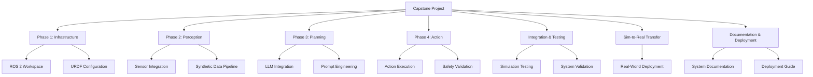

# Integrated Humanoid Robot System Capstone Project

## Learning Objectives

After completing this capstone project, you will be able to:
- Integrate all components learned in previous modules into a comprehensive humanoid robot system
- Implement a complete vision-language-action pipeline for humanoid robot control
- Deploy and validate a humanoid robot system in both simulation and real-world environments
- Apply safety validation frameworks to ensure safe robot operation
- Document and deploy a complete humanoid robot system

## Capstone Overview

The capstone project integrates all components from the previous modules into a comprehensive humanoid robot system. This project brings together:
- ROS 2 communication and node management (Module 1)
- Simulation environments and physics modeling (Module 2)
- Isaac Sim for photorealistic rendering and synthetic data generation (Module 3)
- Vision-Language-Action integration for intelligent robot control (Module 4)

This capstone demonstrates the complete pipeline from simulation to real-world deployment, showcasing how all components work together to create an intelligent humanoid robot system.

## Project Structure

The capstone project is organized into the following phases:

1. **Phase 1: Infrastructure Setup** - Core ROS 2 workspace and URDF configuration
2. **Phase 2: Perception System** - Multimodal sensing and synthetic data pipeline
3. **Phase 3: Planning and Reasoning** - LLM integration and decision making
4. **Phase 4: Action Execution** - Control systems and safety validation
5. **Integration and Testing** - System integration and validation
6. **Sim-to-Real Transfer** - Bridging simulation and real-world deployment
7. **Documentation and Deployment** - Final system documentation and deployment

## Prerequisites

To successfully complete this capstone project, you should have:
- Completed all previous modules (Modules 1-4)
- Access to a humanoid robot simulation environment (Isaac Sim recommended)
- Development environment with ROS 2 Jazzy Jalisco installed
- Understanding of Python 3.10+ and modern robotics frameworks
- Access to GPU resources for synthetic data generation and vision processing

## Capstone Requirements

Your completed capstone system should include:
- A functioning humanoid robot simulation with realistic physics
- Vision-language-action pipeline for natural language command interpretation
- Safety validation framework ensuring safe operation
- Integration with Isaac Sim for synthetic data generation
- Documentation of the complete system architecture

## Getting Started

This capstone project will guide you through building a complete humanoid robot system that integrates all components learned in previous modules. Each phase builds upon the previous work, culminating in a fully functional system that demonstrates vision-language-action integration for intelligent humanoid robot control.

The project is designed to be completed over several weeks, with each phase requiring 3-5 days of focused work depending on your experience level.

:::tip
Start with the infrastructure setup and ensure all components can communicate before moving to more complex phases. The foundation you build in Phase 1 will support all subsequent development.
:::

:::warning
Safety validation is critical throughout the project. Implement safety checks early and validate each component before integration.
:::

## Next Steps

In the following sections, we'll begin with Phase 1: Infrastructure Setup, where you'll establish the core ROS 2 workspace and configure your humanoid robot URDF model.