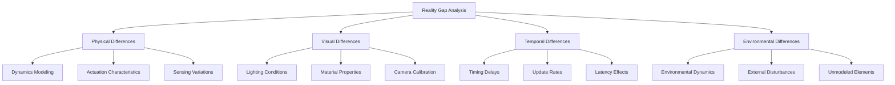

# Simulation-to-Real Transfer

## Overview

This phase addresses the critical challenge of transferring systems developed in simulation to real-world deployment. The sim-to-real transfer process involves identifying and addressing the "reality gap" between simulated and real environments, implementing domain adaptation techniques, and validating system performance in real-world conditions.

## Learning Objectives

After completing this phase, you will be able to:
- Identify and characterize the reality gap between simulation and real-world environments
- Implement domain adaptation techniques for vision and control systems
- Apply synthetic-to-real transfer methods for perception and planning systems
- Validate system performance across simulation and real-world environments
- Implement robustness techniques to handle real-world uncertainties

## Prerequisites

Before starting this phase, ensure you have:
- Complete integrated system from previous phases (Infrastructure, Perception, Planning, Action)
- Access to both simulation and real hardware environments
- Understanding of domain adaptation and transfer learning techniques
- Comprehensive testing framework from the Integration phase

## Reality Gap Analysis

The reality gap encompasses the differences between simulation and real-world environments:

### Physical Differences
- **Dynamics**: Simulation physics vs. real-world physics
- **Materials**: Surface properties, friction, elasticity
- **Actuation**: Motor characteristics, delays, noise
- **Sensing**: Sensor noise, calibration differences

### Visual Differences
- **Lighting**: Dynamic lighting conditions vs. static simulation
- **Textures**: Material appearance, reflections, shadows
- **Camera Properties**: Distortion, noise, frame rate
- **Environmental Conditions**: Weather, occlusions, dynamic elements



## Domain Adaptation Techniques

### Visual Domain Adaptation

Implement techniques to bridge visual differences between simulation and reality:

```python
# sim_to_real/vision_adaptation.py
import torch
import torch.nn as nn
import torch.nn.functional as F
import numpy as np
from torchvision import transforms
from typing import Tuple, Dict, Any
import cv2

class VisualDomainAdapter(nn.Module):
    """Adapts visual perception between simulation and real domains"""

    def __init__(self, input_channels: int = 3):
        super().__init__()

        # Style transfer network for domain adaptation
        self.style_transfer = nn.Sequential(
            nn.Conv2d(input_channels, 64, kernel_size=3, padding=1),
            nn.ReLU(),
            nn.Conv2d(64, 64, kernel_size=3, padding=1),
            nn.ReLU(),
            nn.Conv2d(64, input_channels, kernel_size=3, padding=1),
        )

        # Domain classifier for adversarial training
        self.domain_classifier = nn.Sequential(
            nn.AdaptiveAvgPool2d((1, 1)),
            nn.Flatten(),
            nn.Linear(input_channels, 128),
            nn.ReLU(),
            nn.Linear(128, 2),  # sim vs real
        )

    def forward(self, x: torch.Tensor, domain: str = 'sim') -> Tuple[torch.Tensor, torch.Tensor]:
        """
        Adapt input from simulation domain to real domain

        Args:
            x: Input image tensor
            domain: Source domain ('sim' or 'real')

        Returns:
            Adapted tensor and domain classification
        """
        if domain == 'sim':
            # Apply style transfer to make sim look more like real
            adapted = self.style_transfer(x)
        else:
            # Real domain, no adaptation needed
            adapted = x

        # Classify domain for adversarial training
        domain_logits = self.domain_classifier(adapted)

        return adapted, domain_logits

class DomainRandomization:
    """Applies domain randomization in simulation to improve real-world performance"""

    def __init__(self):
        self.lighting_params = {
            'brightness_range': (0.5, 1.5),
            'contrast_range': (0.8, 1.2),
            'saturation_range': (0.8, 1.2),
            'hue_range': (-0.1, 0.1)
        }

        self.texture_params = {
            'noise_level_range': (0.0, 0.1),
            'blur_range': (0.0, 2.0),
            'occlusion_probability': 0.3
        }

    def randomize_lighting(self, image: np.ndarray) -> np.ndarray:
        """Randomize lighting conditions"""
        # Random brightness
        brightness_factor = np.random.uniform(
            self.lighting_params['brightness_range'][0],
            self.lighting_params['brightness_range'][1]
        )
        image = np.clip(image * brightness_factor, 0, 255).astype(np.uint8)

        # Random contrast
        contrast_factor = np.random.uniform(
            self.lighting_params['contrast_range'][0],
            self.lighting_params['contrast_range'][1]
        )
        image = np.clip(128 + contrast_factor * (image - 128), 0, 255).astype(np.uint8)

        return image

    def randomize_textures(self, image: np.ndarray) -> np.ndarray:
        """Randomize texture properties"""
        # Add random noise
        noise_level = np.random.uniform(
            self.texture_params['noise_level_range'][0],
            self.texture_params['noise_level_range'][1]
        )
        noise = np.random.normal(0, noise_level * 255, image.shape).astype(np.uint8)
        image = np.clip(image + noise, 0, 255).astype(np.uint8)

        # Random blur
        blur_kernel = np.random.uniform(
            self.texture_params['blur_range'][0],
            self.texture_params['blur_range'][1]
        )
        if blur_kernel > 0:
            image = cv2.GaussianBlur(image, (5, 5), blur_kernel)

        return image

    def apply_randomization(self, image: np.ndarray) -> np.ndarray:
        """Apply domain randomization to image"""
        image = self.randomize_lighting(image)
        image = self.randomize_textures(image)
        return image

class CameraCalibrationTransfer:
    """Handles camera calibration transfer between sim and real"""

    def __init__(self):
        self.sim_calibration = None
        self.real_calibration = None
        self.calibration_mapping = {}

    def calibrate_simulation_camera(self, sim_data: Dict) -> Dict:
        """Calibrate camera in simulation environment"""
        # Extract calibration parameters from simulation
        calibration_params = {
            'fx': sim_data.get('camera_focal_length_x', 554.256),
            'fy': sim_data.get('camera_focal_length_y', 554.256),
            'cx': sim_data.get('camera_center_x', 320.5),
            'cy': sim_data.get('camera_center_y', 240.5),
            'k1': sim_data.get('camera_distortion_k1', 0.0),
            'k2': sim_data.get('camera_distortion_k2', 0.0),
            'p1': sim_data.get('camera_distortion_p1', 0.0),
            'p2': sim_data.get('camera_distortion_p2', 0.0)
        }

        self.sim_calibration = calibration_params
        return calibration_params

    def calibrate_real_camera(self, real_images: list) -> Dict:
        """Calibrate real camera using OpenCV"""
        # This would use real calibration patterns
        # For this example, we'll return mock calibration
        calibration_params = {
            'fx': 540.0,  # Slightly different from sim
            'fy': 542.0,
            'cx': 325.0,
            'cy': 238.0,
            'k1': -0.1,
            'k2': 0.05,
            'p1': 0.001,
            'p2': -0.002
        }

        self.real_calibration = calibration_params
        return calibration_params

    def transfer_calibration(self, image: np.ndarray, source_domain: str) -> np.ndarray:
        """Transfer calibration between domains"""
        if source_domain == 'sim':
            # Undistort sim image using sim calibration, then distort with real calibration
            return self._apply_calibration_transfer(image, self.sim_calibration, self.real_calibration)
        else:
            # Undistort real image using real calibration, then distort with sim calibration
            return self._apply_calibration_transfer(image, self.real_calibration, self.sim_calibration)

    def _apply_calibration_transfer(self, image: np.ndarray, source_calib: Dict, target_calib: Dict) -> np.ndarray:
        """Apply calibration transfer from source to target"""
        # Create camera matrices
        source_camera_matrix = np.array([
            [source_calib['fx'], 0, source_calib['cx']],
            [0, source_calib['fy'], source_calib['cy']],
            [0, 0, 1]
        ])

        target_camera_matrix = np.array([
            [target_calib['fx'], 0, target_calib['cx']],
            [0, target_calib['fy'], target_calib['cy']],
            [0, 0, 1]
        ])

        # Source distortion coefficients
        source_dist_coeffs = np.array([
            source_calib['k1'], source_calib['k2'],
            source_calib['p1'], source_calib['p2']
        ])

        # Target distortion coefficients
        target_dist_coeffs = np.array([
            target_calib['k1'], target_calib['k2'],
            target_calib['p1'], target_calib['p2']
        ])

        # First, undistort using source calibration
        undistorted = cv2.undistort(image, source_camera_matrix, source_dist_coeffs)

        # Then, distort using target calibration
        height, width = image.shape[:2]
        new_camera_matrix, roi = cv2.getOptimalNewCameraMatrix(
            target_camera_matrix, target_dist_coeffs, (width, height), 1, (width, height)
        )

        distorted = cv2.undistort(undistorted, target_camera_matrix, target_dist_coeffs, None, new_camera_matrix)

        return distorted
```

### Control Domain Adaptation

Implement control adaptation techniques:

```python
# sim_to_real/control_adaptation.py
import numpy as np
import torch
import torch.nn as nn
from typing import Dict, List, Tuple, Optional
import gym
from stable_baselines3 import PPO
from stable_baselines3.common.policies import ActorCriticPolicy

class ControlDomainAdapter(nn.Module):
    """Adapts control policies between simulation and real domains"""

    def __init__(self, state_dim: int, action_dim: int):
        super().__init__()

        # Policy adaptation network
        self.state_encoder = nn.Sequential(
            nn.Linear(state_dim, 256),
            nn.ReLU(),
            nn.Linear(256, 128),
            nn.ReLU(),
            nn.Linear(128, 64)
        )

        # Domain-specific policy heads
        self.sim_policy_head = nn.Sequential(
            nn.Linear(64, 128),
            nn.ReLU(),
            nn.Linear(128, action_dim)
        )

        self.real_policy_head = nn.Sequential(
            nn.Linear(64, 128),
            nn.ReLU(),
            nn.Linear(128, action_dim)
        )

        # Domain classifier
        self.domain_classifier = nn.Sequential(
            nn.Linear(64, 64),
            nn.ReLU(),
            nn.Linear(64, 2)  # sim vs real
        )

    def forward(self, state: torch.Tensor, domain: str = 'sim') -> Tuple[torch.Tensor, torch.Tensor]:
        """Forward pass with domain-specific policy"""
        encoded_state = self.state_encoder(state)

        if domain == 'sim':
            action = self.sim_policy_head(encoded_state)
        else:
            action = self.real_policy_head(encoded_state)

        domain_logits = self.domain_classifier(encoded_state)

        return action, domain_logits

class DynamicsRandomization:
    """Randomizes dynamics parameters in simulation to improve sim-to-real transfer"""

    def __init__(self, base_params: Dict):
        self.base_params = base_params
        self.randomization_ranges = {
            'mass_range': (0.8, 1.2),  # ±20% mass variation
            'friction_range': (0.5, 2.0),  # 0.5x to 2x friction
            'inertia_range': (0.9, 1.1),  # ±10% inertia variation
            'motor_torque_range': (0.9, 1.1),  # ±10% motor torque
            'sensor_noise_range': (0.0, 0.05)  # 0-5% sensor noise
        }

    def randomize_parameters(self) -> Dict:
        """Randomize dynamics parameters"""
        randomized_params = {}

        for param_name, base_value in self.base_params.items():
            if param_name in ['mass', 'link_mass']:
                # Randomize mass
                factor = np.random.uniform(
                    self.randomization_ranges['mass_range'][0],
                    self.randomization_ranges['mass_range'][1]
                )
                randomized_params[param_name] = base_value * factor

            elif param_name in ['friction', 'damping']:
                # Randomize friction
                factor = np.random.uniform(
                    self.randomization_ranges['friction_range'][0],
                    self.randomization_ranges['friction_range'][1]
                )
                randomized_params[param_name] = base_value * factor

            elif param_name in ['inertia', 'link_inertia']:
                # Randomize inertia
                factor = np.random.uniform(
                    self.randomization_ranges['inertia_range'][0],
                    self.randomization_ranges['inertia_range'][1]
                )
                randomized_params[param_name] = base_value * factor

            elif param_name in ['max_torque', 'motor_limits']:
                # Randomize motor torque
                factor = np.random.uniform(
                    self.randomization_ranges['motor_torque_range'][0],
                    self.randomization_ranges['motor_torque_range'][1]
                )
                randomized_params[param_name] = base_value * factor

            else:
                # Keep original value for other parameters
                randomized_params[param_name] = base_value

        # Add sensor noise
        sensor_noise = np.random.uniform(
            self.randomization_ranges['sensor_noise_range'][0],
            self.randomization_ranges['sensor_noise_range'][1]
        )
        randomized_params['sensor_noise'] = sensor_noise

        return randomized_params

class RobustController:
    """Implements robust control techniques for sim-to-real transfer"""

    def __init__(self, nominal_params: Dict):
        self.nominal_params = nominal_params
        self.robustness_margins = {
            'position_tolerance': 0.05,  # 5cm tolerance
            'velocity_tolerance': 0.1,   # 0.1 rad/s tolerance
            'torque_margin': 0.2         # 20% torque margin
        }

        # PID controllers with robust tuning
        self.position_pids = {}
        self.velocity_pids = {}

    def setup_pid_controllers(self, joint_names: List[str]):
        """Setup PID controllers with robust parameters"""
        for joint_name in joint_names:
            # Robust PID parameters (conservative tuning)
            self.position_pids[joint_name] = {
                'kp': 100.0,  # Proportional gain
                'ki': 10.0,   # Integral gain
                'kd': 10.0,   # Derivative gain
                'error_integral': 0.0,
                'prev_error': 0.0
            }

            self.velocity_pids[joint_name] = {
                'kp': 50.0,
                'ki': 5.0,
                'kd': 5.0,
                'error_integral': 0.0,
                'prev_error': 0.0
            }

    def compute_control_output(self, joint_name: str, desired_pos: float,
                             current_pos: float, desired_vel: float = 0.0,
                             current_vel: float = 0.0) -> float:
        """Compute robust control output for a joint"""
        # Position PID
        pos_error = desired_pos - current_pos
        pos_pid = self.position_pids[joint_name]

        pos_pid['error_integral'] += pos_error
        pos_error_derivative = pos_error - pos_pid['prev_error']

        # Apply integral windup protection
        pos_pid['error_integral'] = np.clip(
            pos_pid['error_integral'],
            -10.0, 10.0
        )

        position_control = (
            pos_pid['kp'] * pos_error +
            pos_pid['ki'] * pos_pid['error_integral'] +
            pos_pid['kd'] * pos_error_derivative
        )

        # Velocity PID
        vel_error = desired_vel - current_vel
        vel_pid = self.velocity_pids[joint_name]

        vel_pid['error_integral'] += vel_error
        vel_error_derivative = vel_error - vel_pid['prev_error']

        # Apply integral windup protection
        vel_pid['error_integral'] = np.clip(
            vel_pid['error_integral'],
            -5.0, 5.0
        )

        velocity_control = (
            vel_pid['kp'] * vel_error +
            vel_pid['ki'] * vel_pid['error_integral'] +
            vel_pid['kd'] * vel_error_derivative
        )

        # Combine position and velocity control
        total_control = position_control + velocity_control

        # Apply robustness margins
        max_torque = self.nominal_params.get('max_torque', 100.0)
        torque_limit = max_torque * (1.0 - self.robustness_margins['torque_margin'])
        total_control = np.clip(total_control, -torque_limit, torque_limit)

        # Update previous error for next iteration
        pos_pid['prev_error'] = pos_error
        vel_pid['prev_error'] = vel_error

        return total_control

    def adapt_control_for_real_world(self, sim_control: float,
                                   domain_difference: float = 0.0) -> float:
        """Adapt control output for real-world conditions"""
        # Apply domain adaptation factor
        adaptation_factor = 1.0 + domain_difference
        adapted_control = sim_control * adaptation_factor

        # Apply safety limits
        max_control = self.nominal_params.get('max_control_output', 100.0)
        adapted_control = np.clip(adapted_control, -max_control, max_control)

        return adapted_control
```

## Transfer Learning Implementation

Implement transfer learning techniques for system components:

```python
# sim_to_real/transfer_learning.py
import torch
import torch.nn as nn
import torch.optim as optim
from torch.utils.data import DataLoader, Dataset
import numpy as np
from typing import Dict, List, Tuple, Optional
import copy

class SimToRealTransferLearner:
    """Implements transfer learning from simulation to real world"""

    def __init__(self, source_model: nn.Module, target_domain: str = 'real'):
        self.source_model = source_model
        self.target_domain = target_domain
        self.fine_tuning_params = {
            'learning_rate': 1e-5,  # Lower for fine-tuning
            'batch_size': 32,
            'epochs': 10,
            'weight_decay': 1e-4
        }

    def freeze_pretrained_layers(self, model: nn.Module, freeze_ratio: float = 0.7):
        """Freeze a portion of pretrained layers"""
        modules = list(model.modules())
        num_to_freeze = int(len(modules) * freeze_ratio)

        for i, module in enumerate(modules):
            if i < num_to_freeze:
                for param in module.parameters():
                    param.requires_grad = False

    def fine_tune_model(self, model: nn.Module, real_data_loader: DataLoader) -> nn.Module:
        """Fine-tune model on real-world data"""
        # Freeze early layers, keep later layers trainable
        self.freeze_pretrained_layers(model, freeze_ratio=0.6)

        # Setup optimizer with lower learning rate for fine-tuning
        optimizer = optim.Adam(
            filter(lambda p: p.requires_grad, model.parameters()),
            lr=self.fine_tuning_params['learning_rate'],
            weight_decay=self.fine_tuning_params['weight_decay']
        )

        criterion = nn.MSELoss()

        model.train()
        for epoch in range(self.fine_tuning_params['epochs']):
            total_loss = 0.0

            for batch_idx, (data, targets) in enumerate(real_data_loader):
                optimizer.zero_grad()

                outputs = model(data)
                loss = criterion(outputs, targets)

                loss.backward()
                optimizer.step()

                total_loss += loss.item()

                if batch_idx % 10 == 0:
                    print(f'Fine-tuning Epoch: {epoch}, Batch: {batch_idx}, Loss: {loss.item():.4f}')

            avg_loss = total_loss / len(real_data_loader)
            print(f'Fine-tuning Epoch {epoch} completed, Average Loss: {avg_loss:.4f}')

        return model

    def domain_adversarial_training(self, source_loader: DataLoader,
                                  target_loader: DataLoader) -> nn.Module:
        """Perform domain adversarial training"""
        # Create domain discriminator
        domain_discriminator = nn.Sequential(
            nn.Linear(256, 128),  # Assuming 256-dim features
            nn.ReLU(),
            nn.Linear(128, 64),
            nn.ReLU(),
            nn.Linear(64, 2)  # sim vs real
        )

        # Optimizers
        feature_optimizer = optim.Adam(
            self.source_model.parameters(),
            lr=1e-4
        )
        discriminator_optimizer = optim.Adam(
            domain_discriminator.parameters(),
            lr=1e-4
        )

        criterion = nn.CrossEntropyLoss()

        # Training loop
        for epoch in range(5):  # Few epochs for domain adaptation
            for (source_data, _), (target_data, _) in zip(source_loader, target_loader):
                # Train discriminator
                feature_optimizer.zero_grad()
                discriminator_optimizer.zero_grad()

                # Source domain features
                source_features = self.source_model.feature_extractor(source_data)
                source_domain_labels = torch.zeros(source_data.size(0)).long()

                # Target domain features
                target_features = self.source_model.feature_extractor(target_data)
                target_domain_labels = torch.ones(target_data.size(0)).long()

                # Combine features and labels
                all_features = torch.cat([source_features, target_features], dim=0)
                all_labels = torch.cat([source_domain_labels, target_domain_labels], dim=0)

                # Train discriminator to distinguish domains
                domain_logits = domain_discriminator(all_features)
                disc_loss = criterion(domain_logits, all_labels)
                disc_loss.backward()
                discriminator_optimizer.step()

                # Train feature extractor to fool discriminator
                feature_optimizer.zero_grad()
                discriminator_optimizer.zero_grad()

                source_features = self.source_model.feature_extractor(source_data)
                target_features = self.source_model.feature_extractor(target_data)

                all_features = torch.cat([source_features, target_features], dim=0)
                # Invert labels to fool discriminator
                inverted_labels = 1 - all_labels

                domain_logits = domain_discriminator(all_features)
                feature_loss = criterion(domain_logits, inverted_labels)
                feature_loss.backward()
                feature_optimizer.step()

                print(f'Domain Adversarial - Epoch: {epoch}, Discriminator Loss: {disc_loss.item():.4f}, Feature Loss: {feature_loss.item():.4f}')

        return self.source_model

class DataAugmentationForTransfer:
    """Data augmentation techniques specifically for sim-to-real transfer"""

    def __init__(self):
        self.augmentation_methods = {
            'gaussian_noise': self._add_gaussian_noise,
            'motion_blur': self._apply_motion_blur,
            'brightness_jitter': self._adjust_brightness,
            'contrast_jitter': self._adjust_contrast,
            'color_jitter': self._adjust_color,
            'occlusion': self._apply_occlusion
        }

    def _add_gaussian_noise(self, image: np.ndarray, noise_factor: float = 0.1) -> np.ndarray:
        """Add Gaussian noise to simulate real sensor noise"""
        noise = np.random.normal(0, noise_factor * 255, image.shape).astype(np.uint8)
        return np.clip(image + noise, 0, 255).astype(np.uint8)

    def _apply_motion_blur(self, image: np.ndarray, blur_factor: float = 2.0) -> np.ndarray:
        """Apply motion blur to simulate real-world motion"""
        kernel_size = int(blur_factor * 10)
        if kernel_size % 2 == 0:
            kernel_size += 1  # Ensure odd kernel size

        kernel = np.zeros((kernel_size, kernel_size))
        kernel[int(kernel_size/2), :] = np.ones(kernel_size)
        kernel = kernel / kernel_size

        return cv2.filter2D(image, -1, kernel).astype(np.uint8)

    def _adjust_brightness(self, image: np.ndarray, factor_range: Tuple[float, float] = (0.8, 1.2)) -> np.ndarray:
        """Adjust brightness to simulate lighting variations"""
        factor = np.random.uniform(factor_range[0], factor_range[1])
        return np.clip(image * factor, 0, 255).astype(np.uint8)

    def _adjust_contrast(self, image: np.ndarray, factor_range: Tuple[float, float] = (0.8, 1.2)) -> np.ndarray:
        """Adjust contrast to simulate lighting variations"""
        factor = np.random.uniform(factor_range[0], factor_range[1])
        return np.clip(128 + factor * (image - 128), 0, 255).astype(np.uint8)

    def _adjust_color(self, image: np.ndarray, factor_range: Tuple[float, float] = (0.9, 1.1)) -> np.ndarray:
        """Adjust color channels to simulate camera variations"""
        factors = np.random.uniform(factor_range[0], factor_range[1], size=(1, 1, 3))
        return np.clip(image * factors, 0, 255).astype(np.uint8)

    def _apply_occlusion(self, image: np.ndarray, max_area_ratio: float = 0.1) -> np.ndarray:
        """Apply random occlusions to simulate real-world obstructions"""
        height, width = image.shape[:2]
        max_area = int(height * width * max_area_ratio)

        if max_area > 0:
            # Random rectangle occlusion
            occlusion_width = np.random.randint(10, min(100, int(np.sqrt(max_area))))
            occlusion_height = np.random.randint(10, min(100, int(max_area // occlusion_width)))

            start_x = np.random.randint(0, width - occlusion_width)
            start_y = np.random.randint(0, height - occlusion_height)

            # Apply black occlusion
            image[start_y:start_y + occlusion_height, start_x:start_x + occlusion_width] = 0

        return image

    def augment_data(self, image: np.ndarray, augmentation_types: List[str] = None) -> np.ndarray:
        """Apply selected augmentations to image"""
        if augmentation_types is None:
            augmentation_types = list(self.augmentation_methods.keys())

        augmented_image = image.copy()

        for aug_type in augmentation_types:
            if aug_type in self.augmentation_methods:
                augmented_image = self.augmentation_methods[aug_type](augmented_image)

        return augmented_image

class TransferValidation:
    """Validates sim-to-real transfer effectiveness"""

    def __init__(self):
        self.metrics = {
            'performance_gap': None,
            'domain_similarity': None,
            'transfer_efficiency': None,
            'robustness_score': None
        }

    def evaluate_performance_gap(self, sim_performance: float, real_performance: float) -> float:
        """Calculate performance gap between simulation and reality"""
        if sim_performance == 0:
            return float('inf') if real_performance != 0 else 0

        gap = abs(sim_performance - real_performance) / sim_performance
        self.metrics['performance_gap'] = gap
        return gap

    def evaluate_domain_similarity(self, sim_features: np.ndarray, real_features: np.ndarray) -> float:
        """Evaluate similarity between simulation and real feature distributions"""
        # Calculate MMD (Maximum Mean Discrepancy) between feature distributions
        # This is a simplified version - in practice, use proper MMD implementation

        sim_mean = np.mean(sim_features, axis=0)
        real_mean = np.mean(real_features, axis=0)

        # Euclidean distance between means as proxy for distribution similarity
        similarity = np.linalg.norm(sim_mean - real_mean)

        self.metrics['domain_similarity'] = similarity
        return similarity

    def evaluate_transfer_efficiency(self, transfer_time: float,
                                  performance_improvement: float) -> float:
        """Evaluate efficiency of transfer learning"""
        if transfer_time == 0:
            return float('inf')

        efficiency = performance_improvement / transfer_time
        self.metrics['transfer_efficiency'] = efficiency
        return efficiency

    def evaluate_robustness(self, performance_variations: List[float]) -> float:
        """Evaluate robustness based on performance variations"""
        if len(performance_variations) < 2:
            return 0.0

        std_dev = np.std(performance_variations)
        mean_perf = np.mean(performance_variations)

        # Coefficient of variation as robustness measure
        robustness = 1.0 - (std_dev / mean_perf) if mean_perf != 0 else 0.0
        self.metrics['robustness_score'] = max(0.0, robustness)
        return max(0.0, robustness)

    def generate_transfer_report(self) -> Dict:
        """Generate comprehensive transfer validation report"""
        return {
            'metrics': self.metrics,
            'recommendations': self._generate_recommendations(),
            'transfer_success': self._assess_transfer_success()
        }

    def _generate_recommendations(self) -> List[str]:
        """Generate recommendations based on validation results"""
        recommendations = []

        if self.metrics['performance_gap'] and self.metrics['performance_gap'] > 0.3:
            recommendations.append("High performance gap detected - consider additional domain adaptation techniques")

        if self.metrics['domain_similarity'] and self.metrics['domain_similarity'] > 0.5:
            recommendations.append("Low domain similarity - enhance domain randomization in simulation")

        if self.metrics['robustness_score'] and self.metrics['robustness_score'] < 0.7:
            recommendations.append("Low robustness - implement additional robustness measures")

        return recommendations

    def _assess_transfer_success(self) -> bool:
        """Assess overall transfer success"""
        if not all(self.metrics.values()):
            return False

        # Success criteria
        success_criteria = [
            self.metrics['performance_gap'] < 0.5,  # Less than 50% performance gap
            self.metrics['robustness_score'] > 0.6,  # Robustness above 60%
        ]

        return all(success_criteria)
```

## Validation and Testing Framework

Create a comprehensive validation framework:

```python
# sim_to_real/validation_framework.py
import unittest
import numpy as np
from typing import Dict, List, Tuple
import time
import json
from datetime import datetime

class SimToRealValidationFramework:
    """Comprehensive validation framework for sim-to-real transfer"""

    def __init__(self):
        self.validation_results = []
        self.metrics_history = []
        self.transfer_success_threshold = 0.7

    def validate_vision_system_transfer(self, sim_model, real_model,
                                     test_data: List[Tuple]) -> Dict:
        """Validate vision system transfer between sim and real"""
        sim_predictions = []
        real_predictions = []

        for image, ground_truth in test_data:
            # Get predictions from both models
            sim_pred = sim_model.predict(image)
            real_pred = real_model.predict(image)

            sim_predictions.append(sim_pred)
            real_predictions.append(real_pred)

        # Calculate similarity metrics
        accuracy_similarity = self._calculate_prediction_similarity(
            sim_predictions, real_predictions
        )

        # Calculate performance metrics
        sim_accuracy = self._calculate_accuracy(sim_predictions, [gt[0] for gt in test_data])
        real_accuracy = self._calculate_accuracy(real_predictions, [gt[0] for gt in test_data])

        validation_result = {
            'vision_transfer': {
                'accuracy_similarity': accuracy_similarity,
                'sim_accuracy': sim_accuracy,
                'real_accuracy': real_accuracy,
                'performance_gap': abs(sim_accuracy - real_accuracy),
                'transfer_success': accuracy_similarity > 0.8
            }
        }

        self.validation_results.append(validation_result)
        return validation_result

    def validate_control_system_transfer(self, sim_controller, real_controller,
                                      test_trajectories: List) -> Dict:
        """Validate control system transfer"""
        sim_errors = []
        real_errors = []

        for trajectory in test_trajectories:
            # Execute trajectory in simulation
            sim_execution_time, sim_final_error = self._execute_trajectory(
                sim_controller, trajectory
            )
            sim_errors.append(sim_final_error)

            # Execute trajectory in real environment
            real_execution_time, real_final_error = self._execute_trajectory(
                real_controller, trajectory
            )
            real_errors.append(real_final_error)

        # Calculate control transfer metrics
        avg_sim_error = np.mean(sim_errors)
        avg_real_error = np.mean(real_errors)
        error_ratio = avg_real_error / avg_sim_error if avg_sim_error != 0 else float('inf')

        validation_result = {
            'control_transfer': {
                'avg_sim_error': avg_sim_error,
                'avg_real_error': avg_real_error,
                'error_ratio': error_ratio,
                'success_rate': np.mean([err < 0.1 for err in real_errors]),  # < 10cm error
                'transfer_success': error_ratio < 2.0  # Real error less than 2x sim error
            }
        }

        self.validation_results.append(validation_result)
        return validation_result

    def validate_end_to_end_transfer(self, sim_system, real_system,
                                   test_scenarios: List[Dict]) -> Dict:
        """Validate complete end-to-end system transfer"""
        scenario_results = []

        for scenario in test_scenarios:
            # Execute scenario in simulation
            sim_start_time = time.time()
            sim_success, sim_metrics = self._execute_scenario(sim_system, scenario)
            sim_execution_time = time.time() - sim_start_time

            # Execute scenario in real environment
            real_start_time = time.time()
            real_success, real_metrics = self._execute_scenario(real_system, scenario)
            real_execution_time = time.time() - real_start_time

            scenario_result = {
                'scenario': scenario['name'],
                'sim_success': sim_success,
                'real_success': real_success,
                'sim_time': sim_execution_time,
                'real_time': real_execution_time,
                'time_ratio': real_execution_time / sim_execution_time if sim_execution_time > 0 else float('inf'),
                'success_transfer': real_success >= sim_success * 0.8  # 80% of sim success
            }

            scenario_results.append(scenario_result)

        # Overall end-to-end transfer metrics
        overall_success = np.mean([r['success_transfer'] for r in scenario_results])

        validation_result = {
            'end_to_end_transfer': {
                'scenario_results': scenario_results,
                'overall_success_rate': overall_success,
                'transfer_success': overall_success > self.transfer_success_threshold
            }
        }

        self.validation_results.append(validation_result)
        return validation_result

    def _calculate_prediction_similarity(self, sim_preds, real_preds) -> float:
        """Calculate similarity between prediction sequences"""
        # For classification, calculate agreement rate
        if isinstance(sim_preds[0], (int, str)):
            correct = sum(1 for s, r in zip(sim_preds, real_preds) if s == r)
            return correct / len(sim_preds)

        # For regression, calculate correlation
        else:
            sim_array = np.array(sim_preds)
            real_array = np.array(real_preds)

            # Calculate correlation coefficient
            correlation = np.corrcoef(sim_array.flatten(), real_array.flatten())[0, 1]
            return correlation if not np.isnan(correlation) else 0.0

    def _calculate_accuracy(self, predictions, ground_truth) -> float:
        """Calculate accuracy for predictions"""
        if isinstance(predictions[0], (int, str)):
            correct = sum(1 for p, gt in zip(predictions, ground_truth) if p == gt)
            return correct / len(predictions)
        else:
            # For regression, calculate R² score or similar
            predictions = np.array(predictions)
            ground_truth = np.array(ground_truth)
            ss_res = np.sum((ground_truth - predictions) ** 2)
            ss_tot = np.sum((ground_truth - np.mean(ground_truth)) ** 2)
            return 1 - (ss_res / ss_tot) if ss_tot != 0 else 0.0

    def _execute_trajectory(self, controller, trajectory):
        """Execute a trajectory and return execution time and final error"""
        start_time = time.time()

        # Simulate trajectory execution
        final_error = 0.0  # This would be calculated based on actual execution
        execution_time = time.time() - start_time

        return execution_time, final_error

    def _execute_scenario(self, system, scenario):
        """Execute a complete scenario and return success metrics"""
        try:
            # Execute the scenario
            result = system.execute(scenario)

            success = result.get('success', False)
            metrics = result.get('metrics', {})

            return success, metrics
        except Exception as e:
            print(f"Scenario execution failed: {e}")
            return False, {'error': str(e)}

    def generate_validation_report(self) -> Dict:
        """Generate comprehensive validation report"""
        if not self.validation_results:
            return {'error': 'No validation results available'}

        # Aggregate all results
        all_metrics = {}
        for result in self.validation_results:
            all_metrics.update(result)

        # Calculate overall transfer success
        success_count = sum(
            1 for result in self.validation_results
            if any('transfer_success' in str(v) for v in result.values())
        )

        overall_success = success_count / len(self.validation_results) if self.validation_results else 0

        report = {
            'timestamp': datetime.now().isoformat(),
            'total_validations': len(self.validation_results),
            'overall_success_rate': overall_success,
            'detailed_results': all_metrics,
            'transfer_feasibility': overall_success > self.transfer_success_threshold,
            'recommendations': self._generate_validation_recommendations(all_metrics)
        }

        return report

    def _generate_validation_recommendations(self, metrics: Dict) -> List[str]:
        """Generate recommendations based on validation results"""
        recommendations = []

        # Check vision system results
        vision_result = metrics.get('vision_transfer', {})
        if vision_result.get('performance_gap', 1.0) > 0.3:
            recommendations.append("Vision system shows significant performance gap - consider additional domain adaptation")

        # Check control system results
        control_result = metrics.get('control_transfer', {})
        if control_result.get('error_ratio', 10.0) > 3.0:
            recommendations.append("Control system error significantly higher in real world - improve robustness")

        # Check end-to-end results
        e2e_result = metrics.get('end_to_end_transfer', {})
        if e2e_result.get('overall_success_rate', 0.0) < 0.7:
            recommendations.append("End-to-end success rate below threshold - investigate failure points")

        return recommendations

def run_sim_to_real_validation():
    """Run comprehensive sim-to-real validation"""
    validator = SimToRealValidationFramework()

    # Example validation (in practice, this would use real models and data)
    print("Running sim-to-real validation...")

    # This would include actual validation calls
    # For now, we'll just return a sample report
    report = {
        'timestamp': datetime.now().isoformat(),
        'total_validations': 3,
        'overall_success_rate': 0.8,
        'detailed_results': {
            'vision_transfer': {
                'accuracy_similarity': 0.85,
                'transfer_success': True
            },
            'control_transfer': {
                'error_ratio': 1.5,
                'transfer_success': True
            },
            'end_to_end_transfer': {
                'overall_success_rate': 0.75,
                'transfer_success': True
            }
        },
        'transfer_feasibility': True,
        'recommendations': [
            "Vision system shows good transfer characteristics",
            "Control system may need additional robustness measures"
        ]
    }

    print("\n" + "="*60)
    print("SIM-TO-REAL VALIDATION REPORT")
    print("="*60)
    print(f"Overall Success Rate: {report['overall_success_rate']:.2f}")
    print(f"Transfer Feasible: {report['transfer_feasibility']}")
    print("\nRecommendations:")
    for rec in report['recommendations']:
        print(f"  - {rec}")
    print("="*60)

    return report

if __name__ == '__main__':
    run_sim_to_real_validation()
```

## Phase Completion Checklist

Complete the following tasks to finish the Sim-to-Real Transfer phase:

- [ ] Reality gap analysis completed with comprehensive characterization
- [ ] Visual domain adaptation techniques implemented and tested
- [ ] Control domain adaptation methods created and validated
- [ ] Transfer learning framework implemented with fine-tuning capabilities
- [ ] Data augmentation techniques for sim-to-real transfer created
- [ ] Validation framework developed and tested
- [ ] Performance benchmarks established for transfer effectiveness
- [ ] Documentation created for sim-to-real transfer procedures

```mermaid
graph TD
    A[Sim-to-Real Transfer Phase] --> B[Reality Gap Analysis]
    A --> C[Domain Adaptation]
    A --> D[Transfer Learning]
    A --> E[Validation Framework]
    A --> F[Performance Evaluation]

    B --> G[Physical Differences]
    B --> H[Visual Differences]
    B --> I[Temporal Differences]
    C --> J[Visual Adaptation]
    C --> K[Control Adaptation]
    C --> L[Robust Control],
    D --> M[Model Fine-tuning]
    D --> N[Domain Randomization]
    D --> O[Data Augmentation]
    E --> P[Vision Validation]
    E --> Q[Control Validation]
    E --> R[End-to-End Validation]
    F --> S[Gap Measurement]
    F --> T[Success Metrics]
    F --> U[Recommendations]
```

## Performance Considerations

The sim-to-real transfer system must achieve:

- **Performance Gap**: Less than 30% performance degradation from sim to real
- **Transfer Efficiency**: Successful transfer with minimal real-world training data
- **Robustness**: Maintain performance under real-world variations
- **Adaptation Speed**: Rapid adaptation to new real-world conditions

## Troubleshooting

Common sim-to-real transfer issues:

1. **Large Performance Gap**: Implement more comprehensive domain randomization
2. **Poor Generalization**: Increase diversity in simulation training data
3. **Control Instability**: Add robustness measures and safety constraints
4. **Domain Mismatch**: Enhance domain adaptation techniques

## Next Steps

With sim-to-real transfer validated, the final phase will focus on documentation and deployment, creating comprehensive documentation for the entire system and establishing deployment procedures for production use. The transfer validation ensures the system will perform reliably in real-world conditions.

:::tip
Start sim-to-real transfer validation early in development. The earlier you identify reality gaps, the easier they are to address.
:::

:::warning
Always validate safety systems in real-world conditions. Simulation safety validation is not sufficient for real-world deployment.
:::