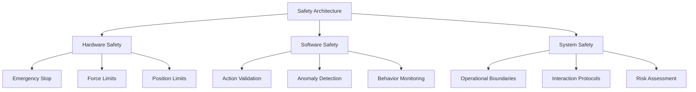

# Capstone System Architecture

## Overview

This section defines the complete system architecture for the integrated humanoid robot system. The architecture encompasses all components from perception to action execution, ensuring seamless integration of vision-language-action capabilities with safety validation and real-world deployment.

## System Components

The integrated humanoid robot system consists of several key components that work together:

- **Perception System**: Processes visual and sensory data to understand the environment
- **Language Understanding**: Interprets natural language commands and context
- **Planning and Reasoning**: Generates action plans based on perception and language input
- **Action Execution**: Translates high-level plans into low-level robot controls
- **Safety Validation**: Ensures safe operation throughout all system components
- **Simulation Environment**: Provides realistic testing and training environment
- **Communication Layer**: Facilitates coordination between all system components

```mermaid
graph TB
    A[Integrated Humanoid Robot System] --> B[Perception System]
    A --> C[Language Understanding]
    A --> D[Planning & Reasoning]
    A --> E[Action Execution]
    A --> F[Safety Validation]
    A --> G[Simulation Environment]
    A --> H[Communication Layer]

    B --> I[Visual Processing]
    B --> J[Sensor Fusion]
    B --> K[Object Detection]
    C --> L[Command Interpretation]
    C --> M[Context Understanding]
    D --> N[Task Planning]
    D --> O[Path Planning]
    D --> P[Behavior Selection]
    E --> Q[Motor Control]
    E --> R[Manipulation Control]
    E --> S[Locomotion Control]
    F --> T[Safety Monitors]
    F --> U[Validation Framework]
    F --> V[Emergency Protocols]
    H --> W[ROS 2 Communication]
    H --> X[DDS Middleware]
    H --> Y[Message Queues]
```



## High-Level Architecture

The system follows a modular architecture with clear separation of concerns:

### Perception Module
The perception module handles all sensory input processing:
- Camera feeds (RGB, depth, stereo)
- IMU and force/torque sensors
- LiDAR and other range sensors
- Audio input for voice commands

### Language Processing Module
The language processing module interprets natural language commands:
- Large Language Model (LLM) integration
- Command parsing and semantic understanding
- Context awareness and dialogue management
- Intent extraction for action planning

### Planning Module
The planning module generates executable action sequences:
- High-level task planning
- Path planning for navigation
- Manipulation planning for object interaction
- Dynamic replanning based on environment changes

### Execution Module
The execution module handles low-level robot control:
- Joint position/velocity/effort control
- Balance and stability maintenance
- Manipulation and grasping control
- Real-time motion generation

## Integration Architecture

The system components are integrated through a well-defined API structure:

### Message Formats
All system components communicate using standardized message formats:

```python
# Example message format for command execution
class RobotCommand:
    def __init__(self):
        self.command_type = "move_to"  # move_to, grasp, speak, etc.
        self.target_position = [x, y, z]
        self.orientation = [qx, qy, qz, qw]
        self.parameters = {}  # Additional command-specific parameters
        self.priority = 1  # Priority level (0-10)
        self.timeout = 30.0  # Timeout in seconds
```

### Service Interfaces
Key services provide essential functionality:

- `/planning/generate_plan` - Generate action plans from high-level goals
- `/control/execute_action` - Execute low-level robot actions
- `/perception/process_scene` - Process current scene and return object information
- `/safety/validate_action` - Validate proposed actions for safety compliance

### Safety Architecture

The safety architecture ensures safe operation at multiple levels:

1. **Hardware Safety**: Emergency stops, force limits, joint position limits
2. **Software Safety**: Action validation, behavior monitoring, anomaly detection
3. **System Safety**: Operational boundaries, human-robot interaction protocols



## Data Flow Architecture

The system processes data through a well-defined pipeline:

1. **Sensory Input**: Raw sensor data acquisition
2. **Perception Processing**: Environment understanding
3. **Command Interpretation**: Natural language understanding
4. **Plan Generation**: Action sequence creation
5. **Safety Validation**: Plan safety checking
6. **Execution**: Low-level control commands
7. **Monitoring**: Execution feedback and adjustment

## Deployment Architecture

The system supports multiple deployment configurations:

### Simulation-Only Mode
- Full system runs in simulation environment
- Used for development and testing
- No hardware dependencies

### Simulation-Hardware Co-simulation
- Perception and planning in simulation
- Control on real hardware
- Used for advanced testing

### Real-World Deployment
- Full system operational with real hardware
- Simulation used for validation and backup
- Production configuration

## Performance Considerations

The architecture is designed with performance in mind:

- **Real-time Requirements**: Critical control loops maintain 100Hz+ frequency
- **Latency Management**: Command-to-action latency under 100ms
- **Resource Optimization**: Efficient use of computational resources
- **Scalability**: Support for multiple robots and complex environments

## Security Considerations

The system implements security best practices:

- **Authentication**: Secure access to robot systems
- **Authorization**: Role-based access control
- **Encryption**: Secure communication channels
- **Audit Logging**: Comprehensive system activity logging

## Future Extensibility

The architecture supports future enhancements:

- **AI Model Updates**: Easy integration of new perception and planning models
- **Hardware Expansion**: Support for additional sensors and actuators
- **New Capabilities**: Modular design allows for feature additions
- **Multi-Robot Systems**: Scalable architecture for multiple robots

## Summary

This system architecture provides a robust foundation for the integrated humanoid robot system. The modular design ensures maintainability while the safety-focused approach guarantees reliable operation. The architecture balances performance requirements with extensibility for future enhancements.

In the next section, we'll begin implementation with Phase 1: Infrastructure Setup, where we establish the core ROS 2 workspace and configure our humanoid robot model.