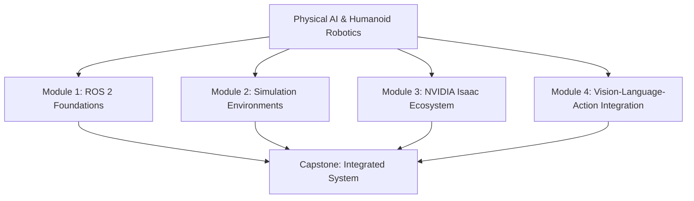

# Physical AI & Humanoid Robotics: From ROS 2 to Vision-Language-Action

## Welcome to the Future of Robotics

This comprehensive guide explores the cutting-edge intersection of humanoid robotics and artificial intelligence. From foundational ROS 2 concepts to advanced Vision-Language-Action (VLA) integration, you'll learn to build, simulate, and control humanoid robots using the latest tools and best practices.

## What You'll Learn

This book is structured into four comprehensive modules plus a capstone project:

### Module 1: ROS 2 Foundations
- Core concepts of ROS 2 as a distributed robotics middleware
- Creating and managing ROS 2 nodes with rclpy
- Topics, services, and actions for robot communication
- URDF for humanoid robot configurations
- Integrating Python-based agents with ROS 2

### Module 2: Simulation Environments (Gazebo & Unity)
- Physics simulation for humanoid robotics
- Sensor modeling and realistic sensor simulation
- Unity for Human-Robot Interaction (HRI) visualization
- Performance optimization strategies for complex humanoid models

### Module 3: NVIDIA Isaac Ecosystem
- Photorealistic simulation with Isaac Sim
- Synthetic data generation for training
- Hardware-accelerated ROS nodes
- Motion planning with cuRobo for humanoid control

### Module 4: Vision-Language-Action Integration
- Complete LLM chaining: Whisper → LLM planner → ROS 2 actions
- Safety guardrails and validation mechanisms
- Simulation-to-real transfer challenges and solutions

### Capstone Project
- Integration of all previous modules in a comprehensive humanoid robot system
- End-to-end VLA pipeline implementation
- Safety-critical systems with proper validation

## Target Audience

This book is designed for intermediate-to-advanced learners with:
- Intermediate Python programming skills (Python 3.10+)
- Basic understanding of distributed systems concepts
- Familiarity with Linux command line and basic robotics concepts
- Experience with any robotics framework (helpful but not required)

## Technical Requirements

To follow along with this book, you'll need:
- ROS 2 Jazzy Jalisco or Rolling Ridley
- Python 3.10+
- NVIDIA Isaac Sim 2025.x (for Module 3)
- Gazebo Harmonic/Ignition (for Module 2)
- Unity 6.x+ (for HRI visualization)

## Getting Started

Navigate to the **Module 1: ROS 2 Foundations** section to begin your journey into humanoid robotics. Each module builds upon the previous one, providing a comprehensive learning path from basic concepts to advanced integration.

The content includes hands-on exercises, practical examples, and real-world applications to ensure you can apply these concepts to actual humanoid robot systems.

:::tip
Start with Module 1 and progress sequentially to build a strong foundation. Each module includes exercises and self-check questions to reinforce your learning.
:::

:::info
All code examples are validated against the latest stable versions and include proper error handling and safety considerations for humanoid robotics applications.
:::
