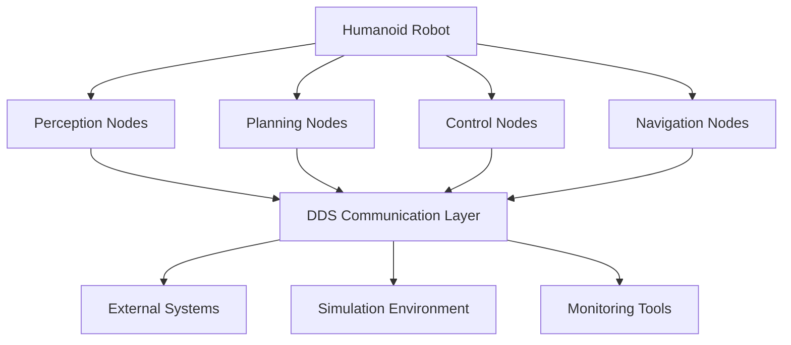

# Introduction to ROS 2 as Middleware

## Learning Objectives

After completing this module, you will be able to:
- Understand the core concepts of ROS 2 as a distributed robotics middleware
- Create and manage ROS 2 nodes using rclpy with modern 2025 best practices
- Implement topics, services, and actions for robot communication
- Design URDF files specifically for humanoid robot configurations
- Integrate Python-based agents with ROS 2 for autonomous control

## Prerequisites

To get the most out of this module, you should have:
- Intermediate Python programming skills (Python 3.10+)
- Basic understanding of distributed systems concepts
- Familiarity with Linux command line and basic robotics concepts
- Previous experience with any robotics framework is helpful but not required

## Why ROS 2? (Differences from ROS 1, Real-time & Distributed Nature)

Robot Operating System 2 (ROS 2) represents a significant evolution from its predecessor, addressing critical limitations in real-time systems, security, and multi-robot coordination. Unlike ROS 1, which relied on a centralized master architecture, ROS 2 leverages Data Distribution Service (DDS) to enable truly distributed systems that can operate reliably in complex robotic applications.

For humanoid robotics specifically, ROS 2's distributed architecture is essential. Humanoid robots require real-time communication between multiple control systems - from low-level motor controllers to high-level cognitive systems. The DDS-based communication ensures that critical control messages are delivered with appropriate Quality of Service (QoS) profiles, ensuring that time-sensitive messages like joint position commands are prioritized over less critical data streams.

## Core Philosophy & Design Goals (2025 Perspective)

ROS 2's design philosophy centers on three core principles that are particularly relevant for humanoid robotics:

1. **Real-time Capability**: With proper QoS configuration, ROS 2 can meet the timing requirements essential for humanoid locomotion and control.

2. **Distributed Architecture**: Nodes can run on different machines, processors, or even cloud services, enabling complex humanoid systems with distributed computation.

3. **Security-First Design**: Built-in security features allow for safe operation of humanoid robots in human environments.

## ROS 2 Distributions and Version Landscape (Jazzy Jalisco, Rolling Ridley)

As of 2025, the most relevant ROS 2 distributions for humanoid robotics development are:

- **ROS 2 Jazzy Jalisco (2025)**: Long-term support (LTS) release with extended support until 2030, making it ideal for production humanoid robot systems.
- **ROS 2 Rolling Ridley**: Latest development release with cutting-edge features, suitable for research and development of advanced humanoid capabilities.

For production humanoid systems, ROS 2 Jazzy Jalisco is recommended due to its LTS status and extensive testing. For cutting-edge research involving vision-language-action integration, Rolling Ridley may provide access to the latest perception and AI packages.

## DDS (Data Distribution Service) as the Foundation

DDS (Data Distribution Service) serves as the communication middleware underlying ROS 2. Understanding DDS is crucial for developing robust humanoid robot systems:

- **Data-Centric Architecture**: Unlike ROS 1's publisher-subscriber model based on a master, DDS maintains a global data space where information is associated with topics rather than specific nodes.
- **Quality of Service (QoS) Profiles**: DDS provides rich QoS controls that are essential for humanoid robot reliability, including reliability, durability, deadline, and liveliness settings.
- **Built-in Discovery**: Nodes automatically discover each other without requiring a central master, enabling robust multi-robot humanoid systems.

:::tip
For humanoid locomotion applications, configure your DDS QoS settings with reliable delivery and appropriate deadlines to ensure that critical joint control messages are delivered on time.
:::

:::info
DDS implementations like Fast DDS, Cyclone DDS, and RTI Connext DDS provide different performance characteristics. For humanoid robots with strict real-time requirements, Fast DDS is often the preferred choice due to its lightweight nature.
:::

## Key Concepts Summary

This module will guide you through the fundamental concepts of ROS 2, focusing on applications specific to humanoid robotics. You'll learn to build robust, distributed systems capable of handling the complex coordination required for bipedal locomotion, manipulation, and human-robot interaction.

In the next section, we'll explore ROS 2 nodes in detail, learning how to create and manage them for humanoid robot applications.