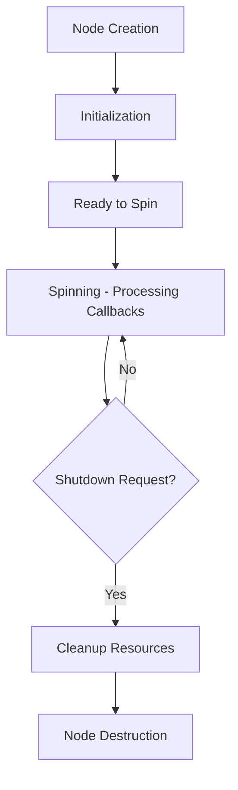

# ROS 2 Nodes and Lifecycle Management

## What is a Node?

A ROS 2 node is an executable process that communicates with other nodes using ROS 2's communication system. In humanoid robotics, nodes typically represent specific robot functions like sensor processing, control algorithms, or decision-making systems. Each node can publish data to topics, subscribe to topics, provide services, or act as a client for services.

For humanoid robots, nodes often represent specific subsystems such as:
- Joint controllers
- Sensor processing units
- Perception systems
- Motion planning algorithms
- Behavior managers

## Lifecycle of a Node (Creation, Spinning, Destruction)

The lifecycle of a ROS 2 node involves several stages:

1. **Initialization**: The node is created and parameters are set up
2. **Spinning**: The node processes callbacks for subscriptions, services, etc.
3. **Shutdown**: The node cleans up resources and exits gracefully

Here's a basic example of a ROS 2 node for humanoid robot control:

```python
# humanoid_controller.py
import rclpy
from rclpy.node import Node
from sensor_msgs.msg import JointState
from trajectory_msgs.msg import JointTrajectory, JointTrajectoryPoint
from builtin_interfaces.msg import Duration

class HumanoidController(Node):
    def __init__(self):
        super().__init__('humanoid_controller')

        # Initialize publisher for joint trajectories
        self.trajectory_publisher = self.create_publisher(
            JointTrajectory,
            '/humanoid_controller/joint_trajectory',
            10
        )

        # Initialize subscription to joint states
        self.joint_state_subscription = self.create_subscription(
            JointState,
            '/joint_states',
            self.joint_state_callback,
            10
        )

        # Timer for periodic control updates
        self.control_timer = self.create_timer(0.01, self.control_loop)  # 100 Hz

        self.get_logger().info('Humanoid Controller node initialized')

    def joint_state_callback(self, msg):
        """Process incoming joint state messages"""
        self.get_logger().debug(f'Received joint states: {len(msg.name)} joints')

    def control_loop(self):
        """Main control loop running at 100 Hz"""
        # Implement control logic here
        pass

    def publish_trajectory(self, joint_names, positions, velocities=None):
        """Publish a joint trajectory command"""
        traj_msg = JointTrajectory()
        traj_msg.joint_names = joint_names

        point = JointTrajectoryPoint()
        point.positions = positions
        if velocities:
            point.velocities = velocities

        # Set timing (0.5 seconds duration)
        point.time_from_start = Duration(sec=0, nanosec=500000000)
        traj_msg.points = [point]

        self.trajectory_publisher.publish(traj_msg)

def main(args=None):
    rclpy.init(args=args)

    humanoid_controller = HumanoidController()

    try:
        rclpy.spin(humanoid_controller)
    except KeyboardInterrupt:
        pass
    finally:
        humanoid_controller.destroy_node()
        rclpy.shutdown()

if __name__ == '__main__':
    main()
```



## Creating a Minimal Node (rclpy Example with Modern Patterns)

Here's a minimal ROS 2 node using modern rclpy patterns with proper context management:

```python
# minimal_humanoid_node.py
import rclpy
from rclpy.node import Node
from rclpy.qos import QoSProfile, ReliabilityPolicy, DurabilityPolicy
from std_msgs.msg import String

class MinimalHumanoidNode(Node):
    def __init__(self):
        super().__init__('minimal_humanoid_node')

        # Create a QoS profile for reliable communication
        qos_profile = QoSProfile(
            depth=10,
            reliability=ReliabilityPolicy.RELIABLE,
            durability=DurabilityPolicy.VOLATILE
        )

        # Publisher for status updates
        self.status_publisher = self.create_publisher(
            String,
            'humanoid_status',
            qos_profile
        )

        # Subscription to commands
        self.command_subscription = self.create_subscription(
            String,
            'humanoid_commands',
            self.command_callback,
            qos_profile
        )

        # Timer for periodic status updates
        self.status_timer = self.create_timer(1.0, self.publish_status)

        self.get_logger().info('Minimal Humanoid Node has started')

    def command_callback(self, msg):
        """Handle incoming commands"""
        self.get_logger().info(f'Received command: {msg.data}')
        # Process command here

    def publish_status(self):
        """Publish periodic status updates"""
        msg = String()
        msg.data = f'Node running at {self.get_clock().now().seconds_nanoseconds()}'
        self.status_publisher.publish(msg)

def main(args=None):
    # Use context manager for automatic cleanup
    rclpy.init(args=args)

    try:
        node = MinimalHumanoidNode()
        rclpy.spin(node)
    except KeyboardInterrupt:
        pass
    finally:
        node.destroy_node()
        rclpy.shutdown()

if __name__ == '__main__':
    main()
```

## Node Parameters and Configuration

ROS 2 nodes can be configured using parameters, which is especially important for humanoid robots that need different configurations for different tasks or environments:

```python
# humanoid_configurable_node.py
import rclpy
from rclpy.node import Node
from rclpy.parameter import Parameter

class HumanoidConfigurableNode(Node):
    def __init__(self):
        super().__init__('humanoid_configurable_node')

        # Declare parameters with default values
        self.declare_parameter('robot_name', 'default_robot')
        self.declare_parameter('control_frequency', 100)
        self.declare_parameter('max_velocity', 1.0)
        self.declare_parameter('safety_enabled', True)

        # Access parameter values
        self.robot_name = self.get_parameter('robot_name').value
        self.control_frequency = self.get_parameter('control_frequency').value
        self.max_velocity = self.get_parameter('max_velocity').value
        self.safety_enabled = self.get_parameter('safety_enabled').value

        self.get_logger().info(f'Configured for robot: {self.robot_name}')
        self.get_logger().info(f'Control frequency: {self.control_frequency} Hz')

        # Create timer based on parameter
        self.control_timer = self.create_timer(
            1.0 / self.control_frequency,
            self.control_callback
        )

        # Parameter callback for dynamic reconfiguration
        self.add_on_set_parameters_callback(self.parameter_callback)

    def parameter_callback(self, params):
        """Handle parameter changes at runtime"""
        for param in params:
            if param.name == 'max_velocity' and param.type_ == Parameter.Type.DOUBLE:
                self.max_velocity = param.value
                self.get_logger().info(f'Max velocity updated to: {param.value}')
        return SetParametersResult(successful=True)

    def control_callback(self):
        """Control loop callback"""
        # Implement control logic here
        pass

def main(args=None):
    rclpy.init(args=args)

    try:
        node = HumanoidConfigurableNode()
        rclpy.spin(node)
    except KeyboardInterrupt:
        pass
    finally:
        node.destroy_node()
        rclpy.shutdown()

if __name__ == '__main__':
    main()
```

## Multi-threading Considerations in Nodes

For humanoid robots, proper threading is crucial for performance and safety:

```python
# threaded_humanoid_node.py
import rclpy
from rclpy.node import Node
from rclpy.executors import MultiThreadedExecutor
from threading import Lock
import time

class ThreadedHumanoidNode(Node):
    def __init__(self):
        super().__init__('threaded_humanoid_node')

        # Thread safety for shared data
        self.data_lock = Lock()
        self.joint_positions = {}

        # Publishers and subscriptions
        self.status_publisher = self.create_publisher(String, 'status', 10)

        # Timer for processing
        self.process_timer = self.create_timer(0.01, self.process_data)

    def process_data(self):
        """Thread-safe data processing"""
        with self.data_lock:
            # Process joint positions safely
            pass

def main(args=None):
    rclpy.init(args=args)

    node = ThreadedHumanoidNode()

    # Use multi-threaded executor for better performance
    executor = MultiThreadedExecutor(num_threads=4)
    executor.add_node(node)

    try:
        executor.spin()
    except KeyboardInterrupt:
        pass
    finally:
        node.destroy_node()
        rclpy.shutdown()

if __name__ == '__main__':
    main()
```

:::warning
When developing nodes for humanoid robots, always consider thread safety and real-time requirements. Improper threading can lead to unstable robot behavior or safety issues.
:::

:::tip
For humanoid robot control nodes, use a MultiThreadedExecutor when you have multiple callback groups or when you need to perform computationally intensive operations that shouldn't block the main control loop.
:::

## Summary

ROS 2 nodes form the foundation of humanoid robot software architecture. Understanding proper node creation, lifecycle management, parameter configuration, and threading is essential for building robust humanoid robot systems. In the next section, we'll explore topics and message passing with Quality of Service profiles.