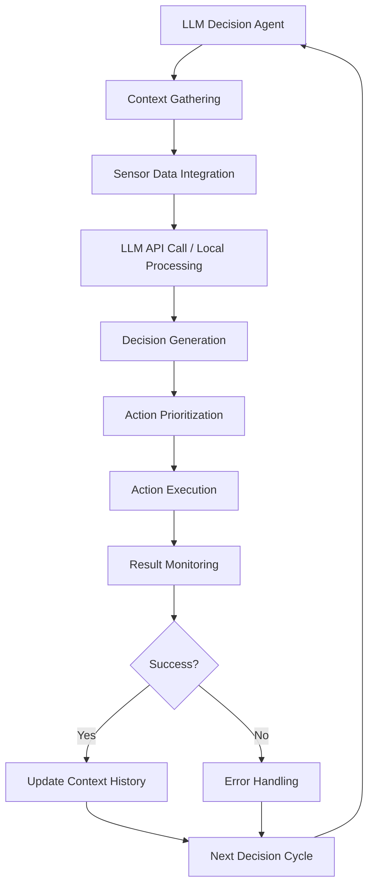

# Bridging Python Agents / LLMs to ROS 2

## rclpy Best Practices 2025 (async/await Patterns, Context Managers)

Modern Python agents for humanoid robotics should leverage the latest async/await patterns and context managers to ensure proper resource management and efficient execution. ROS 2's rclpy library supports these modern Python patterns, making it easier to integrate AI agents with robotic systems.

### Async/Await Patterns in ROS 2

```python
# async_agent_example.py
import rclpy
from rclpy.node import Node
from rclpy.qos import QoSProfile
from std_msgs.msg import String
from geometry_msgs.msg import Twist
import asyncio
from rclpy.executors import SingleThreadedExecutor
from rclpy.task import Future
import threading

class AsyncHumanoidAgent(Node):
    def __init__(self):
        super().__init__('async_humanoid_agent')

        # Create publishers and subscriptions
        self.cmd_vel_publisher = self.create_publisher(Twist, '/cmd_vel', 10)
        self.status_publisher = self.create_publisher(String, '/agent_status', 10)

        # Subscription for sensor data
        self.sensor_subscription = self.create_subscription(
            String, '/sensor_data', self.sensor_callback, 10
        )

        # Store sensor data for async access
        self.latest_sensor_data = None
        self.sensor_data_lock = asyncio.Lock()

        # Initialize async components
        self.loop = asyncio.get_event_loop()

        self.get_logger().info('Async Humanoid Agent initialized')

    def sensor_callback(self, msg):
        """Store sensor data for async access"""
        self.latest_sensor_data = msg.data

    async def get_sensor_data_async(self):
        """Asynchronously get the latest sensor data"""
        async with self.sensor_data_lock:
            return self.latest_sensor_data

    async def execute_navigation_plan(self, goal_x, goal_y):
        """Execute a navigation plan asynchronously"""
        self.get_logger().info(f'Planning navigation to ({goal_x}, {goal_y})')

        # Simulate planning time
        await asyncio.sleep(0.5)

        # Execute navigation steps
        for step in range(10):
            if step % 3 == 0:  # Yield control periodically
                await asyncio.sleep(0.01)

            # Send velocity command
            cmd = Twist()
            cmd.linear.x = 0.5  # Move forward
            cmd.angular.z = 0.1  # Small turn
            self.cmd_vel_publisher.publish(cmd)

            self.get_logger().debug(f'Navigation step {step + 1}/10')

        # Stop robot
        stop_cmd = Twist()
        self.cmd_vel_publisher.publish(stop_cmd)

        status_msg = String()
        status_msg.data = f'Navigation to ({goal_x}, {goal_y}) completed'
        self.status_publisher.publish(status_msg)

        return True

    async def monitor_safety_conditions(self):
        """Monitor safety conditions in the background"""
        while True:
            sensor_data = await self.get_sensor_data_async()
            if sensor_data and 'obstacle' in sensor_data.lower():
                self.get_logger().warn('Obstacle detected, stopping robot')
                # Emergency stop
                stop_cmd = Twist()
                self.cmd_vel_publisher.publish(stop_cmd)

            await asyncio.sleep(0.1)  # Check every 100ms

    async def run_agent_loop(self):
        """Main agent loop running asynchronously"""
        self.get_logger().info('Starting agent loop')

        # Start safety monitoring in background
        safety_task = asyncio.create_task(self.monitor_safety_conditions())

        try:
            # Execute navigation tasks
            await self.execute_navigation_plan(1.0, 1.0)
            await asyncio.sleep(1.0)  # Wait between tasks
            await self.execute_navigation_plan(2.0, 2.0)
        except Exception as e:
            self.get_logger().error(f'Agent loop error: {str(e)}')
        finally:
            safety_task.cancel()

def run_async_agent():
    """Run the async agent with ROS 2"""
    rclpy.init()

    agent = AsyncHumanoidAgent()
    executor = SingleThreadedExecutor()
    executor.add_node(agent)

    # Create a thread for the ROS spinning
    ros_thread = threading.Thread(target=executor.spin)
    ros_thread.start()

    try:
        # Run async agent in main thread
        loop = asyncio.new_event_loop()
        asyncio.set_event_loop(loop)

        async def main():
            await agent.run_agent_loop()

        loop.run_until_complete(main())
    finally:
        executor.shutdown()
        ros_thread.join()
        rclpy.shutdown()

if __name__ == '__main__':
    run_async_agent()
```

### Context Managers for Resource Management

```python
# context_manager_example.py
import rclpy
from rclpy.node import Node
from rclpy.qos import QoSProfile
from std_msgs.msg import String
from contextlib import contextmanager
import atexit

class HumanoidAgentWithResources(Node):
    def __init__(self):
        super().__init__('humanoid_agent_resources')

        # Publishers and subscribers
        self.status_publisher = self.create_publisher(String, '/agent_status', 10)
        self.cmd_publisher = self.create_publisher(String, '/robot_commands', 10)

        # Simulate external resources
        self.llm_client = None
        self.database_connection = None

        self.get_logger().info('Humanoid Agent with Resource Management initialized')

        # Register cleanup at exit
        atexit.register(self.cleanup)

    def cleanup(self):
        """Clean up resources on exit"""
        self.get_logger().info('Cleaning up resources...')

        if self.llm_client:
            self.llm_client.close()
            self.get_logger().info('LLM client closed')

        if self.database_connection:
            self.database_connection.close()
            self.get_logger().info('Database connection closed')

    @contextmanager
    def llm_connection(self):
        """Context manager for LLM connection"""
        try:
            # Simulate LLM client initialization
            self.get_logger().info('Initializing LLM connection')
            self.llm_client = "MockLLMClient"  # In real implementation, this would be actual client
            yield self.llm_client
        except Exception as e:
            self.get_logger().error(f'LLM connection error: {str(e)}')
            raise
        finally:
            # Clean up LLM connection
            if self.llm_client:
                self.get_logger().info('Closing LLM connection')
                self.llm_client = None

    @contextmanager
    def database_transaction(self):
        """Context manager for database transactions"""
        try:
            # Simulate database connection
            self.get_logger().info('Starting database transaction')
            self.database_connection = "MockDBConnection"  # In real implementation, actual connection
            yield self.database_connection
        except Exception as e:
            self.get_logger().error(f'Database transaction error: {str(e)}')
            raise
        finally:
            # Clean up database connection
            if self.database_connection:
                self.get_logger().info('Closing database connection')
                self.database_connection = None

    def generate_robot_action(self, context):
        """Generate robot action using LLM with proper resource management"""
        with self.llm_connection() as llm:
            with self.database_transaction() as db:
                self.get_logger().info(f'Generating action for context: {context}')

                # Simulate LLM call
                action = f"MOVE_TO_LOCATION: {context['target']}"

                # Log to database
                self.get_logger().info(f'Action generated: {action}')

                return action

def main(args=None):
    rclpy.init(args=args)

    try:
        agent = HumanoidAgentWithResources()

        # Example usage of context managers
        context = {'target': 'kitchen', 'task': 'fetch_object'}
        action = agent.generate_robot_action(context)

        cmd_msg = String()
        cmd_msg.data = action
        agent.cmd_publisher.publish(cmd_msg)

        agent.get_logger().info(f'Published action: {action}')

        # Keep node alive briefly to see the result
        rclpy.spin_once(agent, timeout_sec=1.0)

    except Exception as e:
        print(f"Error in main: {str(e)}")
    finally:
        agent.destroy_node()
        rclpy.shutdown()

if __name__ == '__main__':
    main()
```

## Patterns for Agent → Controller Communication

Effective communication between AI agents and robot controllers is crucial for humanoid robotics. Here are several patterns to consider:

### 1. Command Queue Pattern

```python
# command_queue_pattern.py
import rclpy
from rclpy.node import Node
from std_msgs.msg import String
from geometry_msgs.msg import Twist
from threading import Lock
import queue
import time

class CommandQueueAgent(Node):
    def __init__(self):
        super().__init__('command_queue_agent')

        # Publishers
        self.cmd_vel_publisher = self.create_publisher(Twist, '/cmd_vel', 10)
        self.status_publisher = self.create_publisher(String, '/agent_status', 10)

        # Command queue with thread safety
        self.command_queue = queue.Queue()
        self.queue_lock = Lock()

        # Timer to process commands
        self.command_timer = self.create_timer(0.05, self.process_commands)  # 20 Hz

        self.get_logger().info('Command Queue Agent initialized')

    def add_command(self, command_type, **params):
        """Add a command to the queue"""
        command = {
            'type': command_type,
            'params': params,
            'timestamp': time.time()
        }

        with self.queue_lock:
            self.command_queue.put(command)
            self.get_logger().debug(f'Added command: {command_type}')

    def process_commands(self):
        """Process commands from the queue"""
        processed = 0
        with self.queue_lock:
            while not self.command_queue.empty() and processed < 5:  # Limit processing per cycle
                try:
                    command = self.command_queue.get_nowait()
                    self.execute_command(command)
                    processed += 1
                except queue.Empty:
                    break

    def execute_command(self, command):
        """Execute a single command"""
        cmd_type = command['type']

        if cmd_type == 'move':
            self.execute_move_command(command['params'])
        elif cmd_type == 'rotate':
            self.execute_rotate_command(command['params'])
        elif cmd_type == 'stop':
            self.execute_stop_command()
        elif cmd_type == 'status':
            self.publish_status(command['params'])
        else:
            self.get_logger().warn(f'Unknown command type: {cmd_type}')

    def execute_move_command(self, params):
        """Execute a move command"""
        cmd = Twist()
        cmd.linear.x = params.get('linear_speed', 0.5)
        cmd.linear.y = params.get('lateral_speed', 0.0)
        cmd.linear.z = 0.0
        cmd.angular.x = 0.0
        cmd.angular.y = 0.0
        cmd.angular.z = params.get('angular_speed', 0.0)

        self.cmd_vel_publisher.publish(cmd)
        self.get_logger().info(f'Moving with linear: {cmd.linear.x}, angular: {cmd.angular.z}')

    def execute_rotate_command(self, params):
        """Execute a rotate command"""
        cmd = Twist()
        cmd.linear.x = 0.0
        cmd.angular.z = params.get('angle', 0.5)

        self.cmd_vel_publisher.publish(cmd)
        self.get_logger().info(f'Rotating with angular: {cmd.angular.z}')

    def execute_stop_command(self):
        """Execute a stop command"""
        cmd = Twist()
        self.cmd_vel_publisher.publish(cmd)
        self.get_logger().info('Stopping robot')

    def publish_status(self, params):
        """Publish status message"""
        status_msg = String()
        status_msg.data = f"Status: {params.get('message', 'OK')}"
        self.status_publisher.publish(status_msg)

def main(args=None):
    rclpy.init(args=args)

    agent = CommandQueueAgent()

    # Add some example commands
    agent.add_command('move', linear_speed=0.3, angular_speed=0.1)
    agent.add_command('rotate', angle=0.5)
    agent.add_command('status', message='Executing plan')

    try:
        rclpy.spin(agent)
    except KeyboardInterrupt:
        pass
    finally:
        agent.destroy_node()
        rclpy.shutdown()

if __name__ == '__main__':
    main()
```

### 2. State Machine Pattern

```python
# state_machine_pattern.py
import rclpy
from rclpy.node import Node
from std_msgs.msg import String
from geometry_msgs.msg import Twist
from enum import Enum
import time

class AgentState(Enum):
    IDLE = "idle"
    PLANNING = "planning"
    EXECUTING = "executing"
    WAITING = "waiting"
    ERROR = "error"

class StateMachineAgent(Node):
    def __init__(self):
        super().__init__('state_machine_agent')

        # Publishers
        self.cmd_vel_publisher = self.create_publisher(Twist, '/cmd_vel', 10)
        self.status_publisher = self.create_publisher(String, '/agent_status', 10)

        # State management
        self.current_state = AgentState.IDLE
        self.state_start_time = time.time()
        self.state_timeout = 10.0  # seconds

        # Timer to update state machine
        self.state_timer = self.create_timer(0.1, self.update_state_machine)

        self.get_logger().info('State Machine Agent initialized')

    def update_state_machine(self):
        """Update the state machine based on current state"""
        current_time = time.time()

        # Check for state timeout
        if (current_time - self.state_start_time) > self.state_timeout:
            self.get_logger().warn(f'State {self.current_state} timed out')
            self.transition_to_state(AgentState.ERROR)

        # Execute state-specific logic
        if self.current_state == AgentState.IDLE:
            self.handle_idle_state()
        elif self.current_state == AgentState.PLANNING:
            self.handle_planning_state()
        elif self.current_state == AgentState.EXECUTING:
            self.handle_executing_state()
        elif self.current_state == AgentState.WAITING:
            self.handle_waiting_state()
        elif self.current_state == AgentState.ERROR:
            self.handle_error_state()

    def transition_to_state(self, new_state):
        """Safely transition to a new state"""
        if self.current_state != new_state:
            self.get_logger().info(f'Transitioning from {self.current_state} to {new_state}')
            self.current_state = new_state
            self.state_start_time = time.time()

            # Publish state change
            status_msg = String()
            status_msg.data = f'State changed to {new_state.value}'
            self.status_publisher.publish(status_msg)

    def handle_idle_state(self):
        """Handle the idle state"""
        # In idle state, the robot is waiting for commands
        # We might receive a command to start planning
        pass  # In a real implementation, check for incoming commands

    def handle_planning_state(self):
        """Handle the planning state"""
        # Simulate planning process
        self.get_logger().debug('Planning in progress...')

        # For this example, transition to executing after planning
        if (time.time() - self.state_start_time) > 2.0:  # Planning took 2 seconds
            self.transition_to_state(AgentState.EXECUTING)

    def handle_executing_state(self):
        """Handle the executing state"""
        # Execute robot commands
        cmd = Twist()
        cmd.linear.x = 0.5  # Move forward
        cmd.angular.z = 0.1  # Small turn
        self.cmd_vel_publisher.publish(cmd)

        # For this example, finish execution after 3 seconds
        if (time.time() - self.state_start_time) > 3.0:
            self.transition_to_state(AgentState.WAITING)

    def handle_waiting_state(self):
        """Handle the waiting state"""
        # Stop robot in waiting state
        stop_cmd = Twist()
        self.cmd_vel_publisher.publish(stop_cmd)

        # Wait for a while, then return to idle
        if (time.time() - self.state_start_time) > 2.0:
            self.transition_to_state(AgentState.IDLE)

    def handle_error_state(self):
        """Handle the error state"""
        # Emergency stop
        stop_cmd = Twist()
        self.cmd_vel_publisher.publish(stop_cmd)

        # Wait, then try to recover
        if (time.time() - self.state_start_time) > 3.0:
            self.transition_to_state(AgentState.IDLE)

    def start_planning(self):
        """Start the planning process"""
        self.transition_to_state(AgentState.PLANNING)

def main(args=None):
    rclpy.init(args=args)

    agent = StateMachineAgent()

    # Start planning after a short delay
    def start_planning_callback():
        agent.start_planning()

    # Schedule the planning to start after 1 second
    timer = agent.create_timer(1.0, start_planning_callback)

    # Cancel the timer after it runs once
    def cancel_timer():
        timer.destroy()

    agent.create_timer(1.1, cancel_timer)

    try:
        rclpy.spin(agent)
    except KeyboardInterrupt:
        pass
    finally:
        agent.destroy_node()
        rclpy.shutdown()

if __name__ == '__main__':
    main()
```

## Error Handling & Reconnection Strategies

For humanoid robots, robust error handling and reconnection strategies are essential for safety and reliability:

```python
# error_handling_strategies.py
import rclpy
from rclpy.node import Node
from std_msgs.msg import String
from geometry_msgs.msg import Twist
import time
import random
from threading import Lock

class RobustAgent(Node):
    def __init__(self):
        super().__init__('robust_agent')

        # Publishers and subscriptions
        self.cmd_vel_publisher = self.create_publisher(Twist, '/cmd_vel', 10)
        self.status_publisher = self.create_publisher(String, '/agent_status', 10)

        # Error handling components
        self.error_count = 0
        self.last_error_time = 0
        self.error_lock = Lock()

        # Reconnection timer
        self.reconnection_timer = self.create_timer(5.0, self.check_and_reconnect)

        # Command execution timer
        self.command_timer = self.create_timer(0.1, self.execute_commands)

        self.get_logger().info('Robust Agent initialized')

    def safe_publish(self, publisher, message, max_retries=3):
        """Safely publish a message with retry logic"""
        for attempt in range(max_retries):
            try:
                publisher.publish(message)
                return True
            except Exception as e:
                self.get_logger().warn(f'Publish attempt {attempt + 1} failed: {str(e)}')
                if attempt < max_retries - 1:
                    time.sleep(0.1 * (attempt + 1))  # Exponential backoff
                else:
                    self.log_error(f'Failed to publish after {max_retries} attempts: {str(e)}')

        return False

    def log_error(self, error_message):
        """Log an error and update error statistics"""
        with self.error_lock:
            self.error_count += 1
            self.last_error_time = time.time()

        self.get_logger().error(error_message)

        # Publish error status
        status_msg = String()
        status_msg.data = f'ERROR: {error_message}'
        self.safe_publish(self.status_publisher, status_msg)

    def check_and_reconnect(self):
        """Check system health and attempt reconnection if needed"""
        current_time = time.time()

        with self.error_lock:
            error_rate = self.error_count / max(1, (current_time - self.get_clock().now().nanoseconds / 1e9))

        if error_rate > 0.1:  # More than 10% error rate
            self.get_logger().warn(f'High error rate detected: {error_rate:.2%}, performing health check')
            self.perform_health_check()
        else:
            self.get_logger().debug(f'Error rate normal: {error_rate:.2%}')

    def perform_health_check(self):
        """Perform a comprehensive health check"""
        self.get_logger().info('Performing health check...')

        # Check communication
        if not self.test_communication():
            self.get_logger().error('Communication test failed')
            return False

        # Check sensor data availability
        if not self.check_sensor_availability():
            self.get_logger().warn('Some sensors may be unavailable')

        # Reset error counter if health check passes
        with self.error_lock:
            self.error_count = 0

        self.get_logger().info('Health check completed successfully')
        return True

    def test_communication(self):
        """Test basic communication"""
        try:
            # Try to publish a test message
            test_msg = String()
            test_msg.data = f'Health check at {time.time()}'
            return self.safe_publish(self.status_publisher, test_msg)
        except Exception as e:
            self.log_error(f'Communication test failed: {str(e)}')
            return False

    def check_sensor_availability(self):
        """Check if sensors are responding"""
        # In a real implementation, this would check actual sensor topics
        return True  # Placeholder

    def execute_commands(self):
        """Execute robot commands with error handling"""
        try:
            # Simulate command execution that might fail
            if random.random() < 0.05:  # 5% chance of failure
                raise Exception('Simulated command execution failure')

            # Normal command execution
            cmd = Twist()
            cmd.linear.x = 0.2
            success = self.safe_publish(self.cmd_vel_publisher, cmd)

            if success:
                self.get_logger().debug('Command executed successfully')
            else:
                self.log_error('Failed to execute command')

        except Exception as e:
            self.log_error(f'Command execution error: {str(e)}')

def main(args=None):
    rclpy.init(args=args)

    agent = RobustAgent()

    try:
        rclpy.spin(agent)
    except KeyboardInterrupt:
        agent.get_logger().info('Shutting down gracefully...')
    finally:
        agent.destroy_node()
        rclpy.shutdown()

if __name__ == '__main__':
    main()
```

## Integration Patterns for LLM-Based Decision Making

Integrating LLMs with humanoid robots requires careful consideration of real-time constraints, safety, and reliability:

```python
# llm_integration_pattern.py
import rclpy
from rclpy.node import Node
from std_msgs.msg import String
from geometry_msgs.msg import Twist
import asyncio
import json
import time
from dataclasses import dataclass
from typing import Dict, Any, Optional

@dataclass
class RobotAction:
    """Data class for robot actions"""
    action_type: str
    parameters: Dict[str, Any]
    priority: int = 1
    timeout: float = 10.0

class LLMRobotAgent(Node):
    def __init__(self):
        super().__init__('llm_robot_agent')

        # Publishers and subscriptions
        self.cmd_vel_publisher = self.create_publisher(Twist, '/cmd_vel', 10)
        self.status_publisher = self.create_publisher(String, '/agent_status', 10)

        # Store for sensor data and context
        self.sensor_data = {}
        self.context_history = []

        # Action queue for LLM decisions
        self.action_queue = []

        # Timer for processing LLM decisions
        self.llm_timer = self.create_timer(1.0, self.process_llm_decisions)

        self.get_logger().info('LLM Robot Agent initialized')

    def update_sensor_data(self, sensor_name: str, data: Any):
        """Update sensor data in the agent's context"""
        self.sensor_data[sensor_name] = {
            'data': data,
            'timestamp': time.time()
        }

    def get_robot_context(self) -> Dict[str, Any]:
        """Get current robot context for LLM"""
        return {
            'timestamp': time.time(),
            'sensor_data': self.sensor_data,
            'context_history': self.context_history[-10:],  # Last 10 contexts
            'robot_state': 'operational',  # In real implementation, get actual state
            'battery_level': 0.85,  # In real implementation, get actual battery
            'position': {'x': 0.0, 'y': 0.0, 'theta': 0.0}  # In real implementation, get actual position
        }

    def generate_llm_decision(self, context: Dict[str, Any]) -> Optional[RobotAction]:
        """Simulate LLM decision making"""
        # In a real implementation, this would call an LLM API
        # For this example, we'll simulate the decision making

        self.get_logger().info(f'Generating decision for context: {context["sensor_data"]}')

        # Simple decision logic based on sensor data
        if 'obstacle_distance' in context['sensor_data']:
            distance = context['sensor_data']['obstacle_distance']['data']
            if distance < 0.5:  # Obstacle within 0.5m
                return RobotAction(
                    action_type='avoid_obstacle',
                    parameters={'direction': 'left', 'distance': 0.3},
                    priority=5
                )

        # Default action - move forward
        return RobotAction(
            action_type='move_forward',
            parameters={'speed': 0.3, 'duration': 2.0},
            priority=1
        )

    def execute_robot_action(self, action: RobotAction) -> bool:
        """Execute a robot action"""
        self.get_logger().info(f'Executing action: {action.action_type} with params: {action.parameters}')

        if action.action_type == 'move_forward':
            return self.execute_move_forward(action.parameters)
        elif action.action_type == 'turn':
            return self.execute_turn(action.parameters)
        elif action.action_type == 'stop':
            return self.execute_stop()
        elif action.action_type == 'avoid_obstacle':
            return self.execute_avoid_obstacle(action.parameters)
        else:
            self.get_logger().warn(f'Unknown action type: {action.action_type}')
            return False

    def execute_move_forward(self, params: Dict[str, Any]) -> bool:
        """Execute move forward action"""
        cmd = Twist()
        cmd.linear.x = params.get('speed', 0.3)
        cmd.angular.z = 0.0

        self.cmd_vel_publisher.publish(cmd)
        self.get_logger().info(f'Moving forward at speed: {cmd.linear.x}')

        # Simulate execution time
        duration = params.get('duration', 1.0)
        start_time = time.time()

        while (time.time() - start_time) < duration:
            # Check for interruptions or new commands
            if self.should_interrupt_action():
                self.execute_stop()
                return False
            time.sleep(0.1)

        return True

    def execute_turn(self, params: Dict[str, Any]) -> bool:
        """Execute turn action"""
        cmd = Twist()
        cmd.linear.x = 0.0
        cmd.angular.z = params.get('angle_rate', 0.5)  # radians per second

        self.cmd_vel_publisher.publish(cmd)
        self.get_logger().info(f'Turning at rate: {cmd.angular.z}')

        duration = params.get('duration', 1.0)
        time.sleep(duration)

        # Stop turning
        stop_cmd = Twist()
        self.cmd_vel_publisher.publish(stop_cmd)

        return True

    def execute_stop(self) -> bool:
        """Execute stop action"""
        cmd = Twist()
        self.cmd_vel_publisher.publish(cmd)
        self.get_logger().info('Stopping robot')
        return True

    def execute_avoid_obstacle(self, params: Dict[str, Any]) -> bool:
        """Execute obstacle avoidance action"""
        direction = params.get('direction', 'left')
        distance = params.get('distance', 0.3)

        # Move sideways to avoid obstacle
        cmd = Twist()
        if direction == 'left':
            cmd.linear.y = 0.2
        else:
            cmd.linear.y = -0.2

        self.cmd_vel_publisher.publish(cmd)
        self.get_logger().info(f'Avoiding obstacle by moving {direction} for {distance}m')

        # Calculate time needed (assuming 0.2 m/s)
        duration = distance / 0.2
        time.sleep(duration)

        # Stop
        stop_cmd = Twist()
        self.cmd_vel_publisher.publish(stop_cmd)

        return True

    def should_interrupt_action(self) -> bool:
        """Check if current action should be interrupted"""
        # In real implementation, check for emergencies, new high-priority commands, etc.
        return False

    def process_llm_decisions(self):
        """Process LLM decisions and queue actions"""
        try:
            # Get current context
            context = self.get_robot_context()

            # Generate decision using "LLM"
            action = self.generate_llm_decision(context)

            if action:
                # Add to action queue (with priority consideration)
                self.action_queue.append(action)

                # Sort by priority (highest first)
                self.action_queue.sort(key=lambda x: x.priority, reverse=True)

                # Execute highest priority action
                if self.action_queue:
                    current_action = self.action_queue.pop(0)
                    success = self.execute_robot_action(current_action)

                    if success:
                        self.get_logger().info(f'Action completed: {current_action.action_type}')

                        # Add to context history
                        self.context_history.append({
                            'action': current_action.action_type,
                            'result': 'success',
                            'timestamp': time.time()
                        })
                    else:
                        self.get_logger().error(f'Action failed: {current_action.action_type}')

                        # Add to context history
                        self.context_history.append({
                            'action': current_action.action_type,
                            'result': 'failed',
                            'timestamp': time.time()
                        })

            # Limit context history size
            if len(self.context_history) > 50:
                self.context_history = self.context_history[-50:]

        except Exception as e:
            self.get_logger().error(f'Error in LLM decision processing: {str(e)}')

def main(args=None):
    rclpy.init(args=args)

    agent = LLMRobotAgent()

    # Simulate sensor data updates
    def update_sensor_data():
        # Simulate distance sensor data
        agent.update_sensor_data('obstacle_distance', {'range': 1.0, 'unit': 'meters'})
        agent.get_logger().info('Updated sensor data')

    # Update sensor data every 2 seconds
    agent.create_timer(2.0, update_sensor_data)

    try:
        rclpy.spin(agent)
    except KeyboardInterrupt:
        agent.get_logger().info('Shutting down LLM Robot Agent...')
    finally:
        agent.destroy_node()
        rclpy.shutdown()

if __name__ == '__main__':
    main()
```



:::warning
When integrating LLMs with humanoid robots, always implement safety checks and validation of LLM outputs. LLMs can generate unsafe or impractical commands that could damage the robot or harm humans nearby.
:::

:::tip
For real-time humanoid robot control, consider using a hybrid approach where LLMs handle high-level decision making while traditional control systems handle low-level motion control. This provides both the cognitive capabilities of LLMs and the reliability of proven control systems.
:::

## Safety Considerations for Autonomous Agents

Safety is paramount in humanoid robotics, especially when using autonomous agents:

1. **Constraint Validation**: Always validate LLM outputs against physical and safety constraints
2. **Fallback Behaviors**: Implement safe fallback behaviors when LLM decisions fail
3. **Human Oversight**: Provide mechanisms for human intervention
4. **Monitoring**: Continuously monitor robot state and behavior

## Summary

Integrating Python agents and LLMs with ROS 2 requires careful consideration of async patterns, resource management, error handling, and safety. By using proper design patterns like command queues and state machines, and implementing robust error handling and reconnection strategies, we can create sophisticated autonomous systems for humanoid robots.

In the next section, we'll explore URDF for humanoid robots, which defines the robot's physical structure and is essential for simulation and control.