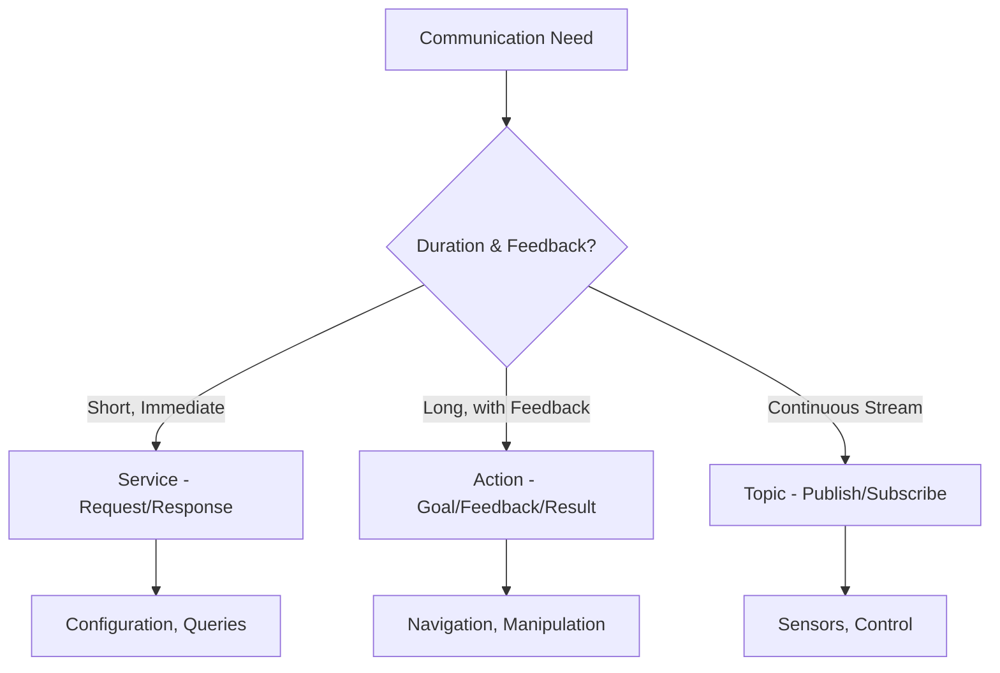

# Services & Actions for Robot Control

## Synchronous vs Asynchronous Communication

In ROS 2, there are three main communication patterns:
- **Topics**: Asynchronous, publish-subscribe communication (covered in previous section)
- **Services**: Synchronous, request-response communication
- **Actions**: Asynchronous, goal-based communication for long-running tasks

For humanoid robots, the choice of communication pattern is critical for performance and safety:

- Use **Topics** for continuous data streams (sensor data, joint states, velocity commands)
- Use **Services** for immediate responses (configuration changes, immediate status queries, calibration)
- Use **Actions** for complex, time-consuming tasks (navigation, manipulation, complex behaviors)

## When to Use Services vs Topics vs Actions

### Services
- Short duration tasks (less than a few seconds)
- Tasks that require immediate response
- Configuration and status queries
- Commands that should return success/failure quickly

### Actions
- Long-duration tasks (seconds to minutes)
- Tasks with feedback during execution
- Tasks that might be preempted
- Navigation, manipulation, and complex behaviors

### Topics
- Continuous data streams
- Real-time control loops
- Sensor data distribution
- Status broadcasts



## Simple Service Example for Humanoid Robot Control

Here's an example of a service for humanoid robot control:

```python
# humanoid_control_interfaces/srv/SetStiffness.srv
# float64[] joint_positions
# float64[] joint_velocities
# float64[] joint_efforts
# bool enable_stiffness
# ---
# bool success
# string message
```

```python
# stiffness_service_server.py
import rclpy
from rclpy.node import Node
from your_interfaces.srv import SetStiffness  # You would generate this interface

class StiffnessServiceServer(Node):
    def __init__(self):
        super().__init__('stiffness_service_server')

        # Create service server for setting joint stiffness
        self.service = self.create_service(
            SetStiffness,
            'set_joint_stiffness',
            self.stiffness_callback
        )

        self.get_logger().info('Stiffness Service Server started')

    def stiffness_callback(self, request, response):
        """Handle stiffness setting requests"""
        self.get_logger().info(f'Setting stiffness for {len(request.joint_names)} joints')

        try:
            # Here would be the actual hardware interface to set stiffness
            # For demonstration purposes:
            success = self.set_joint_stiffness_impl(
                request.joint_names,
                request.stiffness_values
            )

            response.success = success
            if success:
                response.message = 'Stiffness set successfully'
            else:
                response.message = 'Failed to set stiffness'

        except Exception as e:
            response.success = False
            response.message = f'Error setting stiffness: {str(e)}'

        return response

    def set_joint_stiffness_impl(self, joint_names, stiffness_values):
        """Implementation of setting joint stiffness"""
        # This would interface with the actual robot hardware
        # Return True if successful, False otherwise
        return True  # Placeholder

def main(args=None):
    rclpy.init(args=args)

    try:
        node = StiffnessServiceServer()
        rclpy.spin(node)
    except KeyboardInterrupt:
        pass
    finally:
        node.destroy_node()
        rclpy.shutdown()

if __name__ == '__main__':
    main()
```

```python
# stiffness_service_client.py
import rclpy
from rclpy.node import Node
from your_interfaces.srv import SetStiffness

class StiffnessServiceClient(Node):
    def __init__(self):
        super().__init__('stiffness_service_client')

        # Create client for stiffness service
        self.client = self.create_client(SetStiffness, 'set_joint_stiffness')

        # Wait for service to be available
        while not self.client.wait_for_service(timeout_sec=1.0):
            self.get_logger().info('Stiffness service not available, waiting again...')

        self.get_logger().info('Stiffness Service Client ready')

    def send_stiffness_request(self, joint_names, stiffness_values):
        """Send a request to set joint stiffness"""
        request = SetStiffness.Request()
        request.joint_names = joint_names
        request.stiffness_values = stiffness_values

        self.future = self.client.call_async(request)
        return self.future

def main(args=None):
    rclpy.init(args=args)

    stiffness_client = StiffnessServiceClient()

    # Example usage
    joint_names = ['left_knee', 'right_knee', 'left_elbow']
    stiffness_values = [100.0, 100.0, 50.0]  # Stiffness in N*m/rad

    future = stiffness_client.send_stiffness_request(joint_names, stiffness_values)

    try:
        rclpy.spin_until_future_complete(stiffness_client, future)
        response = future.result()

        if response.success:
            stiffness_client.get_logger().info(f'Service response: {response.message}')
        else:
            stiffness_client.get_logger().error(f'Service failed: {response.message}')

    except KeyboardInterrupt:
        pass
    finally:
        stiffness_client.destroy_node()
        rclpy.shutdown()

if __name__ == '__main__':
    main()
```

## Action Architecture for Long-Running Tasks (Navigation, Manipulation)

For humanoid robots, actions are essential for complex behaviors. Here's an example for walking pattern execution:

```python
# humanoid_control_interfaces/action/WalkPattern.action
# # Define the goal
# string pattern_type  # 'forward', 'backward', 'turn_left', 'turn_right', 'step_left', 'step_right'
# float32 distance     # distance to walk (for forward/backward)
# float32 angle        # angle to turn (for turning)
# float32 step_height  # height of steps
# ---
# # Define the result
# bool success
# string message
# float32 distance_travelled
# ---
# # Define the feedback
# string current_phase  # 'lifting_leg', 'moving_com', 'placing_foot', 'stabilizing'
# float32 progress      # 0.0 to 1.0
# float32 remaining_distance
```

```python
# walk_pattern_action_server.py
import rclpy
from rclpy.action import ActionServer, GoalResponse, CancelResponse
from rclpy.node import Node
from your_interfaces.action import WalkPattern  # Generated action interface
from rclpy.executors import MultiThreadedExecutor
from rclpy.callback_groups import ReentrantCallbackGroup
import threading
import time

class WalkPatternActionServer(Node):
    def __init__(self):
        super().__init__('walk_pattern_action_server')

        # Use reentrant callback group to handle multiple goals
        callback_group = ReentrantCallbackGroup()

        # Create action server
        self._action_server = ActionServer(
            self,
            WalkPattern,
            'execute_walk_pattern',
            self.execute_callback,
            goal_callback=self.goal_callback,
            cancel_callback=self.cancel_callback,
            callback_group=callback_group
        )

        self.get_logger().info('Walk Pattern Action Server started')

    def goal_callback(self, goal_request):
        """Accept or reject incoming goals"""
        self.get_logger().info(f'Received walk pattern goal: {goal_request.pattern_type}')

        # Check if goal is valid
        if goal_request.pattern_type in ['forward', 'backward', 'turn_left', 'turn_right', 'step_left', 'step_right']:
            return GoalResponse.ACCEPT
        else:
            self.get_logger().warn(f'Invalid pattern type: {goal_request.pattern_type}')
            return GoalResponse.REJECT

    def cancel_callback(self, goal_handle):
        """Accept or reject cancel requests"""
        self.get_logger().info('Received cancel request for walk pattern')
        return CancelResponse.ACCEPT

    def execute_callback(self, goal_handle):
        """Execute the walk pattern goal"""
        self.get_logger().info('Executing walk pattern goal...')

        feedback_msg = WalkPattern.Feedback()
        result = WalkPattern.Result()

        # Initialize feedback
        feedback_msg.current_phase = 'initializing'
        feedback_msg.progress = 0.0
        feedback_msg.remaining_distance = goal_handle.request.distance

        # Publish initial feedback
        goal_handle.publish_feedback(feedback_msg)

        try:
            # Execute the walking pattern
            success = self.execute_walk_pattern(
                goal_handle.request,
                feedback_msg,
                goal_handle
            )

            if success:
                result.success = True
                result.message = 'Walk pattern completed successfully'
                result.distance_travelled = goal_handle.request.distance
                goal_handle.succeed()
            else:
                result.success = False
                result.message = 'Walk pattern execution failed'
                result.distance_travelled = 0.0
                goal_handle.abort()

        except Exception as e:
            result.success = False
            result.message = f'Error during execution: {str(e)}'
            result.distance_travelled = 0.0
            goal_handle.abort()

        self.get_logger().info(f'Walk pattern execution completed with success: {result.success}')
        return result

    def execute_walk_pattern(self, request, feedback_msg, goal_handle):
        """Execute the actual walking pattern"""
        # This is where the complex walking logic would be implemented
        # For demonstration, we'll simulate the walking process

        total_steps = 10  # Simulate 10 steps
        step_duration = 0.5  # 0.5 seconds per step

        for step in range(total_steps):
            if goal_handle.is_cancel_requested:
                self.get_logger().info('Walk pattern canceled')
                return False

            # Simulate different phases of walking
            phases = ['lifting_leg', 'moving_com', 'placing_foot', 'stabilizing']
            for phase in phases:
                if goal_handle.is_cancel_requested:
                    return False

                feedback_msg.current_phase = phase
                feedback_msg.progress = (step * len(phases) + phases.index(phase) + 1) / (total_steps * len(phases))
                feedback_msg.remaining_distance = request.distance * (1 - feedback_msg.progress)

                goal_handle.publish_feedback(feedback_msg)
                time.sleep(step_duration / len(phases))  # Simulate processing time

        return True  # Simulate success

def main(args=None):
    rclpy.init(args=args)

    try:
        node = WalkPatternActionServer()
        executor = MultiThreadedExecutor()
        executor.add_node(node)

        try:
            executor.spin()
        except KeyboardInterrupt:
            pass
    finally:
        node.destroy_node()
        rclpy.shutdown()

if __name__ == '__main__':
    main()
```

```python
# walk_pattern_action_client.py
import rclpy
from rclpy.action import ActionClient
from rclpy.node import Node
from your_interfaces.action import WalkPattern
import time

class WalkPatternActionClient(Node):
    def __init__(self):
        super().__init__('walk_pattern_action_client')

        # Create action client
        self._action_client = ActionClient(
            self,
            WalkPattern,
            'execute_walk_pattern'
        )

    def send_goal(self, pattern_type='forward', distance=1.0, angle=0.0, step_height=0.05):
        """Send a goal to execute a walk pattern"""
        # Wait for action server
        self._action_client.wait_for_server()

        # Create goal message
        goal_msg = WalkPattern.Goal()
        goal_msg.pattern_type = pattern_type
        goal_msg.distance = distance
        goal_msg.angle = angle
        goal_msg.step_height = step_height

        # Send goal and get future
        self._send_goal_future = self._action_client.send_goal_async(
            goal_msg,
            feedback_callback=self.feedback_callback
        )

        self._send_goal_future.add_done_callback(self.goal_response_callback)

    def goal_response_callback(self, future):
        """Handle goal response"""
        goal_handle = future.result()
        if not goal_handle.accepted:
            self.get_logger().info('Goal rejected :(')
            return

        self.get_logger().info('Goal accepted :)')

        # Get result future
        self._get_result_future = goal_handle.get_result_async()
        self._get_result_future.add_done_callback(self.get_result_callback)

    def feedback_callback(self, feedback_msg):
        """Handle feedback during execution"""
        feedback = feedback_msg.feedback
        self.get_logger().info(
            f'Current phase: {feedback.current_phase}, '
            f'Progress: {feedback.progress:.2f}, '
            f'Remaining: {feedback.remaining_distance:.2f}m'
        )

    def get_result_callback(self, future):
        """Handle the final result"""
        result = future.result().result
        self.get_logger().info(f'Result: {result.message}')
        self.get_logger().info(f'Distance travelled: {result.distance_travelled:.2f}m')

def main(args=None):
    rclpy.init(args=args)

    action_client = WalkPatternActionClient()

    # Send a goal to walk forward 2 meters
    action_client.send_goal(pattern_type='forward', distance=2.0)

    try:
        rclpy.spin(action_client)
    except KeyboardInterrupt:
        pass
    finally:
        action_client.destroy_node()
        rclpy.shutdown()

if __name__ == '__main__':
    main()
```

## Error Handling in Service and Action Calls

For humanoid robots, proper error handling is critical for safety:

```python
# error_handling_examples.py
import rclpy
from rclpy.node import Node
from your_interfaces.srv import SetStiffness
from your_interfaces.action import WalkPattern
from rclpy.action import ActionClient
import time

class ErrorHandlingNode(Node):
    def __init__(self):
        super().__init__('error_handling_node')

        # Service client
        self.stiffness_client = self.create_client(SetStiffness, 'set_joint_stiffness')

        # Action client
        self.walk_action_client = ActionClient(
            self,
            WalkPattern,
            'execute_walk_pattern'
        )

        # Wait for services/actions
        while not self.stiffness_client.wait_for_service(timeout_sec=1.0):
            self.get_logger().info('Waiting for stiffness service...')

        self.walk_action_client.wait_for_server()

    def safe_set_stiffness(self, joint_names, stiffness_values, timeout=5.0):
        """Safely set joint stiffness with timeout and error handling"""
        request = SetStiffness.Request()
        request.joint_names = joint_names
        request.stiffness_values = stiffness_values

        # Call service asynchronously
        future = self.stiffness_client.call_async(request)

        # Wait with timeout
        start_time = time.time()
        while not future.done() and (time.time() - start_time) < timeout:
            rclpy.spin_once(self, timeout_sec=0.1)

        if not future.done():
            self.get_logger().error(f'Service call timed out after {timeout} seconds')
            return False, 'Service call timed out'

        try:
            response = future.result()
            if response.success:
                self.get_logger().info(f'Successfully set stiffness: {response.message}')
                return True, response.message
            else:
                self.get_logger().error(f'Service call failed: {response.message}')
                return False, response.message
        except Exception as e:
            self.get_logger().error(f'Exception during service call: {str(e)}')
            return False, f'Exception: {str(e)}'

    def safe_execute_walk(self, pattern_type, distance, timeout=30.0):
        """Safely execute walk pattern with timeout and error handling"""
        goal_msg = WalkPattern.Goal()
        goal_msg.pattern_type = pattern_type
        goal_msg.distance = distance

        # Send goal asynchronously
        goal_future = self.walk_action_client.send_goal_async(goal_msg)

        # Wait for goal to be accepted with timeout
        start_time = time.time()
        while not goal_future.done() and (time.time() - start_time) < timeout:
            rclpy.spin_once(self, timeout_sec=0.1)

        if not goal_future.done():
            self.get_logger().error(f'Goal sending timed out after {timeout} seconds')
            return False, 'Goal sending timed out'

        try:
            goal_handle = goal_future.result()
            if not goal_handle.accepted:
                self.get_logger().error('Goal was rejected by server')
                return False, 'Goal was rejected'

            # Get result with timeout
            result_future = goal_handle.get_result_async()

            # Wait for result with remaining timeout
            elapsed = time.time() - start_time
            remaining_timeout = max(0, timeout - elapsed)

            start_result_time = time.time()
            while not result_future.done() and (time.time() - start_result_time) < remaining_timeout:
                rclpy.spin_once(self, timeout_sec=0.1)

            if not result_future.done():
                # Cancel the goal if timeout
                goal_handle.cancel_goal_async()
                self.get_logger().error(f'Action execution timed out after {timeout} seconds')
                return False, 'Action execution timed out'

            result = result_future.result().result
            return result.success, result.message

        except Exception as e:
            self.get_logger().error(f'Exception during action execution: {str(e)}')
            return False, f'Exception: {str(e)}'

def main(args=None):
    rclpy.init(args=args)

    node = ErrorHandlingNode()

    # Example usage with error handling
    success, message = node.safe_set_stiffness(
        ['left_knee', 'right_knee'],
        [100.0, 100.0]
    )

    if success:
        node.get_logger().info('Stiffness set successfully, proceeding with walk...')

        success, message = node.safe_execute_walk('forward', 1.0)
        if success:
            node.get_logger().info(f'Walk completed: {message}')
        else:
            node.get_logger().error(f'Walk failed: {message}')
    else:
        node.get_logger().error(f'Stiffness setting failed: {message}')

    node.destroy_node()
    rclpy.shutdown()

if __name__ == '__main__':
    main()
```

:::warning
For humanoid robots, always implement proper timeout and error handling for services and actions. A hung service call or unresponsive action server can cause the robot to become unresponsive, which is dangerous for bipedal systems.
:::

:::tip
When designing services and actions for humanoid robots, consider the safety implications. Implement appropriate timeouts and have fallback behaviors when services fail. For critical safety functions, consider using redundant communication patterns.
:::

## Summary

Services and actions provide essential communication patterns for humanoid robot control. Services are ideal for immediate, synchronous tasks like configuration changes, while actions are perfect for complex, long-running behaviors like navigation and manipulation. Proper error handling and timeouts are crucial for safety in humanoid systems.

In the next section, we'll explore how to integrate Python agents and LLMs with ROS 2 for advanced humanoid robot control.