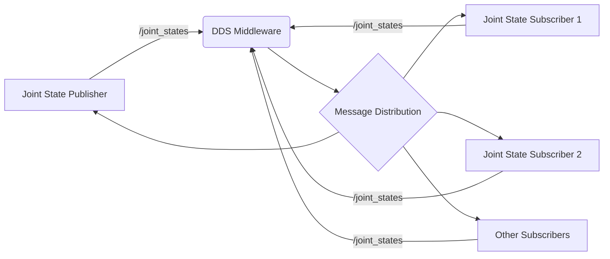

# Topics & Message Passing with QoS

## Publishers & Subscribers

In ROS 2, topics enable asynchronous communication between nodes through a publish-subscribe pattern. For humanoid robots, this is essential for distributing sensor data, control commands, and status information across different subsystems.

The publish-subscribe pattern works as follows:
- Publishers send messages to a topic
- Subscribers receive messages from a topic
- Multiple publishers and subscribers can exist for the same topic
- Communication is asynchronous and decoupled

Here's an example of a publisher and subscriber for humanoid robot joint states:

```python
# joint_state_publisher.py
import rclpy
from rclpy.node import Node
from sensor_msgs.msg import JointState
from std_msgs.msg import Header
import math
import time

class JointStatePublisher(Node):
    def __init__(self):
        super().__init__('joint_state_publisher')

        # Create publisher for joint states
        self.publisher = self.create_publisher(JointState, '/joint_states', 10)

        # Publish at 100 Hz (10ms interval)
        self.timer = self.create_timer(0.01, self.publish_joint_states)

        self.get_logger().info('Joint State Publisher started')

    def publish_joint_states(self):
        """Publish joint state messages"""
        msg = JointState()
        msg.header = Header()
        msg.header.stamp = self.get_clock().now().to_msg()
        msg.header.frame_id = 'base_link'

        # Define humanoid joint names
        msg.name = [
            'left_hip_yaw', 'left_hip_roll', 'left_hip_pitch',
            'left_knee', 'left_ankle_pitch', 'left_ankle_roll',
            'right_hip_yaw', 'right_hip_roll', 'right_hip_pitch',
            'right_knee', 'right_ankle_pitch', 'right_ankle_roll',
            'left_shoulder_pitch', 'left_shoulder_roll', 'left_elbow',
            'right_shoulder_pitch', 'right_shoulder_roll', 'right_elbow'
        ]

        # Generate example positions (for demonstration)
        positions = []
        current_time = self.get_clock().now().nanoseconds / 1e9
        for i, _ in enumerate(msg.name):
            # Create oscillating positions for demonstration
            pos = math.sin(current_time + i) * 0.5
            positions.append(pos)

        msg.position = positions
        msg.velocity = [0.0] * len(positions)  # Zero velocity for simplicity
        msg.effort = [0.0] * len(positions)    # Zero effort for simplicity

        self.publisher.publish(msg)
        self.get_logger().debug(f'Published joint states for {len(msg.name)} joints')

def main(args=None):
    rclpy.init(args=args)

    try:
        node = JointStatePublisher()
        rclpy.spin(node)
    except KeyboardInterrupt:
        pass
    finally:
        node.destroy_node()
        rclpy.shutdown()

if __name__ == '__main__':
    main()
```

```python
# joint_state_subscriber.py
import rclpy
from rclpy.node import Node
from sensor_msgs.msg import JointState

class JointStateSubscriber(Node):
    def __init__(self):
        super().__init__('joint_state_subscriber')

        # Create subscription to joint states
        self.subscription = self.create_subscription(
            JointState,
            '/joint_states',
            self.joint_state_callback,
            10  # QoS profile depth
        )

        self.get_logger().info('Joint State Subscriber started')

    def joint_state_callback(self, msg):
        """Process incoming joint state messages"""
        self.get_logger().info(f'Received joint states for {len(msg.name)} joints')

        # Process each joint's position
        for name, pos in zip(msg.name, msg.position):
            if abs(pos) > 1.5:  # Example: log if position exceeds threshold
                self.get_logger().warn(f'Large position for {name}: {pos:.3f}')

def main(args=None):
    rclpy.init(args=args)

    try:
        node = JointStateSubscriber()
        rclpy.spin(node)
    except KeyboardInterrupt:
        pass
    finally:
        node.destroy_node()
        rclpy.shutdown()

if __name__ == '__main__':
    main()
```



## Message Types & Quality of Service (QoS) Profiles

Quality of Service (QoS) profiles are critical for humanoid robot communication, as they determine how messages are handled in terms of reliability, durability, and other properties.

### Reliability QoS
- **RELIABLE**: All messages are guaranteed to be delivered, potentially with retries
- **BEST_EFFORT**: Messages are sent without guarantee of delivery

For humanoid robots, use RELIABLE for critical control messages and BEST_EFFORT for high-frequency sensor data where occasional loss is acceptable.

### Durability QoS
- **VOLATILE**: Only new messages after subscription are received
- **TRANSIENT_LOCAL**: All messages, including historical ones, are received

For humanoid robots, TRANSIENT_LOCAL is useful for configuration parameters that new nodes should receive immediately.

### History QoS
- **KEEP_LAST**: Maintain only the most recent messages
- **KEEP_ALL**: Maintain all messages (limited by resource limits)

### Depth QoS
Determines how many messages are kept in the queue for KEEP_LAST history.

```python
# qos_examples.py
import rclpy
from rclpy.node import Node
from rclpy.qos import QoSProfile, ReliabilityPolicy, DurabilityPolicy, HistoryPolicy
from sensor_msgs.msg import JointState
from std_msgs.msg import String

class QoSExamples(Node):
    def __init__(self):
        super().__init__('qos_examples')

        # Example 1: Critical control commands - Reliable, Volatile, Keep Last 1
        critical_qos = QoSProfile(
            depth=1,
            reliability=ReliabilityPolicy.RELIABLE,
            durability=DurabilityPolicy.VOLATILE,
            history=HistoryPolicy.KEEP_LAST
        )

        self.critical_publisher = self.create_publisher(
            String, 'critical_commands', critical_qos
        )

        # Example 2: Sensor data - Best Effort, Volatile, Keep Last 10
        sensor_qos = QoSProfile(
            depth=10,
            reliability=ReliabilityPolicy.BEST_EFFORT,
            durability=DurabilityPolicy.VOLATILE,
            history=HistoryPolicy.KEEP_LAST
        )

        self.sensor_publisher = self.create_publisher(
            JointState, 'sensor_data', sensor_qos
        )

        # Example 3: Configuration parameters - Reliable, Transient Local, Keep All
        config_qos = QoSProfile(
            depth=1,
            reliability=ReliabilityPolicy.RELIABLE,
            durability=DurabilityPolicy.TRANSIENT_LOCAL,
            history=HistoryPolicy.KEEP_ALL
        )

        self.config_publisher = self.create_publisher(
            String, 'robot_config', config_qos
        )

        self.get_logger().info('QoS Examples node initialized')

def main(args=None):
    rclpy.init(args=args)

    try:
        node = QoSExamples()
        rclpy.spin(node)
    except KeyboardInterrupt:
        pass
    finally:
        node.destroy_node()
        rclpy.shutdown()

if __name__ == '__main__':
    main()
```

## Practical Example: Command Velocity Topic for Humanoid Locomotion

Here's a practical example for humanoid locomotion velocity commands:

```python
# humanoid_velocity_controller.py
import rclpy
from rclpy.node import Node
from geometry_msgs.msg import Twist
from rclpy.qos import QoSProfile, ReliabilityPolicy, DurabilityPolicy
from std_msgs.msg import Header

class HumanoidVelocityController(Node):
    def __init__(self):
        super().__init__('humanoid_velocity_controller')

        # For humanoid base velocity commands, we need reliable delivery
        velocity_qos = QoSProfile(
            depth=5,  # Keep last 5 commands in case of processing delays
            reliability=ReliabilityPolicy.RELIABLE,  # Must deliver commands
            durability=DurabilityPolicy.VOLATILE  # Only current commands matter
        )

        # Subscribe to velocity commands
        self.velocity_subscriber = self.create_subscription(
            Twist,
            '/cmd_vel',
            self.velocity_command_callback,
            velocity_qos
        )

        # Publish feedback on achieved velocity
        self.velocity_publisher = self.create_publisher(
            Twist,
            '/odom/velocity',
            velocity_qos
        )

        self.get_logger().info('Humanoid Velocity Controller initialized')

    def velocity_command_callback(self, msg):
        """Process velocity commands for humanoid locomotion"""
        self.get_logger().info(f'Received velocity command: linear={msg.linear.x:.2f}, angular={msg.angular.z:.2f}')

        # Here would be the actual control logic for the humanoid
        # This is where inverse kinematics, balance control, etc. would be implemented
        self.execute_velocity_command(msg)

    def execute_velocity_command(self, cmd):
        """Execute the velocity command on the humanoid robot"""
        # Placeholder for actual locomotion control implementation
        # This would interface with the robot's walking controller
        self.get_logger().debug('Executing velocity command...')

        # Publish feedback on achieved velocity
        feedback_msg = Twist()
        feedback_msg.linear.x = cmd.linear.x * 0.95  # Simulate 95% achievement
        feedback_msg.angular.z = cmd.angular.z * 0.95

        self.velocity_publisher.publish(feedback_msg)

def main(args=None):
    rclpy.init(args=args)

    try:
        node = HumanoidVelocityController()
        rclpy.spin(node)
    except KeyboardInterrupt:
        pass
    finally:
        node.destroy_node()
        rclpy.shutdown()

if __name__ == '__main__':
    main()
```

## Message Serialization and Transport

ROS 2 uses a serialization format called RMW (ROS Middleware) to handle message transport. For humanoid robots, understanding serialization performance is important:

- Messages are serialized to binary format for transport
- Different message types have different serialization overhead
- Large messages (like sensor data) should be published at appropriate rates

## Best Practices for Topic Naming and Organization

For humanoid robots, follow these best practices:

1. **Consistent naming**: Use descriptive, consistent names
2. **Hierarchical structure**: Organize by robot subsystems
3. **Standard interfaces**: Use common message types when possible

Example topic structure for a humanoid robot:
```
/sensors/imu/data
/sensors/camera/rgb/image_raw
/sensors/lidar/scan
/joint_states
/cmd_vel
/joint_group_position_controller/commands
/behavior_manager/status
/navigation/goal
```

:::warning
For humanoid robots, be careful with message rates. High-frequency sensor data can overwhelm the system. Use appropriate QoS settings and consider message filtering or throttling for high-rate topics.
:::

:::tip
When designing topic architectures for humanoid robots, consider the real-time requirements. Critical control topics should use RELIABLE QoS, while high-frequency sensor data might use BEST_EFFORT to avoid blocking the system.
:::

## Summary

Topics and message passing form the backbone of ROS 2 communication, especially critical for humanoid robots with their complex distributed systems. Understanding and properly configuring QoS profiles is essential for achieving the reliability and performance required for humanoid locomotion and control.

In the next section, we'll explore services and actions, which provide synchronous and long-running communication patterns for humanoid robot systems.