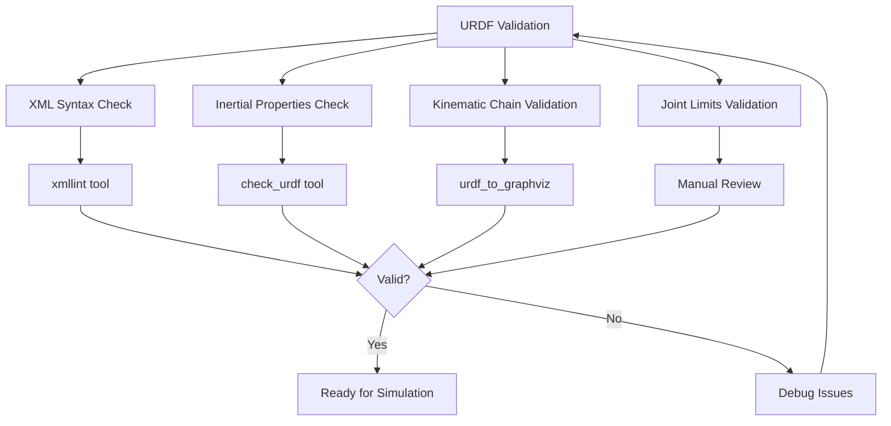

# URDF for Humanoid Robots

## Basic Structure of URDF/XACRO

URDF (Unified Robot Description Format) is an XML-based format used to describe robot models in ROS. For humanoid robots, URDF is essential for defining the robot's physical structure, including links, joints, inertial properties, and visual/collision representations.

A basic URDF structure consists of:
- **Links**: Rigid bodies that make up the robot
- **Joints**: Connections between links that allow relative motion
- **Materials**: Visual appearance properties
- **Gazebo plugins**: Simulation-specific configurations

XACRO (XML Macros) extends URDF by providing macros, constants, and mathematical expressions, making complex humanoid models more manageable.

Here's a basic URDF structure:

```xml
<?xml version="1.0"?>
<robot name="humanoid_robot" xmlns:xacro="http://www.ros.org/wiki/xacro">
  <!-- Links define rigid bodies -->
  <link name="base_link">
    <visual>
      <geometry>
        <box size="0.2 0.1 0.1"/>
      </geometry>
      <material name="blue">
        <color rgba="0 0 1 1"/>
      </material>
    </visual>
    <collision>
      <geometry>
        <box size="0.2 0.1 0.1"/>
      </geometry>
    </collision>
    <inertial>
      <mass value="1.0"/>
      <inertia ixx="0.01" ixy="0" ixz="0" iyy="0.01" iyz="0" izz="0.01"/>
    </inertial>
  </link>

  <!-- Joints connect links -->
  <joint name="base_to_head" type="fixed">
    <parent link="base_link"/>
    <child link="head_link"/>
    <origin xyz="0 0 0.3" rpy="0 0 0"/>
  </joint>

  <link name="head_link">
    <visual>
      <geometry>
        <sphere radius="0.1"/>
      </geometry>
      <material name="white">
        <color rgba="1 1 1 1"/>
      </material>
    </visual>
    <collision>
      <geometry>
        <sphere radius="0.1"/>
      </geometry>
    </collision>
    <inertial>
      <mass value="0.5"/>
      <inertia ixx="0.001" ixy="0" ixz="0" iyy="0.001" iyz="0" izz="0.001"/>
    </inertial>
  </link>
</robot>
```

```mermaid
graph TD
    A[Robot Definition] --> B[Links - Rigid Bodies]
    A --> C[Joints - Connections]
    A --> D[Materials - Visual Properties]
    A --> E[Gazebo Plugins - Simulation]

    B --> F[Visual Elements]
    B --> G[Collision Elements]
    B --> H[Inertial Properties]

    C --> I[Joint Types: Fixed, Revolute, Prismatic]
    C --> J[Joint Limits and Dynamics]
    C --> K[Joint Transmissions]

    F --> M[Geometry: Box, Sphere, Cylinder, Mesh]
    G --> N[Collision Geometry]
    H --> O[Mass, Center of Mass, Inertia]
</mermaid>

## Important Tags for Humanoids (Joints, Transmissions, Inertia, Sensors)

### Joints for Humanoid Robots

Humanoid robots require specific joint types to simulate human-like movement:

```xml
<!-- Example of different joint types for humanoid -->
<!-- Revolute joints for rotational movement (knees, elbows, shoulders) -->
<joint name="left_knee_joint" type="revolute">
  <parent link="left_thigh_link"/>
  <child link="left_shin_link"/>
  <origin xyz="0 0 -0.4" rpy="0 0 0"/>
  <axis xyz="1 0 0"/>  <!-- Rotate around X-axis -->
  <limit lower="-1.57" upper="1.57" effort="100" velocity="1.0"/>
  <dynamics damping="0.1" friction="0.01"/>
</joint>

<!-- Continuous joints for unlimited rotation (waist) -->
<joint name="waist_yaw_joint" type="continuous">
  <parent link="torso_link"/>
  <child link="waist_link"/>
  <origin xyz="0 0 -0.1" rpy="0 0 0"/>
  <axis xyz="0 0 1"/>  <!-- Rotate around Z-axis -->
  <dynamics damping="0.2"/>
</joint>

<!-- Fixed joints for permanent connections -->
<joint name="head_camera_joint" type="fixed">
  <parent link="head_link"/>
  <child link="camera_link"/>
  <origin xyz="0.05 0 0.05" rpy="0 0 0"/>
</joint>
```

### Transmissions for Actuator Control

Transmissions define how joints are controlled by actuators:

```xml
<!-- Transmission for a joint - essential for control -->
<transmission name="left_knee_transmission">
  <type>transmission_interface/SimpleTransmission</type>
  <joint name="left_knee_joint">
    <hardwareInterface>hardware_interface/EffortJointInterface</hardwareInterface>
  </joint>
  <actuator name="left_knee_motor">
    <mechanicalReduction>1</mechanicalReduction>
  </actuator>
</transmission>

<!-- Alternative transmission types -->
<transmission name="right_hip_transmission">
  <type>transmission_interface/SimpleTransmission</type>
  <joint name="right_hip_joint">
    <hardwareInterface>hardware_interface/PositionJointInterface</hardwareInterface>
  </joint>
  <actuator name="right_hip_motor">
    <mechanicalReduction>1</mechanicalReduction>
  </actuator>
</transmission>
```

### Inertial Properties

Accurate inertial properties are crucial for realistic simulation:

```xml
<!-- Proper inertial definition for a humanoid link -->
<link name="left_thigh_link">
  <visual>
    <geometry>
      <cylinder length="0.4" radius="0.05"/>
    </geometry>
    <origin xyz="0 0 -0.2" rpy="1.57 0 0"/>  <!-- Rotate to align with joint axis -->
    <material name="gray">
      <color rgba="0.5 0.5 0.5 1"/>
    </material>
  </visual>
  <collision>
    <geometry>
      <cylinder length="0.4" radius="0.05"/>
    </geometry>
    <origin xyz="0 0 -0.2" rpy="1.57 0 0"/>
  </collision>
  <inertial>
    <!-- Mass based on material density -->
    <mass value="2.0"/>
    <!-- Inertia tensor - important for realistic physics -->
    <inertia
      ixx="0.027" ixy="0" ixz="0"
      iyy="0.027" iyz="0"
      izz="0.005"/>
  </inertial>
</link>
```

### Sensors for Humanoid Robots

Humanoid robots typically have various sensors integrated into their URDF:

```xml
<!-- Camera sensor -->
<link name="camera_link">
  <visual>
    <geometry>
      <box size="0.02 0.05 0.02"/>
    </geometry>
    <material name="black"/>
  </visual>
  <inertial>
    <mass value="0.1"/>
    <inertia ixx="1e-6" ixy="0" ixz="0" iyy="1e-6" iyz="0" izz="1e-6"/>
  </inertial>
</link>

<gazebo reference="camera_link">
  <sensor type="camera" name="camera1">
    <update_rate>30.0</update_rate>
    <camera name="head">
      <horizontal_fov>1.3962634</horizontal_fov>
      <image>
        <width>800</width>
        <height>600</height>
        <format>R8G8B8</format>
      </image>
      <clip>
        <near>0.02</near>
        <far>300</far>
      </clip>
    </camera>
    <plugin name="camera_controller" filename="libgazebo_ros_camera.so">
      <frame_name>camera_link</frame_name>
      <topic_name>camera/image_raw</topic_name>
    </plugin>
  </sensor>
</gazebo>

<!-- IMU sensor -->
<gazebo reference="torso_link">
  <sensor name="imu_sensor" type="imu">
    <always_on>true</always_on>
    <update_rate>100</update_rate>
    <imu>
      <angular_velocity>
        <x>
          <noise type="gaussian">
            <mean>0.0</mean>
            <stddev>2e-4</stddev>
          </noise>
        </x>
        <y>
          <noise type="gaussian">
            <mean>0.0</mean>
            <stddev>2e-4</stddev>
          </noise>
        </y>
        <z>
          <noise type="gaussian">
            <mean>0.0</mean>
            <stddev>2e-4</stddev>
          </noise>
        </z>
      </angular_velocity>
      <linear_acceleration>
        <x>
          <noise type="gaussian">
            <mean>0.0</mean>
            <stddev>1.7e-2</stddev>
          </noise>
        </x>
        <y>
          <noise type="gaussian">
            <mean>0.0</mean>
            <stddev>1.7e-2</stddev>
          </noise>
        </y>
        <z>
          <noise type="gaussian">
            <mean>0.0</mean>
            <stddev>1.7e-2</stddev>
          </noise>
        </z>
      </linear_acceleration>
    </imu>
  </sensor>
</gazebo>
```

## Common Humanoid Patterns (Double Support, Toe Joints, Gripper)

### Double Support Configuration

Humanoid robots often have complex feet for stable standing:

```xml
<!-- Example of a humanoid foot with multiple contact points -->
<link name="left_foot_link">
  <visual>
    <geometry>
      <box size="0.25 0.1 0.05"/>
    </geometry>
    <material name="black"/>
  </visual>
  <collision>
    <geometry>
      <box size="0.25 0.1 0.05"/>
    </geometry>
  </collision>
  <inertial>
    <mass value="0.8"/>
    <inertia ixx="0.004" ixy="0" ixz="0" iyy="0.008" iyz="0" izz="0.008"/>
  </inertial>
</link>

<!-- Toe joint for more natural walking -->
<joint name="left_ankle_toe_joint" type="revolute">
  <parent link="left_ankle_link"/>
  <child link="left_foot_link"/>
  <origin xyz="0.05 0 -0.025" rpy="0 0 0"/>  <!-- Offset for more natural foot placement -->
  <axis xyz="0 1 0"/>  <!-- Pitch motion -->
  <limit lower="-0.5" upper="0.5" effort="50" velocity="2.0"/>
  <dynamics damping="0.5" friction="0.1"/>
</joint>

<!-- Additional contact sensors for foot -->
<gazebo reference="left_foot_link">
  <sensor name="left_foot_contact" type="contact">
    <always_on>true</always_on>
    <update_rate>100</update_rate>
    <contact>
      <collision>left_foot_link_collision</collision>
    </contact>
    <plugin name="left_foot_contact_plugin" filename="libgazebo_ros_bumper.so">
      <frame_name>left_foot_link</frame_name>
      <topic_name>left_foot_contact</topic_name>
    </plugin>
  </sensor>
</gazebo>
```

### XACRO Macros for Humanoid Models

XACRO macros make complex humanoid models more manageable:

```xml
<?xml version="1.0"?>
<robot xmlns:xacro="http://www.ros.org/wiki/xacro" name="humanoid_with_xacro">

  <!-- Define constants -->
  <xacro:property name="M_PI" value="3.1415926535897931" />
  <xacro:property name="torso_height" value="0.5" />
  <xacro:property name="limb_density" value="1000" />  <!-- kg/m^3 -->

  <!-- Macro for creating a limb -->
  <xacro:macro name="limb" params="name parent_link length radius mass joint_type *origin">
    <joint name="${name}_joint" type="${joint_type}">
      <xacro:insert_block name="origin"/>
      <parent link="${parent_link}"/>
      <child link="${name}_link"/>
      <axis xyz="1 0 0"/>
      <limit lower="${-M_PI/2}" upper="${M_PI/2}" effort="100" velocity="1.0"/>
    </joint>

    <link name="${name}_link">
      <visual>
        <geometry>
          <cylinder length="${length}" radius="${radius}"/>
        </geometry>
        <origin xyz="0 0 ${length/2}" rpy="${M_PI/2} 0 0"/>
        <material name="gray">
          <color rgba="0.5 0.5 0.5 1"/>
        </material>
      </visual>
      <collision>
        <geometry>
          <cylinder length="${length}" radius="${radius}"/>
        </geometry>
        <origin xyz="0 0 ${length/2}" rpy="${M_PI/2} 0 0"/>
      </collision>
      <inertial>
        <mass value="${mass}"/>
        <inertia
          ixx="${mass*(3*radius*radius + length*length)/12}"
          ixy="0" ixz="0"
          iyy="${mass*(3*radius*radius + length*length)/12}"
          iyz="0"
          izz="${mass*radius*radius/2}"/>
      </inertial>
    </link>

    <!-- Transmission for the joint -->
    <transmission name="${name}_transmission">
      <type>transmission_interface/SimpleTransmission</type>
      <joint name="${name}_joint">
        <hardwareInterface>hardware_interface/EffortJointInterface</hardwareInterface>
      </joint>
      <actuator name="${name}_motor">
        <mechanicalReduction>1</mechanicalReduction>
      </actuator>
    </transmission>
  </xacro:macro>

  <!-- Use the macro to create humanoid limbs -->
  <link name="base_link">
    <visual>
      <geometry>
        <box size="0.2 0.3 0.5"/>
      </geometry>
      <material name="blue">
        <color rgba="0 0 1 1"/>
      </material>
    </visual>
    <inertial>
      <mass value="5.0"/>
      <inertia ixx="0.1" ixy="0" ixz="0" iyy="0.1" iyz="0" izz="0.1"/>
    </inertial>
  </link>

  <!-- Create limbs using the macro -->
  <xacro:limb name="left_upper_arm" parent_link="base_link"
              length="0.3" radius="0.05" mass="1.5" joint_type="revolute">
    <origin xyz="0.15 0.15 ${torso_height/2}" rpy="0 0 0"/>
  </xacro:limb>

  <xacro:limb name="right_upper_arm" parent_link="base_link"
              length="0.3" radius="0.05" mass="1.5" joint_type="revolute">
    <origin xyz="0.15 -0.15 ${torso_height/2}" rpy="0 0 0"/>
  </xacro:limb>

  <xacro:limb name="left_thigh" parent_link="base_link"
              length="0.4" radius="0.06" mass="2.0" joint_type="revolute">
    <origin xyz="-0.05 0.08 -${torso_height/2}" rpy="0 0 0"/>
  </xacro:limb>

  <xacro:limb name="right_thigh" parent_link="base_link"
              length="0.4" radius="0.06" mass="2.0" joint_type="revolute">
    <origin xyz="-0.05 -0.08 -${torso_height/2}" rpy="0 0 0"/>
  </xacro:limb>

</robot>
```

## Visualization Tools (joint_state_publisher, rviz, Isaac Sim Integration)

### Using joint_state_publisher for URDF Visualization

To visualize your URDF model in RViz:

```bash
# Launch the robot state publisher and joint state publisher
ros2 launch urdf_tutorial display.launch.py model:=path/to/your/robot.urdf
```

Or create a launch file:

```python
# launch/humanoid_display.launch.py
from launch import LaunchDescription
from launch.actions import DeclareLaunchArgument
from launch.substitutions import LaunchConfiguration
from launch_ros.actions import Node

def generate_launch_description():
    model_path = LaunchConfiguration('model')

    return LaunchDescription([
        DeclareLaunchArgument(
            'model',
            default_value='path/to/your/humanoid.urdf',
            description='Path to the URDF file'
        ),

        Node(
            package='robot_state_publisher',
            executable='robot_state_publisher',
            name='robot_state_publisher',
            parameters=[{'robot_description': open(model_path).read()}]
        ),

        Node(
            package='joint_state_publisher_gui',
            executable='joint_state_publisher_gui',
            name='joint_state_publisher_gui'
        ),

        Node(
            package='rviz2',
            executable='rviz2',
            name='rviz2'
        )
    ])
```

### Isaac Sim Integration

For Isaac Sim integration, you'll need to convert your URDF to USD format:

```python
# Isaac Sim URDF import example
import omni
from pxr import Usd, UsdGeom
import carb

def import_urdf_to_isaac_sim(urdf_path, usd_path):
    """
    Example function for importing URDF to Isaac Sim
    Note: This is conceptual - actual implementation requires Isaac Sim APIs
    """
    # Isaac Sim provides tools to import URDF
    # The process typically involves:
    # 1. Converting URDF to USD format
    # 2. Setting up physics properties
    # 3. Configuring visual materials
    # 4. Setting up ROS2 bridges for control

    print(f"Importing {urdf_path} to Isaac Sim at {usd_path}")

    # In practice, this would use Isaac Sim's URDF import extension
    # Extensions like Isaac Sim URDF Importer handle the conversion
```

## URDF Validation and Debugging Techniques

### Validating URDF Models

1. **Check for XML syntax errors:**
   ```bash
   xmllint --noout robot.urdf
   ```

2. **Validate with check_urdf tool:**
   ```bash
   check_urdf robot.urdf
   ```

3. **Use urdf_to_graphiz to visualize the kinematic tree:**
   ```bash
   urdf_to_graphiz robot.urdf
   ```

### Common URDF Issues and Solutions

```xml
<!-- 1. Missing inertial properties (causes physics errors) -->
<!-- WRONG -->
<link name="missing_inertial">
  <visual>
    <geometry><box size="1 1 1"/></geometry>
  </visual>
  <!-- No inertial properties! -->
</link>

<!-- CORRECT -->
<link name="proper_inertial">
  <visual>
    <geometry><box size="1 1 1"/></geometry>
  </visual>
  <collision>
    <geometry><box size="1 1 1"/></geometry>
  </collision>
  <inertial>
    <mass value="1.0"/>
    <inertia ixx="1.0" ixy="0" ixz="0" iyy="1.0" iyz="0" izz="1.0"/>
  </inertial>
</link>

<!-- 2. Incorrect joint axis orientation -->
<!-- WRONG - axis not aligned with intended motion -->
<joint name="bad_joint" type="revolute">
  <parent link="parent"/>
  <child link="child"/>
  <origin xyz="0 0 1" rpy="0 0 0"/>
  <axis xyz="0 0 1"/>  <!-- Z-axis, but link rotates around X? -->
</joint>

<!-- CORRECT - axis aligned with intended motion -->
<joint name="good_joint" type="revolute">
  <parent link="parent"/>
  <child link="child"/>
  <origin xyz="0 0 1" rpy="0 0 0"/>
  <axis xyz="1 0 0"/>  <!-- X-axis for intended rotation -->
</joint>

<!-- 3. Invalid joint limits -->
<!-- WRONG - limits too restrictive or invalid -->
<joint name="bad_limits" type="revolute">
  <parent link="parent"/>
  <child link="child"/>
  <limit lower="1.0" upper="0.0" effort="100" velocity="1.0"/>  <!-- lower > upper! -->
</joint>

<!-- CORRECT -->
<joint name="good_limits" type="revolute">
  <parent link="parent"/>
  <child link="child"/>
  <limit lower="-1.0" upper="1.0" effort="100" velocity="1.0"/>  <!-- lower < upper -->
</joint>
```



## Best Practices for Humanoid URDF

1. **Use consistent naming conventions:**
   - `left_arm_joint`, `right_leg_link`, etc.
   - Follow a consistent pattern throughout the model

2. **Start simple and add complexity:**
   - Begin with basic kinematic structure
   - Add visual and collision elements
   - Include inertial properties
   - Add sensors and transmissions

3. **Use XACRO for complex models:**
   - Define constants for measurements
   - Create macros for repeated elements
   - Use mathematical expressions for calculations

4. **Validate at each step:**
   - Test the kinematic chain
   - Verify inertial properties
   - Check joint limits and ranges

:::warning
For humanoid robots, pay special attention to inertial properties as they significantly affect balance and motion simulation. Incorrect inertial values can cause unstable behavior in simulation.
:::

:::tip
When designing URDF for humanoid robots, consider the actual physical constraints of the hardware. Joint limits, transmission types, and actuator capabilities should reflect the real robot to ensure accurate simulation.
:::

## Summary

URDF is fundamental for defining humanoid robot models in ROS. Understanding the structure, important tags, and best practices is essential for creating accurate robot models for simulation and control. XACRO macros significantly simplify the creation of complex humanoid models with multiple similar components.

In the next section, we'll summarize the key takeaways from this module on ROS 2 fundamentals for humanoid robotics.