# Advanced Simulation Techniques for Humanoid Robotics

## Introduction to Advanced Simulation Concepts

Advanced simulation techniques for humanoid robotics go beyond basic physics and sensor modeling to incorporate sophisticated methods that enable more realistic, efficient, and capable simulation environments. These techniques address the unique challenges of humanoid robots, including complex contact dynamics, multi-modal perception, and the need for high-fidelity simulation that can bridge the reality gap.

Advanced techniques covered in this section include:
- **Machine Learning Integration**: Using neural networks for control and perception
- **Advanced Contact Modeling**: Sophisticated contact physics for realistic interactions
- **Multi-Physics Simulation**: Coupling different physical phenomena
- **Domain Randomization**: Enhancing sim-to-real transfer
- **Reduced-Order Modeling**: Efficient simulation of complex systems

## Machine Learning Integration in Simulation

### Reinforcement Learning for Locomotion

Reinforcement Learning (RL) has shown remarkable success in developing robust locomotion controllers for humanoid robots. Simulation provides a safe and efficient environment for RL training:

```python
#!/usr/bin/env python3
# rl_locomotion_controller.py
import rospy
import numpy as np
import torch
import torch.nn as nn
import torch.optim as optim
from collections import deque
import random

class HumanoidActorNetwork(nn.Module):
    def __init__(self, state_dim, action_dim, hidden_dim=256):
        super(HumanoidActorNetwork, self).__init__()

        self.network = nn.Sequential(
            nn.Linear(state_dim, hidden_dim),
            nn.ReLU(),
            nn.Linear(hidden_dim, hidden_dim),
            nn.ReLU(),
            nn.Linear(hidden_dim, hidden_dim),
            nn.ReLU(),
            nn.Linear(hidden_dim, action_dim),
            nn.Tanh()  # Actions normalized to [-1, 1]
        )

    def forward(self, state):
        return self.network(state)

class HumanoidCriticNetwork(nn.Module):
    def __init__(self, state_dim, action_dim, hidden_dim=256):
        super(HumanoidCriticNetwork, self).__init__()

        self.network = nn.Sequential(
            nn.Linear(state_dim + action_dim, hidden_dim),
            nn.ReLU(),
            nn.Linear(hidden_dim, hidden_dim),
            nn.ReLU(),
            nn.Linear(hidden_dim, hidden_dim),
            nn.ReLU(),
            nn.Linear(hidden_dim, 1)
        )

    def forward(self, state, action):
        x = torch.cat([state, action], dim=-1)
        return self.network(x)

class DDPGAgent:
    def __init__(self, state_dim, action_dim, lr_actor=1e-4, lr_critic=1e-3):
        self.device = torch.device("cuda" if torch.cuda.is_available() else "cpu")

        # Networks
        self.actor = HumanoidActorNetwork(state_dim, action_dim).to(self.device)
        self.actor_target = HumanoidActorNetwork(state_dim, action_dim).to(self.device)
        self.critic = HumanoidCriticNetwork(state_dim, action_dim).to(self.device)
        self.critic_target = HumanoidCriticNetwork(state_dim, action_dim).to(self.device)

        # Copy weights to target networks
        self.actor_target.load_state_dict(self.actor.state_dict())
        self.critic_target.load_state_dict(self.critic.state_dict())

        # Optimizers
        self.actor_optimizer = optim.Adam(self.actor.parameters(), lr=lr_actor)
        self.critic_optimizer = optim.Adam(self.critic.parameters(), lr=lr_critic)

        # Hyperparameters
        self.gamma = 0.99  # Discount factor
        self.tau = 0.005   # Soft update parameter
        self.noise_std = 0.1  # Action noise

        # Replay buffer
        self.replay_buffer = deque(maxlen=100000)

    def select_action(self, state, add_noise=True):
        """Select action using the actor network"""
        state = torch.FloatTensor(state).unsqueeze(0).to(self.device)
        action = self.actor(state).cpu().data.numpy().flatten()

        if add_noise:
            noise = np.random.normal(0, self.noise_std, size=action.shape)
            action = np.clip(action + noise, -1, 1)

        return action

    def add_experience(self, state, action, reward, next_state, done):
        """Add experience to replay buffer"""
        self.replay_buffer.append((state, action, reward, next_state, done))

    def train(self, batch_size=128):
        """Train the networks using a batch of experiences"""
        if len(self.replay_buffer) < batch_size:
            return

        # Sample batch
        batch = random.sample(self.replay_buffer, batch_size)
        state, action, reward, next_state, done = map(np.stack, zip(*batch))

        # Convert to tensors
        state = torch.FloatTensor(state).to(self.device)
        action = torch.FloatTensor(action).to(self.device)
        reward = torch.FloatTensor(reward).unsqueeze(1).to(self.device)
        next_state = torch.FloatTensor(next_state).to(self.device)
        done = torch.BoolTensor(done).unsqueeze(1).to(self.device)

        # Critic update
        with torch.no_grad():
            next_action = self.actor_target(next_state)
            target_q = self.critic_target(next_state, next_action)
            target_q = reward + (self.gamma * target_q * ~done)

        current_q = self.critic(state, action)
        critic_loss = nn.MSELoss()(current_q, target_q)

        self.critic_optimizer.zero_grad()
        critic_loss.backward()
        self.critic_optimizer.step()

        # Actor update
        actor_loss = -self.critic(state, self.actor(state)).mean()

        self.actor_optimizer.zero_grad()
        actor_loss.backward()
        self.actor_optimizer.step()

        # Soft update target networks
        for target_param, param in zip(self.actor_target.parameters(), self.actor.parameters()):
            target_param.data.copy_(self.tau * param.data + (1 - self.tau) * target_param.data)

        for target_param, param in zip(self.critic_target.parameters(), self.critic.parameters()):
            target_param.data.copy_(self.tau * param.data + (1 - self.tau) * target_param.data)

class RLHumanoidController:
    def __init__(self):
        rospy.init_node('rl_humanoid_controller')

        # RL agent parameters
        self.state_dim = 42  # Example: joint positions, velocities, IMU, etc.
        self.action_dim = 28  # Example: joint torques for 28 DOF humanoid
        self.agent = DDPGAgent(self.state_dim, self.action_dim)

        # Robot state
        self.current_state = np.zeros(self.state_dim)
        self.current_action = np.zeros(self.action_dim)

        # Training parameters
        self.training_mode = True
        self.episode_count = 0
        self.step_count = 0
        self.max_episode_steps = 1000

        # Publishers and subscribers
        # (Implementation would include ROS subscribers for sensor data)

        rospy.loginfo(f"RL Humanoid Controller initialized with {self.state_dim} states and {self.action_dim} actions")

    def get_robot_state(self):
        """Get current robot state for RL"""
        # This would interface with actual robot sensors
        # For simulation, return a constructed state vector
        state = np.zeros(self.state_dim)

        # Example state components:
        # - Joint positions (28 values)
        # - Joint velocities (28 values)
        # - IMU readings (6 values: r, p, y, wx, wy, wz)
        # - Robot base position/orientation
        # - Contact states

        return state

    def apply_action(self, action):
        """Apply action to robot"""
        # This would send commands to robot actuators
        # For simulation, update internal state
        self.current_action = action
        # In real implementation: send action to Gazebo/real robot

    def calculate_reward(self):
        """Calculate reward based on robot state"""
        # Example reward function for walking
        reward = 0.0

        # Forward progress reward
        # reward += velocity_forward * 0.1

        # Balance reward
        # reward += (1.0 - abs(pitch_error)) * 0.5

        # Penalty for falling
        # if fallen:
        #     reward -= 100.0

        # Penalty for excessive joint velocities
        # reward -= joint_velocity_penalty * 0.01

        return reward

    def reset_episode(self):
        """Reset for new episode"""
        self.step_count = 0
        # Reset robot to initial configuration
        # This would interface with simulation reset mechanisms

    def train_step(self):
        """Single training step"""
        if self.training_mode:
            # Get current state
            current_state = self.get_robot_state()

            # Select action using RL policy
            action = self.agent.select_action(current_state)

            # Apply action to robot
            self.apply_action(action)

            # Get reward and next state after action
            reward = self.calculate_reward()
            next_state = self.get_robot_state()
            done = False  # Determine based on robot state

            # Add experience to replay buffer
            self.agent.add_experience(current_state, action, reward, next_state, done)

            # Train agent
            self.agent.train()

            # Update counters
            self.step_count += 1

            if done or self.step_count >= self.max_episode_steps:
                self.reset_episode()
                self.episode_count += 1

def main():
    controller = RLHumanoidController()

    rate = rospy.Rate(100)  # 100Hz training loop

    while not rospy.is_shutdown():
        controller.train_step()
        rate.sleep()

if __name__ == '__main__':
    main()
```

### Neural Network-Based Perception

Integrating neural networks for perception tasks in simulation:

```python
#!/usr/bin/env python3
# neural_perception_simulator.py
import rospy
import numpy as np
import torch
import torch.nn as nn
import cv2
from sensor_msgs.msg import Image
from cv_bridge import CvBridge
from geometry_msgs.msg import Point
import torchvision.transforms as transforms

class SemanticSegmentationNet(nn.Module):
    def __init__(self, num_classes=10):
        super(SemanticSegmentationNet, self).__init__()

        # Encoder (simplified)
        self.encoder = nn.Sequential(
            nn.Conv2d(3, 64, 3, padding=1),
            nn.ReLU(),
            nn.Conv2d(64, 128, 3, padding=1),
            nn.ReLU(),
            nn.MaxPool2d(2),
            nn.Conv2d(128, 256, 3, padding=1),
            nn.ReLU(),
            nn.MaxPool2d(2),
        )

        # Decoder (simplified)
        self.decoder = nn.Sequential(
            nn.ConvTranspose2d(256, 128, 4, stride=2, padding=1),
            nn.ReLU(),
            nn.ConvTranspose2d(128, 64, 4, stride=2, padding=1),
            nn.ReLU(),
            nn.Conv2d(64, num_classes, 1),
        )

    def forward(self, x):
        x = self.encoder(x)
        x = self.decoder(x)
        return x

class NeuralPerceptionSimulator:
    def __init__(self):
        rospy.init_node('neural_perception_simulator')

        # Initialize neural network
        self.device = torch.device("cuda" if torch.cuda.is_available() else "cpu")
        self.segmentation_net = SemanticSegmentationNet(num_classes=10).to(self.device)
        self.segmentation_net.eval()  # Set to evaluation mode

        # Image processing
        self.bridge = CvBridge()
        self.transform = transforms.Compose([
            transforms.ToTensor(),
            transforms.Normalize(mean=[0.485, 0.456, 0.406],
                               std=[0.229, 0.224, 0.225])
        ])

        # Publishers
        self.segmentation_pub = rospy.Publisher('/perception/segmentation', Image, queue_size=10)
        self.object_detection_pub = rospy.Publisher('/perception/objects', Point, queue_size=10)

        # Subscribers
        self.image_sub = rospy.Subscriber('/camera/rgb/image_raw', Image, self.image_callback)

        rospy.loginfo("Neural Perception Simulator initialized")

    def image_callback(self, msg):
        """Process incoming camera image with neural network"""
        try:
            # Convert ROS image to OpenCV
            cv_image = self.bridge.imgmsg_to_cv2(msg, "bgr8")

            # Preprocess image
            input_tensor = self.transform(cv_image).unsqueeze(0).to(self.device)

            # Run segmentation network
            with torch.no_grad():
                segmentation_output = self.segmentation_net(input_tensor)
                segmentation_map = torch.argmax(segmentation_output, dim=1)

            # Convert back to ROS image format
            seg_image = self.tensor_to_ros_image(segmentation_map.squeeze(0).cpu())

            # Publish segmentation result
            self.segmentation_pub.publish(seg_image)

            # Process detected objects
            self.process_detected_objects(segmentation_map)

        except Exception as e:
            rospy.logerr(f"Error processing image: {e}")

    def tensor_to_ros_image(self, tensor):
        """Convert PyTorch tensor to ROS image message"""
        # Convert tensor to numpy array
        seg_array = tensor.numpy().astype(np.uint8)

        # Convert to ROS image message
        ros_image = self.bridge.cv2_to_imgmsg(seg_array, "mono8")
        return ros_image

    def process_detected_objects(self, segmentation_map):
        """Process detected objects from segmentation map"""
        # This would identify objects of interest and publish their locations
        # For example, finding humans, obstacles, or specific objects
        pass

class PhysicsInformedNeuralNetwork(nn.Module):
    """Physics-informed neural network for humanoid dynamics"""
    def __init__(self, input_dim=42, hidden_dim=256, output_dim=28):
        super(PhysicsInformedNeuralNetwork, self).__init__()

        self.network = nn.Sequential(
            nn.Linear(input_dim, hidden_dim),
            nn.ReLU(),
            nn.Linear(hidden_dim, hidden_dim),
            nn.ReLU(),
            nn.Linear(hidden_dim, hidden_dim),
            nn.ReLU(),
            nn.Linear(hidden_dim, output_dim)
        )

        # Physics constraints (simplified)
        self.mass_matrix = nn.Parameter(torch.eye(output_dim))  # Mass matrix
        self.gravity = 9.81

    def forward(self, state):
        """Forward dynamics prediction"""
        return self.network(state)

    def enforce_physics_constraints(self, prediction, state):
        """Enforce physics constraints on neural network output"""
        # Apply physics-based corrections to network output
        # This could include conservation of momentum, energy, etc.
        return prediction

def main():
    rospy.init_node('neural_perception_node')

    # Initialize perception simulator
    perception_sim = NeuralPerceptionSimulator()

    try:
        rospy.spin()
    except KeyboardInterrupt:
        rospy.loginfo("Neural perception simulator shutting down")

if __name__ == '__main__':
    main()
```

## Advanced Contact Modeling

### Soft Contact Simulation

Realistic contact modeling is crucial for humanoid locomotion:

```python
#!/usr/bin/env python3
# soft_contact_simulator.py
import rospy
import numpy as np
from geometry_msgs.msg import WrenchStamped
from std_msgs.msg import Float64

class SoftContactModel:
    def __init__(self, stiffness=10000, damping=100, contact_area=0.01):
        self.stiffness = stiffness  # N/m
        self.damping = damping      # Ns/m
        self.contact_area = contact_area  # m^2
        self.youngs_modulus = 1e6   # Pa for soft materials

    def calculate_contact_force(self, penetration_depth, velocity, contact_normal):
        """Calculate contact force using soft contact model"""
        # Spring force
        spring_force = self.stiffness * penetration_depth

        # Damping force
        normal_velocity = np.dot(velocity, contact_normal)
        damping_force = self.damping * normal_velocity

        # Total normal force
        normal_force = max(0, spring_force - damping_force)

        # Calculate friction forces
        friction_coefficient = 0.8  # Example value
        tangential_velocity = velocity - normal_velocity * contact_normal
        max_friction_force = friction_coefficient * normal_force
        tangential_force_magnitude = min(max_friction_force,
                                       np.linalg.norm(tangential_velocity) * self.damping)

        # Total contact force
        normal_force_vector = normal_force * contact_normal
        tangential_force_vector = (tangential_force_magnitude / (np.linalg.norm(tangential_velocity) + 1e-6)) * tangential_velocity

        return normal_force_vector + tangential_force_vector

class AdvancedContactSimulator:
    def __init__(self):
        rospy.init_node('advanced_contact_simulator')

        # Contact models for different parts
        self.foot_contact_model = SoftContactModel(
            stiffness=15000,  # Higher stiffness for feet
            damping=150,
            contact_area=0.02  # Larger contact area for feet
        )

        self.hand_contact_model = SoftContactModel(
            stiffness=5000,   # Lower stiffness for hands
            damping=50,
            contact_area=0.005  # Smaller contact area for hands
        )

        # Publishers for contact forces
        self.left_foot_force_pub = rospy.Publisher('/left_foot/contact_force', WrenchStamped, queue_size=10)
        self.right_foot_force_pub = rospy.Publisher('/right_foot/contact_force', WrenchStamped, queue_size=10)
        self.left_hand_force_pub = rospy.Publisher('/left_hand/contact_force', WrenchStamped, queue_size=10)

        # Simulation parameters
        self.simulation_rate = 1000  # Hz for contact simulation
        self.rate = rospy.Rate(self.simulation_rate)

        rospy.loginfo("Advanced Contact Simulator initialized")

    def simulate_foot_contact(self, foot_position, foot_velocity, ground_normal=np.array([0, 0, 1])):
        """Simulate foot-ground contact"""
        # Calculate penetration depth (simplified)
        penetration_depth = max(0, -(foot_position[2] - 0.0))  # Assuming ground at z=0

        if penetration_depth > 0:
            contact_force = self.foot_contact_model.calculate_contact_force(
                penetration_depth, foot_velocity, ground_normal
            )

            # Publish contact force
            force_msg = WrenchStamped()
            force_msg.header.stamp = rospy.Time.now()
            force_msg.wrench.force.x = contact_force[0]
            force_msg.wrench.force.y = contact_force[1]
            force_msg.wrench.force.z = contact_force[2]

            return force_msg
        else:
            # No contact
            force_msg = WrenchStamped()
            force_msg.header.stamp = rospy.Time.now()
            return force_msg

    def run_simulation(self):
        """Main simulation loop"""
        while not rospy.is_shutdown():
            # Simulate contact for different body parts
            # This would interface with actual robot state from Gazebo

            # Example: simulate contact for a simple walking pattern
            left_foot_pos = np.array([0.0, 0.1, -0.05])  # Example position
            left_foot_vel = np.array([0.1, 0.0, 0.0])    # Example velocity

            left_force_msg = self.simulate_foot_contact(left_foot_pos, left_foot_vel)
            self.left_foot_force_pub.publish(left_force_msg)

            self.rate.sleep()

def main():
    simulator = AdvancedContactSimulator()

    try:
        simulator.run_simulation()
    except KeyboardInterrupt:
        rospy.loginfo("Advanced Contact Simulator shutting down")

if __name__ == '__main__':
    main()
```

## Multi-Physics Simulation

### Coupling Different Physical Phenomena

Humanoid robots interact with multiple physical domains simultaneously:

```python
#!/usr/bin/env python3
# multi_physics_simulator.py
import rospy
import numpy as np
from sensor_msgs.msg import Imu, Temperature, FluidPressure
from geometry_msgs.msg import Vector3
import threading
import time

class ThermalSimulator:
    """Simulate thermal effects in humanoid robot joints"""
    def __init__(self):
        self.joint_temperatures = np.zeros(28)  # 28 DOF humanoid
        self.thermal_mass = 0.5  # J/K per joint
        self.thermal_resistance = 10.0  # K/W
        self.ambient_temperature = 25.0  # Celsius

    def update_thermal_state(self, joint_torques, dt):
        """Update joint temperatures based on torque (power dissipation)"""
        power_dissipation = joint_torques ** 2 * 0.1  # Simplified model

        for i in range(len(self.joint_temperatures)):
            # Heat transfer equation
            heat_transfer = (self.ambient_temperature - self.joint_temperatures[i]) / self.thermal_resistance
            temperature_change = (power_dissipation[i] + heat_transfer) * dt / self.thermal_mass
            self.joint_temperatures[i] += temperature_change

class ElectromagneticSimulator:
    """Simulate electromagnetic effects in actuators"""
    def __init__(self):
        self.motor_efficiencies = np.ones(28) * 0.85  # 85% efficiency
        self.motor_temperatures = np.zeros(28)

    def calculate_efficiency_loss(self, current, temperature):
        """Calculate efficiency loss due to temperature and current"""
        # Simplified model: efficiency decreases with temperature and current
        temp_factor = 1.0 - 0.001 * (temperature - 25)  # 0.1% loss per degree above 25C
        current_factor = 1.0 - 0.01 * current  # 1% loss per amp of current
        return max(0.5, temp_factor * current_factor)  # Minimum 50% efficiency

class MultiPhysicsSimulator:
    def __init__(self):
        rospy.init_node('multi_physics_simulator')

        # Initialize physics simulators
        self.thermal_sim = ThermalSimulator()
        self.em_sim = ElectromagneticSimulator()

        # ROS interfaces
        self.imu_pub = rospy.Publisher('/imu/data', Imu, queue_size=10)
        self.temperature_pub = rospy.Publisher('/thermal/joint_temperatures', Temperature, queue_size=10)
        self.pressure_pub = rospy.Publisher('/pressure/foot', FluidPressure, queue_size=10)

        # Robot state
        self.joint_positions = np.zeros(28)
        self.joint_velocities = np.zeros(28)
        self.joint_torques = np.zeros(28)

        # Simulation parameters
        self.physics_rate = 1000  # Hz
        self.control_rate = 100   # Hz
        self.publish_rate = 50    # Hz

        # Timers
        self.physics_timer = rospy.Timer(
            rospy.Duration(1.0/self.physics_rate),
            self.physics_update
        )
        self.control_timer = rospy.Timer(
            rospy.Duration(1.0/self.control_rate),
            self.control_update
        )
        self.publish_timer = rospy.Timer(
            rospy.Duration(1.0/self.publish_rate),
            self.publish_sensors
        )

        rospy.loginfo("Multi-Physics Simulator initialized")

    def physics_update(self, event):
        """High-frequency physics updates"""
        dt = 1.0 / self.physics_rate

        # Update thermal state
        self.thermal_sim.update_thermal_state(self.joint_torques, dt)

        # Update electromagnetic effects
        for i in range(len(self.joint_torques)):
            self.em_sim.motor_efficiencies[i] = self.em_sim.calculate_efficiency_loss(
                abs(self.joint_torques[i]) / 100,  # Normalize current
                self.thermal_sim.joint_temperatures[i]
            )

    def control_update(self, event):
        """Control-level updates"""
        # This would interface with actual control algorithms
        # For simulation, update joint states
        pass

    def publish_sensors(self, event):
        """Publish multi-physics sensor data"""
        # Publish IMU data (affected by thermal drift)
        imu_msg = Imu()
        imu_msg.header.stamp = rospy.Time.now()

        # Add thermal drift to IMU readings
        thermal_drift = (self.thermal_sim.joint_temperatures[0:3] - 25) * 0.001
        imu_msg.angular_velocity.x += thermal_drift[0]
        imu_msg.angular_velocity.y += thermal_drift[1]
        imu_msg.angular_velocity.z += thermal_drift[2]

        self.imu_pub.publish(imu_msg)

        # Publish temperature data
        for i in range(10):  # Publish first 10 joint temperatures
            temp_msg = Temperature()
            temp_msg.header.stamp = rospy.Time.now()
            temp_msg.header.frame_id = f"joint_{i}"
            temp_msg.temperature = self.thermal_sim.joint_temperatures[i]
            temp_msg.variance = 0.1  # Measurement variance
            self.temperature_pub.publish(temp_msg)

    def update_robot_state(self, positions, velocities, torques):
        """Update robot state from external source (e.g., Gazebo)"""
        self.joint_positions = positions
        self.joint_velocities = velocities
        self.joint_torques = torques

def main():
    simulator = MultiPhysicsSimulator()

    try:
        rospy.spin()
    except KeyboardInterrupt:
        rospy.loginfo("Multi-Physics Simulator shutting down")

if __name__ == '__main__':
    main()
```

## Domain Randomization for Sim-to-Real Transfer

### Randomization Techniques

Domain randomization helps bridge the sim-to-real gap by training controllers with varied simulation conditions:

```python
#!/usr/bin/env python3
# domain_randomization.py
import rospy
import numpy as np
import random
from std_msgs.msg import Float64
import yaml

class DomainRandomizer:
    def __init__(self):
        rospy.init_node('domain_randomizer')

        # Randomization parameters
        self.randomization_config = {
            'mass': {'range': [0.8, 1.2], 'enabled': True},  # ±20% mass variation
            'friction': {'range': [0.5, 1.5], 'enabled': True},  # 0.5x to 1.5x friction
            'inertia': {'range': [0.9, 1.1], 'enabled': True},  # ±10% inertia
            'com_offset': {'range': [-0.02, 0.02], 'enabled': True},  # ±2cm COM offset
            'sensor_noise': {'range': [0.5, 2.0], 'enabled': True},  # Variable sensor noise
            'actuator_delay': {'range': [0.0, 0.02], 'enabled': True},  # 0-20ms delay
        }

        # Current randomized parameters
        self.current_params = {}

        # Publishers for randomization parameters
        self.param_pub = rospy.Publisher('/domain_randomization/params', Float64, queue_size=10)

        # Timer for parameter updates
        self.update_timer = rospy.Timer(rospy.Duration(5.0), self.update_randomization)  # Update every 5 seconds

        # Randomize initial parameters
        self.randomize_parameters()

        rospy.loginfo("Domain Randomizer initialized")

    def randomize_parameters(self):
        """Randomize simulation parameters"""
        for param_name, config in self.randomization_config.items():
            if config['enabled']:
                if param_name == 'com_offset':
                    # 3D offset (x, y, z)
                    self.current_params[param_name] = np.random.uniform(
                        config['range'][0], config['range'][1], size=3
                    )
                elif param_name == 'actuator_delay':
                    # Single value for delay
                    self.current_params[param_name] = random.uniform(
                        config['range'][0], config['range'][1]
                    )
                else:
                    # Single scaling factor
                    self.current_params[param_name] = random.uniform(
                        config['range'][0], config['range'][1]
                    )

        rospy.loginfo(f"Randomized parameters: {self.current_params}")

    def update_randomization(self, event):
        """Update randomization parameters"""
        self.randomize_parameters()

    def get_mass_multiplier(self):
        """Get mass scaling factor"""
        return self.current_params.get('mass', 1.0)

    def get_friction_multiplier(self):
        """Get friction scaling factor"""
        return self.current_params.get('friction', 1.0)

    def get_inertia_multiplier(self):
        """Get inertia scaling factor"""
        return self.current_params.get('inertia', 1.0)

    def get_com_offset(self):
        """Get center of mass offset"""
        return self.current_params.get('com_offset', np.zeros(3))

    def get_sensor_noise_multiplier(self):
        """Get sensor noise scaling factor"""
        return self.current_params.get('sensor_noise', 1.0)

    def get_actuator_delay(self):
        """Get actuator delay"""
        return self.current_params.get('actuator_delay', 0.0)

class RandomizedSimulationEnvironment:
    def __init__(self):
        rospy.init_node('randomized_simulation_environment')

        # Initialize domain randomizer
        self.randomizer = DomainRandomizer()

        # Simulation state
        self.simulation_step_count = 0
        self.episode_count = 0

        # Publishers
        self.status_pub = rospy.Publisher('/domain_randomization/status', Float64, queue_size=10)

        # Timer for simulation updates
        self.sim_timer = rospy.Timer(rospy.Duration(0.001), self.simulation_step)  # 1000Hz

        rospy.loginfo("Randomized Simulation Environment initialized")

    def simulation_step(self, event):
        """Main simulation step with randomization"""
        # Apply current randomization parameters to simulation
        # This would interface with Gazebo or other simulation engines

        # Example: apply mass scaling
        mass_mult = self.randomizer.get_mass_multiplier()
        friction_mult = self.randomizer.get_friction_multiplier()
        inertia_mult = self.randomizer.get_inertia_multiplier()

        # Apply to simulation (this would be implemented in the physics engine)
        # For example: scale link masses, adjust friction coefficients, etc.

        # Increment step counter
        self.simulation_step_count += 1

        # Check if we should reset randomization for new episode
        if self.simulation_step_count % 50000 == 0:  # Every 50 seconds at 1000Hz
            self.episode_count += 1
            rospy.loginfo(f"Completed episode {self.episode_count}, randomizing parameters")

    def get_randomized_robot_properties(self, base_properties):
        """Get robot properties with randomization applied"""
        randomized_props = base_properties.copy()

        # Apply mass randomization
        if 'mass' in randomized_props:
            randomized_props['mass'] *= self.randomizer.get_mass_multiplier()

        # Apply inertia randomization
        if 'inertia' in randomized_props:
            for key in ['ixx', 'iyy', 'izz', 'ixy', 'ixz', 'iyz']:
                if key in randomized_props:
                    randomized_props[key] *= self.randomizer.get_inertia_multiplier()

        # Apply friction randomization
        if 'friction' in randomized_props:
            randomized_props['friction'] *= self.randomizer.get_friction_multiplier()

        # Apply COM offset
        if 'com_offset' in randomized_props:
            randomized_props['com_offset'] += self.randomizer.get_com_offset()

        return randomized_props

def main():
    env = RandomizedSimulationEnvironment()

    try:
        rospy.spin()
    except KeyboardInterrupt:
        rospy.loginfo("Randomized Simulation Environment shutting down")

if __name__ == '__main__':
    main()
```

## Reduced-Order Modeling

### Efficient Simulation of Complex Systems

Reduced-order modeling allows for faster simulation while maintaining essential dynamics:

```python
#!/usr/bin/env python3
# reduced_order_model.py
import rospy
import numpy as np
from geometry_msgs.msg import Vector3
from std_msgs.msg import Float64

class LinearInvertedPendulumModel:
    """Reduced-order model for humanoid balance using LIPM"""
    def __init__(self, com_height=0.85, gravity=9.81):
        self.com_height = com_height
        self.gravity = gravity
        self.omega = np.sqrt(gravity / com_height)  # Natural frequency

        # State: [x, y, vx, vy] (CoM position and velocity in x-y plane)
        self.state = np.zeros(4)

    def update(self, zmp_ref, dt):
        """Update LIPM state given ZMP reference"""
        x, y, vx, vy = self.state
        zmp_x, zmp_y = zmp_ref

        # LIPM dynamics:
        # x_ddot = omega^2 * (x - zmp_x)
        # y_ddot = omega^2 * (y - zmp_y)
        x_ddot = self.omega**2 * (x - zmp_x)
        y_ddot = self.omega**2 * (y - zmp_y)

        # Update state
        self.state[0] += vx * dt + 0.5 * x_ddot * dt**2
        self.state[1] += vy * dt + 0.5 * y_ddot * dt**2
        self.state[2] += x_ddot * dt
        self.state[3] += y_ddot * dt

    def get_com_position(self):
        """Get CoM position"""
        return np.array([self.state[0], self.state[1], self.com_height])

    def get_com_velocity(self):
        """Get CoM velocity"""
        return np.array([self.state[2], self.state[3], 0.0])

class CapturePointPlanner:
    """Plan footsteps based on capture point for LIPM"""
    def __init__(self, com_height=0.85, gravity=9.81):
        self.com_height = com_height
        self.gravity = gravity
        self.omega = np.sqrt(gravity / com_height)

    def calculate_capture_point(self, com_pos, com_vel):
        """Calculate capture point given CoM state"""
        px, py, _ = com_pos
        vx, vy, _ = com_vel

        capture_point_x = px + vx / self.omega
        capture_point_y = py + vy / self.omega

        return np.array([capture_point_x, capture_point_y])

    def plan_footstep(self, current_foot_pos, com_pos, com_vel, step_width=0.2):
        """Plan next footstep based on capture point"""
        capture_point = self.calculate_capture_point(com_pos, com_vel)

        # Choose support foot based on capture point location
        if capture_point[1] > current_foot_pos[1]:  # If capture point is to the left
            footstep_pos = np.array([capture_point[0], current_foot_pos[1] + step_width/2])
        else:  # If capture point is to the right
            footstep_pos = np.array([capture_point[0], current_foot_pos[1] - step_width/2])

        return footstep_pos

class ReducedOrderHumanoidController:
    def __init__(self):
        rospy.init_node('reduced_order_controller')

        # Initialize reduced-order models
        self.lipm = LinearInvertedPendulumModel(com_height=0.85)
        self.cp_planner = CapturePointPlanner(com_height=0.85)

        # Walking parameters
        self.step_period = 0.8  # seconds
        self.step_width = 0.2   # meters
        self.nominal_com_height = 0.85

        # State tracking
        self.current_support_foot = "left"  # "left" or "right"
        self.support_foot_pos = np.array([0.0, 0.1])  # Initial foot position
        self.next_foot_pos = np.array([0.0, -0.1])    # Next foot position
        self.last_step_time = rospy.Time.now().to_sec()

        # Publishers
        self.com_pub = rospy.Publisher('/balance/com', Vector3, queue_size=10)
        self.zmp_pub = rospy.Publisher('/balance/zmp', Vector3, queue_size=10)
        self.footstep_pub = rospy.Publisher('/planned_footstep', Vector3, queue_size=10)

        # Timer for control loop
        self.control_timer = rospy.Timer(rospy.Duration(0.01), self.control_step)  # 100Hz

        rospy.loginfo("Reduced Order Humanoid Controller initialized")

    def control_step(self, event):
        """Main control step using reduced-order model"""
        current_time = rospy.Time.now().to_sec()

        # Calculate ZMP reference based on walking pattern
        zmp_ref = self.calculate_zmp_reference(current_time)

        # Update LIPM with ZMP reference
        self.lipm.update(zmp_ref, 0.01)  # 100Hz update

        # Plan footsteps using capture point
        com_pos = self.lipm.get_com_position()
        com_vel = self.lipm.get_com_velocity()

        # Check if it's time for next step
        if current_time - self.last_step_time > self.step_period:
            self.next_foot_pos = self.cp_planner.plan_footstep(
                self.support_foot_pos, com_pos, com_vel, self.step_width
            )

            # Switch support foot
            self.current_support_foot = "right" if self.current_support_foot == "left" else "left"
            self.support_foot_pos = self.next_foot_pos.copy()
            self.last_step_time = current_time

            # Publish planned footstep
            footstep_msg = Vector3()
            footstep_msg.x = self.next_foot_pos[0]
            footstep_msg.y = self.next_foot_pos[1]
            footstep_msg.z = 0.0
            self.footstep_pub.publish(footstep_msg)

        # Publish CoM and ZMP for monitoring
        com_msg = Vector3()
        com_pos = self.lipm.get_com_position()
        com_msg.x = com_pos[0]
        com_msg.y = com_pos[1]
        com_msg.z = com_pos[2]
        self.com_pub.publish(com_msg)

        zmp_msg = Vector3()
        zmp_msg.x = zmp_ref[0]
        zmp_msg.y = zmp_ref[1]
        zmp_msg.z = 0.0
        self.zmp_pub.publish(zmp_msg)

    def calculate_zmp_reference(self, current_time):
        """Calculate ZMP reference for walking pattern"""
        # Simple walking pattern: ZMP oscillates between feet
        phase = (current_time % self.step_period) / self.step_period

        if self.current_support_foot == "left":
            # Left foot support
            zmp_x = self.support_foot_pos[0]
            zmp_y = self.support_foot_pos[1]
        else:
            # Right foot support
            zmp_x = self.support_foot_pos[0]
            zmp_y = self.support_foot_pos[1]

        # Add small periodic modulation for natural walking
        modulation = 0.02 * np.sin(2 * np.pi * current_time)
        zmp_x += modulation

        return np.array([zmp_x, zmp_y])

def main():
    controller = ReducedOrderHumanoidController()

    try:
        rospy.spin()
    except KeyboardInterrupt:
        rospy.loginfo("Reduced Order Controller shutting down")

if __name__ == '__main__':
    main()
```

## Advanced Visualization and Analysis Tools

### Simulation Analytics and Debugging

Advanced tools for analyzing and debugging simulation:

```python
#!/usr/bin/env python3
# simulation_analytics.py
import rospy
import numpy as np
import matplotlib.pyplot as plt
from matplotlib.animation import FuncAnimation
from collections import deque
import threading
import time

class SimulationAnalytics:
    def __init__(self):
        rospy.init_node('simulation_analytics')

        # Data storage
        self.joint_position_history = deque(maxlen=10000)
        self.joint_velocity_history = deque(maxlen=10000)
        self.joint_effort_history = deque(maxlen=10000)
        self.balance_metrics = deque(maxlen=10000)

        # Statistics
        self.performance_metrics = {
            'avg_loop_time': 0.0,
            'min_loop_time': float('inf'),
            'max_loop_time': 0.0,
            'loop_time_variance': 0.0,
            'control_frequency': 0.0,
        }

        # Lock for thread safety
        self.data_lock = threading.Lock()

        # Start analytics thread
        self.analytics_thread = threading.Thread(target=self.analytics_worker, daemon=True)
        self.analytics_thread.start()

        rospy.loginfo("Simulation Analytics initialized")

    def analytics_worker(self):
        """Background thread for analytics processing"""
        while not rospy.is_shutdown():
            # Process analytics at lower frequency
            time.sleep(0.1)  # 10Hz analytics processing

            # Calculate performance metrics
            self.calculate_performance_metrics()

    def calculate_performance_metrics(self):
        """Calculate performance metrics from stored data"""
        with self.data_lock:
            if len(self.joint_position_history) > 100:
                # Calculate joint velocity statistics
                positions = np.array(list(self.joint_position_history))
                velocities = np.array(list(self.joint_velocity_history))

                avg_velocity = np.mean(np.abs(velocities), axis=0)
                max_velocity = np.max(np.abs(velocities), axis=0)

                # Calculate balance metrics
                balance_data = list(self.balance_metrics)
                if balance_data:
                    avg_balance = np.mean(balance_data)
                    balance_variance = np.var(balance_data)

    def add_joint_data(self, positions, velocities, efforts):
        """Add joint data for analytics"""
        with self.data_lock:
            self.joint_position_history.append(positions.copy())
            self.joint_velocity_history.append(velocities.copy())
            self.joint_effort_history.append(efforts.copy())

    def add_balance_metric(self, balance_score):
        """Add balance metric for analytics"""
        with self.data_lock:
            self.balance_metrics.append(balance_score)

    def generate_performance_report(self):
        """Generate comprehensive performance report"""
        with self.data_lock:
            report = {
                'total_data_points': len(self.joint_position_history),
                'joint_position_range': {},
                'joint_velocity_stats': {},
                'balance_metrics': {
                    'avg': np.mean(self.balance_metrics) if self.balance_metrics else 0,
                    'std': np.std(self.balance_metrics) if self.balance_metrics else 0,
                    'min': min(self.balance_metrics) if self.balance_metrics else 0,
                    'max': max(self.balance_metrics) if self.balance_metrics else 0,
                }
            }

            # Calculate joint-specific statistics
            if self.joint_position_history:
                all_positions = np.array(list(self.joint_position_history))
                all_velocities = np.array(list(self.joint_velocity_history))

                for i in range(all_positions.shape[1]):
                    joint_name = f"joint_{i}"
                    report['joint_position_range'][joint_name] = {
                        'min': float(np.min(all_positions[:, i])),
                        'max': float(np.max(all_positions[:, i])),
                        'std': float(np.std(all_positions[:, i]))
                    }

                    report['joint_velocity_stats'][joint_name] = {
                        'avg': float(np.mean(np.abs(all_velocities[:, i]))),
                        'max': float(np.max(np.abs(all_velocities[:, i]))),
                        'std': float(np.std(all_velocities[:, i]))
                    }

        return report

    def plot_joint_trajectories(self, joint_indices=None, time_window=1000):
        """Plot joint trajectories"""
        with self.data_lock:
            if len(self.joint_position_history) < time_window:
                return None

            # Get recent data
            positions = np.array(list(self.joint_position_history)[-time_window:])
            velocities = np.array(list(self.joint_velocity_history)[-time_window:])

            if joint_indices is None:
                joint_indices = range(min(6, positions.shape[1]))  # Plot first 6 joints

            fig, axes = plt.subplots(2, len(joint_indices), figsize=(15, 8))
            if len(joint_indices) == 1:
                axes = axes.reshape(-1, 1)

            time_axis = np.arange(len(positions)) * 0.01  # Assuming 100Hz data

            for idx, joint_idx in enumerate(joint_indices):
                # Plot position
                axes[0, idx].plot(time_axis, positions[:, joint_idx])
                axes[0, idx].set_title(f'Joint {joint_idx} Position')
                axes[0, idx].set_ylabel('Position (rad)')
                axes[0, idx].grid(True)

                # Plot velocity
                axes[1, idx].plot(time_axis, velocities[:, joint_idx])
                axes[1, idx].set_title(f'Joint {joint_idx} Velocity')
                axes[1, idx].set_ylabel('Velocity (rad/s)')
                axes[1, idx].set_xlabel('Time (s)')
                axes[1, idx].grid(True)

            plt.tight_layout()
            return fig

class AdvancedSimulationDebugger:
    def __init__(self):
        rospy.init_node('advanced_simulation_debugger')

        # Initialize analytics
        self.analytics = SimulationAnalytics()

        # Debugging flags
        self.debug_balance = True
        self.debug_kinematics = True
        self.debug_dynamics = True

        # Publishers for debug information
        self.debug_pub = rospy.Publisher('/debug/simulation_state', Float64, queue_size=10)

        rospy.loginfo("Advanced Simulation Debugger initialized")

    def debug_balance_control(self, com_position, zmp_position, capture_point):
        """Debug balance control state"""
        if not self.debug_balance:
            return

        # Calculate balance metrics
        zmp_error = np.linalg.norm(com_position[:2] - zmp_position[:2])
        capture_point_distance = np.linalg.norm(com_position[:2] - capture_point[:2])

        # Log balance status
        balance_stable = zmp_error < 0.05  # 5cm threshold
        if not balance_stable:
            rospy.logwarn(f"Balance warning: ZMP error = {zmp_error:.3f}m")

        # Add to analytics
        self.analytics.add_balance_metric(zmp_error)

    def debug_kinematics(self, joint_positions, desired_positions):
        """Debug kinematic state"""
        if not self.debug_kinematics:
            return

        # Calculate position errors
        position_errors = np.abs(joint_positions - desired_positions)
        max_error = np.max(position_errors)

        if max_error > 0.1:  # 0.1 rad threshold
            rospy.logwarn(f"Kinematic error: max = {max_error:.3f} rad")

    def debug_dynamics(self, joint_velocities, joint_efforts):
        """Debug dynamic state"""
        if not self.debug_dynamics:
            return

        # Calculate power consumption
        power = np.sum(np.abs(joint_velocities * joint_efforts))

        # Check for excessive power
        if power > 1000:  # 1000W threshold
            rospy.logwarn(f"High power consumption: {power:.2f}W")

def main():
    debugger = AdvancedSimulationDebugger()

    try:
        rospy.spin()
    except KeyboardInterrupt:
        rospy.loginfo("Simulation Analytics and Debugger shutting down")

        # Generate final performance report
        report = debugger.analytics.generate_performance_report()
        print("Final Performance Report:")
        print(f"Total data points collected: {report['total_data_points']}")
        print(f"Balance metrics - Avg: {report['balance_metrics']['avg']:.3f}, "
              f"Std: {report['balance_metrics']['std']:.3f}")

if __name__ == '__main__':
    main()
```

## Best Practices for Advanced Simulation

### Architecture Considerations

When implementing advanced simulation techniques:

1. **Modular Design**: Keep different physics domains separate but coupled
2. **Performance vs. Accuracy**: Balance computational efficiency with simulation fidelity
3. **Validation**: Regularly validate simulation against real-world data
4. **Scalability**: Design systems that can handle increasing complexity

### Integration Guidelines

- **Consistent Time Stepping**: Ensure all simulation components use compatible time steps
- **Data Synchronization**: Properly synchronize data between different simulation modules
- **Error Handling**: Implement robust error handling for complex multi-physics systems
- **Monitoring**: Continuously monitor simulation health and performance

```mermaid
graph TD
    A[Advanced Simulation Techniques] --> B[Machine Learning]
    A --> C[Advanced Contact]
    A --> D[Multi-Physics]
    A --> E[Domain Randomization]
    A --> F[Reduced Order Models]
    A --> G[Analytics & Debugging]

    B --> H[Reinforcement Learning]
    B --> I[Neural Perception]
    B --> J[Learning-based Control]

    C --> K[Soft Contact Models]
    C --> L[Friction Modeling]
    C --> M[Impact Dynamics]

    D --> N[Thermal Effects]
    D --> O[Electromagnetic]
    D --> P[Multi-Domain Coupling]

    E --> Q[Parameter Randomization]
    E --> R[Sim-to-Real Transfer]
    E --> S[Robust Control]

    F --> T[LIPM]
    F --> U[Linearization]
    F --> V[Efficiency Gains]

    G --> W[Performance Analytics]
    G --> X[Debugging Tools]
    G --> Y[Validation Metrics]
```



## Troubleshooting Advanced Simulation Issues

### Common Problems and Solutions

- **Instability in Multi-Physics Coupling**: Ensure proper time stepping and numerical stability
- **Performance Degradation**: Profile and optimize computational bottlenecks
- **Validation Mismatch**: Carefully calibrate simulation parameters against real data
- **Memory Issues**: Implement proper resource management for long-running simulations

:::tip
When implementing advanced simulation techniques, start with simplified versions and gradually increase complexity. This approach helps identify issues early and ensures each component works correctly before integration.
:::

:::warning
Advanced simulation techniques can significantly increase computational requirements. Ensure your hardware can support the desired simulation fidelity and performance requirements.
:::

## Summary

Advanced simulation techniques for humanoid robotics encompass machine learning integration, sophisticated contact modeling, multi-physics simulation, domain randomization, and reduced-order modeling. These techniques enable more realistic, efficient, and capable simulation environments that can effectively bridge the gap between simulation and real-world humanoid robot deployment.

In the next section, we'll conclude Module 2 with a comprehensive summary and review checklist to ensure all key concepts have been covered effectively.