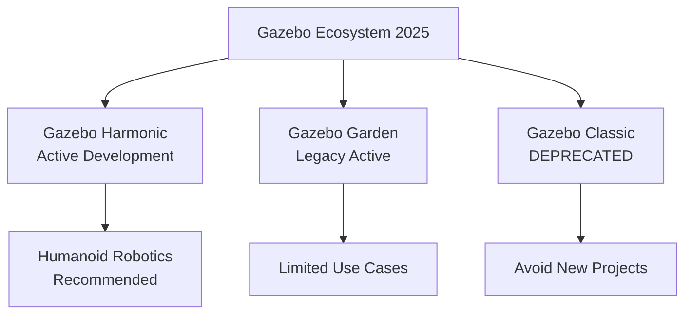

# Gazebo Fundamentals for Humanoid Robotics

## Gazebo Classic vs. Gazebo Garden/Harmonic (2025 Perspective)

As of 2025, the Gazebo ecosystem has evolved significantly with two main distributions available for humanoid robotics:

### Gazebo Classic (Deprecated but Still Relevant)
- Based on the original OpenRAVE-inspired architecture
- Uses libgazebo with plugins for functionality
- Extensive documentation and community examples
- **DEPRECATED**: No longer actively developed as of 2025

### Gazebo Garden/Harmonic (Current Standard)
- Modern architecture based on Ignition Robotics
- Better performance and modularity
- Improved physics accuracy and sensor fidelity
- Active development and support through 2030+

For humanoid robotics projects starting in 2025, **Gazebo Harmonic** is the recommended choice due to its active development, better performance with complex models, and improved physics simulation suitable for bipedal locomotion.



## World Creation and Environment Modeling

Creating realistic worlds for humanoid robot simulation involves several key components:

### World Files (.world)

World files define the simulation environment using SDF (Simulation Description Format):

```xml
<?xml version="1.0" ?>
<sdf version="1.7">
  <world name="humanoid_world">
    <!-- Include common models -->
    <include>
      <uri>model://ground_plane</uri>
    </include>
    <include>
      <uri>model://sun</uri>
    </include>

    <!-- Custom terrain for humanoid training -->
    <model name="training_terrain">
      <pose>0 0 0 0 0 0</pose>
      <static>true</static>
      <link name="link">
        <visual name="visual">
          <geometry>
            <mesh>
              <uri>model://training_terrain/meshes/terrain.dae</uri>
            </mesh>
          </geometry>
        </visual>
        <collision name="collision">
          <geometry>
            <mesh>
              <uri>model://training_terrain/meshes/terrain.dae</uri>
            </mesh>
          </geometry>
        </collision>
      </link>
    </model>
  </world>
</sdf>
```

### Ground Plane Configuration

For humanoid locomotion, ground plane properties are critical:

```xml
<model name="ground_plane">
  <static>true</static>
  <link name="link">
    <collision name="collision">
      <surface>
        <friction>
          <!-- Adjust for different surfaces - humanoid feet grip -->
          <ode>
            <mu>1.0</mu>
            <mu2>1.0</mu2>
            <slip1>0.0</slip1>
            <slip2>0.0</slip2>
          </ode>
          <torsional>
            <coefficient>1.0</coefficient>
            <use_patch_radius>false</use_patch_radius>
            <surface_radius>0.01</surface_radius>
          </torsional>
        </friction>
        <bounce>
          <restitution_coefficient>0.01</restitution_coefficient>
          <threshold>100000</threshold>
        </bounce>
        <contact>
          <ode>
            <soft_cfm>0</soft_cfm>
            <soft_erp>0.2</soft_erp>
            <kp>1e+10</kp>
            <kd>1</kd>
            <max_vel>100.0</max_vel>
            <min_depth>0.001</min_depth>
          </ode>
        </contact>
      </surface>
    </collision>
    <visual name="visual">
      <cast_shadows>false</cast_shadows>
      <grid>...</grid>
    </visual>
  </link>
</model>
```

## Model Database and Custom Model Integration

### Using the Fuel Model Database

Gazebo's Fuel database provides pre-made models for humanoid robotics:

```bash
# Browse available humanoid models
gz fuel browse -u https://fuel.gazebosim.org

# Download a humanoid model
gz fuel download -u https://fuel.gazebosim.org/1.0/OpenRobotics/models/Atrias
```

### Creating Custom Humanoid Models

When creating custom humanoid models for Gazebo, follow these best practices:

```xml
<!-- Example humanoid model skeleton -->
<sdf version="1.7">
  <model name="custom_humanoid">
    <static>false</static>
    <self_collide>false</self_collide>
    <enable_wind>false</enable_wind>
    <allow_auto_disable>true</allow_auto_disable>

    <!-- Include URDF for the robot structure -->
    <include>
      <uri>file://$(find custom_humanoid_description)/robots/humanoid.urdf</uri>
    </include>

    <!-- Custom plugins for humanoid-specific simulation -->
    <plugin name="humanoid_ground_truth" filename="libgazebo_ros_p3d.so">
      <body_name>base_link</body_name>
      <topic_name>ground_truth/state</topic_name>
      <update_rate>100</update_rate>
      <gaussian_noise>0.01</gaussian_noise>
    </plugin>

    <!-- Joint state publisher -->
    <plugin name="joint_state_publisher" filename="libgazebo_ros_joint_state_publisher.so">
      <joint_name>left_hip_yaw, left_hip_roll, left_hip_pitch</joint_name>
      <topic_name>joint_states</topic_name>
      <update_rate>50</update_rate>
    </plugin>
  </model>
</sdf>
```

## Basic Simulation Control and Visualization

### Gazebo Simulation Interface

The Gazebo simulation interface provides several ways to interact with your humanoid robot:

```python
#!/usr/bin/env python3
# humanoid_simulation_controller.py
import rospy
from std_msgs.msg import Float64
from sensor_msgs.msg import JointState
from geometry_msgs.msg import Pose, Twist
import math

class HumanoidSimulationController:
    def __init__(self):
        rospy.init_node('humanoid_simulation_controller')

        # Publishers for joint control
        self.joint_publishers = {}
        self.joint_names = [
            'left_hip_yaw', 'left_hip_roll', 'left_hip_pitch',
            'left_knee', 'left_ankle_pitch', 'left_ankle_roll',
            'right_hip_yaw', 'right_hip_roll', 'right_hip_pitch',
            'right_knee', 'right_ankle_pitch', 'right_ankle_roll'
        ]

        for joint_name in self.joint_names:
            pub = rospy.Publisher(f'/humanoid/{joint_name}_position_controller/command', Float64, queue_size=10)
            self.joint_publishers[joint_name] = pub

        # Subscribe to joint states for feedback
        rospy.Subscriber('/joint_states', JointState, self.joint_state_callback)

        # Timer for control loop
        self.control_timer = rospy.Timer(rospy.Duration(0.01), self.control_loop)  # 100 Hz

        self.joint_positions = {}
        self.joint_velocities = {}
        self.joint_efforts = {}

        rospy.loginfo("Humanoid Simulation Controller initialized")

    def joint_state_callback(self, msg):
        """Update internal joint state from Gazebo"""
        for i, name in enumerate(msg.name):
            if i < len(msg.position):
                self.joint_positions[name] = msg.position[i]
            if i < len(msg.velocity):
                self.joint_velocities[name] = msg.velocity[i]
            if i < len(msg.effort):
                self.joint_efforts[name] = msg.effort[i]

    def control_loop(self, event):
        """Main control loop running at 100 Hz"""
        # Example: Simple sinusoidal walking pattern
        t = rospy.Time.now().to_sec()

        # Left leg pattern
        left_hip_angle = 0.1 * math.sin(t * 2.0)
        left_knee_angle = 0.05 * math.sin(t * 2.0 + math.pi/4)

        # Right leg pattern (opposite phase)
        right_hip_angle = 0.1 * math.sin(t * 2.0 + math.pi)
        right_knee_angle = 0.05 * math.sin(t * 2.0 + math.pi/4 + math.pi)

        # Publish commands
        if 'left_hip_pitch' in self.joint_publishers:
            self.joint_publishers['left_hip_pitch'].publish(Float64(left_hip_angle))
        if 'left_knee' in self.joint_publishers:
            self.joint_publishers['left_knee'].publish(Float64(left_knee_angle))
        if 'right_hip_pitch' in self.joint_publishers:
            self.joint_publishers['right_hip_pitch'].publish(Float64(right_hip_angle))
        if 'right_knee' in self.joint_publishers:
            self.joint_publishers['right_knee'].publish(Float64(right_knee_angle))

    def balance_control(self):
        """Implement basic balance control for bipedal locomotion"""
        # Get base pose for balance feedback
        # This would interface with Gazebo's state publisher
        pass

def main():
    controller = HumanoidSimulationController()

    try:
        rospy.spin()
    except KeyboardInterrupt:
        rospy.loginfo("Shutting down humanoid simulation controller")

if __name__ == '__main__':
    main()
```

### Launching Gazebo with Humanoid Models

To properly launch Gazebo with your humanoid robot:

```xml
<!-- launch/humanoid_gazebo.launch -->
<launch>
  <!-- Robot description parameter -->
  <param name="robot_description" command="$(find xacro)/xacro $(find custom_humanoid_description)/urdf/humanoid.urdf.xacro" />

  <!-- Spawn robot in Gazebo -->
  <node name="spawn_urdf" pkg="gazebo_ros" type="spawn_model" respawn="false" output="screen"
    args="-param robot_description -urdf -model humanoid_robot -x 0 -y 0 -z 1.0" />

  <!-- Load joint controller configurations from YAML file -->
  <rosparam file="$(find custom_humanoid_control)/config/humanoid_controllers.yaml" command="load"/>

  <!-- Load the controllers -->
  <node name="controller_spawner" pkg="controller_manager" type="spawner" respawn="false"
    output="screen" args="left_leg_controller right_leg_controller torso_controller head_controller"/>

  <!-- Launch Gazebo with world -->
  <include file="$(find gazebo_ros)/launch/empty_world.launch">
    <arg name="world_name" value="$(find custom_humanoid_gazebo)/worlds/humanoid_training.world"/>
    <arg name="paused" value="false"/>
    <arg name="use_sim_time" value="true"/>
    <arg name="gui" value="true"/>
    <arg name="headless" value="false"/>
    <arg name="debug" value="false"/>
  </include>
</launch>
```

## Gazebo Harmonic Installation and Setup

### System Requirements

For humanoid robotics simulation with Gazebo Harmonic:
- **Ubuntu 22.04 LTS** or **Windows 11 WSL2**
- **GPU**: Modern graphics card supporting OpenGL 3.3+ (NVIDIA RTX series recommended)
- **RAM**: 16GB+ for complex humanoid models
- **CPU**: Multi-core processor (8+ cores recommended)

### Installation

```bash
# On Ubuntu 22.04
sudo apt update
sudo apt install gazebo-harmonic libgazebo-harmonic-dev

# Install ROS 2 Humble integration
sudo apt install ros-humble-gazebo-ros-pkgs ros-humble-gazebo-ros-control
```

### Basic Gazebo Commands for Humanoid Robotics

```bash
# Launch Gazebo with a specific world
gz sim -r -v 4 humanoid_training.sdf

# List all running simulations
gz service -s /gazebo/worlds

# Get model information
gz topic -e -t /world/default/model_status

# Visualize the simulation
gz sim gui
```

:::tip
For humanoid locomotion, start with simple worlds containing flat terrain before progressing to complex environments. The stability of bipedal walking is sensitive to contact parameters and control frequency.
:::

:::warning
When simulating humanoid robots, pay special attention to joint limits and collision checking. Complex humanoid kinematics can result in self-collisions if not properly configured.
:::

## Summary

Gazebo provides a robust simulation environment for humanoid robotics, but requires careful configuration to accurately model the complex dynamics of bipedal locomotion. Understanding the differences between Gazebo versions, proper world configuration, and model integration is essential for successful humanoid robot simulation.

In the next section, we'll explore the critical physics simulation aspects for humanoid robots, including contact dynamics and balance control.