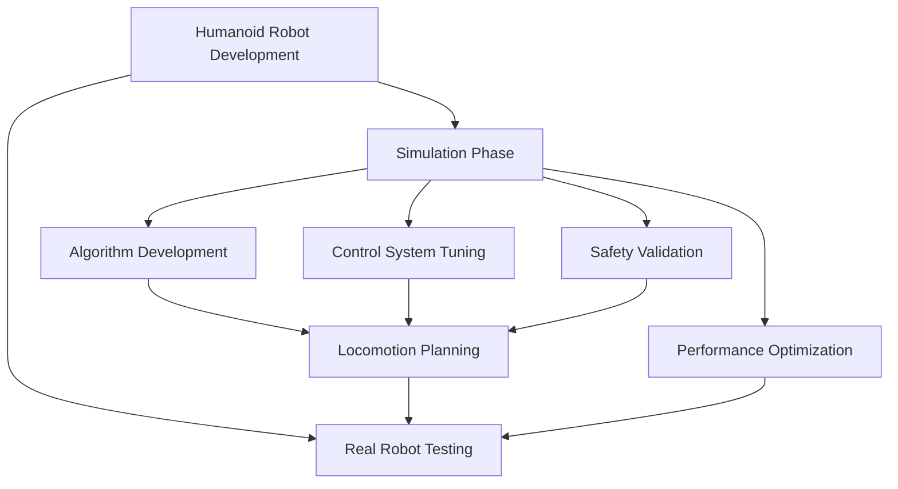
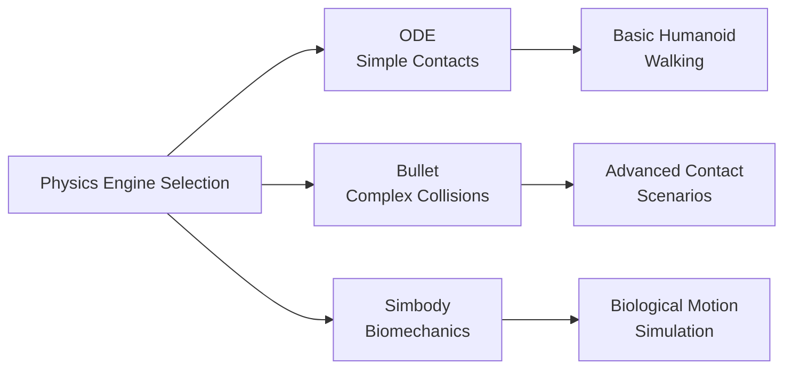

# Introduction to Simulation Environments (Gazebo & Unity)

## Learning Objectives

After completing this module, you will be able to:
- Understand the role of simulation in humanoid robotics development and testing
- Compare physics realism vs. rendering trade-offs in different simulation environments
- Configure Gazebo for humanoid robot simulation with realistic physics and sensors
- Integrate Unity for HRI (Human-Robot Interaction) visualization
- Implement sensor noise modeling and realistic sensor simulation
- Optimize simulation performance for complex humanoid models

## Prerequisites

To get the most out of this module, you should have:
- Completion of Module 1 (ROS 2 fundamentals)
- Basic understanding of physics concepts (mass, inertia, friction)
- Familiarity with 3D coordinate systems and transformations
- Understanding of robot sensors (IMU, cameras, LIDAR, force/torque)

## Why Simulation is Critical for Humanoid Robotics

Simulation plays a crucial role in humanoid robotics development, offering a safe and cost-effective environment for testing complex locomotion algorithms, control systems, and human-robot interaction scenarios. Unlike simpler wheeled robots, humanoid robots face unique challenges in simulation due to their complex kinematics, multiple degrees of freedom, and the need for stable bipedal locomotion.

For humanoid robots, simulation environments must accurately model:
- Complex contact dynamics (foot-ground interactions)
- Balance and stability during walking
- Multi-body dynamics with numerous joints
- Sensor noise and uncertainty
- Environmental interactions

## Simulation vs. Real-World Differences and Limitations

While simulation is invaluable for humanoid robotics, it's important to understand its limitations:

1. **The Reality Gap**: Simulated physics, though sophisticated, cannot perfectly replicate real-world complexities
2. **Sensor Modeling**: Simulated sensors have idealized characteristics compared to noisy real sensors
3. **Contact Modeling**: Complex contact mechanics between feet and ground are difficult to model accurately
4. **Latency and Timing**: Real-time constraints in simulation may not match actual hardware performance

Understanding these limitations is crucial for developing robust humanoid systems that can transition successfully from simulation to reality.

## Types of Simulation for Humanoid Robotics

### Kinematic Simulation
- Focuses on motion and positioning without considering forces
- Useful for trajectory planning and basic motion validation
- Limited for humanoid locomotion due to lack of contact dynamics

### Dynamic Simulation
- Incorporates forces, torques, and physical interactions
- Essential for humanoid balance and locomotion
- Requires accurate mass, inertia, and friction parameters

### Sensor Simulation
- Models realistic sensor data with noise and limitations
- Critical for testing perception algorithms
- Includes camera, IMU, force/torque, and other sensor modalities

### Visual Simulation
- Focuses on realistic rendering for perception training
- Important for vision-based control systems
- Used for synthetic data generation

## Physics Engines Comparison (ODE, Bullet, Simbody)

Different physics engines offer varying capabilities for humanoid robotics:

### ODE (Open Dynamics Engine)
- Traditional choice for robotics simulation
- Good for basic contact dynamics
- Limited support for complex geometries

### Bullet Physics
- Modern physics engine with good performance
- Excellent collision detection capabilities
- Well-suited for humanoid contact-rich scenarios

### Simbody
- Biomechanics-focused physics engine
- Accurate for biological systems
- Less common in robotics but excellent for human-like motion

## Key Concepts Summary

This module will guide you through the critical aspects of simulation environments for humanoid robotics, from basic Gazebo setup to advanced Unity integration for human-robot interaction. You'll learn to create realistic simulation environments that bridge the gap between algorithm development and real-world deployment.

In the next section, we'll explore Gazebo fundamentals and how to configure it for humanoid robot simulation.