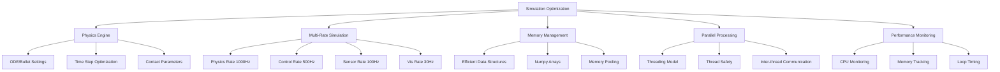

# Optimization and Best Practices for Simulation Environments

## Introduction to Simulation Optimization

Optimizing simulation environments for humanoid robotics is critical due to the computational complexity of multi-body dynamics, contact physics, and sensor simulation. Unlike simpler robotic platforms, humanoid robots require real-time performance for interactive development and testing while maintaining sufficient fidelity for meaningful results.

The optimization challenges in humanoid simulation include:
- **High-degree-of-freedom systems**: 20+ joints requiring complex kinematics
- **Contact-rich environments**: Frequent foot-ground interactions
- **Multi-sensor simulation**: IMU, cameras, LIDAR, force/torque sensors
- **Real-time constraints**: Control loops requiring 100Hz+ update rates

## Performance Optimization Strategies

### Physics Engine Optimization

Optimizing the underlying physics engine is fundamental to achieving good performance in humanoid simulation:

```bash
# Optimized Gazebo physics configuration for humanoid simulation
# physics_optimized.sdf or in launch file
<physics type="ode">
  <max_step_size>0.002</max_step_size>  <!-- 500Hz simulation -->
  <real_time_factor>1.0</real_time_factor>
  <real_time_update_rate>500</real_time_update_rate>
  <ode>
    <solver>
      <type>quick</type>
      <iters>100</iters>  <!-- Balance stability vs. performance -->
      <sor>1.3</sor>
    </solver>
    <constraints>
      <cfm>0.00001</cfm>  <!-- Constraint Force Mixing -->
      <erp>0.1</erp>      <!-- Error Reduction Parameter -->
      <contact_max_correcting_vel>10.0</contact_max_correcting_vel>
      <contact_surface_layer>0.002</contact_surface_layer>
    </constraints>
  </ode>
</physics>
```

### Multi-Rate Simulation

Different components of humanoid simulation have different computational requirements:

```python
#!/usr/bin/env python3
# multi_rate_simulator.py
import rospy
import numpy as np
from std_msgs.msg import Float64
from sensor_msgs.msg import JointState, Imu
from geometry_msgs.msg import WrenchStamped

class MultiRateSimulator:
    def __init__(self):
        rospy.init_node('multi_rate_simulator')

        # Timing parameters
        self.physics_rate = 1000  # Hz - High frequency for stable physics
        self.control_rate = 500   # Hz - High frequency for control
        self.sensor_rate = 100    # Hz - Standard sensor rates
        self.visualization_rate = 30  # Hz - Visualization updates

        # Robot state
        self.joint_positions = {}
        self.joint_velocities = {}
        self.joint_efforts = {}

        # Rate controllers
        self.physics_timer = rospy.Timer(
            rospy.Duration(1.0/self.physics_rate),
            self.physics_update
        )
        self.control_timer = rospy.Timer(
            rospy.Duration(1.0/self.control_rate),
            self.control_update
        )
        self.sensor_timer = rospy.Timer(
            rospy.Duration(1.0/self.sensor_rate),
            self.sensor_update
        )
        self.visualization_timer = rospy.Timer(
            rospy.Duration(1.0/self.visualization_rate),
            self.visualization_update
        )

        # Publishers for different rates
        self.joint_state_pub = rospy.Publisher('/joint_states', JointState, queue_size=10)
        self.imu_pub = rospy.Publisher('/imu/data', Imu, queue_size=10)

        rospy.loginfo(f"Multi-rate simulator initialized: "
                     f"Physics: {self.physics_rate}Hz, "
                     f"Control: {self.control_rate}Hz, "
                     f"Sensor: {self.sensor_rate}Hz, "
                     f"Vis: {self.visualization_rate}Hz")

    def physics_update(self, event):
        """
        High-frequency physics updates for stable simulation
        Runs at physics_rate (1000Hz)
        """
        # Update joint positions based on physics simulation
        # This would interface with Gazebo's physics engine in real implementation
        for joint_name in self.joint_positions.keys():
            # Simple physics integration (in real implementation, this comes from Gazebo)
            if joint_name in self.joint_velocities:
                self.joint_positions[joint_name] += self.joint_velocities[joint_name] * (1.0/self.physics_rate)

    def control_update(self, event):
        """
        Control updates at moderate frequency
        Runs at control_rate (500Hz)
        """
        # Process control algorithms
        self.balance_control()
        self.walk_pattern_generation()

    def sensor_update(self, event):
        """
        Sensor simulation at standard frequency
        Runs at sensor_rate (100Hz)
        """
        # Update sensor readings
        self.update_imu_simulation()
        self.update_force_torque_sensors()

        # Publish sensor data
        self.publish_joint_states()
        self.publish_imu_data()

    def visualization_update(self, event):
        """
        Visualization updates at lower frequency
        Runs at visualization_rate (30Hz)
        """
        # This would update visualization in real implementation
        pass

    def balance_control(self):
        """Balance control algorithm running at control rate"""
        # Implement balance control logic
        # This runs at 500Hz for responsive balance
        pass

    def walk_pattern_generation(self):
        """Walking pattern generation at control rate"""
        # Generate walking patterns
        # This runs at 500Hz for smooth motion
        pass

    def update_imu_simulation(self):
        """Update IMU sensor simulation at sensor rate"""
        # Simulate IMU readings with appropriate noise
        pass

    def update_force_torque_sensors(self):
        """Update force/torque sensor simulation"""
        # Simulate force/torque readings
        pass

    def publish_joint_states(self):
        """Publish joint state messages"""
        msg = JointState()
        msg.header.stamp = rospy.Time.now()
        msg.name = list(self.joint_positions.keys())
        msg.position = list(self.joint_positions.values())
        msg.velocity = list(self.joint_velocities.values())
        msg.effort = list(self.joint_efforts.values())
        self.joint_state_pub.publish(msg)

    def publish_imu_data(self):
        """Publish IMU data"""
        # Publish IMU message with simulated data
        pass

def main():
    simulator = MultiRateSimulator()

    try:
        rospy.spin()
    except KeyboardInterrupt:
        rospy.loginfo("Multi-rate simulator shutting down")

if __name__ == '__main__':
    main()
```

### Model Simplification Techniques

For performance optimization, selectively simplify models where appropriate:

```xml
<!-- Simplified collision geometry for performance -->
<link name="simplified_link">
  <!-- Use simpler collision geometry for physics -->
  <collision name="collision_simplified">
    <geometry>
      <!-- Use box approximation instead of complex mesh -->
      <box>
        <size>0.1 0.05 0.2</size>
      </box>
    </geometry>
  </collision>

  <!-- Keep detailed visual geometry for rendering -->
  <visual name="visual_detailed">
    <geometry>
      <mesh filename="meshes/detailed_link.dae"/>
    </geometry>
  </visual>
</link>
```

## Memory and Resource Management

### Efficient Data Structures

Optimize data structures for real-time performance:

```python
#!/usr/bin/env python3
# efficient_data_structures.py
import numpy as np
import rospy
from collections import deque
import time

class EfficientSimulationData:
    def __init__(self, max_history=1000):
        # Use numpy arrays for numerical computations
        self.joint_positions = np.zeros(28, dtype=np.float64)  # 28 DOF humanoid
        self.joint_velocities = np.zeros(28, dtype=np.float64)
        self.joint_efforts = np.zeros(28, dtype=np.float64)

        # Use deque for efficient history storage
        self.position_history = deque(maxlen=max_history)
        self.velocity_history = deque(maxlen=max_history)

        # Pre-allocate arrays to avoid memory allocation during simulation
        self.temp_array = np.zeros(28, dtype=np.float64)
        self.temp_matrix = np.eye(28, dtype=np.float64)

    def update_joint_states(self, new_positions, new_velocities, new_efforts):
        """Efficiently update joint states using numpy operations"""
        # Use numpy's vectorized operations for efficiency
        np.copyto(self.joint_positions, new_positions)
        np.copyto(self.joint_velocities, new_velocities)
        np.copyto(self.joint_efforts, new_efforts)

        # Store history efficiently
        self.position_history.append(np.copy(self.joint_positions))
        self.velocity_history.append(np.copy(self.joint_velocities))

    def calculate_kinematics_batch(self, joint_angles_batch):
        """
        Calculate kinematics for multiple configurations efficiently
        """
        # Pre-allocate result array
        results = np.zeros((len(joint_angles_batch), 6))  # 6DOF end-effector pose

        for i, angles in enumerate(joint_angles_batch):
            # Vectorized kinematics calculation
            results[i] = self.calculate_single_kinematics(angles)

        return results

    def calculate_single_kinematics(self, joint_angles):
        """Calculate kinematics for a single configuration"""
        # Simplified kinematics calculation
        # In real implementation, this would use DH parameters or geometric methods
        return np.array([0.0, 0.0, 0.0, 0.0, 0.0, 0.0])  # [x, y, z, roll, pitch, yaw]

    def get_recent_states(self, num_states=10):
        """Get recent states efficiently from history"""
        recent_positions = np.array(list(self.position_history)[-num_states:])
        recent_velocities = np.array(list(self.velocity_history)[-num_states:])
        return recent_positions, recent_velocities

class SimulationMemoryManager:
    def __init__(self):
        self.data_buffers = {}
        self.max_buffer_size = 10000  # Maximum buffer size per type

    def register_buffer(self, buffer_name, shape, dtype=np.float64):
        """Register a data buffer for efficient access"""
        if buffer_name not in self.data_buffers:
            self.data_buffers[buffer_name] = np.zeros(shape, dtype=dtype)
        return self.data_buffers[buffer_name]

    def get_buffer(self, buffer_name):
        """Get a registered buffer"""
        return self.data_buffers.get(buffer_name)

    def clear_unused_buffers(self):
        """Clear buffers that haven't been used recently"""
        # Implementation would track buffer usage and clear unused ones
        pass

def performance_test():
    """Test performance of different data structures"""
    rospy.init_node('performance_test')

    # Test with efficient data structures
    start_time = time.time()
    efficient_data = EfficientSimulationData()

    for i in range(1000):
        # Simulate joint state updates
        new_pos = np.random.random(28)
        new_vel = np.random.random(28)
        new_eff = np.random.random(28)
        efficient_data.update_joint_states(new_pos, new_vel, new_eff)

    efficient_time = time.time() - start_time

    rospy.loginfo(f"Efficient data structures: {efficient_time:.4f}s for 1000 updates")

if __name__ == '__main__':
    performance_test()
```

### GPU Acceleration

Leverage GPU acceleration for computationally intensive tasks:

```bash
# CUDA optimization flags for physics simulation
export CUDA_VISIBLE_DEVICES=0
export GAZEBO_CUDA_ENABLED=1

# Physics engine with CUDA acceleration
<physics type="bullet">
  <max_step_size>0.001</max_step_size>
  <real_time_factor>1.0</real_time_factor>
  <real_time_update_rate>1000</real_time_update_rate>
  <bullet>
    <solver>
      <type>PGS</type>
      <max_iterations>100</max_iterations>
      <tau>0.1</tau>
      <damping>1.0</damping>
    </solver>
    <constraints>
      <contact_surface_layer>0.002</contact_surface_layer>
      <contact_max_correcting_vel>100.0</contact_max_correcting_vel>
    </constraints>
  </bullet>
</physics>
```

## Parallel Processing and Threading

### Multi-threaded Simulation Architecture

Implement parallel processing for different simulation components:

```python
#!/usr/bin/env python3
# parallel_simulation.py
import rospy
import threading
import queue
import numpy as np
from std_msgs.msg import Float64
import time

class ParallelSimulationManager:
    def __init__(self):
        rospy.init_node('parallel_simulation_manager')

        # Initialize thread-safe queues for inter-thread communication
        self.physics_queue = queue.Queue(maxsize=10)
        self.control_queue = queue.Queue(maxsize=10)
        self.sensor_queue = queue.Queue(maxsize=10)
        self.visualization_queue = queue.Queue(maxsize=10)

        # Shared state (use threading.Lock for safety)
        self.state_lock = threading.Lock()
        self.shared_robot_state = {
            'joint_positions': np.zeros(28),
            'joint_velocities': np.zeros(28),
            'joint_efforts': np.zeros(28),
            'imu_data': np.zeros(6),  # [r, p, y, wx, wy, wz]
            'timestamp': rospy.Time.now()
        }

        # Start parallel threads
        self.physics_thread = threading.Thread(target=self.physics_worker, daemon=True)
        self.control_thread = threading.Thread(target=self.control_worker, daemon=True)
        self.sensor_thread = threading.Thread(target=self.sensor_worker, daemon=True)
        self.visualization_thread = threading.Thread(target=self.visualization_worker, daemon=True)

        # Control flags
        self.running = True

        # Start all threads
        self.physics_thread.start()
        self.control_thread.start()
        self.sensor_thread.start()
        self.visualization_thread.start()

        rospy.loginfo("Parallel simulation manager initialized with 4 worker threads")

    def physics_worker(self):
        """Physics simulation thread"""
        rate = rospy.Rate(1000)  # 1000 Hz physics
        while not rospy.is_shutdown() and self.running:
            try:
                # Perform physics calculations
                self.update_physics()

                # Update shared state
                with self.state_lock:
                    self.shared_robot_state['timestamp'] = rospy.Time.now()

                rate.sleep()
            except Exception as e:
                rospy.logerr(f"Physics thread error: {e}")

    def control_worker(self):
        """Control system thread"""
        rate = rospy.Rate(500)  # 500 Hz control
        while not rospy.is_shutdown() and self.running:
            try:
                # Process control algorithms
                self.process_control_algorithms()

                rate.sleep()
            except Exception as e:
                rospy.logerr(f"Control thread error: {e}")

    def sensor_worker(self):
        """Sensor simulation thread"""
        rate = rospy.Rate(100)  # 100 Hz sensor simulation
        while not rospy.is_shutdown() and self.running:
            try:
                # Update sensor simulations
                self.update_sensor_simulations()

                rate.sleep()
            except Exception as e:
                rospy.logerr(f"Sensor thread error: {e}")

    def visualization_worker(self):
        """Visualization thread"""
        rate = rospy.Rate(30)  # 30 Hz visualization
        while not rospy.is_shutdown() and self.running:
            try:
                # Update visualization data
                self.update_visualization_data()

                rate.sleep()
            except Exception as e:
                rospy.logerr(f"Visualization thread error: {e}")

    def update_physics(self):
        """Update physics simulation"""
        with self.state_lock:
            # Simple physics integration
            dt = 0.001  # 1000 Hz
            self.shared_robot_state['joint_positions'] += \
                self.shared_robot_state['joint_velocities'] * dt
            # Add more sophisticated physics here

    def process_control_algorithms(self):
        """Process control algorithms"""
        with self.state_lock:
            current_state = self.shared_robot_state.copy()

        # Implement control algorithms
        control_commands = self.calculate_control_commands(current_state)

        with self.state_lock:
            # Apply control commands
            self.shared_robot_state['joint_efforts'] = control_commands

    def update_sensor_simulations(self):
        """Update sensor simulations"""
        with self.state_lock:
            # Simulate sensor readings based on current state
            self.shared_robot_state['imu_data'] = self.simulate_imu_data(
                self.shared_robot_state['joint_positions'],
                self.shared_robot_state['joint_velocities']
            )

    def update_visualization_data(self):
        """Update visualization data"""
        # This would send data to visualization system
        pass

    def calculate_control_commands(self, state):
        """Calculate control commands based on current state"""
        # Implement control law (e.g., PD controller, MPC, etc.)
        return np.zeros(28)  # Return control commands

    def simulate_imu_data(self, positions, velocities):
        """Simulate IMU data"""
        # Generate simulated IMU readings with noise
        return np.random.normal(0, 0.01, 6)  # [r, p, y, wx, wy, wz] with noise

    def get_robot_state(self):
        """Thread-safe access to robot state"""
        with self.state_lock:
            return self.shared_robot_state.copy()

    def shutdown(self):
        """Shutdown all threads"""
        self.running = False
        rospy.loginfo("Parallel simulation manager shutting down")

def main():
    sim_manager = ParallelSimulationManager()

    try:
        rospy.spin()
    except KeyboardInterrupt:
        sim_manager.shutdown()
        rospy.loginfo("Parallel simulation manager terminated")

if __name__ == '__main__':
    main()
```

## Real-time Performance Monitoring

### Performance Profiling and Monitoring

Monitor performance to identify bottlenecks and optimize accordingly:

```python
#!/usr/bin/env python3
# performance_monitor.py
import rospy
import time
from std_msgs.msg import Float64
from sensor_msgs.msg import JointState
import psutil
import matplotlib.pyplot as plt
from collections import deque

class PerformanceMonitor:
    def __init__(self):
        rospy.init_node('performance_monitor')

        # Performance tracking
        self.cpu_percentages = deque(maxlen=1000)
        self.memory_percentages = deque(maxlen=1000)
        self.loop_times = deque(maxlen=1000)
        self.update_rates = deque(maxlen=1000)

        # Publishers for performance data
        self.cpu_pub = rospy.Publisher('/performance/cpu_percent', Float64, queue_size=10)
        self.memory_pub = rospy.Publisher('/performance/memory_percent', Float64, queue_size=10)
        self.loop_time_pub = rospy.Publisher('/performance/loop_time', Float64, queue_size=10)

        # Timing
        self.last_update_time = time.time()
        self.update_interval = 0.1  # 10 Hz monitoring

        # Performance thresholds
        self.cpu_threshold = 80.0  # Percent
        self.memory_threshold = 85.0  # Percent
        self.loop_time_threshold = 0.01  # 10ms

        # Timer for monitoring
        rospy.Timer(rospy.Duration(self.update_interval), self.monitor_performance)

        rospy.loginfo("Performance monitor initialized")

    def monitor_performance(self, event):
        """Monitor system performance"""
        current_time = time.time()

        # Calculate loop time
        loop_time = current_time - self.last_update_time
        self.last_update_time = current_time

        # Get system metrics
        cpu_percent = psutil.cpu_percent()
        memory_percent = psutil.virtual_memory().percent

        # Store metrics
        self.cpu_percentages.append(cpu_percent)
        self.memory_percentages.append(memory_percent)
        self.loop_times.append(loop_time)

        # Calculate actual update rate
        if loop_time > 0:
            actual_rate = 1.0 / loop_time
        else:
            actual_rate = 0.0
        self.update_rates.append(actual_rate)

        # Publish metrics
        self.cpu_pub.publish(Float64(cpu_percent))
        self.memory_pub.publish(Float64(memory_percent))
        self.loop_time_pub.publish(Float64(loop_time))

        # Check for performance issues
        self.check_performance_issues(cpu_percent, memory_percent, loop_time)

    def check_performance_issues(self, cpu_percent, memory_percent, loop_time):
        """Check for performance issues and log warnings"""
        issues = []

        if cpu_percent > self.cpu_threshold:
            issues.append(f"High CPU usage: {cpu_percent:.1f}% > {self.cpu_threshold}%")

        if memory_percent > self.memory_threshold:
            issues.append(f"High memory usage: {memory_percent:.1f}% > {self.memory_threshold}%")

        if loop_time > self.loop_time_threshold:
            issues.append(f"Slow loop time: {loop_time*1000:.1f}ms > {self.loop_time_threshold*1000:.1f}ms")

        if issues:
            rospy.logwarn("Performance issues detected: " + "; ".join(issues))

    def get_performance_summary(self):
        """Get summary of current performance"""
        if len(self.cpu_percentages) == 0:
            return "No performance data available"

        avg_cpu = sum(self.cpu_percentages) / len(self.cpu_percentages)
        avg_memory = sum(self.memory_percentages) / len(self.memory_percentages)
        avg_loop_time = sum(self.loop_times) / len(self.loop_times)
        avg_rate = sum(self.update_rates) / len(self.update_rates) if self.update_rates else 0

        return (f"Performance Summary:\n"
                f"  CPU: {avg_cpu:.1f}% (max: {max(self.cpu_percentages):.1f}%)\n"
                f"  Memory: {avg_memory:.1f}% (max: {max(self.memory_percentages):.1f}%)\n"
                f"  Loop time: {avg_loop_time*1000:.1f}ms\n"
                f"  Rate: {avg_rate:.1f}Hz")

    def plot_performance_history(self):
        """Plot performance history (for analysis)"""
        if len(self.cpu_percentages) < 10:
            rospy.loginfo("Not enough data for performance plot")
            return

        # Create plot (this would typically be saved to file)
        fig, (ax1, ax2, ax3) = plt.subplots(3, 1, figsize=(10, 8))

        time_axis = range(len(self.cpu_percentages))

        ax1.plot(time_axis, list(self.cpu_percentages), 'b-', label='CPU %')
        ax1.axhline(y=self.cpu_threshold, color='r', linestyle='--', label=f'Threshold ({self.cpu_threshold}%)')
        ax1.set_ylabel('CPU Usage (%)')
        ax1.set_title('CPU Usage Over Time')
        ax1.legend()
        ax1.grid(True)

        ax2.plot(time_axis, list(self.memory_percentages), 'g-', label='Memory %')
        ax2.axhline(y=self.memory_threshold, color='r', linestyle='--', label=f'Threshold ({self.memory_threshold}%)')
        ax2.set_ylabel('Memory Usage (%)')
        ax2.set_title('Memory Usage Over Time')
        ax2.legend()
        ax2.grid(True)

        ax3.plot(time_axis, [t*1000 for t in self.loop_times], 'm-', label='Loop Time (ms)')
        ax3.axhline(y=self.loop_time_threshold*1000, color='r', linestyle='--', label=f'Threshold ({self.loop_time_threshold*1000:.1f}ms)')
        ax3.set_xlabel('Time (samples)')
        ax3.set_ylabel('Loop Time (ms)')
        ax3.set_title('Loop Time Over Time')
        ax3.legend()
        ax3.grid(True)

        plt.tight_layout()
        plt.savefig('/tmp/simulation_performance.png')
        rospy.loginfo("Performance plot saved to /tmp/simulation_performance.png")

class OptimizedSimulationNode:
    def __init__(self):
        rospy.init_node('optimized_simulation_node')

        # Initialize performance monitor
        self.monitor = PerformanceMonitor()

        # Simulation parameters
        self.desired_rate = 1000  # Hz
        self.rate = rospy.Rate(self.desired_rate)

        # Publishers
        self.joint_state_pub = rospy.Publisher('/joint_states', JointState, queue_size=10)

        rospy.loginfo(f"Optimized simulation node initialized at {self.desired_rate}Hz")

    def run(self):
        """Main simulation loop with performance monitoring"""
        while not rospy.is_shutdown():
            loop_start = time.time()

            # Main simulation work
            self.simulation_step()

            # Monitor performance
            loop_end = time.time()
            loop_time = loop_end - loop_start

            # Maintain timing
            self.rate.sleep()

    def simulation_step(self):
        """Single simulation step"""
        # Implement simulation logic here
        # This should be optimized for performance

        # Example: Publish joint states
        msg = JointState()
        msg.header.stamp = rospy.Time.now()
        msg.name = [f'joint_{i}' for i in range(28)]  # 28 DOF humanoid
        msg.position = [0.0] * 28
        msg.velocity = [0.0] * 28
        msg.effort = [0.0] * 28
        self.joint_state_pub.publish(msg)

def main():
    node = OptimizedSimulationNode()

    try:
        node.run()
    except KeyboardInterrupt:
        rospy.loginfo("Performance monitor shutting down")
        node.monitor.plot_performance_history()

if __name__ == '__main__':
    main()
```

## Advanced Optimization Techniques

### Adaptive Time Stepping

Implement adaptive time stepping based on simulation complexity:

```python
#!/usr/bin/env python3
# adaptive_timestep.py
import rospy
import numpy as np
from std_msgs.msg import Float64
import time

class AdaptiveTimestepController:
    def __init__(self):
        rospy.init_node('adaptive_timestep_controller')

        # Adaptive timestep parameters
        self.base_timestep = 0.001  # 1ms base
        self.min_timestep = 0.0001  # 0.1ms minimum
        self.max_timestep = 0.01    # 10ms maximum
        self.error_tolerance = 1e-6  # Error tolerance for timestep adjustment

        # Performance tracking
        self.target_accuracy = 0.95  # 95% accuracy target
        self.current_timestep = self.base_timestep
        self.performance_history = []

        # Publishers
        self.timestep_pub = rospy.Publisher('/simulation/timestep', Float64, queue_size=10)
        self.performance_pub = rospy.Publisher('/simulation/performance', Float64, queue_size=10)

        rospy.loginfo(f"Adaptive timestep controller initialized: "
                     f"base={self.base_timestep*1000}ms, "
                     f"range=[{self.min_timestep*1000}ms, {self.max_timestep*1000}ms]")

    def adjust_timestep(self, simulation_error, computation_time):
        """Adjust timestep based on simulation error and computation time"""
        # Calculate error-based adjustment
        error_factor = 1.0
        if simulation_error > self.error_tolerance:
            # Error too high, decrease timestep
            error_factor = 0.9
        elif simulation_error < self.error_tolerance * 0.1:
            # Error much lower than tolerance, can increase timestep
            error_factor = 1.1

        # Calculate performance-based adjustment
        performance_factor = 1.0
        if computation_time > self.current_timestep * 0.8:  # Using 80% of timestep
            # Computation time approaching timestep limit, decrease
            performance_factor = 0.95
        elif computation_time < self.current_timestep * 0.3:  # Using <30% of timestep
            # Plenty of time available, can increase timestep
            performance_factor = 1.05

        # Combine adjustments
        adjustment = error_factor * performance_factor

        # Apply adjustment with limits
        new_timestep = self.current_timestep * adjustment
        new_timestep = max(self.min_timestep, min(self.max_timestep, new_timestep))

        self.current_timestep = new_timestep

        # Publish current timestep
        self.timestep_pub.publish(Float64(self.current_timestep))

        return self.current_timestep

    def simulate_with_adaptive_timestep(self):
        """Main simulation loop with adaptive timestep"""
        while not rospy.is_shutdown():
            start_time = time.time()

            # Perform simulation step with current timestep
            simulation_error = self.perform_simulation_step(self.current_timestep)

            # Calculate computation time
            computation_time = time.time() - start_time

            # Adjust timestep for next iteration
            new_timestep = self.adjust_timestep(simulation_error, computation_time)

            # Calculate performance metric
            performance_metric = computation_time / new_timestep
            self.performance_pub.publish(Float64(performance_metric))

            # Sleep for remaining time to maintain real-time factor
            sleep_time = max(0, new_timestep - computation_time)
            if sleep_time > 0:
                time.sleep(sleep_time)

    def perform_simulation_step(self, dt):
        """Perform a single simulation step with given timestep"""
        # This would be the actual physics simulation
        # For this example, we'll simulate a simple harmonic oscillator

        # Example: simulate a joint with spring-damper dynamics
        # In real implementation, this would interface with physics engine
        omega = 10.0  # Natural frequency
        zeta = 0.1    # Damping ratio

        # Simple integration (in real implementation, this would be more complex)
        # dx/dt = v
        # dv/dt = -2*zeta*omega*v - omega^2*x
        # This is just an example - real simulation would be much more complex

        # Simulate error based on timestep (smaller timestep = more accurate)
        error = dt * 0.001  # Simplified error model

        return error

def main():
    controller = AdaptiveTimestepController()

    try:
        controller.simulate_with_adaptive_timestep()
    except KeyboardInterrupt:
        rospy.loginfo("Adaptive timestep controller shutting down")

if __name__ == '__main__':
    main()
```

## Best Practices Summary

### Development Best Practices

1. **Profile Before Optimizing**: Always measure performance before making changes
2. **Use Appropriate Data Structures**: Numpy arrays for numerical computation
3. **Minimize Memory Allocation**: Pre-allocate arrays in real-time loops
4. **Parallel Processing**: Separate physics, control, and visualization threads
5. **Adaptive Simulation**: Adjust parameters based on system performance

### Performance Guidelines

- **Physics Rate**: 1000Hz minimum for stable humanoid simulation
- **Control Rate**: 500Hz for responsive control systems
- **Sensor Rate**: Match real sensor specifications (100Hz for IMU, 30Hz for cameras)
- **Visualization Rate**: 30-60Hz for smooth visualization



## Troubleshooting Common Performance Issues

### Memory Leaks and Resource Exhaustion

Common issues and solutions:

- **Growing memory usage**: Check for object accumulation in loops
- **Slowdown over time**: Monitor for increasing computation time
- **Frame drops**: Check visualization complexity and update rates

### Physics Instability

For stable physics simulation:

- **Timestep consistency**: Keep physics timestep constant
- **Constraint parameters**: Tune CFM and ERP values appropriately
- **Mass distribution**: Ensure realistic inertia parameters

:::tip
Always profile your simulation with realistic humanoid models and scenarios. A simulation that runs well with simple models may become unstable with complex humanoid robots due to the increased degrees of freedom and contact interactions.
:::

:::warning
Be cautious when optimizing for performance - ensure that accuracy requirements are still met. In humanoid robotics, simulation accuracy is often more important than raw performance, especially for balance and locomotion algorithms.
:::

## Summary

Optimization of simulation environments for humanoid robotics requires a multi-faceted approach addressing physics engine configuration, parallel processing, memory management, and real-time performance monitoring. By implementing these optimization strategies, developers can achieve the real-time performance necessary for interactive humanoid robot development while maintaining the accuracy required for meaningful simulation results.

In the next section, we'll explore advanced simulation techniques including machine learning integration, advanced sensor modeling, and specialized techniques for humanoid-specific challenges.