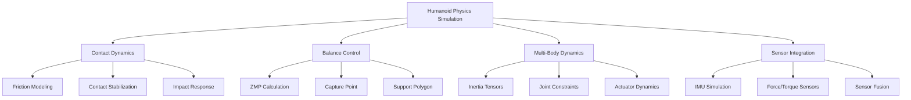

# Physics Simulation for Humanoid Robots

## Introduction to Humanoid-Specific Physics Challenges

Humanoid robots present unique challenges in physics simulation that differ significantly from simpler robotic platforms like wheeled robots. The complex dynamics of bipedal locomotion, multi-body interactions, and the need for stable balance under various conditions require specialized approaches to physics modeling.

Unlike wheeled robots that maintain continuous contact with the ground, humanoid robots experience complex contact dynamics as feet make and break contact with surfaces during walking, running, or other locomotion patterns. This intermittent contact creates challenges in simulation stability and accuracy.

## Contact Dynamics and Foot-Ground Interactions

### Understanding Contact Models

Humanoid locomotion heavily depends on accurate modeling of foot-ground interactions. The contact between a humanoid's feet and the ground surface involves complex physics including:

- **Friction modeling**: Proper friction coefficients are essential for realistic walking patterns
- **Contact patch dynamics**: How the foot contacts the ground affects stability
- **Impact forces**: When feet strike the ground during walking or running
- **Slip and grip characteristics**: Surface properties affect robot stability

```xml
<!-- Example contact parameters for humanoid foot -->
<link name="left_foot">
  <collision name="foot_collision">
    <surface>
      <friction>
        <ode>
          <!-- Higher friction for better grip during walking -->
          <mu>1.2</mu>
          <mu2>1.2</mu2>
          <slip1>0.001</slip1>
          <slip2>0.001</slip2>
        </ode>
        <contact>
          <ode>
            <!-- Stiff contact for stable walking -->
            <kp>1e+7</kp>
            <kd>100</kd>
            <max_vel>100.0</max_vel>
            <min_depth>0.002</min_depth>
          </ode>
        </contact>
      </friction>
    </surface>
  </collision>
</link>
```

### Contact Stabilization Techniques

To maintain stable contact during humanoid locomotion simulation:

1. **Contact stabilization parameters**: Properly tuned kp (spring constant) and kd (damping) values
2. **Contact patch radius**: Smaller values for more precise contact but potentially less stability
3. **Minimum penetration depth**: Prevents numerical instabilities while maintaining realistic contact

## Balance and Stability Simulation

### Center of Mass (CoM) Dynamics

Humanoid balance simulation requires accurate modeling of the center of mass and its relationship to the Zero Moment Point (ZMP) and Center of Pressure (CoP):

- **ZMP (Zero Moment Point)**: Critical for stable walking pattern generation
- **CoM tracking**: Maintaining the center of mass within stable regions
- **Capture point analysis**: Predicting where to place feet for stability

```python
#!/usr/bin/env python3
# balance_controller.py
import numpy as np
import rospy
from geometry_msgs.msg import Point, Vector3
from std_msgs.msg import Float64

class HumanoidBalanceController:
    def __init__(self):
        rospy.init_node('balance_controller')

        # Balance control parameters
        self.com_position = np.array([0.0, 0.0, 0.85])  # Center of mass
        self.com_velocity = np.array([0.0, 0.0, 0.0])
        self.com_acceleration = np.array([0.0, 0.0, 0.0])

        # ZMP calculation parameters
        self.gravity = 9.81
        self.com_height = 0.85

        # Publishers for balance control
        self.zmp_pub = rospy.Publisher('/balance/zmp', Point, queue_size=10)
        self.com_pub = rospy.Publisher('/balance/com', Point, queue_size=10)

        # Balance control timer
        self.balance_timer = rospy.Timer(rospy.Duration(0.01), self.balance_control_loop)

        rospy.loginfo("Balance controller initialized")

    def calculate_zmp(self, com_pos, com_acc):
        """
        Calculate Zero Moment Point based on center of mass position and acceleration
        ZMP_x = CoM_x - (g / CoM_z_dd) * (CoM_z - z_ref)
        """
        if abs(com_acc[2]) > 0.1:  # Avoid division by zero
            zmp_x = com_pos[0] - (self.gravity / com_acc[2]) * (com_pos[2] - self.com_height)
            zmp_y = com_pos[1] - (self.gravity / com_acc[2]) * (com_pos[2] - self.com_height)
        else:
            zmp_x = com_pos[0]
            zmp_y = com_pos[1]

        return np.array([zmp_x, zmp_y, 0.0])

    def calculate_capture_point(self, com_pos, com_vel):
        """
        Calculate capture point for balance control
        Capture Point = CoM + sqrt(h/g) * CoM_velocity
        """
        omega = np.sqrt(self.gravity / self.com_height)
        capture_point_x = com_pos[0] + (1.0 / omega) * com_vel[0]
        capture_point_y = com_pos[1] + (1.0 / omega) * com_vel[1]

        return np.array([capture_point_x, capture_point_y, 0.0])

    def balance_control_loop(self, event):
        """
        Main balance control loop running at 100 Hz
        """
        # Get current CoM state (in real implementation, this would come from state estimator)
        current_com = self.com_position
        current_com_vel = self.com_velocity
        current_com_acc = self.com_acceleration

        # Calculate ZMP
        zmp = self.calculate_zmp(current_com, current_com_acc)

        # Calculate capture point
        capture_point = self.calculate_capture_point(current_com, current_com_vel)

        # Publish balance information
        zmp_msg = Point()
        zmp_msg.x = zmp[0]
        zmp_msg.y = zmp[1]
        zmp_msg.z = zmp[2]
        self.zmp_pub.publish(zmp_msg)

        com_msg = Point()
        com_msg.x = current_com[0]
        com_msg.y = current_com[1]
        com_msg.z = current_com[2]
        self.com_pub.publish(com_msg)

        # Implement balance correction if ZMP is outside support polygon
        self.correct_balance(zmp, capture_point)

    def correct_balance(self, zmp, capture_point):
        """
        Implement balance correction strategies
        """
        # Check if ZMP is within support polygon (simplified for single foot stance)
        support_polygon_margin = 0.05  # 5cm safety margin

        # For single foot stance, check if ZMP is within foot bounds
        foot_length = 0.15  # 15cm
        foot_width = 0.07   # 7cm

        if (abs(zmp[0]) > foot_length/2 + support_polygon_margin or
            abs(zmp[1]) > foot_width/2 + support_polygon_margin):
            rospy.logwarn("ZMP outside support polygon - balance correction needed!")
            # In real implementation, this would trigger balance recovery actions
            # such as stepping, COM adjustment, or ankle torques

def main():
    controller = HumanoidBalanceController()

    try:
        rospy.spin()
    except KeyboardInterrupt:
        rospy.loginfo("Balance controller shutting down")

if __name__ == '__main__':
    main()
```

### Support Polygon and Stability Regions

The support polygon defines the area where the ZMP must remain for stable locomotion:

- **Single support**: When one foot is on the ground
- **Double support**: When both feet are on the ground during step transitions
- **Stability margins**: Safety margins around the support polygon to account for disturbances

## Multi-Body Dynamics and Joint Constraints

### Complex Kinematic Chains

Humanoid robots typically have 20+ degrees of freedom arranged in complex kinematic chains. Proper simulation requires:

- **Accurate inertia tensors**: Proper mass distribution for each link
- **Joint limits**: Realistic constraints to prevent damage
- **Joint friction**: Modeling of real-world joint friction characteristics
- **Actuator dynamics**: Simulation of motor response and limitations

```xml
<!-- Example of complex humanoid joint with proper constraints -->
<joint name="left_knee" type="revolute">
  <parent>left_thigh</parent>
  <child>left_shin</child>
  <axis>
    <xyz>0 1 0</xyz>
    <limit>
      <lower>-0.05</lower>  <!-- Slight flexion allowed -->
      <upper>2.5</upper>    <!-- Maximum flexion ~143 degrees -->
      <effort>300</effort>  <!-- Maximum torque (Nm) -->
      <velocity>5.0</velocity> <!-- Maximum velocity (rad/s) -->
    </limit>
    <dynamics>
      <damping>10.0</damping>
      <friction>5.0</friction>
    </dynamics>
  </axis>
  <safety_controller>
    <soft_lower_limit>-0.02</soft_lower_limit>
    <soft_upper_limit>2.4</soft_upper_limit>
    <k_position>100</k_position>
    <k_velocity>10</k_velocity>
  </safety_controller>
</joint>
```

### Whole-Body Dynamics

For stable humanoid simulation, the entire body's dynamics must be considered:

- **Momentum conservation**: Linear and angular momentum of the complete system
- **Force propagation**: How forces at one joint affect other parts of the body
- **Balance control integration**: Coordinated control of all joints for stability

## Physics Engine Considerations for Humanoid Simulation

### Choosing Appropriate Time Steps

Humanoid simulation requires careful selection of physics simulation parameters:

- **Simulation time step**: Typically 1ms (1000 Hz) for stable contact simulation
- **Control loop frequency**: Often 100-500 Hz for responsive control
- **Integration method**: Implicit methods for better stability with stiff contacts

### Numerical Stability in Contact Simulation

Humanoid robots require special attention to numerical stability due to:

- **Stiff contact problems**: High spring constants for realistic foot contact
- **Multiple simultaneous contacts**: Both feet during double support phase
- **Fast dynamics**: Quick reactions needed for balance recovery

```bash
# Gazebo simulation parameters for humanoid stability
# In launch file or world configuration
<physics type="ode">
  <max_step_size>0.001</max_step_size>  <!-- 1ms time step -->
  <real_time_factor>1.0</real_time_factor>
  <real_time_update_rate>1000</real_time_update_rate>
  <ode>
    <solver>
      <type>quick</type>
      <iters>100</iters>  <!-- More iterations for stability -->
      <sor>1.3</sor>
    </solver>
    <constraints>
      <cfm>0.000001</cfm>  <!-- Constraint Force Mixing -->
      <erp>0.2</erp>      <!-- Error Reduction Parameter -->
      <contact_max_correcting_vel>100.0</contact_max_correcting_vel>
      <contact_surface_layer>0.001</contact_surface_layer>
    </constraints>
  </ode>
</physics>
```

## Sensor Integration and Physics Feedback

### IMU Simulation for Balance

Inertial Measurement Units (IMUs) provide critical feedback for humanoid balance:

- **Accelerometer modeling**: Including vibration and noise characteristics
- **Gyroscope simulation**: Angular rate measurements with drift
- **Orientation estimation**: Sensor fusion for body orientation

### Force/Torque Sensor Simulation

Foot force sensors are crucial for humanoid locomotion:

```xml
<!-- Force/torque sensor in humanoid foot -->
<gazebo reference="left_foot">
  <sensor name="left_foot_force_torque" type="force_torque">
    <always_on>true</always_on>
    <update_rate>500</update_rate>
    <force_torque>
      <frame>child</frame>
      <measure_direction>child_to_parent</measure_direction>
    </force_torque>
    <plugin name="ft_sensor_plugin" filename="libgazebo_ros_ft_sensor.so">
      <topicName>left_foot/force_torque</topicName>
      <jointName>left_ankle_joint</jointName>
    </plugin>
  </sensor>
</gazebo>
```

## Optimization Strategies for Humanoid Physics

### Performance Considerations

Simulating complex humanoid robots efficiently requires:

- **Selective simplification**: Simplified models for distant or less critical parts
- **Multi-rate simulation**: Different update rates for different subsystems
- **Caching and precomputation**: For repeated calculations in control loops

### Accuracy vs. Performance Trade-offs

Finding the right balance between simulation accuracy and performance:

- **Contact modeling fidelity**: Higher fidelity vs. simulation speed
- **Sensor simulation detail**: Realistic noise models vs. computational cost
- **Control update frequency**: Responsive control vs. computational load



## Best Practices for Humanoid Physics Simulation

### Validation and Verification

To ensure realistic humanoid physics simulation:

1. **Compare with real robot data**: Validate simulation against real-world measurements
2. **Energy conservation checks**: Ensure energy is conserved appropriately
3. **Stability boundary testing**: Verify behavior at stability limits
4. **Parameter sensitivity analysis**: Understand how parameter changes affect behavior

### Common Pitfalls to Avoid

- **Overly stiff contacts**: Can cause simulation instability
- **Insufficient damping**: Leads to oscillatory behavior
- **Inconsistent units**: Always verify units across all parameters
- **Ignoring sensor noise**: Real sensors have noise that affects control

:::tip
Start with simple planar walking simulations before attempting 3D locomotion. The complexity of 3D humanoid dynamics can quickly become overwhelming without proper validation of 2D models first.
:::

:::warning
Humanoid simulation is computationally intensive. Ensure your system has adequate resources (multi-core CPU, dedicated GPU, 16GB+ RAM) for real-time simulation of complex humanoid models.
:::

## Summary

Physics simulation for humanoid robots requires careful attention to contact dynamics, balance control, and multi-body interactions. The intermittent nature of foot-ground contact, combined with the need for stable balance during locomotion, creates unique challenges not found in other robotic platforms. Proper modeling of friction, contact forces, and whole-body dynamics is essential for realistic humanoid simulation that can bridge the gap between simulation and reality.

In the next section, we'll explore sensor simulation in detail, focusing on how to accurately model the various sensors used in humanoid robotics for perception and control.