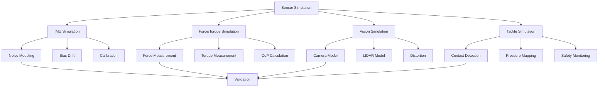

# Sensor Simulation for Humanoid Robots

## Introduction to Sensor Simulation in Humanoid Robotics

Sensor simulation is a critical component of humanoid robotics development, as these complex systems rely on multiple sensor modalities for perception, balance, and control. Unlike simpler robotic platforms, humanoid robots require sophisticated sensor fusion to maintain balance, navigate environments, and interact with humans safely. Accurate sensor simulation allows developers to test perception algorithms, control systems, and safety mechanisms in a controlled environment before deploying on expensive hardware.

Humanoid robots typically incorporate:
- **Inertial sensors** for balance and orientation
- **Force/torque sensors** for contact detection and control
- **Vision systems** for environment perception and interaction
- **Proprioceptive sensors** for joint position and velocity feedback
- **Tactile sensors** for safe human-robot interaction

## Inertial Measurement Unit (IMU) Simulation

### IMU Fundamentals for Humanoid Balance

IMUs provide critical information for humanoid balance control by measuring linear acceleration and angular velocity. In simulation, IMUs must accurately model real-world characteristics including noise, bias, and drift to ensure that control algorithms developed in simulation will transfer effectively to real robots.

```xml
<!-- Example IMU sensor configuration in URDF/SDF -->
<gazebo reference="imu_link">
  <sensor name="imu_sensor" type="imu">
    <always_on>true</always_on>
    <update_rate>100</update_rate>
    <imu>
      <angular_velocity>
        <x>
          <noise type="gaussian">
            <mean>0.0</mean>
            <stddev>0.00174533</stddev> <!-- ~0.1 deg/s -->
            <bias_mean>0.0</bias_mean>
            <bias_stddev>0.000174533</bias_stddev> <!-- ~0.01 deg/s -->
          </noise>
        </x>
        <y>
          <noise type="gaussian">
            <mean>0.0</mean>
            <stddev>0.00174533</stddev>
            <bias_mean>0.0</bias_mean>
            <bias_stddev>0.000174533</bias_stddev>
          </noise>
        </y>
        <z>
          <noise type="gaussian">
            <mean>0.0</mean>
            <stddev>0.00174533</stddev>
            <bias_mean>0.0</bias_mean>
            <bias_stddev>0.000174533</bias_stddev>
          </noise>
        </z>
      </angular_velocity>
      <linear_acceleration>
        <x>
          <noise type="gaussian">
            <mean>0.0</mean>
            <stddev>0.017</stddev>
            <bias_mean>0.0</bias_mean>
            <bias_stddev>0.0017</bias_stddev>
          </noise>
        </x>
        <y>
          <noise type="gaussian">
            <mean>0.0</mean>
            <stddev>0.017</stddev>
            <bias_mean>0.0</bias_mean>
            <bias_stddev>0.0017</bias_stddev>
          </noise>
        </y>
        <z>
          <noise type="gaussian">
            <mean>0.0</mean>
            <stddev>0.017</stddev>
            <bias_mean>0.0</bias_mean>
            <bias_stddev>0.0017</bias_stddev>
          </noise>
        </z>
      </linear_acceleration>
    </imu>
    <plugin name="imu_plugin" filename="libgazebo_ros_imu.so">
      <topicName>imu/data</topicName>
      <bodyName>imu_link</bodyName>
      <serviceName>imu/service</serviceName>
      <gaussianNoise>0.01</gaussianNoise>
      <updateRate>100.0</updateRate>
    </plugin>
  </sensor>
</gazebo>
```

### IMU Integration for Balance Control

The IMU data is crucial for humanoid balance control systems, particularly for estimating the robot's orientation and detecting falls:

```python
#!/usr/bin/env python3
# imu_balance_estimator.py
import rospy
import numpy as np
from sensor_msgs.msg import Imu
from geometry_msgs.msg import Vector3
from tf.transformations import euler_from_quaternion
import math

class IMUBalanceEstimator:
    def __init__(self):
        rospy.init_node('imu_balance_estimator')

        # IMU data
        self.orientation = np.array([0.0, 0.0, 0.0, 1.0])  # x, y, z, w
        self.angular_velocity = np.array([0.0, 0.0, 0.0])  # x, y, z
        self.linear_acceleration = np.array([0.0, 0.0, 0.0])  # x, y, z

        # Filter parameters
        self.complementary_filter_gain = 0.98
        self.previous_time = rospy.Time.now().to_sec()

        # Orientation estimation
        self.estimated_roll = 0.0
        self.estimated_pitch = 0.0

        # Subscribers and publishers
        rospy.Subscriber('/imu/data', Imu, self.imu_callback)
        self.balance_pub = rospy.Publisher('/balance/orientation', Vector3, queue_size=10)
        self.fall_detection_pub = rospy.Publisher('/balance/fall_detected', Vector3, queue_size=10)

        # Timer for processing
        rospy.Timer(rospy.Duration(0.01), self.process_orientation)  # 100 Hz

        rospy.loginfo("IMU Balance Estimator initialized")

    def imu_callback(self, msg):
        """Callback function to process IMU data"""
        # Extract orientation (if available from sensor fusion)
        self.orientation[0] = msg.orientation.x
        self.orientation[1] = msg.orientation.y
        self.orientation[2] = msg.orientation.z
        self.orientation[3] = msg.orientation.w

        # Extract angular velocity
        self.angular_velocity[0] = msg.angular_velocity.x
        self.angular_velocity[1] = msg.angular_velocity.y
        self.angular_velocity[2] = msg.angular_velocity.z

        # Extract linear acceleration
        self.linear_acceleration[0] = msg.linear_acceleration.x
        self.linear_acceleration[1] = msg.linear_acceleration.y
        self.linear_acceleration[2] = msg.linear_acceleration.z

    def complementary_filter(self, accel_roll, accel_pitch, gyro_roll, gyro_pitch, dt):
        """Complementary filter to combine accelerometer and gyroscope data"""
        # Use accelerometer for low-frequency orientation
        filtered_roll = self.complementary_filter_gain * (self.estimated_roll + gyro_roll * dt) + \
                       (1 - self.complementary_filter_gain) * accel_roll
        filtered_pitch = self.complementary_filter_gain * (self.estimated_pitch + gyro_pitch * dt) + \
                        (1 - self.complementary_filter_gain) * accel_pitch

        self.estimated_roll = filtered_roll
        self.estimated_pitch = filtered_pitch

        return filtered_roll, filtered_pitch

    def calculate_acceleration_angles(self):
        """Calculate roll and pitch from accelerometer data"""
        # Normalize acceleration vector
        acc_norm = np.linalg.norm(self.linear_acceleration)
        if acc_norm > 0.1:  # Avoid division by zero and very small values
            acc_normalized = self.linear_acceleration / acc_norm
        else:
            acc_normalized = np.array([0.0, 0.0, 1.0])  # Default to gravity direction

        # Calculate roll and pitch from acceleration vector
        accel_pitch = math.atan2(-acc_normalized[0],
                                math.sqrt(acc_normalized[1]**2 + acc_normalized[2]**2))
        accel_roll = math.atan2(acc_normalized[1], acc_normalized[2])

        return accel_roll, accel_pitch

    def process_orientation(self, event):
        """Process IMU data to estimate orientation and detect balance issues"""
        current_time = rospy.Time.now().to_sec()
        dt = current_time - self.previous_time
        self.previous_time = current_time

        if dt <= 0:
            return

        # Calculate angles from accelerometer
        accel_roll, accel_pitch = self.calculate_acceleration_angles()

        # Get angular velocity components for integration
        gyro_roll = self.angular_velocity[0]
        gyro_pitch = self.angular_velocity[1]

        # Apply complementary filter
        filtered_roll, filtered_pitch = self.complementary_filter(
            accel_roll, accel_pitch, gyro_roll, gyro_pitch, dt)

        # Publish orientation estimates
        orientation_msg = Vector3()
        orientation_msg.x = filtered_roll
        orientation_msg.y = filtered_pitch
        orientation_msg.z = self.angular_velocity[2]  # yaw rate
        self.balance_pub.publish(orientation_msg)

        # Fall detection based on extreme angles
        fall_threshold = math.radians(45)  # 45 degrees
        if abs(filtered_roll) > fall_threshold or abs(filtered_pitch) > fall_threshold:
            rospy.logwarn(f"Potential fall detected! Roll: {math.degrees(filtered_roll):.2f}, Pitch: {math.degrees(filtered_pitch):.2f}")

            # Publish fall detection message
            fall_msg = Vector3()
            fall_msg.x = filtered_roll
            fall_msg.y = filtered_pitch
            fall_msg.z = 1.0  # Indicates fall detected
            self.fall_detection_pub.publish(fall_msg)

    def get_orientation_euler(self):
        """Get current orientation as Euler angles"""
        quaternion = (self.orientation[0], self.orientation[1],
                     self.orientation[2], self.orientation[3])
        euler = euler_from_quaternion(quaternion)
        return euler  # (roll, pitch, yaw)

def main():
    estimator = IMUBalanceEstimator()

    try:
        rospy.spin()
    except KeyboardInterrupt:
        rospy.loginfo("IMU Balance Estimator shutting down")

if __name__ == '__main__':
    main()
```

## Force/Torque Sensor Simulation

### Foot Force Sensors for Locomotion

Force/torque sensors in humanoid feet are essential for stable locomotion, providing information about ground contact forces and enabling precise foot placement:

```xml
<!-- Force/Torque sensor in humanoid foot -->
<gazebo reference="left_foot">
  <sensor name="left_foot_force_torque" type="force_torque">
    <always_on>true</always_on>
    <update_rate>500</update_rate>
    <force_torque>
      <frame>child</frame>
      <measure_direction>child_to_parent</measure_direction>
    </force_torque>
    <noise type="gaussian">
      <force>
        <x>
          <mean>0.0</mean>
          <stddev>0.5</stddev>
          <bias_mean>0.0</bias_mean>
          <bias_stddev>0.1</bias_stddev>
        </x>
        <y>
          <mean>0.0</mean>
          <stddev>0.5</stddev>
          <bias_mean>0.0</bias_mean>
          <bias_stddev>0.1</bias_stddev>
        </y>
        <z>
          <mean>0.0</mean>
          <stddev>1.0</stddev>
          <bias_mean>0.0</bias_mean>
          <bias_stddev>0.2</bias_stddev>
        </z>
      </force>
      <torque>
        <x>
          <mean>0.0</mean>
          <stddev>0.1</stddev>
          <bias_mean>0.0</bias_mean>
          <bias_stddev>0.02</bias_stddev>
        </x>
        <y>
          <mean>0.0</mean>
          <stddev>0.1</stddev>
          <bias_mean>0.0</bias_mean>
          <bias_stddev>0.02</bias_stddev>
        </y>
        <z>
          <mean>0.0</mean>
          <stddev>0.05</stddev>
          <bias_mean>0.0</bias_mean>
          <bias_stddev>0.01</bias_stddev>
        </z>
      </torque>
    </noise>
  </sensor>
</gazebo>
```

### Six-Axis Force/Torque Sensors

Six-axis force/torque sensors provide complete force and moment information, which is crucial for:

- **Contact force estimation**: Understanding how the robot interacts with the environment
- **Impedance control**: Adapting robot behavior based on contact forces
- **Safety monitoring**: Detecting excessive forces that could damage the robot or environment

```python
#!/usr/bin/env python3
# force_torque_controller.py
import rospy
import numpy as np
from geometry_msgs.msg import WrenchStamped, Vector3
from std_msgs.msg import Float64
from sensor_msgs.msg import JointState

class ForceTorqueController:
    def __init__(self):
        rospy.init_node('force_torque_controller')

        # Force/torque data
        self.left_foot_force = np.array([0.0, 0.0, 0.0])  # x, y, z forces
        self.left_foot_torque = np.array([0.0, 0.0, 0.0])  # x, y, z torques
        self.right_foot_force = np.array([0.0, 0.0, 0.0])
        self.right_foot_torque = np.array([0.0, 0.0, 0.0])

        # Force thresholds for safety
        self.max_force_threshold = 1500.0  # Newtons
        self.max_torque_threshold = 200.0  # Nm

        # Center of pressure calculation
        self.foot_length = 0.15  # 15 cm
        self.foot_width = 0.07   # 7 cm

        # Subscribers
        rospy.Subscriber('/left_foot/force_torque', WrenchStamped, self.left_foot_callback)
        rospy.Subscriber('/right_foot/force_torque', WrenchStamped, self.right_foot_callback)
        rospy.Subscriber('/joint_states', JointState, self.joint_state_callback)

        # Publishers
        self.cop_pub = rospy.Publisher('/balance/cop', Vector3, queue_size=10)
        self.safety_pub = rospy.Publisher('/safety/force_limit', Vector3, queue_size=10)

        # Control timer
        rospy.Timer(rospy.Duration(0.002), self.force_torque_control_loop)  # 500 Hz

        rospy.loginfo("Force/Torque Controller initialized")

    def left_foot_callback(self, msg):
        """Process left foot force/torque data"""
        self.left_foot_force = np.array([
            msg.wrench.force.x,
            msg.wrench.force.y,
            msg.wrench.force.z
        ])
        self.left_foot_torque = np.array([
            msg.wrench.torque.x,
            msg.wrench.torque.y,
            msg.wrench.torque.z
        ])

    def right_foot_callback(self, msg):
        """Process right foot force/torque data"""
        self.right_foot_force = np.array([
            msg.wrench.force.x,
            msg.wrench.force.y,
            msg.wrench.force.z
        ])
        self.right_foot_torque = np.array([
            msg.wrench.torque.x,
            msg.wrench.torque.y,
            msg.wrench.torque.z
        ])

    def joint_state_callback(self, msg):
        """Process joint states for additional context"""
        # This could be used to incorporate joint positions into force analysis
        pass

    def calculate_center_of_pressure(self, force, torque, foot_length, foot_width):
        """
        Calculate center of pressure from force/torque measurements
        COP_x = -torque_y / force_z
        COP_y = torque_x / force_z
        """
        if abs(force[2]) > 10:  # Avoid division by small forces
            cop_x = -torque[1] / force[2]
            cop_y = torque[0] / force[2]

            # Constrain to foot dimensions
            cop_x = max(-foot_length/2, min(foot_length/2, cop_x))
            cop_y = max(-foot_width/2, min(foot_width/2, cop_y))
        else:
            cop_x = 0.0
            cop_y = 0.0

        return np.array([cop_x, cop_y, 0.0])

    def force_torque_control_loop(self, event):
        """Main control loop for force/torque processing"""
        # Calculate center of pressure for both feet
        left_cop = self.calculate_center_of_pressure(
            self.left_foot_force, self.left_foot_torque,
            self.foot_length, self.foot_width)
        right_cop = self.calculate_center_of_pressure(
            self.right_foot_force, self.right_foot_torque,
            self.foot_length, self.foot_width)

        # Determine which foot is in contact based on force magnitude
        left_force_magnitude = np.linalg.norm(self.left_foot_force)
        right_force_magnitude = np.linalg.norm(self.right_foot_force)

        if left_force_magnitude > right_force_magnitude and left_force_magnitude > 50:  # 50N threshold
            # Left foot is primary contact
            current_cop = left_cop
            current_force = self.left_foot_force
        elif right_force_magnitude > 50:  # 50N threshold
            # Right foot is primary contact
            current_cop = right_cop
            current_force = self.right_foot_force
        else:
            # No significant contact
            current_cop = np.array([0.0, 0.0, 0.0])
            current_force = np.array([0.0, 0.0, 0.0])

        # Publish center of pressure
        cop_msg = Vector3()
        cop_msg.x = current_cop[0]
        cop_msg.y = current_cop[1]
        cop_msg.z = current_force[2]  # Also publish the vertical force
        self.cop_pub.publish(cop_msg)

        # Check for excessive forces
        force_magnitude = np.linalg.norm(current_force)
        if force_magnitude > self.max_force_threshold:
            rospy.logerr(f"Excessive force detected: {force_magnitude:.2f}N > {self.max_force_threshold}N")
            self.trigger_safety_procedure()
        elif current_force[2] < -self.max_force_threshold:  # Negative means upward force
            rospy.logerr(f"Lifting force detected: {current_force[2]:.2f}N < {-self.max_force_threshold}N")
            self.trigger_safety_procedure()

    def trigger_safety_procedure(self):
        """Trigger safety procedures when force limits are exceeded"""
        safety_msg = Vector3()
        safety_msg.x = 1.0  # Safety triggered
        safety_msg.y = 0.0  # Normal operation
        safety_msg.z = 0.0  # No specific fault code yet
        self.safety_pub.publish(safety_msg)

def main():
    controller = ForceTorqueController()

    try:
        rospy.spin()
    except KeyboardInterrupt:
        rospy.loginfo("Force/Torque Controller shutting down")

if __name__ == '__main__':
    main()
```

## Vision System Simulation

### Camera Simulation for Perception

Vision systems in humanoid robots enable environment perception, obstacle detection, and human interaction. Camera simulation must include realistic noise models, distortion, and frame rate limitations:

```xml
<!-- RGB-D camera for humanoid robot -->
<gazebo reference="camera_link">
  <sensor name="rgbd_camera" type="depth">
    <always_on>true</always_on>
    <update_rate>30</update_rate>
    <camera name="head_camera">
      <horizontal_fov>1.047</horizontal_fov> <!-- 60 degrees -->
      <image>
        <width>640</width>
        <height>480</height>
        <format>R8G8B8</format>
      </image>
      <clip>
        <near>0.1</near>
        <far>10.0</far>
      </clip>
      <noise>
        <type>gaussian</type>
        <mean>0.0</mean>
        <stddev>0.007</stddev>
      </noise>
    </camera>
    <plugin name="camera_plugin" filename="libgazebo_ros_openni_kinect.so">
      <alwaysOn>true</alwaysOn>
      <updateRate>30.0</updateRate>
      <cameraName>head_camera</cameraName>
      <imageTopicName>rgb/image_raw</imageTopicName>
      <depthImageTopicName>depth/image_raw</depthImageTopicName>
      <pointCloudTopicName>depth/points</pointCloudTopicName>
      <cameraInfoTopicName>rgb/camera_info</cameraInfoTopicName>
      <depthImageCameraInfoTopicName>depth/camera_info</depthImageCameraInfoTopicName>
      <frameName>camera_depth_optical_frame</frameName>
      <baseline>0.1</baseline>
      <distortion_k1>0.0</distortion_k1>
      <distortion_k2>0.0</distortion_k2>
      <distortion_k3>0.0</distortion_k3>
      <distortion_t1>0.0</distortion_t1>
      <distortion_t2>0.0</distortion_t2>
    </plugin>
  </sensor>
</gazebo>
```

### LIDAR Simulation for Navigation

LIDAR sensors provide 360-degree environmental awareness, crucial for humanoid navigation:

```xml
<!-- 360-degree LIDAR on humanoid robot -->
<gazebo reference="lidar_link">
  <sensor name="humanoid_lidar" type="ray">
    <always_on>true</always_on>
    <update_rate>10</update_rate>
    <ray>
      <scan>
        <horizontal>
          <samples>720</samples>
          <resolution>1</resolution>
          <min_angle>-3.14159</min_angle> <!-- -π -->
          <max_angle>3.14159</max_angle>   <!-- π -->
        </horizontal>
      </scan>
      <range>
        <min>0.1</min>
        <max>30.0</max>
        <resolution>0.01</resolution>
      </range>
      <noise>
        <type>gaussian</type>
        <mean>0.0</mean>
        <stddev>0.01</stddev>
      </noise>
    </ray>
    <plugin name="lidar_plugin" filename="libgazebo_ros_laser.so">
      <topicName>scan</topicName>
      <frameName>lidar_link</frameName>
      <min_range>0.1</min_range>
      <max_range>30.0</max_range>
      <update_rate>10.0</update_rate>
    </plugin>
  </sensor>
</gazebo>
```

## Tactile Sensor Simulation

### Tactile Sensing for Safe Interaction

Tactile sensors enable safe human-robot interaction and object manipulation. These sensors are typically distributed across the humanoid's body:

```xml
<!-- Tactile sensor array on humanoid hand -->
<gazebo reference="palm_link">
  <sensor name="palm_tactile_array" type="contact">
    <always_on>true</always_on>
    <update_rate>100</update_rate>
    <contact>
      <collision>palm_collision</collision>
    </contact>
    <plugin name="tactile_plugin" filename="libgazebo_ros_palm_tactile.so">
      <topicName>palm/tactile</topicName>
      <frameName>palm_link</frameName>
    </plugin>
  </sensor>
</gazebo>
```

## Sensor Fusion and Integration

### Kalman Filter for Multi-Sensor Integration

Sensor fusion combines data from multiple sensors to provide more accurate and reliable state estimates:

```python
#!/usr/bin/env python3
# sensor_fusion_kalman.py
import rospy
import numpy as np
from geometry_msgs.msg import Pose, Twist
from sensor_msgs.msg import Imu, JointState
from std_msgs.msg import Float64MultiArray

class SensorFusionKalman:
    def __init__(self):
        rospy.init_node('sensor_fusion_kalman')

        # State vector: [x, y, z, vx, vy, vz, roll, pitch, yaw]
        self.state_dim = 9
        self.state = np.zeros(self.state_dim)  # Current state estimate
        self.covariance = np.eye(self.state_dim) * 1000  # State covariance

        # Process noise covariance
        self.Q = np.eye(self.state_dim) * 0.1

        # Measurement noise covariances
        self.R_imu = np.diag([0.01, 0.01, 0.01, 0.001, 0.001, 0.001])  # [r, p, y, wr, wp, wy]
        self.R_odom = np.diag([0.1, 0.1, 0.1, 0.05, 0.05, 0.05])  # [x, y, z, vx, vy, vz]

        # Previous time for dt calculation
        self.prev_time = rospy.Time.now().to_sec()

        # Subscribers
        rospy.Subscriber('/imu/data', Imu, self.imu_callback)
        rospy.Subscriber('/joint_states', JointState, self.joint_callback)

        # Publishers
        self.state_pub = rospy.Publisher('/sensor_fusion/state', Float64MultiArray, queue_size=10)

        # Timer for prediction/update cycle
        rospy.Timer(rospy.Duration(0.01), self.kalman_cycle)  # 100 Hz

        rospy.loginfo("Sensor Fusion Kalman Filter initialized")

    def predict(self, dt):
        """Prediction step of Kalman filter"""
        # State transition matrix (simplified model)
        F = np.eye(self.state_dim)
        # Position updates based on velocity
        F[0, 3] = dt  # x = x + vx*dt
        F[1, 4] = dt  # y = y + vy*dt
        F[2, 5] = dt  # z = z + vz*dt
        # Orientation updates based on angular velocity
        F[6, 7] = dt  # roll = roll + p*dt (simplified)
        F[7, 8] = dt  # pitch = pitch + q*dt (simplified)
        # In reality, orientation integration is more complex

        # Predict state
        self.state = F @ self.state

        # Predict covariance
        self.covariance = F @ self.covariance @ F.T + self.Q

    def update_from_imu(self, orientation, angular_velocity, linear_acceleration):
        """Update state estimate using IMU measurements"""
        # Measurement vector [roll, pitch, yaw, wx, wy, wz]
        z = np.array([
            orientation[0], orientation[1], orientation[2],
            angular_velocity[0], angular_velocity[1], angular_velocity[2]
        ])

        # Measurement matrix (select orientation and angular velocity from state)
        H = np.zeros((6, self.state_dim))
        H[0, 6] = 1  # roll
        H[1, 7] = 1  # pitch
        H[2, 8] = 1  # yaw
        H[3, 3+6] = 1  # wx
        H[4, 4+6] = 1  # wy
        H[5, 5+6] = 1  # wz

        # Innovation
        innovation = z - H @ self.state

        # Innovation covariance
        S = H @ self.covariance @ H.T + self.R_imu

        # Kalman gain
        K = self.covariance @ H.T @ np.linalg.inv(S)

        # Update state and covariance
        self.state = self.state + K @ innovation
        self.covariance = (np.eye(self.state_dim) - K @ H) @ self.covariance

    def imu_callback(self, msg):
        """Process IMU data for sensor fusion"""
        # Extract orientation (convert quaternion to euler)
        import tf.transformations as tf_trans
        quaternion = (msg.orientation.x, msg.orientation.y,
                     msg.orientation.z, msg.orientation.w)
        euler = tf_trans.euler_from_quaternion(quaternion)

        # Extract angular velocity and linear acceleration
        angular_vel = np.array([
            msg.angular_velocity.x,
            msg.angular_velocity.y,
            msg.angular_velocity.z
        ])

        linear_acc = np.array([
            msg.linear_acceleration.x,
            msg.linear_acceleration.y,
            msg.linear_acceleration.z
        ])

        # In a complete implementation, we would also use linear acceleration
        # for position/velocity estimation, but this is simplified

        # Update filter with IMU data
        self.update_from_imu(euler, angular_vel, linear_acc)

    def joint_callback(self, msg):
        """Process joint state data for odometry"""
        # This would be used for forward kinematics and odometry
        # For simplicity, this example focuses on IMU fusion
        pass

    def kalman_cycle(self, event):
        """Main Kalman filter cycle"""
        current_time = rospy.Time.now().to_sec()
        dt = current_time - self.prev_time
        self.prev_time = current_time

        if dt <= 0:
            return

        # Prediction step
        self.predict(dt)

        # The update step happens in callbacks as measurements arrive

        # Publish current state estimate
        state_msg = Float64MultiArray()
        state_msg.data = self.state.tolist()
        self.state_pub.publish(state_msg)

def main():
    fusion = SensorFusionKalman()

    try:
        rospy.spin()
    except KeyboardInterrupt:
        rospy.loginfo("Sensor Fusion Kalman Filter shutting down")

if __name__ == '__main__':
    main()
```

## Sensor Calibration and Validation

### Simulation vs. Reality Considerations

Accurate sensor simulation requires careful attention to the differences between simulated and real sensors:

- **Noise characteristics**: Simulated sensors should match real sensor noise profiles
- **Latency**: Real sensors have processing delays that should be modeled
- **Synchronization**: Multiple sensors may have different timing characteristics
- **Environmental factors**: Temperature, lighting, and electromagnetic interference

### Validation Techniques

To ensure sensor simulation accuracy:

1. **Hardware-in-the-loop testing**: Connect real sensors to simulation
2. **Parameter identification**: Use system identification to match real sensor behavior
3. **Cross-validation**: Compare multiple sensor modalities for consistency
4. **Statistical validation**: Ensure simulated sensor statistics match real data



## Best Practices for Sensor Simulation

### Performance Optimization

Efficient sensor simulation requires:

- **Selective update rates**: Update sensors at appropriate frequencies
- **Parallel processing**: Process multiple sensors simultaneously when possible
- **Data compression**: Reduce bandwidth for high-frequency sensors
- **Caching**: Store pre-computed sensor models when appropriate

### Safety and Reliability

Critical considerations for sensor simulation in humanoid robots:

- **Failure mode simulation**: Model sensor failures and degradation
- **Redundancy**: Implement redundant sensing where safety is critical
- **Anomaly detection**: Identify and handle sensor anomalies
- **Graceful degradation**: Ensure robot can operate with reduced sensing capability

:::tip
When simulating humanoid sensors, always consider the robot's safety envelope. Sensor failures or anomalies in simulation should trigger appropriate safety responses that mirror real-world safety systems.
:::

:::warning
Sensor simulation can become computationally expensive, especially with high-resolution cameras or dense LIDAR. Balance simulation fidelity with real-time performance requirements for interactive development.
:::

## Summary

Sensor simulation for humanoid robots requires careful modeling of various sensor modalities, each with their own characteristics, noise profiles, and integration requirements. Proper sensor simulation enables development and testing of perception, control, and safety systems in a safe, repeatable environment. The integration of multiple sensors through sensor fusion provides robust state estimation essential for humanoid robot operation.

In the next section, we'll explore Unity integration for Human-Robot Interaction (HRI) visualization, focusing on how to create realistic visualizations of humanoid robots in Unity environments.