# Module 2 Summary: Simulation Environments for Humanoid Robotics

## Overview

Module 2 has provided a comprehensive exploration of simulation environments specifically tailored for humanoid robotics development. We've covered the fundamental concepts, advanced techniques, and practical implementations necessary for creating effective simulation environments that enable safe, efficient, and robust development of humanoid robot systems.

The module has emphasized the unique challenges that humanoid robots present in simulation, including complex contact dynamics, multi-body interactions, balance control requirements, and the need for high-fidelity sensor modeling. These challenges distinguish humanoid simulation from simpler robotic platforms and require specialized approaches.

## Key Learning Objectives Achieved

By completing this module, you should now be able to:

1. **Understand the critical role of simulation** in humanoid robotics development and testing
2. **Configure Gazebo for humanoid robot simulation** with realistic physics and sensors
3. **Integrate Unity for HRI visualization** and create immersive human-robot interaction experiences
4. **Implement sensor noise modeling** and realistic sensor simulation
5. **Optimize simulation performance** for complex humanoid models
6. **Apply advanced simulation techniques** including machine learning integration and multi-physics simulation

## Core Concepts Mastered

### Gazebo Fundamentals for Humanoids

We explored the evolution from Gazebo Classic to Gazebo Harmonic, understanding that for humanoid robotics projects starting in 2025, **Gazebo Harmonic** is the recommended choice due to its active development, better performance with complex models, and improved physics simulation suitable for bipedal locomotion.

Key aspects included:
- World creation and environment modeling with proper SDF configuration
- Ground plane configuration with appropriate friction and contact parameters
- Model database integration and custom model creation
- Simulation control and visualization interfaces

### Physics Simulation for Humanoid Robots

The physics challenges unique to humanoid robots were thoroughly examined:

- **Contact dynamics**: Understanding foot-ground interactions and intermittent contact scenarios
- **Balance and stability**: Implementing ZMP (Zero Moment Point) and capture point calculations
- **Multi-body dynamics**: Managing complex kinematic chains and joint constraints
- **Sensor integration**: Proper modeling of IMU, force/torque, and other critical sensors

### Sensor Simulation and Fusion

We covered comprehensive sensor simulation approaches:

- **IMU simulation**: Modeling noise, bias, and drift characteristics
- **Force/torque sensors**: Six-axis sensing for contact force estimation
- **Vision systems**: Camera and LIDAR simulation with realistic noise models
- **Tactile sensors**: Safe interaction through distributed sensing
- **Sensor fusion**: Kalman filtering and multi-sensor integration

### Unity Integration for HRI

The module covered Unity's role in creating advanced HRI interfaces:

- **Humanoid model integration**: Proper configuration and physics setup
- **ROS-Unity connection**: Real-time data exchange and visualization
- **Interactive interfaces**: Control panels, status displays, and user interaction
- **Voice and gesture control**: Natural interaction methods
- **Performance optimization**: LOD systems and real-time rendering

## Technical Implementation Highlights

### Code Examples and Patterns

Throughout the module, we implemented several key patterns:

1. **Multi-rate simulation**: Different components operating at appropriate frequencies (physics at 1000Hz, control at 500Hz, sensors at 100Hz)

2. **Thread-safe simulation architecture**: Proper handling of concurrent physics, control, and visualization threads

3. **Modular sensor simulation**: Independent but integrated sensor models with realistic noise characteristics

4. **Advanced contact modeling**: Soft contact physics with proper friction and impact response

5. **Machine learning integration**: Reinforcement learning for locomotion and neural networks for perception

### Configuration Best Practices

Key configuration principles established:

- **Physics parameters**: Proper CFM, ERP, and constraint settings for stable humanoid simulation
- **Time stepping**: Adaptive or fixed time steps appropriate for stability requirements
- **Contact stabilization**: Parameters tuned for humanoid foot-ground interactions
- **Sensor noise models**: Realistic noise characteristics matching actual hardware

## Advanced Techniques Mastered

### Domain Randomization

We explored techniques to bridge the sim-to-real gap:
- Parameter randomization for robust controller training
- Multi-domain training environments
- Validation approaches for transfer learning

### Reduced-Order Modeling

Efficient simulation approaches:
- Linear Inverted Pendulum Model (LIPM) for balance control
- Capture point planning for walking patterns
- Computational efficiency while maintaining essential dynamics

### Multi-Physics Simulation

Integration of multiple physical domains:
- Thermal effects in actuators
- Electromagnetic considerations
- Coupled physical phenomena modeling

## Performance Optimization Strategies

The module emphasized several optimization approaches:

1. **Multi-rate simulation**: Appropriate update rates for different components
2. **Parallel processing**: Thread-safe architectures for concurrent operations
3. **Memory management**: Efficient data structures and resource allocation
4. **GPU acceleration**: Leveraging graphics hardware for computation
5. **Model simplification**: Selective simplification where appropriate

## Integration and Validation

### ROS Integration

Proper integration with ROS 2 ecosystems:
- Real-time data exchange between simulation and control systems
- Standard message types and topic conventions
- Sensor data publication and command subscription

### Validation Methodologies

Approaches to ensure simulation accuracy:
- Comparison with real robot data
- Energy conservation verification
- Stability boundary testing
- Parameter sensitivity analysis

## Safety and Reliability Considerations

Critical safety aspects covered:
- **Fail-safe mechanisms**: Proper handling of simulation failures
- **Operator safety**: Clear status indicators and emergency procedures
- **Model validation**: Ensuring simulation reflects real-world behavior
- **Redundancy planning**: Multiple sensor modalities for critical functions

## Future Considerations and Trends

### Emerging Technologies

- **AI integration**: Advanced machine learning for control and perception
- **Cloud simulation**: Distributed computing for large-scale training
- **Digital twins**: Real-time simulation synchronized with physical robots
- **Extended reality**: VR/AR integration for immersive HRI

### Industry Standards

- **Physics engine evolution**: Ongoing improvements in Bullet, ODE, and new engines
- **Sensor modeling**: Increasing fidelity in virtual sensor simulation
- **Real-time systems**: Better integration with real-time operating systems
- **Safety standards**: Evolving requirements for simulation-based validation

## Practical Applications

The knowledge gained in this module applies to:

- **Research and development**: Safe testing of new algorithms and control strategies
- **Education and training**: Teaching environments for humanoid robotics concepts
- **Industry applications**: Pre-deployment testing for commercial humanoid systems
- **Competition preparation**: Developing robust controllers for humanoid competitions

```mermaid
graph TB
    A[Module 2: Simulation Environments] --> B[Gazebo Fundamentals]
    A --> C[Physics for Humanoids]
    A --> D[Sensor Simulation]
    A --> E[Unity HRI Integration]
    A --> F[Optimization & Best Practices]
    A --> G[Advanced Techniques]

    B --> B1[Gazebo Harmonic]
    B --> B2[World Creation]
    B --> B3[Model Integration]

    C --> C1[Contact Dynamics]
    C --> C2[Balance Control]
    C --> C3[Multi-Body Dynamics]

    D --> D1[IMU Simulation]
    D --> D2[Force/Torque Sensors]
    D --> D3[Vision Systems]
    D --> D4[Sensor Fusion]

    E --> E1[Humanoid Models]
    E --> E2[ROS Integration]
    E --> E3[HRI Interfaces]

    F --> F1[Multi-Rate Simulation]
    F --> F2[Performance Optimization]
    F --> F3[Real-time Monitoring]

    G --> G1[Machine Learning]
    G --> G2[Domain Randomization]
    G --> G3[Reduced-Order Models]
    G --> G4[Multi-Physics]

    A --> H[Summary & Integration]
```

## Key Takeaways

1. **Simulation is essential** for humanoid robotics development due to the high cost and risk of physical testing
2. **Physics accuracy matters** - humanoid robots require sophisticated contact modeling and balance simulation
3. **Sensor simulation fidelity** directly impacts the success of sim-to-real transfer
4. **Performance optimization** is critical for real-time humanoid simulation
5. **Integration complexity** requires careful architectural planning and modular design
6. **Validation is ongoing** - simulation models must be continuously validated against real-world performance

## Next Steps

With the completion of Module 2, you now have a solid foundation in simulation environments for humanoid robotics. This knowledge will be crucial as we move to Module 3, where we'll explore NVIDIA Isaac Sim for advanced photorealistic simulation and AI development for humanoid robots.

The skills developed in this module will enable you to:
- Create realistic simulation environments for your own humanoid robot projects
- Implement robust sensor simulation and fusion systems
- Optimize simulation performance for real-time applications
- Bridge the gap between simulation and real-world deployment

:::tip
Remember that simulation is a tool to enable safe and efficient development, but it should always be validated against real hardware. The goal is to minimize the "reality gap" while maintaining computational efficiency.
:::

:::warning
As simulation complexity increases, so does the potential for subtle bugs and inaccuracies. Always validate critical algorithms on physical hardware before deployment in real-world scenarios.
:::

## Summary Checklist

To ensure you've mastered Module 2 concepts, verify that you can:

- [ ] Configure Gazebo Harmonic for humanoid robot simulation
- [ ] Implement realistic physics models for bipedal locomotion
- [ ] Simulate multiple sensor modalities with appropriate noise models
- [ ] Integrate Unity for advanced HRI visualization
- [ ] Optimize simulation performance for real-time operation
- [ ] Apply advanced techniques like domain randomization
- [ ] Validate simulation accuracy against expected behavior
- [ ] Implement safety considerations in simulation environments

In the next module, we'll explore NVIDIA Isaac Sim, which builds upon the foundations established here to provide even more sophisticated simulation capabilities for humanoid robotics development.