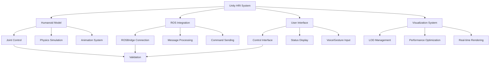

# Unity Integration for Human-Robot Interaction (HRI)

## Introduction to Unity for HRI Visualization

Unity has emerged as a leading platform for Human-Robot Interaction (HRI) visualization, offering photorealistic rendering capabilities, intuitive development tools, and robust physics simulation. For humanoid robotics, Unity provides an ideal environment for creating immersive interfaces that enable researchers, engineers, and end-users to visualize, interact with, and understand complex humanoid behaviors.

Unlike traditional simulation environments focused primarily on physics accuracy, Unity excels in creating visually compelling and interactive experiences that bridge the gap between simulation and real-world deployment. This makes Unity particularly valuable for:

- **Human operator interfaces**: Control and monitoring interfaces
- **Training environments**: Safe spaces for human-robot interaction
- **Demonstration platforms**: Showcasing humanoid capabilities
- **Virtual reality applications**: Immersive HRI experiences

## Unity 6.x+ Setup for Humanoid Robotics

### System Requirements and Installation

For humanoid robotics applications in Unity, ensure your system meets the following requirements:

- **Unity Hub**: Latest version (2024.2+) for easy version management
- **Unity Editor**: Unity 6.x or latest LTS version (2023.2+)
- **Graphics**: Dedicated GPU with DirectX 12 or Vulkan support
- **VRAM**: 8GB+ recommended for complex humanoid models
- **RAM**: 16GB+ for large scenes with detailed humanoid models

### Project Configuration for Robotics

```csharp
// RobotVisualizationManager.cs - Core Unity component for humanoid visualization
using UnityEngine;
using System.Collections;
using System.Collections.Generic;

namespace HRI.Unity
{
    [System.Serializable]
    public class JointMapping
    {
        public string rosJointName;
        public Transform unityJoint;
        public float minAngle = -180f;
        public float maxAngle = 180f;
        public float offset = 0f;
    }

    public class RobotVisualizationManager : MonoBehaviour
    {
        [Header("Robot Configuration")]
        public string robotName = "HumanoidRobot";
        public List<JointMapping> jointMappings = new List<JointMapping>();

        [Header("Visualization Settings")]
        public float interpolationSpeed = 10f;
        public bool usePhysics = false;
        public bool showTrajectory = false;

        [Header("ROS Connection")]
        public bool connectToROS = true;
        public string rosMasterUri = "http://localhost:11311";

        private Dictionary<string, float> targetJointPositions = new Dictionary<string, float>();
        private Dictionary<string, float> currentJointPositions = new Dictionary<string, float>();

        void Start()
        {
            InitializeJointDictionaries();
            if (connectToROS)
            {
                InitializeROSConnection();
            }
        }

        void InitializeJointDictionaries()
        {
            foreach (var joint in jointMappings)
            {
                targetJointPositions[joint.rosJointName] = 0f;
                currentJointPositions[joint.rosJointName] = 0f;
            }
        }

        void InitializeROSConnection()
        {
            // In a real implementation, this would connect to ROS using ROS# or similar
            Debug.Log($"Connecting to ROS master at {rosMasterUri}");
        }

        void Update()
        {
            UpdateJointPositions();
            UpdateRobotVisualization();
        }

        public void SetJointPosition(string jointName, float position)
        {
            if (targetJointPositions.ContainsKey(jointName))
            {
                targetJointPositions[jointName] = Mathf.Clamp(position,
                    jointMappings.Find(j => j.rosJointName == jointName).minAngle,
                    jointMappings.Find(j => j.rosJointName == jointName).maxAngle);
            }
        }

        public float GetJointPosition(string jointName)
        {
            return currentJointPositions.ContainsKey(jointName) ?
                currentJointPositions[jointName] : 0f;
        }

        void UpdateJointPositions()
        {
            foreach (var jointName in targetJointPositions.Keys)
            {
                currentJointPositions[jointName] = Mathf.Lerp(
                    currentJointPositions[jointName],
                    targetJointPositions[jointName],
                    Time.deltaTime * interpolationSpeed
                );
            }
        }

        void UpdateRobotVisualization()
        {
            foreach (var joint in jointMappings)
            {
                if (currentJointPositions.ContainsKey(joint.rosJointName))
                {
                    float angle = currentJointPositions[joint.rosJointName] + joint.offset;

                    if (joint.unityJoint != null)
                    {
                        // Apply rotation based on joint type
                        joint.unityJoint.localRotation = Quaternion.Euler(
                            joint.unityJoint.localRotation.eulerAngles.x,
                            joint.unityJoint.localRotation.eulerAngles.y,
                            angle
                        );
                    }
                }
            }
        }

        public void SetRobotState(Dictionary<string, float> jointStates)
        {
            foreach (var jointState in jointStates)
            {
                SetJointPosition(jointState.Key, jointState.Value);
            }
        }
    }
}
```

## Humanoid Model Integration in Unity

### Importing and Configuring Humanoid Models

Unity's humanoid model support includes advanced animation systems that can be leveraged for robotics visualization:

```csharp
// HumanoidRobotController.cs - Advanced humanoid control in Unity
using UnityEngine;
using UnityEngine.Animations.Rigging;

namespace HRI.Unity
{
    [RequireComponent(typeof(Animator))]
    public class HumanoidRobotController : MonoBehaviour
    {
        [Header("Humanoid Configuration")]
        public Animator animator;
        public bool useInverseKinematics = true;
        public bool showIKHandles = false;

        [Header("Animation Parameters")]
        public float walkSpeed = 1.0f;
        public float turnSpeed = 1.0f;

        [Header("IK Configuration")]
        public Transform leftFootTarget;
        public Transform rightFootTarget;
        public Transform leftHandTarget;
        public Transform rightHandTarget;

        private HumanoidState humanoidState;

        [System.Serializable]
        public class HumanoidState
        {
            public Vector3 position = Vector3.zero;
            public Vector3 velocity = Vector3.zero;
            public Quaternion rotation = Quaternion.identity;
            public float balance = 0.0f;
            public bool isWalking = false;
            public bool isBalancing = false;
        }

        void Start()
        {
            if (animator == null)
                animator = GetComponent<Animator>();

            if (animator != null)
            {
                animator.applyRootMotion = false;
            }

            InitializeIKTargets();
        }

        void InitializeIKTargets()
        {
            // Create IK target objects if not provided
            if (leftFootTarget == null)
            {
                var leftFoot = animator.GetBoneTransform(HumanBodyBones.LeftFoot);
                if (leftFoot != null)
                {
                    leftFootTarget = CreateIKTarget("LeftFootTarget", leftFoot.position);
                }
            }

            if (rightFootTarget == null)
            {
                var rightFoot = animator.GetBoneTransform(HumanBodyBones.RightFoot);
                if (rightFoot != null)
                {
                    rightFootTarget = CreateIKTarget("RightFootTarget", rightFoot.position);
                }
            }

            if (leftHandTarget == null)
            {
                var leftHand = animator.GetBoneTransform(HumanBodyBones.LeftHand);
                if (leftHand != null)
                {
                    leftHandTarget = CreateIKTarget("LeftHandTarget", leftHand.position);
                }
            }

            if (rightHandTarget == null)
            {
                var rightHand = animator.GetBoneTransform(HumanBodyBones.RightHand);
                if (rightHand != null)
                {
                    rightHandTarget = CreateIKTarget("RightHandTarget", rightHand.position);
                }
            }
        }

        Transform CreateIKTarget(string name, Vector3 position)
        {
            GameObject targetObj = new GameObject(name);
            targetObj.transform.position = position;
            targetObj.transform.SetParent(transform);
            return targetObj.transform;
        }

        void OnAnimatorIK(int layerIndex)
        {
            if (!useInverseKinematics || animator == null)
                return;

            // Configure foot IK
            animator.SetIKPositionWeight(AvatarIKGoal.LeftFoot, 1f);
            animator.SetIKPositionWeight(AvatarIKGoal.RightFoot, 1f);
            animator.SetIKRotationWeight(AvatarIKGoal.LeftFoot, 1f);
            animator.SetIKRotationWeight(AvatarIKGoal.RightFoot, 1f);

            if (leftFootTarget != null)
            {
                animator.SetIKPosition(AvatarIKGoal.LeftFoot, leftFootTarget.position);
                animator.SetIKRotation(AvatarIKGoal.LeftFoot, leftFootTarget.rotation);
            }

            if (rightFootTarget != null)
            {
                animator.SetIKPosition(AvatarIKGoal.RightFoot, rightFootTarget.position);
                animator.SetIKRotation(AvatarIKGoal.RightFoot, rightFootTarget.rotation);
            }

            // Configure hand IK
            animator.SetIKPositionWeight(AvatarIKGoal.LeftHand, 1f);
            animator.SetIKPositionWeight(AvatarIKGoal.RightHand, 1f);
            animator.SetIKRotationWeight(AvatarIKGoal.LeftHand, 1f);
            animator.SetIKRotationWeight(AvatarIKGoal.RightHand, 1f);

            if (leftHandTarget != null)
            {
                animator.SetIKPosition(AvatarIKGoal.LeftHand, leftHandTarget.position);
                animator.SetIKRotation(AvatarIKGoal.LeftHand, leftHandTarget.rotation);
            }

            if (rightHandTarget != null)
            {
                animator.SetIKPosition(AvatarIKGoal.RightHand, rightHandTarget.position);
                animator.SetIKRotation(AvatarIKGoal.RightHand, rightHandTarget.rotation);
            }
        }

        public void SetHumanoidState(HumanoidState state)
        {
            humanoidState = state;

            // Update animation parameters based on state
            if (animator != null)
            {
                animator.SetFloat("Speed", state.velocity.magnitude * walkSpeed);
                animator.SetFloat("Turn", Vector3.SignedAngle(
                    transform.forward,
                    state.velocity.normalized,
                    Vector3.up) * turnSpeed);
                animator.SetFloat("Balance", state.balance);
                animator.SetBool("IsWalking", state.isWalking);
                animator.SetBool("IsBalancing", state.isBalancing);
            }
        }

        void OnValidate()
        {
            walkSpeed = Mathf.Max(0.1f, walkSpeed);
            turnSpeed = Mathf.Max(0.1f, turnSpeed);
        }

        void OnDrawGizmos()
        {
            if (showIKHandles && leftFootTarget != null)
            {
                Gizmos.color = Color.blue;
                Gizmos.DrawWireSphere(leftFootTarget.position, 0.05f);
            }

            if (showIKHandles && rightFootTarget != null)
            {
                Gizmos.color = Color.blue;
                Gizmos.DrawWireSphere(rightFootTarget.position, 0.05f);
            }

            if (showIKHandles && leftHandTarget != null)
            {
                Gizmos.color = Color.green;
                Gizmos.DrawWireSphere(leftHandTarget.position, 0.05f);
            }

            if (showIKHandles && rightHandTarget != null)
            {
                Gizmos.color = Color.green;
                Gizmos.DrawWireSphere(rightHandTarget.position, 0.05f);
            }
        }
    }
}
```

### Physics and Collision Configuration

For realistic HRI, proper physics configuration is essential:

```csharp
// HumanoidPhysicsController.cs - Physics setup for humanoid in Unity
using UnityEngine;

namespace HRI.Unity
{
    [RequireComponent(typeof(Rigidbody))]
    [RequireComponent(typeof(CapsuleCollider))]
    public class HumanoidPhysicsController : MonoBehaviour
    {
        [Header("Physics Configuration")]
        public float mass = 70f; // Approximate humanoid mass
        public float drag = 0.5f;
        public float angularDrag = 1f;
        public bool useGravity = true;
        public bool isKinematic = false;

        [Header("Balance Configuration")]
        public float balanceForce = 100f;
        public float balanceDamping = 20f;
        public Transform centerOfMass; // Visual reference for CoM

        [Header("Ground Detection")]
        public LayerMask groundLayer = 1; // Default layer
        public float groundCheckDistance = 0.1f;
        public Transform groundCheckPoint;

        private Rigidbody rb;
        private Vector3 targetCOMPosition;
        private bool isGrounded = false;

        void Start()
        {
            rb = GetComponent<Rigidbody>();
            SetupPhysicsProperties();
            SetupGroundCheck();
        }

        void SetupPhysicsProperties()
        {
            if (rb != null)
            {
                rb.mass = mass;
                rb.drag = drag;
                rb.angularDrag = angularDrag;
                rb.useGravity = useGravity;
                rb.isKinematic = isKinematic;

                // Set center of mass if provided
                if (centerOfMass != null)
                {
                    rb.centerOfMass = transform.InverseTransformPoint(centerOfMass.position);
                }
            }
        }

        void SetupGroundCheck()
        {
            if (groundCheckPoint == null)
            {
                // Create ground check point at the bottom of the capsule
                groundCheckPoint = new GameObject("GroundCheck").transform;
                groundCheckPoint.SetParent(transform);
                groundCheckPoint.localPosition = new Vector3(0, -GetComponent<CapsuleCollider>().height / 2, 0);
            }
        }

        void FixedUpdate()
        {
            CheckGroundStatus();
            ApplyBalanceForces();
        }

        void CheckGroundStatus()
        {
            if (groundCheckPoint != null)
            {
                isGrounded = Physics.Raycast(
                    groundCheckPoint.position,
                    Vector3.down,
                    groundCheckDistance,
                    groundLayer
                );
            }
        }

        void ApplyBalanceForces()
        {
            if (centerOfMass != null && isGrounded && !isKinematic)
            {
                // Calculate current center of mass position
                Vector3 currentCOM = rb.worldCenterOfMass;

                // Calculate desired COM position (above feet)
                Vector3 targetCOM = transform.position;
                targetCOM.y = transform.position.y - 0.2f; // Slightly above ground

                // Calculate balance error
                Vector3 balanceError = targetCOM - currentCOM;
                balanceError.y = 0; // Only consider horizontal balance

                // Apply corrective forces
                Vector3 balanceForceVector = balanceError * balanceForce - rb.velocity * balanceDamping;
                rb.AddForceAtPosition(balanceForceVector, currentCOM, ForceMode.Force);
            }
        }

        public bool IsGrounded() { return isGrounded; }
        public Vector3 GetCOMPosition() { return rb.worldCenterOfMass; }
        public Vector3 GetCOMVelocity() { return rb.velocity; }

        void OnValidate()
        {
            mass = Mathf.Max(1f, mass);
            balanceForce = Mathf.Max(0f, balanceForce);
            balanceDamping = Mathf.Max(0f, balanceDamping);
            groundCheckDistance = Mathf.Max(0.01f, groundCheckDistance);
        }

        void OnDrawGizmos()
        {
            // Draw center of mass
            if (centerOfMass != null)
            {
                Gizmos.color = Color.red;
                Gizmos.DrawWireSphere(centerOfMass.position, 0.05f);
            }

            // Draw ground check ray
            if (groundCheckPoint != null)
            {
                Gizmos.color = isGrounded ? Color.green : Color.red;
                Gizmos.DrawRay(groundCheckPoint.position, Vector3.down * groundCheckDistance);
            }
        }
    }
}
```

## ROS-Unity Integration for Real-time Data

### Connecting Unity to ROS

Real-time data exchange between ROS and Unity enables live visualization of robot states:

```csharp
// ROSBridgeConnection.cs - ROS connection for Unity
using UnityEngine;
using System.Collections;
using Newtonsoft.Json.Linq;

namespace HRI.Unity
{
    public class ROSBridgeConnection : MonoBehaviour
    {
        [Header("ROS Connection")]
        public string rosBridgeUrl = "ws://localhost:9090";
        public float connectionRetryDelay = 5f;

        [Header("Topic Subscriptions")]
        public string jointStatesTopic = "/joint_states";
        public string robotStateTopic = "/robot_state";
        public string tfTopic = "/tf";

        [Header("Visualization Settings")]
        public RobotVisualizationManager robotManager;

        private bool isConnected = false;
        private WebSocket webSocket;

        void Start()
        {
            ConnectToROSBridge();
        }

        void ConnectToROSBridge()
        {
            webSocket = new WebSocket(new System.Uri(rosBridgeUrl));
            webSocket.OnOpen += () =>
            {
                Debug.Log("Connected to ROSBridge");
                isConnected = true;
                SubscribeToTopics();
            };

            webSocket.OnError += (e) =>
            {
                Debug.LogError($"WebSocket Error: {e}");
                isConnected = false;
                Invoke(nameof(ConnectToROSBridge), connectionRetryDelay);
            };

            webSocket.OnClose += (e) =>
            {
                Debug.Log("WebSocket Closed");
                isConnected = false;
                Invoke(nameof(ConnectToROSBridge), connectionRetryDelay);
            };

            webSocket.OnMessage += (msg) =>
            {
                ProcessROSMessage(msg);
            };

            webSocket.Connect();
        }

        void SubscribeToTopics()
        {
            if (isConnected)
            {
                SubscribeToTopic(jointStatesTopic, "sensor_msgs/JointState");
                SubscribeToTopic(robotStateTopic, "std_msgs/String");
            }
        }

        void SubscribeToTopic(string topic, string messageType)
        {
            var subscribeMsg = new JObject
            {
                ["op"] = "subscribe",
                ["topic"] = topic,
                ["type"] = messageType
            };

            if (webSocket != null && webSocket.State == WebSocketState.Open)
            {
                webSocket.Send(subscribeMsg.ToString());
            }
        }

        void ProcessROSMessage(string message)
        {
            try
            {
                JObject msg = JObject.Parse(message);
                string topic = msg["topic"]?.ToString();

                switch (topic)
                {
                    case var t when t == jointStatesTopic:
                        ProcessJointStates(msg["msg"]);
                        break;
                    case var t when t == robotStateTopic:
                        ProcessRobotState(msg["msg"]);
                        break;
                }
            }
            catch (System.Exception e)
            {
                Debug.LogError($"Error processing ROS message: {e.Message}");
            }
        }

        void ProcessJointStates(JToken msg)
        {
            if (robotManager == null) return;

            var nameArray = msg["name"] as JArray;
            var positionArray = msg["position"] as JArray;

            if (nameArray != null && positionArray != null)
            {
                for (int i = 0; i < nameArray.Count && i < positionArray.Count; i++)
                {
                    string jointName = nameArray[i].ToString();
                    float position = (float)positionArray[i];

                    // Convert from radians to degrees if needed for Unity
                    robotManager.SetJointPosition(jointName, position * Mathf.Rad2Deg);
                }
            }
        }

        void ProcessRobotState(JToken msg)
        {
            // Process high-level robot state information
            string state = msg["data"]?.ToString();
            // Could include walking, standing, balancing, etc.
        }

        void Update()
        {
            // Process incoming messages
            if (webSocket != null && webSocket.State == WebSocketState.Open)
            {
                // In a real implementation, you would process messages here
            }
        }

        void OnDestroy()
        {
            if (webSocket != null)
            {
                webSocket.Close();
            }
        }
    }
}
```

## Human-Robot Interaction Interfaces

### Visual Feedback Systems

Creating intuitive interfaces for human operators to understand robot state:

```csharp
// RobotStatusDisplay.cs - Visual status display for humanoid robot
using UnityEngine;
using UnityEngine.UI;
using System.Collections;

namespace HRI.Unity
{
    public class RobotStatusDisplay : MonoBehaviour
    {
        [Header("Status Elements")]
        public Text statusText;
        public Image batteryIndicator;
        public Image balanceIndicator;
        public Slider powerSlider;
        public GameObject[] statusLights;

        [Header("Robot Connection")]
        public RobotVisualizationManager robotManager;

        [Header("Colors")]
        public Color normalColor = Color.green;
        public Color warningColor = Color.yellow;
        public Color errorColor = Color.red;

        [Header("Status Parameters")]
        public float batteryLevel = 100f;
        public float balanceLevel = 1f; // 0-1 scale
        public float powerLevel = 1f;   // 0-1 scale

        private Coroutine batteryDrainCoroutine;

        void Start()
        {
            UpdateStatusDisplay();
        }

        void UpdateStatusDisplay()
        {
            if (statusText != null)
            {
                statusText.text = $"Battery: {batteryLevel:F1}%\n" +
                                $"Balance: {balanceLevel:F1}\n" +
                                $"Power: {powerLevel:F1}";
            }

            if (batteryIndicator != null)
            {
                batteryIndicator.color = GetStatusColor(batteryLevel / 100f);
                batteryIndicator.fillAmount = batteryLevel / 100f;
            }

            if (balanceIndicator != null)
            {
                balanceIndicator.color = GetStatusColor(balanceLevel);
                balanceIndicator.fillAmount = balanceLevel;
            }

            if (powerSlider != null)
            {
                powerSlider.value = powerLevel;
            }

            UpdateStatusLights();
        }

        Color GetStatusColor(float level)
        {
            if (level > 0.7f) return normalColor;
            if (level > 0.3f) return warningColor;
            return error combust;
        }

        void UpdateStatusLights()
        {
            if (statusLights != null)
            {
                for (int i = 0; i < statusLights.Length; i++)
                {
                    if (statusLights[i] != null)
                    {
                        float threshold = (float)(i + 1) / statusLights.Length;
                        statusLights[i].GetComponent<Image>().color =
                            balanceLevel > threshold ? normalColor : errorColor;
                    }
                }
            }
        }

        public void SetBatteryLevel(float level)
        {
            batteryLevel = Mathf.Clamp(level, 0f, 100f);
            UpdateStatusDisplay();
        }

        public void SetBalanceLevel(float level)
        {
            balanceLevel = Mathf.Clamp(level, 0f, 1f);
            UpdateStatusDisplay();
        }

        public void SetPowerLevel(float level)
        {
            powerLevel = Mathf.Clamp(level, 0f, 1f);
            UpdateStatusDisplay();
        }

        public void StartBatteryDrain(float drainRate = 0.1f)
        {
            if (batteryDrainCoroutine != null)
            {
                StopCoroutine(batteryDrainCoroutine);
            }
            batteryDrainCoroutine = StartCoroutine(BatteryDrain(drainRate));
        }

        IEnumerator BatteryDrain(float rate)
        {
            while (batteryLevel > 0)
            {
                batteryLevel -= rate * Time.deltaTime;
                UpdateStatusDisplay();
                yield return null;
            }
        }

        void OnValidate()
        {
            batteryLevel = Mathf.Clamp(batteryLevel, 0f, 100f);
            balanceLevel = Mathf.Clamp(balanceLevel, 0f, 1f);
            powerLevel = Mathf.Clamp(powerLevel, 0f, 1f);
        }
    }
}
```

### Interactive Control Interfaces

Creating interfaces for humans to control humanoid robots:

```csharp
// HRIController.cs - Human-Robot Interaction controller
using UnityEngine;
using UnityEngine.UI;
using System.Collections.Generic;

namespace HRI.Unity
{
    public class HRIController : MonoBehaviour
    {
        [Header("Control Interface")]
        public Button walkButton;
        public Button stopButton;
        public Button balanceButton;
        public Slider speedSlider;
        public Toggle debugModeToggle;

        [Header("Visualization")]
        public GameObject robotModel;
        public Camera mainCamera;
        public LineRenderer trajectoryRenderer;

        [Header("ROS Integration")]
        public ROSBridgeConnection rosConnection;

        [Header("Command Parameters")]
        public float defaultSpeed = 0.5f;
        public float maxSpeed = 2.0f;

        private bool isWalking = false;
        private bool isBalancing = false;
        private List<Vector3> trajectoryPoints = new List<Vector3>();

        void Start()
        {
            SetupUIEventHandlers();
            SetupTrajectoryVisualization();
        }

        void SetupUIEventHandlers()
        {
            if (walkButton != null)
                walkButton.onClick.AddListener(StartWalking);

            if (stopButton != null)
                stopButton.onClick.AddListener(StopRobot);

            if (balanceButton != null)
                balanceButton.onClick.AddListener(ToggleBalanceMode);

            if (speedSlider != null)
                speedSlider.onValueChanged.AddListener(OnSpeedChanged);

            if (debugModeToggle != null)
                debugModeToggle.onValueChanged.AddListener(OnDebugModeChanged);
        }

        void SetupTrajectoryVisualization()
        {
            if (trajectoryRenderer != null)
            {
                trajectoryRenderer.positionCount = 0;
                trajectoryRenderer.startWidth = 0.05f;
                trajectoryRenderer.endWidth = 0.05f;
                trajectoryRenderer.material = new Material(Shader.Find("Sprites/Default"));
                trajectoryRenderer.startColor = Color.blue;
                trajectoryRenderer.endColor = Color.cyan;
            }
        }

        public void StartWalking()
        {
            if (rosConnection != null && rosConnection.isConnected)
            {
                SendCommand("walk", new Dictionary<string, object>
                {
                    ["speed"] = speedSlider != null ? speedSlider.value : defaultSpeed
                });
                isWalking = true;
            }
        }

        public void StopRobot()
        {
            if (rosConnection != null && rosConnection.isConnected)
            {
                SendCommand("stop", new Dictionary<string, object>());
                isWalking = false;
            }
        }

        public void ToggleBalanceMode()
        {
            if (rosConnection != null && rosConnection.isConnected)
            {
                isBalancing = !isBalancing;
                SendCommand("balance", new Dictionary<string, object>
                {
                    ["enable"] = isBalancing
                });
            }
        }

        void OnSpeedChanged(float value)
        {
            if (isWalking && rosConnection != null && rosConnection.isConnected)
            {
                SendCommand("speed", new Dictionary<string, object>
                {
                    ["value"] = value
                });
            }
        }

        void OnDebugModeChanged(bool enabled)
        {
            if (rosConnection != null && rosConnection.isConnected)
            {
                SendCommand("debug", new Dictionary<string, object>
                {
                    ["enable"] = enabled
                });
            }
        }

        void SendCommand(string command, Dictionary<string, object> parameters)
        {
            // In a real implementation, this would send the command via ROS
            string message = $"Command: {command}, Params: {string.Join(", ", parameters)}";
            Debug.Log(message);
        }

        void Update()
        {
            if (robotModel != null && trajectoryRenderer != null)
            {
                UpdateTrajectoryVisualization();
            }
        }

        void UpdateTrajectoryVisualization()
        {
            if (isWalking)
            {
                // Add current robot position to trajectory
                Vector3 currentPos = robotModel.transform.position;

                if (trajectoryPoints.Count == 0 ||
                    Vector3.Distance(trajectoryPoints[trajectoryPoints.Count - 1], currentPos) > 0.1f)
                {
                    trajectoryPoints.Add(currentPos);

                    if (trajectoryPoints.Count > 100) // Limit history
                    {
                        trajectoryPoints.RemoveAt(0);
                    }

                    trajectoryRenderer.positionCount = trajectoryPoints.Count;
                    trajectoryRenderer.SetPositions(trajectoryPoints.ToArray());
                }
            }
        }

        public void ClearTrajectory()
        {
            trajectoryPoints.Clear();
            if (trajectoryRenderer != null)
            {
                trajectoryRenderer.positionCount = 0;
            }
        }

        void OnDestroy()
        {
            ClearTrajectory();
        }
    }
}
```

## Advanced HRI Features

### Voice and Gesture Integration

Creating more natural interaction methods:

```csharp
// VoiceGestureController.cs - Voice and gesture control for humanoid
using UnityEngine;
using UnityEngine.Windows.Speech;
using System.Collections.Generic;
using System.Linq;

namespace HRI.Unity
{
    public class VoiceGestureController : MonoBehaviour
    {
        [Header("Voice Recognition")]
        public bool enableVoiceControl = true;
        [TextArea] public string[] voiceCommands = {
            "walk forward",
            "turn left",
            "turn right",
            "stop",
            "wave",
            "dance"
        };

        [Header("Gesture Recognition")]
        public bool enableGestureControl = true;
        public Camera gestureCamera; // For AR/VR gesture detection

        [Header("Robot Integration")]
        public RobotVisualizationManager robotManager;
        public HRIController hriController;

        private KeywordRecognizer keywordRecognizer;
        private Dictionary<string, System.Action> keywordActions;

        void Start()
        {
            SetupVoiceRecognition();
            SetupGestureRecognition();
        }

        void SetupVoiceRecognition()
        {
            if (enableVoiceControl && voiceCommands != null && voiceCommands.Length > 0)
            {
                keywordActions = new Dictionary<string, System.Action>
                {
                    { "walk forward", () => hriController.StartWalking() },
                    { "turn left", () => SendTurnCommand(-90) },
                    { "turn right", () => SendTurnCommand(90) },
                    { "stop", () => hriController.StopRobot() },
                    { "wave", () => ExecuteGesture("wave") },
                    { "dance", () => ExecuteGesture("dance") }
                };

                keywordRecognizer = new KeywordRecognizer(voiceCommands);
                keywordRecognizer.OnPhraseRecognized += OnPhraseRecognized;
                keywordRecognizer.Start();
            }
        }

        void SetupGestureRecognition()
        {
            if (enableGestureControl)
            {
                // In a real implementation, this would connect to gesture recognition
                // systems like Azure Kinect, Leap Motion, or custom solutions
                Debug.Log("Gesture recognition initialized");
            }
        }

        void OnPhraseRecognized(PhraseRecognizedEventArgs args)
        {
            string command = args.text.ToLower();
            Debug.Log($"Voice command recognized: {command}");

            if (keywordActions.ContainsKey(command))
            {
                keywordActions[command].Invoke();
            }
        }

        void SendTurnCommand(int angle)
        {
            if (robotManager != null)
            {
                // Send turn command - in a real implementation this would go to ROS
                Debug.Log($"Sending turn command: {angle} degrees");
            }
        }

        void ExecuteGesture(string gestureName)
        {
            if (robotManager != null)
            {
                // Execute predefined gesture animation
                Debug.Log($"Executing gesture: {gestureName}");

                // This would trigger specific animations in the humanoid model
                StartCoroutine(PlayGestureAnimation(gestureName));
            }
        }

        IEnumerator PlayGestureAnimation(string gestureName)
        {
            // Example: Wave gesture
            if (gestureName == "wave")
            {
                // Animate the robot to wave
                if (robotManager != null)
                {
                    // Send joint commands to create waving motion
                    robotManager.SetJointPosition("right_shoulder_pitch", 45f);
                    yield return new WaitForSeconds(0.5f);
                    robotManager.SetJointPosition("right_elbow", 90f);
                    yield return new WaitForSeconds(0.5f);

                    // Return to neutral position
                    robotManager.SetJointPosition("right_shoulder_pitch", 0f);
                    robotManager.SetJointPosition("right_elbow", 0f);
                }
            }
        }

        void OnDestroy()
        {
            if (keywordRecognizer != null && keywordRecognizer.IsRunning)
            {
                keywordRecognizer.Stop();
            }
        }
    }
}
```

## Performance Optimization for Real-time HRI

### Rendering Optimization

For smooth real-time visualization of complex humanoid models:

```csharp
// HumanoidLODManager.cs - Level of Detail for humanoid models
using UnityEngine;
using System.Collections.Generic;

namespace HRI.Unity
{
    [RequireComponent(typeof(Animator))]
    public class HumanoidLODManager : MonoBehaviour
    {
        [Header("LOD Configuration")]
        public LODGroup lodGroup;
        public Transform viewerTransform; // Camera or viewer position

        [Header("Performance Settings")]
        public float lodTransitionSpeed = 2f;
        public int maxLODLevel = 2; // 0 = highest detail, higher = lower detail

        [Header("Animation Optimization")]
        public bool optimizeAnimations = true;
        public int animationUpdateRate = 30; // FPS for animation updates

        private Animator animator;
        private float lastAnimationUpdate = 0f;
        private int currentLODLevel = 0;

        void Start()
        {
            animator = GetComponent<Animator>();

            if (lodGroup == null)
            {
                lodGroup = GetComponent<LODGroup>();
            }

            if (viewerTransform == null)
            {
                // Use main camera if no viewer specified
                var mainCam = Camera.main;
                if (mainCam != null)
                {
                    viewerTransform = mainCam.transform;
                }
            }

            SetupLOD();
        }

        void SetupLOD()
        {
            if (lodGroup != null)
            {
                // Create LODs with different detail levels
                List<LOD> lods = new List<LOD>();

                // LOD 0: High detail (full model)
                lods.Add(new LOD(0.5f, GetRenderersForLOD(0)));

                // LOD 1: Medium detail (simplified geometry)
                lods.Add(new LOD(0.2f, GetRenderersForLOD(1)));

                // LOD 2: Low detail (simple shapes)
                lods.Add(new LOD(0.05f, GetRenderersForLOD(2)));

                lodGroup.SetLODs(lods.ToArray());
                lodGroup.RecalculateBounds();
            }
        }

        Renderer[] GetRenderersForLOD(int lodLevel)
        {
            List<Renderer> renderers = new List<Renderer>();

            switch (lodLevel)
            {
                case 0: // High detail - all parts
                    renderers.AddRange(GetComponentsInChildren<SkinnedMeshRenderer>());
                    renderers.AddRange(GetComponentsInChildren<MeshRenderer>());
                    break;
                case 1: // Medium detail - main parts only
                    var mainParts = GetComponentsInChildren<Transform>();
                    foreach (var part in mainParts)
                    {
                        var renderer = part.GetComponent<Renderer>();
                        if (renderer != null &&
                            (part.name.Contains("body") || part.name.Contains("limb")))
                        {
                            renderers.Add(renderer);
                        }
                    }
                    break;
                case 2: // Low detail - basic shapes
                    // Use simple primitives for distant viewing
                    renderers.Add(GetComponent<Renderer>()); // Just the main body
                    break;
            }

            return renderers.ToArray();
        }

        void Update()
        {
            UpdateLOD();
            UpdateAnimationPerformance();
        }

        void UpdateLOD()
        {
            if (lodGroup != null && viewerTransform != null)
            {
                float distance = Vector3.Distance(transform.position, viewerTransform.position);
                lodGroup.FadeMode = LODFadeMode.CrossFade;

                // Adjust LOD based on distance
                if (distance < 5f) currentLODLevel = 0;      // High detail
                else if (distance < 15f) currentLODLevel = 1; // Medium detail
                else currentLODLevel = 2;                     // Low detail

                lodGroup.SetLODScreenRelativeTransitionHeight(currentLODLevel,
                    GetTransitionHeight(currentLODLevel));
            }
        }

        float GetTransitionHeight(int lodLevel)
        {
            switch (lodLevel)
            {
                case 0: return 0.5f;
                case 1: return 0.2f;
                case 2: return 0.05f;
                default: return 0.05f;
            }
        }

        void UpdateAnimationPerformance()
        {
            if (optimizeAnimations && animator != null)
            {
                float currentTime = Time.time;

                // Update animations at specified rate instead of every frame
                if (currentTime - lastAnimationUpdate >= 1f / animationUpdateRate)
                {
                    // Update animation parameters
                    UpdateAnimationParameters();
                    lastAnimationUpdate = currentTime;
                }
                else
                {
                    // Keep current animation state
                    animator.speed = 0f; // Pause animation updates
                }
            }
        }

        void UpdateAnimationParameters()
        {
            if (animator != null)
            {
                animator.speed = 1f; // Resume animation updates
                // Update any animation parameters based on robot state
            }
        }

        void OnValidate()
        {
            lodTransitionSpeed = Mathf.Max(0.1f, lodTransitionSpeed);
            maxLODLevel = Mathf.Clamp(maxLODLevel, 0, 5);
            animationUpdateRate = Mathf.Clamp(animationUpdateRate, 1, 60);
        }
    }
}
```

## Best Practices for Unity HRI Development

### Architecture Considerations

When developing HRI applications in Unity for humanoid robots:

1. **Modular Design**: Separate visualization, control, and communication components
2. **Performance Monitoring**: Implement frame rate and memory usage monitoring
3. **Error Handling**: Robust error handling for network disconnections and sensor failures
4. **User Experience**: Intuitive interfaces that don't overwhelm human operators

### Safety and Reliability

Critical considerations for HRI applications:

- **Fail-safe mechanisms**: Ensure robot stops safely if communication fails
- **Validation layers**: Verify commands before sending to real robots
- **Operator training**: Provide clear feedback about robot state and capabilities
- **Emergency procedures**: Easy-to-access emergency stop functionality



## VR/AR Integration for Immersive HRI

Unity's VR/AR capabilities enable immersive interaction with humanoid robots:

- **Virtual Reality**: First-person control and monitoring
- **Augmented Reality**: Overlaying robot information in real environments
- **Mixed Reality**: Combining virtual robots with real environments

:::tip
When developing Unity applications for humanoid HRI, always test with actual robot hardware when possible. The visual fidelity of Unity can sometimes mask issues that only appear with real robot dynamics and sensor limitations.
:::

:::warning
Unity applications for HRI can be computationally intensive. Ensure your target hardware meets performance requirements, especially for real-time applications with multiple sensors and high-resolution displays.
:::

## Summary

Unity integration for Human-Robot Interaction provides powerful visualization and interaction capabilities that enhance the development, operation, and demonstration of humanoid robots. By leveraging Unity's rendering capabilities, physics simulation, and intuitive development environment, developers can create sophisticated interfaces that bridge the gap between complex robotic systems and human operators.

In the next section, we'll explore optimization and best practices for simulation environments, focusing on performance considerations and advanced techniques for efficient humanoid robot simulation.