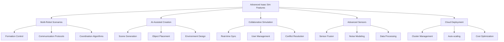

# Advanced Isaac Sim Features for Humanoid Robotics

## Introduction to Advanced Isaac Sim Capabilities

Isaac Sim offers a range of advanced features that extend beyond basic simulation capabilities, providing sophisticated tools for humanoid robotics development. These features leverage the power of NVIDIA's Omniverse platform and GPU acceleration to enable complex scenarios, collaborative workflows, and AI-assisted development processes that are particularly valuable for humanoid robot applications.

Advanced features covered in this section:
- **Multi-robot Scenarios**: Simulating multiple humanoid robots in shared environments
- **AI-Assisted Scene Creation**: Using AI to generate and modify simulation scenes
- **Collaborative Simulation**: Real-time collaboration between multiple users
- **Advanced Sensor Simulation**: Sophisticated sensor modeling and fusion
- **Cloud Deployment**: Scaling simulation workloads to cloud infrastructure
- **Custom Extensions**: Developing specialized tools and workflows

## Multi-Robot Scenarios and Coordination

### Simulating Multiple Humanoid Robots

Multi-robot scenarios are essential for research and development of coordinated humanoid behaviors:

```python
# multi_robot_scenario.py
import omni
from omni.isaac.core import World
from omni.isaac.core.robots import Robot
from omni.isaac.core.utils.stage import add_reference_to_stage
from omni.isaac.core.utils.prims import create_prim
from pxr import Gf
import numpy as np
import carb

class MultiHumanoidScenario:
    def __init__(self, num_robots=2):
        self.num_robots = num_robots
        self.robots = []
        self.world = World(stage_units_in_meters=1.0)

        # Physics settings for multiple robots
        self.physics_dt = 1.0 / 60.0
        self.world.set_physics_dt(self.physics_dt)

    def setup_scenario(self, scenario_type="formation", robot_usd_paths=None):
        """
        Set up a multi-robot scenario
        """
        # Add ground plane
        self.world.scene.add_default_ground_plane()

        # Define robot positions in formation
        robot_positions = self.calculate_formation_positions(scenario_type)

        # Load robots
        if robot_usd_paths is None:
            # Use default humanoid robot for all
            robot_usd_paths = ["path/to/humanoid_robot.usd"] * self.num_robots

        for i in range(self.num_robots):
            robot_path = f"/World/HumanoidRobot_{i}"
            position = robot_positions[i]

            # Add robot to stage
            add_reference_to_stage(
                usd_path=robot_usd_paths[i % len(robot_usd_paths)],
                prim_path=robot_path
            )

            # Create robot object
            robot = Robot(
                prim_path=robot_path,
                name=f"humanoid_robot_{i}",
                position=position,
                orientation=[0, 0, 0, 1]
            )

            self.robots.append(robot)

        # Set up coordination infrastructure
        self.setup_coordination_infrastructure()

        carb.log_info(f"Multi-robot scenario set up with {self.num_robots} humanoid robots")

    def calculate_formation_positions(self, formation_type="line"):
        """
        Calculate positions for robot formation
        """
        positions = []
        spacing = 1.0  # meters between robots

        if formation_type == "line":
            for i in range(self.num_robots):
                x_pos = i * spacing
                y_pos = 0.0
                z_pos = 1.0  # Start 1m above ground
                positions.append([x_pos, y_pos, z_pos])

        elif formation_type == "circle":
            center = [0, 0, 1.0]
            radius = 2.0
            for i in range(self.num_robots):
                angle = 2 * np.pi * i / self.num_robots
                x_pos = center[0] + radius * np.cos(angle)
                y_pos = center[1] + radius * np.sin(angle)
                z_pos = center[2]
                positions.append([x_pos, y_pos, z_pos])

        elif formation_type == "v_formation":
            leader_pos = [0, 0, 1.0]
            positions.append(leader_pos)

            for i in range(1, self.num_robots):
                # Followers in V-formation behind leader
                follower_distance = 1.5 * (i // 2 + 1)
                side_offset = ((i - 1) // 2 + 1) * 0.8 * (-1 if i % 2 == 0 else 1)

                x_pos = -follower_distance
                y_pos = side_offset
                z_pos = 1.0
                positions.append([x_pos, y_pos, z_pos])

        return positions

    def setup_coordination_infrastructure(self):
        """
        Set up infrastructure for robot coordination
        """
        # Create coordination communication channels
        # In real implementation, this would use ROS topics or custom communication
        self.coordination_channels = {}

        for i in range(self.num_robots):
            self.coordination_channels[f"robot_{i}"] = {
                "position_broadcast": f"/robot_{i}/position",
                "intent_broadcast": f"/robot_{i}/intent",
                "formation_command": f"/formation/command"
            }

        # Set up shared goals and objectives
        self.shared_goals = {
            "destination": [10, 0, 0],  # Target location
            "formation_type": "line",
            "max_speed": 0.5  # m/s
        }

    def execute_coordinated_behavior(self):
        """
        Execute coordinated behavior for multi-robot system
        """
        # Get current states of all robots
        robot_states = []
        for i, robot in enumerate(self.robots):
            pos, orn = robot.get_world_poses()
            lin_vel, ang_vel = robot.get_velocities()

            state = {
                "id": i,
                "position": pos,
                "orientation": orn,
                "linear_velocity": lin_vel,
                "angular_velocity": ang_vel
            }
            robot_states.append(state)

        # Apply coordination algorithm
        control_commands = self.compute_coordination_commands(robot_states)

        # Apply commands to robots
        for i, robot in enumerate(self.robots):
            if i < len(control_commands):
                self.apply_control_command(robot, control_commands[i])

    def compute_coordination_commands(self, robot_states):
        """
        Compute coordination commands based on robot states
        """
        commands = []

        for i, state in enumerate(robot_states):
            # Simple formation control
            desired_position = self.calculate_desired_position(i, robot_states)

            # Compute position error
            pos_error = np.array(desired_position) - np.array(state["position"])

            # Simple proportional control
            velocity_command = pos_error * 0.5  # 0.5 m/s per meter of error

            # Limit speed
            speed = np.linalg.norm(velocity_command)
            if speed > self.shared_goals["max_speed"]:
                velocity_command = velocity_command * (self.shared_goals["max_speed"] / speed)

            command = {
                "linear_velocity": velocity_command,
                "angular_velocity": [0, 0, 0]  # No rotation for now
            }

            commands.append(command)

        return commands

    def calculate_desired_position(self, robot_id, robot_states):
        """
        Calculate desired position for a robot in formation
        """
        formation_type = self.shared_goals["formation_type"]

        if formation_type == "line":
            # Maintain line formation with spacing
            leader_state = robot_states[0]
            offset = robot_id * 1.0  # 1m spacing
            desired_x = leader_state["position"][0] - offset
            desired_y = leader_state["position"][1]
            desired_z = leader_state["position"][2]

            return [desired_x, desired_y, desired_z]

        elif formation_type == "circle":
            # Maintain circular formation
            center = np.array([0, 0, 1.0])
            radius = 2.0
            angle = 2 * np.pi * robot_id / self.num_robots
            desired_x = center[0] + radius * np.cos(angle)
            desired_y = center[1] + radius * np.sin(angle)
            desired_z = center[2]

            return [desired_x, desired_y, desired_z]

        # Default to current position
        return list(robot_states[robot_id]["position"])

    def apply_control_command(self, robot, command):
        """
        Apply control command to robot
        """
        # In real implementation, this would interface with robot controllers
        # For simulation, we'll just log the command
        carb.log_info(f"Applying command to robot: {command}")
```

### Multi-Robot Communication and Coordination

Advanced communication protocols for multi-robot systems:

```python
# multi_robot_communication.py
import asyncio
import json
from dataclasses import dataclass
from typing import Dict, List, Any
import carb

@dataclass
class RobotState:
    """Data structure for robot state information"""
    robot_id: int
    position: List[float]
    orientation: List[float]
    velocity: List[float]
    battery_level: float
    status: str

@dataclass
class CoordinationMessage:
    """Data structure for coordination messages"""
    message_type: str  # 'state_update', 'formation_command', 'task_assignment', etc.
    sender_id: int
    timestamp: float
    content: Dict[str, Any]

class MultiRobotCommunicationSystem:
    def __init__(self, num_robots: int):
        self.num_robots = num_robots
        self.robot_states: Dict[int, RobotState] = {}
        self.message_queue = asyncio.Queue()
        self.topics = {
            "state_broadcast": "/multi_robot/state_broadcast",
            "formation_control": "/multi_robot/formation_control",
            "task_assignment": "/multi_robot/task_assignment",
            "emergency_stop": "/multi_robot/emergency_stop"
        }

    async def broadcast_state(self, robot_id: int, state: RobotState):
        """
        Broadcast robot state to other robots
        """
        message = CoordinationMessage(
            message_type="state_update",
            sender_id=robot_id,
            timestamp=carb.settings.get_settings().get("/app/player/playhead", 0.0),
            content={
                "position": state.position,
                "orientation": state.orientation,
                "velocity": state.velocity,
                "battery_level": state.battery_level,
                "status": state.status
            }
        )

        # Publish to communication network (simulated)
        await self.publish_message(self.topics["state_broadcast"], message)

        # Update local state tracking
        self.robot_states[robot_id] = state

    async def publish_message(self, topic: str, message: CoordinationMessage):
        """
        Publish message to communication topic
        """
        # In real implementation, this would use ROS or custom messaging
        # For simulation, just log the message
        carb.log_info(f"Published message to {topic}: {message.message_type} from robot {message.sender_id}")

    async def subscribe_to_topic(self, topic: str, callback):
        """
        Subscribe to a communication topic
        """
        # In real implementation, this would set up message listeners
        carb.log_info(f"Subscribed to topic: {topic}")

    async def send_formation_command(self, leader_id: int, formation_type: str, parameters: Dict[str, Any]):
        """
        Send formation command to all robots
        """
        command = CoordinationMessage(
            message_type="formation_command",
            sender_id=leader_id,
            timestamp=carb.settings.get_settings().get("/app/player/playhead", 0.0),
            content={
                "formation_type": formation_type,
                "parameters": parameters,
                "target_robots": list(range(self.num_robots))  # All robots
            }
        )

        await self.publish_message(self.topics["formation_control"], command)

    async def send_task_assignment(self, robot_id: int, task: str, parameters: Dict[str, Any]):
        """
        Send task assignment to specific robot
        """
        assignment = CoordinationMessage(
            message_type="task_assignment",
            sender_id=0,  # Coordinator
            timestamp=carb.settings.get_settings().get("/app/player/playhead", 0.0),
            content={
                "task": task,
                "parameters": parameters,
                "assigned_robot": robot_id
            }
        )

        await self.publish_message(self.topics["task_assignment"], assignment)

    async def send_emergency_stop(self):
        """
        Send emergency stop command to all robots
        """
        emergency = CoordinationMessage(
            message_type="emergency_stop",
            sender_id=-1,  # System emergency
            timestamp=carb.settings.get_settings().get("/app/player/playhead", 0.0),
            content={}
        )

        await self.publish_message(self.topics["emergency_stop"], emergency)

    def get_formation_positions(self, formation_type: str, num_robots: int, leader_position: List[float]):
        """
        Calculate formation positions based on formation type
        """
        positions = []

        if formation_type == "line":
            spacing = 1.0
            for i in range(num_robots):
                pos = [
                    leader_position[0] - i * spacing,
                    leader_position[1],
                    leader_position[2]
                ]
                positions.append(pos)

        elif formation_type == "wedge":
            spacing = 1.0
            for i in range(num_robots):
                # Leader at index 0, others form wedge
                if i == 0:
                    positions.append(leader_position)
                else:
                    # Calculate wedge position
                    row = (i - 1) // 2 + 1
                    side = (-1) ** (i % 2)  # Alternate sides
                    offset = row * spacing

                    pos = [
                        leader_position[0] - offset,
                        leader_position[1] + side * offset * 0.5,
                        leader_position[2]
                    ]
                    positions.append(pos)

        return positions

class MultiRobotBehaviorEngine:
    def __init__(self, communication_system: MultiRobotCommunicationSystem):
        self.comm_system = communication_system
        self.behaviors = {
            "formation_maintenance": self.maintain_formation,
            "obstacle_avoidance": self.avoid_obstacles,
            "task_coordination": self.coordinate_tasks,
            "emergency_response": self.handle_emergency
        }

    async def maintain_formation(self, formation_type: str, leader_id: int):
        """
        Maintain formation with specified leader
        """
        # Get current states of all robots
        current_states = self.comm_system.robot_states

        # Calculate desired formation positions
        if leader_id in current_states:
            leader_pos = current_states[leader_id].position
            desired_positions = self.comm_system.get_formation_positions(
                formation_type,
                self.comm_system.num_robots,
                leader_pos
            )

            # Send formation commands
            for i, desired_pos in enumerate(desired_positions):
                if i in current_states:
                    # Calculate movement command
                    current_pos = current_states[i].position
                    movement_vector = [
                        desired_pos[0] - current_pos[0],
                        desired_pos[1] - current_pos[1],
                        desired_pos[2] - current_pos[2]
                    ]

                    # Send movement command to robot
                    await self.send_movement_command(i, movement_vector)

    async def send_movement_command(self, robot_id: int, movement_vector: List[float]):
        """
        Send movement command to specific robot
        """
        command = CoordinationMessage(
            message_type="movement_command",
            sender_id=0,  # Coordinator
            timestamp=carb.settings.get_settings().get("/app/player/playhead", 0.0),
            content={
                "target_position": movement_vector,
                "speed": 0.5  # m/s
            }
        )

        # In real implementation, this would send to specific robot
        carb.log_info(f"Sending movement command to robot {robot_id}: {movement_vector}")
```

## AI-Assisted Scene Creation and Modification

### AI-Powered Scene Generation

Isaac Sim incorporates AI capabilities for scene creation and modification:

```python
# ai_scene_generation.py
import omni
from pxr import Usd, UsdGeom, UsdPhysics, Gf
import carb
import numpy as np
from typing import Dict, List, Tuple

class AISceneGenerator:
    def __init__(self, stage):
        self.stage = stage
        self.scene_elements = {
            "furniture": ["chair", "table", "sofa", "shelf", "bed"],
            "obstacles": ["box", "cylinder", "cone", "pyramid"],
            "decorations": ["plant", "lamp", "picture", "vase"],
            "architectural": ["wall", "door", "window", "floor"]
        }

    def generate_room_layout(self, room_type: str, dimensions: Tuple[float, float, float]) -> str:
        """
        Generate a room layout using AI principles
        """
        room_path = f"/World/{room_type.title()}Room"
        create_prim(room_path, "Xform")

        # Generate basic room structure
        self._create_room_structure(room_path, dimensions)

        # Generate furniture layout based on room type
        furniture_layout = self._generate_furniture_layout(room_type, dimensions)

        # Place furniture
        for i, furniture in enumerate(furniture_layout):
            furniture_path = f"{room_path}/Furniture_{i}"
            self._place_furniture(furniture_path, furniture)

        carb.log_info(f"AI-generated {room_type} layout created")
        return room_path

    def _create_room_structure(self, room_path: str, dimensions: Tuple[float, float, float]):
        """
        Create basic room structure (floor, walls, ceiling)
        """
        width, length, height = dimensions

        # Create floor
        floor_path = f"{room_path}/Floor"
        create_prim(
            prim_path=floor_path,
            prim_type="Plane",
            position=Gf.Vec3d(0, 0, 0),
            scale=Gf.Vec3d(width/2, length/2, 1)
        )

        # Apply floor material properties
        floor_prim = self.stage.GetPrimAtPath(floor_path)
        if floor_prim:
            material_api = UsdPhysics.MaterialAPI.Apply(floor_prim)
            material_api.GetStaticFrictionAttr().Set(0.8)
            material_api.GetDynamicFrictionAttr().Set(0.7)
            material_api.GetRestitutionAttr().Set(0.1)

        # Create walls
        wall_height = height
        wall_thickness = 0.1

        # Left wall
        left_wall_path = f"{room_path}/LeftWall"
        create_prim(
            prim_path=left_wall_path,
            prim_type="Cube",
            position=Gf.Vec3d(0, -length/2, wall_height/2),
            scale=Gf.Vec3d(width/2, wall_thickness/2, wall_height/2)
        )

        # Right wall
        right_wall_path = f"{room_path}/RightWall"
        create_prim(
            prim_path=right_wall_path,
            prim_type="Cube",
            position=Gf.Vec3d(0, length/2, wall_height/2),
            scale=Gf.Vec3d(width/2, wall_thickness/2, wall_height/2)
        )

        # Front wall
        front_wall_path = f"{room_path}/FrontWall"
        create_prim(
            prim_path=front_wall_path,
            prim_type="Cube",
            position=Gf.Vec3d(-width/2, 0, wall_height/2),
            scale=Gf.Vec3d(wall_thickness/2, length/2, wall_height/2)
        )

        # Back wall
        back_wall_path = f"{room_path}/BackWall"
        create_prim(
            prim_path=back_wall_path,
            prim_type="Cube",
            position=Gf.Vec3d(width/2, 0, wall_height/2),
            scale=Gf.Vec3d(wall_thickness/2, length/2, wall_height/2)
        )

    def _generate_furniture_layout(self, room_type: str, dimensions: Tuple[float, float, float]) -> List[Dict]:
        """
        Generate furniture layout based on room type and dimensions
        """
        width, length, height = dimensions
        furniture_layout = []

        if room_type == "living_room":
            # Place sofa along longest wall
            sofa_pos = [0, length/2 - 0.8, 0.4]
            furniture_layout.append({
                "type": "sofa",
                "position": sofa_pos,
                "rotation": [0, 0, 180]  # Facing into room
            })

            # Place coffee table in center
            table_pos = [0, 0, 0.3]
            furniture_layout.append({
                "type": "table",
                "position": table_pos,
                "rotation": [0, 0, 0]
            })

            # Place TV on opposite wall
            tv_pos = [width/2 - 0.6, 0, 1.2]
            furniture_layout.append({
                "type": "tv_stand",
                "position": tv_pos,
                "rotation": [0, 0, -90]
            })

        elif room_type == "bedroom":
            # Place bed against wall
            bed_pos = [0, length/2 - 1.0, 0.3]
            furniture_layout.append({
                "type": "bed",
                "position": bed_pos,
                "rotation": [0, 0, 180]
            })

            # Place nightstands
            left_stand_pos = [-0.5, length/2 - 1.0, 0.5]
            right_stand_pos = [0.5, length/2 - 1.0, 0.5]

            furniture_layout.append({
                "type": "nightstand",
                "position": left_stand_pos,
                "rotation": [0, 0, 0]
            })
            furniture_layout.append({
                "type": "nightstand",
                "position": right_stand_pos,
                "rotation": [0, 0, 0]
            })

        elif room_type == "office":
            # Place desk near window if possible
            desk_pos = [-width/3, 0, 0.75]
            furniture_layout.append({
                "type": "desk",
                "position": desk_pos,
                "rotation": [0, 0, 90]
            })

            # Place office chair
            chair_pos = [-width/3 - 0.5, 0, 0.5]
            furniture_layout.append({
                "type": "office_chair",
                "position": chair_pos,
                "rotation": [0, 0, 90]
            })

        return furniture_layout

    def _place_furniture(self, furniture_path: str, furniture_info: Dict):
        """
        Place furniture in the scene
        """
        furniture_type = furniture_info["type"]
        position = furniture_info["position"]
        rotation = furniture_info.get("rotation", [0, 0, 0])

        # Determine primitive type based on furniture
        if furniture_type in ["sofa", "bed"]:
            prim_type = "Cube"
            scale = Gf.Vec3d(1.0, 0.8, 0.8)  # Typical sofa/bed dimensions
        elif furniture_type in ["table", "desk"]:
            prim_type = "Cube"
            scale = Gf.Vec3d(1.2, 0.6, 0.75)  # Typical table dimensions
        elif furniture_type in ["chair", "office_chair"]:
            prim_type = "Cube"
            scale = Gf.Vec3d(0.5, 0.5, 0.8)  # Typical chair dimensions
        elif furniture_type in ["nightstand"]:
            prim_type = "Cube"
            scale = Gf.Vec3d(0.4, 0.4, 0.5)  # Typical nightstand dimensions
        else:
            prim_type = "Cube"
            scale = Gf.Vec3d(0.5, 0.5, 0.5)  # Default size

        # Create the furniture
        create_prim(
            prim_path=furniture_path,
            prim_type=prim_type,
            position=Gf.Vec3d(*position),
            scale=scale
        )

        # Apply appropriate materials
        self._apply_furniture_materials(furniture_path, furniture_type)

    def _apply_furniture_materials(self, furniture_path: str, furniture_type: str):
        """
        Apply appropriate materials to furniture
        """
        # In real implementation, this would apply specific materials based on furniture type
        # For this example, we'll just log the material assignment
        carb.log_info(f"Applying materials to {furniture_type} at {furniture_path}")

    def modify_scene_with_ai_suggestions(self, scene_path: str, modification_request: str):
        """
        Modify scene based on AI suggestions
        """
        # Analyze current scene
        current_elements = self._analyze_scene(scene_path)

        # Generate modification based on request
        if "more space" in modification_request.lower():
            # Remove some furniture to create more open space
            self._remove_furniture_for_space(scene_path, current_elements)
        elif "more obstacles" in modification_request.lower():
            # Add obstacles for training
            self._add_obstacles_for_training(scene_path)
        elif "humanoid friendly" in modification_request.lower():
            # Optimize for humanoid navigation
            self._optimize_for_humanoid_navigation(scene_path)

        carb.log_info(f"Scene modified based on request: {modification_request}")

    def _analyze_scene(self, scene_path: str) -> Dict:
        """
        Analyze current scene elements
        """
        # This would scan the scene and return information about elements
        # For simulation, return dummy data
        return {
            "furniture_count": 5,
            "obstacle_count": 2,
            "open_space_ratio": 0.6,
            "navigation_complexity": 0.4
        }

    def _remove_furniture_for_space(self, scene_path: str, current_elements: Dict):
        """
        Remove furniture to create more open space
        """
        # Remove some furniture elements to increase open space
        # Implementation would depend on scene structure
        carb.log_info("Removed furniture to increase open space")

    def _add_obstacles_for_training(self, scene_path: str):
        """
        Add obstacles for humanoid robot training
        """
        # Add random obstacles for training scenarios
        for i in range(5):  # Add 5 obstacles
            obstacle_path = f"{scene_path}/TrainingObstacle_{i}"
            x = np.random.uniform(-5, 5)
            y = np.random.uniform(-5, 5)
            z = 0.5  # Height

            create_prim(
                prim_path=obstacle_path,
                prim_type="Cube",
                position=Gf.Vec3d(x, y, z),
                scale=Gf.Vec3d(0.5, 0.5, 1.0)
            )

        carb.log_info("Added obstacles for humanoid training")

    def _optimize_for_humanoid_navigation(self, scene_path: str):
        """
        Optimize scene for humanoid robot navigation
        """
        # Adjust doorways, remove low obstacles, ensure clear paths
        # Implementation would involve modifying scene elements
        carb.log_info("Optimized scene for humanoid navigation")
```

### Scene Understanding and Modification

Advanced scene understanding capabilities:

```python
# scene_understanding.py
from dataclasses import dataclass
from typing import List, Dict, Tuple
import numpy as np
import carb

@dataclass
class SceneObject:
    """Data structure for scene objects"""
    name: str
    position: List[float]
    dimensions: List[float]
    category: str
    navigable: bool
    interaction_type: str  # "obstacle", "furniture", "decoration", etc.

class SceneUnderstandingEngine:
    def __init__(self):
        self.scene_objects: List[SceneObject] = []
        self.navigation_grid = None
        self.interaction_zones = []

    def analyze_scene(self, stage) -> Dict:
        """
        Analyze the current scene and extract understanding
        """
        scene_analysis = {
            "object_count": 0,
            "object_categories": {},
            "navigation_clearance": 0.0,
            "interaction_zones": [],
            "complexity_score": 0.0
        }

        # Extract objects from stage (simplified for example)
        # In real implementation, this would scan the USD stage
        self.scene_objects = self._extract_scene_objects(stage)

        # Count objects by category
        for obj in self.scene_objects:
            category = obj.category
            if category in scene_analysis["object_categories"]:
                scene_analysis["object_categories"][category] += 1
            else:
                scene_analysis["object_categories"][category] = 1

        scene_analysis["object_count"] = len(self.scene_objects)

        # Calculate navigation metrics
        scene_analysis["navigation_clearance"] = self._calculate_navigation_clearance()
        scene_analysis["complexity_score"] = self._calculate_complexity_score()

        # Identify interaction zones
        scene_analysis["interaction_zones"] = self._identify_interaction_zones()

        return scene_analysis

    def _extract_scene_objects(self, stage) -> List[SceneObject]:
        """
        Extract objects from the scene stage
        """
        # In real implementation, this would scan the USD stage
        # For simulation, return sample objects
        sample_objects = [
            SceneObject("sofa_0", [0, 2, 0.4], [2.0, 0.8, 0.8], "furniture", False, "obstacle"),
            SceneObject("table_0", [0, 0, 0.75], [1.5, 0.8, 0.75], "furniture", False, "obstacle"),
            SceneObject("chair_0", [-1, -1, 0.5], [0.5, 0.5, 0.8], "furniture", False, "obstacle"),
            SceneObject("plant_0", [2, -1, 0.6], [0.3, 0.3, 1.2], "decoration", True, "decoration"),
            SceneObject("lamp_0", [-2, 1, 1.0], [0.2, 0.2, 1.5], "decoration", True, "decoration")
        ]

        return sample_objects

    def _calculate_navigation_clearance(self) -> float:
        """
        Calculate average navigation clearance in the scene
        """
        # Simplified calculation - in real implementation this would analyze paths
        clearance_values = []

        for obj in self.scene_objects:
            if obj.interaction_type == "obstacle":
                # Calculate clearance around obstacle
                clearance = min(obj.dimensions) * 2  # Simplified
                clearance_values.append(clearance)

        if clearance_values:
            return sum(clearance_values) / len(clearance_values)
        else:
            return 2.0  # Default clearance if no obstacles

    def _calculate_complexity_score(self) -> float:
        """
        Calculate scene complexity score
        """
        # Complexity based on object count, navigable space, etc.
        navigable_objects = [obj for obj in self.scene_objects if obj.navigable]
        obstacle_objects = [obj for obj in self.scene_objects if not obj.navigable]

        # Simplified complexity calculation
        complexity = len(obstacle_objects) * 0.3 + len(navigable_objects) * 0.1
        return min(1.0, complexity)  # Clamp to 0-1 range

    def _identify_interaction_zones(self) -> List[Dict]:
        """
        Identify zones where humanoid interaction is likely
        """
        interaction_zones = []

        for obj in self.scene_objects:
            if obj.interaction_type in ["furniture", "decoration"]:
                zone = {
                    "object_name": obj.name,
                    "center": obj.position,
                    "radius": max(obj.dimensions) / 2,
                    "interaction_type": obj.interaction_type
                }
                interaction_zones.append(zone)

        return interaction_zones

    def suggest_scene_modifications(self, goal: str) -> List[str]:
        """
        Suggest scene modifications based on goal
        """
        suggestions = []
        analysis = self.analyze_scene(None)  # Stage would be passed in real implementation

        if "navigation" in goal.lower() or "path" in goal.lower():
            # Suggest modifications for better navigation
            if analysis["complexity_score"] > 0.7:
                suggestions.append("Reduce obstacle density for easier navigation")
            if analysis["navigation_clearance"] < 0.8:
                suggestions.append("Increase clearance around obstacles")

        elif "interaction" in goal.lower():
            # Suggest modifications for better interaction
            interaction_count = analysis["object_categories"].get("furniture", 0)
            if interaction_count < 3:
                suggestions.append("Add more interactive objects (furniture, decorations)")

        elif "training" in goal.lower():
            # Suggest modifications for robot training
            if analysis["object_categories"].get("obstacle", 0) < 5:
                suggestions.append("Add more obstacles for training scenarios")
            if analysis["complexity_score"] < 0.4:
                suggestions.append("Increase scene complexity for challenging training")

        return suggestions

class AIPoweredSceneModifier:
    def __init__(self, scene_understanding_engine: SceneUnderstandingEngine):
        self.scene_understanding = scene_understanding_engine

    def modify_scene_by_ai_suggestion(self, stage, goal: str):
        """
        Modify scene based on AI understanding and goal
        """
        suggestions = self.scene_understanding.suggest_scene_modifications(goal)

        carb.log_info(f"AI suggests modifications for goal '{goal}':")
        for suggestion in suggestions:
            carb.log_info(f"  - {suggestion}")

        # Apply modifications based on suggestions
        self._apply_modifications(stage, suggestions)

    def _apply_modifications(self, stage, suggestions: List[str]):
        """
        Apply suggested modifications to the scene
        """
        for suggestion in suggestions:
            if "reduce obstacle density" in suggestion.lower():
                self._reduce_obstacle_density(stage)
            elif "increase clearance" in suggestion.lower():
                self._increase_clearance(stage)
            elif "add interactive objects" in suggestion.lower():
                self._add_interactive_objects(stage)
            elif "add obstacles" in suggestion.lower():
                self._add_obstacles(stage)
            elif "increase complexity" in suggestion.lower():
                self._increase_complexity(stage)

    def _reduce_obstacle_density(self, stage):
        """
        Reduce obstacle density in the scene
        """
        carb.log_info("Reducing obstacle density...")

    def _increase_clearance(self, stage):
        """
        Increase clearance around obstacles
        """
        carb.log_info("Increasing clearance around obstacles...")

    def _add_interactive_objects(self, stage):
        """
        Add more interactive objects to the scene
        """
        carb.log_info("Adding interactive objects...")

    def _add_obstacles(self, stage):
        """
        Add obstacles to the scene
        """
        carb.log_info("Adding obstacles...")

    def _increase_complexity(self, stage):
        """
        Increase scene complexity
        """
        carb.log_info("Increasing scene complexity...")
```

## Collaborative Simulation and Omniverse Integration

### Real-time Collaboration Features

Isaac Sim's integration with Omniverse enables real-time collaboration:

```python
# collaborative_simulation.py
import carb
from typing import Dict, List, Callable
import asyncio

class CollaborativeSimulationManager:
    def __init__(self):
        self.connected_users: Dict[str, Dict] = {}
        self.scene_locks = {}
        self.change_history = []
        self.collaboration_callbacks: List[Callable] = []

    def register_user(self, user_id: str, user_info: Dict):
        """
        Register a user for collaborative simulation
        """
        self.connected_users[user_id] = {
            "info": user_info,
            "last_activity": carb.settings.get_settings().get("/app/player/playhead", 0.0),
            "permissions": user_info.get("permissions", ["view", "edit"]),
            "current_view": user_info.get("current_view", [0, 0, 10, 0, 0, 0])  # [x, y, z, rot_x, rot_y, rot_z]
        }

        carb.log_info(f"User {user_id} registered for collaboration")

    def broadcast_scene_change(self, change_description: str, author_id: str):
        """
        Broadcast scene changes to all connected users
        """
        change_record = {
            "timestamp": carb.settings.get_settings().get("/app/player/playhead", 0.0),
            "author": author_id,
            "description": change_description,
            "connected_users": len(self.connected_users)
        }

        self.change_history.append(change_record)

        # In real implementation, this would send updates to all connected users
        carb.log_info(f"Scene change broadcast: {change_description} by {author_id}")

        # Trigger collaboration callbacks
        for callback in self.collaboration_callbacks:
            callback(change_record)

    def request_scene_edit(self, user_id: str, element_path: str) -> bool:
        """
        Request permission to edit a scene element
        """
        if user_id not in self.connected_users:
            return False

        user_permissions = self.connected_users[user_id]["permissions"]

        if "edit" not in user_permissions:
            carb.log_warn(f"User {user_id} does not have edit permissions")
            return False

        # Check if element is already locked
        if element_path in self.scene_locks:
            current_lock = self.scene_locks[element_path]
            if current_lock["user_id"] != user_id:
                carb.log_warn(f"Element {element_path} is locked by {current_lock['user_id']}")
                return False

        # Acquire lock
        self.scene_locks[element_path] = {
            "user_id": user_id,
            "timestamp": carb.settings.get_settings().get("/app/player/playhead", 0.0),
            "timeout": 30.0  # 30 second timeout
        }

        carb.log_info(f"User {user_id} acquired lock on {element_path}")
        return True

    def release_scene_lock(self, user_id: str, element_path: str):
        """
        Release a scene element lock
        """
        if element_path in self.scene_locks:
            lock = self.scene_locks[element_path]
            if lock["user_id"] == user_id:
                del self.scene_locks[element_path]
                carb.log_info(f"User {user_id} released lock on {element_path}")

    def add_collaboration_callback(self, callback: Callable):
        """
        Add a callback for collaboration events
        """
        self.collaboration_callbacks.append(callback)

    def get_collaboration_status(self) -> Dict:
        """
        Get current collaboration status
        """
        return {
            "connected_users": list(self.connected_users.keys()),
            "active_locks": list(self.scene_locks.keys()),
            "total_changes": len(self.change_history),
            "current_time": carb.settings.get_settings().get("/app/player/playhead", 0.0)
        }

class OmniverseSceneSynchronizer:
    def __init__(self, nucleus_server: str = "omniverse://localhost/Nucleus"):
        self.nucleus_server = nucleus_server
        self.session_id = None
        self.scene_path = None
        self.sync_enabled = False

    def connect_to_nucleus(self):
        """
        Connect to Omniverse Nucleus server
        """
        # In real implementation, this would connect to the Nucleus server
        carb.log_info(f"Connecting to Nucleus server: {self.nucleus_server}")
        self.session_id = "session_" + str(int(carb.settings.get_settings().get("/app/player/playhead", 0.0) * 1000))
        carb.log_info(f"Connected with session ID: {self.session_id}")
        return True

    def open_shared_scene(self, scene_name: str):
        """
        Open a scene from Nucleus for shared editing
        """
        self.scene_path = f"{self.nucleus_server}/{scene_name}.usd"
        carb.log_info(f"Opening shared scene: {self.scene_path}")
        return True

    def enable_synchronization(self):
        """
        Enable real-time scene synchronization
        """
        self.sync_enabled = True
        carb.log_info("Real-time scene synchronization enabled")

        # Start sync loop
        asyncio.create_task(self._synchronization_loop())

    async def _synchronization_loop(self):
        """
        Main synchronization loop
        """
        while self.sync_enabled:
            # Check for changes and synchronize
            await asyncio.sleep(0.1)  # 100ms sync interval

    def push_local_changes(self):
        """
        Push local changes to shared scene
        """
        if self.sync_enabled and self.scene_path:
            carb.log_info("Pushing local changes to shared scene...")
            # In real implementation, this would sync changes to Nucleus
        else:
            carb.log_warn("Cannot push changes - synchronization not enabled")

    def pull_remote_changes(self):
        """
        Pull remote changes from shared scene
        """
        if self.sync_enabled and self.scene_path:
            carb.log_info("Pulling remote changes from shared scene...")
            # In real implementation, this would sync from Nucleus
        else:
            carb.log_warn("Cannot pull changes - synchronization not enabled")

class CollaborativeHumanoidTrainingSession:
    def __init__(self, session_name: str):
        self.session_name = session_name
        self.simulation_manager = CollaborativeSimulationManager()
        self.scene_synchronizer = OmniverseSceneSynchronizer()
        self.training_scenarios = []
        self.user_progress = {}

    def start_collaborative_session(self, participants: List[Dict]):
        """
        Start a collaborative humanoid training session
        """
        # Register all participants
        for participant in participants:
            self.simulation_manager.register_user(participant["id"], participant)

        # Connect to Omniverse for shared scene
        self.scene_synchronizer.connect_to_nucleus()
        self.scene_synchronizer.open_shared_scene(f"humanoid_training_{self.session_name}")
        self.scene_synchronizer.enable_synchronization()

        carb.log_info(f"Collaborative training session '{self.session_name}' started with {len(participants)} participants")

    def add_training_scenario(self, scenario_config: Dict):
        """
        Add a training scenario to the collaborative session
        """
        scenario_id = f"scenario_{len(self.training_scenarios)}"
        scenario_config["id"] = scenario_id
        scenario_config["created_by"] = "system"  # Or specific user
        scenario_config["timestamp"] = carb.settings.get_settings().get("/app/player/playhead", 0.0)

        self.training_scenarios.append(scenario_config)
        self.simulation_manager.broadcast_scene_change(f"Added training scenario: {scenario_id}", "system")

        return scenario_id

    def track_user_progress(self, user_id: str, progress_data: Dict):
        """
        Track individual user progress in collaborative training
        """
        if user_id not in self.user_progress:
            self.user_progress[user_id] = []

        progress_entry = {
            "timestamp": carb.settings.get_settings().get("/app/player/playhead", 0.0),
            "data": progress_data
        }

        self.user_progress[user_id].append(progress_entry)

        # Broadcast progress update
        self.simulation_manager.broadcast_scene_change(f"User {user_id} progress update", user_id)

    def get_session_summary(self) -> Dict:
        """
        Get summary of collaborative session
        """
        return {
            "session_name": self.session_name,
            "connected_users": self.simulation_manager.get_collaboration_status()["connected_users"],
            "training_scenarios_count": len(self.training_scenarios),
            "total_changes": len(self.simulation_manager.change_history),
            "user_progress": {user: len(progress) for user, progress in self.user_progress.items()},
            "synchronization_status": self.scene_synchronizer.sync_enabled
        }
```

## Advanced Sensor Simulation and Fusion

### Sophisticated Sensor Modeling

Advanced sensor simulation for humanoid robots:

```python
# advanced_sensor_simulation.py
import numpy as np
from dataclasses import dataclass
from typing import Dict, List, Tuple
import carb

@dataclass
class SensorSpec:
    """Specification for a sensor"""
    name: str
    sensor_type: str  # "camera", "lidar", "imu", "force_torque", etc.
    position: List[float]
    orientation: List[float]  # [x, y, z, w] quaternion
    parameters: Dict

class AdvancedSensorSimulator:
    def __init__(self):
        self.sensors: Dict[str, SensorSpec] = {}
        self.sensor_data_buffers = {}
        self.sensor_noise_models = {}

    def add_sensor(self, spec: SensorSpec):
        """
        Add a sensor to the simulation
        """
        self.sensors[spec.name] = spec

        # Initialize data buffer
        self.sensor_data_buffers[spec.name] = {
            "timestamp": 0.0,
            "data": None,
            "status": "initialized"
        }

        # Set up noise model based on sensor type
        self._setup_noise_model(spec)

        carb.log_info(f"Added sensor: {spec.name} ({spec.sensor_type})")

    def _setup_noise_model(self, spec: SensorSpec):
        """
        Set up noise model for the sensor
        """
        if spec.sensor_type == "camera":
            # Camera noise model
            self.sensor_noise_models[spec.name] = {
                "type": "camera",
                "shot_noise_factor": spec.parameters.get("shot_noise_factor", 0.01),
                "readout_noise": spec.parameters.get("readout_noise", 0.005),
                "dark_current_noise": spec.parameters.get("dark_current_noise", 0.001)
            }
        elif spec.sensor_type == "lidar":
            # LiDAR noise model
            self.sensor_noise_models[spec.name] = {
                "type": "lidar",
                "range_noise_std": spec.parameters.get("range_noise_std", 0.01),
                "angular_noise_std": spec.parameters.get("angular_noise_std", 0.001),
                "intensity_noise_factor": spec.parameters.get("intensity_noise_factor", 0.05)
            }
        elif spec.sensor_type == "imu":
            # IMU noise model
            self.sensor_noise_models[spec.name] = {
                "type": "imu",
                "accelerometer_noise_density": spec.parameters.get("accelerometer_noise_density", 0.01),
                "gyroscope_noise_density": spec.parameters.get("gyroscope_noise_density", 0.001),
                "accelerometer_random_walk": spec.parameters.get("accelerometer_random_walk", 0.001),
                "gyroscope_random_walk": spec.parameters.get("gyroscope_random_walk", 0.0001)
            }
        elif spec.sensor_type == "force_torque":
            # Force/Torque sensor noise model
            self.sensor_noise_models[spec.name] = {
                "type": "force_torque",
                "force_noise_std": spec.parameters.get("force_noise_std", 0.1),
                "torque_noise_std": spec.parameters.get("torque_noise_std", 0.01)
            }

    def simulate_sensor_data(self, sensor_name: str, true_state: Dict) -> np.ndarray:
        """
        Simulate sensor data with realistic noise
        """
        if sensor_name not in self.sensors:
            carb.log_error(f"Sensor {sensor_name} not found")
            return None

        spec = self.sensors[sensor_name]
        noise_model = self.sensor_noise_models.get(sensor_name, {})

        if spec.sensor_type == "camera":
            # Simulate camera data (simplified)
            width = spec.parameters.get("width", 640)
            height = spec.parameters.get("height", 480)

            # Generate base image data from true state
            image_data = self._generate_camera_data(true_state, width, height)

            # Add noise
            noisy_data = self._add_camera_noise(image_data, noise_model)

        elif spec.sensor_type == "lidar":
            # Simulate LiDAR data
            num_beams = spec.parameters.get("num_beams", 720)
            fov = spec.parameters.get("fov", 360)

            # Generate base LiDAR data
            lidar_data = self._generate_lidar_data(true_state, num_beams, fov)

            # Add noise
            noisy_data = self._add_lidar_noise(lidar_data, noise_model)

        elif spec.sensor_type == "imu":
            # Simulate IMU data
            imu_data = self._generate_imu_data(true_state)

            # Add noise
            noisy_data = self._add_imu_noise(imu_data, noise_model)

        elif spec.sensor_type == "force_torque":
            # Simulate force/torque data
            ft_data = self._generate_force_torque_data(true_state)

            # Add noise
            noisy_data = self._add_force_torque_noise(ft_data, noise_model)

        else:
            # Unknown sensor type
            carb.log_warn(f"Unknown sensor type: {spec.sensor_type}")
            return np.zeros(1)

        # Update buffer
        self.sensor_data_buffers[sensor_name]["data"] = noisy_data
        self.sensor_data_buffers[sensor_name]["timestamp"] = carb.settings.get_settings().get("/app/player/playhead", 0.0)

        return noisy_data

    def _generate_camera_data(self, true_state: Dict, width: int, height: int) -> np.ndarray:
        """
        Generate base camera data from true state
        """
        # In real implementation, this would render the scene from the camera's perspective
        # For simulation, return a dummy image
        return np.random.randint(0, 255, (height, width, 3), dtype=np.uint8)

    def _add_camera_noise(self, image_data: np.ndarray, noise_model: Dict) -> np.ndarray:
        """
        Add realistic noise to camera data
        """
        noisy_image = image_data.astype(np.float32)

        # Add shot noise (proportional to signal)
        shot_noise = np.random.poisson(image_data.astype(np.float32))
        noisy_image += (shot_noise - image_data.astype(np.float32)) * noise_model["shot_noise_factor"]

        # Add readout noise (Gaussian)
        readout_noise = np.random.normal(0, noise_model["readout_noise"], image_data.shape)
        noisy_image += readout_noise

        # Add dark current noise
        dark_noise = np.random.normal(0, noise_model["dark_current_noise"], image_data.shape)
        noisy_image += dark_noise

        # Ensure values stay in valid range
        noisy_image = np.clip(noisy_image, 0, 255)
        return noisy_image.astype(np.uint8)

    def _generate_lidar_data(self, true_state: Dict, num_beams: int, fov: float) -> np.ndarray:
        """
        Generate base LiDAR data from true state
        """
        # In real implementation, this would cast rays and return distances
        # For simulation, return random distances with some structure
        angles = np.linspace(-fov/2, fov/2, num_beams)
        distances = np.random.exponential(10, num_beams)  # Exponential distribution for realistic range
        return np.column_stack((angles, distances))

    def _add_lidar_noise(self, lidar_data: np.ndarray, noise_model: Dict) -> np.ndarray:
        """
        Add realistic noise to LiDAR data
        """
        noisy_data = lidar_data.copy()

        # Add range noise
        range_noise = np.random.normal(0, noise_model["range_noise_std"], len(lidar_data))
        noisy_data[:, 1] += range_noise  # Add noise to distances

        # Add angular noise
        angular_noise = np.random.normal(0, noise_model["angular_noise_std"], len(lidar_data))
        noisy_data[:, 0] += angular_noise  # Add noise to angles

        # Ensure distances remain positive
        noisy_data[:, 1] = np.maximum(noisy_data[:, 1], 0.01)  # Minimum distance

        return noisy_data

    def _generate_imu_data(self, true_state: Dict) -> np.ndarray:
        """
        Generate base IMU data from true state
        """
        # In real implementation, this would get data from physics simulation
        # For simulation, return dummy IMU data
        linear_acceleration = np.array([0.0, 0.0, -9.81])  # Gravity
        angular_velocity = np.array([0.0, 0.0, 0.0])      # No rotation

        return np.concatenate([linear_acceleration, angular_velocity])

    def _add_imu_noise(self, imu_data: np.ndarray, noise_model: Dict) -> np.ndarray:
        """
        Add realistic noise to IMU data
        """
        noisy_data = imu_data.copy()

        # Add accelerometer noise
        accel_noise = np.random.normal(0, noise_model["accelerometer_noise_density"], 3)
        noisy_data[0:3] += accel_noise

        # Add gyroscope noise
        gyro_noise = np.random.normal(0, noise_model["gyroscope_noise_density"], 3)
        noisy_data[3:6] += gyro_noise

        return noisy_data

    def _generate_force_torque_data(self, true_state: Dict) -> np.ndarray:
        """
        Generate base force/torque data from true state
        """
        # In real implementation, this would get forces from physics simulation
        # For simulation, return dummy force/torque data
        force = np.array([0.0, 0.0, 0.0])
        torque = np.array([0.0, 0.0, 0.0])

        return np.concatenate([force, torque])

    def _add_force_torque_noise(self, ft_data: np.ndarray, noise_model: Dict) -> np.ndarray:
        """
        Add realistic noise to force/torque data
        """
        noisy_data = ft_data.copy()

        # Add force noise
        force_noise = np.random.normal(0, noise_model["force_noise_std"], 3)
        noisy_data[0:3] += force_noise

        # Add torque noise
        torque_noise = np.random.normal(0, noise_model["torque_noise_std"], 3)
        noisy_data[3:6] += torque_noise

        return noisy_data

class SensorFusionEngine:
    def __init__(self):
        self.sensor_simulator = AdvancedSensorSimulator()
        self.fusion_algorithms = {}
        self.state_estimate = None

    def add_fusion_algorithm(self, name: str, algorithm_func):
        """
        Add a sensor fusion algorithm
        """
        self.fusion_algorithms[name] = algorithm_func

    def perform_sensor_fusion(self, sensor_data: Dict[str, np.ndarray], algorithm: str = "kalman_filter"):
        """
        Perform sensor fusion using specified algorithm
        """
        if algorithm not in self.fusion_algorithms:
            carb.log_error(f"Fusion algorithm {algorithm} not found")
            return None

        # Apply the fusion algorithm
        fused_estimate = self.fusion_algorithms[algorithm](sensor_data)

        self.state_estimate = fused_estimate
        return fused_estimate

    def setup_humanoid_sensor_suite(self):
        """
        Set up a complete sensor suite for humanoid robot
        """
        # Head camera
        head_camera = SensorSpec(
            name="head_camera",
            sensor_type="camera",
            position=[0, 0, 1.7],  # Head height
            orientation=[0, 0, 0, 1],
            parameters={
                "width": 640,
                "height": 480,
                "fov": 60,
                "shot_noise_factor": 0.01,
                "readout_noise": 0.005
            }
        )
        self.sensor_simulator.add_sensor(head_camera)

        # Stereo cameras
        left_camera = SensorSpec(
            name="stereo_left",
            sensor_type="camera",
            position=[-0.05, 0, 1.7],  # 5cm left of center
            orientation=[0, 0, 0, 1],
            parameters={
                "width": 640,
                "height": 480,
                "fov": 60,
                "baseline": 0.1
            }
        )
        self.sensor_simulator.add_sensor(left_camera)

        right_camera = SensorSpec(
            name="stereo_right",
            sensor_type="camera",
            position=[0.05, 0, 1.7],  # 5cm right of center
            orientation=[0, 0, 0, 1],
            parameters={
                "width": 640,
                "height": 480,
                "fov": 60,
                "baseline": 0.1
            }
        )
        self.sensor_simulator.add_sensor(right_camera)

        # IMU in torso
        torso_imu = SensorSpec(
            name="torso_imu",
            sensor_type="imu",
            position=[0, 0, 0.8],  # Torso center
            orientation=[0, 0, 0, 1],
            parameters={
                "accelerometer_noise_density": 0.01,
                "gyroscope_noise_density": 0.001
            }
        )
        self.sensor_simulator.add_sensor(torso_imu)

        # Force/torque sensors in feet
        left_foot_ft = SensorSpec(
            name="left_foot_force_torque",
            sensor_type="force_torque",
            position=[0.1, 0.1, 0],  # Left foot position
            orientation=[0, 0, 0, 1],
            parameters={
                "force_noise_std": 0.1,
                "torque_noise_std": 0.01
            }
        )
        self.sensor_simulator.add_sensor(left_foot_ft)

        right_foot_ft = SensorSpec(
            name="right_foot_force_torque",
            sensor_type="force_torque",
            position=[0.1, -0.1, 0],  # Right foot position
            orientation=[0, 0, 0, 1],
            parameters={
                "force_noise_std": 0.1,
                "torque_noise_std": 0.01
            }
        )
        self.sensor_simulator.add_sensor(right_foot_ft)

        carb.log_info("Complete humanoid sensor suite configured")
```

## Cloud Deployment and Scaling

### Cloud Infrastructure for Isaac Sim

Advanced cloud deployment capabilities:

```python
# cloud_deployment.py
import asyncio
import docker
from dataclasses import dataclass
from typing import Dict, List
import carb

@dataclass
class CloudInstanceSpec:
    """Specification for a cloud instance"""
    instance_type: str  # e.g., "g4dn.xlarge", "g5.2xlarge"
    gpu_count: int
    gpu_memory: int  # GB
    cpu_count: int
    memory: int  # GB
    storage: int  # GB

class CloudDeploymentManager:
    def __init__(self):
        self.instances = {}
        self.deployment_configs = {}
        self.docker_client = docker.from_env() if self._docker_available() else None

    def _docker_available(self) -> bool:
        """
        Check if Docker is available
        """
        try:
            if docker.from_env():
                return True
        except:
            return False
        return False

    def deploy_simulation_cluster(self, cluster_config: Dict):
        """
        Deploy a cluster of Isaac Sim instances in the cloud
        """
        cluster_name = cluster_config["name"]
        instance_count = cluster_config["instance_count"]
        instance_spec = cluster_config["instance_spec"]

        carb.log_info(f"Deploying {instance_count} Isaac Sim instances for cluster {cluster_name}")

        for i in range(instance_count):
            instance_name = f"{cluster_name}_instance_{i}"

            # Launch instance
            instance_id = self._launch_isaac_sim_instance(
                instance_name,
                instance_spec,
                cluster_config.get("simulation_params", {})
            )

            self.instances[instance_name] = {
                "id": instance_id,
                "status": "running",
                "config": instance_spec
            }

        carb.log_info(f"Cluster {cluster_name} deployed with {instance_count} instances")

    def _launch_isaac_sim_instance(self, name: str, spec: CloudInstanceSpec, sim_params: Dict):
        """
        Launch a single Isaac Sim instance
        """
        if not self.docker_client:
            carb.log_error("Docker not available for container deployment")
            return None

        # Pull Isaac Sim Docker image
        image_name = sim_params.get("image", "nvcr.io/nvidia/isaac-sim:4.2.0")

        try:
            self.docker_client.images.pull(image_name)
        except Exception as e:
            carb.log_error(f"Failed to pull Isaac Sim image: {e}")
            return None

        # Configure container
        container_config = {
            "image": image_name,
            "name": name,
            "detach": True,
            "environment": [
                "ACCEPT_EULA=Y",
                "NVIDIA_VISIBLE_DEVICES=all",
                "NVIDIA_DRIVER_CAPABILITIES=all"
            ],
            "volumes": sim_params.get("volumes", {}),
            "ports": sim_params.get("ports", {"55555/tcp": 55555}),  # Example port
            "runtime": "nvidia" if spec.gpu_count > 0 else None
        }

        # Add GPU configuration if available
        if spec.gpu_count > 0:
            container_config["environment"].append("NVIDIA_REQUIRE_CUDA=cuda>=11.8")
            container_config["runtime"] = "nvidia"

        try:
            container = self.docker_client.containers.run(**container_config)
            carb.log_info(f"Launched Isaac Sim container: {name}")
            return container.id
        except Exception as e:
            carb.log_error(f"Failed to launch Isaac Sim container: {e}")
            return None

    def scale_simulation_workload(self, cluster_name: str, target_instance_count: int):
        """
        Scale the simulation workload by adding/removing instances
        """
        current_count = len([inst for name, inst in self.instances.items() if cluster_name in name])

        if target_instance_count > current_count:
            # Scale up
            instances_to_add = target_instance_count - current_count
            carb.log_info(f"Scaling up {cluster_name} by {instances_to_add} instances")

            # Add new instances (implementation would depend on cloud provider)
            for i in range(instances_to_add):
                # Launch new instance
                pass
        elif target_instance_count < current_count:
            # Scale down
            instances_to_remove = current_count - target_instance_count
            carb.log_info(f"Scaling down {cluster_name} by {instances_to_remove} instances")

            # Remove instances (implementation would depend on cloud provider)
            pass

    def monitor_cluster_performance(self, cluster_name: str) -> Dict:
        """
        Monitor performance of the simulation cluster
        """
        cluster_instances = {name: inst for name, inst in self.instances.items() if cluster_name in name}

        performance_metrics = {
            "cluster_name": cluster_name,
            "instance_count": len(cluster_instances),
            "total_gpu_memory_used": 0,
            "average_cpu_utilization": 0,
            "network_bandwidth": 0,
            "simulation_performance": {}  # FPS, stability metrics, etc.
        }

        # In real implementation, this would collect metrics from all instances
        # For simulation, return dummy metrics
        performance_metrics["average_cpu_utilization"] = 65.0
        performance_metrics["network_bandwidth"] = 125.5  # MB/s

        return performance_metrics

    def optimize_cloud_costs(self, cluster_name: str) -> Dict:
        """
        Optimize cloud costs for the simulation cluster
        """
        optimization_report = {
            "cluster_name": cluster_name,
            "current_cost": 0.0,
            "optimized_cost": 0.0,
            "savings_percentage": 0.0,
            "recommendations": []
        }

        # Analyze current usage and provide optimization recommendations
        metrics = self.monitor_cluster_performance(cluster_name)

        if metrics["average_cpu_utilization"] < 30:
            optimization_report["recommendations"].append(
                "CPU utilization is low - consider using smaller instance types"
            )

        if metrics["instance_count"] > 1 and simulation load is light:
            optimization_report["recommendations"].append(
                "Multiple instances may not be necessary for current load"
            )

        return optimization_report

class DistributedSimulationManager:
    def __init__(self):
        self.deployment_manager = CloudDeploymentManager()
        self.simulation_tasks = {}
        self.data_distribution = {}

    def setup_distributed_simulation(self, config: Dict):
        """
        Set up a distributed simulation across multiple cloud instances
        """
        cluster_config = config["cluster"]
        simulation_config = config["simulation"]

        # Deploy cluster
        self.deployment_manager.deploy_simulation_cluster(cluster_config)

        # Configure simulation distribution
        self._configure_simulation_distribution(simulation_config)

        carb.log_info("Distributed simulation setup complete")

    def _configure_simulation_distribution(self, sim_config: Dict):
        """
        Configure how simulation tasks are distributed across instances
        """
        # Example distribution strategies:
        # - Scene partitioning: Different instances handle different parts of the scene
        # - Task parallelism: Different instances handle different simulation tasks
        # - Multi-robot distribution: Each instance handles different robots

        distribution_strategy = sim_config.get("distribution_strategy", "scene_partitioning")

        if distribution_strategy == "scene_partitioning":
            self._setup_scene_partitioning(sim_config)
        elif distribution_strategy == "task_parallelism":
            self._setup_task_parallelism(sim_config)
        elif distribution_strategy == "multi_robot_distribution":
            self._setup_multi_robot_distribution(sim_config)

    def _setup_scene_partitioning(self, sim_config: Dict):
        """
        Set up scene partitioning across instances
        """
        carb.log_info("Setting up scene partitioning distribution")

    def _setup_task_parallelism(self, sim_config: Dict):
        """
        Set up task parallelism across instances
        """
        carb.log_info("Setting up task parallelism distribution")

    def _setup_multi_robot_distribution(self, sim_config: Dict):
        """
        Set up multi-robot distribution across instances
        """
        carb.log_info("Setting up multi-robot distribution")
```

## Best Practices for Advanced Isaac Sim Features

### Implementation Guidelines

1. **Multi-Robot Coordination**: Use appropriate communication protocols and coordination algorithms
2. **AI Integration**: Leverage AI for scene generation and modification while maintaining control
3. **Collaboration**: Implement proper locking and synchronization mechanisms
4. **Sensor Fusion**: Combine multiple sensor modalities for robust perception
5. **Cloud Deployment**: Optimize for cost and performance in cloud environments

### Performance Optimization

- **Scene Complexity**: Balance detail with performance requirements
- **Network Latency**: Minimize communication delays in collaborative scenarios
- **Resource Allocation**: Properly size cloud instances for simulation needs
- **Data Management**: Efficiently handle large synthetic datasets



## Troubleshooting Advanced Features

### Common Issues and Solutions

- **Multi-Robot Instability**: Ensure proper physics configuration and communication
- **AI Generation Artifacts**: Validate generated content and adjust parameters
- **Collaboration Conflicts**: Implement proper locking and synchronization
- **Cloud Performance**: Monitor and optimize resource allocation
- **Sensor Fusion Errors**: Validate sensor calibration and timing

:::tip
When implementing advanced Isaac Sim features, start with simple configurations and gradually increase complexity. This approach helps identify issues early and ensures stable operation.
:::

:::warning
Advanced features like multi-robot coordination and cloud deployment require significant computational resources. Ensure your infrastructure can support the desired scale before implementation.
:::

## Summary

Advanced Isaac Sim features provide powerful capabilities for humanoid robotics development, including multi-robot scenarios, AI-assisted scene creation, collaborative simulation, advanced sensor modeling, and cloud deployment. These features enable sophisticated research and development workflows that were previously impossible or impractical.

In the next section, we'll conclude Module 3 with a comprehensive summary and review checklist to ensure all advanced Isaac Sim concepts have been covered effectively.