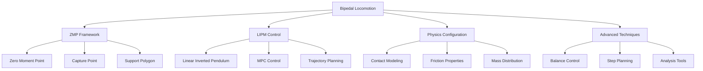

# Bipedal Locomotion in Isaac Sim

## Introduction to Humanoid Locomotion Simulation

Bipedal locomotion in Isaac Sim presents unique challenges due to the complex dynamics of walking, running, and balancing on two legs. Unlike wheeled robots, humanoid robots must manage intermittent contact with the ground, maintain balance during gait transitions, and handle complex multi-body dynamics during locomotion. Isaac Sim's GPU-accelerated physics engine and realistic contact modeling make it an ideal platform for developing and testing bipedal locomotion algorithms.

Key challenges in bipedal locomotion:
- **Intermittent Contact**: Feet make and break contact with the ground during walking
- **Balance Control**: Maintaining stability during single and double support phases
- **Dynamic Transitions**: Smooth transitions between different gaits and poses
- **Contact Stability**: Ensuring stable foot-ground interactions during locomotion

## Physics-Based Locomotion Models

### Zero Moment Point (ZMP) Framework

The Zero Moment Point (ZMP) is a fundamental concept in humanoid locomotion that helps maintain balance during walking:

```python
# zmp_locomotion.py
import numpy as np
import math

class ZMPBasedLocomotion:
    def __init__(self, com_height=0.85, gravity=9.81):
        self.com_height = com_height  # Center of mass height (meters)
        self.gravity = gravity
        self.omega = math.sqrt(gravity / com_height)  # Natural frequency

        # State variables
        self.com_position = np.array([0.0, 0.0, com_height])  # [x, y, z]
        self.com_velocity = np.array([0.0, 0.0, 0.0])        # [vx, vy, vz]
        self.com_acceleration = np.array([0.0, 0.0, 0.0])    # [ax, ay, az]

        # Walking parameters
        self.step_length = 0.3  # Distance between feet (meters)
        self.step_width = 0.2   # Lateral distance between feet (meters)
        self.step_period = 0.8  # Time per step (seconds)
        self.nominal_com_height = com_height

    def calculate_zmp(self, com_pos, com_acc):
        """
        Calculate Zero Moment Point based on center of mass position and acceleration
        ZMP_x = CoM_x - (g / CoM_z_dd) * (CoM_z - z_ref)
        """
        if abs(com_acc[2]) > 0.1:  # Avoid division by small accelerations
            zmp_x = com_pos[0] - (self.gravity / com_acc[2]) * (com_pos[2] - self.nominal_com_height)
            zmp_y = com_pos[1] - (self.gravity / com_acc[2]) * (com_pos[2] - self.nominal_com_height)
        else:
            # If vertical acceleration is small, ZMP is approximately at CoM projection
            zmp_x = com_pos[0]
            zmp_y = com_pos[1]

        return np.array([zmp_x, zmp_y, 0.0])

    def calculate_capture_point(self, com_pos, com_vel):
        """
        Calculate capture point for balance control
        Capture Point = CoM + sqrt(h/g) * CoM_velocity
        """
        omega = math.sqrt(self.gravity / self.nominal_com_height)
        capture_point_x = com_pos[0] + (1.0 / omega) * com_vel[0]
        capture_point_y = com_pos[1] + (1.0 / omega) * com_vel[1]

        return np.array([capture_point_x, capture_point_y, 0.0])

    def is_balanced(self, zmp, support_polygon):
        """
        Check if the ZMP is within the support polygon
        """
        zmp_x, zmp_y = zmp[0], zmp[1]

        # Check if ZMP is within support polygon (simplified for rectangular support)
        min_x, max_x = support_polygon['x_range']
        min_y, max_y = support_polygon['y_range']

        return min_x <= zmp_x <= max_x and min_y <= zmp_y <= max_y

    def generate_footstep_plan(self, current_pos, target_pos, step_width=0.2):
        """
        Generate footstep plan based on target position
        """
        footsteps = []

        # Calculate distance and direction to target
        distance = math.sqrt((target_pos[0] - current_pos[0])**2 + (target_pos[1] - current_pos[1])**2)
        direction = math.atan2(target_pos[1] - current_pos[1], target_pos[0] - current_pos[0])

        # Calculate number of steps needed
        num_steps = int(distance / self.step_length) + 1

        for i in range(num_steps):
            # Alternate between left and right foot
            foot_offset = step_width / 2 if i % 2 == 0 else -step_width / 2

            # Calculate foot position
            step_distance = min(i * self.step_length, distance)
            foot_x = current_pos[0] + step_distance * math.cos(direction)
            foot_y = current_pos[1] + step_distance * math.sin(direction) + foot_offset

            foot_pos = np.array([foot_x, foot_y, 0.0])
            footsteps.append({
                'position': foot_pos,
                'step_number': i,
                'support_leg': 'left' if i % 2 == 0 else 'right',
                'time': i * self.step_period
            })

        return footsteps

    def update_balance_control(self, dt):
        """
        Update balance control based on current state
        """
        # Calculate current ZMP
        current_zmp = self.calculate_zmp(self.com_position, self.com_acceleration)

        # Calculate capture point
        capture_point = self.calculate_capture_point(self.com_position, self.com_velocity)

        # Define support polygon based on foot positions
        # (in real implementation, this would use actual foot positions)
        support_polygon = {
            'x_range': (-0.1, 0.1),  # Simplified support area
            'y_range': (-0.1, 0.1)
        }

        # Check balance status
        is_balanced = self.is_balanced(current_zmp, support_polygon)

        # Generate corrective actions if needed
        if not is_balanced:
            self.apply_balance_correction(current_zmp, capture_point)

    def apply_balance_correction(self, zmp, capture_point):
        """
        Apply balance correction when ZMP is outside support polygon
        """
        # This would adjust joint torques to move ZMP back to support polygon
        # For simulation, we'll just log the corrective action needed
        print(f"Balance correction needed! ZMP: {zmp[:2]}, Capture Point: {capture_point[:2]}")
```

### Linear Inverted Pendulum Model (LIPM)

The Linear Inverted Pendulum Model is a simplified representation used for humanoid balance and walking:

```python
# lipm_controller.py
import numpy as np
import math

class LinearInvertedPendulumModel:
    def __init__(self, com_height=0.85, gravity=9.81):
        self.com_height = com_height
        self.gravity = gravity
        self.omega = math.sqrt(gravity / com_height)

        # State: [x, y, vx, vy] (CoM position and velocity in x-y plane)
        self.state = np.array([0.0, 0.0, 0.0, 0.0])

        # Walking parameters
        self.nominal_com_height = com_height

    def update(self, zmp_ref, dt):
        """
        Update LIPM state given ZMP reference
        Dynamics: x_ddot = omega^2 * (x - zmp_x)
        """
        x, y, vx, vy = self.state
        zmp_x, zmp_y = zmp_ref

        # LIPM dynamics
        x_ddot = self.omega**2 * (x - zmp_x)
        y_ddot = self.omega**2 * (y - zmp_y)

        # Update state using numerical integration
        self.state[0] += vx * dt + 0.5 * x_ddot * dt**2  # x position
        self.state[1] += vy * dt + 0.5 * y_ddot * dt**2  # y position
        self.state[2] += x_ddot * dt  # x velocity
        self.state[3] += y_ddot * dt  # y velocity

    def get_com_position(self):
        """
        Get center of mass position
        """
        return np.array([self.state[0], self.state[1], self.nominal_com_height])

    def get_com_velocity(self):
        """
        Get center of mass velocity
        """
        return np.array([self.state[2], self.state[3], 0.0])

    def plan_footstep(self, current_support_pos, dt=0.1):
        """
        Plan next footstep based on current state
        """
        # Calculate where to place the foot to stop the CoM motion
        com_pos = self.get_com_position()
        com_vel = self.get_com_velocity()

        # Calculate the point where the CoM velocity will be zero after the step
        time_to_stop = 1.0 / self.omega  # Approximate time constant
        desired_stop_point = com_pos[:2] + (1.0 / self.omega) * com_vel[:2]

        # Place foot at the desired stop point
        footstep_pos = desired_stop_point

        return footstep_pos

class LIPMBasedWalkingController:
    def __init__(self, com_height=0.85):
        self.lipm = LinearInvertedPendulumModel(com_height)
        self.step_period = 0.8  # seconds per step
        self.step_width = 0.2   # meters
        self.nominal_step_length = 0.3

        # Walking state
        self.current_support_foot = "left"  # "left" or "right"
        self.support_foot_pos = np.array([0.0, 0.1])  # Initial foot position
        self.next_foot_pos = np.array([0.0, -0.1])    # Next foot position
        self.last_step_time = 0.0
        self.walking_velocity = np.array([0.3, 0.0])  # Target walking velocity

    def update_walking(self, current_time, dt):
        """
        Update walking controller state
        """
        # Calculate ZMP reference based on walking pattern
        zmp_ref = self.calculate_zmp_reference(current_time)

        # Update LIPM with ZMP reference
        self.lipm.update(zmp_ref, dt)

        # Check if it's time for next step
        if current_time - self.last_step_time > self.step_period:
            # Plan next footstep
            self.next_foot_pos = self.plan_next_footstep()

            # Switch support foot
            self.current_support_foot = "right" if self.current_support_foot == "left" else "left"
            self.support_foot_pos = self.next_foot_pos.copy()
            self.last_step_time = current_time

            print(f"Step {self.current_support_foot} foot at {self.support_foot_pos}")

    def calculate_zmp_reference(self, current_time):
        """
        Calculate ZMP reference trajectory for walking
        """
        # For forward walking, ZMP oscillates between feet
        phase = (current_time % self.step_period) / self.step_period

        if self.current_support_foot == "left":
            # Left foot is support foot
            zmp_x = self.support_foot_pos[0]
            zmp_y = self.support_foot_pos[1]
        else:
            # Right foot is support foot
            zmp_x = self.support_foot_pos[0]
            zmp_y = self.support_foot_pos[1]

        # Add small periodic modulation for natural walking
        modulation = 0.02 * math.sin(2 * math.pi * current_time)
        zmp_x += modulation

        return np.array([zmp_x, zmp_y])

    def plan_next_footstep(self):
        """
        Plan the next footstep position
        """
        # Calculate where to place the next foot
        com_pos = self.lipm.get_com_position()
        com_vel = self.lipm.get_com_velocity()

        # Simple walking pattern: place foot ahead of CoM
        if self.current_support_foot == "left":
            # Next foot is right foot
            foot_x = com_pos[0] + self.nominal_step_length
            foot_y = self.support_foot_pos[1] - self.step_width
        else:
            # Next foot is left foot
            foot_x = com_pos[0] + self.nominal_step_length
            foot_y = self.support_foot_pos[1] + self.step_width

        return np.array([foot_x, foot_y])
```

## Isaac Sim Implementation for Bipedal Locomotion

### Physics Configuration for Locomotion

Proper physics configuration is essential for stable bipedal locomotion in Isaac Sim:

```python
# locomotion_physics_config.py
import omni
from pxr import PhysxSchema, UsdPhysics
import carb

class LocomotionPhysicsConfigurator:
    def __init__(self, stage):
        self.stage = stage

    def configure_locomotion_physics(self):
        """
        Configure physics settings optimized for bipedal locomotion
        """
        # Get physics scene
        scene_path = "/physicsScene"
        scene_prim = self.stage.GetPrimAtPath(scene_path)

        if not scene_prim.IsValid():
            carb.log_error(f"Physics scene not found at {scene_path}")
            return False

        # Apply PhysX scene API
        physx_scene_api = PhysxSchema.PhysxSceneAPI.Apply(scene_prim)

        # Configure solver settings for locomotion stability
        physx_scene_api.GetSolverTypeAttr().Set("TGS")  # Use TGS solver for better stability
        physx_scene_api.GetMaxPositionIterationsAttr().Set(20)  # Higher for stability
        physx_scene_api.GetMaxVelocityIterationsAttr().Set(10)   # Higher for stability

        # Configure contact settings for foot-ground interaction
        scene_prim.GetAttribute("physics:sleepThreshold").Set(0.001)  # Lower for sensitivity
        scene_prim.GetAttribute("physics:stabilizationThreshold").Set(0.01)

        # Enable GPU acceleration for physics
        physx_scene_api.GetUseGpuAttr().Set(True)
        physx_scene_api.GetBroadphaseTypeAttr().Set("GPU")
        physx_scene_api.GetGpuMaxPrimsAttr().Set(131072)

        # Configure time stepping for locomotion
        scene_prim.GetAttribute("physics:timeStepsPerSecond").Set(1000)  # 1000 Hz for locomotion
        scene_prim.GetAttribute("physics:enableCCD").Set(True)  # Enable CCD for foot collisions

        carb.log_info("Physics configured for bipedal locomotion")

        return True

    def configure_foot_contact_properties(self, foot_path, foot_name="foot"):
        """
        Configure contact properties for foot-ground interaction
        """
        foot_prim = self.stage.GetPrimAtPath(foot_path)

        if not foot_prim.IsValid():
            carb.log_error(f"Foot prim not found at {foot_path}")
            return False

        # Apply material properties for good grip
        material_api = UsdPhysics.MaterialAPI.Apply(foot_prim)
        material_api.GetStaticFrictionAttr().Set(1.0)    # High static friction for grip
        material_api.GetDynamicFrictionAttr().Set(0.8)   # High dynamic friction
        material_api.GetRestitutionAttr().Set(0.05)      # Low restitution for stable contact

        # Apply PhysX-specific properties
        physx_material_api = PhysxSchema.PhysxMaterialAPI.Apply(foot_prim)
        physx_material_api.GetFrictionCombineModeAttr().Set("multiply")
        physx_material_api.GetRestitutionCombineModeAttr().Set("average")

        # Enable contact reporting for force sensing
        physx_rigid_body_api = PhysxSchema.PhysxRigidBodyAPI.Apply(foot_prim)
        physx_rigid_body_api.GetReportContactForceAttr().Set(True)
        physx_rigid_body_api.GetMinContactForceAttr().Set(0.1)

        # Configure contact offset for stability
        physx_rigid_body_api.GetContactOffsetAttr().Set(0.01)  # 1cm contact offset
        physx_rigid_body_api.GetRestOffsetAttr().Set(0.0)      # No rest offset

        carb.log_info(f"Contact properties configured for {foot_name} foot")

        return True

    def configure_ground_properties(self, ground_path="/World/GroundPlane"):
        """
        Configure ground properties for locomotion
        """
        ground_prim = self.stage.GetPrimAtPath(ground_path)

        if not ground_prim.IsValid():
            carb.log_error(f"Ground prim not found at {ground_path}")
            return False

        # Apply material properties for good foot contact
        material_api = UsdPhysics.MaterialAPI.Apply(ground_prim)
        material_api.GetStaticFrictionAttr().Set(0.9)    # High static friction
        material_api.GetDynamicFrictionAttr().Set(0.8)   # High dynamic friction
        material_api.GetRestitutionAttr().Set(0.1)       # Low restitution

        # Make ground static
        rigid_body_api = UsdPhysics.RigidBodyAPI.Apply(ground_prim)
        rigid_body_api.GetRigidBodyEnabledAttr().Set(False)

        carb.log_info("Ground properties configured for locomotion")

        return True

    def setup_force_plate_sensors(self, robot_path="/World/HumanoidRobot"):
        """
        Set up force plate sensors for locomotion analysis
        """
        # Create force plate under feet
        from omni.isaac.core.utils.prims import create_prim
        from pxr import Gf

        # Left foot force plate
        left_force_plate_path = f"{robot_path}/left_foot_force_plate"
        create_prim(
            prim_path=left_force_plate_path,
            prim_type="Box",
            position=Gf.Vec3d(0, 0, 0.01),  # Slightly above ground
            scale=Gf.Vec3d(0.2, 0.1, 0.01)  # Foot-sized plate
        )

        # Right foot force plate
        right_force_plate_path = f"{robot_path}/right_foot_force_plate"
        create_prim(
            prim_path=right_force_plate_path,
            prim_type="Box",
            position=Gf.Vec3d(0, 0, 0.01),
            scale=Gf.Vec3d(0.2, 0.1, 0.01)
        )

        # Configure force plates
        for plate_path in [left_force_plate_path, right_force_plate_path]:
            plate_prim = self.stage.GetPrimAtPath(plate_path)
            if plate_prim:
                # Make static
                rigid_body_api = UsdPhysics.RigidBodyAPI.Apply(plate_prim)
                rigid_body_api.GetRigidBodyEnabledAttr().Set(False)

                # Enable force reporting
                physx_rigid_body_api = PhysxSchema.PhysxRigidBodyAPI.Apply(plate_prim)
                physx_rigid_body_api.GetReportContactForceAttr().Set(True)

        carb.log_info("Force plate sensors configured for locomotion analysis")
```

### Joint Control for Walking

Implementing proper joint control is crucial for stable walking:

```python
# walking_controller.py
import numpy as np
import math

class WalkingController:
    def __init__(self, robot_articulation):
        self.robot = robot_articulation
        self.num_dof = robot_articulation.num_dof
        self.joint_names = robot_articulation.dof_names

        # Walking gait parameters
        self.step_height = 0.05  # Height to lift foot during swing phase
        self.step_length = 0.3   # Forward distance per step
        self.step_period = 0.8   # Time per step (seconds)
        self.nominal_com_height = 0.85  # Nominal CoM height

        # Control gains
        self.position_gain = 100.0
        self.velocity_gain = 10.0
        self.max_effort = 200.0

        # Walking state
        self.current_gait_phase = 0.0  # 0.0 to 1.0 (0% to 100% of step cycle)
        self.step_count = 0
        self.is_walking = False

        # Joint angle references for walking
        self.nominal_joint_positions = np.zeros(self.num_dof)
        self.standing_joint_positions = np.zeros(self.num_dof)

    def start_walking(self):
        """
        Start the walking controller
        """
        self.is_walking = True
        self.current_gait_phase = 0.0
        self.step_count = 0
        print("Walking controller started")

    def stop_walking(self):
        """
        Stop the walking controller
        """
        self.is_walking = False
        print("Walking controller stopped")

    def update_walking_control(self, dt):
        """
        Update walking control based on current gait phase
        """
        if not self.is_walking:
            return

        # Update gait phase
        self.current_gait_phase += dt / self.step_period
        if self.current_gait_phase >= 1.0:
            self.current_gait_phase = 0.0
            self.step_count += 1

        # Calculate joint references based on gait phase
        target_positions = self.calculate_gait_joints(self.current_gait_phase)

        # Apply control
        current_positions = self.robot.get_joint_positions()
        position_errors = target_positions - current_positions

        # Simple PD control
        efforts = self.position_gain * position_errors

        # Apply effort limits
        efforts = np.clip(efforts, -self.max_effort, self.max_effort)

        # Apply to robot
        self.robot.set_joint_efforts(efforts)

    def calculate_gait_joints(self, phase):
        """
        Calculate joint positions for current gait phase
        """
        target_positions = self.standing_joint_positions.copy()

        # Calculate walking pattern based on phase
        # This is a simplified walking pattern - real implementation would be more complex

        # Left leg (stance phase) and right leg (swing phase) in first half of cycle
        if phase < 0.5:
            # Right leg swing phase
            right_swing_progress = phase * 2  # 0 to 1 during swing

            # Lift right foot
            right_knee_idx = self.get_joint_index("right_knee")
            right_hip_pitch_idx = self.get_joint_index("right_hip_pitch")
            right_ankle_pitch_idx = self.get_joint_index("right_ankle_pitch")

            if right_knee_idx is not None:
                # Bend knee to lift foot
                target_positions[right_knee_idx] = 0.5 + 0.5 * math.sin(math.pi * right_swing_progress)

            if right_hip_pitch_idx is not None:
                # Move hip forward
                target_positions[right_hip_pitch_idx] = -0.2 + 0.4 * right_swing_progress

            if right_ankle_pitch_idx is not None:
                # Adjust ankle for smooth landing
                target_positions[right_ankle_pitch_idx] = 0.1 - 0.2 * right_swing_progress

            # Left leg stance phase - keep stable
            left_knee_idx = self.get_joint_index("left_knee")
            if left_knee_idx is not None:
                target_positions[left_knee_idx] = 0.1  # Slightly bent for stability

        else:
            # Left leg swing phase, right leg stance phase
            left_swing_progress = (phase - 0.5) * 2  # 0 to 1 during swing

            # Lift left foot
            left_knee_idx = self.get_joint_index("left_knee")
            left_hip_pitch_idx = self.get_joint_index("left_hip_pitch")
            left_ankle_pitch_idx = self.get_joint_index("left_ankle_pitch")

            if left_knee_idx is not None:
                target_positions[left_knee_idx] = 0.5 + 0.5 * math.sin(math.pi * left_swing_progress)

            if left_hip_pitch_idx is not None:
                target_positions[left_hip_pitch_idx] = -0.2 + 0.4 * left_swing_progress

            if left_ankle_pitch_idx is not None:
                target_positions[left_ankle_pitch_idx] = 0.1 - 0.2 * left_swing_progress

            # Right leg stance phase
            right_knee_idx = self.get_joint_index("right_knee")
            if right_knee_idx is not None:
                target_positions[right_knee_idx] = 0.1

        # Add balance adjustments
        target_positions = self.add_balance_adjustments(target_positions, phase)

        return target_positions

    def add_balance_adjustments(self, joint_positions, phase):
        """
        Add balance adjustments to joint positions
        """
        # Simple balance adjustments based on phase
        # In real implementation, this would use sensor feedback

        # Adjust torso for balance
        torso_yaw_idx = self.get_joint_index("torso_yaw")
        if torso_yaw_idx is not None:
            # Slight counter-rotation based on step phase
            balance_adjustment = 0.1 * math.sin(2 * math.pi * phase)
            joint_positions[torso_yaw_idx] += balance_adjustment

        # Adjust hip roll for lateral balance
        left_hip_roll_idx = self.get_joint_index("left_hip_roll")
        right_hip_roll_idx = self.get_joint_index("right_hip_roll")

        if left_hip_roll_idx is not None and right_hip_roll_idx is not None:
            # Shift weight to support leg
            if phase < 0.5:
                # Right leg is swing phase, left is stance - shift weight left
                joint_positions[left_hip_roll_idx] -= 0.05
                joint_positions[right_hip_roll_idx] += 0.05
            else:
                # Left leg is swing phase, right is stance - shift weight right
                joint_positions[left_hip_roll_idx] += 0.05
                joint_positions[right_hip_roll_idx] -= 0.05

        return joint_positions

    def get_joint_index(self, joint_name):
        """
        Get the index of a joint by name
        """
        try:
            return self.joint_names.index(joint_name)
        except ValueError:
            return None

    def set_walking_speed(self, speed):
        """
        Set the walking speed (adjusts step length and period)
        """
        # Adjust step length based on desired speed
        self.step_length = max(0.1, min(0.5, speed * 0.5))  # Clamp between 0.1 and 0.5m

        # Adjust step period based on speed (faster walking = shorter steps, faster cadence)
        self.step_period = max(0.4, min(1.2, 0.8 - (speed - 0.3) * 0.5))

        print(f"Walking speed set: step_length={self.step_length:.2f}m, period={self.step_period:.2f}s")

class BalanceController:
    def __init__(self, robot_articulation):
        self.robot = robot_articulation
        self.com_estimator = COMEstimator()
        self.zmp_calculator = ZMPBasedLocomotion()

    def update_balance(self):
        """
        Update balance control based on current state
        """
        # Estimate current CoM state
        com_pos, com_vel, com_acc = self.com_estimator.estimate_com_state(self.robot)

        # Calculate ZMP
        zmp = self.zmp_calculator.calculate_zmp(com_pos, com_acc)

        # Check if robot is balanced
        support_polygon = self.estimate_support_polygon()
        is_balanced = self.zmp_calculator.is_balanced(zmp, support_polygon)

        if not is_balanced:
            # Apply balance correction
            self.apply_balance_correction(zmp, com_pos, com_vel)

    def estimate_support_polygon(self):
        """
        Estimate the support polygon based on foot positions
        """
        # This would use actual foot positions in real implementation
        return {
            'x_range': (-0.1, 0.1),
            'y_range': (-0.1, 0.1)
        }

    def apply_balance_correction(self, zmp, com_pos, com_vel):
        """
        Apply balance correction torques
        """
        # Calculate corrective torques based on ZMP error
        zmp_error = zmp[:2] - com_pos[:2]  # Simplified for example

        # Apply corrective joint torques
        # This would use inverse kinematics in real implementation
        pass

class COMEstimator:
    def estimate_com_state(self, robot):
        """
        Estimate center of mass position, velocity, and acceleration
        """
        # This would interface with robot state in real implementation
        # For simulation, return dummy values
        com_pos = np.array([0.0, 0.0, 0.85])
        com_vel = np.array([0.0, 0.0, 0.0])
        com_acc = np.array([0.0, 0.0, 0.0])

        return com_pos, com_vel, com_acc
```

## Advanced Locomotion Techniques

### Model Predictive Control (MPC) for Walking

Model Predictive Control can provide more sophisticated walking control:

```python
# mpc_locomotion.py
import numpy as np
import cvxpy as cp
import math

class ModelPredictiveController:
    def __init__(self, com_height=0.85, prediction_horizon=10, dt=0.1):
        self.com_height = com_height
        self.gravity = 9.81
        self.omega = math.sqrt(self.gravity / com_height)
        self.prediction_horizon = prediction_horizon
        self.dt = dt

        # MPC parameters
        self.Q = np.eye(4) * 10  # State cost matrix
        self.R = np.eye(2) * 1   # Control cost matrix
        self.P = np.eye(4) * 50  # Terminal cost matrix

    def solve_mpc(self, current_state, desired_trajectory, support_feet):
        """
        Solve MPC problem for walking control
        State: [x, y, vx, vy] (CoM position and velocity)
        Control: [zmp_x, zmp_y] (ZMP reference)
        """
        # Define optimization variables
        X = cp.Variable((4, self.prediction_horizon + 1))  # State trajectory
        U = cp.Variable((2, self.prediction_horizon))      # Control trajectory

        # Define cost function
        cost = 0

        # Running cost
        for k in range(self.prediction_horizon):
            state_error = X[:, k] - desired_trajectory[k]
            control_effort = U[:, k]
            cost += cp.quad_form(state_error, self.Q) + cp.quad_form(control_effort, self.R)

        # Terminal cost
        terminal_error = X[:, -1] - desired_trajectory[-1]
        cost += cp.quad_form(terminal_error, self.P)

        # Define constraints
        constraints = []

        # Initial state constraint
        constraints.append(X[:, 0] == current_state)

        # Dynamics constraints (LIPM dynamics)
        for k in range(self.prediction_horizon):
            x_k, y_k, vx_k, vy_k = X[0, k], X[1, k], X[2, k], X[3, k]
            zmp_x_k, zmp_y_k = U[0, k], U[1, k]

            # LIPM dynamics: x_ddot = omega^2 * (x - zmp_x)
            next_vx = vx_k + (self.omega**2 * (x_k - zmp_x_k)) * self.dt
            next_vy = vy_k + (self.omega**2 * (y_k - zmp_y_k)) * self.dt
            next_x = x_k + vx_k * self.dt + 0.5 * (self.omega**2 * (x_k - zmp_x_k)) * self.dt**2
            next_y = y_k + vy_k * self.dt + 0.5 * (self.omega**2 * (y_k - zmp_y_k)) * self.dt**2

            constraints.append(X[0, k+1] == next_x)
            constraints.append(X[1, k+1] == next_y)
            constraints.append(X[2, k+1] == next_vx)
            constraints.append(X[3, k+1] == next_vy)

        # Support polygon constraints
        for k in range(self.prediction_horizon):
            # ZMP must be within support polygon
            # This would be specific to current support foot
            support_polygon = self.get_support_polygon_at_time(support_feet, k * self.dt)
            constraints.append(U[0, k] >= support_polygon['min_x'])
            constraints.append(U[0, k] <= support_polygon['max_x'])
            constraints.append(U[1, k] >= support_polygon['min_y'])
            constraints.append(U[1, k] <= support_polygon['max_y'])

        # Solve optimization problem
        problem = cp.Problem(cp.Minimize(cost), constraints)
        try:
            problem.solve(solver=cp.ECOS, verbose=False)
        except Exception as e:
            print(f"MPC solve failed: {e}")
            return None

        if problem.status not in ["optimal", "optimal_inaccurate"]:
            print(f"MPC solve status: {problem.status}")
            return None

        # Return first control input
        first_control = U[:, 0].value
        return first_control

    def get_support_polygon_at_time(self, support_feet, time):
        """
        Get support polygon based on which feet are in contact at given time
        """
        # Determine which foot is supporting based on walking phase
        # This is a simplified implementation
        if int(time / 0.4) % 2 == 0:  # Alternate every 0.4s
            # Left foot support
            return {'min_x': -0.1, 'max_x': 0.1, 'min_y': 0.05, 'max_y': 0.25}
        else:
            # Right foot support
            return {'min_x': -0.1, 'max_x': 0.1, 'min_y': -0.25, 'max_y': -0.05}

class MPCLocomotionController:
    def __init__(self, com_height=0.85):
        self.mpc = ModelPredictiveController(com_height)
        self.lipm = LinearInvertedPendulumModel(com_height)
        self.current_state = np.array([0.0, 0.0, 0.0, 0.0])  # [x, y, vx, vy]

    def update_control(self, dt):
        """
        Update MPC-based locomotion control
        """
        # Generate desired trajectory (for walking, this would be a walking pattern)
        desired_trajectory = self.generate_desired_trajectory()

        # Get current support feet information
        support_feet = self.get_current_support_feet()

        # Solve MPC problem
        optimal_control = self.mpc.solve_mpc(
            self.current_state,
            desired_trajectory,
            support_feet
        )

        if optimal_control is not None:
            # Apply ZMP reference to LIPM
            self.lipm.update(optimal_control, dt)

            # Update current state
            self.current_state[0] = self.lipm.state[0]  # x
            self.current_state[1] = self.lipm.state[1]  # y
            self.current_state[2] = self.lipm.state[2]  # vx
            self.current_state[3] = self.lipm.state[3]  # vy

    def generate_desired_trajectory(self):
        """
        Generate desired CoM trajectory for walking
        """
        trajectory = []
        current_pos = self.lipm.get_com_position()
        current_vel = self.lipm.get_com_velocity()

        # Generate a simple walking trajectory
        for k in range(self.mpc.prediction_horizon + 1):
            time_ahead = k * self.mpc.dt
            # Simple forward walking pattern
            x_desired = current_pos[0] + 0.3 * time_ahead  # Walk forward at 0.3 m/s
            y_desired = current_pos[1] + 0.1 * math.sin(2 * math.pi * time_ahead)  # Slight side-to-side
            vx_desired = 0.3  # Desired forward velocity
            vy_desired = 0.1 * 2 * math.pi * math.cos(2 * math.pi * time_ahead)  # Derivative of y pattern

            trajectory.append(np.array([x_desired, y_desired, vx_desired, vy_desired]))

        return trajectory

    def get_current_support_feet(self):
        """
        Get information about current support feet
        """
        # This would interface with actual foot contact information
        return {
            'left_foot': {'position': [-0.1, 0.1, 0.0], 'in_contact': True},
            'right_foot': {'position': [-0.1, -0.1, 0.0], 'in_contact': False}
        }
```

## Locomotion Analysis and Visualization

### Tools for Locomotion Analysis

```python
# locomotion_analysis.py
import numpy as np
import matplotlib.pyplot as plt
from matplotlib.animation import FuncAnimation
import time

class LocomotionAnalyzer:
    def __init__(self):
        self.step_data = []
        self.balance_data = []
        self.trajectory_data = []

    def record_step_data(self, step_info):
        """
        Record data for step analysis
        """
        self.step_data.append({
            'timestamp': time.time(),
            'step_number': step_info.get('step_number', len(self.step_data)),
            'foot_position': step_info.get('position', [0, 0, 0]),
            'support_leg': step_info.get('support_leg', 'unknown'),
            'zmp': step_info.get('zmp', [0, 0]),
            'capture_point': step_info.get('capture_point', [0, 0])
        })

    def record_balance_data(self, balance_info):
        """
        Record balance data for analysis
        """
        self.balance_data.append({
            'timestamp': time.time(),
            'com_position': balance_info.get('com_position', [0, 0, 0]),
            'zmp': balance_info.get('zmp', [0, 0]),
            'is_balanced': balance_info.get('is_balanced', False),
            'support_polygon': balance_info.get('support_polygon', {})
        })

    def analyze_gait_performance(self):
        """
        Analyze gait performance metrics
        """
        if len(self.step_data) < 2:
            return {}

        # Calculate gait metrics
        step_times = [data['timestamp'] for data in self.step_data]
        step_durations = np.diff(step_times)

        # Step length consistency
        step_positions = [data['foot_position'] for data in self.step_data]
        step_lengths = []
        for i in range(1, len(step_positions)):
            dx = step_positions[i][0] - step_positions[i-1][0]
            dy = step_positions[i][1] - step_positions[i-1][1]
            step_lengths.append(math.sqrt(dx**2 + dy**2))

        metrics = {
            'step_frequency': 1.0 / np.mean(step_durations) if len(step_durations) > 0 else 0,
            'avg_step_duration': np.mean(step_durations) if len(step_durations) > 0 else 0,
            'std_step_duration': np.std(step_durations) if len(step_durations) > 0 else 0,
            'avg_step_length': np.mean(step_lengths) if len(step_lengths) > 0 else 0,
            'std_step_length': np.std(step_lengths) if len(step_lengths) > 0 else 0,
            'step_regularity': 1.0 - (np.std(step_durations) / np.mean(step_durations)) if len(step_durations) > 0 else 0
        }

        return metrics

    def visualize_locomotion(self):
        """
        Create visualization of locomotion data
        """
        if len(self.step_data) < 2:
            print("Not enough data for visualization")
            return

        # Extract data for plotting
        x_positions = [data['foot_position'][0] for data in self.step_data]
        y_positions = [data['foot_position'][1] for data in self.step_data]
        support_legs = [data['support_leg'] for data in self.step_data]

        # Create plot
        fig, (ax1, ax2) = plt.subplots(1, 2, figsize=(15, 6))

        # Plot 1: Footstep positions
        left_x = [x_positions[i] for i in range(len(x_positions)) if support_legs[i] == 'left']
        left_y = [y_positions[i] for i in range(len(y_positions)) if support_legs[i] == 'left']
        right_x = [x_positions[i] for i in range(len(x_positions)) if support_legs[i] == 'right']
        right_y = [y_positions[i] for i in range(len(y_positions)) if support_legs[i] == 'right']

        ax1.scatter(left_x, left_y, c='blue', label='Left Foot', s=100, alpha=0.7)
        ax1.scatter(right_x, right_y, c='red', label='Right Foot', s=100, alpha=0.7)
        ax1.plot(x_positions, y_positions, 'k--', alpha=0.5, label='CoM Path')

        ax1.set_xlabel('X Position (m)')
        ax1.set_ylabel('Y Position (m)')
        ax1.set_title('Footstep Pattern')
        ax1.legend()
        ax1.grid(True, alpha=0.3)

        # Plot 2: Step timing and length
        steps = list(range(len(step_positions)))
        step_lengths = []
        for i in range(1, len(step_positions)):
            dx = step_positions[i][0] - step_positions[i-1][0]
            dy = step_positions[i][1] - step_positions[i-1][1]
            step_lengths.append(math.sqrt(dx**2 + dy**2))

        # Add zero for first step
        step_lengths = [0] + step_lengths

        ax2.bar(steps, step_lengths, alpha=0.7, color='green')
        ax2.set_xlabel('Step Number')
        ax2.set_ylabel('Step Length (m)')
        ax2.set_title('Step Length Analysis')
        ax2.grid(True, alpha=0.3)

        plt.tight_layout()
        plt.show()

    def generate_locomotion_report(self):
        """
        Generate comprehensive locomotion analysis report
        """
        metrics = self.analyze_gait_performance()

        report = f"""
        Locomotion Analysis Report
        =========================

        Gait Performance Metrics:
        - Step Frequency: {metrics.get('step_frequency', 0):.2f} Hz
        - Average Step Duration: {metrics.get('avg_step_duration', 0):.3f} s
        - Step Duration Variance: {metrics.get('std_step_duration', 0):.3f} s
        - Average Step Length: {metrics.get('avg_step_length', 0):.3f} m
        - Step Length Variance: {metrics.get('std_step_length', 0):.3f} m
        - Step Regularity: {metrics.get('step_regularity', 0):.2f}

        Data Points Collected:
        - Steps Recorded: {len(self.step_data)}
        - Balance Samples: {len(self.balance_data)}
        - Trajectory Points: {len(self.trajectory_data)}
        """

        print(report)
        return report
```

## Best Practices for Bipedal Locomotion in Isaac Sim

### Implementation Guidelines

1. **Physics Configuration**: Use appropriate friction, contact parameters, and solver settings
2. **Control Frequency**: Maintain high control frequency (500Hz+) for stable locomotion
3. **Balance Control**: Implement ZMP-based or MPC-based balance control
4. **Foot Design**: Design feet with appropriate geometry and friction properties
5. **Gradual Complexity**: Start with simple stepping before attempting walking

### Performance Optimization

- **Simulation Rate**: Use appropriate physics substeps for stability
- **Collision Geometry**: Use simple collision shapes for feet for performance
- **Solver Settings**: Tune solver iterations for balance between stability and performance
- **Mass Distribution**: Ensure realistic mass distribution for natural dynamics



## Troubleshooting Common Locomotion Issues

### Stability Problems and Solutions

- **Falling Forward**: Increase ankle stiffness or adjust CoM position
- **Lateral Instability**: Improve hip control and weight shifting
- **Foot Penetration**: Adjust contact parameters and collision geometry
- **Oscillatory Motion**: Tune control gains and increase solver iterations

### Performance Issues

- **Slow Simulation**: Simplify collision geometry and reduce unnecessary details
- **Jittery Motion**: Increase control frequency and tune control parameters
- **Energy Drift**: Ensure proper energy conservation in physics parameters

:::tip
Start with simple standing balance control before attempting walking. Master single support phase control before moving to dynamic walking patterns.
:::

:::warning
Bipedal locomotion is computationally intensive and requires careful tuning. Always validate control parameters in simulation before attempting on real hardware.
:::

## Summary

Bipedal locomotion in Isaac Sim requires sophisticated control strategies combined with accurate physics simulation to achieve stable walking patterns. The combination of ZMP-based control, proper physics configuration, and advanced techniques like MPC enables the development of robust humanoid walking controllers that can be tested safely in simulation before deployment on real robots.

In the next section, we'll explore advanced features in Isaac Sim, including multi-robot scenarios, AI-assisted scene creation, and specialized tools for humanoid robotics development.