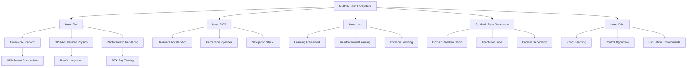
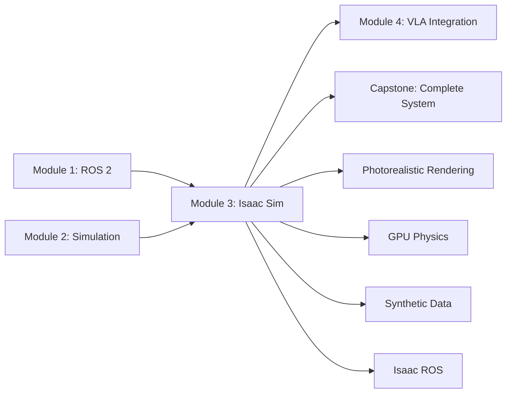

# Introduction to NVIDIA Isaac Sim for Humanoid Robotics

## Learning Objectives

After completing this module, you will be able to:
- Understand the NVIDIA Isaac ecosystem and its role in humanoid robotics development
- Configure Isaac Sim for photorealistic humanoid robot simulation
- Implement GPU-accelerated physics simulation for complex humanoid models
- Generate synthetic data for vision-language-action (VLA) model training
- Integrate Isaac Sim with ROS 2 for real-time humanoid control
- Optimize simulation environments for efficient training and testing

## Prerequisites

To get the most out of this module, you should have:
- Completion of Module 1 (ROS 2 fundamentals) and Module 2 (Simulation environments)
- Understanding of 3D graphics concepts and rendering pipelines
- Basic knowledge of GPU computing and CUDA
- Experience with USD (Universal Scene Description) format
- Familiarity with synthetic data generation concepts

## The NVIDIA Isaac Ecosystem for Humanoid Robotics

The NVIDIA Isaac ecosystem represents a significant advancement in robotics simulation, particularly for humanoid robots that require photorealistic rendering, accurate physics simulation, and large-scale synthetic data generation. As of 2025, Isaac Sim has become the standard for developing and testing complex humanoid robots in virtual environments that closely match real-world conditions.

The Isaac ecosystem includes several key components:
- **Isaac Sim**: The core simulation application built on Omniverse
- **Isaac ROS**: GPU-accelerated perception and navigation packages
- **Isaac Lab**: Framework for robot learning research
- **Synthetic Data Generation (SDG)**: Tools for creating training data
- **Isaac Orbit**: Advanced robot learning environment



## Why Isaac Sim for Humanoid Robotics?

Humanoid robots present unique challenges that require the advanced capabilities of Isaac Sim:

### Photorealistic Rendering for Vision Systems

Unlike traditional simulation environments, Isaac Sim provides photorealistic rendering capabilities essential for training vision systems:

- **RTX Ray Tracing**: Accurate lighting simulation with global illumination
- **Physically-Based Rendering (PBR)**: Realistic material properties
- **Multi-camera Systems**: Support for complex sensor arrays
- **Dynamic Lighting**: Time-of-day and weather variation simulation

### GPU-Accelerated Physics Simulation

Isaac Sim leverages NVIDIA's PhysX engine with GPU acceleration:

- **Multi-GPU Support**: Distributed physics computation
- **Large-scale Environments**: Thousands of objects with realistic physics
- **Complex Contact Models**: Accurate humanoid foot-ground interactions
- **Real-time Performance**: Maintaining 60+ FPS for interactive simulation

### Synthetic Data Generation for AI Training

Isaac Sim excels at generating large-scale synthetic datasets:

- **Domain Randomization**: Systematic variation of scene parameters
- **Automatic Annotation**: Ground truth generation for training data
- **Multi-modal Data**: RGB, depth, segmentation, and sensor data
- **Scalable Generation**: Cloud deployment for large datasets

## Isaac Sim Architecture for Humanoid Robotics

The architecture of Isaac Sim is specifically designed to handle the complexity of humanoid robots:

### USD-Based Scene Composition

Universal Scene Description (USD) provides a powerful foundation for complex humanoid scenes:

```python
# Example USD scene composition for humanoid robot
import omni
from pxr import Usd, UsdGeom, UsdPhysics, PhysxSchema

def create_humanoid_scene(stage, robot_path="/World/HumanoidRobot"):
    """
    Create a USD scene with a humanoid robot using Isaac Sim
    """
    # Create robot prim
    robot_prim = UsdGeom.Xform.Define(stage, robot_path)

    # Add physics properties
    robot_physics = UsdPhysics.RigidBodyAPI.Apply(robot_prim.GetPrim())
    robot_physics.CreatePhysicsMassGroupPath().Set(robot_path + "/MassGroup")

    # Configure PhysX properties
    physx_api = PhysxSchema.PhysxRigidBodyAPI.Apply(robot_prim.GetPrim())
    physx_api.CreateSleepThresholdAttr(0.001)
    physx_api.CreateStabilizationThresholdAttr(0.002)

    return robot_prim
```

### GPU-Accelerated Perception Pipeline

Isaac Sim provides GPU-accelerated perception nodes:

- **Isaac ROS Image Pipeline**: Real-time image processing
- **GPU-accelerated Computer Vision**: Feature detection, tracking, segmentation
- **LiDAR Simulation**: Accurate point cloud generation
- **IMU and Force/Torque Simulation**: Physics-correct sensor data

## Key Concepts in Isaac Sim

### Omniverse Platform Integration

Isaac Sim is built on NVIDIA's Omniverse platform, providing:

- **Real-time Collaboration**: Multiple users can work in the same simulation
- **USD Exchange**: Seamless integration with 3D content creation tools
- **Multi-app Framework**: Integration with other Omniverse applications
- **Cloud Scalability**: Deployment on NVIDIA DGX systems

### PhysX Physics Engine

The PhysX engine provides advanced physics simulation:

- **Multi-resolution Simulation**: Different parts of the scene can have different physics detail
- **Adaptive Timestepping**: Optimal performance for different simulation components
- **Contact Graph Processing**: Efficient handling of complex contact scenarios
- **GPU Acceleration**: Physics computation offloaded to GPU

### Synthetic Data Generation Pipeline

The SDG pipeline enables large-scale dataset creation:

- **Domain Randomization**: Systematic variation of lighting, textures, and objects
- **Automatic Annotation**: Semantic segmentation, instance segmentation, bounding boxes
- **Multi-view Generation**: Simultaneous capture from multiple cameras
- **Sensor Fusion**: Combined data from multiple sensor modalities

## Setting Up Isaac Sim for Humanoid Robotics

### System Requirements

For optimal humanoid robot simulation with Isaac Sim:

- **GPU**: NVIDIA RTX 4090, RTX 6000 Ada, or higher
- **VRAM**: 24GB+ recommended for complex humanoid models
- **CPU**: Multi-core processor (8+ cores, 3.0GHz+)
- **RAM**: 64GB+ for large scenes and synthetic data generation
- **Storage**: Fast SSD for scene loading and data generation

### Installation and Configuration

Isaac Sim can be installed in multiple ways:

1. **Docker Container**: Easiest deployment with pre-configured environment
2. **Isaac Sim Application**: Standalone application with GUI
3. **Isaac Sim Kit**: Custom applications built on Isaac Sim framework

```bash
# Example Isaac Sim Docker setup for humanoid robotics
docker run --gpus all -it \
  --rm \
  --network=host \
  --env="DISPLAY" \
  --env="QT_X11_NO_MITSHM=1" \
  --volume="/tmp/.X11-unix:/tmp/.X11-unix:rw" \
  --device=/dev/dri:/dev/dri \
  --privileged \
  nvcr.io/nvidia/isaac-sim:4.2.0

# Mount volumes for humanoid robot models and data
docker run --gpus all -it \
  --rm \
  --network=host \
  --env="DISPLAY" \
  --volume="/path/to/humanoid/models:/humanoid_models:ro" \
  --volume="/path/to/output:/output" \
  nvcr.io/nvidia/isaac-sim:4.2.0
```

## Isaac Sim vs. Traditional Simulation Environments

| Feature | Isaac Sim | Gazebo/Harmonic | Unity |
|---------|-----------|-----------------|-------|
| Photorealistic Rendering | ✅ Native RTX | ❌ Limited | ✅ Good |
| GPU Physics Acceleration | ✅ Multi-GPU | ❌ CPU-only | ❌ CPU-only |
| Synthetic Data Generation | ✅ Native tools | ❌ Limited | ❌ Limited |
| USD Integration | ✅ Native | ❌ No | ❌ No |
| Real-time Collaboration | ✅ Omniverse | ❌ No | ❌ No |
| ROS Integration | ✅ Isaac ROS | ✅ Native | ✅ Plugin |

## Module Structure Overview

This module is organized into the following sections:

1. **Isaac Sim Fundamentals**: Core concepts and setup for humanoid robotics
2. **Rendering and Materials**: Photorealistic rendering techniques
3. **Physics Simulation**: Advanced physics for humanoid locomotion
4. **Synthetic Data Generation**: Creating training datasets
5. **Isaac ROS Integration**: Connecting with ROS 2 ecosystem
6. **Bipedal Locomotion**: Humanoid-specific simulation techniques
7. **Advanced Features**: Multi-robot scenarios and AI-assisted creation
8. **Module Summary**: Key takeaways and next steps

## Integration with Previous Modules

This module builds upon the foundations established in:
- **Module 1**: ROS 2 concepts for communication between Isaac Sim and control systems
- **Module 2**: Simulation principles that apply to Isaac Sim with enhanced capabilities

The skills developed in this module will be essential for:
- **Module 4**: Vision-Language-Action integration using synthetic data from Isaac Sim
- **Capstone Project**: Complete humanoid robot system using Isaac Sim for development and testing



## Getting Started with Isaac Sim for Humanoid Robots

The following sections will guide you through setting up Isaac Sim for humanoid robot simulation, from basic scene creation to advanced photorealistic rendering and synthetic data generation. Each section includes practical examples specifically tailored for humanoid robotics applications.

:::tip
Start with simple humanoid models and gradually increase complexity. Isaac Sim's power can be overwhelming initially, but its capabilities are essential for advanced humanoid robotics development.
:::

:::warning
Isaac Sim requires significant computational resources. Ensure your system meets the requirements before attempting complex humanoid simulations. The GPU memory requirements can be substantial for detailed humanoid models with realistic physics.
:::

## Summary

NVIDIA Isaac Sim represents the cutting edge of robotics simulation, particularly for humanoid robots that require photorealistic rendering, accurate physics, and large-scale synthetic data generation. This module will provide you with the knowledge and skills to leverage Isaac Sim's advanced capabilities for humanoid robotics development, setting the foundation for the vision-language-action integration in the next module.

In the next section, we'll explore Isaac Sim fundamentals and get started with creating humanoid robot simulations in the Omniverse platform.