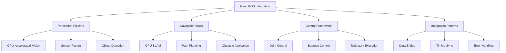

# Isaac ROS Integration for Humanoid Robotics

## Introduction to Isaac ROS

Isaac ROS is NVIDIA's collection of GPU-accelerated perception and navigation packages designed to bridge the gap between Isaac Sim and real-world robotic applications. For humanoid robots, Isaac ROS provides essential capabilities including GPU-accelerated computer vision, sensor processing, and navigation algorithms that can be seamlessly integrated with Isaac Sim for development and testing.

Key Isaac ROS capabilities:
- **GPU-accelerated perception**: Real-time processing of RGB, depth, and point cloud data
- **Sensor fusion**: Integration of multiple sensor modalities
- **Navigation stack**: GPU-accelerated SLAM and path planning
- **ROS 2 compatibility**: Full integration with ROS 2 ecosystem
- **Hardware acceleration**: Leverage NVIDIA GPUs for performance

## Isaac ROS Architecture for Humanoid Robots

### Isaac ROS Package Overview

Isaac ROS consists of several specialized packages that work together to provide GPU-accelerated robotics capabilities:

```python
# isaac_ros_architecture.py
import rclpy
from rclpy.node import Node
from sensor_msgs.msg import Image, CameraInfo, PointCloud2
from geometry_msgs.msg import PoseStamped
from nav_msgs.msg import Odometry
import numpy as np

class IsaacROSHumanoidInterface(Node):
    def __init__(self):
        super().__init__('isaac_ros_humanoid_interface')

        # Isaac ROS perception pipeline
        self.rgb_sub = self.create_subscription(
            Image,
            '/rgb/image_raw',
            self.rgb_callback,
            10
        )

        self.depth_sub = self.create_subscription(
            Image,
            '/depth/image_raw',
            self.depth_callback,
            10
        )

        self.camera_info_sub = self.create_subscription(
            CameraInfo,
            '/rgb/camera_info',
            self.camera_info_callback,
            10
        )

        # Isaac ROS navigation publishers
        self.odom_pub = self.create_publisher(
            Odometry,
            '/odom',
            10
        )

        self.pose_pub = self.create_publisher(
            PoseStamped,
            '/target_pose',
            10
        )

        # Isaac ROS perception publishers
        self.pointcloud_pub = self.create_publisher(
            PointCloud2,
            '/pointcloud',
            10
        )

        self.get_logger().info("Isaac ROS Humanoid Interface initialized")

    def rgb_callback(self, msg):
        """
        Process RGB image from Isaac Sim camera
        """
        # In Isaac ROS, this would interface with GPU-accelerated perception
        # For simulation, we'll just log the message
        self.get_logger().info(f"Received RGB image: {msg.width}x{msg.height}")

    def depth_callback(self, msg):
        """
        Process depth image from Isaac Sim camera
        """
        self.get_logger().info(f"Received depth image: {msg.width}x{msg.height}")

    def camera_info_callback(self, msg):
        """
        Process camera intrinsic parameters
        """
        self.get_logger().info(f"Camera info updated: {msg.k}")

    def process_humanoid_perception(self):
        """
        GPU-accelerated perception pipeline for humanoid robot
        """
        # This would use Isaac ROS perception packages:
        # - Isaac ROS Stereo DNN for object detection
        # - Isaac ROS Apriltag for pose estimation
        # - Isaac ROS Point Cloud for 3D reconstruction
        pass

    def publish_humanoid_odometry(self, position, orientation):
        """
        Publish odometry information for humanoid navigation
        """
        odom_msg = Odometry()
        odom_msg.header.stamp = self.get_clock().now().to_msg()
        odom_msg.header.frame_id = "odom"
        odom_msg.child_frame_id = "base_link"

        # Set position
        odom_msg.pose.pose.position.x = position[0]
        odom_msg.pose.pose.position.y = position[1]
        odom_msg.pose.pose.position.z = position[2]

        # Set orientation
        odom_msg.pose.pose.orientation.x = orientation[0]
        odom_msg.pose.pose.orientation.y = orientation[1]
        odom_msg.pose.pose.orientation.z = orientation[2]
        odom_msg.pose.pose.orientation.w = orientation[3]

        self.odom_pub.publish(odom_msg)
```

### Isaac ROS Perception Pipeline

The perception pipeline in Isaac ROS leverages GPU acceleration for real-time processing:

```python
# perception_pipeline.py
import rclpy
from rclpy.node import Node
from sensor_msgs.msg import Image, PointCloud2
from vision_msgs.msg import Detection2DArray, ObjectHypothesisWithPose
from geometry_msgs.msg import Point
import cv2
import numpy as np
from cv_bridge import CvBridge

class IsaacROSPerceptionPipeline(Node):
    def __init__(self):
        super().__init__('isaac_ros_perception_pipeline')

        self.bridge = CvBridge()

        # Input topics from Isaac Sim
        self.rgb_sub = self.create_subscription(
            Image,
            '/head_camera/rgb/image_raw',
            self.rgb_callback,
            10
        )

        self.depth_sub = self.create_subscription(
            Image,
            '/head_camera/depth/image_raw',
            self.depth_callback,
            10
        )

        # Output topics for perception results
        self.detection_pub = self.create_publisher(
            Detection2DArray,
            '/perception/detections',
            10
        )

        self.pointcloud_pub = self.create_publisher(
            PointCloud2,
            '/perception/pointcloud',
            10
        )

        # Isaac ROS-specific perception components
        self.setup_isaac_ros_components()

        self.get_logger().info("Isaac ROS Perception Pipeline initialized")

    def setup_isaac_ros_components(self):
        """
        Set up Isaac ROS perception components
        """
        # Isaac ROS Stereo DNN for object detection
        # Isaac ROS Image Pipeline for preprocessing
        # Isaac ROS Apriltag for pose estimation
        # Isaac ROS Point Cloud generation

        # For simulation purposes, we'll just log the setup
        self.get_logger().info("Isaac ROS perception components configured")

    def rgb_callback(self, msg):
        """
        Process RGB image using GPU-accelerated perception
        """
        try:
            # Convert ROS image to OpenCV
            cv_image = self.bridge.imgmsg_to_cv2(msg, "bgr8")

            # In Isaac ROS, this would be processed by GPU-accelerated nodes
            # For example: object detection, semantic segmentation, etc.
            processed_result = self.process_with_isaac_ros(cv_image)

            # Publish detection results
            self.publish_detections(processed_result)

        except Exception as e:
            self.get_logger().error(f"Error processing RGB image: {e}")

    def depth_callback(self, msg):
        """
        Process depth image for 3D reconstruction
        """
        try:
            # Convert depth image to point cloud using Isaac ROS
            pointcloud = self.create_pointcloud_from_depth(msg)
            self.pointcloud_pub.publish(pointcloud)

        except Exception as e:
            self.get_logger().error(f"Error processing depth image: {e}")

    def process_with_isaac_ros(self, image):
        """
        Simulate Isaac ROS GPU-accelerated processing
        """
        # In real Isaac ROS, this would use:
        # - Isaac ROS DNN nodes for object detection
        # - Isaac ROS stereo processing
        # - Isaac ROS image preprocessing

        # For simulation, return dummy detections
        detections = []

        # Example: detect humanoid body parts
        height, width = image.shape[:2]

        # Simulate detection of torso
        torso_detection = {
            'class': 'humanoid_torso',
            'confidence': 0.95,
            'bbox': [width*0.4, height*0.3, width*0.2, height*0.4]
        }
        detections.append(torso_detection)

        # Simulate detection of head
        head_detection = {
            'class': 'humanoid_head',
            'confidence': 0.92,
            'bbox': [width*0.45, height*0.1, width*0.1, height*0.15]
        }
        detections.append(head_detection)

        return detections

    def publish_detections(self, detections):
        """
        Publish detection results in ROS format
        """
        detection_array = Detection2DArray()
        detection_array.header.stamp = self.get_clock().now().to_msg()
        detection_array.header.frame_id = "head_camera_rgb_optical_frame"

        for detection in detections:
            detection_msg = Detection2D()
            detection_msg.header.stamp = detection_array.header.stamp
            detection_msg.header.frame_id = detection_array.header.frame_id

            # Set bounding box
            detection_msg.bbox.size_x = detection['bbox'][2]
            detection_msg.bbox.size_y = detection['bbox'][3]

            # Set center point
            center = Point()
            center.x = detection['bbox'][0] + detection['bbox'][2] / 2
            center.y = detection['bbox'][1] + detection['bbox'][3] / 2
            center.z = 0.0

            # Set hypothesis
            hypothesis = ObjectHypothesisWithPose()
            hypothesis.id = detection['class']
            hypothesis.score = detection['confidence']

            detection_msg.results.append(hypothesis)
            detection_array.detections.append(detection_msg)

        self.detection_pub.publish(detection_array)

    def create_pointcloud_from_depth(self, depth_msg):
        """
        Create point cloud from depth image using Isaac ROS methods
        """
        # In Isaac ROS, this would use GPU-accelerated point cloud generation
        # For simulation, return an empty point cloud
        pointcloud = PointCloud2()
        pointcloud.header = depth_msg.header
        return pointcloud
```

## Isaac Sim to Isaac ROS Bridge

### Connecting Isaac Sim and Isaac ROS

The bridge between Isaac Sim and Isaac ROS enables seamless data flow:

```python
# sim_ros_bridge.py
import omni
from omni.isaac.core.utils.stage import get_current_stage
from omni.isaac.core.utils.prims import get_prim_at_path
from omni.isaac.sensor import Camera
import carb
import numpy as np
from pxr import Gf

class IsaacSimROSBridge:
    def __init__(self, robot_path="/World/HumanoidRobot"):
        self.robot_path = robot_path
        self.cameras = {}
        self.sensors = {}

        # ROS 2 interface (this would be connected to ROS 2 node)
        self.ros_interface = None

    def setup_camera_bridge(self, camera_configs):
        """
        Set up camera bridge between Isaac Sim and ROS
        """
        for config in camera_configs:
            camera_path = f"{self.robot_path}/{config['name']}"

            # Create Isaac Sim camera
            camera = Camera(
                prim_path=camera_path,
                position=config["position"],
                frequency=config.get("frequency", 30),
                resolution=config.get("resolution", (640, 480))
            )

            # Configure camera parameters
            camera.config = {
                "focal_length": config.get("focal_length", 24.0),
                "horizontal_aperture": config.get("horizontal_aperture", 20.955),
                "clipping_range": config.get("clipping_range", (0.1, 1000.0))
            }

            # Set up Isaac Sim sensors
            camera.add_raw_image_to_frame()
            camera.add_depth_to_frame()

            self.cameras[config['name']] = camera

            # In Isaac ROS, this would connect to ROS publishers
            self.setup_ros_publisher(config['name'], config['type'])

        carb.log_info(f"Setup {len(self.cameras)} camera bridges")

    def setup_ros_publisher(self, camera_name, camera_type):
        """
        Set up ROS publisher for camera data
        """
        # This would create ROS publishers in Isaac ROS
        # For simulation, just log the setup
        carb.log_info(f"Setup ROS publisher for {camera_name} ({camera_type})")

    def setup_sensor_bridge(self, sensor_configs):
        """
        Set up sensor bridge for IMU, force/torque, etc.
        """
        for config in sensor_configs:
            sensor_path = f"{self.robot_path}/{config['name']}"

            # Create Isaac Sim sensor
            if config['type'] == 'imu':
                self.setup_imu_sensor(sensor_path, config)
            elif config['type'] == 'force_torque':
                self.setup_force_torque_sensor(sensor_path, config)
            elif config['type'] == 'lidar':
                self.setup_lidar_sensor(sensor_path, config)

            self.sensors[config['name']] = {
                'type': config['type'],
                'path': sensor_path,
                'config': config
            }

        carb.log_info(f"Setup {len(self.sensors)} sensor bridges")

    def setup_imu_sensor(self, sensor_path, config):
        """
        Set up IMU sensor in Isaac Sim
        """
        # In Isaac Sim, this would create an IMU sensor
        # For this example, we'll just log the setup
        carb.log_info(f"Setup IMU sensor at {sensor_path}")

    def setup_force_torque_sensor(self, sensor_path, config):
        """
        Set up force/torque sensor in Isaac Sim
        """
        # In Isaac Sim, this would create a force/torque sensor
        carb.log_info(f"Setup force/torque sensor at {sensor_path}")

    def setup_lidar_sensor(self, sensor_path, config):
        """
        Set up LiDAR sensor in Isaac Sim
        """
        # In Isaac Sim, this would create a LiDAR sensor
        carb.log_info(f"Setup LiDAR sensor at {sensor_path}")

    def bridge_sensor_data(self):
        """
        Bridge sensor data from Isaac Sim to ROS
        """
        # This would continuously bridge data from Isaac Sim to ROS
        for camera_name, camera in self.cameras.items():
            # Get camera data from Isaac Sim
            rgb_data = camera.get_rgb()
            depth_data = camera.get_depth()

            # Publish to ROS (in Isaac ROS)
            self.publish_to_ros(camera_name, 'rgb', rgb_data)
            self.publish_to_ros(camera_name, 'depth', depth_data)

        for sensor_name, sensor_info in self.sensors.items():
            # Get sensor data from Isaac Sim
            sensor_data = self.get_sensor_data(sensor_info['path'], sensor_info['type'])

            # Publish to ROS
            self.publish_to_ros(sensor_name, sensor_info['type'], sensor_data)

    def get_sensor_data(self, sensor_path, sensor_type):
        """
        Get sensor data from Isaac Sim
        """
        # In real implementation, this would interface with Isaac Sim sensors
        # For simulation, return dummy data
        if sensor_type == 'imu':
            return {
                'orientation': [0.0, 0.0, 0.0, 1.0],
                'angular_velocity': [0.0, 0.0, 0.0],
                'linear_acceleration': [0.0, 0.0, -9.81]
            }
        elif sensor_type == 'force_torque':
            return {
                'force': [0.0, 0.0, 0.0],
                'torque': [0.0, 0.0, 0.0]
            }
        else:
            return None

    def publish_to_ros(self, sensor_name, sensor_type, data):
        """
        Publish sensor data to ROS (Isaac ROS)
        """
        # This would publish data to ROS topics in Isaac ROS
        carb.log_info(f"Publishing {sensor_type} data from {sensor_name} to ROS")
```

## Isaac ROS Navigation Stack

### GPU-Accelerated Navigation for Humanoid Robots

Isaac ROS provides GPU-accelerated navigation capabilities:

```python
# navigation_stack.py
import rclpy
from rclpy.node import Node
from geometry_msgs.msg import PoseStamped, Twist
from nav_msgs.msg import Odometry, Path
from sensor_msgs.msg import LaserScan
from visualization_msgs.msg import MarkerArray
import numpy as np

class IsaacROSNavigationStack(Node):
    def __init__(self):
        super().__init__('isaac_ros_navigation_stack')

        # Navigation publishers
        self.cmd_vel_pub = self.create_publisher(
            Twist,
            '/cmd_vel',
            10
        )

        self.global_plan_pub = self.create_publisher(
            Path,
            '/plan',
            10
        )

        self.local_plan_pub = self.create_publisher(
            Path,
            '/local_plan',
            10
        )

        # Navigation subscribers
        self.odom_sub = self.create_subscription(
            Odometry,
            '/odom',
            self.odom_callback,
            10
        )

        self.scan_sub = self.create_subscription(
            LaserScan,
            '/scan',
            self.scan_callback,
            10
        )

        self.goal_sub = self.create_subscription(
            PoseStamped,
            '/move_base_simple/goal',
            self.goal_callback,
            10
        )

        # Isaac ROS navigation components
        self.setup_isaac_ros_navigation()

        self.current_pose = None
        self.goal_pose = None
        self.path = []

        self.get_logger().info("Isaac ROS Navigation Stack initialized")

    def setup_isaac_ros_navigation(self):
        """
        Set up Isaac ROS navigation components
        """
        # Isaac ROS includes GPU-accelerated SLAM, path planning, and control
        # Components include:
        # - Isaac ROS Occupancy Grid Map
        # - Isaac ROS Path Planner
        # - Isaac ROS Controller

        self.get_logger().info("Isaac ROS navigation components configured")

    def odom_callback(self, msg):
        """
        Process odometry data from robot
        """
        self.current_pose = msg.pose.pose

    def scan_callback(self, msg):
        """
        Process laser scan data for navigation
        """
        # In Isaac ROS, this would use GPU-accelerated obstacle detection
        # For simulation, just log the scan
        self.get_logger().info(f"Received laser scan with {len(msg.ranges)} points")

    def goal_callback(self, msg):
        """
        Process navigation goal
        """
        self.goal_pose = msg.pose
        self.get_logger().info(f"Received navigation goal: {msg.pose.position}")

        # Plan path to goal using Isaac ROS
        self.plan_path_to_goal()

    def plan_path_to_goal(self):
        """
        Plan path to goal using GPU-accelerated planners
        """
        if self.current_pose and self.goal_pose:
            # In Isaac ROS, this would use GPU-accelerated path planning
            # For simulation, create a simple straight-line path
            start_pos = self.current_pose.position
            goal_pos = self.goal_pose.position

            # Generate path points
            num_points = 10
            path = []

            for i in range(num_points + 1):
                t = i / num_points
                pos_x = start_pos.x + t * (goal_pos.x - start_pos.x)
                pos_y = start_pos.y + t * (goal_pos.y - start_pos.y)

                pose = PoseStamped()
                pose.header.stamp = self.get_clock().now().to_msg()
                pose.header.frame_id = "map"
                pose.pose.position.x = pos_x
                pose.pose.position.y = pos_y
                pose.pose.position.z = 0.0
                pose.pose.orientation.w = 1.0

                path.append(pose)

            self.path = path
            self.publish_global_plan()

    def publish_global_plan(self):
        """
        Publish global navigation plan
        """
        path_msg = Path()
        path_msg.header.stamp = self.get_clock().now().to_msg()
        path_msg.header.frame_id = "map"
        path_msg.poses = self.path

        self.global_plan_pub.publish(path_msg)
        self.get_logger().info(f"Published global plan with {len(self.path)} waypoints")

    def execute_navigation(self):
        """
        Execute navigation using Isaac ROS controllers
        """
        if self.path and self.current_pose:
            # Calculate velocity command based on path
            cmd_vel = Twist()

            # Simple proportional controller
            if self.path:
                target_pose = self.path[0].pose  # Next waypoint
                error_x = target_pose.position.x - self.current_pose.position.x
                error_y = target_pose.position.y - self.current_pose.position.y

                # Calculate distance to target
                distance = np.sqrt(error_x**2 + error_y**2)

                # Set velocity based on error
                if distance > 0.1:  # 10cm threshold
                    cmd_vel.linear.x = min(0.5, distance * 0.5)  # Max 0.5 m/s
                    cmd_vel.angular.z = np.arctan2(error_y, error_x) * 0.5
                else:
                    cmd_vel.linear.x = 0.0
                    cmd_vel.angular.z = 0.0

            self.cmd_vel_pub.publish(cmd_vel)
```

## Isaac ROS Control Framework

### GPU-Accelerated Control for Humanoid Robots

```python
# control_framework.py
import rclpy
from rclpy.node import Node
from sensor_msgs.msg import JointState
from control_msgs.msg import JointTrajectoryControllerState
from trajectory_msgs.msg import JointTrajectory, JointTrajectoryPoint
from std_msgs.msg import Float64MultiArray
import numpy as np

class IsaacROSControlFramework(Node):
    def __init__(self):
        super().__init__('isaac_ros_control_framework')

        # Control publishers
        self.joint_command_pub = self.create_publisher(
            JointTrajectory,
            '/joint_trajectory_controller/joint_trajectory',
            10
        )

        self.joint_state_pub = self.create_publisher(
            JointState,
            '/joint_states',
            10
        )

        # Control subscribers
        self.joint_state_sub = self.create_subscription(
            JointState,
            '/joint_states',
            self.joint_state_callback,
            10
        )

        self.control_command_sub = self.create_subscription(
            JointTrajectory,
            '/joint_trajectory_controller/joint_trajectory',
            self.control_command_callback,
            10
        )

        # Isaac ROS control components
        self.setup_isaac_ros_control()

        # Initialize joint states
        self.joint_names = [
            'left_hip_yaw', 'left_hip_roll', 'left_hip_pitch',
            'left_knee', 'left_ankle_pitch', 'left_ankle_roll',
            'right_hip_yaw', 'right_hip_roll', 'right_hip_pitch',
            'right_knee', 'right_ankle_pitch', 'right_ankle_roll',
            'left_shoulder_pitch', 'left_shoulder_roll', 'left_shoulder_yaw',
            'left_elbow', 'right_shoulder_pitch', 'right_shoulder_roll',
            'right_shoulder_yaw', 'right_elbow', 'torso_yaw'
        ]

        self.current_positions = {name: 0.0 for name in self.joint_names}
        self.current_velocities = {name: 0.0 for name in self.joint_names}
        self.current_efforts = {name: 0.0 for name in self.joint_names}

        self.get_logger().info("Isaac ROS Control Framework initialized")

    def setup_isaac_ros_control(self):
        """
        Set up Isaac ROS control components
        """
        # Isaac ROS includes GPU-accelerated control algorithms
        # Components include:
        # - Isaac ROS Joint Trajectory Controller
        # - Isaac ROS Impedance Controller
        # - Isaac ROS Model Predictive Control

        self.get_logger().info("Isaac ROS control components configured")

    def joint_state_callback(self, msg):
        """
        Update joint states from robot
        """
        for i, name in enumerate(msg.name):
            if name in self.current_positions:
                if i < len(msg.position):
                    self.current_positions[name] = msg.position[i]
                if i < len(msg.velocity):
                    self.current_velocities[name] = msg.velocity[i]
                if i < len(msg.effort):
                    self.current_efforts[name] = msg.effort[i]

    def control_command_callback(self, msg):
        """
        Process joint trajectory commands
        """
        # In Isaac ROS, this would use GPU-accelerated control algorithms
        # For simulation, just log the command
        self.get_logger().info(f"Received trajectory with {len(msg.points)} points")

    def send_joint_command(self, joint_positions, duration=1.0):
        """
        Send joint position commands to robot
        """
        traj_msg = JointTrajectory()
        traj_msg.header.stamp = self.get_clock().now().to_msg()
        traj_msg.joint_names = list(joint_positions.keys())

        # Create trajectory point
        point = JointTrajectoryPoint()
        point.positions = list(joint_positions.values())
        point.time_from_start.sec = int(duration)
        point.time_from_start.nanosec = int((duration - int(duration)) * 1e9)

        traj_msg.points.append(point)

        self.joint_command_pub.publish(traj_msg)
        self.get_logger().info(f"Sent joint command to {len(joint_positions)} joints")

    def move_to_pose(self, joint_targets, duration=2.0):
        """
        Move robot to target joint positions
        """
        self.send_joint_command(joint_targets, duration)

    def execute_balance_control(self):
        """
        Execute balance control using Isaac ROS
        """
        # In Isaac ROS, this would use GPU-accelerated balance algorithms
        # For humanoid robots, this includes ZMP control, capture point control

        # Example: maintain upright posture
        balance_targets = {}
        for joint_name in self.joint_names:
            if 'hip' in joint_name or 'ankle' in joint_name:
                # Keep legs in neutral position for balance
                balance_targets[joint_name] = 0.0
            elif 'shoulder' in joint_name or 'elbow' in joint_name:
                # Keep arms in neutral position
                balance_targets[joint_name] = 0.0
            else:
                # Keep other joints neutral
                balance_targets[joint_name] = 0.0

        # Add small adjustments for balance
        balance_targets['left_hip_roll'] = 0.05  # Slight hip adjustment for balance
        balance_targets['right_hip_roll'] = -0.05

        self.send_joint_command(balance_targets, 0.5)

    def execute_walking_pattern(self):
        """
        Execute walking pattern using Isaac ROS
        """
        # In Isaac ROS, this would use GPU-accelerated gait planning
        # For simulation, create a simple walking pattern

        # Define walking phases
        walking_phases = [
            # Phase 1: Shift weight to right leg
            {
                'left_hip_pitch': 0.1,
                'right_hip_pitch': -0.1,
                'left_knee': 0.0,
                'right_knee': 0.0
            },
            # Phase 2: Lift left leg
            {
                'left_hip_pitch': 0.3,
                'right_hip_pitch': -0.1,
                'left_knee': 0.5,
                'right_knee': 0.0
            },
            # Phase 3: Swing left leg forward
            {
                'left_hip_pitch': 0.2,
                'right_hip_pitch': -0.2,
                'left_knee': 0.3,
                'right_knee': 0.1
            },
            # Phase 4: Place left leg down
            {
                'left_hip_pitch': 0.05,
                'right_hip_pitch': -0.05,
                'left_knee': 0.0,
                'right_knee': 0.0
            }
        ]

        # Execute walking pattern
        for i, phase in enumerate(walking_phases):
            self.get_logger().info(f"Executing walking phase {i+1}")
            self.send_joint_command(phase, 0.5)
            # In real implementation, wait for phase completion
```

## Isaac ROS Integration Best Practices

### Architecture and Design Patterns

When integrating Isaac ROS with Isaac Sim for humanoid robots:

```python
# integration_patterns.py
import rclpy
from rclpy.node import Node
from std_msgs.msg import String, Bool
from sensor_msgs.msg import JointState
import time

class IsaacROSIntegrationManager(Node):
    def __init__(self):
        super().__init__('isaac_ros_integration_manager')

        # Integration status publishers
        self.sim_status_pub = self.create_publisher(
            Bool,
            '/isaac_sim/status',
            10
        )

        self.ros_status_pub = self.create_publisher(
            Bool,
            '/isaac_ros/status',
            10
        )

        # Synchronization topics
        self.sync_pub = self.create_publisher(
            String,
            '/integration/sync',
            10
        )

        # Initialize integration components
        self.setup_integration_pipeline()

        # Start integration monitoring
        self.integration_timer = self.create_timer(1.0, self.monitor_integration)

        self.get_logger().info("Isaac ROS Integration Manager initialized")

    def setup_integration_pipeline(self):
        """
        Set up the complete Isaac Sim to Isaac ROS integration pipeline
        """
        # 1. Sensor data pipeline
        self.setup_sensor_pipeline()

        # 2. Perception pipeline
        self.setup_perception_pipeline()

        # 3. Navigation pipeline
        self.setup_navigation_pipeline()

        # 4. Control pipeline
        self.setup_control_pipeline()

        # 5. Synchronization mechanisms
        self.setup_synchronization()

    def setup_sensor_pipeline(self):
        """
        Set up sensor data pipeline from Isaac Sim to Isaac ROS
        """
        # This includes cameras, IMU, force/torque, etc.
        self.get_logger().info("Sensor pipeline configured")

    def setup_perception_pipeline(self):
        """
        Set up perception pipeline using Isaac ROS
        """
        # This includes object detection, segmentation, etc.
        self.get_logger().info("Perception pipeline configured")

    def setup_navigation_pipeline(self):
        """
        Set up navigation pipeline using Isaac ROS
        """
        # This includes SLAM, path planning, etc.
        self.get_logger().info("Navigation pipeline configured")

    def setup_control_pipeline(self):
        """
        Set up control pipeline using Isaac ROS
        """
        # This includes joint control, balance control, etc.
        self.get_logger().info("Control pipeline configured")

    def setup_synchronization(self):
        """
        Set up synchronization between Isaac Sim and Isaac ROS
        """
        # Ensure proper timing and data consistency
        self.get_logger().info("Synchronization configured")

    def monitor_integration(self):
        """
        Monitor integration status and performance
        """
        # Check if both Isaac Sim and Isaac ROS are running
        sim_status = self.check_isaac_sim_status()
        ros_status = self.check_isaac_ros_status()

        # Publish status updates
        self.sim_status_pub.publish(Bool(data=sim_status))
        self.ros_status_pub.publish(Bool(data=ros_status))

        if sim_status and ros_status:
            self.get_logger().info("Integration active and synchronized")
        else:
            self.get_logger().warn("Integration issue detected")

    def check_isaac_sim_status(self):
        """
        Check Isaac Sim status
        """
        # In real implementation, this would check Isaac Sim connectivity
        return True  # For simulation

    def check_isaac_ros_status(self):
        """
        Check Isaac ROS status
        """
        # In real implementation, this would check Isaac ROS components
        return True  # For simulation

    def synchronize_timelines(self):
        """
        Synchronize simulation and ROS timelines
        """
        # Ensure consistent timing between Isaac Sim and Isaac ROS
        # This is crucial for humanoid robot control
        pass

    def handle_integration_errors(self, error):
        """
        Handle integration errors gracefully
        """
        self.get_logger().error(f"Integration error: {error}")
        # Implement recovery procedures
```

## Performance Optimization for Isaac ROS Integration

### Best Practices for Efficient Integration

1. **Topic Management**: Use appropriate QoS settings for different data types
2. **Resource Allocation**: Balance GPU usage between perception and simulation
3. **Data Compression**: Compress sensor data when possible to reduce bandwidth
4. **Threading**: Use separate threads for different pipeline components
5. **Synchronization**: Properly synchronize simulation and ROS time

### Troubleshooting Common Integration Issues

- **Timing Issues**: Ensure proper synchronization between Isaac Sim and ROS
- **Data Loss**: Check network bandwidth and buffer sizes
- **Performance**: Monitor GPU and CPU usage for bottlenecks
- **Compatibility**: Verify Isaac ROS and Isaac Sim version compatibility



## Real-world Deployment Considerations

### Transition from Simulation to Reality

When transitioning from Isaac Sim to real robots:

1. **Sensor Calibration**: Calibrate real sensors to match simulation parameters
2. **Dynamics Adjustment**: Account for real-world dynamics differences
3. **Latency Compensation**: Handle communication and processing delays
4. **Safety Systems**: Implement proper safety checks and limits
5. **Performance Validation**: Validate performance in real-world conditions

:::tip
When integrating Isaac ROS with Isaac Sim, start with simple perception and control tasks before moving to complex humanoid behaviors. This approach helps identify integration issues early.
:::

:::warning
Isaac ROS requires NVIDIA GPUs for full functionality. Ensure your deployment platform has compatible hardware for GPU-accelerated processing.
:::

## Summary

Isaac ROS integration provides powerful GPU-accelerated capabilities for humanoid robotics, bridging the gap between Isaac Sim simulation and real-world deployment. The integration enables high-performance perception, navigation, and control systems that can be developed and tested in simulation before deployment on real robots.

In the next section, we'll explore bipedal locomotion in Isaac Sim, focusing on the specialized techniques needed for humanoid robot walking and balance control.