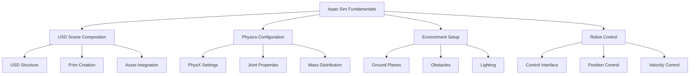

# Isaac Sim Fundamentals for Humanoid Robotics

## Introduction to Isaac Sim Architecture

Isaac Sim is built on NVIDIA's Omniverse platform, providing a unified environment for robotics simulation with photorealistic rendering, GPU-accelerated physics, and synthetic data generation capabilities. For humanoid robotics, Isaac Sim offers unique advantages in simulating complex multi-body dynamics, realistic sensor data, and photorealistic environments that closely match real-world conditions.

The architecture consists of several key layers:
- **Omniverse Nucleus**: Central server for USD scene management
- **USD Scene Graph**: Hierarchical representation of the simulation world
- **PhysX Physics Engine**: GPU-accelerated physics simulation
- **RTX Renderer**: Photorealistic rendering pipeline
- **Extension System**: Python-based extensibility framework

## Setting Up Isaac Sim for Humanoid Robots

### Installation Options

Isaac Sim can be deployed in multiple configurations depending on your hardware and use case:

#### Docker Installation (Recommended for Development)

```bash
# Pull the latest Isaac Sim Docker image
docker pull nvcr.io/nvidia/isaac-sim:4.2.0

# Run Isaac Sim with GPU support
docker run --gpus all \
  --rm \
  --network=host \
  --env="DISPLAY" \
  --env="QT_X11_NO_MITSHM=1" \
  --volume="/tmp/.X11-unix:/tmp/.X11-unix:rw" \
  --device=/dev/dri:/dev/dri \
  --privileged \
  -v ${PWD}:/workspace/current \
  nvcr.io/nvidia/isaac-sim:4.2.0
```

#### Standalone Application

For development workstations with powerful GPUs:

```bash
# Download from NVIDIA Developer portal
# Install to local system
# Launch with: ./isaac-sim.sh
```

### Initial Configuration for Humanoid Robots

Once Isaac Sim is running, configure it for humanoid robotics work:

```python
# config_humanoid_workspace.py
import carb
import omni
from omni.isaac.core import World
from omni.isaac.core.utils.stage import add_reference_to_stage
from omni.isaac.core.utils.nucleus import get_assets_root_path
from omni.isaac.core.robots import Robot
from omni.isaac.core.utils.prims import get_prim_at_path

# Initialize Isaac Sim
def setup_humanoid_workspace():
    """
    Set up Isaac Sim workspace for humanoid robot simulation
    """
    # Get world instance
    world = World(stage_units_in_meters=1.0)

    # Configure physics settings for humanoid simulation
    physics_dt = 1.0 / 60.0  # 60Hz physics
    rendering_dt = 1.0 / 60.0  # 60Hz rendering
    world.set_physics_dt(physics_dt)
    world.set_rendering_dt(rendering_dt)

    # Add ground plane
    world.scene.add_default_ground_plane()

    # Configure for humanoid robot
    configure_humanoid_physics_settings()

    return world

def configure_humanoid_physics_settings():
    """
    Configure physics settings optimized for humanoid robots
    """
    # Get physics scene
    scene = omni.usd.get_context().get_stage().GetPrimAtPath("/physicsScene")

    # Set physics parameters appropriate for humanoid simulation
    scene.GetAttribute("physics:defaultPositionIterationCount").Set(8)  # More iterations for stability
    scene.GetAttribute("physics:defaultVelocityIterationCount").Set(4)  # Balance stability and performance
    scene.GetAttribute("physics:gravity").Set(-9.81)  # Standard gravity

    # Configure solver settings
    scene.GetAttribute("physics:solverType").Set("TGS")  # Use TGS solver for better stability

    carb.log_info("Humanoid physics settings configured")

def load_humanoid_robot(robot_path, prim_path="/World/HumanoidRobot"):
    """
    Load a humanoid robot into the simulation
    """
    # Add robot to stage
    add_reference_to_stage(
        usd_path=robot_path,
        prim_path=prim_path
    )

    # Create robot object
    robot = Robot(
        prim_path=prim_path,
        name="humanoid_robot",
        position=[0, 0, 1.0],  # Start 1m above ground
        orientation=[0, 0, 0, 1]
    )

    return robot
```

## USD Scene Composition for Humanoid Robots

### Understanding USD in Isaac Sim

Universal Scene Description (USD) is the core format used by Isaac Sim. For humanoid robots, understanding USD is crucial:

```usd
# Example USD for humanoid robot structure
def Xform "HumanoidRobot" (
    prepend apiSchemas = ["PhysicsRigidBodyAPI"]
)
{
    # Robot root
    def Xform "pelvis"
    {
        # Pelvis link with collision and visual
        def Sphere "pelvis_collision"
        {
            sphere:radius = 0.1
        }

        def Sphere "pelvis_visual"
        {
            sphere:radius = 0.1
        }
    }

    # Left leg chain
    def Xform "left_hip"
    {
        def Xform "left_thigh"
        {
            def Capsule "thigh_collision"
            {
                capsule:radius = 0.08
                capsule:height = 0.4
            }
        }
    }

    # Right leg chain
    def Xform "right_hip"
    {
        def Xform "right_thigh"
        {
            def Capsule "thigh_collision"
            {
                capsule:radius = 0.08
                capsule:height = 0.4
            }
        }
    }

    # Physics articulation root
    def PhysicsArticulationRoot "articulation"
    {
        # Joint definitions will go here
    }
}
```

### Creating Humanoid Robot Prims

```python
# humanoid_robot_builder.py
import omni
from pxr import Usd, UsdGeom, UsdPhysics, PhysxSchema, Gf
from omni.isaac.core.utils.prims import create_prim
from omni.isaac.core.utils.stage import get_current_stage

class HumanoidRobotBuilder:
    def __init__(self, stage=None):
        self.stage = stage or get_current_stage()
        self.robot_path = None

    def create_basic_humanoid_skeleton(self, robot_path="/World/HumanoidRobot"):
        """
        Create a basic humanoid skeleton using USD prims
        """
        self.robot_path = robot_path

        # Create robot root
        robot_prim = UsdGeom.Xform.Define(self.stage, robot_path)

        # Create pelvis (root body)
        pelvis_path = f"{robot_path}/pelvis"
        pelvis_prim = UsdGeom.Capsule.Define(self.stage, pelvis_path)
        pelvis_prim.GetRadiusAttr().Set(0.1)
        pelvis_prim.GetHeightAttr().Set(0.2)

        # Position pelvis
        UsdGeom.XformCommonAPI(pelvis_prim).SetTranslate(Gf.Vec3d(0, 0, 0.8))

        # Create left leg
        self._create_leg(robot_path, "left", -0.1)
        self._create_leg(robot_path, "right", 0.1)

        # Create torso
        self._create_torso(robot_path)

        # Create arms
        self._create_arm(robot_path, "left", -0.15)
        self._create_arm(robot_path, "right", 0.15)

        # Create head
        self._create_head(robot_path)

        # Add physics properties
        self._add_physics_properties(robot_path)

        return robot_prim

    def _create_leg(self, robot_path, side, x_offset):
        """
        Create a basic leg for the humanoid
        """
        # Hip joint
        hip_path = f"{robot_path}/{side}_hip"
        hip_prim = UsdGeom.Xform.Define(self.stage, hip_path)
        UsdGeom.XformCommonAPI(hip_prim).SetTranslate(Gf.Vec3d(x_offset, 0, 0))

        # Thigh
        thigh_path = f"{hip_path}/thigh"
        thigh_prim = UsdGeom.Capsule.Define(self.stage, thigh_path)
        thigh_prim.GetRadiusAttr().Set(0.08)
        thigh_prim.GetHeightAttr().Set(0.4)
        UsdGeom.XformCommonAPI(thigh_prim).SetTranslate(Gf.Vec3d(0, 0, -0.2))

        # Knee joint
        knee_path = f"{thigh_path}/knee"
        knee_prim = UsdGeom.Xform.Define(self.stage, knee_path)
        UsdGeom.XformCommonAPI(knee_prim).SetTranslate(Gf.Vec3d(0, 0, -0.4))

        # Shin
        shin_path = f"{knee_path}/shin"
        shin_prim = UsdGeom.Capsule.Define(self.stage, shin_path)
        shin_prim.GetRadiusAttr().Set(0.07)
        shin_prim.GetHeightAttr().Set(0.4)
        UsdGeom.XformCommonAPI(shin_prim).SetTranslate(Gf.Vec3d(0, 0, -0.2))

        # Ankle joint
        ankle_path = f"{shin_path}/ankle"
        ankle_prim = UsdGeom.Xform.Define(self.stage, ankle_path)
        UsdGeom.XformCommonAPI(ankle_prim).SetTranslate(Gf.Vec3d(0, 0, -0.4))

        # Foot
        foot_path = f"{ankle_path}/foot"
        foot_prim = UsdGeom.Box.Define(self.stage, foot_path)
        foot_prim.GetSizeAttr().Set(0.2)
        UsdGeom.XformCommonAPI(foot_prim).SetTranslate(Gf.Vec3d(0.05, 0, -0.05))

    def _create_torso(self, robot_path):
        """
        Create torso and spine
        """
        torso_path = f"{robot_path}/torso"
        torso_prim = UsdGeom.Capsule.Define(self.stage, torso_path)
        torso_prim.GetRadiusAttr().Set(0.12)
        torso_prim.GetHeightAttr().Set(0.5)
        UsdGeom.XformCommonAPI(torso_prim).SetTranslate(Gf.Vec3d(0, 0, 0.25))

    def _create_arm(self, robot_path, side, x_offset):
        """
        Create a basic arm for the humanoid
        """
        # Shoulder joint
        shoulder_path = f"{robot_path}/{side}_shoulder"
        shoulder_prim = UsdGeom.Xform.Define(self.stage, shoulder_path)
        UsdGeom.XformCommonAPI(shoulder_prim).SetTranslate(Gf.Vec3d(x_offset, 0, 0.3))

        # Upper arm
        upper_arm_path = f"{shoulder_path}/upper_arm"
        upper_arm_prim = UsdGeom.Capsule.Define(self.stage, upper_arm_path)
        upper_arm_prim.GetRadiusAttr().Set(0.06)
        upper_arm_prim.GetHeightAttr().Set(0.3)
        UsdGeom.XformCommonAPI(upper_arm_prim).SetTranslate(Gf.Vec3d(0, 0, -0.15))

        # Elbow joint
        elbow_path = f"{upper_arm_path}/elbow"
        elbow_prim = UsdGeom.Xform.Define(self.stage, elbow_path)
        UsdGeom.XformCommonAPI(elbow_prim).SetTranslate(Gf.Vec3d(0, 0, -0.3))

        # Forearm
        forearm_path = f"{elbow_path}/forearm"
        forearm_prim = UsdGeom.Capsule.Define(self.stage, forearm_path)
        forearm_prim.GetRadiusAttr().Set(0.05)
        forearm_prim.GetHeightAttr().Set(0.25)
        UsdGeom.XformCommonAPI(forearm_prim).SetTranslate(Gf.Vec3d(0, 0, -0.125))

    def _create_head(self, robot_path):
        """
        Create head and neck
        """
        # Neck joint
        neck_path = f"{robot_path}/neck"
        neck_prim = UsdGeom.Xform.Define(self.stage, neck_path)
        UsdGeom.XformCommonAPI(neck_prim).SetTranslate(Gf.Vec3d(0, 0, 0.5))

        # Head
        head_path = f"{neck_path}/head"
        head_prim = UsdGeom.Sphere.Define(self.stage, head_path)
        head_prim.GetRadiusAttr().Set(0.1)
        UsdGeom.XformCommonAPI(head_prim).SetTranslate(Gf.Vec3d(0, 0, 0.1))

    def _add_physics_properties(self, robot_path):
        """
        Add physics properties to the humanoid robot
        """
        # Add rigid body properties
        robot_prim = self.stage.GetPrimAtPath(robot_path)
        rigid_body_api = UsdPhysics.RigidBodyAPI.Apply(robot_prim)

        # Add articulation root
        articulation_root_api = PhysxSchema.PhysxArticulationRootAPI.Apply(robot_prim)
        articulation_root_api.GetEnabledSelfCollisionAttr().Set(False)

        # Set solver position iteration count for stability
        rigid_body_api.GetMaxLinearVelocityAttr().Set(1000.0)
        rigid_body_api.GetMaxAngularVelocityAttr().Set(1000.0)
```

## Physics Configuration for Humanoid Simulation

### PhysX Settings Optimization

Humanoid robots require specific physics configurations for stable simulation:

```python
# physics_configurator.py
import omni
from pxr import PhysxSchema
import carb

class HumanoidPhysicsConfigurator:
    def __init__(self):
        self.stage = omni.usd.get_context().get_stage()

    def configure_physics_scene(self):
        """
        Configure physics scene for humanoid robot simulation
        """
        # Get physics scene prim
        physics_scene_path = "/physicsScene"
        scene_prim = self.stage.GetPrimAtPath(physics_scene_path)

        if not scene_prim.IsValid():
            carb.log_error(f"Physics scene not found at {physics_scene_path}")
            return False

        # Configure solver settings for humanoid stability
        physx_scene_api = PhysxSchema.PhysxSceneAPI.Apply(scene_prim)

        # Increase solver iterations for humanoid stability
        physx_scene_api.GetSolverTypeAttr().Set("TGS")  # Use TGS solver
        physx_scene_api.GetMaxPositionIterationsAttr().Set(16)  # More position iterations
        physx_scene_api.GetMaxVelocityIterationsAttr().Set(8)   # More velocity iterations

        # Configure collision settings
        physx_scene_api.GetEnableEnhancedDeterminismAttr().Set(True)

        # Set gravity
        scene_prim.GetAttribute("physics:gravity").Set(-9.81)

        carb.log_info("Physics scene configured for humanoid simulation")
        return True

    def configure_joint_properties(self, joint_path):
        """
        Configure joint properties for humanoid joints
        """
        joint_prim = self.stage.GetPrimAtPath(joint_path)

        if not joint_prim.IsValid():
            carb.log_error(f"Joint not found at {joint_path}")
            return False

        # Apply joint API
        joint_api = PhysxSchema.PhysxJointAPI.Apply(joint_prim)

        # Set joint drive properties for humanoid control
        joint_api.GetBreakForceAttr().Set(1000000.0)  # High break force
        joint_api.GetBreakTorqueAttr().Set(1000000.0)  # High break torque

        # Enable joint projection for stability
        joint_api.GetEnableProjectionAttr().Set(True)
        joint_api.GetProjectionLinearToleranceAttr().Set(0.001)
        joint_api.GetProjectionAngularToleranceAttr().Set(0.01)

        return True

    def configure_mass_properties(self, link_path, mass=1.0, density=None):
        """
        Configure mass properties for humanoid links
        """
        link_prim = self.stage.GetPrimAtPath(link_path)

        if not link_prim.IsValid():
            carb.log_error(f"Link not found at {link_path}")
            return False

        # Apply rigid body API
        rigid_body_api = UsdPhysics.RigidBodyAPI.Apply(link_prim)

        # Set mass properties
        if density:
            rigid_body_api.CreateDensityAttr(density)
        else:
            rigid_body_api.CreateMassAttr(mass)

        # Set center of mass offset if needed
        # rigid_body_api.CreateCenterOfMassAttr(Gf.Vec3f(0, 0, 0))

        return True
```

## Scene Management and Environment Setup

### Creating Humanoid-Friendly Environments

```python
# environment_setup.py
import omni
from omni.isaac.core.utils.stage import add_reference_to_stage
from omni.isaac.core.utils.prims import create_prim
from omni.isaac.core.utils.stage import get_current_stage
from pxr import Gf

class HumanoidEnvironmentManager:
    def __init__(self):
        self.stage = get_current_stage()

    def create_training_environment(self, env_name="humanoid_training", size=(10, 10)):
        """
        Create a training environment suitable for humanoid robots
        """
        # Create environment root
        env_path = f"/World/{env_name}"
        create_prim(env_path, "Xform")

        # Add ground plane with appropriate friction for humanoid walking
        self._create_ground_plane(f"{env_path}/ground", size)

        # Add obstacles for training
        self._add_training_obstacles(env_path)

        # Add lighting for photorealistic rendering
        self._add_environment_lighting(env_path)

        return env_path

    def _create_ground_plane(self, ground_path, size):
        """
        Create a ground plane with humanoid-appropriate properties
        """
        # Create ground plane
        create_prim(
            prim_path=ground_path,
            prim_type="Plane",
            position=Gf.Vec3d(0, 0, 0),
            scale=Gf.Vec3d(size[0], size[1], 1)
        )

        # Add physics properties
        from pxr import UsdPhysics
        ground_prim = self.stage.GetPrimAtPath(ground_path)
        rigid_body_api = UsdPhysics.RigidBodyAPI.Apply(ground_prim)
        rigid_body_api.GetRigidBodyEnabledAttr().Set(False)  # Static body

        # Add friction properties
        friction_api = UsdPhysics.MaterialAPI.Apply(ground_prim)
        friction_api.GetStaticFrictionAttr().Set(0.8)  # High friction for humanoid feet
        friction_api.GetDynamicFrictionAttr().Set(0.7)
        friction_api.GetRestitutionAttr().Set(0.1)  # Low restitution for stable contact

    def _add_training_obstacles(self, env_path):
        """
        Add obstacles for humanoid robot training
        """
        # Add various obstacles to challenge the humanoid
        obstacle_configs = [
            {"type": "box", "pos": (2, 0, 0.5), "size": (0.5, 0.5, 1.0)},
            {"type": "cylinder", "pos": (-2, 1, 0.3), "radius": 0.3, "height": 0.6},
            {"type": "slope", "pos": (0, -3, 0), "angle": 15, "size": (2, 1, 0.1)},
        ]

        for i, config in enumerate(obstacle_configs):
            obstacle_path = f"{env_path}/obstacle_{i}"
            if config["type"] == "box":
                create_prim(
                    prim_path=obstacle_path,
                    prim_type="Cube",
                    position=Gf.Vec3d(*config["pos"]),
                    scale=Gf.Vec3d(*config["size"])
                )
            elif config["type"] == "cylinder":
                create_prim(
                    prim_path=obstacle_path,
                    prim_type="Cylinder",
                    position=Gf.Vec3d(*config["pos"]),
                    scale=Gf.Vec3d(config["radius"], config["radius"], config["height"]/2)
                )

    def _add_environment_lighting(self, env_path):
        """
        Add proper lighting for photorealistic rendering
        """
        # Add dome light for environment lighting
        dome_light_path = f"{env_path}/domeLight"
        create_prim(
            prim_path=dome_light_path,
            prim_type="DomeLight",
            position=Gf.Vec3d(0, 0, 10),
        )

        # Configure dome light properties
        dome_prim = self.stage.GetPrimAtPath(dome_light_path)
        dome_prim.GetAttribute("inputs:intensity").Set(3000)
        dome_prim.GetAttribute("inputs:color").Set((0.8, 0.8, 0.9))

        # Add key light
        key_light_path = f"{env_path}/keyLight"
        create_prim(
            prim_path=key_light_path,
            prim_type="DistantLight",
            position=Gf.Vec3d(5, 5, 10),
            orientation=(0.707, 0, -0.707, 0)  # Pointing down
        )

        key_prim = self.stage.GetPrimAtPath(key_light_path)
        key_prim.GetAttribute("inputs:intensity").Set(1500)
```

## Humanoid Robot Control Interface

### Basic Control Framework

```python
# humanoid_controller.py
import numpy as np
from omni.isaac.core.robots.robot import Robot
from omni.isaac.core.articulations.articulation import Articulation
import carb

class HumanoidController:
    def __init__(self, robot: Articulation):
        self.robot = robot
        self.num_dof = robot.num_dof
        self.default_position = np.zeros(self.num_dof)
        self.default_velocity = np.zeros(self.num_dof)

        # Joint names for humanoid robot
        self.joint_names = robot.dof_names

        # Initialize to default position
        self.reset()

    def reset(self):
        """
        Reset the humanoid robot to default configuration
        """
        self.robot.set_joint_positions(self.default_position)
        self.robot.set_joint_velocities(self.default_velocity)

    def get_joint_positions(self):
        """
        Get current joint positions
        """
        return self.robot.get_joint_positions()

    def get_joint_velocities(self):
        """
        Get current joint velocities
        """
        return self.robot.get_joint_velocities()

    def set_joint_positions(self, positions):
        """
        Set joint positions (position control)
        """
        self.robot.set_joint_positions(positions)

    def set_joint_velocities(self, velocities):
        """
        Set joint velocities (velocity control)
        """
        self.robot.set_joint_velocities(velocities)

    def set_joint_efforts(self, efforts):
        """
        Set joint efforts (effort control)
        """
        self.robot.set_joint_efforts(efforts)

    def get_end_effector_pose(self, link_name):
        """
        Get pose of specific end effector
        """
        link_pos, link_orn = self.robot.get_world_poses()
        return link_pos, link_orn

    def move_to_position(self, joint_targets, duration=1.0):
        """
        Move robot to target joint positions over time
        """
        current_pos = self.get_joint_positions()
        target_pos = np.array(joint_targets)

        # Simple linear interpolation
        steps = int(duration * 60)  # Assuming 60Hz control
        for i in range(steps):
            alpha = i / steps
            interp_pos = current_pos * (1 - alpha) + target_pos * alpha
            self.set_joint_positions(interp_pos)

            # Yield control back to simulation
            yield interp_pos

def setup_humanoid_control_example():
    """
    Example of setting up humanoid control in Isaac Sim
    """
    from omni.isaac.core import World
    from omni.isaac.core.utils.stage import add_reference_to_stage

    # Create world
    world = World(stage_units_in_meters=1.0)

    # Add humanoid robot (assuming you have a humanoid USD file)
    # robot_path = "path/to/humanoid_robot.usd"
    # add_reference_to_stage(usd_path=robot_path, prim_path="/World/HumanoidRobot")

    # Play the world
    world.reset()

    # Get robot and create controller
    # robot = world.scene.get_object("HumanoidRobot")
    # controller = HumanoidController(robot)

    carb.log_info("Humanoid control example setup complete")
```

## Best Practices for Isaac Sim with Humanoid Robots

### Performance Optimization

When working with complex humanoid robots in Isaac Sim:

1. **Level of Detail (LOD)**: Use simplified collision geometry while maintaining detailed visual geometry
2. **Physics Update Rate**: Balance between stability and performance (typically 500-1000Hz for humanoid locomotion)
3. **Articulation Structure**: Organize joints hierarchically for efficient computation
4. **Scene Complexity**: Limit the number of dynamic objects in the scene for real-time performance

### Stability Considerations

For stable humanoid simulation:

- Use appropriate joint limits and drive parameters
- Configure sufficient solver iterations for complex kinematic chains
- Apply proper mass distribution and inertial properties
- Use joint projection to prevent drift in closed kinematic chains



## Troubleshooting Common Issues

### Physics Instability

Common causes and solutions:
- **Insufficient solver iterations**: Increase position/velocity iterations
- **Improper mass ratios**: Ensure realistic mass distribution between links
- **Joint limit violations**: Verify joint limits and drive parameters
- **Time step issues**: Use appropriate physics time step for stability

### Rendering Performance

To improve rendering performance:
- Reduce scene complexity during physics simulation
- Use appropriate texture resolutions
- Configure level-of-detail settings
- Optimize USD scene hierarchy

:::tip
When creating humanoid robots in Isaac Sim, start with simple geometric shapes for collision geometry and gradually add complexity. This approach helps identify physics issues early in the development process.
:::

:::warning
Humanoid robots have many degrees of freedom, which can lead to simulation instability. Always validate physics properties and joint configurations before attempting complex behaviors like walking or manipulation.
:::

## Summary

Isaac Sim provides a powerful platform for humanoid robot simulation with its USD-based scene composition, GPU-accelerated physics, and photorealistic rendering capabilities. Proper setup of physics properties, joint configurations, and environment design is crucial for stable and realistic humanoid simulation.

In the next section, we'll explore photorealistic rendering and material creation for humanoid robots in Isaac Sim.