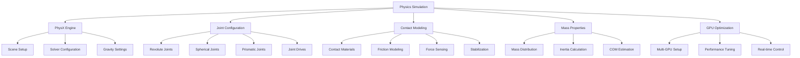

# Physics Simulation in Isaac Sim for Humanoid Robots

## Introduction to GPU-Accelerated Physics in Isaac Sim

Isaac Sim leverages NVIDIA's PhysX engine with GPU acceleration to provide high-fidelity physics simulation essential for humanoid robotics. Unlike CPU-based physics engines, Isaac Sim's GPU-accelerated physics can handle the complex multi-body dynamics, contact interactions, and real-time performance requirements of humanoid robots with dozens of degrees of freedom.

Key features of Isaac Sim's physics system:
- **Multi-GPU Support**: Distributed physics computation across multiple GPUs
- **Large-scale Environments**: Thousands of objects with realistic physics interactions
- **Complex Contact Models**: Accurate humanoid foot-ground interactions with friction
- **Real-time Performance**: Maintaining 500+ Hz for stable humanoid locomotion

## PhysX Engine Configuration for Humanoid Robots

### Physics Scene Setup

Proper configuration of the physics scene is crucial for stable humanoid simulation:

```python
# physics_scene_config.py
import omni
from pxr import PhysxSchema, UsdPhysics
import carb

class HumanoidPhysicsScene:
    def __init__(self):
        self.stage = omni.usd.get_context().get_stage()

    def configure_physics_scene(self,
                              gravity=-9.81,
                              substeps=1,
                              solver_position_iterations=16,
                              solver_velocity_iterations=8):
        """
        Configure physics scene for humanoid robot simulation
        """
        # Get or create physics scene
        scene_path = "/physicsScene"
        scene_prim = self.stage.GetPrimAtPath(scene_path)

        if not scene_prim.IsValid():
            # Create physics scene if it doesn't exist
            scene_prim = self.stage.DefinePrim(scene_path, "PhysicsScene")

        # Apply PhysX scene API
        physx_scene_api = PhysxSchema.PhysxSceneAPI.Apply(scene_prim)

        # Set basic physics properties
        scene_prim.GetAttribute("physics:gravity").Set(gravity)
        scene_prim.GetAttribute("physics:timeStepsPerSecond").Set(60)  # 60Hz base rate
        scene_prim.GetAttribute("physics:enableCCD").Set(True)  # Enable Continuous Collision Detection
        scene_prim.GetAttribute("physics:enableAdaptiveForce").Set(True)

        # Configure solver settings for humanoid stability
        physx_scene_api.GetSolverTypeAttr().Set("TGS")  # Use TGS solver for better stability
        physx_scene_api.GetMaxPositionIterationsAttr().Set(solver_position_iterations)
        physx_scene_api.GetMaxVelocityIterationsAttr().Set(solver_velocity_iterations)

        # Enable GPU acceleration
        physx_scene_api.GetUseGpuAttr().Set(True)
        physx_scene_api.GetBroadphaseTypeAttr().Set("GPU")  # Use GPU broadphase
        physx_scene_api.GetGpuMaxPrimsAttr().Set(131072)  # Max primitives for GPU processing

        carb.log_info(f"Physics scene configured with {solver_position_iterations} position iterations")

        return scene_prim

    def configure_contact_properties(self, scene_path="/physicsScene"):
        """
        Configure contact properties for humanoid robot interactions
        """
        scene_prim = self.stage.GetPrimAtPath(scene_path)

        # Set contact parameters appropriate for humanoid simulation
        scene_prim.GetAttribute("physics:sleepThreshold").Set(0.005)
        scene_prim.GetAttribute("physics:stabilizationThreshold").Set(0.01)

        # Enable contact graph processing for complex interactions
        physx_scene_api = PhysxSchema.PhysxSceneAPI.Apply(scene_prim)
        physx_scene_api.GetEnableEnhancedDeterminismAttr().Set(True)
        physx_scene_api.GetEnableStrongFrictionAttr().Set(True)
        physx_scene_api.GetGpuMaxContactPairsAttr().Set(1048576)  # Large number for complex humanoid contacts

    def create_ground_plane_with_properties(self, plane_path="/World/GroundPlane"):
        """
        Create ground plane with appropriate properties for humanoid locomotion
        """
        from omni.isaac.core.utils.prims import create_prim
        from pxr import Gf

        # Create ground plane
        create_prim(
            prim_path=plane_path,
            prim_type="Plane",
            position=Gf.Vec3d(0, 0, 0),
            scale=Gf.Vec3d(100, 100, 1)  # Large plane for humanoid movement
        )

        # Apply rigid body properties (static)
        plane_prim = self.stage.GetPrimAtPath(plane_path)
        rigid_body_api = UsdPhysics.RigidBodyAPI.Apply(plane_prim)
        rigid_body_api.GetRigidBodyEnabledAttr().Set(False)  # Static body

        # Apply material properties for realistic contact
        material_api = UsdPhysics.MaterialAPI.Apply(plane_prim)
        material_api.GetStaticFrictionAttr().Set(0.8)  # High static friction for humanoid feet
        material_api.GetDynamicFrictionAttr().Set(0.7)  # High dynamic friction
        material_api.GetRestitutionAttr().Set(0.1)      # Low restitution for stable contact

        # Apply PhysX-specific properties
        physx_material_api = PhysxSchema.PhysxMaterialAPI.Apply(plane_prim)
        physx_material_api.GetFrictionCombineModeAttr().Set("average")
        physx_material_api.GetRestitutionCombineModeAttr().Set("average")

        carb.log_info("Ground plane created with humanoid-appropriate contact properties")

    def configure_articulation_properties(self, articulation_path):
        """
        Configure articulation properties for humanoid robot
        """
        articulation_prim = self.stage.GetPrimAtPath(articulation_path)

        # Apply articulation root API
        articulation_root_api = PhysxSchema.PhysxArticulationRootAPI.Apply(articulation_prim)

        # Set articulation properties for humanoid stability
        articulation_root_api.GetSolvePositionItersAttr().Set(8)  # Position iterations for the articulation
        articulation_root_api.GetSolveVelocityItersAttr().Set(4)  # Velocity iterations
        articulation_root_api.GetEnabledSelfCollisionAttr().Set(False)  # Usually disabled for humanoid

        # Enable GPU acceleration for articulation
        articulation_root_api.GetGpuArticulationEnabledAttr().Set(True)

        carb.log_info(f"Articulation configured at {articulation_path}")
```

### Joint Configuration for Humanoid Robots

Humanoid robots require careful joint configuration to ensure stable and realistic movement:

```python
# humanoid_joints.py
from pxr import PhysxSchema, UsdPhysics, Usd, Sdf, Gf
import carb

class HumanoidJointConfigurator:
    def __init__(self, stage):
        self.stage = stage

    def create_humanoid_joint(self, parent_path, child_path, joint_type="Fixed", joint_name="joint"):
        """
        Create a joint appropriate for humanoid robot kinematics
        """
        # Create joint prim
        joint_path = f"{parent_path}/{joint_name}"
        joint_prim = self.stage.DefinePrim(joint_path, f"Physics{joint_type}Joint")

        # Apply joint API
        joint_api = PhysxSchema.PhysxJointAPI.Apply(joint_prim)

        # Set joint actors (parent and child)
        joint_api.CreateActor0Rel().SetTargets([parent_path])
        joint_api.CreateActor1Rel().SetTargets([child_path])

        return joint_path, joint_prim

    def create_revolute_joint(self, parent_path, child_path, axis="X", joint_name="revolute_joint",
                            limits=(-45, 45), drive_enabled=False, stiffness=1e6, damping=1e4):
        """
        Create a revolute joint with specified limits and drive properties
        """
        # Create the joint
        joint_path, joint_prim = self.create_humanoid_joint(parent_path, child_path, "Revolute", joint_name)

        # Apply revolute joint API
        revolute_api = PhysxSchema.PhysxRevoluteJointAPI.Apply(joint_prim)

        # Set joint axis
        axis_map = {"X": (1, 0, 0), "Y": (0, 1, 0), "Z": (0, 0, 1)}
        revolute_api.GetAxisAttr().Set(Gf.Vec3f(*axis_map[axis]))

        # Set joint limits
        revolute_api.CreateLowerLimitAttr().Set(limits[0] * 3.14159/180)  # Convert to radians
        revolute_api.CreateUpperLimitAttr().Set(limits[1] * 3.14159/180)

        # Set joint drive if enabled
        if drive_enabled:
            drive_api = PhysxSchema.PhysxJointDriveAPI.Apply(joint_prim)
            drive_api.GetStiffnessAttr().Set(stiffness)
            drive_api.GetDampingAttr().Set(damping)
            drive_api.GetMaxForceAttr().Set(1000.0)  # Maximum force for safety

        # Enable joint projection for stability
        joint_api.GetEnableProjectionAttr().Set(True)
        joint_api.GetProjectionLinearToleranceAttr().Set(1e-4)
        joint_api.GetProjectionAngularToleranceAttr().Set(1e-3)

        return joint_path

    def create_spherical_joint(self, parent_path, child_path, joint_name="spherical_joint"):
        """
        Create a spherical joint for ball-and-socket connections (shoulders, hips)
        """
        joint_path, joint_prim = self.create_humanoid_joint(parent_path, child_path, "Spherical", joint_name)

        spherical_api = PhysxSchema.PhysxSphericalJointAPI.Apply(joint_prim)

        # Enable joint projection for stability
        joint_api = PhysxSchema.PhysxJointAPI.Apply(joint_prim)
        joint_api.GetEnableProjectionAttr().Set(True)
        joint_api.GetProjectionLinearToleranceAttr().Set(1e-4)

        return joint_path

    def create_prismatic_joint(self, parent_path, child_path, axis="X", joint_name="prismatic_joint",
                             limits=(-0.1, 0.1)):
        """
        Create a prismatic joint for linear motion
        """
        joint_path, joint_prim = self.create_humanoid_joint(parent_path, child_path, "Prismatic", joint_name)

        prismatic_api = PhysxSchema.PhysxPrismaticJointAPI.Apply(joint_prim)

        # Set joint axis
        axis_map = {"X": (1, 0, 0), "Y": (0, 1, 0), "Z": (0, 0, 1)}
        prismatic_api.GetAxisAttr().Set(Gf.Vec3f(*axis_map[axis]))

        # Set joint limits
        prismatic_api.CreateLowerLimitAttr().Set(limits[0])
        prismatic_api.CreateUpperLimitAttr().Set(limits[1])

        return joint_path

    def setup_humanoid_joint_structure(self, robot_root_path="/World/HumanoidRobot"):
        """
        Set up the complete joint structure for a humanoid robot
        """
        joints_created = []

        # Hip joints (spherical for 3DOF)
        left_hip = self.create_spherical_joint(
            f"{robot_root_path}/pelvis",
            f"{robot_root_path}/left_thigh",
            "left_hip"
        )
        joints_created.append(left_hip)

        right_hip = self.create_spherical_joint(
            f"{robot_root_path}/pelvis",
            f"{robot_root_path}/right_thigh",
            "right_hip"
        )
        joints_created.append(right_hip)

        # Knee joints (revolute)
        left_knee = self.create_revolute_joint(
            f"{robot_root_path}/left_thigh",
            f"{robot_root_path}/left_shin",
            "Y", "left_knee",
            limits=(-5, 150),  # Knee can bend up to 150 degrees
            drive_enabled=True,
            stiffness=1e5,
            damping=1e3
        )
        joints_created.append(left_knee)

        right_knee = self.create_revolute_joint(
            f"{robot_root_path}/right_thigh",
            f"{robot_root_path}/right_shin",
            "Y", "right_knee",
            limits=(-5, 150),
            drive_enabled=True,
            stiffness=1e5,
            damping=1e3
        )
        joints_created.append(right_knee)

        # Ankle joints (revolute for pitch, possibly spherical for full motion)
        left_ankle_pitch = self.create_revolute_joint(
            f"{robot_root_path}/left_shin",
            f"{robot_root_path}/left_foot",
            "X", "left_ankle_pitch",
            limits=(-30, 30),
            drive_enabled=True,
            stiffness=1e4,
            damping=1e2
        )
        joints_created.append(left_ankle_pitch)

        left_ankle_roll = self.create_revolute_joint(
            f"{robot_root_path}/left_shin",
            f"{robot_root_path}/left_foot",
            "Y", "left_ankle_roll",
            limits=(-20, 20),
            drive_enabled=True,
            stiffness=1e4,
            damping=1e2
        )
        joints_created.append(left_ankle_roll)

        # Similar joints for right ankle
        right_ankle_pitch = self.create_revolute_joint(
            f"{robot_root_path}/right_shin",
            f"{robot_root_path}/right_foot",
            "X", "right_ankle_pitch",
            limits=(-30, 30),
            drive_enabled=True,
            stiffness=1e4,
            damping=1e2
        )
        joints_created.append(right_ankle_pitch)

        right_ankle_roll = self.create_revolute_joint(
            f"{robot_root_path}/right_shin",
            f"{robot_root_path}/right_foot",
            "Y", "right_ankle_roll",
            limits=(-20, 20),
            drive_enabled=True,
            stiffness=1e4,
            damping=1e2
        )
        joints_created.append(right_ankle_roll)

        # Spine joints
        spine_joint = self.create_revolute_joint(
            f"{robot_root_path}/pelvis",
            f"{robot_root_path}/torso",
            "Y", "spine_yaw",
            limits=(-30, 30),
            drive_enabled=True,
            stiffness=1e5,
            damping=1e3
        )
        joints_created.append(spine_joint)

        # Neck joint
        neck_joint = self.create_spherical_joint(
            f"{robot_root_path}/torso",
            f"{robot_root_path}/head",
            "neck"
        )
        joints_created.append(neck_joint)

        # Arm joints (simplified)
        left_shoulder = self.create_spherical_joint(
            f"{robot_root_path}/torso",
            f"{robot_root_path}/left_upper_arm",
            "left_shoulder"
        )
        joints_created.append(left_shoulder)

        right_shoulder = self.create_spherical_joint(
            f"{robot_root_path}/torso",
            f"{robot_root_path}/right_upper_arm",
            "right_shoulder"
        )
        joints_created.append(right_shoulder)

        carb.log_info(f"Created {len(joints_created)} joints for humanoid robot")
        return joints_created
```

## Advanced Physics Features for Humanoid Simulation

### Contact Modeling and Friction

Humanoid robots require sophisticated contact modeling for realistic foot-ground interactions:

```python
# contact_modeling.py
from pxr import PhysxSchema, UsdPhysics, Usd
import carb
import numpy as np

class HumanoidContactModeler:
    def __init__(self, stage):
        self.stage = stage

    def create_foot_contact_material(self, foot_path, material_name="FootMaterial"):
        """
        Create specialized contact material for humanoid feet
        """
        # Create material prim
        material_path = f"{foot_path}/{material_name}"
        material_prim = self.stage.DefinePrim(material_path, "PhysicsMaterial")

        # Apply material APIs
        material_api = UsdPhysics.MaterialAPI.Apply(material_prim)
        physx_material_api = PhysxSchema.PhysxMaterialAPI.Apply(material_prim)

        # Set contact properties for humanoid feet
        # High friction for stable walking
        material_api.GetStaticFrictionAttr().Set(1.0)    # Very high static friction
        material_api.GetDynamicFrictionAttr().Set(0.8)   # High dynamic friction
        material_api.GetRestitutionAttr().Set(0.05)      # Very low restitution for stability

        # PhysX-specific properties
        physx_material_api.GetFrictionCombineModeAttr().Set("multiply")  # Multiply friction coefficients
        physx_material_api.GetRestitutionCombineModeAttr().Set("average")

        # Enable anisotropic friction for different properties in different directions
        physx_material_api.GetEnableAnisotropicFrictionAttr().Set(True)
        physx_material_api.GetAnisotropicFrictionDirectionAttr().Set((1, 0, 0))  # Direction of anisotropy
        physx_material_api.GetAnisotropicFrictionAttr().Set(0.1)  # Anisotropic friction value

        # Apply material to foot collision geometry
        foot_prim = self.stage.GetPrimAtPath(foot_path)
        if foot_prim:
            # Bind material to collision geometry
            collision_api = UsdPhysics.CollisionAPI(foot_prim)
            binding_api = UsdPhysics.MaterialBindingAPI(foot_prim)
            binding_api.Bind(material_prim)

        carb.log_info(f"Foot contact material created at {material_path}")
        return material_path

    def configure_contact_events(self, robot_path):
        """
        Configure contact event detection for humanoid robot
        """
        # Enable contact reporting for specific parts
        feet_paths = [
            f"{robot_path}/left_foot",
            f"{robot_path}/right_foot"
        ]

        for foot_path in feet_paths:
            foot_prim = self.stage.GetPrimAtPath(foot_path)
            if foot_prim:
                # Enable contact reporting
                physx_rigid_body_api = PhysxSchema.PhysxRigidBodyAPI.Apply(foot_prim)
                physx_rigid_body_api.GetReportAllShapesTouchingAttr().Set(True)

                # Enable contact forces reporting
                physx_rigid_body_api.GetReportContactForceAttr().Set(True)
                physx_rigid_body_api.GetMinContactForceAttr().Set(0.1)  # Minimum force threshold

        carb.log_info("Contact event detection configured for humanoid feet")

    def setup_force_plate_simulation(self, plate_path="/World/ForcePlate"):
        """
        Set up a force plate for measuring ground reaction forces
        """
        from omni.isaac.core.utils.prims import create_prim
        from pxr import Gf

        # Create force plate
        create_prim(
            prim_path=plate_path,
            prim_type="Box",
            position=Gf.Vec3d(0, 0, 0.01),  # Slightly above ground
            scale=Gf.Vec3d(0.5, 0.5, 0.02)  # 50cm x 50cm x 2cm
        )

        plate_prim = self.stage.GetPrimAtPath(plate_path)

        # Make it static
        rigid_body_api = UsxPhysics.RigidBodyAPI.Apply(plate_prim)
        rigid_body_api.GetRigidBodyEnabledAttr().Set(False)

        # Apply high friction material for good contact
        material_api = UsdPhysics.MaterialAPI.Apply(plate_prim)
        material_api.GetStaticFrictionAttr().Set(1.2)
        material_api.GetDynamicFrictionAttr().Set(1.0)
        material_api.GetRestitutionAttr().Set(0.01)

        # Enable force sensing
        physx_rigid_body_api = PhysxSchema.PhysxRigidBodyAPI.Apply(plate_prim)
        physx_rigid_body_api.GetReportContactForceAttr().Set(True)

        carb.log_info("Force plate simulation set up")

    def implement_contact_stabilization(self, robot_path):
        """
        Implement techniques for contact stabilization in humanoid simulation
        """
        # Apply contact stabilization techniques to robot parts
        body_parts = [
            f"{robot_path}/left_foot",
            f"{robot_path}/right_foot",
            f"{robot_path}/left_hand",  # For manipulation
            f"{robot_path}/right_hand"
        ]

        for part_path in body_parts:
            part_prim = self.stage.GetPrimAtPath(part_path)
            if part_prim:
                # Apply PhysX-specific stabilization settings
                physx_rigid_body_api = PhysxSchema.PhysxRigidBodyAPI.Apply(part_prim)

                # Increase solver iterations for parts that make contact
                # This is done at the articulation level, not individual bodies

                # Enable contact caching for better performance
                physx_rigid_body_api.GetUseContactCachingAttr().Set(True)

                # Adjust contact distance for better stability
                physx_rigid_body_api.GetContactOffsetAttr().Set(0.02)  # 2cm contact offset
                physx_rigid_body_api.GetRestOffsetAttr().Set(0.0)      # No rest offset

    def simulate_rough_terrain_interaction(self, terrain_path="/World/RoughTerrain"):
        """
        Set up physics properties for rough terrain interaction
        """
        # Create terrain material with variable properties
        terrain_material_path = f"{terrain_path}/TerrainMaterial"
        terrain_material = self.stage.DefinePrim(terrain_material_path, "PhysicsMaterial")

        terrain_material_api = UsdPhysics.MaterialAPI.Apply(terrain_material)
        physx_material_api = PhysxSchema.PhysxMaterialAPI.Apply(terrain_material)

        # Variable friction for different terrain types
        terrain_material_api.GetStaticFrictionAttr().Set(0.9)   # High friction for grip
        terrain_material_api.GetDynamicFrictionAttr().Set(0.8)  # High dynamic friction
        terrain_material_api.GetRestitutionAttr().Set(0.1)      # Low restitution

        # Enable patch friction for better stability on uneven surfaces
        physx_material_api.GetEnablePatchFrictionAttr().Set(True)

        carb.log_info("Rough terrain physics properties configured")
```

### Mass Distribution and Inertial Properties

Proper mass distribution is critical for realistic humanoid dynamics:

```python
# mass_properties.py
from pxr import UsdPhysics, PhysxSchema, Gf
import carb

class HumanoidMassProperties:
    def __init__(self, stage):
        self.stage = stage
        # Standard humanoid mass distribution based on anthropometric data
        self.body_part_masses = {
            "head": 5.0,          # kg
            "torso": 30.0,        # kg
            "pelvis": 8.0,        # kg
            "left_thigh": 10.0,   # kg
            "right_thigh": 10.0,  # kg
            "left_shin": 4.0,     # kg
            "right_shin": 4.0,    # kg
            "left_foot": 1.0,     # kg
            "right_foot": 1.0,    # kg
            "left_upper_arm": 2.5,  # kg
            "right_upper_arm": 2.5, # kg
            "left_forearm": 1.5,    # kg
            "right_forearm": 1.5    # kg
        }

    def set_body_mass_properties(self, body_path, mass=None, density=None):
        """
        Set mass properties for a humanoid body part
        """
        body_prim = self.stage.GetPrimAtPath(body_path)
        if not body_prim:
            carb.log_error(f"Body prim not found at {body_path}")
            return False

        # Apply rigid body API
        rigid_body_api = UsdPhysics.RigidBodyAPI.Apply(body_prim)

        # Set mass
        if mass is not None:
            rigid_body_api.GetMassAttr().Set(mass)
        elif density is not None:
            rigid_body_api.GetDensityAttr().Set(density)
        else:
            # Use default mass based on body part name
            body_name = body_path.split("/")[-1]
            if body_name in self.body_part_masses:
                rigid_body_api.GetMassAttr().Set(self.body_part_masses[body_name])
            else:
                # Default mass for unknown parts
                rigid_body_api.GetMassAttr().Set(1.0)

        # Calculate and set center of mass (simplified)
        self._calculate_and_set_center_of_mass(body_path)

        # Calculate and set moments of inertia (simplified)
        self._calculate_and_set_inertia(body_path)

        return True

    def _calculate_and_set_center_of_mass(self, body_path):
        """
        Calculate and set center of mass for a body part
        """
        body_prim = self.stage.GetPrimAtPath(body_path)
        rigid_body_api = UsdPhysics.RigidBodyAPI.Apply(body_prim)

        # Simplified COM based on body part
        body_name = body_path.split("/")[-1]
        if "thigh" in body_name:
            # COM towards the center of the thigh
            com = Gf.Vec3f(0, 0, -0.1)  # 10cm down from joint
        elif "shin" in body_name:
            # COM towards the center of the shin
            com = Gf.Vec3f(0, 0, -0.1)  # 10cm down from knee
        elif "foot" in body_name:
            # COM towards the front of the foot
            com = Gf.Vec3f(0.05, 0, 0)  # 5cm forward
        elif "torso" in body_name:
            # COM in the middle of the torso
            com = Gf.Vec3f(0, 0, 0.1)   # Slightly up
        elif "head" in body_name:
            # COM in the middle of the head
            com = Gf.Vec3f(0, 0, 0.05)  # 5cm up
        else:
            # Default COM at origin
            com = Gf.Vec3f(0, 0, 0)

        rigid_body_api.GetCenterOfMassAttr().Set(com)

    def _calculate_and_set_inertia(self, body_path):
        """
        Calculate and set moments of inertia for a body part
        """
        body_prim = self.stage.GetPrimAtPath(body_path)
        rigid_body_api = UsdPhysics.RigidBodyAPI.Apply(body_prim)

        # Simplified inertia tensor based on body part
        body_name = body_path.split("/")[-1]

        if "thigh" in body_name or "shin" in body_name:
            # Approximate as cylinder
            inertia = Gf.Vec3f(0.1, 0.1, 0.01)  # Lower moment along length
        elif "foot" in body_name:
            # Approximate as rectangular prism
            inertia = Gf.Vec3f(0.02, 0.01, 0.01)
        elif "torso" in body_name:
            # Approximate as rectangular prism
            inertia = Gf.Vec3f(1.0, 1.0, 0.5)
        elif "head" in body_name:
            # Approximate as sphere
            inertia = Gf.Vec3f(0.05, 0.05, 0.05)
        else:
            # Default inertia
            inertia = Gf.Vec3f(0.1, 0.1, 0.1)

        rigid_body_api.GetInheritedVelocityAttr().Set(inertia)

    def validate_mass_properties(self, robot_path):
        """
        Validate that the total mass is reasonable for a humanoid robot
        """
        total_mass = 0.0
        for part_name, mass in self.body_part_masses.items():
            total_mass += mass

        carb.log_info(f"Total estimated humanoid mass: {total_mass} kg")

        # For a 70kg human, this would be reasonable
        # Adjust if the mass is significantly different
        if total_mass < 30 or total_mass > 150:
            carb.log_warn(f"Total mass {total_mass} kg may be unrealistic for humanoid robot")

        return total_mass

    def setup_humanoid_mass_distribution(self, robot_path="/World/HumanoidRobot"):
        """
        Set up complete mass distribution for humanoid robot
        """
        # Define all body parts that need mass properties
        body_parts = [
            f"{robot_path}/head",
            f"{robot_path}/torso",
            f"{robot_path}/pelvis",
            f"{robot_path}/left_thigh",
            f"{robot_path}/right_thigh",
            f"{robot_path}/left_shin",
            f"{robot_path}/right_shin",
            f"{robot_path}/left_foot",
            f"{robot_path}/right_foot",
            f"{robot_path}/left_upper_arm",
            f"{robot_path}/right_upper_arm",
            f"{robot_path}/left_forearm",
            f"{robot_path}/right_forearm"
        ]

        # Set mass properties for each part
        for part_path in body_parts:
            if self.stage.GetPrimAtPath(part_path).IsValid():
                self.set_body_mass_properties(part_path)
            else:
                carb.log_warn(f"Body part not found: {part_path}")

        # Validate the total mass
        self.validate_mass_properties(robot_path)

        carb.log_info("Humanoid mass distribution configured")
```

## GPU-Accelerated Physics Optimization

### Multi-GPU Configuration

For complex humanoid robots, multi-GPU physics can significantly improve performance:

```python
# gpu_physics_optimization.py
import carb
from pxr import PhysxSchema

class MultiGPUPhysicsOptimizer:
    def __init__(self):
        pass

    def configure_multi_gpu_physics(self, num_gpus=2):
        """
        Configure physics for multi-GPU operation
        """
        # Enable multi-GPU physics
        carb.settings.get_settings().set("/physics/multiGpu/enable", True)
        carb.settings.get_settings().set("/physics/multiGpu/numGpus", num_gpus)

        # Configure GPU partitioning
        carb.settings.get_settings().set("/physics/multiGpu/partitioning", "automatic")
        carb.settings.get_settings().set("/physics/multiGpu/dynamicPartitioning", True)

        # Set memory allocation per GPU
        carb.settings.get_settings().set("/physics/multiGpu/gpu0MemSize", 8000)  # 8GB
        carb.settings.get_settings().set("/physics/multiGpu/gpu1MemSize", 8000)  # 8GB

        # Enable GPU collision detection
        carb.settings.get_settings().set("/physics/multiGpu/gpuCollision", True)

        carb.log_info(f"Multi-GPU physics configured for {num_gpus} GPUs")

    def optimize_for_humanoid_simulation(self):
        """
        Apply physics optimizations specific to humanoid simulation
        """
        # Increase contact buffer sizes for complex humanoid contacts
        carb.settings.get_settings().set("/physics/gpuMaxContactPairs", 2097152)  # 2M contact pairs
        carb.settings.get_settings().set("/physics/gpuMaxNarrowPhasePairs", 1048576)

        # Optimize solver settings for articulated systems
        carb.settings.get_settings().set("/physics/solverType", "TGS")
        carb.settings.get_settings().set("/physics/maxPositionIterations", 16)
        carb.settings.get_settings().set("/physics/maxVelocityIterations", 8)

        # Enable articulation optimization
        carb.settings.get_settings().set("/physics/gpuArticulation", True)
        carb.settings.get_settings().set("/physics/gpuMaxArticulationBodies", 65536)

        # Adjust time stepping for stability
        carb.settings.get_settings().set("/physics/timeStep", 0.001)  # 1ms time step
        carb.settings.get_settings().set("/physics/subSteps", 2)      # 2 substeps for stability

        carb.log_info("Physics optimized for humanoid simulation")

    def set_performance_targets(self, target_fps=60, accuracy_level="high"):
        """
        Set performance targets for physics simulation
        """
        if accuracy_level == "high":
            # High accuracy settings (lower performance)
            carb.settings.get_settings().set("/physics/timeStep", 0.0005)  # 0.5ms
            carb.settings.get_settings().set("/physics/maxPositionIterations", 20)
            carb.settings.get_settings().set("/physics/maxVelocityIterations", 10)
        elif accuracy_level == "medium":
            # Balanced settings
            carb.settings.get_settings().set("/physics/timeStep", 0.001)  # 1ms
            carb.settings.get_settings().set("/physics/maxPositionIterations", 16)
            carb.settings.get_settings().set("/physics/maxVelocityIterations", 8)
        else:
            # Performance-oriented settings (lower accuracy)
            carb.settings.get_settings().set("/physics/timeStep", 0.002)  # 2ms
            carb.settings.get_settings().set("/physics/maxPositionIterations", 8)
            carb.settings.get_settings().set("/physics/maxVelocityIterations", 4)

        carb.log_info(f"Performance targets set: {target_fps} FPS, {accuracy_level} accuracy")

    def monitor_physics_performance(self):
        """
        Set up physics performance monitoring
        """
        # Enable physics profiling
        carb.settings.get_settings().set("/physics/profiling", True)

        # Enable detailed timing
        carb.settings.get_settings().set("/physics/timing", True)

        # Enable GPU memory monitoring
        carb.settings.get_settings().set("/physics/gpuMemoryMonitoring", True)

        carb.log_info("Physics performance monitoring enabled")
```

## Real-time Physics Control for Humanoid Robots

### Physics Control Interface

```python
# physics_control_interface.py
import numpy as np
from omni.isaac.core.articulations.articulation import Articulation
from omni.isaac.core.utils.stage import get_current_stage
import carb

class HumanoidPhysicsController:
    def __init__(self, robot_articulation: Articulation):
        self.robot = robot_articulation
        self.num_dof = robot_articulation.num_dof
        self.joint_names = robot_articulation.dof_names

        # Physics control parameters
        self.position_gain = 100.0   # P gain for position control
        self.velocity_gain = 10.0    # D gain for velocity control
        self.max_effort = 100.0      # Maximum joint effort limit

        # Initialize previous values for derivative calculation
        self.prev_joint_positions = np.zeros(self.num_dof)
        self.prev_time = None

    def update_physics_control(self, target_positions, target_velocities=None, dt=1/60):
        """
        Update physics-based control for humanoid robot
        """
        current_positions = self.robot.get_joint_positions()
        current_velocities = self.robot.get_joint_velocities()

        # Calculate position errors
        position_errors = target_positions - current_positions

        # Calculate velocity errors if target velocities provided
        if target_velocities is not None:
            velocity_errors = target_velocities - current_velocities
        else:
            velocity_errors = np.zeros(self.num_dof)

        # Simple PD control
        efforts = (self.position_gain * position_errors +
                  self.velocity_gain * velocity_errors)

        # Apply effort limits
        efforts = np.clip(efforts, -self.max_effort, self.max_effort)

        # Apply joint efforts to physics simulation
        self.robot.set_joint_efforts(efforts)

        return efforts

    def enable_joint_damping(self, damping_values):
        """
        Enable joint damping for stable movement
        """
        # In Isaac Sim, damping is typically set in the USD file or through PhysX APIs
        # This is a conceptual interface
        for i, joint_name in enumerate(self.joint_names):
            if i < len(damping_values):
                # Set damping for joint (conceptual)
                carb.log_info(f"Setting damping {damping_values[i]} for joint {joint_name}")

    def get_contact_information(self):
        """
        Get contact information for humanoid robot
        """
        # This would interface with Isaac Sim's contact reporting system
        contact_info = {
            'left_foot': self._get_foot_contact("left_foot"),
            'right_foot': self._get_foot_contact("right_foot"),
            'contact_force_threshold': 5.0  # 5N threshold for contact detection
        }

        return contact_info

    def _get_foot_contact(self, foot_name):
        """
        Get contact status and forces for a foot
        """
        # In real implementation, this would query Isaac Sim's physics engine
        # for contact information
        return {
            'in_contact': False,
            'contact_force': np.array([0.0, 0.0, 0.0]),
            'contact_points': []
        }

    def calculate_center_of_mass(self):
        """
        Calculate center of mass for the humanoid robot
        """
        # This would interface with Isaac Sim's CoM calculation
        # For now, return a placeholder
        return np.array([0.0, 0.0, 0.8])  # Approximate CoM height for humanoid

    def enable_balance_control(self, enable=True):
        """
        Enable physics-based balance control
        """
        if enable:
            carb.log_info("Balance control enabled - physics-based stabilization active")
        else:
            carb.log_info("Balance control disabled")

def setup_physics_control_example():
    """
    Example of setting up physics control for humanoid robot
    """
    from omni.isaac.core import World

    # Create world
    world = World(stage_units_in_meters=1.0)
    world.reset()

    # Get robot and create physics controller
    # robot = world.scene.get_object("HumanoidRobot")
    # controller = HumanoidPhysicsController(robot)

    # Example control loop
    def control_loop():
        # target_positions = np.zeros(controller.num_dof)  # Zero position
        # controller.update_physics_control(target_positions)
        pass

    carb.log_info("Physics control example setup complete")
```

## Best Practices for Humanoid Physics Simulation

### Stability Considerations

1. **Time Step Selection**: Use appropriate time steps (typically 0.5-2ms) for humanoid stability
2. **Solver Iterations**: Increase position/velocity iterations for complex articulated systems
3. **Mass Ratios**: Ensure realistic mass ratios between different body parts
4. **Joint Limits**: Set appropriate joint limits to prevent damage and instability
5. **Contact Stabilization**: Use proper contact materials and stabilization techniques

### Performance Optimization

- **Level of Detail**: Use simplified collision geometry while maintaining visual detail
- **Articulation Structure**: Organize joints hierarchically for efficient computation
- **Scene Complexity**: Limit dynamic objects in the scene for real-time performance
- **GPU Utilization**: Leverage multi-GPU configurations when available



## Troubleshooting Physics Issues

### Common Problems and Solutions

- **Instability**: Increase solver iterations, reduce time step, check mass ratios
- **Penetration**: Adjust contact offsets, increase stiffness, improve geometry
- **Drift**: Enable joint projection, increase position iterations
- **Performance**: Simplify collision geometry, reduce scene complexity, optimize GPU usage

:::tip
When setting up physics for humanoid robots, start with basic properties and gradually add complexity. Test each component individually before integrating the full system.
:::

:::warning
Physics simulation of humanoid robots is computationally intensive and requires careful tuning. Always validate physics properties and joint configurations before attempting complex behaviors like walking or manipulation.
:::

## Summary

Physics simulation in Isaac Sim provides the foundation for realistic humanoid robot behavior through GPU-accelerated PhysX engine, sophisticated contact modeling, and optimized multi-GPU processing. Proper configuration of joints, mass properties, and contact materials is essential for stable and realistic humanoid simulation.

In the next section, we'll explore synthetic data generation in Isaac Sim, focusing on how to create large-scale datasets for training vision-language-action models for humanoid robots.