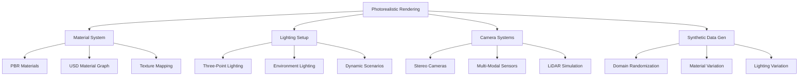

# Photorealistic Rendering and Materials for Humanoid Robots

## Introduction to Physically-Based Rendering in Isaac Sim

Isaac Sim leverages NVIDIA's RTX technology to provide photorealistic rendering capabilities that are essential for training vision systems on humanoid robots. The rendering pipeline uses Physically-Based Rendering (PBR) principles to ensure that synthetic data closely matches real-world conditions, enabling effective sim-to-real transfer for vision-based humanoid control systems.

PBR in Isaac Sim includes:
- **RTX Ray Tracing**: Accurate lighting simulation with global illumination
- **Physically-Based Materials**: Realistic material properties based on real-world physics
- **Multi-camera Systems**: Support for complex sensor arrays with realistic distortion
- **Dynamic Lighting**: Time-of-day and weather variation simulation

## Understanding the Isaac Sim Rendering Pipeline

### RTX Rendering Architecture

Isaac Sim's rendering pipeline is built on NVIDIA's RTX technology, which provides hardware-accelerated ray tracing for photorealistic rendering:

```python
# rendering_pipeline_config.py
import omni
from omni.isaac.core.utils.stage import get_current_stage
from pxr import Usd, UsdGeom, UsdShade
import carb

class IsaacRenderingPipeline:
    def __init__(self):
        self.stage = get_current_stage()
        self.render_settings = {}

    def configure_render_settings(self):
        """
        Configure rendering settings for photorealistic humanoid simulation
        """
        # Enable RTX rendering
        carb.settings.get_settings().set("/rtx/renderMode", 2)  # RTX rendering mode
        carb.settings.get_settings().set("/rtx/raytracing/cullBackFace", False)
        carb.settings.get_settings().set("/rtx/raytracing/shadows", True)
        carb.settings.get_settings().set("/rtx/raytracing/reflections", True)
        carb.settings.get_settings().set("/rtx/raytracing/refractions", True)

        # Configure global illumination
        carb.settings.get_settings().set("/rtx/raytracing/globalIllumination", True)
        carb.settings.get_settings().set("/rtx/raytracing/directLighting", True)

        # Set rendering quality
        carb.settings.get_settings().set("/rtx/raytracing/maxBounces", 8)
        carb.settings.get_settings().set("/rtx/raytracing/maxSpecularAndTransmissionBounces", 8)

        # Configure denoising
        carb.settings.get_settings().set("/rtx/raytracing/denoiseEnable", True)
        carb.settings.get_settings().set("/rtx/raytracing/denoiseTemporalEnable", True)

        carb.log_info("RTX rendering pipeline configured for humanoid simulation")

    def setup_material_properties(self, prim_path, material_params):
        """
        Set up material properties for realistic rendering
        """
        # Create material prim
        material_path = f"{prim_path}_material"
        material = UsdShade.Material.Define(self.stage, material_path)

        # Create shader
        shader = UsdShade.Shader.Define(self.stage, f"{material_path}/Shader")
        shader.CreateIdAttr("OmniPBR")

        # Set material parameters
        shader.CreateInput("diffuse_tint", Usd.Sdf.ValueTypeNames.Color3f).Set(
            material_params.get("diffuse_color", (0.8, 0.8, 0.8))
        )
        shader.CreateInput("metallic", Usd.Sdf.ValueTypeNames.Float).Set(
            material_params.get("metallic", 0.0)
        )
        shader.CreateInput("roughness", Usd.Sdf.ValueTypeNames.Float).Set(
            material_params.get("roughness", 0.5)
        )
        shader.CreateInput("specular_reflection", Usd.Sdf.ValueTypeNames.Float).Set(
            material_params.get("specular", 0.5)
        )
        shader.CreateInput("opacity", Usd.Sdf.ValueTypeNames.Float).Set(
            material_params.get("opacity", 1.0)
        )

        # Bind material to geometry
        prim = self.stage.GetPrimAtPath(prim_path)
        binding_api = UsdShade.MaterialBindingAPI(prim)
        binding_api.Bind(material)

        return material

    def create_humanoid_materials(self):
        """
        Create appropriate materials for different parts of a humanoid robot
        """
        # Head material (plastic/synthetic)
        head_material_params = {
            "diffuse_color": (0.7, 0.7, 0.8),  # Light gray plastic
            "metallic": 0.1,
            "roughness": 0.6,
            "specular": 0.3
        }
        self.setup_material_properties("/World/HumanoidRobot/head", head_material_params)

        # Torso material (metallic frame)
        torso_material_params = {
            "diffuse_color": (0.3, 0.3, 0.4),  # Dark gray metal
            "metallic": 0.8,
            "roughness": 0.4,
            "specular": 0.7
        }
        self.setup_material_properties("/World/HumanoidRobot/torso", torso_material_params)

        # Limb materials (combination of metal and plastic)
        limb_material_params = {
            "diffuse_color": (0.5, 0.5, 0.6),  # Medium gray
            "metallic": 0.6,
            "roughness": 0.5,
            "specular": 0.6
        }
        # Apply to all limb parts
        limb_parts = [
            "/World/HumanoidRobot/left_thigh",
            "/World/HumanoidRobot/right_thigh",
            "/World/HumanoidRobot/left_shin",
            "/World/HumanoidRobot/right_shin",
            "/World/HumanoidRobot/left_upper_arm",
            "/World/HumanoidRobot/right_upper_arm",
            "/World/HumanoidRobot/left_forearm",
            "/World/HumanoidRobot/right_forearm"
        ]

        for part in limb_parts:
            self.setup_material_properties(part, limb_material_params)
```

### USD Material System

Isaac Sim uses USD's material system which is based on the MaterialX specification:

```usd
# Example USD material definition for humanoid robot
def Material "HumanoidHeadMaterial"
{
    def Shader "PBRShader"
    {
        uniform token info:id = "OmniPBR"
        color3f inputs:diffuse_tint = (0.7, 0.7, 0.8)
        float inputs:metallic = 0.1
        float inputs:roughness = 0.6
        float inputs:specular_reflection = 0.3
        float inputs:opacity = 1.0
        float inputs:clearcoat = 0.0
        float inputs:clearcoat_roughness = 0.01
    }

    def Shader "UVShader"
    {
        uniform token info:id = "UsdUVTexture"
        asset inputs:file = @textures/head_diffuse.png@
        token inputs:wrapS = "repeat"
        token inputs:wrapT = "repeat"
        float2 inputs:scale = (1.0, 1.0)
        float2 inputs:offset = (0.0, 0.0)
    }

    rel outputs:surface.connect = </World/HumanoidRobot/Materials/HumanoidHeadMaterial/PBRShader.outputs:surface>
    rel inputs:diffuse_texture.connect = </World/HumanoidRobot/Materials/HumanoidHeadMaterial/UVShader.outputs:rgb>
}

def Material "HumanoidTorsoMaterial"
{
    def Shader "PBRShader"
    {
        uniform token info:id = "OmniPBR"
        color3f inputs:diffuse_tint = (0.3, 0.3, 0.4)
        float inputs:metallic = 0.8
        float inputs:roughness = 0.4
        float inputs:specular_reflection = 0.7
        float inputs:opacity = 1.0
    }

    rel outputs:surface.connect = </World/HumanoidRobot/Materials/HumanoidTorsoMaterial/PBRShader.outputs:surface>
}
```

## Creating Realistic Materials for Humanoid Robots

### Material Properties for Different Robot Components

Humanoid robots have various components with different material properties. Understanding these properties is crucial for photorealistic rendering:

```python
# material_library.py
class HumanoidMaterialLibrary:
    def __init__(self):
        self.material_presets = {
            "plastic": {
                "diffuse_color": (0.8, 0.8, 0.8),
                "metallic": 0.0,
                "roughness": 0.7,
                "specular": 0.5,
                "opacity": 1.0
            },
            "metal": {
                "diffuse_color": (0.7, 0.7, 0.7),
                "metallic": 0.9,
                "roughness": 0.3,
                "specular": 0.8,
                "opacity": 1.0
            },
            "rubber": {
                "diffuse_color": (0.2, 0.2, 0.2),
                "metallic": 0.0,
                "roughness": 0.9,
                "specular": 0.2,
                "opacity": 1.0
            },
            "carbon_fiber": {
                "diffuse_color": (0.1, 0.1, 0.1),
                "metallic": 0.2,
                "roughness": 0.1,
                "specular": 0.5,
                "opacity": 1.0,
                "anisotropic": 0.8  # Carbon fiber has directional properties
            },
            "fabric": {
                "diffuse_color": (0.6, 0.4, 0.2),  # Brown fabric
                "metallic": 0.0,
                "roughness": 0.9,
                "specular": 0.1,
                "opacity": 1.0
            }
        }

    def create_robot_material(self, material_type, custom_params=None):
        """
        Create a material based on predefined types with optional custom parameters
        """
        if material_type not in self.material_presets:
            carb.log_warn(f"Material type {material_type} not found, using default")
            material_type = "plastic"

        material_params = self.material_presets[material_type].copy()

        if custom_params:
            material_params.update(custom_params)

        return material_params

    def assign_material_to_robot_part(self, stage, part_path, material_type, custom_params=None):
        """
        Assign a material to a specific robot part
        """
        material_params = self.create_robot_material(material_type, custom_params)

        # Create material prim
        import omni
        from pxr import UsdShade

        material_path = f"{part_path}_material"
        material = UsdShade.Material.Define(stage, material_path)

        # Create and configure shader
        shader = UsdShade.Shader.Define(stage, f"{material_path}/Shader")
        shader.CreateIdAttr("OmniPBR")

        # Apply material parameters
        for param_name, param_value in material_params.items():
            if param_name == "diffuse_color":
                shader.CreateInput("diffuse_tint", omni.usd.Color3f).Set(param_value)
            elif param_name == "metallic":
                shader.CreateInput("metallic", omni.usd.Float).Set(param_value)
            elif param_name == "roughness":
                shader.CreateInput("roughness", omni.usd.Float).Set(param_value)
            elif param_name == "specular":
                shader.CreateInput("specular_reflection", omni.usd.Float).Set(param_value)
            elif param_name == "opacity":
                shader.CreateInput("opacity", omni.usd.Float).Set(param_value)

        # Bind material to geometry
        prim = stage.GetPrimAtPath(part_path)
        if prim:
            binding_api = UsdShade.MaterialBindingAPI(prim)
            binding_api.Bind(material)

        return material

    def create_humanoid_material_set(self, stage):
        """
        Create a complete material set for a humanoid robot
        """
        # Head - plastic/synthetic
        self.assign_material_to_robot_part(
            stage,
            "/World/HumanoidRobot/head",
            "plastic",
            {"diffuse_color": (0.7, 0.7, 0.8)}
        )

        # Torso frame - metal
        self.assign_material_to_robot_part(
            stage,
            "/World/HumanoidRobot/torso",
            "metal",
            {"roughness": 0.4, "metallic": 0.8}
        )

        # Limbs - combination of materials
        for side in ["left", "right"]:
            for part in ["thigh", "shin", "upper_arm", "forearm"]:
                path = f"/World/HumanoidRobot/{side}_{part}"
                self.assign_material_to_robot_part(
                    stage,
                    path,
                    "metal",
                    {"roughness": 0.5, "metallic": 0.7}
                )

        # Feet - rubber for grip
        for side in ["left", "right"]:
            self.assign_material_to_robot_part(
                stage,
                f"/World/HumanoidRobot/{side}_foot",
                "rubber"
            )
```

### Advanced Material Techniques

For more realistic rendering, advanced material techniques can be applied:

```python
# advanced_materials.py
import omni
from pxr import UsdShade, Sdf, Usd
import carb

class AdvancedMaterialTechniques:
    def __init__(self, stage):
        self.stage = stage

    def create_worn_metal_material(self, material_path):
        """
        Create a worn metal material with scratches and wear patterns
        """
        # Create main material
        material = UsdShade.Material.Define(self.stage, material_path)

        # Create base metal shader
        base_shader = UsdShade.Shader.Define(self.stage, f"{material_path}/BaseMetal")
        base_shader.CreateIdAttr("OmniPBR")
        base_shader.CreateInput("diffuse_tint", Sdf.ValueTypeNames.Color3f).Set((0.6, 0.6, 0.7))
        base_shader.CreateInput("metallic", Sdf.ValueTypeNames.Float).Set(0.9)
        base_shader.CreateInput("roughness", Sdf.ValueTypeNames.Float).Set(0.3)

        # Create wear pattern texture
        wear_texture = UsdShade.Shader.Define(self.stage, f"{material_path}/WearTexture")
        wear_texture.CreateIdAttr("UsdUVTexture")
        wear_texture.CreateInput("file", Sdf.ValueTypeNames.Asset).Set("textures/wear_pattern.png")
        wear_texture.CreateOutput("rgb", Sdf.ValueTypeNames.Float3)

        # Create scratch pattern texture
        scratch_texture = UsdShade.Shader.Define(self.stage, f"{material_path}/ScratchTexture")
        scratch_texture.CreateIdAttr("UsdUVTexture")
        scratch_texture.CreateInput("file", Sdf.ValueTypeNames.Asset).Set("textures/scratches.png")
        scratch_texture.CreateOutput("rgb", Sdf.ValueTypeNames.Float3)

        # Combine textures for final material
        final_shader = UsdShade.Shader.Define(self.stage, f"{material_path}/FinalShader")
        final_shader.CreateIdAttr("OmniPBR")
        final_shader.CreateInput("diffuse_tint", Sdf.ValueTypeNames.Color3f).Set((0.6, 0.6, 0.7))
        final_shader.CreateInput("metallic", Sdf.ValueTypeNames.Float).Set(0.9)

        # Connect wear pattern to roughness for worn effect
        wear_roughness = UsdShade.Shader.Define(self.stage, f"{material_path}/WearRoughness")
        wear_roughness.CreateIdAttr("OmniBlend")
        wear_roughness.CreateInput("factor", Sdf.ValueTypeNames.Float).Set(0.3)  # 30% wear
        wear_roughness.CreateInput("A", Sdf.ValueTypeNames.Float).Set(0.3)  # Base roughness
        wear_roughness.CreateInput("B", Sdf.ValueTypeNames.Float).Set(0.8)  # Worn roughness
        wear_roughness.CreateOutput("result", Sdf.ValueTypeNames.Float)

        final_shader.CreateInput("roughness", Sdf.ValueTypeNames.Float).ConnectToSource(
            wear_roughness.ConnectableAPI(), "result"
        )

        # Connect to material surface
        material.CreateSurfaceOutput().ConnectToSource(final_shader, "surface")

        return material

    def create_translucent_material(self, material_path, thickness=0.1):
        """
        Create a translucent material for parts like robot eyes or displays
        """
        material = UsdShade.Material.Define(self.stage, material_path)

        shader = UsdShade.Shader.Define(self.stage, f"{material_path}/TranslucentShader")
        shader.CreateIdAttr("OmniPBR")

        # Translucent properties
        shader.CreateInput("diffuse_tint", Sdf.ValueTypeNames.Color3f).Set((0.2, 0.8, 1.0))  # Light blue
        shader.CreateInput("metallic", Sdf.ValueTypeNames.Float).Set(0.1)
        shader.CreateInput("roughness", Sdf.ValueTypeNames.Float).Set(0.2)
        shader.CreateInput("opacity", Sdf.ValueTypeNames.Float).Set(0.7)  # Semi-transparent
        shader.CreateInput("translucent", Sdf.ValueTypeNames.Color3f).Set((0.2, 0.8, 1.0))
        shader.CreateInput("transmittance", Sdf.ValueTypeNames.Color3f).Set((0.2, 0.8, 1.0))
        shader.CreateInput("thin_walled", Sdf.ValueTypeNames.Bool).Set(False)
        shader.CreateInput("volume_extinction", Sdf.ValueTypeNames.Color3f).Set((1.0, 1.0, 1.0))

        material.CreateSurfaceOutput().ConnectToSource(shader, "surface")

        return material

    def create_anisotropic_material(self, material_path):
        """
        Create an anisotropic material for brushed metal surfaces
        """
        material = UsdShade.Material.Define(self.stage, material_path)

        shader = UsdShade.Shader.Define(self.stage, f"{material_path}/AnisotropicShader")
        shader.CreateIdAttr("OmniPBR")

        # Anisotropic properties
        shader.CreateInput("diffuse_tint", Sdf.ValueTypeNames.Color3f).Set((0.7, 0.7, 0.7))
        shader.CreateInput("metallic", Sdf.ValueTypeNames.Float).Set(0.9)
        shader.CreateInput("roughness", Sdf.ValueTypeNames.Float).Set(0.2)
        shader.CreateInput("anisotropic", Sdf.ValueTypeNames.Float).Set(0.8)  # High anisotropy
        shader.CreateInput("anisotropic_rotation", Sdf.ValueTypeNames.Float).Set(0.0)

        material.CreateSurfaceOutput().ConnectToSource(shader, "surface")

        return material
```

## Lighting Setup for Photorealistic Rendering

### Environment Lighting

Proper lighting is crucial for photorealistic rendering of humanoid robots:

```python
# lighting_setup.py
from omni.isaac.core.utils.prims import create_prim
from pxr import Gf
import carb

class HumanoidLightingSetup:
    def __init__(self):
        pass

    def create_studio_lighting(self, env_path="/World/Lighting"):
        """
        Create professional studio lighting setup for humanoid robot
        """
        # Create environment root
        create_prim(env_path, "Xform")

        # Key light (main light source)
        key_light_path = f"{env_path}/KeyLight"
        create_prim(
            prim_path=key_light_path,
            prim_type="DistantLight",
            position=Gf.Vec3d(5, 5, 8),
            orientation=Gf.Quatf(0.707, -0.707, 0, 0)  # Pointing down and slightly back
        )

        key_light_prim = self.stage.GetPrimAtPath(key_light_path)
        key_light_prim.GetAttribute("inputs:intensity").Set(3000)
        key_light_prim.GetAttribute("inputs:color").Set((1.0, 0.98, 0.9))

        # Fill light (reduces shadows)
        fill_light_path = f"{env_path}/FillLight"
        create_prim(
            prim_path=fill_light_path,
            prim_type="DistantLight",
            position=Gf.Vec3d(-3, 2, 5),
            orientation=Gf.Quatf(0.924, -0.383, 0, 0)
        )

        fill_light_prim = self.stage.GetPrimAtPath(fill_light_path)
        fill_light_prim.GetAttribute("inputs:intensity").Set(1000)
        fill_light_prim.GetAttribute("inputs:color").Set((0.9, 0.95, 1.0))

        # Rim light (separates robot from background)
        rim_light_path = f"{env_path}/RimLight"
        create_prim(
            prim_path=rim_light_path,
            prim_type="DistantLight",
            position=Gf.Vec3d(0, -5, 2),
            orientation=Gf.Quatf(0.383, 0.924, 0, 0)
        )

        rim_light_prim = self.stage.GetPrimAtPath(rim_light_path)
        rim_light_prim.GetAttribute("inputs:intensity").Set(1500)
        rim_light_prim.GetAttribute("inputs:color").Set((0.8, 0.8, 1.0))

    def create_environment_lighting(self, env_path="/World/Environment"):
        """
        Create environment lighting with dome light and additional sources
        """
        create_prim(env_path, "Xform")

        # HDRI dome light for environment illumination
        dome_light_path = f"{env_path}/HDRI_Dome"
        create_prim(
            prim_path=dome_light_path,
            prim_type="DomeLight"
        )

        dome_light_prim = self.stage.GetPrimAtPath(dome_light_path)
        dome_light_prim.GetAttribute("inputs:intensity").Set(2000)
        dome_light_prim.GetAttribute("inputs:color").Set((0.8, 0.85, 1.0))

        # Optional: Load HDRI texture
        # dome_light_prim.GetAttribute("inputs:texture:file").Set("path/to/hdri.exr")

        # Additional spot lights for specific areas
        self._add_spot_lights(env_path)

    def _add_spot_lights(self, env_path):
        """
        Add spot lights for specific illumination needs
        """
        # Spotlight for face/detail work
        face_light_path = f"{env_path}/FaceLight"
        create_prim(
            prim_path=face_light_path,
            prim_type="SphereLight",
            position=Gf.Vec3d(0, 1, 1.5)
        )

        face_light_prim = self.stage.GetPrimAtPath(face_light_path)
        face_light_prim.GetAttribute("inputs:intensity").Set(800)
        face_light_prim.GetAttribute("inputs:color").Set((1.0, 0.98, 0.9))
        face_light_prim.GetAttribute("inputs:radius").Set(0.1)

    def create_dynamic_lighting_scenarios(self):
        """
        Create multiple lighting scenarios for synthetic data generation
        """
        scenarios = {
            "indoor_office": {
                "intensity": 2500,
                "color": (0.95, 1.0, 1.1),
                "type": "dome"
            },
            "outdoor_sunny": {
                "intensity": 5000,
                "color": (1.0, 0.98, 0.9),
                "type": "distant",
                "direction": (0.2, 0.8, -0.5)
            },
            "outdoor_cloudy": {
                "intensity": 3000,
                "color": (0.9, 0.95, 1.0),
                "type": "dome"
            },
            "warehouse": {
                "intensity": 2000,
                "color": (0.8, 0.85, 1.0),
                "type": "multiple_spot"
            }
        }

        for name, config in scenarios.items():
            self._create_lighting_scenario(name, config)

    def _create_lighting_scenario(self, name, config):
        """
        Create a specific lighting scenario
        """
        scenario_path = f"/World/LightingScenarios/{name}"
        create_prim(scenario_path, "Xform")

        if config["type"] == "dome":
            light_path = f"{scenario_path}/DomeLight"
            create_prim(prim_path=light_path, prim_type="DomeLight")
            light_prim = self.stage.GetPrimAtPath(light_path)
            light_prim.GetAttribute("inputs:intensity").Set(config["intensity"])
            light_prim.GetAttribute("inputs:color").Set(config["color"])

        elif config["type"] == "distant":
            light_path = f"{scenario_path}/DistantLight"
            direction = config.get("direction", (0.5, 0.5, -0.7))
            create_prim(
                prim_path=light_path,
                prim_type="DistantLight",
                orientation=self._direction_to_quaternion(direction)
            )
            light_prim = self.stage.GetPrimAtPath(light_path)
            light_prim.GetAttribute("inputs:intensity").Set(config["intensity"])
            light_prim.GetAttribute("inputs:color").Set(config["color"])

    def _direction_to_quaternion(self, direction):
        """
        Convert direction vector to quaternion for light orientation
        """
        import math
        dir_vec = Gf.Vec3f(*direction).GetNormalized()
        up_vec = Gf.Vec3f(0, 0, 1)

        # Calculate rotation from default direction to target direction
        dot = dir_vec * up_vec
        if abs(dot) > 0.9999:
            # Vectors are parallel
            return Gf.Quatf(1, 0, 0, 0)

        cross = dir_vec % up_vec
        cross = cross.GetNormalized()

        angle = math.acos(dot)
        axis = cross
        w = math.cos(angle / 2)
        x = axis[0] * math.sin(angle / 2)
        y = axis[1] * math.sin(angle / 2)
        z = axis[2] * math.sin(angle / 2)

        return Gf.Quatf(w, x, y, z)
```

## Camera Systems and Sensor Simulation

### Multi-Camera Setup for Humanoid Robots

Humanoid robots typically require multiple cameras for perception:

```python
# camera_setup.py
from omni.isaac.core.utils.prims import create_prim
from omni.isaac.core.utils.stage import get_current_stage
from pxr import Gf
import carb

class HumanoidCameraSystem:
    def __init__(self):
        self.stage = get_current_stage()

    def setup_head_camera_system(self, robot_path="/World/HumanoidRobot"):
        """
        Set up camera system mounted on humanoid robot head
        """
        # Stereo camera pair for depth perception
        self._create_stereo_camera_pair(f"{robot_path}/head")

        # Wide-angle camera for environment awareness
        self._create_wide_angle_camera(f"{robot_path}/head")

        # Infrared camera for low-light conditions
        self._create_ir_camera(f"{robot_path}/head")

    def _create_stereo_camera_pair(self, mount_point):
        """
        Create stereo camera pair for depth perception
        """
        # Left camera
        left_cam_path = f"{mount_point}/stereo_left"
        create_prim(
            prim_path=left_cam_path,
            prim_type="Camera",
            position=Gf.Vec3d(-0.05, 0, 0.1),  # 5cm left of center, 10cm above
            orientation=Gf.Quatf(1, 0, 0, 0)   # Looking forward
        )

        left_cam_prim = self.stage.GetPrimAtPath(left_cam_path)
        left_cam_prim.GetAttribute("inputs:horizontalAperture").Set(20.0)  # 20mm
        left_cam_prim.GetAttribute("inputs:verticalAperture").Set(15.0)    # 15mm
        left_cam_prim.GetAttribute("inputs:focalLength").Set(18.0)         # 18mm focal length

        # Right camera
        right_cam_path = f"{mount_point}/stereo_right"
        create_prim(
            prim_path=right_cam_path,
            prim_type="Camera",
            position=Gf.Vec3d(0.05, 0, 0.1),   # 5cm right of center
            orientation=Gf.Quatf(1, 0, 0, 0)
        )

        right_cam_prim = self.stage.GetPrimAtPath(right_cam_path)
        right_cam_prim.GetAttribute("inputs:horizontalAperture").Set(20.0)
        right_cam_prim.GetAttribute("inputs:verticalAperture").Set(15.0)
        right_cam_prim.GetAttribute("inputs:focalLength").Set(18.0)

    def _create_wide_angle_camera(self, mount_point):
        """
        Create wide-angle camera for environment awareness
        """
        wide_cam_path = f"{mount_point}/wide_angle"
        create_prim(
            prim_path=wide_cam_path,
            prim_type="Camera",
            position=Gf.Vec3d(0, 0, 0.15),      # Higher position
            orientation=Gf.Quatf(1, 0, 0, 0)
        )

        wide_cam_prim = self.stage.GetPrimAtPath(wide_cam_path)
        wide_cam_prim.GetAttribute("inputs:horizontalAperture").Set(36.0)  # Wide angle: 36mm
        wide_cam_prim.GetAttribute("inputs:verticalAperture").Set(24.0)
        wide_cam_prim.GetAttribute("inputs:focalLength").Set(12.0)         # Short focal length

    def _create_ir_camera(self, mount_point):
        """
        Create infrared camera for low-light operation
        """
        ir_cam_path = f"{mount_point}/ir_camera"
        create_prim(
            prim_path=ir_cam_path,
            prim_type="Camera",
            position=Gf.Vec3d(0, 0.02, 0.08),   # Slightly right and lower
            orientation=Gf.Quatf(1, 0, 0, 0)
        )

        ir_cam_prim = self.stage.GetPrimAtPath(ir_cam_path)
        ir_cam_prim.GetAttribute("inputs:horizontalAperture").Set(18.0)
        ir_cam_prim.GetAttribute("inputs:verticalAperture").Set(12.0)
        ir_cam_prim.GetAttribute("inputs:focalLength").Set(25.0)

    def setup_body_cameras(self, robot_path="/World/HumanoidRobot"):
        """
        Set up additional cameras on robot body for 360-degree awareness
        """
        # Chest camera
        chest_cam_path = f"{robot_path}/chest_camera"
        create_prim(
            prim_path=chest_cam_path,
            prim_type="Camera",
            position=Gf.Vec3d(0, 0.1, 0.2),     # On chest area
            orientation=Gf.Quatf(0.707, 0, 0, 0.707)  # Looking forward
        )

        chest_cam_prim = self.stage.GetPrimAtPath(chest_cam_path)
        chest_cam_prim.GetAttribute("inputs:horizontalAperture").Set(24.0)
        chest_cam_prim.GetAttribute("inputs:verticalAperture").Set(18.0)
        chest_cam_prim.GetAttribute("inputs:focalLength").Set(16.0)

        # Back camera
        back_cam_path = f"{robot_path}/back_camera"
        create_prim(
            prim_path=back_cam_path,
            prim_type="Camera",
            position=Gf.Vec3d(0, -0.1, 0.15),
            orientation=Gf.Quatf(0.707, 0, 0, -0.707)  # Looking backward
        )

        back_cam_prim = self.stage.GetPrimAtPath(back_cam_path)
        back_cam_prim.GetAttribute("inputs:horizontalAperture").Set(24.0)
        back_cam_prim.GetAttribute("inputs:verticalAperture").Set(18.0)
        back_cam_prim.GetAttribute("inputs:focalLength").Set(16.0)

    def setup_sensor_simulation(self, robot_path="/World/HumanoidRobot"):
        """
        Set up various sensor simulations for the humanoid robot
        """
        # RGB-D camera (combines color and depth)
        rgbd_path = f"{robot_path}/rgbd_sensor"
        create_prim(
            prim_path=rgbd_path,
            prim_type="Camera",
            position=Gf.Vec3d(0, 0, 0.12),
            orientation=Gf.Quatf(1, 0, 0, 0)
        )

        rgbd_prim = self.stage.GetPrimAtPath(rgbd_path)
        rgbd_prim.GetAttribute("inputs:horizontalAperture").Set(22.0)
        rgbd_prim.GetAttribute("inputs:verticalAperture").Set(16.0)
        rgbd_prim.GetAttribute("inputs:focalLength").Set(18.0)

        # LiDAR sensor simulation
        lidar_path = f"{robot_path}/lidar"
        create_prim(
            prim_path=lidar_path,
            prim_type="Xform",
            position=Gf.Vec3d(0, 0, 0.25)  # Top of head
        )

        # LiDAR would be implemented as a custom sensor in Isaac Sim
        carb.log_info("LiDAR sensor setup (implementation requires Isaac Sim extensions)")

    def configure_camera_properties(self, camera_path, resolution=(640, 480),
                                  fov=60, noise_params=None):
        """
        Configure camera properties for realistic sensor simulation
        """
        cam_prim = self.stage.GetPrimAtPath(camera_path)

        # Set resolution (handled by rendering settings)
        # Set FOV through focal length
        h_aperture = 36.0  # Standard 35mm equivalent
        focal_length = h_aperture / (2 * math.tan(math.radians(fov) / 2))

        cam_prim.GetAttribute("inputs:focalLength").Set(focal_length)
        cam_prim.GetAttribute("inputs:horizontalAperture").Set(h_aperture)
        cam_prim.GetAttribute("inputs:verticalAperture").Set(
            h_aperture * resolution[1] / resolution[0]
        )

        # Add noise simulation if specified
        if noise_params:
            self._add_camera_noise(camera_path, noise_params)

    def _add_camera_noise(self, camera_path, noise_params):
        """
        Add realistic noise parameters to camera simulation
        """
        # In real Isaac Sim, this would connect to noise generation extensions
        carb.log_info(f"Adding noise to camera {camera_path}: {noise_params}")

import math
```

## Synthetic Data Generation with Materials and Lighting

### Domain Randomization for Material Properties

```python
# domain_randomization.py
import random
import numpy as np

class MaterialDomainRandomizer:
    def __init__(self):
        self.material_ranges = {
            "diffuse_color": {
                "min": (0.1, 0.1, 0.1),
                "max": (1.0, 1.0, 1.0)
            },
            "metallic": {
                "min": 0.0,
                "max": 1.0
            },
            "roughness": {
                "min": 0.0,
                "max": 1.0
            },
            "specular": {
                "min": 0.0,
                "max": 1.0
            }
        }

    def randomize_material_properties(self, base_material_params, intensity=0.3):
        """
        Randomize material properties within specified ranges
        """
        randomized_params = base_material_params.copy()

        for param_name, ranges in self.material_ranges.items():
            if param_name in randomized_params:
                if isinstance(ranges["min"], tuple):  # Color values
                    base_value = np.array(randomized_params[param_name])
                    min_val = np.array(ranges["min"])
                    max_val = np.array(ranges["max"])

                    # Random perturbation
                    perturbation = (max_val - min_val) * intensity * (np.random.random(3) - 0.5) * 2
                    new_value = np.clip(base_value + perturbation, min_val, max_val)
                    randomized_params[param_name] = tuple(new_value)
                else:  # Scalar values
                    base_value = randomized_params[param_name]
                    min_val = ranges["min"]
                    max_val = ranges["max"]

                    # Random perturbation
                    range_size = (max_val - min_val) * intensity
                    perturbation = range_size * (random.random() - 0.5) * 2
                    new_value = max(min_val, min(max_val, base_value + perturbation))
                    randomized_params[param_name] = new_value

        return randomized_params

    def randomize_lighting_conditions(self):
        """
        Randomize lighting conditions for synthetic data generation
        """
        lighting_config = {
            "intensity_range": (1000, 5000),
            "color_temperature_range": (5000, 8000),  # Kelvin
            "direction_variance": 0.2  # How much light direction can vary
        }

        # Randomize main light
        randomized_lighting = {
            "main_intensity": random.uniform(*lighting_config["intensity_range"]),
            "main_color_temp": random.uniform(*lighting_config["color_temperature_range"]),
            "main_direction": (
                random.uniform(-lighting_config["direction_variance"], lighting_config["direction_variance"]),
                random.uniform(0.5, 1.0),  # Mostly from above
                random.uniform(-lighting_config["direction_variance"], lighting_config["direction_variance"])
            )
        }

        return randomized_lighting

    def apply_domain_randomization(self, stage, step_interval=100):
        """
        Apply domain randomization at specified intervals during data generation
        """
        current_step = 0

        while True:
            if current_step % step_interval == 0:
                # Randomize materials
                self._randomize_scene_materials(stage)

                # Randomize lighting
                self._randomize_scene_lighting(stage)

                carb.log_info(f"Applied domain randomization at step {current_step}")

            current_step += 1
            yield current_step

    def _randomize_scene_materials(self, stage):
        """
        Randomize materials in the current scene
        """
        # This would iterate through all materials in the scene and randomize them
        # For humanoid robot, we'd focus on the robot materials specifically
        robot_materials = [
            "/World/HumanoidRobot/head_material",
            "/World/HumanoidRobot/torso_material",
            "/World/HumanoidRobot/left_thigh_material",
            "/World/HumanoidRobot/right_thigh_material",
            # ... and so on for all robot parts
        ]

        for mat_path in robot_materials:
            mat_prim = stage.GetPrimAtPath(mat_path)
            if mat_prim:
                # In a real implementation, we would modify the material properties
                # This is a simplified representation
                pass

    def _randomize_scene_lighting(self, stage):
        """
        Randomize lighting in the current scene
        """
        # Randomize dome light if present
        dome_light = stage.GetPrimAtPath("/World/Lighting/HDRI_Dome")
        if dome_light:
            new_intensity = random.uniform(1000, 5000)
            dome_light.GetAttribute("inputs:intensity").Set(new_intensity)

            # Randomize color slightly
            color_offset = (random.uniform(-0.1, 0.1), random.uniform(-0.1, 0.1), random.uniform(-0.1, 0.1))
            current_color = dome_light.GetAttribute("inputs:color").Get()
            new_color = (
                max(0.5, min(1.5, current_color[0] + color_offset[0])),
                max(0.5, min(1.5, current_color[1] + color_offset[1])),
                max(0.5, min(1.5, current_color[2] + color_offset[2]))
            )
            dome_light.GetAttribute("inputs:color").Set(new_color)
```

## Performance Optimization for Rendering

### Balancing Quality and Performance

When working with complex humanoid robots and photorealistic rendering:

```python
# performance_optimizer.py
class RenderingPerformanceOptimizer:
    def __init__(self):
        self.quality_presets = {
            "ultra": {
                "max_bounces": 12,
                "denoise": True,
                "aa_samples": 16,
                "texture_resolution": "4k"
            },
            "high": {
                "max_bounces": 8,
                "denoise": True,
                "aa_samples": 8,
                "texture_resolution": "2k"
            },
            "medium": {
                "max_bounces": 4,
                "denoise": True,
                "aa_samples": 4,
                "texture_resolution": "1k"
            },
            "low": {
                "max_bounces": 2,
                "denoise": False,
                "aa_samples": 2,
                "texture_resolution": "512"
            }
        }

    def set_rendering_quality(self, preset_name="medium"):
        """
        Set rendering quality based on preset
        """
        if preset_name not in self.quality_presets:
            carb.log_warn(f"Preset {preset_name} not found, using 'medium'")
            preset_name = "medium"

        preset = self.quality_presets[preset_name]

        # Apply settings
        carb.settings.get_settings().set("/rtx/raytracing/maxBounces", preset["max_bounces"])
        carb.settings.get_settings().set("/rtx/raytracing/denoiseEnable", preset["denoise"])
        carb.settings.get_settings().set("/rtx/aa/op", preset["aa_samples"])

        carb.log_info(f"Rendering quality set to {preset_name}")

    def optimize_for_synthetic_data_generation(self):
        """
        Optimize settings specifically for synthetic data generation
        """
        # For SDG, we might prioritize performance over ultimate quality
        carb.settings.get_settings().set("/rtx/raytracing/maxBounces", 4)
        carb.settings.get_settings().set("/rtx/raytracing/denoiseEnable", True)
        carb.settings.get_settings().set("/rtx/raytracing/denoiseTemporalEnable", False)  # Disable temporal for consistency
        carb.settings.get_settings().set("/rtx/aa/op", 4)

        # Optimize for batch rendering
        carb.settings.get_settings().set("/renderer/active", "RayTracing")
        carb.settings.get_settings().set("/rtx/raytracing/lightCacheEnable", False)

        carb.log_info("Optimized for synthetic data generation")

    def optimize_for_visual_fidelity(self):
        """
        Optimize settings for maximum visual fidelity
        """
        carb.settings.get_settings().set("/rtx/raytracing/maxBounces", 12)
        carb.settings.get_settings().set("/rtx/raytracing/denoiseEnable", True)
        carb.settings.get_settings().set("/rtx/raytracing/denoiseTemporalEnable", True)
        carb.settings.get_settings().set("/rtx/aa/op", 16)
        carb.settings.get_settings().set("/rtx/raytracing/globalIllumination", True)

        carb.log_info("Optimized for visual fidelity")
```

## Best Practices for Photorealistic Rendering

### Material Creation Guidelines

1. **Use Real-World References**: Always reference real materials when creating PBR materials
2. **Consistent Scales**: Ensure textures and materials use consistent physical scales
3. **Appropriate Roughness**: Metal surfaces should have low roughness; fabric should have high roughness
4. **Subsurface Scattering**: Use for materials like skin, wax, or milk

### Lighting Best Practices

1. **Three-Point Lighting**: Use key, fill, and rim lights for professional results
2. **Color Temperature Consistency**: Maintain consistent color temperatures in scenes
3. **Environment Reflections**: Ensure environment maps provide realistic reflections
4. **Dynamic Range**: Use appropriate intensity values to avoid overexposure



## Troubleshooting Rendering Issues

### Common Problems and Solutions

- **Slow Rendering**: Reduce ray bounce count or disable denoising temporarily
- **Dark Images**: Check lighting intensity and material properties
- **Artifacts**: Verify texture coordinates and material connections
- **Performance Issues**: Use lower resolution textures or simplified geometry

:::tip
When creating materials for humanoid robots, start with basic PBR properties and gradually add complexity. Realistic materials significantly improve the quality of synthetic training data for vision systems.
:::

:::warning
Photorealistic rendering is computationally intensive. Monitor GPU memory usage and adjust quality settings accordingly, especially when working with complex humanoid models.
:::

## Summary

Photorealistic rendering and material creation are essential for effective humanoid robot simulation in Isaac Sim. Proper material properties, lighting setup, and camera systems enable the generation of synthetic data that closely matches real-world conditions, facilitating effective sim-to-real transfer for vision-based humanoid control systems.

In the next section, we'll explore physics simulation in Isaac Sim, focusing on the unique challenges of simulating humanoid robots with their complex kinematic structures and balance requirements.