# Module 3 Summary: Isaac Sim for Humanoid Robotics

## Overview

Module 3 has provided a comprehensive exploration of NVIDIA Isaac Sim for humanoid robotics development. We've covered the fundamental concepts, advanced features, and practical implementations necessary for creating effective simulation environments that enable safe, efficient, and robust development of humanoid robot systems.

The module has emphasized the unique capabilities of Isaac Sim that distinguish it from traditional simulation environments, including photorealistic rendering, GPU-accelerated physics, synthetic data generation, and seamless integration with the ROS ecosystem.

## Key Learning Objectives Achieved

By completing this module, you should now be able to:

1. **Understand the NVIDIA Isaac ecosystem** and its role in humanoid robotics development
2. **Configure Isaac Sim for photorealistic humanoid simulation** with appropriate rendering and physics settings
3. **Implement GPU-accelerated physics simulation** for complex humanoid models
4. **Generate synthetic data for VLA model training** using domain randomization
5. **Integrate Isaac Sim with ROS 2** for real-time humanoid control
6. **Optimize simulation environments** for efficient training and testing
7. **Implement advanced features** including multi-robot scenarios and AI-assisted creation

## Core Concepts Mastered

### Isaac Sim Architecture and Fundamentals

We explored the core architecture of Isaac Sim built on NVIDIA's Omniverse platform:

- **USD Scene Composition**: Understanding Universal Scene Description for complex humanoid scenes
- **PhysX Physics Engine**: Leveraging GPU acceleration for stable humanoid dynamics
- **RTX Rendering Pipeline**: Achieving photorealistic rendering with ray tracing
- **Extension System**: Python-based extensibility for custom humanoid applications

### Rendering and Materials for Humanoid Robots

The module covered photorealistic rendering techniques essential for humanoid robotics:

- **Physically-Based Rendering (PBR)**: Realistic material properties and lighting
- **Material Creation**: Appropriate materials for different robot components (metal, plastic, rubber)
- **Lighting Setup**: Professional lighting configurations for realistic rendering
- **Camera Systems**: Multi-modal sensor simulation for vision systems

### Physics Simulation for Humanoid Locomotion

Critical physics concepts for humanoid simulation were thoroughly examined:

- **GPU-Accelerated Physics**: Multi-GPU support for complex articulated systems
- **Contact Modeling**: Advanced foot-ground interaction and friction modeling
- **Mass Distribution**: Proper inertial properties for realistic dynamics
- **Joint Configuration**: Appropriate joint types and limits for humanoid kinematics

### Synthetic Data Generation Pipeline

We covered the comprehensive SDG pipeline:

- **Domain Randomization**: Systematic variation of scene parameters for robust training
- **Multi-modal Data**: RGB, depth, segmentation, and sensor data generation
- **Annotation Schema**: Proper ground truth generation for training datasets
- **Quality Assurance**: Validation pipelines for synthetic data quality

### Isaac ROS Integration

The module explored seamless integration with the ROS ecosystem:

- **Perception Pipeline**: GPU-accelerated computer vision and sensor processing
- **Navigation Stack**: GPU-accelerated SLAM and path planning
- **Control Framework**: Real-time control algorithms for humanoid robots
- **Data Bridge**: Seamless data flow between Isaac Sim and ROS nodes

### Bipedal Locomotion Control

Advanced locomotion concepts were covered in detail:

- **ZMP Framework**: Zero Moment Point for balance control
- **Linear Inverted Pendulum Model (LIPM)**: Simplified dynamics for walking
- **Model Predictive Control (MPC)**: Advanced control for stable locomotion
- **Gait Analysis**: Tools for locomotion performance evaluation

### Advanced Features and Applications

The module concluded with advanced capabilities:

- **Multi-Robot Scenarios**: Coordination and communication between multiple humanoid robots
- **AI-Assisted Creation**: Using AI for scene generation and modification
- **Collaborative Simulation**: Real-time collaboration with Omniverse integration
- **Cloud Deployment**: Scaling simulation workloads to cloud infrastructure

## Technical Implementation Highlights

### Code Examples and Patterns

Throughout the module, we implemented several key patterns:

1. **USD Scene Composition**: Creating complex humanoid models using USD prims and schemas
2. **Physics Configuration**: Setting up stable physics simulation for articulated systems
3. **Multi-modal Sensor Simulation**: Implementing cameras, IMU, and force/torque sensors
4. **ROS Integration**: Connecting Isaac Sim with ROS 2 for real-time control
5. **Locomotion Control**: Implementing ZMP-based and MPC walking controllers

### Configuration Best Practices

Key configuration principles established:

- **Physics Parameters**: Proper solver iterations and contact settings for stability
- **Rendering Quality**: Balancing visual fidelity with performance requirements
- **GPU Utilization**: Optimizing for multi-GPU configurations
- **ROS Integration**: Proper QoS settings and message timing

## Advanced Techniques Mastered

### Domain Randomization

We explored techniques to bridge the sim-to-real gap:
- Systematic variation of material properties and lighting conditions
- Randomization of object positions and scene layouts
- Validation approaches for synthetic data quality

### Multi-Modal Sensor Fusion

Integration of multiple sensor modalities:
- RGB-D camera systems for perception
- IMU and force/torque sensors for balance control
- LiDAR simulation for navigation
- Data fusion algorithms for robust state estimation

### Large-Scale Data Generation

Efficient synthetic dataset creation:
- Batch processing for performance optimization
- Distributed generation for scalability
- Quality validation pipelines
- Annotation schema design

## Integration and Validation

### ROS Ecosystem Integration

Proper integration with ROS 2 systems:
- Real-time data exchange between simulation and control systems
- Standard message types and topic conventions
- Sensor data publication and command subscription
- Isaac ROS package utilization

### Performance Optimization Strategies

The module emphasized several optimization approaches:

1. **Multi-GPU Configuration**: Leveraging multiple GPUs for physics and rendering
2. **Scene Complexity Management**: Balancing detail with performance
3. **Data Pipeline Optimization**: Efficient sensor data processing
4. **Cloud Resource Management**: Proper sizing and scaling of cloud instances

## Safety and Reliability Considerations

Critical safety aspects covered:
- **Fail-safe mechanisms**: Proper handling of simulation failures
- **Operator safety**: Clear status indicators and emergency procedures
- **Model validation**: Ensuring simulation reflects real-world behavior
- **Redundancy planning**: Multiple sensor modalities for critical functions

## Future Considerations and Trends

### Emerging Technologies

- **AI Integration**: Advanced machine learning for scene generation and control
- **Cloud Simulation**: Distributed computing for large-scale training
- **Digital Twins**: Real-time simulation synchronized with physical robots
- **Extended Reality**: VR/AR integration for immersive HRI

### Industry Standards

- **Physics engine evolution**: Ongoing improvements in GPU-accelerated physics
- **Sensor modeling**: Increasing fidelity in virtual sensor simulation
- **Real-time systems**: Better integration with real-time operating systems
- **Safety standards**: Evolving requirements for simulation-based validation

## Practical Applications

The knowledge gained in this module applies to:

- **Research and development**: Safe testing of advanced humanoid algorithms
- **Education and training**: Teaching environments for humanoid robotics concepts
- **Industry applications**: Pre-deployment testing for commercial humanoid systems
- **Competition preparation**: Developing robust controllers for humanoid competitions

```mermaid
graph TB
    A[Module 3: Isaac Sim for Humanoid Robotics] --> B[Isaac Sim Fundamentals]
    A --> C[Rendering & Materials]
    A --> D[Physics Simulation]
    A --> E[Synthetic Data Generation]
    A --> F[Isaac ROS Integration]
    A --> G[Bipedal Locomotion]
    A --> H[Advanced Features]

    B --> B1[USD Scene Composition]
    B --> B2[PhysX Physics Engine]
    B --> B3[RTX Rendering]
    B --> B4[Extension System]

    C --> C1[Physically-Based Rendering]
    C --> C2[Material Creation]
    C --> C3[Lighting Setup]
    C --> C4[Camera Systems]

    D --> D1[GPU-Accelerated Physics]
    D --> D2[Contact Modeling]
    D --> D3[Mass Distribution]
    D --> D4[Joint Configuration]

    E --> E1[Domain Randomization]
    E --> E2[Multi-modal Data]
    E --> E3[Annotation Schema]
    E --> E4[Quality Assurance]

    F --> F1[Perception Pipeline]
    F --> F2[Navigation Stack]
    F --> F3[Control Framework]
    F --> F4[Data Bridge]

    G --> G1[ZMP Framework]
    G --> G2[LIPM Control]
    G --> G3[MPC Implementation]
    G --> G4[Gait Analysis]

    H --> H1[Multi-Robot Scenarios]
    H --> H2[AI-Assisted Creation]
    H --> H3[Collaborative Simulation]
    H --> H4[Cloud Deployment]

    A --> I[Module Summary & Integration]
```

## Key Takeaways

1. **Isaac Sim provides unique capabilities** for humanoid robotics through photorealistic rendering and GPU-accelerated physics
2. **Physics accuracy is essential** - humanoid robots require sophisticated contact modeling and balance control
3. **Synthetic data generation is powerful** - enabling large-scale training with diverse scenarios
4. **ROS integration is seamless** - allowing real-time control and perception
5. **Advanced features enhance development** - multi-robot scenarios, AI assistance, and cloud deployment
6. **Performance optimization is critical** - balancing visual fidelity with computational efficiency
7. **Safety considerations are paramount** - ensuring simulation reflects real-world behavior

## Next Steps

With the completion of Module 3, you now have a solid foundation in NVIDIA Isaac Sim for humanoid robotics. This knowledge will be crucial as we move to Module 4, where we'll explore Vision-Language-Action Integration for humanoid robots, building upon the synthetic data generation and perception capabilities developed here.

The skills developed in this module will enable you to:
- Create sophisticated simulation environments for your own humanoid robot projects
- Generate large-scale synthetic datasets for AI training
- Implement advanced locomotion and control algorithms
- Optimize simulation performance for real-time applications
- Bridge the gap between simulation and real-world deployment

:::tip
Remember that Isaac Sim is a powerful tool that requires significant computational resources. Always validate critical algorithms on physical hardware before deployment in real-world scenarios.
:::

:::warning
The advanced capabilities of Isaac Sim come with complexity. Ensure your hardware can support the desired simulation fidelity and performance requirements.
:::

## Summary Checklist

To ensure you've mastered Module 3 concepts, verify that you can:

- [ ] Configure Isaac Sim for photorealistic humanoid robot simulation
- [ ] Implement GPU-accelerated physics with proper contact modeling
- [ ] Generate synthetic datasets with domain randomization
- [ ] Integrate Isaac Sim with ROS 2 for real-time control
- [ ] Implement ZMP-based and MPC locomotion controllers
- [ ] Set up multi-modal sensor simulation with realistic noise models
- [ ] Deploy Isaac Sim in cloud environments for scalability
- [ ] Validate simulation accuracy against expected behavior

In the next module, we'll explore Vision-Language-Action Integration, which builds upon the synthetic data generation and perception capabilities developed in this module to create intelligent humanoid systems that can perceive, reason, and act in complex environments.