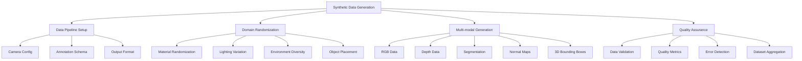

# Synthetic Data Generation for Humanoid Robotics

## Introduction to Isaac Sim's Synthetic Data Pipeline

Synthetic Data Generation (SDG) in Isaac Sim is a powerful capability that enables the creation of large-scale, photorealistic datasets for training machine learning models, particularly for vision-language-action (VLA) systems in humanoid robotics. The SDG pipeline leverages Isaac Sim's photorealistic rendering, GPU-accelerated physics, and domain randomization capabilities to produce diverse, high-quality training data that can bridge the sim-to-real gap.

Key components of the Isaac Sim SDG pipeline:
- **Photorealistic Rendering**: RTX-accelerated rendering with global illumination
- **Domain Randomization**: Systematic variation of scene parameters
- **Automatic Annotation**: Ground truth generation for training data
- **Multi-modal Data**: RGB, depth, segmentation, and sensor data
- **Scalable Generation**: Cloud deployment for large datasets

## Setting Up the Synthetic Data Pipeline

### Isaac Sim Extension for Data Generation

The synthetic data generation process in Isaac Sim is facilitated through dedicated extensions:

```python
# sdg_pipeline_setup.py
import omni
import carb
from omni.isaac.synthetic_utils import DataGen
from omni.synthetic_utils import annotators
from pxr import Gf

class IsaacSyntheticDataGenerator:
    def __init__(self):
        self.data_gen = None
        self.annotators = []
        self.scene_configs = []

    def setup_data_generation_pipeline(self,
                                     output_path="/workspace/synthetic_data",
                                     num_frames=1000,
                                     image_size=(640, 480)):
        """
        Set up the synthetic data generation pipeline
        """
        # Initialize data generation module
        self.data_gen = DataGen(
            "/World",
            "humanoid_robot_scene",
            output_dir=output_path,
            frames=num_frames
        )

        # Configure camera parameters
        self.data_gen.set_camera_params(
            width=image_size[0],
            height=image_size[1],
            fov=60,
            near_clip=0.1,
            far_clip=1000.0
        )

        # Add various annotation annotators
        self.setup_annotation_annotators()

        carb.log_info(f"SDG pipeline configured for {num_frames} frames at {image_size}")

    def setup_annotation_annotators(self):
        """
        Set up various annotation annotators for data generation
        """
        # RGB annotation
        rgb_annotator = annotators.add_annotator(
            "RGB",
            path="/Replicator/OutputData/rgb",
            size=(640, 480)
        )
        self.annotators.append(rgb_annotator)

        # Depth annotation
        depth_annotator = annotators.add_annotator(
            "Depth",
            path="/Replicator/OutputData/depth",
            size=(640, 480)
        )
        self.annotators.append(depth_annotator)

        # Semantic segmentation annotation
        semantic_annotator = annotators.add_annotator(
            "SemanticSegmentation",
            path="/Replicator/OutputData/semantic",
            size=(640, 480),
            colorize=True
        )
        self.annotators.append(semantic_annotator)

        # Instance segmentation annotation
        instance_annotator = annotators.add_annotator(
            "InstanceSegmentation",
            path="/Replicator/OutputData/instance",
            size=(640, 480),
            colorize=True
        )
        self.annotators.append(instance_annotator)

        # Bounding box annotation
        bbox_annotator = annotators.add_annotator(
            "BBox2DTight",
            path="/Replicator/OutputData/bbox",
            size=(640, 480)
        )
        self.annotators.append(bbox_annotator)

        # Normal annotation
        normal_annotator = annotators.add_annotator(
            "Normal",
            path="/Replicator/OutputData/normal",
            size=(640, 480)
        )
        self.annotators.append(normal_annotator)

        carb.log_info(f"Added {len(self.annotators)} annotation annotators to pipeline")

    def configure_domain_randomization(self):
        """
        Configure domain randomization parameters for synthetic data
        """
        # Randomize lighting conditions
        lighting_randomization = {
            "intensity_range": (1000, 5000),
            "color_temperature_range": (4000, 8000),
            "direction_variance": 0.3
        }

        # Randomize materials
        material_randomization = {
            "diffuse_color_range": [(0.1, 0.1, 0.1), (1.0, 1.0, 1.0)],
            "roughness_range": (0.1, 0.9),
            "metallic_range": (0.0, 1.0)
        }

        # Randomize object positions
        position_randomization = {
            "position_jitter": 0.1,  # 10cm max jitter
            "rotation_jitter": 15,   # 15 degree max rotation
            "scale_variance": 0.1    # 10% scale variance
        }

        # Store randomization configs
        self.randomization_configs = {
            "lighting": lighting_randomization,
            "materials": material_randomization,
            "positions": position_randomization
        }

        carb.log_info("Domain randomization configurations set up")

    def setup_humanoid_scenario(self, robot_path="/World/HumanoidRobot"):
        """
        Set up a humanoid robot scenario for data generation
        """
        # Define different humanoid poses and configurations
        humanoid_poses = [
            {"name": "standing", "joint_config": [0] * 28},  # 28 DOF humanoid
            {"name": "walking", "joint_config": self.generate_walking_config()},
            {"name": "kneeling", "joint_config": self.generate_kneeling_config()},
            {"name": "arm_raised", "joint_config": self.generate_arm_raised_config()}
        ]

        # Define camera viewpoints around the humanoid
        camera_positions = [
            {"name": "front", "pos": Gf.Vec3d(2, 0, 1.5), "target": Gf.Vec3d(0, 0, 0.8)},
            {"name": "side", "pos": Gf.Vec3d(0, 2, 1.5), "target": Gf.Vec3d(0, 0, 0.8)},
            {"name": "back", "pos": Gf.Vec3d(-2, 0, 1.5), "target": Gf.Vec3d(0, 0, 0.8)},
            {"name": "overhead", "pos": Gf.Vec3d(0, 0, 3), "target": Gf.Vec3d(0, 0, 0.8)},
            {"name": "close_up", "pos": Gf.Vec3d(0.5, 0, 0.8), "target": Gf.Vec3d(0, 0, 0.8)}
        ]

        self.humanoid_poses = humanoid_poses
        self.camera_positions = camera_positions

        carb.log_info(f"Humanoid scenario configured with {len(humanoid_poses)} poses and {len(camera_positions)} viewpoints")

    def generate_walking_config(self):
        """
        Generate joint configuration for walking pose
        """
        # Simplified walking configuration (28 DOF)
        config = [0.0] * 28

        # Left leg slightly forward
        config[0] = 0.2  # left hip pitch
        config[1] = 0.1  # left hip roll
        config[2] = 0.05  # left hip yaw

        # Right leg slightly back
        config[9] = -0.1  # right hip pitch
        config[10] = -0.1  # right hip roll
        config[11] = -0.05  # right hip yaw

        # Left knee bent
        config[3] = 0.8  # left knee
        config[12] = 0.8  # right knee

        return config

    def generate_kneeling_config(self):
        """
        Generate joint configuration for kneeling pose
        """
        config = [0.0] * 28

        # Both knees bent
        config[3] = 1.5  # left knee (90 degrees)
        config[12] = 1.5  # right knee (90 degrees)

        # Compensate with hip adjustments
        config[0] = 0.5  # left hip pitch
        config[9] = 0.5  # right hip pitch

        return config

    def generate_arm_raised_config(self):
        """
        Generate joint configuration for arm-raised pose
        """
        config = [0.0] * 28

        # Raise left arm
        config[18] = 1.0  # left shoulder pitch
        config[19] = 0.5  # left shoulder roll
        config[20] = 0.2  # left shoulder yaw

        # Raise right arm
        config[21] = 1.0  # right shoulder pitch
        config[22] = -0.5  # right shoulder roll
        config[23] = -0.2  # right shoulder yaw

        return config
```

### Annotation Schema for Humanoid Data

Creating proper annotation schemas is crucial for training downstream models:

```python
# annotation_schema.py
import json
from dataclasses import dataclass
from typing import Dict, List, Any
import numpy as np

@dataclass
class HumanoidPoseAnnotation:
    """Annotation schema for humanoid pose estimation"""
    joint_positions: List[List[float]]  # [x, y, z] for each joint
    joint_visibility: List[bool]       # Whether each joint is visible
    joint_names: List[str]             # Names of joints
    bounding_box: List[float]          # [x, y, width, height] in image coordinates
    confidence: float                  # Overall pose confidence

@dataclass
class SceneAnnotation:
    """Overall scene annotation structure"""
    frame_number: int
    rgb_path: str
    depth_path: str
    semantic_path: str
    instance_path: str
    normal_path: str
    pose_annotations: List[HumanoidPoseAnnotation]
    camera_intrinsics: Dict[str, float]
    camera_extrinsics: List[List[float]]
    timestamp: float

class AnnotationSchemaBuilder:
    def __init__(self):
        self.annotation_schema = {
            "version": "1.0",
            "description": "Humanoid Robot Synthetic Data Annotation Schema",
            "labels": {
                "humanoid_robot": 1,
                "background": 0,
                "obstacles": 2,
                "floor": 3
            },
            "joint_names": [
                "pelvis", "left_hip", "right_hip", "left_knee", "right_knee",
                "left_ankle", "right_ankle", "torso", "left_shoulder", "right_shoulder",
                "left_elbow", "right_elbow", "left_wrist", "right_wrist", "head"
            ],
            "camera_config": {
                "resolution": [640, 480],
                "fov": 60,
                "near_clip": 0.1,
                "far_clip": 1000.0
            }
        }

    def create_pose_annotation(self, joint_positions_3d, image_width=640, image_height=480):
        """
        Create pose annotation from 3D joint positions
        """
        # Project 3D positions to 2D image coordinates
        joint_positions_2d = self.project_3d_to_2d(joint_positions_3d, image_width, image_height)

        # Calculate bounding box
        min_x = min(pos[0] for pos in joint_positions_2d)
        max_x = max(pos[0] for pos in joint_positions_2d)
        min_y = min(pos[1] for pos in joint_positions_2d)
        max_y = max(pos[1] for pos in joint_positions_2d)

        bbox = [min_x, min_y, max_x - min_x, max_y - min_y]

        # Create visibility mask (all joints visible in simulation)
        visibility = [True] * len(joint_positions_2d)

        annotation = HumanoidPoseAnnotation(
            joint_positions=joint_positions_2d,
            joint_visibility=visibility,
            joint_names=self.annotation_schema["joint_names"],
            bounding_box=bbox,
            confidence=1.0
        )

        return annotation

    def project_3d_to_2d(self, positions_3d, img_width, img_height):
        """
        Project 3D joint positions to 2D image coordinates
        """
        # Simplified pinhole camera projection
        projected_positions = []
        for pos in positions_3d:
            # Apply simple projection (in real implementation, use actual camera matrix)
            x_2d = int((pos[0] / pos[2]) * (img_width / 2) + img_width / 2)
            y_2d = int((pos[1] / pos[2]) * (img_height / 2) + img_height / 2)
            projected_positions.append([x_2d, y_2d])

        return projected_positions

    def create_scene_annotation(self, frame_number, file_paths, camera_params, poses_3d):
        """
        Create complete scene annotation
        """
        pose_annotations = []
        for pose_3d in poses_3d:
            pose_annotation = self.create_pose_annotation(pose_3d)
            pose_annotations.append(pose_annotation)

        scene_annotation = SceneAnnotation(
            frame_number=frame_number,
            rgb_path=file_paths.get("rgb", ""),
            depth_path=file_paths.get("depth", ""),
            semantic_path=file_paths.get("semantic", ""),
            instance_path=file_paths.get("instance", ""),
            normal_path=file_paths.get("normal", ""),
            pose_annotations=pose_annotations,
            camera_intrinsics=camera_params.get("intrinsics", {}),
            camera_extrinsics=camera_params.get("extrinsics", []),
            timestamp=float(frame_number) * 0.033  # Assuming 30 FPS
        )

        return scene_annotation

    def save_annotation_file(self, annotation, output_path):
        """
        Save annotation to JSON file
        """
        # Convert dataclass to dictionary
        annotation_dict = {
            "frame_number": annotation.frame_number,
            "rgb_path": annotation.rgb_path,
            "depth_path": annotation.depth_path,
            "semantic_path": annotation.semantic_path,
            "instance_path": annotation.instance_path,
            "normal_path": annotation.normal_path,
            "pose_annotations": [
                {
                    "joint_positions": pose_anno.joint_positions,
                    "joint_visibility": pose_anno.joint_visibility,
                    "joint_names": pose_anno.joint_names,
                    "bounding_box": pose_anno.bounding_box,
                    "confidence": pose_anno.confidence
                }
                for pose_anno in annotation.pose_annotations
            ],
            "camera_intrinsics": annotation.camera_intrinsics,
            "camera_extrinsics": annotation.camera_extrinsics,
            "timestamp": annotation.timestamp
        }

        with open(output_path, 'w') as f:
            json.dump(annotation_dict, f, indent=2)

        carb.log_info(f"Annotation saved to {output_path}")
```

## Domain Randomization Techniques

### Material and Texture Randomization

Domain randomization is crucial for generating diverse synthetic data:

```python
# domain_randomization.py
import random
import numpy as np
from pxr import UsdShade, Sdf, Gf
import carb

class MaterialDomainRandomizer:
    def __init__(self, stage):
        self.stage = stage
        self.material_templates = {
            "metal": {
                "base_color_range": [(0.2, 0.2, 0.2), (0.9, 0.9, 0.9)],
                "metallic_range": (0.7, 1.0),
                "roughness_range": (0.05, 0.3),
                "specular_range": (0.8, 1.0)
            },
            "plastic": {
                "base_color_range": [(0.1, 0.1, 0.1), (1.0, 1.0, 1.0)],
                "metallic_range": (0.0, 0.2),
                "roughness_range": (0.3, 0.8),
                "specular_range": (0.2, 0.7)
            },
            "fabric": {
                "base_color_range": [(0.1, 0.1, 0.1), (0.9, 0.9, 0.9)],
                "metallic_range": (0.0, 0.05),
                "roughness_range": (0.7, 0.95),
                "specular_range": (0.05, 0.2)
            }
        }

    def randomize_material_properties(self, prim_path, material_type="metal", intensity=0.5):
        """
        Randomize material properties for domain randomization
        """
        # Get the material prim
        material_prim = self.stage.GetPrimAtPath(prim_path)

        if not material_prim.IsValid():
            carb.log_error(f"Material prim not found at {prim_path}")
            return False

        # Get template ranges
        if material_type not in self.material_templates:
            material_type = "metal"  # Default to metal

        template = self.material_templates[material_type]

        # Randomize each property
        base_color = self._randomize_color(
            template["base_color_range"][0],
            template["base_color_range"][1],
            intensity
        )

        metallic = self._randomize_scalar(
            template["metallic_range"][0],
            template["metallic_range"][1],
            intensity
        )

        roughness = self._randomize_scalar(
            template["roughness_range"][0],
            template["roughness_range"][1],
            intensity
        )

        specular = self._randomize_scalar(
            template["specular_range"][0],
            template["specular_range"][1],
            intensity
        )

        # Update material properties
        shader_prim = self.stage.GetPrimAtPath(f"{prim_path}/Shader")
        if shader_prim:
            # Update color
            shader_prim.GetAttribute("inputs:diffuse_tint").Set(base_color)

            # Update metallic
            shader_prim.GetAttribute("inputs:metallic").Set(metallic)

            # Update roughness
            shader_prim.GetAttribute("inputs:roughness").Set(roughness)

            # Update specular
            shader_prim.GetAttribute("inputs:specular_reflection").Set(specular)

        return True

    def _randomize_color(self, min_color, max_color, intensity):
        """
        Randomize RGB color within specified range
        """
        min_arr = np.array(min_color)
        max_arr = np.array(max_color)

        # Calculate range
        color_range = max_arr - min_arr

        # Random offset based on intensity
        random_offset = color_range * intensity * (np.random.random(3) - 0.5) * 2

        # Calculate new color
        new_color = min_arr + (color_range * 0.5) + random_offset

        # Clamp to valid range
        new_color = np.clip(new_color, [0, 0, 0], [1, 1, 1])

        return Gf.Vec3f(new_color[0], new_color[1], new_color[2])

    def _randomize_scalar(self, min_val, max_val, intensity):
        """
        Randomize scalar value within specified range
        """
        range_size = max_val - min_val
        center = min_val + range_size * 0.5

        # Random offset based on intensity
        random_offset = range_size * intensity * (random.random() - 0.5) * 2

        # Calculate new value
        new_value = center + random_offset

        # Clamp to valid range
        new_value = max(min_val, min(new_value, max_val))

        return new_value

    def randomize_lighting_conditions(self, intensity=0.3):
        """
        Randomize scene lighting for domain randomization
        """
        # Find all lights in the scene
        lights = self._find_all_lights()

        for light_path in lights:
            light_prim = self.stage.GetPrimAtPath(light_path)

            if light_prim:
                # Randomize light intensity
                current_intensity = light_prim.GetAttribute("inputs:intensity").Get()
                intensity_variation = current_intensity * intensity * (random.random() - 0.5) * 2
                new_intensity = max(100, current_intensity + intensity_variation)  # Min 100 to avoid complete darkness
                light_prim.GetAttribute("inputs:intensity").Set(new_intensity)

                # Randomize light color (slightly)
                current_color = light_prim.GetAttribute("inputs:color").Get()
                color_variation = (random.uniform(-0.1, 0.1), random.uniform(-0.1, 0.1), random.uniform(-0.1, 0.1))
                new_color = (
                    max(0.5, min(1.5, current_color[0] + color_variation[0])),
                    max(0.5, min(1.5, current_color[1] + color_variation[1])),
                    max(0.5, min(1.5, current_color[2] + color_variation[2]))
                )
                light_prim.GetAttribute("inputs:color").Set(new_color)

        carb.log_info(f"Randomized lighting conditions for {len(lights)} lights")

    def _find_all_lights(self):
        """
        Find all light prims in the scene
        """
        light_paths = []

        # Simple search for common light types
        for prim in self.stage.GetPrimAtPath("/World").GetAllChildren():
            if prim.GetTypeName() in ["DistantLight", "DomeLight", "SphereLight", "RectLight"]:
                light_paths.append(prim.GetPath().pathString)

        return light_paths

    def randomize_object_properties(self, object_paths, position_jitter=0.1, rotation_jitter=15):
        """
        Randomize object positions and rotations for domain randomization
        """
        for obj_path in object_paths:
            obj_prim = self.stage.GetPrimAtPath(obj_path)
            if obj_prim:
                # Get current position and rotation
                current_pos_attr = obj_prim.GetAttribute("xformOp:translate")
                current_rot_attr = obj_prim.GetAttribute("xformOp:rotateXYZ")

                if current_pos_attr:
                    current_pos = current_pos_attr.Get()
                    # Apply position jitter
                    jitter = (random.uniform(-position_jitter, position_jitter),
                             random.uniform(-position_jitter, position_jitter),
                             random.uniform(-position_jitter/2, position_jitter/2))  # Less Z jitter
                    new_pos = Gf.Vec3d(current_pos[0] + jitter[0],
                                      current_pos[1] + jitter[1],
                                      current_pos[2] + jitter[2])
                    current_pos_attr.Set(new_pos)

                if current_rot_attr:
                    current_rot = current_rot_attr.Get()
                    # Apply rotation jitter
                    rot_jitter = (random.uniform(-rotation_jitter, rotation_jitter),
                                 random.uniform(-rotation_jitter, rotation_jitter),
                                 random.uniform(-rotation_jitter, rotation_jitter))
                    new_rot = Gf.Vec3f(current_rot[0] + rot_jitter[0],
                                      current_rot[1] + rot_jitter[1],
                                      current_rot[2] + rot_jitter[2])
                    current_rot_attr.Set(new_rot)

        carb.log_info(f"Randomized properties for {len(object_paths)} objects")
```

### Environment and Background Randomization

Creating diverse environments enhances the realism of synthetic data:

```python
# environment_randomization.py
from omni.isaac.core.utils.prims import create_prim
from pxr import Gf
import random
import carb

class EnvironmentRandomizer:
    def __init__(self, stage):
        self.stage = stage
        self.background_templates = [
            "indoor_office",
            "outdoor_park",
            "industrial_warehouse",
            "home_living_room",
            "laboratory"
        ]

        self.obstacle_types = [
            "box", "cylinder", "sphere", "cone", "capsule"
        ]

    def randomize_background_environment(self, env_type=None):
        """
        Randomize the background environment
        """
        if env_type is None:
            env_type = random.choice(self.background_templates)

        # Clear existing background
        self._clear_background()

        # Create new background based on type
        if env_type == "indoor_office":
            self._create_office_environment()
        elif env_type == "outdoor_park":
            self._create_park_environment()
        elif env_type == "industrial_warehouse":
            self._create_warehouse_environment()
        elif env_type == "home_living_room":
            self._create_living_room_environment()
        elif env_type == "laboratory":
            self._create_laboratory_environment()

        carb.log_info(f"Created {env_type} environment")

    def _clear_background(self):
        """
        Clear existing background elements
        """
        # Remove background objects (but keep ground plane and lights)
        background_paths = [
            "/World/OfficeObjects",
            "/World/ParkObjects",
            "/World/WarehouseObjects",
            "/World/HomeObjects",
            "/World/LabObjects"
        ]

        for path in background_paths:
            prim = self.stage.GetPrimAtPath(path)
            if prim and prim.IsValid():
                self.stage.RemovePrim(path)

    def _create_office_environment(self):
        """
        Create office environment with furniture and objects
        """
        office_path = "/World/OfficeObjects"
        create_prim(office_path, "Xform")

        # Add office furniture
        office_objects = [
            {"type": "Cube", "pos": (2, 1, 0.5), "scale": (0.8, 0.8, 1.0), "name": "desk"},
            {"type": "Cylinder", "pos": (2.5, 0.5, 0.25), "scale": (0.3, 0.3, 0.5), "name": "chair_leg"},
            {"type": "Cube", "pos": (-1, 2, 0.8), "scale": (0.6, 0.6, 1.6), "name": "bookshelf"},
            {"type": "Sphere", "pos": (-1.5, -1.5, 0.3), "scale": (0.2, 0.2, 0.2), "name": "plant_pot"}
        ]

        for i, obj in enumerate(office_objects):
            obj_path = f"{office_path}/{obj['name']}_{i}"
            create_prim(
                prim_path=obj_path,
                prim_type=obj["type"],
                position=Gf.Vec3d(*obj["pos"]),
                scale=Gf.Vec3d(*obj["scale"])
            )

    def _create_park_environment(self):
        """
        Create park environment with natural elements
        """
        park_path = "/World/ParkObjects"
        create_prim(park_path, "Xform")

        # Add park elements
        park_objects = [
            {"type": "Cylinder", "pos": (3, 2, 1.5), "scale": (0.4, 0.4, 3.0), "name": "tree_trunk"},
            {"type": "Sphere", "pos": (3, 2, 3.5), "scale": (1.5, 1.5, 1.5), "name": "tree_top"},
            {"type": "Cube", "pos": (-2, 1, 0.2), "scale": (2.0, 1.0, 0.4), "name": "bench"},
            {"type": "Cube", "pos": (0, -2, 0.1), "scale": (3.0, 2.0, 0.2), "name": "sandbox"}
        ]

        for i, obj in enumerate(park_objects):
            obj_path = f"{park_path}/{obj['name']}_{i}"
            create_prim(
                prim_path=obj_path,
                prim_type=obj["type"],
                position=Gf.Vec3d(*obj["pos"]),
                scale=Gf.Vec3d(*obj["scale"])
            )

    def _create_warehouse_environment(self):
        """
        Create warehouse environment with industrial elements
        """
        warehouse_path = "/World/WarehouseObjects"
        create_prim(warehouse_path, "Xform")

        # Add warehouse elements
        for i in range(5):
            x_pos = -4 + i * 2
            shelf_path = f"{warehouse_path}/shelf_{i}"
            create_prim(
                prim_path=shelf_path,
                prim_type="Cube",
                position=Gf.Vec3d(x_pos, 0, 1.5),
                scale=Gf.Vec3d(1.5, 0.3, 3.0)
            )

        # Add boxes
        for i in range(8):
            x_pos = -3 + (i % 4) * 1.5
            y_pos = 1 + (i // 4) * 1.5
            box_path = f"{warehouse_path}/box_{i}"
            create_prim(
                prim_path=box_path,
                prim_type="Cube",
                position=Gf.Vec3d(x_pos, y_pos, 0.5),
                scale=Gf.Vec3d(0.8, 0.8, 1.0)
            )

    def add_random_obstacles(self, count=5, area_bounds=((-5, -5), (5, 5))):
        """
        Add random obstacles to the environment
        """
        obstacles_path = "/World/RandomObstacles"
        create_prim(obstacles_path, "Xform")

        min_area, max_area = area_bounds

        for i in range(count):
            # Randomly select obstacle type
            obstacle_type = random.choice(self.obstacle_types)

            # Random position within bounds
            x = random.uniform(min_area[0], max_area[0])
            y = random.uniform(min_area[1], max_area[1])
            z = random.uniform(0.1, 1.0)  # Height above ground

            # Random scale
            scale = random.uniform(0.2, 1.0)

            obstacle_path = f"{obstacles_path}/obstacle_{i}"

            if obstacle_type == "box":
                create_prim(
                    prim_path=obstacle_path,
                    prim_type="Cube",
                    position=Gf.Vec3d(x, y, z/2 + 0.1),  # Position at center
                    scale=Gf.Vec3d(scale, scale, scale)
                )
            elif obstacle_type == "cylinder":
                create_prim(
                    prim_path=obstacle_path,
                    prim_type="Cylinder",
                    position=Gf.Vec3d(x, y, scale + 0.1),
                    scale=Gf.Vec3d(scale, scale, scale)
                )
            elif obstacle_type == "sphere":
                create_prim(
                    prim_path=obstacle_path,
                    prim_type="Sphere",
                    position=Gf.Vec3d(x, y, scale + 0.1),
                    scale=Gf.Vec3d(scale, scale, scale)
                )
            # Add other obstacle types as needed

        carb.log_info(f"Added {count} random obstacles to environment")

    def randomize_ground_surface(self, surface_type="random"):
        """
        Randomize the ground surface properties
        """
        ground_prim = self.stage.GetPrimAtPath("/World/GroundPlane")
        if not ground_prim:
            carb.log_warn("Ground plane not found, skipping surface randomization")
            return

        # Different ground surface materials
        ground_materials = {
            "concrete": {"friction": (0.6, 0.8), "restitution": 0.1},
            "grass": {"friction": (0.7, 0.9), "restitution": 0.05},
            "wood": {"friction": (0.5, 0.7), "restitution": 0.15},
            "carpet": {"friction": (0.8, 0.95), "restitution": 0.02},
            "tile": {"friction": (0.4, 0.6), "restitution": 0.2}
        }

        if surface_type == "random":
            surface_type = random.choice(list(ground_materials.keys()))

        material_props = ground_materials[surface_type]

        # Apply material properties
        from pxr import UsdPhysics
        material_api = UsdPhysics.MaterialAPI.Apply(ground_prim)

        # Randomize friction within range
        static_friction = random.uniform(*material_props["friction"])
        dynamic_friction = static_friction * random.uniform(0.8, 0.95)

        material_api.GetStaticFrictionAttr().Set(static_friction)
        material_api.GetDynamicFrictionAttr().Set(dynamic_friction)
        material_api.GetRestitutionAttr().Set(material_props["restitution"])

        carb.log_info(f"Ground surface set to {surface_type} type")
```

## Multi-modal Data Generation

### RGB, Depth, and Segmentation Pipeline

Creating multi-modal datasets is essential for comprehensive humanoid robot perception:

```python
# multi_modal_pipeline.py
from omni.synthetic_utils import annotators
from omni.isaac.core.utils.stage import get_current_stage
from omni.isaac.sensor import Camera
import carb
import numpy as np

class MultiModalDataGenerator:
    def __init__(self, robot_path="/World/HumanoidRobot"):
        self.robot_path = robot_path
        self.cameras = []
        self.annotators = []

    def setup_multi_modal_cameras(self, camera_configs):
        """
        Set up multiple cameras for different modalities
        """
        for i, config in enumerate(camera_configs):
            camera_path = f"{self.robot_path}/camera_{i}"

            # Create camera prim
            camera = Camera(
                prim_path=camera_path,
                position=config["position"],
                frequency=config.get("frequency", 30),
                resolution=config.get("resolution", (640, 480))
            )

            # Configure camera properties
            camera.config = {
                "focal_length": config.get("focal_length", 24.0),
                "horizontal_aperture": config.get("horizontal_aperture", 20.955),
                "clipping_range": config.get("clipping_range", (0.1, 1000.0))
            }

            self.cameras.append({
                "camera": camera,
                "config": config,
                "modalities": config.get("modalities", ["rgb"])
            })

        carb.log_info(f"Setup {len(self.cameras)} multi-modal cameras")

    def setup_annotators(self):
        """
        Set up annotators for different modalities
        """
        # RGB annotator
        rgb_annotator = annotators.add_annotator(
            "RGB",
            path="/Replicator/OutputData/rgb"
        )
        self.annotators.append({"type": "rgb", "annotator": rgb_annotator})

        # Depth annotator
        depth_annotator = annotators.add_annotator(
            "Depth",
            path="/Replicator/OutputData/depth"
        )
        self.annotators.append({"type": "depth", "annotator": depth_annotator})

        # Semantic segmentation annotator
        semantic_annotator = annotators.add_annotator(
            "SemanticSegmentation",
            path="/Replicator/OutputData/semantic",
            colorize=True
        )
        self.annotators.append({"type": "semantic", "annotator": semantic_annotator})

        # Instance segmentation annotator
        instance_annotator = annotators.add_annotator(
            "InstanceSegmentation",
            path="/Replicator/OutputData/instance",
            colorize=True
        )
        self.annotators.append({"type": "instance", "annotator": instance_annotator})

        # Normal annotator
        normal_annotator = annotators.add_annotator(
            "Normal",
            path="/Replicator/OutputData/normal"
        )
        self.annotators.append({"type": "normal", "annotator": normal_annotator})

        # 3D bounding box annotator
        bbox_3d_annotator = annotators.add_annotator(
            "BBox3D",
            path="/Replicator/OutputData/bbox3d"
        )
        self.annotators.append({"type": "bbox3d", "annotator": bbox_3d_annotator})

        carb.log_info(f"Setup {len(self.annotators)} annotators for multi-modal data")

    def generate_multi_modal_frame(self, frame_number, humanoid_pose_config=None):
        """
        Generate a single multi-modal frame with all annotations
        """
        # Set humanoid pose if specified
        if humanoid_pose_config:
            self._set_humanoid_pose(humanoid_pose_config)

        # Capture data from all cameras
        frame_data = {}

        for cam_info in self.cameras:
            camera = cam_info["camera"]
            modalities = cam_info["modalities"]

            # Capture RGB data
            if "rgb" in modalities:
                rgb_data = camera.get_rgb()
                frame_data[f"camera_{cam_info['config']['name']}_rgb"] = rgb_data

            # Capture depth data
            if "depth" in modalities:
                depth_data = camera.get_depth()
                frame_data[f"camera_{cam_info['config']['name']}_depth"] = depth_data

        # Generate annotations using replicator
        annotations = self._generate_annotations(frame_number)

        # Combine frame data with annotations
        result = {
            "frame_number": frame_number,
            "data": frame_data,
            "annotations": annotations
        }

        return result

    def _set_humanoid_pose(self, joint_config):
        """
        Set humanoid robot to specified joint configuration
        """
        # This would interface with the physics control system
        # For now, just log the intended pose
        carb.log_info(f"Setting humanoid to pose with {len(joint_config)} joint values")

    def _generate_annotations(self, frame_number):
        """
        Generate annotations for current frame
        """
        annotations = {}

        for annotator_info in self.annotators:
            annotator_type = annotator_info["type"]
            annotator = annotator_info["annotator"]

            # In a real implementation, this would call the annotator
            # For simulation, we'll return placeholder data
            if annotator_type == "rgb":
                annotations["rgb"] = f"rgb_frame_{frame_number}.png"
            elif annotator_type == "depth":
                annotations["depth"] = f"depth_frame_{frame_number}.exr"
            elif annotator_type == "semantic":
                annotations["semantic"] = f"semantic_frame_{frame_number}.png"
            elif annotator_type == "instance":
                annotations["instance"] = f"instance_frame_{frame_number}.png"
            elif annotator_type == "normal":
                annotations["normal"] = f"normal_frame_{frame_number}.exr"
            elif annotator_type == "bbox3d":
                annotations["bbox3d"] = f"bbox3d_frame_{frame_number}.json"

        return annotations

    def generate_dataset(self, output_dir, num_frames=1000,
                        humanoid_poses=None, domain_randomization=True):
        """
        Generate a complete multi-modal dataset
        """
        dataset_config = {
            "output_directory": output_dir,
            "total_frames": num_frames,
            "modalities": [ann["type"] for ann in self.annotators],
            "humanoid_poses": humanoid_poses if humanoid_poses else [],
            "domain_randomization": domain_randomization
        }

        carb.log_info(f"Starting dataset generation with {num_frames} frames")

        # Initialize domain randomizer if enabled
        if domain_randomization:
            from .domain_randomization import EnvironmentRandomizer, MaterialDomainRandomizer
            env_randomizer = EnvironmentRandomizer(get_current_stage())
            mat_randomizer = MaterialDomainRandomizer(get_current_stage())

        # Generate frames
        for frame_num in range(num_frames):
            # Apply domain randomization periodically
            if domain_randomization and frame_num % 100 == 0:
                env_randomizer.randomize_background_environment()
                env_randomizer.add_random_obstacles(count=random.randint(3, 8))
                # Randomize some material properties
                mat_randomizer.randomize_lighting_conditions()

            # Select humanoid pose
            pose_config = None
            if humanoid_poses:
                pose_config = random.choice(humanoid_poses)

            # Generate frame
            frame_result = self.generate_multi_modal_frame(frame_num, pose_config)

            # Save frame data
            self._save_frame_data(frame_result, output_dir)

            # Progress logging
            if frame_num % 100 == 0:
                carb.log_info(f"Generated {frame_num}/{num_frames} frames")

        carb.log_info(f"Dataset generation complete. {num_frames} frames generated in {output_dir}")

    def _save_frame_data(self, frame_result, output_dir):
        """
        Save frame data to output directory
        """
        # In a real implementation, this would save the actual image data
        # For this example, we'll just log what would be saved
        frame_num = frame_result["frame_number"]
        carb.log_info(f"Saving frame {frame_num} data to {output_dir}")
```

## Large-Scale Data Generation Strategies

### Batch and Distributed Generation

For generating large datasets efficiently:

```python
# distributed_generation.py
import concurrent.futures
import multiprocessing as mp
from dataclasses import dataclass
from typing import List, Dict
import json
import os
import carb

@dataclass
class GenerationJob:
    """Definition of a single data generation job"""
    job_id: str
    start_frame: int
    end_frame: int
    output_dir: str
    scene_config: Dict
    humanoid_poses: List
    randomization_config: Dict

class DistributedDataGenerator:
    def __init__(self, num_workers=None):
        self.num_workers = num_workers or mp.cpu_count()
        self.completed_jobs = []
        self.failed_jobs = []

    def create_generation_jobs(self, total_frames, output_dir,
                             frames_per_job=100, scene_configs=None):
        """
        Create distributed generation jobs
        """
        if scene_configs is None:
            scene_configs = [{}]  # Default empty config

        jobs = []
        job_id = 0

        for start_frame in range(0, total_frames, frames_per_job):
            end_frame = min(start_frame + frames_per_job, total_frames)

            # Cycle through scene configurations
            scene_config = scene_configs[job_id % len(scene_configs)]

            job = GenerationJob(
                job_id=f"job_{job_id:04d}",
                start_frame=start_frame,
                end_frame=end_frame,
                output_dir=f"{output_dir}/job_{job_id:04d}",
                scene_config=scene_config,
                humanoid_poses=[],  # Will be filled in
                randomization_config={
                    "material_intensity": 0.3,
                    "lighting_intensity": 0.2,
                    "position_jitter": 0.1
                }
            )

            jobs.append(job)
            job_id += 1

        carb.log_info(f"Created {len(jobs)} distributed generation jobs")
        return jobs

    def execute_generation_job(self, job: GenerationJob):
        """
        Execute a single generation job (this would run in a separate process)
        """
        try:
            # Create output directory
            os.makedirs(job.output_dir, exist_ok=True)

            # Initialize Isaac Sim in this process
            # This is a simplified representation
            # In reality, you'd need to properly initialize Isaac Sim

            # Set up scene based on configuration
            self._setup_scene_for_job(job)

            # Generate frames for this job
            frames_generated = 0
            for frame_num in range(job.start_frame, job.end_frame):
                # Generate single frame
                frame_data = self._generate_single_frame(frame_num, job)

                # Save frame data
                self._save_frame(frame_data, job.output_dir, frame_num)

                frames_generated += 1

                # Log progress occasionally
                if frame_num % 50 == 0:
                    carb.log_info(f"Job {job.job_id}: Generated frame {frame_num}")

            # Save job completion info
            job_info = {
                "job_id": job.job_id,
                "frames_generated": frames_generated,
                "start_frame": job.start_frame,
                "end_frame": job.end_frame,
                "output_dir": job.output_dir,
                "status": "completed"
            }

            # Write completion file
            completion_file = os.path.join(job.output_dir, "job_completed.json")
            with open(completion_file, 'w') as f:
                json.dump(job_info, f, indent=2)

            return job_info

        except Exception as e:
            error_info = {
                "job_id": job.job_id,
                "error": str(e),
                "status": "failed"
            }
            return error_info

    def _setup_scene_for_job(self, job: GenerationJob):
        """
        Set up the scene based on job configuration
        """
        # Apply scene-specific configuration
        # This would configure lighting, materials, objects, etc.
        carb.log_info(f"Setting up scene for job {job.job_id}")

    def _generate_single_frame(self, frame_num, job: GenerationJob):
        """
        Generate a single frame of data
        """
        # This would generate actual frame data
        # For simulation, return placeholder data
        return {
            "frame_number": frame_num,
            "timestamp": frame_num * 0.033,  # Assuming 30 FPS
            "modalities": ["rgb", "depth", "semantic", "instance", "normal"]
        }

    def _save_frame(self, frame_data, output_dir, frame_num):
        """
        Save a single frame of data
        """
        # This would save the actual frame data to files
        pass

    def execute_parallel_generation(self, jobs: List[GenerationJob]):
        """
        Execute generation jobs in parallel
        """
        with concurrent.futures.ProcessPoolExecutor(max_workers=self.num_workers) as executor:
            # Submit all jobs
            future_to_job = {executor.submit(self.execute_generation_job, job): job for job in jobs}

            # Collect results as they complete
            for future in concurrent.futures.as_completed(future_to_job):
                job = future_to_job[future]
                try:
                    result = future.result()
                    if result["status"] == "completed":
                        self.completed_jobs.append(result)
                        carb.log_info(f"Job {job.job_id} completed: {result['frames_generated']} frames")
                    else:
                        self.failed_jobs.append(result)
                        carb.log_error(f"Job {job.job_id} failed: {result['error']}")
                except Exception as e:
                    carb.log_error(f"Job {job.job_id} generated exception: {e}")
                    self.failed_jobs.append({
                        "job_id": job.job_id,
                        "error": str(e),
                        "status": "exception"
                    })

        carb.log_info(f"Distributed generation completed. {len(self.completed_jobs)} successful, {len(self.failed_jobs)} failed.")

        return self.completed_jobs, self.failed_jobs

    def aggregate_dataset_metadata(self, output_dir, completed_jobs):
        """
        Aggregate metadata from all completed jobs
        """
        # Create overall dataset metadata
        dataset_metadata = {
            "total_frames": sum(job["frames_generated"] for job in completed_jobs),
            "jobs_completed": len(completed_jobs),
            "jobs_failed": len(self.failed_jobs),
            "output_directory": output_dir,
            "generated_at": carb.settings.get_settings().get("/app/timestamp", "unknown"),
            "total_size": "to_be_calculated",
            "modalities": ["rgb", "depth", "semantic", "instance", "normal"]
        }

        # Write dataset metadata
        metadata_file = os.path.join(output_dir, "dataset_metadata.json")
        with open(metadata_file, 'w') as f:
            json.dump(dataset_metadata, f, indent=2)

        # Create index file linking all frames
        index_data = []
        for job in completed_jobs:
            job_frames = []
            for frame_num in range(job["start_frame"], job["end_frame"]):
                frame_entry = {
                    "frame_number": frame_num,
                    "job_id": job["job_id"],
                    "relative_path": f"{job['job_id']}/frame_{frame_num:06d}",
                    "modalities": ["rgb", "depth", "semantic", "instance", "normal"]
                }
                job_frames.append(frame_entry)
            index_data.extend(job_frames)

        # Write index file
        index_file = os.path.join(output_dir, "dataset_index.json")
        with open(index_file, 'w') as f:
            json.dump(index_data, f, indent=2)

        carb.log_info(f"Dataset metadata aggregated. {dataset_metadata['total_frames']} total frames indexed.")
```

## Quality Assurance and Validation

### Data Quality Validation

Ensuring synthetic data quality is crucial for downstream training:

```python
# quality_assurance.py
import numpy as np
from PIL import Image
import json
import os
from typing import Dict, List, Tuple
import carb

class SyntheticDataQualityValidator:
    def __init__(self):
        self.validation_metrics = {}
        self.error_thresholds = {
            "rgb_min_brightness": 0.05,  # 5% minimum brightness
            "rgb_max_brightness": 0.95,  # 95% maximum brightness (avoid saturation)
            "depth_min_range": 0.1,      # Minimum depth in meters
            "depth_max_range": 100.0,    # Maximum depth in meters
            "annotation_coverage": 0.05, # Minimum object coverage in frame
            "normal_consistency": 0.8    # Minimum normal vector consistency
        }

    def validate_rgb_data(self, rgb_image_path: str) -> Dict:
        """
        Validate RGB image quality
        """
        try:
            with Image.open(rgb_image_path) as img:
                # Convert to numpy array
                img_array = np.array(img)

                # Calculate brightness statistics
                brightness = np.mean(img_array / 255.0, axis=(0, 1))
                min_brightness = np.min(img_array / 255.0)
                max_brightness = np.max(img_array / 255.0)

                # Check for over/under saturation
                over_saturated = np.mean((img_array >= 254).astype(np.float32))
                under_saturated = np.mean((img_array <= 1).astype(np.float32))

                # Resolution check
                height, width = img_array.shape[:2]

                validation_result = {
                    "brightness_mean": brightness.tolist() if len(brightness) > 1 else float(brightness),
                    "brightness_min": float(min_brightness),
                    "brightness_max": float(max_brightness),
                    "over_saturated_ratio": float(over_saturated),
                    "under_saturated_ratio": float(under_saturated),
                    "resolution": [width, height],
                    "valid": (
                        min_brightness >= self.error_thresholds["rgb_min_brightness"] and
                        max_brightness <= self.error_thresholds["rgb_max_brightness"] and
                        over_saturated < 0.1 and  # Less than 10% saturation
                        under_saturated < 0.1
                    )
                }

                return validation_result

        except Exception as e:
            carb.log_error(f"Error validating RGB data {rgb_image_path}: {e}")
            return {"valid": False, "error": str(e)}

    def validate_depth_data(self, depth_path: str) -> Dict:
        """
        Validate depth data quality
        """
        try:
            # For this example, assuming depth is stored as EXR or similar
            # In real implementation, load the actual depth file
            with Image.open(depth_path) as img:
                depth_array = np.array(img, dtype=np.float32)

                # Calculate depth statistics
                valid_depths = depth_array[depth_array > 0]  # Only consider valid depths

                if len(valid_depths) == 0:
                    return {"valid": False, "error": "No valid depth values"}

                min_depth = np.min(valid_depths)
                max_depth = np.max(valid_depths)
                mean_depth = np.mean(valid_depths)

                # Check for reasonable depth range
                validation_result = {
                    "min_depth": float(min_depth),
                    "max_depth": float(max_depth),
                    "mean_depth": float(mean_depth),
                    "valid_depth_ratio": len(valid_depths) / depth_array.size,
                    "valid": (
                        min_depth >= self.error_thresholds["depth_min_range"] and
                        max_depth <= self.error_thresholds["depth_max_range"] and
                        len(valid_depths) / depth_array.size > 0.5  # At least 50% valid pixels
                    )
                }

                return validation_result

        except Exception as e:
            carb.log_error(f"Error validating depth data {depth_path}: {e}")
            return {"valid": False, "error": str(e)}

    def validate_segmentation_data(self, segmentation_path: str, instance_path: str = None) -> Dict:
        """
        Validate segmentation data quality
        """
        try:
            # Load semantic segmentation
            with Image.open(segmentation_path) as img:
                semantic_seg = np.array(img)

            # Load instance segmentation if provided
            if instance_path and os.path.exists(instance_path):
                with Image.open(instance_path) as img:
                    instance_seg = np.array(img)
            else:
                instance_seg = None

            # Analyze segmentation quality
            unique_labels = np.unique(semantic_seg)
            total_pixels = semantic_seg.size

            # Check for sufficient object coverage
            background_label = 0  # Assuming 0 is background
            object_pixels = np.sum(semantic_seg != background_label)
            object_coverage = object_pixels / total_pixels

            validation_result = {
                "unique_labels": unique_labels.tolist(),
                "total_labels": len(unique_labels),
                "object_coverage": float(object_coverage),
                "background_ratio": float(np.sum(semantic_seg == background_label) / total_pixels),
                "valid": object_coverage >= self.error_thresholds["annotation_coverage"]
            }

            # Add instance segmentation analysis if available
            if instance_seg is not None:
                unique_instances = np.unique(instance_seg)
                validation_result["unique_instances"] = unique_instances.tolist()
                validation_result["total_instances"] = len(unique_instances) - 1  # Exclude background

            return validation_result

        except Exception as e:
            carb.log_error(f"Error validating segmentation data: {e}")
            return {"valid": False, "error": str(e)}

    def validate_pose_annotations(self, annotation_path: str) -> Dict:
        """
        Validate pose annotation quality
        """
        try:
            with open(annotation_path, 'r') as f:
                annotation_data = json.load(f)

            # Check for valid pose data
            pose_annotations = annotation_data.get("pose_annotations", [])

            if not pose_annotations:
                return {"valid": False, "error": "No pose annotations found"}

            total_joints = 0
            visible_joints = 0

            for pose in pose_annotations:
                joints = pose.get("joint_positions", [])
                visibility = pose.get("joint_visibility", [])

                total_joints += len(joints)
                visible_joints += sum(1 for v in visibility if v)

            validation_result = {
                "total_poses": len(pose_annotations),
                "total_joints": total_joints,
                "visible_joints": visible_joints,
                "visibility_ratio": visible_joints / total_joints if total_joints > 0 else 0,
                "valid": total_joints > 0 and visible_joints / total_joints > 0.5  # At least 50% visibility
            }

            return validation_result

        except Exception as e:
            carb.log_error(f"Error validating pose annotations {annotation_path}: {e}")
            return {"valid": False, "error": str(e)}

    def run_comprehensive_validation(self, dataset_dir: str) -> Dict:
        """
        Run comprehensive validation on an entire dataset
        """
        validation_report = {
            "dataset_directory": dataset_dir,
            "total_files": 0,
            "valid_files": 0,
            "invalid_files": 0,
            "validation_results": [],
            "summary": {}
        }

        # Walk through dataset directory
        for root, dirs, files in os.walk(dataset_dir):
            for file in files:
                file_path = os.path.join(root, file)
                file_ext = os.path.splitext(file)[1].lower()

                validation_report["total_files"] += 1

                # Determine validation method based on file type
                if file_ext in ['.jpg', '.png', '.exr', '.tiff']:
                    # RGB or depth validation
                    if 'depth' in file_path or file_ext == '.exr':
                        result = self.validate_depth_data(file_path)
                    else:
                        result = self.validate_rgb_data(file_path)
                elif 'annotation' in file_path or file_ext == '.json':
                    # Annotation validation
                    result = self.validate_pose_annotations(file_path)
                elif 'seg' in file_path:
                    # Segmentation validation
                    result = self.validate_segmentation_data(file_path)
                else:
                    continue  # Skip other file types

                result["file_path"] = file_path
                validation_report["validation_results"].append(result)

                if result.get("valid", False):
                    validation_report["valid_files"] += 1
                else:
                    validation_report["invalid_files"] += 1

        # Generate summary
        if validation_report["total_files"] > 0:
            validation_report["summary"] = {
                "validity_rate": validation_report["valid_files"] / validation_report["total_files"],
                "invalid_count": validation_report["invalid_files"],
                "total_count": validation_report["total_files"]
            }

        carb.log_info(f"Validation complete: {validation_report['valid_files']}/{validation_report['total_files']} files valid")
        return validation_report
```

## Best Practices for Synthetic Data Generation

### Efficiency and Quality Guidelines

1. **Scene Variation**: Systematically vary lighting, materials, and environments
2. **Realistic Poses**: Include diverse but physically plausible humanoid poses
3. **Annotation Accuracy**: Ensure ground truth annotations are precise
4. **Data Balance**: Generate balanced datasets with equal representation
5. **Quality Control**: Implement validation pipelines to catch issues early

### Performance Optimization

- **Batch Processing**: Generate data in large batches for efficiency
- **GPU Utilization**: Maximize GPU usage for rendering and physics
- **Memory Management**: Efficiently manage memory during generation
- **Parallel Execution**: Use distributed generation for large datasets



## Troubleshooting Common Issues

### Generation Problems and Solutions

- **Memory Issues**: Reduce batch sizes or use cloud infrastructure
- **Rendering Artifacts**: Check material properties and lighting setup
- **Annotation Errors**: Validate annotation schema and coordinate systems
- **Performance Bottlenecks**: Optimize scene complexity and GPU usage

:::tip
Start with small datasets to validate your pipeline before scaling up. Monitor quality metrics throughout the generation process to catch issues early.
:::

:::warning
Synthetic data generation can consume significant computational resources and storage. Plan your infrastructure and budget accordingly for large-scale datasets.
:::

## Summary

Synthetic Data Generation in Isaac Sim provides powerful capabilities for creating diverse, high-quality training datasets for humanoid robotics applications. By leveraging domain randomization, multi-modal data generation, and quality validation pipelines, researchers can create datasets that effectively bridge the sim-to-real gap for vision-language-action systems.

In the next section, we'll explore Isaac ROS integration, which enables seamless connection between Isaac Sim and the ROS 2 ecosystem for real-time humanoid robot control.