# Human-Robot Interaction via Natural Language

## Introduction to Natural Language HRI

Human-Robot Interaction (HRI) through natural language represents a critical component of Vision-Language-Action systems, enabling intuitive and accessible interaction between humans and humanoid robots. Unlike traditional robot interfaces that require specialized programming knowledge, natural language interaction allows users to communicate with robots using everyday speech patterns and commands.

Natural language HRI encompasses several key components:
- **Speech Recognition**: Converting spoken language to text
- **Natural Language Understanding (NLU)**: Interpreting user intent from text
- **Dialog Management**: Maintaining coherent conversation flow
- **Natural Language Generation (NLG)**: Producing appropriate responses
- **Embodied Language**: Understanding spatial and physical references
- **Social Cues**: Recognizing and responding to social signals

## Architecture of Natural Language HRI Systems

### Speech Processing Pipeline

The foundation of natural language HRI is a robust speech processing pipeline:

```python
# speech_processing_pipeline.py
import rospy
import speech_recognition as sr
import pyttsx3
import numpy as np
from std_msgs.msg import String
from geometry_msgs.msg import Pose
from sensor_msgs.msg import Image
import threading
import queue
import time

class SpeechProcessingPipeline:
    def __init__(self):
        # Initialize speech recognition
        self.recognizer = sr.Recognizer()
        self.microphone = sr.Microphone()

        # Initialize text-to-speech
        self.tts_engine = pyttsx3.init()
        self.configure_tts()

        # ROS interfaces
        self.speech_command_pub = rospy.Publisher('/natural_language_command', String, queue_size=10)
        self.response_pub = rospy.Publisher('/robot_response', String, queue_size=10)
        self.audio_input_sub = rospy.Subscriber('/audio_input', String, self.audio_callback)

        # Internal state
        self.command_queue = queue.Queue(maxsize=10)
        self.response_queue = queue.Queue(maxsize=10)
        self.listening_active = False
        self.conversation_context = []

        # Audio processing parameters
        self.energy_threshold = 3000  # Adjust based on environment
        self.pause_threshold = 0.8
        self.phrase_time_limit = 10

        # Setup microphone
        with self.microphone as source:
            self.recognizer.adjust_for_ambient_noise(source, duration=1.0)

        rospy.loginfo("Speech Processing Pipeline initialized")

    def configure_tts(self):
        """
        Configure text-to-speech engine
        """
        # Set voice properties
        voices = self.tts_engine.getProperty('voices')
        if voices:
            self.tts_engine.setProperty('voice', voices[0].id)

        # Set speech rate
        self.tts_engine.setProperty('rate', 150)  # Words per minute

        # Set volume
        self.tts_engine.setProperty('volume', 0.9)

    def start_listening(self):
        """
        Start continuous listening for speech commands
        """
        self.listening_active = True
        self.listening_thread = threading.Thread(target=self.continuous_listening, daemon=True)
        self.listening_thread.start()

    def stop_listening(self):
        """
        Stop listening for speech commands
        """
        self.listening_active = False

    def continuous_listening(self):
        """
        Continuously listen for speech commands
        """
        while self.listening_active:
            try:
                with self.microphone as source:
                    rospy.loginfo("Listening for speech...")
                    # Listen for audio with timeout
                    audio = self.recognizer.listen(
                        source,
                        timeout=1.0,
                        phrase_time_limit=self.phrase_time_limit
                    )

                # Process audio
                command = self.recognize_speech(audio)
                if command:
                    self.process_recognized_command(command)

            except sr.WaitTimeoutError:
                # No speech detected, continue listening
                continue
            except sr.UnknownValueError:
                # Speech not understood, continue listening
                rospy.logwarn("Could not understand speech")
                continue
            except sr.RequestError as e:
                rospy.logerr(f"Speech recognition error: {e}")
                time.sleep(1)  # Brief pause before retrying
                continue
            except Exception as e:
                rospy.logerr(f"Unexpected error in speech recognition: {e}")
                time.sleep(1)
                continue

    def recognize_speech(self, audio):
        """
        Recognize speech from audio using Google Speech Recognition
        """
        try:
            # Use Google's speech recognition
            command = self.recognizer.recognize_google(audio)
            rospy.loginfo(f"Recognized speech: {command}")
            return command
        except sr.UnknownValueError:
            rospy.logwarn("Google Speech Recognition could not understand audio")
            return None
        except sr.RequestError as e:
            rospy.logerr(f"Could not request results from Google Speech Recognition service; {e}")
            return None

    def audio_callback(self, msg):
        """
        Process audio input from ROS topic (alternative to microphone)
        """
        # This would handle audio from a different source (e.g., simulated audio)
        # For now, we'll just log the message
        rospy.loginfo(f"Audio input received: {msg.data}")

    def process_recognized_command(self, command):
        """
        Process recognized speech command
        """
        # Add to command queue for further processing
        try:
            self.command_queue.put_nowait({
                'command': command,
                'timestamp': time.time(),
                'source': 'speech'
            })
        except queue.Full:
            rospy.logwarn("Command queue full, dropping command")

        # Publish command for NLU processing
        command_msg = String()
        command_msg.data = command
        self.speech_command_pub.publish(command_msg)

    def speak_response(self, response_text):
        """
        Speak response using text-to-speech
        """
        if response_text:
            rospy.loginfo(f"Speaking: {response_text}")

            # In a real implementation, this would use the TTS engine
            # For this example, we'll just log the response
            rospy.loginfo(f"Robot would say: {response_text}")

            # In practice, you would call:
            # self.tts_engine.say(response_text)
            # self.tts_engine.runAndWait()

            # Publish response for logging
            response_msg = String()
            response_msg.data = response_text
            self.response_pub.publish(response_msg)

    def get_processed_command(self):
        """
        Get processed command from queue
        """
        try:
            return self.command_queue.get_nowait()
        except queue.Empty:
            return None

class NaturalLanguageUnderstanding:
    def __init__(self):
        # Initialize NLU components
        self.intent_classifier = IntentClassifier()
        self.entity_extractor = EntityExtractor()
        self.dialog_manager = DialogManager()

        # Publishers and subscribers
        self.nlu_result_pub = rospy.Publisher('/nlu_result', String, queue_size=10)
        self.intent_pub = rospy.Publisher('/parsed_intent', String, queue_size=10)

        rospy.loginfo("Natural Language Understanding initialized")

    def process_command(self, command_text, context=None):
        """
        Process natural language command to extract intent and entities
        """
        # Classify intent
        intent = self.intent_classifier.classify_intent(command_text)

        # Extract entities
        entities = self.entity_extractor.extract_entities(command_text)

        # Manage dialog state
        dialog_state = self.dialog_manager.update_dialog_state(command_text, intent, entities)

        # Create structured result
        result = {
            'original_command': command_text,
            'intent': intent,
            'entities': entities,
            'dialog_state': dialog_state,
            'confidence': max(intent.get('confidence', 0), entities.get('confidence', 0)),
            'timestamp': time.time()
        }

        # Publish results
        self.publish_nlu_results(result)

        return result

    def publish_nlu_results(self, result):
        """
        Publish NLU results to ROS topics
        """
        # Publish detailed result
        result_msg = String()
        result_msg.data = str(result)
        self.nlu_result_pub.publish(result_msg)

        # Publish simplified intent
        intent_msg = String()
        intent_msg.data = result['intent'].get('type', 'unknown')
        self.intent_pub.publish(intent_msg)

class IntentClassifier:
    def __init__(self):
        # Define intent patterns and classifiers
        self.intents = {
            'navigation': {
                'keywords': ['go to', 'move to', 'navigate', 'walk to', 'drive to', 'travel to'],
                'patterns': [r'.*go to (.+)', r'.*move to (.+)', r'.*navigate to (.+)']
            },
            'manipulation': {
                'keywords': ['pick up', 'grasp', 'take', 'lift', 'hold', 'grab', 'place', 'put'],
                'patterns': [r'.*pick up (.+)', r'.*grasp (.+)', r'.*take (.+)']
            },
            'information_request': {
                'keywords': ['what', 'where', 'when', 'who', 'how', 'tell me', 'explain'],
                'patterns': [r'what is (.+)', r'where is (.+)', r'how do (.+)']
            },
            'social_interaction': {
                'keywords': ['hello', 'hi', 'greet', 'introduce', 'meet', 'bye', 'goodbye'],
                'patterns': [r'hello', r'hi', r'good morning', r'good afternoon']
            },
            'system_control': {
                'keywords': ['stop', 'start', 'pause', 'resume', 'help', 'cancel'],
                'patterns': [r'stop', r'pause', r'help', r'cancel']
            }
        }

    def classify_intent(self, command_text):
        """
        Classify the intent of a command
        """
        command_lower = command_text.lower()
        intent_scores = {}

        # Score each intent based on keyword matches
        for intent_name, intent_def in self.intents.items():
            score = 0

            # Count keyword matches
            for keyword in intent_def['keywords']:
                if keyword in command_lower:
                    score += 1

            # Count pattern matches
            import re
            for pattern in intent_def['patterns']:
                if re.search(pattern, command_lower):
                    score += 2  # Higher weight for pattern matches

            intent_scores[intent_name] = score

        # Find highest scoring intent
        if intent_scores:
            best_intent = max(intent_scores, key=intent_scores.get)
            confidence = intent_scores[best_intent] / sum(intent_scores.values()) if sum(intent_scores.values()) > 0 else 0

            return {
                'type': best_intent,
                'confidence': confidence,
                'scores': intent_scores
            }

        # Default to unknown if no matches
        return {
            'type': 'unknown',
            'confidence': 0.0,
            'scores': {}
        }

class EntityExtractor:
    def __init__(self):
        # Define entity types and extraction rules
        self.entity_patterns = {
            'location': [
                r'(kitchen|living room|bedroom|office|bathroom|dining room)',
                r'(\d+\.?\d*)\s*(meters|m|feet|ft)\s*(away|from|to)',
                r'(here|there|this place|that place)'
            ],
            'object': [
                r'(cup|bottle|book|phone|keys|ball|toy|food|drink|box|table|chair)',
                r'(the|a|an)\s+(\w+)\s+(object|item|thing)'
            ],
            'person': [
                r'(person|people|someone|anyone|me|you|him|her|them)',
                r'(john|mary|david|sarah|tom|jerry|robot|assistant)'
            ],
            'action': [
                r'(pick up|grasp|take|lift|hold|grab|place|put|move|go|walk|run|stop)',
                r'(tell|explain|describe|show|point to|look at)'
            ]
        }

    def extract_entities(self, command_text):
        """
        Extract named entities from command
        """
        import re
        entities = {}

        for entity_type, patterns in self.entity_patterns.items():
            entity_matches = []
            for pattern in patterns:
                matches = re.findall(pattern, command_text.lower())
                if matches:
                    if isinstance(matches[0], tuple):
                        # Multiple groups in pattern
                        for match in matches:
                            if isinstance(match, tuple):
                                entity_matches.extend([m for m in match if m])
                            else:
                                entity_matches.append(match)
                    else:
                        entity_matches.extend(matches)

            if entity_matches:
                entities[entity_type] = list(set(entity_matches))  # Remove duplicates

        return {
            'entities': entities,
            'confidence': 0.8 if entities else 0.0
        }

class DialogManager:
    def __init__(self):
        self.conversation_history = []
        self.current_topic = None
        self.context_stack = []
        self.max_history_length = 20

    def update_dialog_state(self, command, intent, entities):
        """
        Update dialog state based on current interaction
        """
        # Add current interaction to history
        interaction = {
            'command': command,
            'intent': intent,
            'entities': entities,
            'timestamp': time.time()
        }

        self.conversation_history.append(interaction)

        # Maintain history size
        if len(self.conversation_history) > self.max_history_length:
            self.conversation_history.pop(0)

        # Update current topic based on intent
        current_intent = intent.get('type', 'unknown')
        if current_intent != 'unknown':
            self.current_topic = current_intent

        # Create dialog state
        dialog_state = {
            'current_topic': self.current_topic,
            'conversation_length': len(self.conversation_history),
            'context_entities': self.extract_context_entities(),
            'follow_up_needed': self.determine_follow_up_needed(intent, entities)
        }

        return dialog_state

    def extract_context_entities(self):
        """
        Extract entities from recent conversation history
        """
        recent_entities = {}
        for interaction in self.conversation_history[-5:]:  # Last 5 interactions
            entities = interaction.get('entities', {}).get('entities', {})
            for entity_type, entity_list in entities.items():
                if entity_type not in recent_entities:
                    recent_entities[entity_type] = []
                recent_entities[entity_type].extend(entity_list)

        # Remove duplicates
        for entity_type in recent_entities:
            recent_entities[entity_type] = list(set(recent_entities[entity_type]))

        return recent_entities

    def determine_follow_up_needed(self, intent, entities):
        """
        Determine if follow-up information is needed
        """
        intent_type = intent.get('type', 'unknown')

        # Need follow-up if insufficient information for execution
        if intent_type == 'navigation' and not entities.get('entities', {}).get('location'):
            return True
        elif intent_type == 'manipulation' and not entities.get('entities', {}).get('object'):
            return True
        elif intent_type == 'information_request':
            # May need more context
            return True

        return False
```

### Embodied Language Understanding

Humanoid robots must understand spatial and physical references in natural language:

```python
# embodied_language.py
import rospy
import numpy as np
from geometry_msgs.msg import Pose, Point
from sensor_msgs.msg import Image
from std_msgs.msg import String
import tf2_ros
import tf2_geometry_msgs

class EmbodiedLanguageProcessor:
    def __init__(self):
        # Initialize TF listener for spatial transformations
        self.tf_buffer = tf2_ros.Buffer()
        self.tf_listener = tf2_ros.TransformListener(self.tf_buffer)

        # Initialize spatial reference resolver
        self.spatial_resolver = SpatialReferenceResolver(self.tf_buffer)
        self.object_locator = ObjectLocator()

        # Publishers and subscribers
        self.spatial_command_pub = rospy.Publisher('/spatial_command', Pose, queue_size=10)
        self.embodied_intent_pub = rospy.Publisher('/embodied_intent', String, queue_size=10)

        # Robot-specific parameters
        self.robot_frame = "base_link"
        self.camera_frame = "head_camera_rgb_optical_frame"
        self.map_frame = "map"

        rospy.loginfo("Embodied Language Processor initialized")

    def process_embodied_command(self, command_text, nlu_result, robot_state):
        """
        Process command with spatial and physical context
        """
        # Extract spatial references from command
        spatial_refs = self.extract_spatial_references(command_text, nlu_result)

        # Resolve spatial references to actual coordinates
        resolved_commands = self.resolve_spatial_commands(spatial_refs, robot_state)

        # Generate embodied action plan
        embodied_plan = self.generate_embodied_action_plan(
            command_text, nlu_result, resolved_commands, robot_state
        )

        return embodied_plan

    def extract_spatial_references(self, command_text, nlu_result):
        """
        Extract spatial references from command
        """
        spatial_keywords = {
            'relative_positions': ['left', 'right', 'front', 'back', 'behind', 'in front of', 'next to', 'beside'],
            'directions': ['north', 'south', 'east', 'west', 'up', 'down', 'forward', 'backward'],
            'distances': ['near', 'far', 'close', 'next', 'across', 'around'],
            'spatial_relations': ['on', 'in', 'at', 'by', 'toward', 'away from']
        }

        spatial_refs = {
            'relative_positions': [],
            'directions': [],
            'distances': [],
            'spatial_relations': [],
            'specific_locations': []
        }

        command_lower = command_text.lower()

        # Extract relative positions
        for keyword in spatial_keywords['relative_positions']:
            if keyword in command_lower:
                spatial_refs['relative_positions'].append(keyword)

        # Extract directions
        for keyword in spatial_keywords['directions']:
            if keyword in command_lower:
                spatial_refs['directions'].append(keyword)

        # Extract distances
        for keyword in spatial_keywords['distances']:
            if keyword in command_lower:
                spatial_refs['distances'].append(keyword)

        # Extract spatial relations
        for keyword in spatial_keywords['spatial_relations']:
            if keyword in command_lower:
                spatial_refs['spatial_relations'].append(keyword)

        # Extract specific locations from entities
        entities = nlu_result.get('entities', {}).get('entities', {})
        if 'location' in entities:
            spatial_refs['specific_locations'] = entities['location']

        return spatial_refs

    def resolve_spatial_commands(self, spatial_refs, robot_state):
        """
        Resolve spatial references to actual coordinates
        """
        resolved_commands = []

        # Resolve relative positions
        if spatial_refs['relative_positions']:
            for pos in spatial_refs['relative_positions']:
                resolved_pos = self.resolve_relative_position(pos, robot_state)
                if resolved_pos:
                    resolved_commands.append(resolved_pos)

        # Resolve specific locations
        if spatial_refs['specific_locations']:
            for loc in spatial_refs['specific_locations']:
                resolved_loc = self.resolve_specific_location(loc, robot_state)
                if resolved_loc:
                    resolved_commands.append(resolved_loc)

        return resolved_commands

    def resolve_relative_position(self, position, robot_state):
        """
        Resolve relative position to coordinate
        """
        robot_pose = robot_state.get('pose', Pose())
        robot_orientation = robot_pose.orientation

        # Define relative directions in robot frame
        relative_offsets = {
            'left': (-0.5, 0.0, 0.0),   # 0.5m to the left
            'right': (0.5, 0.0, 0.0),   # 0.5m to the right
            'front': (0.0, 0.5, 0.0),   # 0.5m forward
            'back': (0.0, -0.5, 0.0),   # 0.5m backward
            'behind': (0.0, -1.0, 0.0), # 1m behind
        }

        if position in relative_offsets:
            offset = relative_offsets[position]

            # Transform offset from robot frame to world frame
            # This is a simplified transformation
            resolved_pose = Pose()
            resolved_pose.position.x = robot_pose.position.x + offset[0]
            resolved_pose.position.y = robot_pose.position.y + offset[1]
            resolved_pose.position.z = robot_pose.position.z + offset[2]
            resolved_pose.orientation = robot_orientation

            return {
                'type': 'relative_position',
                'position': resolved_pose,
                'reference': position
            }

        return None

    def resolve_specific_location(self, location, robot_state):
        """
        Resolve specific location to coordinate
        """
        # In a real implementation, this would look up location coordinates
        # For this example, return mock coordinates
        location_coords = {
            'kitchen': (2.0, 1.0, 0.0),
            'living room': (-1.0, 0.5, 0.0),
            'bedroom': (0.0, -2.0, 0.0),
            'office': (1.5, -1.0, 0.0)
        }

        if location.lower() in location_coords:
            coords = location_coords[location.lower()]
            pose = Pose()
            pose.position.x = coords[0]
            pose.position.y = coords[1]
            pose.position.z = coords[2]
            pose.orientation.w = 1.0  # Default orientation

            return {
                'type': 'specific_location',
                'position': pose,
                'name': location
            }

        return None

    def generate_embodied_action_plan(self, command_text, nlu_result, resolved_commands, robot_state):
        """
        Generate action plan that incorporates spatial understanding
        """
        intent = nlu_result.get('intent', {}).get('type', 'unknown')
        entities = nlu_result.get('entities', {}).get('entities', {})

        action_plan = {
            'original_command': command_text,
            'intent': intent,
            'entities': entities,
            'spatial_components': resolved_commands,
            'actions': [],
            'safety_considerations': [],
            'confidence': nlu_result.get('confidence', 0.0)
        }

        # Generate specific actions based on intent
        if intent == 'navigation':
            self.generate_navigation_actions(action_plan, resolved_commands)
        elif intent == 'manipulation':
            self.generate_manipulation_actions(action_plan, entities, robot_state)
        elif intent == 'information_request':
            self.generate_information_actions(action_plan, entities)

        return action_plan

    def generate_navigation_actions(self, action_plan, resolved_commands):
        """
        Generate navigation-specific actions
        """
        for cmd in resolved_commands:
            if cmd['type'] in ['relative_position', 'specific_location']:
                action = {
                    'type': 'navigation',
                    'target': cmd['position'],
                    'reference': cmd.get('reference', cmd.get('name', 'unknown')),
                    'parameters': {
                        'max_speed': 0.5,
                        'safety_margin': 0.3,
                        'preferred_path': 'shortest'
                    }
                }
                action_plan['actions'].append(action)

    def generate_manipulation_actions(self, action_plan, entities, robot_state):
        """
        Generate manipulation-specific actions
        """
        if 'object' in entities:
            for obj in entities['object']:
                # Find object in robot's perception
                object_pose = self.locate_object(obj, robot_state)

                if object_pose:
                    action = {
                        'type': 'manipulation',
                        'target_object': obj,
                        'object_pose': object_pose,
                        'parameters': {
                            'approach_distance': 0.1,
                            'grasp_type': 'pinch',
                            'grip_strength': 0.5
                        }
                    }
                    action_plan['actions'].append(action)

    def generate_information_actions(self, action_plan, entities):
        """
        Generate information-request-specific actions
        """
        # For information requests, generate actions to gather and respond
        action = {
            'type': 'information_response',
            'request_type': 'query',
            'entities': entities,
            'parameters': {
                'search_radius': 2.0,
                'response_format': 'natural_language'
            }
        }
        action_plan['actions'].append(action)

    def locate_object(self, object_name, robot_state):
        """
        Locate an object in the robot's environment
        """
        # In real implementation, this would interface with perception system
        # For this example, return mock location
        object_locations = {
            'cup': (1.0, 0.5, 0.8),
            'book': (0.8, -0.2, 0.9),
            'phone': (1.2, 0.3, 0.85)
        }

        if object_name.lower() in object_locations:
            coords = object_locations[object_name.lower()]
            pose = Pose()
            pose.position.x = coords[0]
            pose.position.y = coords[1]
            pose.position.z = coords[2]
            pose.orientation.w = 1.0
            return pose

        return None

class SpatialReferenceResolver:
    def __init__(self, tf_buffer):
        self.tf_buffer = tf_buffer

    def resolve_to_world_frame(self, pose_in_robot_frame, robot_frame="base_link", world_frame="map"):
        """
        Transform pose from robot frame to world frame
        """
        try:
            # Get transform from robot frame to world frame
            transform = self.tf_buffer.lookup_transform(
                world_frame, robot_frame, rospy.Time(0), rospy.Duration(1.0)
            )

            # Apply transform to pose
            transformed_pose = tf2_geometry_msgs.do_transform_pose(pose_in_robot_frame, transform)
            return transformed_pose

        except (tf2_ros.LookupException, tf2_ros.ConnectivityException, tf2_ros.ExtrapolationException) as e:
            rospy.logwarn(f"Could not transform pose: {e}")
            return pose_in_robot_frame  # Return original if transform fails

class ObjectLocator:
    def __init__(self):
        # Initialize object detection and localization
        pass

    def locate_object_in_view(self, object_name, camera_frame="head_camera_rgb_optical_frame"):
        """
        Locate an object in the camera's field of view
        """
        # This would interface with perception system
        # For this example, return mock result
        return {
            'found': True,
            'position_2d': (320, 240),  # Pixel coordinates
            'position_3d': (1.0, 0.5, 0.8),  # World coordinates
            'confidence': 0.9
        }
```

## Social Interaction and Dialogue Management

### Natural Language Generation

Generating appropriate responses for human-robot interaction:

```python
# dialogue_management.py
import rospy
import random
import re
from std_msgs.msg import String
from geometry_msgs.msg import Pose

class NaturalLanguageGenerator:
    def __init__(self):
        # Initialize response templates
        self.response_templates = {
            'greeting': [
                "Hello! How can I assist you today?",
                "Hi there! Ready to help.",
                "Greetings! What would you like me to do?",
                "Good day! How may I be of service?"
            ],
            'acknowledgment': [
                "I understand you want me to {action}.",
                "Got it. I'll {action} for you.",
                "Okay, I'll proceed with {action}.",
                "Understood. Working on {action} now."
            ],
            'confirmation': [
                "I've completed {action}.",
                "Task {action} finished successfully.",
                "{action} completed as requested.",
                "I've done what you asked regarding {action}."
            ],
            'clarification': [
                "Could you clarify what you mean by {request}?",
                "I need more information about {request}.",
                "Can you be more specific about {request}?",
                "I'm not sure I understand {request}. Could you explain?"
            ],
            'error': [
                "I'm sorry, I couldn't {action} due to {reason}.",
                "There was an issue with {action}: {reason}.",
                "I encountered a problem with {action} because {reason}.",
                "Unable to complete {action} due to {reason}."
            ],
            'capability_response': [
                "I can help with {task}.",
                "I'm able to {capability}.",
                "Yes, I can {function}.",
                "That's within my capabilities: {task}."
            ]
        }

        # Initialize dialogue state
        self.dialogue_state = {
            'current_topic': None,
            'user_intent': None,
            'task_progress': {},
            'context': {}
        }

        rospy.loginfo("Natural Language Generator initialized")

    def generate_response(self, intent, entities, context=None):
        """
        Generate appropriate response based on intent and entities
        """
        if context:
            self.update_dialogue_state(context)

        response_type = self.determine_response_type(intent, entities)
        template = random.choice(self.response_templates[response_type])

        # Fill in placeholders
        response = self.fill_response_template(template, intent, entities)

        return response

    def determine_response_type(self, intent, entities):
        """
        Determine the appropriate response type based on intent
        """
        intent_type = intent.get('type', 'unknown')

        if intent_type in ['social_interaction']:
            if any(greeting in str(entities) for greeting in ['hello', 'hi', 'greet']):
                return 'greeting'
            else:
                return 'acknowledgment'
        elif intent_type in ['navigation', 'manipulation']:
            return 'acknowledgment'
        elif intent_type == 'information_request':
            return 'clarification'
        else:
            return 'acknowledgment'

    def fill_response_template(self, template, intent, entities):
        """
        Fill response template with specific information
        """
        intent_type = intent.get('type', 'unknown')
        entities_dict = entities.get('entities', {})

        # Replace placeholders in template
        response = template

        # Replace {action} placeholder
        if '{action}' in response:
            action_desc = self.describe_action(intent_type, entities_dict)
            response = response.replace('{action}', action_desc)

        # Replace {request} placeholder
        if '{request}' in response:
            request_desc = self.describe_request(intent_type, entities_dict)
            response = response.replace('{request}', request_desc)

        # Replace {task} placeholder
        if '{task}' in response:
            task_desc = self.describe_task(intent_type, entities_dict)
            response = response.replace('{task}', task_desc)

        # Replace {capability} placeholder
        if '{capability}' in response:
            capability_desc = self.describe_capability(intent_type, entities_dict)
            response = response.replace('{capability}', capability_desc)

        return response

    def describe_action(self, intent_type, entities_dict):
        """
        Describe the action based on intent and entities
        """
        if intent_type == 'navigation':
            locations = entities_dict.get('location', ['a destination'])
            return f"go to {locations[0] if locations else 'a location'}"
        elif intent_type == 'manipulation':
            objects = entities_dict.get('object', ['an object'])
            return f"manipulate {objects[0] if objects else 'an object'}"
        elif intent_type == 'information_request':
            return "provide information"
        else:
            return "perform the requested task"

    def describe_request(self, intent_type, entities_dict):
        """
        Describe the user's request
        """
        if intent_type == 'information_request':
            subjects = entities_dict.get('object', ['the topic'])
            return f"{subjects[0] if subjects else 'the subject'}"
        else:
            return f"your request to {self.describe_action(intent_type, entities_dict)}"

    def describe_task(self, intent_type, entities_dict):
        """
        Describe the task
        """
        return self.describe_action(intent_type, entities_dict)

    def describe_capability(self, intent_type, entities_dict):
        """
        Describe the robot's capability
        """
        return self.describe_action(intent_type, entities_dict)

    def update_dialogue_state(self, context):
        """
        Update dialogue state with new context
        """
        if 'current_topic' in context:
            self.dialogue_state['current_topic'] = context['current_topic']
        if 'user_intent' in context:
            self.dialogue_state['user_intent'] = context['user_intent']

class DialogueManager:
    def __init__(self):
        self.nl_generator = NaturalLanguageGenerator()
        self.conversation_history = []
        self.user_profiles = {}
        self.max_history_length = 50

        rospy.loginfo("Dialogue Manager initialized")

    def manage_conversation(self, user_input, nlu_result, robot_state):
        """
        Manage the conversation flow
        """
        # Update conversation history
        self.update_conversation_history(user_input, nlu_result)

        # Generate response
        response = self.generate_conversation_response(nlu_result, robot_state)

        # Update dialogue state
        self.update_dialogue_state(nlu_result)

        return {
            'response': response,
            'follow_up_needed': self.should_ask_follow_up(nlu_result),
            'dialogue_state': self.get_current_dialogue_state()
        }

    def update_conversation_history(self, user_input, nlu_result):
        """
        Update conversation history
        """
        entry = {
            'user_input': user_input,
            'nlu_result': nlu_result,
            'timestamp': rospy.Time.now().to_sec()
        }

        self.conversation_history.append(entry)

        # Maintain history size
        if len(self.conversation_history) > self.max_history_length:
            self.conversation_history.pop(0)

    def generate_conversation_response(self, nlu_result, robot_state):
        """
        Generate response for the conversation
        """
        intent = nlu_result.get('intent', {})
        entities = nlu_result.get('entities', {})

        # Generate response using NLG
        response = self.nl_generator.generate_response(intent, entities)

        return response

    def update_dialogue_state(self, nlu_result):
        """
        Update dialogue state based on NLU result
        """
        intent = nlu_result.get('intent', {})
        entities = nlu_result.get('entities', {}).get('entities', {})

        # Update current topic
        if intent.get('type') != 'unknown':
            self.dialogue_state['current_topic'] = intent.get('type')

        # Update task progress if applicable
        if intent.get('type') in ['navigation', 'manipulation']:
            task_key = f"{intent['type']}_{hash(str(entities)) % 10000}"
            self.dialogue_state['task_progress'][task_key] = {
                'status': 'started',
                'entities': entities,
                'start_time': rospy.Time.now().to_sec()
            }

    def should_ask_follow_up(self, nlu_result):
        """
        Determine if a follow-up question is needed
        """
        intent = nlu_result.get('intent', {})
        entities = nlu_result.get('entities', {}).get('entities', {})

        # Ask follow-up if information is incomplete
        if intent.get('type') == 'navigation' and not entities.get('location'):
            return True
        elif intent.get('type') == 'manipulation' and not entities.get('object'):
            return True
        elif intent.get('type') == 'information_request':
            return True  # Always follow up on information requests

        return False

    def get_current_dialogue_state(self):
        """
        Get current dialogue state
        """
        return {
            'current_topic': self.dialogue_state['current_topic'],
            'task_progress': self.dialogue_state['task_progress'],
            'conversation_length': len(self.conversation_history),
            'context': self.dialogue_state['context']
        }

    def personalize_response(self, user_id, response):
        """
        Personalize response based on user profile
        """
        if user_id in self.user_profiles:
            profile = self.user_profiles[user_id]
            # Customize response based on user preferences
            if profile.get('formality_preference') == 'casual':
                response = response.replace("How may I be of service", "What's up").replace("Ready to help", "Hey there, ready to help")

        return response
```

## Multimodal Interaction

### Integrating Visual and Linguistic Cues

Effective HRI requires integration of visual and linguistic information:

```python
# multimodal_interaction.py
import rospy
import numpy as np
from sensor_msgs.msg import Image
from geometry_msgs.msg import Pose, Point
from std_msgs.msg import String
from cv_bridge import CvBridge
import cv2

class MultimodalInteractionManager:
    def __init__(self):
        self.bridge = CvBridge()

        # Initialize multimodal components
        self.visual_analyzer = VisualAnalyzer()
        self.gesture_interpreter = GestureInterpreter()
        self.attention_manager = AttentionManager()

        # Publishers and subscribers
        self.image_sub = rospy.Subscriber('/head_camera/rgb/image_raw', Image, self.image_callback)
        self.attention_pub = rospy.Publisher('/attention_target', Point, queue_size=10)
        self.gesture_pub = rospy.Publisher('/recognized_gesture', String, queue_size=10)

        # Internal state
        self.current_image = None
        self.human_attention_points = []
        self.gesture_history = []

        rospy.loginfo("Multimodal Interaction Manager initialized")

    def image_callback(self, msg):
        """
        Process incoming camera image for visual interaction cues
        """
        try:
            self.current_image = self.bridge.imgmsg_to_cv2(msg, "bgr8")
        except Exception as e:
            rospy.logerr(f"Error processing image: {e}")

    def analyze_multimodal_input(self, speech_command, nlu_result, robot_state):
        """
        Analyze multimodal input combining speech and visual information
        """
        multimodal_analysis = {
            'speech_analysis': nlu_result,
            'visual_analysis': {},
            'gesture_analysis': {},
            'attention_analysis': {},
            'combined_interpretation': {},
            'confidence': 0.0
        }

        # Analyze visual scene if available
        if self.current_image is not None:
            visual_results = self.visual_analyzer.analyze_scene(
                self.current_image, speech_command, robot_state
            )
            multimodal_analysis['visual_analysis'] = visual_results

        # Analyze gesture context
        gesture_results = self.gesture_interpreter.interpret_gestures(
            speech_command, multimodal_analysis['visual_analysis']
        )
        multimodal_analysis['gesture_analysis'] = gesture_results

        # Analyze attention patterns
        attention_results = self.attention_manager.analyze_attention(
            multimodal_analysis['visual_analysis']
        )
        multimodal_analysis['attention_analysis'] = attention_results

        # Combine all analyses
        combined_interpretation = self.combine_multimodal_analyses(
            multimodal_analysis
        )
        multimodal_analysis['combined_interpretation'] = combined_interpretation

        # Calculate overall confidence
        multimodal_analysis['confidence'] = self.calculate_multimodal_confidence(
            multimodal_analysis
        )

        return multimodal_analysis

    def combine_multimodal_analyses(self, analysis):
        """
        Combine speech, visual, and gesture analyses into unified interpretation
        """
        speech_intent = analysis['speech_analysis'].get('intent', {}).get('type', 'unknown')
        visual_objects = analysis['visual_analysis'].get('objects', [])
        gesture_interpretation = analysis['gesture_analysis'].get('interpretation', 'none')
        attention_target = analysis['attention_analysis'].get('focused_object', None)

        # Create combined interpretation
        combined = {
            'primary_intent': speech_intent,
            'relevant_objects': visual_objects,
            'gesture_context': gesture_interpretation,
            'attention_context': attention_target,
            'disambiguated_command': self.disambiguate_command(
                speech_intent, visual_objects, gesture_interpretation, attention_target
            )
        }

        return combined

    def disambiguate_command(self, speech_intent, visual_objects, gesture_context, attention_target):
        """
        Disambiguate command using multimodal context
        """
        if speech_intent == 'manipulation' and attention_target:
            # If user is looking at a specific object, disambiguate to that object
            for obj in visual_objects:
                if obj['name'] == attention_target['name']:
                    return {
                        'action': 'manipulate_specific_object',
                        'object': obj,
                        'method': 'gaze_guided'
                    }

        elif gesture_context == 'pointing' and visual_objects:
            # If user is pointing, use the pointed object
            pointed_object = self.find_pointed_object(visual_objects)
            if pointed_object:
                return {
                    'action': 'interact_with_pointed_object',
                    'object': pointed_object,
                    'method': 'gesture_guided'
                }

        elif speech_intent == 'navigation' and visual_objects:
            # For navigation, use visual landmarks
            landmarks = [obj for obj in visual_objects if obj.get('is_landmark', False)]
            if landmarks:
                return {
                    'action': 'navigate_to_landmark',
                    'landmark': landmarks[0],
                    'method': 'landmark_guided'
                }

        # Default: return original speech interpretation
        return {
            'action': speech_intent,
            'method': 'speech_only'
        }

    def find_pointed_object(self, objects):
        """
        Find object that user is pointing to (simplified implementation)
        """
        # In real implementation, this would use gesture analysis
        # For this example, return the closest object
        if objects:
            return objects[0]  # Return first object as default
        return None

    def calculate_multimodal_confidence(self, analysis):
        """
        Calculate confidence in multimodal interpretation
        """
        speech_confidence = analysis['speech_analysis'].get('confidence', 0.0)
        visual_confidence = analysis['visual_analysis'].get('confidence', 0.0)
        gesture_confidence = analysis['gesture_analysis'].get('confidence', 0.0)

        # Weighted average of confidences
        total_weight = 0.5 + 0.3 + 0.2  # Speech: 50%, Visual: 30%, Gesture: 20%
        weighted_confidence = (
            speech_confidence * 0.5 +
            visual_confidence * 0.3 +
            gesture_confidence * 0.2
        ) / total_weight

        return weighted_confidence

class VisualAnalyzer:
    def __init__(self):
        # Initialize visual analysis components
        pass

    def analyze_scene(self, image, speech_command, robot_state):
        """
        Analyze visual scene in context of speech command
        """
        # Detect objects in scene
        objects = self.detect_objects(image)

        # Identify relevant objects based on speech command
        relevant_objects = self.identify_relevant_objects(objects, speech_command)

        # Analyze scene layout and spatial relationships
        scene_layout = self.analyze_scene_layout(objects)

        return {
            'objects': relevant_objects,
            'scene_layout': scene_layout,
            'focus_objects': self.identify_focus_objects(relevant_objects, speech_command),
            'confidence': 0.85
        }

    def detect_objects(self, image):
        """
        Detect objects in the image (simplified implementation)
        """
        # In real implementation, this would use object detection model
        # For this example, return mock objects
        return [
            {'name': 'table', 'bbox': [100, 100, 300, 300], 'confidence': 0.9},
            {'name': 'chair', 'bbox': [200, 250, 350, 400], 'confidence': 0.85},
            {'name': 'cup', 'bbox': [150, 150, 180, 180], 'confidence': 0.8},
            {'name': 'book', 'bbox': [250, 150, 280, 170], 'confidence': 0.75}
        ]

    def identify_relevant_objects(self, objects, speech_command):
        """
        Identify objects relevant to speech command
        """
        command_lower = speech_command.lower()
        relevant = []

        for obj in objects:
            obj_name = obj['name'].lower()
            if obj_name in command_lower or self.is_relevant_to_command(obj, command_lower):
                relevant.append(obj)

        return relevant

    def is_relevant_to_command(self, object_info, command_lower):
        """
        Determine if object is relevant to command (even if not explicitly mentioned)
        """
        # Define relevance rules
        if 'manipulation' in command_lower and object_info['name'] in ['cup', 'book', 'box']:
            return True
        elif 'navigation' in command_lower and object_info['name'] in ['table', 'chair']:
            return True
        elif 'look' in command_lower or 'see' in command_lower:
            return True  # All objects are potentially relevant

        return False

    def analyze_scene_layout(self, objects):
        """
        Analyze spatial layout of detected objects
        """
        layout = {
            'object_positions': {},
            'spatial_relationships': [],
            'navigation_paths': [],
            'obstacles': []
        }

        for obj in objects:
            # For this example, we'll just store bounding box centers as positions
            bbox = obj['bbox']
            center_x = (bbox[0] + bbox[2]) / 2
            center_y = (bbox[1] + bbox[3]) / 2
            layout['object_positions'][obj['name']] = (center_x, center_y)

        return layout

    def identify_focus_objects(self, objects, speech_command):
        """
        Identify objects that are the focus of attention
        """
        # For this example, return objects that are specifically mentioned in command
        command_lower = speech_command.lower()
        focus_objects = []

        for obj in objects:
            if obj['name'].lower() in command_lower:
                focus_objects.append(obj)

        return focus_objects

class GestureInterpreter:
    def __init__(self):
        # Initialize gesture recognition components
        pass

    def interpret_gestures(self, speech_command, visual_analysis):
        """
        Interpret gestures in context of speech and visual information
        """
        # This would interface with gesture recognition system
        # For this example, return mock interpretation

        # Look for pointing or reaching gestures mentioned in command
        command_lower = speech_command.lower()

        interpretation = {
            'has_gesture': False,
            'gesture_type': 'none',
            'gesture_target': None,
            'confidence': 0.0,
            'relevance_to_command': 0.0
        }

        if 'point' in command_lower or 'there' in command_lower:
            interpretation.update({
                'has_gesture': True,
                'gesture_type': 'pointing',
                'gesture_target': self.identify_gesture_target(visual_analysis),
                'confidence': 0.7,
                'relevance_to_command': 0.8
            })

        return interpretation

    def identify_gesture_target(self, visual_analysis):
        """
        Identify target of gesture from visual analysis
        """
        # In real implementation, this would use hand tracking and pointing analysis
        # For this example, return the first object in the scene
        objects = visual_analysis.get('objects', [])
        if objects:
            return objects[0]
        return None

class AttentionManager:
    def __init__(self):
        # Initialize attention tracking components
        pass

    def analyze_attention(self, visual_analysis):
        """
        Analyze where human attention is focused
        """
        # This would use eye tracking, head pose estimation, or other attention cues
        # For this example, return mock attention analysis

        objects = visual_analysis.get('objects', [])
        if objects:
            # Assume attention is focused on the most centrally located object
            central_object = self.find_central_object(objects)
            return {
                'focused_object': central_object,
                'attention_method': 'spatial_centroid',
                'confidence': 0.6
            }

        return {
            'focused_object': None,
            'attention_method': 'none',
            'confidence': 0.0
        }

    def find_central_object(self, objects):
        """
        Find object closest to image center (simplified)
        """
        if not objects:
            return None

        # Assume image is 640x480, center is (320, 240)
        center_x, center_y = 320, 240
        closest_obj = None
        min_distance = float('inf')

        for obj in objects:
            bbox = obj['bbox']
            obj_center_x = (bbox[0] + bbox[2]) / 2
            obj_center_y = (bbox[1] + bbox[3]) / 2

            distance = ((obj_center_x - center_x)**2 + (obj_center_y - center_y)**2)**0.5
            if distance < min_distance:
                min_distance = distance
                closest_obj = obj

        return closest_obj
```

## Social Cues and Etiquette

### Recognizing and Responding to Social Signals

Humanoid robots must recognize and appropriately respond to social cues:

```python
# social_cues_etiquette.py
import rospy
import numpy as np
from std_msgs.msg import String
from geometry_msgs.msg import Pose
import time

class SocialCuesManager:
    def __init__(self):
        # Initialize social cue detectors
        self.personality_manager = PersonalityManager()
        self.etiquette_engine = EtiquetteEngine()
        self.social_signal_detector = SocialSignalDetector()

        # Publishers for social behaviors
        self.social_behavior_pub = rospy.Publisher('/social_behavior', String, queue_size=10)
        self.body_language_pub = rospy.Publisher('/body_language', Pose, queue_size=10)

        # Social state tracking
        self.social_encounters = {}
        self.user_preferences = {}

        rospy.loginfo("Social Cues Manager initialized")

    def process_social_interaction(self, user_input, multimodal_analysis, robot_state):
        """
        Process social interaction considering multiple cues
        """
        social_analysis = {
            'personality_adaptation': self.personality_manager.adapt_to_user(user_input),
            'etiquette_compliance': self.etiquette_engine.check_etiquette_compliance(multimodal_analysis),
            'social_signals': self.social_signal_detector.detect_signals(multimodal_analysis),
            'appropriateness': self.assess_appropriateness(multimodal_analysis, robot_state),
            'recommended_behavior': self.generate_recommended_behavior(multimodal_analysis)
        }

        return social_analysis

    def assess_appropriateness(self, multimodal_analysis, robot_state):
        """
        Assess appropriateness of robot behavior in social context
        """
        # Consider time of day, user demographics, cultural context, etc.
        current_time = time.time()
        day_phase = self.get_day_phase(current_time)

        # Assess based on various factors
        appropriateness_score = 0.7  # Base score

        # Adjust based on time
        if day_phase == 'night':
            appropriateness_score *= 0.8  # Be more conservative at night

        # Adjust based on detected social signals
        social_signals = multimodal_analysis.get('social_analysis', {}).get('signals', [])
        for signal in social_signals:
            if signal['type'] == 'discomfort':
                appropriateness_score *= 0.5

        return {
            'score': min(appropriateness_score, 1.0),
            'factors': {
                'time_of_day': day_phase,
                'social_signals': social_signals,
                'user_comfort': self.assess_user_comfort(multimodal_analysis)
            }
        }

    def get_day_phase(self, timestamp):
        """
        Determine time-based social appropriateness
        """
        import datetime
        hour = datetime.datetime.fromtimestamp(timestamp).hour

        if 6 <= hour < 12:
            return 'morning'
        elif 12 <= hour < 17:
            return 'afternoon'
        elif 17 <= hour < 22:
            return 'evening'
        else:
            return 'night'

    def assess_user_comfort(self, multimodal_analysis):
        """
        Assess user comfort level
        """
        # In real implementation, this would analyze facial expressions, body language, etc.
        # For this example, return a mock assessment
        return {
            'comfort_level': 'moderate',
            'indicators': ['facial_expression', 'body_posture'],
            'confidence': 0.7
        }

    def generate_recommended_behavior(self, multimodal_analysis):
        """
        Generate recommended social behavior based on analysis
        """
        recommendations = []

        # If user seems uncomfortable, recommend de-escalation
        comfort_level = self.assess_user_comfort(multimodal_analysis)['comfort_level']
        if comfort_level == 'low':
            recommendations.append({
                'behavior': 'increase_personal_space',
                'intensity': 'medium',
                'reason': 'user_comfort_low'
            })

        # If it's nighttime, recommend quieter behavior
        day_phase = self.get_day_phase(time.time())
        if day_phase == 'night':
            recommendations.append({
                'behavior': 'reduce_voice_volume',
                'intensity': 'high',
                'reason': 'time_appropriateness'
            })

        # If user is elderly, recommend patient behavior
        user_demographics = self.estimate_user_demographics(multimodal_analysis)
        if user_demographics.get('age_group') == 'elderly':
            recommendations.append({
                'behavior': 'speak_more_slowly',
                'intensity': 'medium',
                'reason': 'user_demographics'
            })

        return recommendations

    def estimate_user_demographics(self, multimodal_analysis):
        """
        Estimate user demographics from visual analysis
        """
        # In real implementation, this would use demographic analysis
        # For this example, return mock demographics
        return {
            'age_group': 'middle_aged',  # 'child', 'young_adult', 'middle_aged', 'elderly'
            'gender': 'unknown',
            'ethnicity': 'unknown'
        }

class PersonalityManager:
    def __init__(self):
        # Define personality traits and adaptation rules
        self.personality_traits = {
            'extraversion': 0.5,
            'agreeableness': 0.8,
            'conscientiousness': 0.7,
            'emotional_stability': 0.6,
            'openness': 0.4
        }

        self.adaptation_rules = {
            'formal_user': {'extraversion': 0.3, 'agreeableness': 0.9},
            'casual_user': {'extraversion': 0.8, 'conscientiousness': 0.4},
            'technical_user': {'conscientiousness': 0.9, 'openness': 0.8}
        }

    def adapt_to_user(self, user_input):
        """
        Adapt robot personality based on user interaction patterns
        """
        user_style = self.analyze_user_interaction_style(user_input)

        # Adjust personality traits based on user style
        adapted_personality = self.personality_traits.copy()

        if user_style in self.adaptation_rules:
            for trait, adjustment in self.adaptation_rules[user_style].items():
                adapted_personality[trait] = adjustment

        return {
            'style': user_style,
            'adapted_traits': adapted_personality,
            'confidence': 0.8
        }

    def analyze_user_interaction_style(self, user_input):
        """
        Analyze user's interaction style
        """
        input_lower = user_input.lower()

        # Analyze formality
        formal_indicators = ['please', 'thank you', 'sir', 'ma\'am', 'excuse me']
        casual_indicators = ['hey', 'dude', 'cool', 'awesome', 'yeah']

        formal_count = sum(1 for indicator in formal_indicators if indicator in input_lower)
        casual_count = sum(1 for indicator in casual_indicators if indicator in input_lower)

        if formal_count > casual_count:
            return 'formal_user'
        elif casual_count > formal_count:
            return 'casual_user'
        else:
            # Check for technical terminology
            technical_terms = ['algorithm', 'protocol', 'system', 'process', 'component', 'architecture']
            tech_count = sum(1 for term in technical_terms if term in input_lower.lower())
            if tech_count > 1:
                return 'technical_user'
            else:
                return 'neutral_user'

class EtiquetteEngine:
    def __init__(self):
        # Define etiquette rules
        self.etiquette_rules = {
            'personal_space': {
                'minimum_distance': 1.0,  # meters
                'comfortable_distance': 2.0,
                'intimate_distance': 0.5
            },
            'greeting_etiquette': {
                'time_based_greetings': True,
                'formal_vs_casual': 'context_dependent',
                'cultural_sensitivity': True
            },
            'conversation_etiquette': {
                'response_time': 2.0,  # seconds
                'politeness_phrases': ['please', 'thank you', 'excuse me'],
                'active_listening': True
            },
            'safety_etiquette': {
                'awareness_of_human_presence': True,
                'predictable_movements': True,
                'clear_intentions': True
            }
        }

    def check_etiquette_compliance(self, multimodal_analysis):
        """
        Check if proposed behavior complies with etiquette rules
        """
        compliance_report = {
            'personal_space_compliant': True,
            'greeting_appropriate': True,
            'conversation_polite': True,
            'safety_considerate': True,
            'overall_compliance': 0.9,
            'violations': [],
            'suggestions': []
        }

        # Check personal space
        if not self.check_personal_space(multimodal_analysis):
            compliance_report['personal_space_compliant'] = False
            compliance_report['violations'].append('personal_space_violation')
            compliance_report['suggestions'].append('maintain_minimum_distance')

        # Check greeting appropriateness
        if not self.check_greeting_appropriateness(multimodal_analysis):
            compliance_report['greeting_appropriate'] = False
            compliance_report['violations'].append('greeting_inappropriate')
            compliance_report['suggestions'].append('use_appropriate_greeting')

        # Calculate overall compliance
        compliant_checks = sum([
            compliance_report['personal_space_compliant'],
            compliance_report['greeting_appropriate'],
            compliance_report['conversation_polite'],
            compliance_report['safety_considerate']
        ])
        compliance_report['overall_compliance'] = compliant_checks / 4.0

        return compliance_report

    def check_personal_space(self, multimodal_analysis):
        """
        Check if robot respects personal space
        """
        # In real implementation, this would check actual distances
        # For this example, assume compliance
        return True

    def check_greeting_appropriateness(self, multimodal_analysis):
        """
        Check if greeting is appropriate
        """
        # In real implementation, this would analyze greeting context
        # For this example, assume appropriateness
        return True

class SocialSignalDetector:
    def __init__(self):
        # Initialize social signal detection
        pass

    def detect_signals(self, multimodal_analysis):
        """
        Detect social signals from multimodal input
        """
        # This would analyze facial expressions, gestures, tone, etc.
        # For this example, return mock social signals
        return [
            {
                'type': 'positive_engagement',
                'confidence': 0.8,
                'intensity': 'medium',
                'source': 'facial_expression'
            },
            {
                'type': 'interest',
                'confidence': 0.7,
                'intensity': 'high',
                'source': 'attention_direction'
            }
        ]
```

## Cultural and Contextual Adaptation

### Adapting to Different Cultural Norms

```python
# cultural_adaptation.py
import rospy
import json
from std_msgs.msg import String

class CulturalAdaptationManager:
    def __init__(self):
        # Load cultural databases
        self.cultural_databases = self.load_cultural_databases()
        self.user_cultural_profile = {}
        self.contextual_adaptation_engine = ContextualAdaptationEngine()

        rospy.loginfo("Cultural Adaptation Manager initialized")

    def load_cultural_databases(self):
        """
        Load cultural behavioral databases
        """
        # In real implementation, this would load from cultural databases
        # For this example, return mock cultural data
        return {
            'japanese': {
                'greeting': 'bow',
                'personal_space': 1.2,
                'eye_contact': 'respectful_avoidance',
                'formality_level': 'high',
                'communication_style': 'indirect'
            },
            'american': {
                'greeting': 'handshake',
                'personal_space': 0.9,
                'eye_contact': 'maintained',
                'formality_level': 'medium',
                'communication_style': 'direct'
            },
            'mediterranean': {
                'greeting': 'embrace',
                'personal_space': 0.6,
                'eye_contact': 'maintained',
                'formality_level': 'medium',
                'communication_style': 'expressive'
            }
        }

    def adapt_to_user_culture(self, user_input, detected_culture=None):
        """
        Adapt interaction style to user's cultural background
        """
        if detected_culture is None:
            detected_culture = self.detect_user_culture(user_input)

        if detected_culture in self.cultural_databases:
            cultural_norms = self.cultural_databases[detected_culture]
            self.user_cultural_profile = cultural_norms

            return {
                'culture': detected_culture,
                'norms': cultural_norms,
                'adaptation_strategy': self.generate_adaptation_strategy(cultural_norms),
                'confidence': 0.8
            }

        # Default to neutral cultural norms
        return {
            'culture': 'neutral',
            'norms': self.get_neutral_cultural_norms(),
            'adaptation_strategy': self.generate_adaptation_strategy(self.get_neutral_cultural_norms()),
            'confidence': 0.5
        }

    def detect_user_culture(self, user_input):
        """
        Detect user's cultural background from interaction
        """
        # This would analyze language patterns, references, etc.
        # For this example, return a mock detection
        input_lower = user_input.lower()

        # Look for cultural indicators in language
        if any(word in input_lower for word in ['sumimasen', 'arigato', 'ohayou', 'konnichiwa']):
            return 'japanese'
        elif any(word in input_lower for word in ['howdy', 'y\'all', 'pleasure']):
            return 'american'
        elif any(word in input_lower for word in ['ciao', 'hola', 'bonjour']):
            return 'mediterranean'
        else:
            return 'neutral'

    def get_neutral_cultural_norms(self):
        """
        Get culturally neutral behavioral norms
        """
        return {
            'greeting': 'verbal_greeting',
            'personal_space': 1.0,
            'eye_contact': 'occasional',
            'formality_level': 'medium',
            'communication_style': 'clear_direct'
        }

    def generate_adaptation_strategy(self, cultural_norms):
        """
        Generate strategy for adapting to cultural norms
        """
        strategy = {
            'greeting_style': cultural_norms['greeting'],
            'spatial_behavior': f"maintain_{cultural_norms['personal_space']}_m_distance",
            'eye_contact_pattern': cultural_norms['eye_contact'],
            'formality_level': cultural_norms['formality_level'],
            'communication_style': cultural_norms['communication_style'],
            'cultural_sensitivity': True
        }

        return strategy

class ContextualAdaptationEngine:
    def __init__(self):
        # Initialize contextual adaptation components
        self.context_detectors = {
            'setting': SettingDetector(),
            'time_context': TimeContextDetector(),
            'activity_context': ActivityContextDetector()
        }

    def adapt_to_context(self, user_input, robot_state, environment_state):
        """
        Adapt interaction style to current context
        """
        context_analysis = {
            'setting': self.context_detectors['setting'].detect_setting(environment_state),
            'time_context': self.context_detectors['time_context'].analyze_time_context(),
            'activity_context': self.context_detectors['activity_context'].detect_activity(user_input, robot_state)
        }

        adaptation_plan = self.generate_contextual_adaptation(context_analysis)

        return {
            'context_analysis': context_analysis,
            'adaptation_plan': adaptation_plan,
            'confidence': 0.85
        }

    def generate_contextual_adaptation(self, context_analysis):
        """
        Generate adaptation plan based on context
        """
        setting = context_analysis['setting']['type']
        time_context = context_analysis['time_context']['period']
        activity = context_analysis['activity_context']['type']

        adaptation = {
            'formality': self.determine_formality(setting, time_context),
            'energy_level': self.determine_energy_level(activity, time_context),
            'interaction_style': self.determine_interaction_style(setting, activity),
            'sensitivity_level': self.determine_sensitivity(setting)
        }

        return adaptation

    def determine_formality(self, setting, time_context):
        """
        Determine appropriate formality level based on context
        """
        if setting in ['business', 'medical', 'religious']:
            return 'high'
        elif time_context == 'sleeping_hours':
            return 'low'
        else:
            return 'medium'

    def determine_energy_level(self, activity, time_context):
        """
        Determine appropriate energy level
        """
        if activity in ['relaxing', 'resting', 'sleeping']:
            return 'low'
        elif time_context == 'late_night':
            return 'low'
        elif activity in ['exercising', 'playing']:
            return 'high'
        else:
            return 'medium'

    def determine_interaction_style(self, setting, activity):
        """
        Determine appropriate interaction style
        """
        if setting == 'quiet_place' or activity == 'reading':
            return 'minimal_disruption'
        elif activity == 'socializing':
            return 'engaging'
        else:
            return 'standard'

    def determine_sensitivity(self, setting):
        """
        Determine appropriate sensitivity level
        """
        if setting in ['hospital', 'library', 'place_of_worship']:
            return 'high'
        else:
            return 'medium'

class SettingDetector:
    def detect_setting(self, environment_state):
        """
        Detect current setting from environment state
        """
        # In real implementation, this would analyze environment
        # For this example, return mock setting
        return {
            'type': 'indoor_domestic',
            'name': 'living_room',
            'characteristics': ['furniture', 'personal_items', 'comfortable'],
            'confidence': 0.9
        }

class TimeContextDetector:
    def analyze_time_context(self):
        """
        Analyze time-based context
        """
        import datetime
        current_hour = datetime.datetime.now().hour

        if 6 <= current_hour < 9:
            period = 'morning'
        elif 9 <= current_hour < 12:
            period = 'late_morning'
        elif 12 <= current_hour < 17:
            period = 'afternoon'
        elif 17 <= current_hour < 21:
            period = 'evening'
        elif 21 <= current_hour < 24 or 0 <= current_hour < 6:
            period = 'night'
        else:
            period = 'unknown'

        return {
            'period': period,
            'hour': current_hour,
            'should_reduce_activity': period in ['night', 'early_morning'],
            'confidence': 0.95
        }

class ActivityContextDetector:
    def detect_activity(self, user_input, robot_state):
        """
        Detect user activity from input and state
        """
        # Analyze user input for activity clues
        input_lower = user_input.lower()

        activity_indicators = {
            'working': ['work', 'meeting', 'email', 'computer', 'office'],
            'relaxing': ['relax', 'watch', 'tv', 'movie', 'couch', 'rest'],
            'exercising': ['exercise', 'workout', 'gym', 'run', 'stretch'],
            'eating': ['eat', 'food', 'meal', 'lunch', 'dinner', 'hungry'],
            'socializing': ['friend', 'chat', 'talk', 'hang out', 'party']
        }

        detected_activities = []
        for activity, indicators in activity_indicators.items():
            if any(indicator in input_lower for indicator in indicators):
                detected_activities.append(activity)

        return {
            'type': detected_activities[0] if detected_activities else 'unknown',
            'all_detected': detected_activities,
            'confidence': 0.7 if detected_activities else 0.2
        }
```

## Best Practices for Natural Language HRI

### Implementation Guidelines

1. **Context Awareness**: Always consider the situational context
2. **Cultural Sensitivity**: Adapt to user's cultural background
3. **Personalization**: Learn and adapt to individual user preferences
4. **Safety First**: Ensure all interactions are safe and appropriate
5. **Privacy Respect**: Protect user privacy and data
6. **Accessibility**: Design for users with different abilities

### Performance Optimization

- **Response Time**: Keep response times under 2 seconds for natural interaction
- **Accuracy**: Maintain high accuracy in intent recognition (>80%)
- **Robustness**: Handle ambiguous or incomplete input gracefully
- **Scalability**: Design systems that can handle multiple users

```mermaid
graph TD
    A[Natural Language HRI] --> B[Speech Processing]
    A --> C[Language Understanding]
    A --> D[Embodied Language]
    A --> E[Dialogue Management]
    A --> F[Social Interaction]
    A --> G[Cultural Adaptation]

    B --> B1[ASR System]
    B --> B2[Keyword Spotting]
    B --> B3[Noise Reduction]

    C --> C1[Intent Classification]
    C --> C2[Entity Extraction]
    C --> C3[Context Resolution]

    D --> D1[Spatial Reasoning]
    D --> D2[Visual Grounding]
    D --> D3[Gesture Integration]

    E --> E1[Response Generation]
    E --> E2[Context Management]
    E --> E3[Follow-up Handling]

    F --> F1[Social Signal Detection]
    F --> F2[Etiquette Compliance]
    F --> F3[Personality Adaptation]

    G --> G1[Cultural Norms]
    G --> G2[Contextual Adaptation]
    G --> G3[Preference Learning]

    A --> H[Multimodal Integration]
    H --> H1[Visual Cues]
    H --> H2[Gestures]
    H --> H3[Attention Patterns]
```



## Troubleshooting Common HRI Issues

### Performance Issues
- **Slow Response**: Optimize ASR and NLP pipeline
- **Misunderstanding**: Improve training data and context awareness
- **Context Loss**: Implement better conversation memory
- **Cultural Insensitivity**: Expand cultural databases and adaptation rules

### Accuracy Issues
- **Speech Recognition**: Improve acoustic models for robot environment
- **Intent Classification**: Use more diverse training data
- **Entity Extraction**: Implement custom entity models for robot tasks
- **Ambiguity Resolution**: Enhance contextual understanding

:::tip
Design your HRI system with graceful degradation - if natural language understanding fails, provide alternative interaction methods like simple commands or graphical interfaces.
:::

:::warning
Always implement safety checks for voice commands. Critical functions should require additional confirmation, and the system should have emergency stop capabilities that override voice commands.
:::

## Summary

Natural language Human-Robot Interaction enables intuitive and accessible communication between humans and humanoid robots. Effective HRI systems integrate speech processing, natural language understanding, embodied language, social cues, and cultural adaptation to create natural and comfortable interactions.

The key to successful HRI lies in understanding that communication is multimodal - combining speech, visual cues, gestures, and social signals to create rich, natural interactions. Cultural sensitivity and contextual adaptation ensure that robots can interact appropriately with diverse users in various settings.

In the next section, we'll explore sim-to-real transfer techniques that enable the effective transition of Vision-Language-Action systems from simulation to real-world humanoid robot deployment.