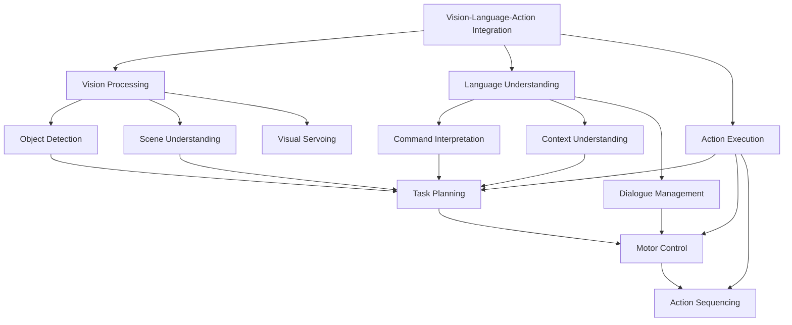
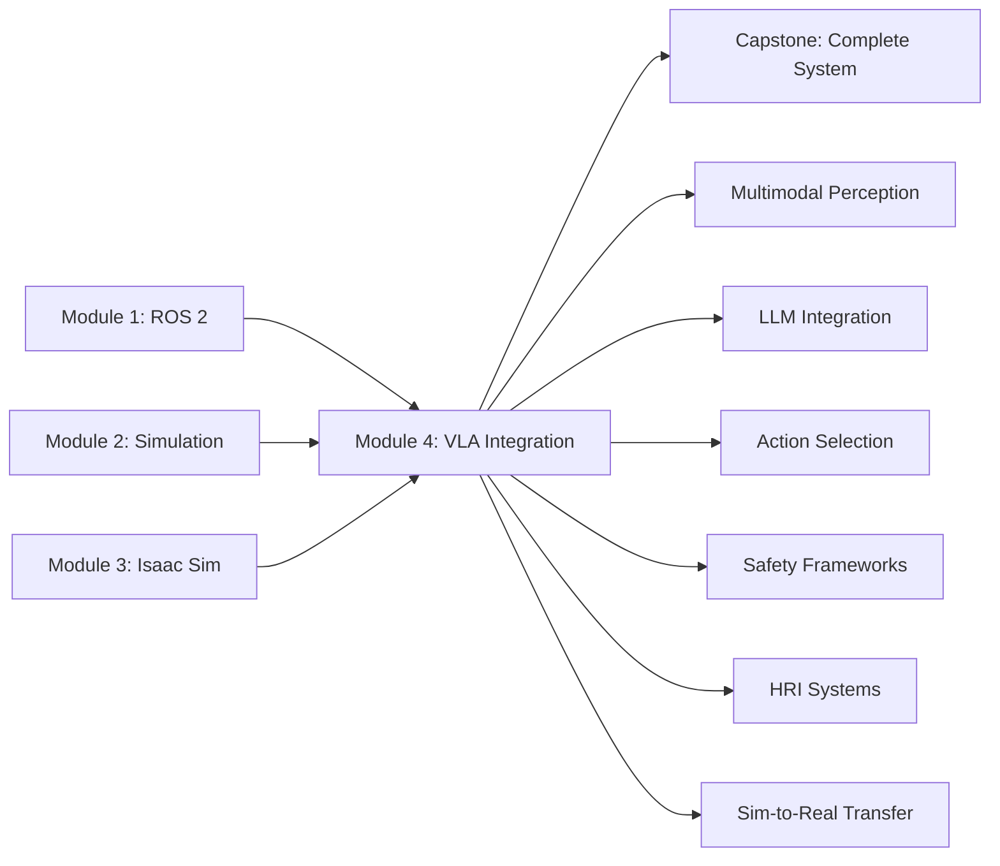

# Introduction to Vision-Language-Action Integration for Humanoid Robotics

## Learning Objectives

After completing this module, you will be able to:
- Understand the architecture of Vision-Language-Action (VLA) systems for humanoid robots
- Implement multimodal perception systems that integrate vision and language inputs
- Integrate Large Language Models (LLMs) with humanoid robot control systems
- Develop vision processing pipelines for action selection and manipulation
- Implement safety and validation frameworks for VLA systems
- Design Human-Robot Interaction (HRI) systems using natural language
- Bridge the gap between simulation and real-world deployment of VLA systems

## Prerequisites

To get the most out of this module, you should have:
- Completion of Module 1 (ROS 2 fundamentals), Module 2 (Simulation environments), and Module 3 (Isaac Sim)
- Understanding of deep learning and neural network concepts
- Experience with computer vision and natural language processing
- Knowledge of robotics control systems and sensor integration
- Familiarity with Python-based AI/ML frameworks (PyTorch, TensorFlow)

## The Vision-Language-Action Paradigm

Vision-Language-Action (VLA) integration represents the cutting edge of humanoid robotics, where robots can perceive their environment through vision systems, understand human instructions through language processing, and execute complex actions in response. This paradigm enables more intuitive human-robot interaction and autonomous decision-making capabilities.

The VLA architecture consists of three interconnected components:
- **Vision Processing**: Computer vision systems that perceive and understand the environment
- **Language Understanding**: Natural language processing that interprets human commands and context
- **Action Execution**: Control systems that translate high-level goals into low-level robot actions



## Why VLA Integration for Humanoid Robots?

Humanoid robots are uniquely positioned to benefit from VLA integration due to their human-like form factor and potential for natural interaction:

### Natural Human-Robot Interaction

Humanoid robots can engage in more intuitive interactions with humans, using natural language and gestures that align with human communication patterns. VLA systems enable these robots to understand complex verbal instructions and respond appropriately.

### Complex Manipulation Tasks

With their dexterous hands and human-like reach, humanoid robots can perform complex manipulation tasks that require visual guidance and contextual understanding. VLA systems provide the intelligence needed to execute these tasks safely and effectively.

### Social Robotics Applications

Humanoid robots excel in social robotics applications where they need to interpret social cues, understand context, and respond appropriately. VLA integration enables these capabilities through multimodal perception and understanding.

## VLA System Architecture for Humanoid Robotics

### Multimodal Perception Pipeline

The perception pipeline in VLA systems integrates multiple sensor modalities to create a comprehensive understanding of the environment:

```python
# vl_action_pipeline.py
import torch
import numpy as np
from transformers import AutoTokenizer, AutoModel
from PIL import Image
import rospy
from sensor_msgs.msg import Image as ImageMsg
from std_msgs.msg import String
from geometry_msgs.msg import Point

class MultimodalPerceptionPipeline:
    def __init__(self):
        # Initialize vision model
        self.vision_model = self.load_vision_model()

        # Initialize language model
        self.language_model = self.load_language_model()
        self.tokenizer = AutoTokenizer.from_pretrained("bert-base-uncased")

        # Initialize multimodal fusion
        self.fusion_model = self.load_fusion_model()

        # ROS subscribers
        self.image_sub = rospy.Subscriber('/head_camera/rgb/image_raw', ImageMsg, self.image_callback)
        self.command_sub = rospy.Subscriber('/human_language_input', String, self.command_callback)

        # Publishers for fused understanding
        self.understanding_pub = rospy.Publisher('/vla/understanding', String, queue_size=10)
        self.action_intent_pub = rospy.Publisher('/vla/action_intent', String, queue_size=10)

        # Internal state
        self.current_image = None
        self.current_command = None
        self.scene_understanding = None

        rospy.loginfo("Multimodal Perception Pipeline initialized")

    def load_vision_model(self):
        """
        Load pre-trained vision model for scene understanding
        """
        # In practice, this would load models like CLIP, DETR, or other vision transformers
        # For this example, we'll use a placeholder
        return torch.nn.Sequential(
            torch.nn.Linear(3*224*224, 512),
            torch.nn.ReLU(),
            torch.nn.Linear(512, 256)
        )

    def load_language_model(self):
        """
        Load pre-trained language model for command understanding
        """
        # In practice, this would load models like BERT, GPT, or specialized instruction models
        return torch.nn.Sequential(
            torch.nn.Linear(768, 512),
            torch.nn.ReLU(),
            torch.nn.Linear(512, 256)
        )

    def load_fusion_model(self):
        """
        Load model for fusing vision and language information
        """
        return torch.nn.Sequential(
            torch.nn.Linear(256 + 256, 512),  # Vision + Language
            torch.nn.ReLU(),
            torch.nn.Linear(512, 256),
            torch.nn.ReLU(),
            torch.nn.Linear(256, 128)  # Action space representation
        )

    def image_callback(self, msg):
        """
        Process incoming camera image
        """
        # Convert ROS image to PIL Image
        image = self.ros_image_to_pil(msg)

        # Preprocess image for model
        processed_image = self.preprocess_image(image)

        # Store current image
        self.current_image = processed_image

        # If we have both image and command, process them together
        if self.current_command is not None:
            self.process_multimodal_input()

    def command_callback(self, msg):
        """
        Process incoming language command
        """
        command = msg.data
        self.current_command = command

        # If we have both image and command, process them together
        if self.current_image is not None:
            self.process_multimodal_input()

    def preprocess_image(self, image):
        """
        Preprocess image for vision model
        """
        # Resize and normalize image
        image = image.resize((224, 224))
        image_array = np.array(image).astype(np.float32) / 255.0
        image_tensor = torch.from_numpy(image_array).permute(2, 0, 1).unsqueeze(0)

        return image_tensor

    def ros_image_to_pil(self, ros_image):
        """
        Convert ROS image message to PIL Image
        """
        # Convert ROS image to numpy array
        image_np = np.frombuffer(ros_image.data, dtype=np.uint8)
        image_np = image_np.reshape((ros_image.height, ros_image.width, -1))

        # Convert to PIL Image
        image = Image.fromarray(image_np)

        return image

    def process_multimodal_input(self):
        """
        Process combined vision and language input
        """
        if self.current_image is None or self.current_command is None:
            return

        # Extract visual features
        with torch.no_grad():
            visual_features = self.vision_model(self.current_image)

        # Extract language features
        inputs = self.tokenizer(self.current_command, return_tensors="pt", padding=True, truncation=True)
        with torch.no_grad():
            language_outputs = self.language_model(**inputs)
            language_features = language_outputs.last_hidden_state.mean(dim=1)  # Average pooling

        # Fuse visual and language features
        fused_features = torch.cat([visual_features, language_features], dim=1)

        # Get action representation
        with torch.no_grad():
            action_representation = self.fusion_model(fused_features)

        # Generate understanding description
        understanding = self.generate_understanding_description(
            self.current_command,
            action_representation
        )

        # Publish understanding
        understanding_msg = String()
        understanding_msg.data = understanding
        self.understanding_pub.publish(understanding_msg)

        # Generate action intent
        action_intent = self.generate_action_intent(action_representation)
        action_intent_msg = String()
        action_intent_msg.data = action_intent
        self.action_intent_pub.publish(action_intent_msg)

        # Clear current inputs after processing
        self.current_image = None
        self.current_command = None

    def generate_understanding_description(self, command, action_repr):
        """
        Generate natural language description of the system's understanding
        """
        # This would be implemented with a specialized model in practice
        return f"Understanding: Robot should {command} based on visual scene analysis"

    def generate_action_intent(self, action_repr):
        """
        Generate action intent from the action representation
        """
        # This would map the representation to specific robot actions
        # For now, return a placeholder
        return "move_to_object_then_manipulate"

class VLAIntegrationNode:
    def __init__(self):
        rospy.init_node('vla_integration_node')

        # Initialize perception pipeline
        self.perception_pipeline = MultimodalPerceptionPipeline()

        # Initialize action execution system
        self.action_executor = ActionExecutionSystem()

        # Initialize safety validator
        self.safety_validator = SafetyValidator()

        rospy.loginfo("VLA Integration Node initialized")

    def run(self):
        """
        Main execution loop
        """
        rate = rospy.Rate(10)  # 10 Hz

        while not rospy.is_shutdown():
            # The perception pipeline runs asynchronously via callbacks
            # Here we can perform any synchronous tasks if needed

            rate.sleep()

def main():
    node = VLAIntegrationNode()

    try:
        node.run()
    except rospy.ROSInterruptException:
        rospy.loginfo("VLA Integration Node terminated")

if __name__ == '__main__':
    main()
```

### Language Model Integration

Modern VLA systems leverage Large Language Models (LLMs) to understand complex instructions and provide contextual reasoning:

```python
# llm_integration.py
import openai
import torch
from transformers import AutoTokenizer, AutoModelForCausalLM
import rospy
from std_msgs.msg import String
from geometry_msgs.msg import Pose

class LLMRobotInterface:
    def __init__(self, model_name="gpt-3.5-turbo"):
        self.model_name = model_name
        self.tokenizer = None
        self.model = None

        # Initialize model based on type
        if "gpt" in model_name.lower():
            # For OpenAI models
            self.is_openai = True
            # Note: In practice, you would set your API key
            # openai.api_key = os.getenv("OPENAI_API_KEY")
        else:
            # For open-source models
            self.is_openai = False
            self.tokenizer = AutoTokenizer.from_pretrained(model_name)
            self.model = AutoModelForCausalLM.from_pretrained(model_name)

            # Add padding token if not present
            if self.tokenizer.pad_token is None:
                self.tokenizer.pad_token = self.tokenizer.eos_token

        # ROS interfaces
        self.command_sub = rospy.Subscriber('/natural_language_command', String, self.command_callback)
        self.response_pub = rospy.Publisher('/llm_response', String, queue_size=10)
        self.action_plan_pub = rospy.Publisher('/action_plan', String, queue_size=10)

        # Robot state information
        self.robot_state = {
            'position': [0.0, 0.0, 0.0],
            'orientation': [0.0, 0.0, 0.0, 1.0],
            'battery_level': 100.0,
            'current_task': 'idle'
        }

        rospy.loginfo(f"LLM Robot Interface initialized with {model_name}")

    def command_callback(self, msg):
        """
        Process natural language command
        """
        command = msg.data

        # Generate response using LLM
        response = self.process_command_with_llm(command)

        # Parse response for action plan
        action_plan = self.parse_action_plan(response)

        # Publish response and action plan
        response_msg = String()
        response_msg.data = response
        self.response_pub.publish(response_msg)

        plan_msg = String()
        plan_msg.data = action_plan
        self.action_plan_pub.publish(plan_msg)

    def process_command_with_llm(self, command):
        """
        Process command using LLM with robot context
        """
        # Create prompt with robot context
        prompt = self.create_contextual_prompt(command)

        if self.is_openai:
            # Use OpenAI API
            response = openai.ChatCompletion.create(
                model=self.model_name,
                messages=[
                    {"role": "system", "content": self.get_system_prompt()},
                    {"role": "user", "content": prompt}
                ],
                max_tokens=500,
                temperature=0.7
            )
            return response.choices[0].message.content
        else:
            # Use local model
            inputs = self.tokenizer.encode(prompt, return_tensors="pt", truncation=True, max_length=512)

            with torch.no_grad():
                outputs = self.model.generate(
                    inputs,
                    max_length=inputs.shape[1] + 100,
                    temperature=0.7,
                    do_sample=True,
                    pad_token_id=self.tokenizer.eos_token_id
                )

            response = self.tokenizer.decode(outputs[0], skip_special_tokens=True)

            # Extract just the response part (remove the prompt)
            if prompt in response:
                response = response.split(prompt)[-1].strip()

            return response

    def create_contextual_prompt(self, command):
        """
        Create a prompt that includes robot context
        """
        context = f"""
        Robot State:
        - Position: {self.robot_state['position']}
        - Orientation: {self.robot_state['orientation']}
        - Battery Level: {self.robot_state['battery_level']}%
        - Current Task: {self.robot_state['current_task']}

        Environment Context:
        - Humanoid robot with 28+ degrees of freedom
        - Equipped with cameras, IMU, force/torque sensors
        - Capable of manipulation and locomotion

        Command: {command}

        Please provide a detailed plan for the robot to execute this command, including:
        1. Perception requirements (what to look for)
        2. Action sequence (step-by-step plan)
        3. Safety considerations
        4. Expected outcomes
        """

        return context

    def get_system_prompt(self):
        """
        Get system prompt for LLM
        """
        return """
        You are an assistant for a humanoid robot. Your role is to interpret human commands
        and provide detailed execution plans. Consider:
        - The robot's physical capabilities and limitations
        - Safety requirements for human-robot interaction
        - Environmental constraints
        - Step-by-step execution plans
        - Error handling and recovery strategies

        Respond with a structured plan that can be parsed by the robot's action execution system.
        """

    def parse_action_plan(self, llm_response):
        """
        Parse LLM response into structured action plan
        """
        # This would implement a parser for the LLM response format
        # For now, return the response as-is
        # In practice, this would extract structured information

        # Example parsing logic (simplified)
        lines = llm_response.split('\n')
        action_plan = []

        for line in lines:
            if any(keyword in line.lower() for keyword in ['move', 'go to', 'pick', 'place', 'grasp']):
                action_plan.append(line.strip())

        return '\n'.join(action_plan)

class SafetyValidator:
    def __init__(self):
        # Initialize safety models and rules
        self.safety_rules = self.load_safety_rules()
        self.risk_assessment_model = self.load_risk_model()

        rospy.loginfo("Safety Validator initialized")

    def validate_action_plan(self, action_plan, robot_state, environment_state):
        """
        Validate action plan for safety
        """
        # Check against safety rules
        rule_violations = []
        for rule in self.safety_rules:
            if not rule.check_compliance(action_plan, robot_state, environment_state):
                rule_violations.append(rule.description)

        # Assess risk using ML model
        risk_score = self.risk_assessment_model.assess(action_plan, robot_state, environment_state)

        # Return validation results
        return {
            'is_safe': len(rule_violations) == 0 and risk_score < 0.8,
            'violations': rule_violations,
            'risk_score': risk_score,
            'safety_recommendations': self.generate_safety_recommendations(rule_violations)
        }

    def load_safety_rules(self):
        """
        Load safety rules for humanoid robots
        """
        # This would load actual safety rules
        # For example: collision avoidance, force limits, workspace boundaries
        return []

    def load_risk_model(self):
        """
        Load ML model for risk assessment
        """
        # This would load a trained risk assessment model
        return MockRiskModel()

class MockRiskModel:
    def assess(self, action_plan, robot_state, environment_state):
        """
        Mock risk assessment (in practice, this would use a trained model)
        """
        # Simple risk calculation based on action complexity
        risk = 0.1  # Base risk

        # Increase risk for complex actions
        if 'manipulation' in action_plan.lower():
            risk += 0.3
        if 'navigation' in action_plan.lower():
            risk += 0.2
        if 'interaction' in action_plan.lower():
            risk += 0.2

        return min(risk, 1.0)  # Cap at 1.0

    def generate_safety_recommendations(self, violations):
        """
        Generate safety recommendations based on violations
        """
        recommendations = []

        for violation in violations:
            recommendations.append(f"Modify action plan to comply with: {violation}")

        return recommendations
```

## Key Challenges in VLA Integration

### The Reality Gap Problem

One of the most significant challenges in VLA integration is bridging the gap between training data (often synthetic) and real-world deployment:

- **Sim-to-Real Transfer**: Ensuring models trained on synthetic data work in real environments
- **Domain Adaptation**: Adapting vision models to different lighting, textures, and conditions
- **Sensor Noise**: Handling real-world sensor noise and imperfections
- **Latency Considerations**: Managing computational delays in real-time systems

### Safety and Reliability

VLA systems must maintain high safety standards:

- **Fail-Safe Mechanisms**: Proper handling of system failures
- **Human Safety**: Ensuring robot actions don't harm humans or environment
- **Validation Frameworks**: Comprehensive testing and validation procedures
- **Error Recovery**: Robust error detection and recovery strategies

### Computational Requirements

VLA systems are computationally intensive:

- **Real-time Processing**: Meeting timing constraints for interactive applications
- **Resource Management**: Efficient use of computational resources
- **Edge Deployment**: Running complex models on robot hardware
- **Cloud Integration**: Balancing local and cloud-based processing

## Module Structure Overview

This module is organized into the following sections:

1. **Multimodal Perception**: Integrating vision and language inputs
2. **LLM Integration**: Connecting large language models with robot control
3. **Vision for Action**: Using vision processing for action selection
4. **Safety Validation**: Frameworks for safe VLA system deployment
5. **Human-Robot Interaction**: Natural language interaction systems
6. **Sim-to-Real Transfer**: Bridging simulation and real-world deployment
7. **Advanced Techniques**: Cutting-edge VLA methodologies
8. **Module Summary**: Key takeaways and next steps

## Integration with Previous Modules

This module builds upon the foundations established in:
- **Module 1**: ROS 2 concepts for communication between VLA components
- **Module 2**: Simulation environments for testing VLA systems
- **Module 3**: Isaac Sim for generating synthetic training data

The skills developed in this module will be essential for:
- **Capstone Project**: Complete humanoid robot system with VLA capabilities



## Getting Started with VLA Integration

The following sections will guide you through implementing Vision-Language-Action integration for humanoid robots, from basic multimodal perception to advanced LLM integration and safe deployment strategies. Each section includes practical examples specifically tailored for humanoid robotics applications.

:::tip
Start with simple VLA tasks like object recognition with language descriptions before moving to complex manipulation tasks. The multimodal integration can be challenging, so build up complexity gradually.
:::

:::warning
VLA systems involve complex AI models that require significant computational resources. Ensure your hardware can support the required processing power, especially for real-time applications. Safety validation is critical before deploying any autonomous behaviors.
:::

## Summary

Vision-Language-Action integration represents the frontier of humanoid robotics, enabling robots to understand natural language commands, perceive their environment visually, and execute complex actions. This module will provide you with the knowledge and tools to implement sophisticated VLA systems that enable more natural and capable humanoid robot interactions.

In the next section, we'll explore multimodal perception systems that integrate vision and language inputs for humanoid robotics applications.