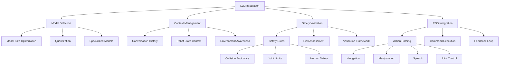

# Large Language Model Integration for Humanoid Robotics

## Introduction to LLM Integration

Large Language Models (LLMs) have revolutionized the field of artificial intelligence and are now playing a crucial role in robotics, particularly for humanoid robots that require natural interaction with humans. LLM integration in humanoid robotics enables robots to understand complex natural language commands, engage in contextual conversations, and make high-level decisions based on linguistic input combined with perceptual information.

The integration of LLMs with humanoid robots involves several key challenges:
- **Real-time processing**: Ensuring responses are timely for interactive applications
- **Context awareness**: Understanding the robot's current state and environment
- **Action grounding**: Translating high-level language commands into executable robot actions
- **Safety and reliability**: Ensuring safe operation when interpreting language commands
- **Embodied reasoning**: Understanding spatial and physical relationships in language

## LLM Architectures for Robotics

### Transformer-Based Models

The most common LLM architectures are based on transformer architectures, which excel at understanding context and generating coherent responses:

```python
# llm_architecture.py
import torch
import torch.nn as nn
from transformers import AutoTokenizer, AutoModel, AutoModelForCausalLM
from peft import get_peft_model, LoraConfig, TaskType
import rospy
from std_msgs.msg import String
from geometry_msgs.msg import Pose

class LLMRobotInterface:
    def __init__(self, model_name="microsoft/DialoGPT-medium"):
        self.model_name = model_name

        # Initialize tokenizer and model
        self.tokenizer = AutoTokenizer.from_pretrained(model_name)

        # Add padding token if not present
        if self.tokenizer.pad_token is None:
            self.tokenizer.pad_token = self.tokenizer.eos_token

        # Load model
        self.model = AutoModelForCausalLM.from_pretrained(
            model_name,
            torch_dtype=torch.float16 if torch.cuda.is_available() else torch.float32,
            device_map="auto" if torch.cuda.is_available() else None
        )

        # Freeze model parameters for efficiency
        for param in self.model.parameters():
            param.requires_grad = False

        # Robot-specific embeddings and modules
        self.robot_state_encoder = nn.Linear(128, self.model.config.hidden_size)  # Encode robot state
        self.spatial_encoder = nn.Linear(6, self.model.config.hidden_size)  # Encode spatial relations
        self.task_specific_head = nn.Linear(self.model.config.hidden_size, 50)  # Action space

        # ROS interfaces
        self.command_sub = rospy.Subscriber('/natural_language_command', String, self.command_callback)
        self.response_pub = rospy.Publisher('/llm_response', String, queue_size=10)
        self.action_plan_pub = rospy.Publisher('/action_plan', String, queue_size=10)

        # Conversation history
        self.conversation_history = []
        self.max_history = 5  # Keep last 5 exchanges

        rospy.loginfo(f"LLM Robot Interface initialized with {model_name}")

    def command_callback(self, msg):
        """
        Process natural language command with robot context
        """
        command = msg.data

        # Generate robot state context
        robot_context = self.get_robot_context()

        # Create prompt with context
        prompt = self.create_contextual_prompt(command, robot_context)

        # Generate response using LLM
        response = self.generate_response(prompt)

        # Parse response for action plan
        action_plan = self.parse_action_plan(response)

        # Publish results
        response_msg = String()
        response_msg.data = response
        self.response_pub.publish(response_msg)

        action_msg = String()
        action_msg.data = action_plan
        self.action_plan_pub.publish(action_msg)

        # Update conversation history
        self.conversation_history.append({'user': command, 'robot': response})
        if len(self.conversation_history) > self.max_history:
            self.conversation_history.pop(0)  # Remove oldest entry

    def get_robot_context(self):
        """
        Get current robot state and environment context
        """
        # In real implementation, this would interface with robot state
        # For simulation, return mock context
        return {
            'position': [0.5, 0.3, 0.0],
            'orientation': [0.0, 0.0, 0.0, 1.0],
            'battery_level': 85.0,
            'current_task': 'idle',
            'detected_objects': ['table', 'chair', 'cup'],
            'navigation_goals': ['kitchen', 'living_room']
        }

    def create_contextual_prompt(self, command, robot_context):
        """
        Create contextual prompt for LLM with robot state
        """
        context_str = f"""
        Robot State:
        - Position: {robot_context['position']}
        - Orientation: {robot_context['orientation']}
        - Battery Level: {robot_context['battery_level']}%
        - Current Task: {robot_context['current_task']}
        - Detected Objects: {', '.join(robot_context['detected_objects'])}
        - Available Locations: {', '.join(robot_context['navigation_goals'])}

        Human Command: {command}

        Please provide a detailed plan for the robot to execute this command, including:
        1. Perception requirements (what to look for)
        2. Action sequence (step-by-step plan)
        3. Safety considerations
        4. Expected outcomes
        5. Potential obstacles and alternatives
        """

        return context_str

    def generate_response(self, prompt):
        """
        Generate response using the LLM
        """
        # Tokenize input
        inputs = self.tokenizer.encode(prompt, return_tensors="pt", truncation=True, max_length=1024)

        # Generate response
        with torch.no_grad():
            outputs = self.model.generate(
                inputs,
                max_length=inputs.shape[1] + 200,
                temperature=0.7,
                do_sample=True,
                pad_token_id=self.tokenizer.eos_token_id,
                top_p=0.9,
                top_k=50
            )

        # Decode response
        response = self.tokenizer.decode(outputs[0], skip_special_tokens=True)

        # Extract just the response part (remove the prompt)
        if prompt in response:
            response = response.split(prompt)[-1].strip()

        return response

    def parse_action_plan(self, llm_response):
        """
        Parse LLM response into structured action plan
        """
        # This would implement a parser for the LLM response format
        # For now, extract simple action sequences

        lines = llm_response.split('\n')
        action_plan = []

        for line in lines:
            # Look for action-related keywords
            if any(keyword in line.lower() for keyword in [
                'move to', 'go to', 'navigate to', 'approach', 'reach', 'grasp',
                'pick up', 'place', 'put', 'turn', 'rotate', 'look at'
            ]):
                action_plan.append(line.strip())

        return '\n'.join(action_plan)

class OptimizedLLMInterface:
    def __init__(self, model_name="facebook/opt-2.7b"):
        """
        Optimized interface for larger models with performance considerations
        """
        self.model_name = model_name

        # Load model with optimizations
        self.tokenizer = AutoTokenizer.from_pretrained(model_name)

        # Add padding token
        if self.tokenizer.pad_token is None:
            self.tokenizer.pad_token = self.tokenizer.eos_token

        # Use 8-bit quantization for memory efficiency
        try:
            from transformers import BitsAndBytesConfig

            bnb_config = BitsAndBytesConfig(
                load_in_8bit=True,
                bnb_8bit_use_double_quant=True,
                bnb_8bit_quant_type="nf4",
                bnb_8bit_compute_dtype=torch.bfloat16
            )

            self.model = AutoModelForCausalLM.from_pretrained(
                model_name,
                quantization_config=bnb_config,
                device_map="auto",
                torch_dtype=torch.bfloat16
            )
        except ImportError:
            # Fallback to regular loading if bitsandbytes not available
            self.model = AutoModelForCausalLM.from_pretrained(
                model_name,
                torch_dtype=torch.float16,
                device_map="auto"
            )

        # Performance optimizations
        self.model.eval()
        if torch.cuda.is_available():
            self.model = self.model.to(torch.float16)

        rospy.loginfo(f"Optimized LLM Interface initialized with {model_name}")
```

### Specialized Robotics LLMs

Several LLM architectures have been specifically designed or adapted for robotics:

```python
# specialized_robotics_llms.py
import torch
import torch.nn as nn
from transformers import AutoTokenizer, AutoModel
import numpy as np

class RoboticsSpecificLLM:
    def __init__(self, model_name="microsoft/phi-2"):
        """
        Specialized LLM for robotics applications
        """
        self.tokenizer = AutoTokenizer.from_pretrained(model_name)
        self.model = AutoModel.from_pretrained(model_name)

        # Add robotics-specific components
        self.spatial_reasoning_module = SpatialReasoningModule()
        self.action_grounding_module = ActionGroundingModule()
        self.safety_verification_module = SafetyVerificationModule()

        # Task-specific heads
        self.navigation_head = nn.Linear(self.model.config.hidden_size, 20)  # Navigation actions
        self.manipulation_head = nn.Linear(self.model.config.hidden_size, 15)  # Manipulation actions
        self.social_interaction_head = nn.Linear(self.model.config.hidden_size, 10)  # Social actions

        rospy.loginfo("Robotics-specific LLM initialized")

    def process_robot_command(self, command, robot_state, environment_state):
        """
        Process command with robotics-specific context
        """
        # Encode command with robot context
        contextualized_input = self.encode_robotic_context(command, robot_state, environment_state)

        # Process through LLM
        with torch.no_grad():
            hidden_states = self.model(**contextualized_input).last_hidden_state

        # Apply task-specific heads
        navigation_logits = self.navigation_head(hidden_states)
        manipulation_logits = self.manipulation_head(hidden_states)
        social_logits = self.social_interaction_head(hidden_states)

        # Apply robotics-specific modules
        navigation_plan = self.spatial_reasoning_module.plan_navigation(navigation_logits)
        manipulation_plan = self.action_grounding_module.ground_manipulation(manipulation_logits)
        social_plan = self.action_grounding_module.ground_social(social_logits)

        # Verify safety
        safe_navigation = self.safety_verification_module.verify_navigation(navigation_plan)
        safe_manipulation = self.safety_verification_module.verify_manipulation(manipulation_plan)

        return {
            'navigation_plan': navigation_plan if safe_navigation else None,
            'manipulation_plan': manipulation_plan if safe_manipulation else None,
            'social_plan': social_plan,
            'safety_status': {
                'navigation_safe': safe_navigation,
                'manipulation_safe': safe_manipulation
            }
        }

    def encode_robotic_context(self, command, robot_state, environment_state):
        """
        Encode command with robotic context
        """
        # Create contextual prompt
        context_prompt = f"""
        ROBOT STATE:
        - Position: {robot_state.get('position', [0,0,0])}
        - Battery: {robot_state.get('battery', 100)}%
        - Current Task: {robot_state.get('current_task', 'idle')}
        - Available Actions: {robot_state.get('available_actions', [])}

        ENVIRONMENT STATE:
        - Objects: {environment_state.get('objects', [])}
        - Obstacles: {environment_state.get('obstacles', [])}
        - Safe Zones: {environment_state.get('safe_zones', [])}
        - Navigation Goals: {environment_state.get('navigation_goals', [])}

        COMMAND: {command}

        PLAN:
        """

        # Tokenize with context
        inputs = self.tokenizer(
            context_prompt,
            return_tensors="pt",
            padding=True,
            truncation=True,
            max_length=1024
        )

        return inputs

class SpatialReasoningModule:
    def __init__(self):
        """
        Module for spatial reasoning and navigation planning
        """
        self.nav_encoder = nn.Linear(768, 256)  # Hidden size to navigation features
        self.path_planner = nn.Sequential(
            nn.Linear(256, 128),
            nn.ReLU(),
            nn.Linear(128, 64),
            nn.ReLU(),
            nn.Linear(64, 2)  # [x, y] coordinates
        )

    def plan_navigation(self, navigation_logits):
        """
        Plan navigation based on LLM output
        """
        # Apply navigation encoder
        nav_features = torch.relu(self.nav_encoder(navigation_logits))

        # Plan path
        path_coordinates = self.path_planner(nav_features.mean(dim=1))

        return {
            'waypoints': path_coordinates.tolist(),
            'confidence': torch.softmax(navigation_logits, dim=-1).max().item()
        }

class ActionGroundingModule:
    def __init__(self):
        """
        Module for grounding actions in physical space
        """
        self.action_encoder = nn.Linear(768, 256)
        self.manipulation_decoder = nn.Sequential(
            nn.Linear(256, 128),
            nn.ReLU(),
            nn.Linear(128, 64),
            nn.ReLU(),
            nn.Linear(64, 7)  # [x, y, z, rx, ry, rz, gripper]
        )

    def ground_manipulation(self, manipulation_logits):
        """
        Ground manipulation actions in 3D space
        """
        # Apply action encoder
        action_features = torch.relu(self.action_encoder(manipulation_logits))

        # Decode manipulation parameters
        manipulation_params = self.manipulation_decoder(action_features.mean(dim=1))

        return {
            'position': manipulation_params[0, :3].tolist(),
            'orientation': manipulation_params[0, 3:6].tolist(),
            'gripper': manipulation_params[0, 6].item(),
            'confidence': torch.softmax(manipulation_logits, dim=-1).max().item()
        }

    def ground_social(self, social_logits):
        """
        Ground social interaction actions
        """
        # For social interactions, decode to predefined social actions
        social_action_id = torch.argmax(social_logits, dim=-1).item()

        social_actions = [
            'greet', 'wave', 'nod', 'shake_hands', 'make_eye_contact',
            'follow_human', 'maintain_personal_space', 'offer_assistance',
            'ask_for_help', 'express_confusion'
        ]

        return {
            'action': social_actions[social_action_id] if social_action_id < len(social_actions) else 'idle',
            'confidence': torch.softmax(social_logits, dim=-1).max().item()
        }

class SafetyVerificationModule:
    def __init__(self):
        """
        Module for verifying safety of planned actions
        """
        self.safety_classifier = nn.Sequential(
            nn.Linear(512, 256),
            nn.ReLU(),
            nn.Dropout(0.1),
            nn.Linear(256, 128),
            nn.ReLU(),
            nn.Linear(128, 2),  # [unsafe_prob, safe_prob]
            nn.Softmax(dim=-1)
        )

    def verify_navigation(self, navigation_plan):
        """
        Verify safety of navigation plan
        """
        # Encode navigation plan features
        plan_features = torch.tensor(navigation_plan['waypoints']).flatten()

        # Pad or truncate to fixed size
        if len(plan_features) < 512:
            plan_features = torch.cat([plan_features, torch.zeros(512 - len(plan_features))])
        else:
            plan_features = plan_features[:512]

        # Classify safety
        safety_scores = self.safety_classifier(plan_features.unsqueeze(0))

        # Return True if safe probability > 0.5
        return safety_scores[0, 1].item() > 0.5

    def verify_manipulation(self, manipulation_plan):
        """
        Verify safety of manipulation plan
        """
        # Encode manipulation plan features
        plan_features = torch.tensor(manipulation_plan['position'] + manipulation_plan['orientation'])

        # Pad or truncate to fixed size
        if len(plan_features) < 512:
            plan_features = torch.cat([plan_features, torch.zeros(512 - len(plan_features))])
        else:
            plan_features = plan_features[:512]

        # Classify safety
        safety_scores = self.safety_classifier(plan_features.unsqueeze(0))

        return safety_scores[0, 1].item() > 0.5
```

## Context-Aware LLM Integration

### Robot State Integration

For effective LLM integration, the model must be aware of the robot's current state:

```python
# context_aware_integration.py
import rospy
import json
from std_msgs.msg import String
from geometry_msgs.msg import Pose, Twist
from sensor_msgs.msg import JointState
from nav_msgs.msg import Odometry
import time

class ContextAwareLLM:
    def __init__(self):
        # Initialize base LLM
        self.llm_interface = LLMRobotInterface()

        # Robot state subscribers
        self.odom_sub = rospy.Subscriber('/odom', Odometry, self.odom_callback)
        self.joint_state_sub = rospy.Subscriber('/joint_states', JointState, self.joint_state_callback)
        self.imu_sub = rospy.Subscriber('/imu/data', Imu, self.imu_callback)

        # Publishers for robot commands
        self.cmd_vel_pub = rospy.Publisher('/cmd_vel', Twist, queue_size=10)
        self.joint_cmd_pub = rospy.Publisher('/joint_group_position_controller/command', JointTrajectory, queue_size=10)

        # Robot state storage
        self.current_pose = Pose()
        self.current_joint_states = JointState()
        self.current_battery_level = 100.0
        self.last_state_update = time.time()

        # Context templates
        self.context_templates = {
            'navigation': self.navigation_context_template,
            'manipulation': self.manipulation_context_template,
            'social': self.social_context_template
        }

        rospy.loginfo("Context-aware LLM initialized")

    def odom_callback(self, msg):
        """
        Update robot pose from odometry
        """
        self.current_pose = msg.pose.pose
        self.last_state_update = time.time()

    def joint_state_callback(self, msg):
        """
        Update joint states
        """
        self.current_joint_states = msg

    def imu_callback(self, msg):
        """
        Update IMU data for balance context
        """
        # Extract relevant IMU information for balance context
        self.current_orientation = msg.orientation

    def get_enhanced_robot_context(self):
        """
        Get comprehensive robot context including state and environment
        """
        context = {
            'timestamp': time.time(),
            'position': [
                self.current_pose.position.x,
                self.current_pose.position.y,
                self.current_pose.position.z
            ],
            'orientation': [
                self.current_pose.orientation.x,
                self.current_pose.orientation.y,
                self.current_pose.orientation.z,
                self.current_pose.orientation.w
            ],
            'battery_level': self.estimate_battery_level(),
            'current_task': self.get_current_task(),
            'joint_states': {
                'names': self.current_joint_states.name,
                'positions': self.current_joint_states.position,
                'velocities': self.current_joint_states.velocity
            },
            'balance_state': self.estimate_balance_state(),
            'detected_objects': self.get_detected_objects(),
            'navigation_goals': self.get_navigation_goals(),
            'recent_actions': self.get_recent_actions()
        }

        return context

    def estimate_battery_level(self):
        """
        Estimate battery level (in real implementation, this would interface with power system)
        """
        # For simulation, return a decreasing value
        elapsed = time.time() - self.last_state_update
        return max(0, 100 - elapsed * 0.001)  # Decrease slowly

    def get_current_task(self):
        """
        Get current task (would interface with task manager in real implementation)
        """
        # For simulation, return idle
        return "idle"

    def estimate_balance_state(self):
        """
        Estimate robot balance state from IMU data
        """
        # For simulation, return balanced
        return {
            'is_balanced': True,
            'center_of_mass': [0.0, 0.0, 0.85],
            'zero_moment_point': [0.0, 0.0]
        }

    def get_detected_objects(self):
        """
        Get currently detected objects (would interface with perception system)
        """
        # For simulation, return mock objects
        return [
            {'name': 'table', 'position': [1.0, 0.0, 0.0], 'type': 'furniture'},
            {'name': 'chair', 'position': [1.5, -0.5, 0.0], 'type': 'furniture'},
            {'name': 'cup', 'position': [1.1, 0.1, 0.8], 'type': 'object'}
        ]

    def get_navigation_goals(self):
        """
        Get available navigation goals
        """
        return [
            {'name': 'kitchen', 'position': [2.0, 1.0, 0.0]},
            {'name': 'living_room', 'position': [-1.0, 0.5, 0.0]},
            {'name': 'bedroom', 'position': [0.0, -2.0, 0.0]}
        ]

    def get_recent_actions(self):
        """
        Get recent actions (for context in conversation)
        """
        return [
            {'action': 'stood_up', 'time': time.time() - 300},
            {'action': 'navigated_to_table', 'time': time.time() - 120}
        ]

    def create_adaptive_context_prompt(self, command, task_type="general"):
        """
        Create context prompt adapted to current robot state and task type
        """
        robot_context = self.get_enhanced_robot_context()

        if task_type == "navigation":
            return self.navigation_context_template(command, robot_context)
        elif task_type == "manipulation":
            return self.manipulation_context_template(command, robot_context)
        elif task_type == "social":
            return self.social_context_template(command, robot_context)
        else:
            return self.general_context_template(command, robot_context)

    def navigation_context_template(self, command, context):
        """
        Template for navigation-specific context
        """
        return f"""
        NAVIGATION CONTEXT:
        - Current Position: {context['position']}
        - Current Orientation: {context['orientation']}
        - Battery Level: {context['battery_level']:.1f}%
        - Balance State: {context['balance_state']}
        - Detected Obstacles: {[obj['name'] for obj in context['detected_objects']]}
        - Available Destinations: {[goal['name'] for goal in context['navigation_goals']]}

        NAVIGATION COMMAND: {command}

        Please provide:
        1. Feasibility assessment
        2. Navigation plan with waypoints
        3. Safety considerations
        4. Alternative routes if primary path blocked
        """

    def manipulation_context_template(self, command, context):
        """
        Template for manipulation-specific context
        """
        return f"""
        MANIPULATION CONTEXT:
        - Current Position: {context['position']}
        - Joint States: {dict(zip(context['joint_states']['names'], context['joint_states']['positions']))}
        - Balance State: {context['balance_state']}
        - Nearby Objects: {[(obj['name'], obj['position']) for obj in context['detected_objects']]}
        - Current Task: {context['current_task']}

        MANIPULATION COMMAND: {command}

        Please provide:
        1. Object identification and localization
        2. Grasp strategy and approach
        3. Manipulation sequence
        4. Safety considerations for manipulation
        5. Expected outcome
        """

    def social_context_template(self, command, context):
        """
        Template for social interaction-specific context
        """
        return f"""
        SOCIAL INTERACTION CONTEXT:
        - Current Position: {context['position']}
        - Current Task: {context['current_task']}
        - Recent Interactions: {context['recent_actions']}
        - Available Social Actions: ['greet', 'wave', 'follow', 'assist', 'maintain_distance']

        SOCIAL COMMAND: {command}

        Please provide:
        1. Appropriate social response
        2. Body language/movement suggestions
        3. Safety considerations for human interaction
        4. Expected social outcome
        """

    def general_context_template(self, command, context):
        """
        General context template
        """
        return f"""
        ROBOT CONTEXT:
        - Position: {context['position']}
        - Orientation: {context['orientation']}
        - Battery: {context['battery_level']:.1f}%
        - Current Task: {context['current_task']}
        - Joint States: {len(context['joint_states']['names'])} joints active
        - Detected Objects: {[obj['name'] for obj in context['detected_objects']]}
        - Available Goals: {[goal['name'] for goal in context['navigation_goals']]}

        HUMAN COMMAND: {command}

        Please provide a comprehensive plan including:
        1. Task feasibility assessment
        2. Step-by-step execution plan
        3. Safety considerations
        4. Expected outcomes and alternatives
        """

    def process_command_with_context(self, command, task_type="general"):
        """
        Process command with full context awareness
        """
        # Create contextual prompt
        prompt = self.create_adaptive_context_prompt(command, task_type)

        # Generate response
        response = self.llm_interface.generate_response(prompt)

        # Parse response
        action_plan = self.parse_contextual_response(response, task_type)

        return {
            'response': response,
            'action_plan': action_plan,
            'context_used': prompt
        }

    def parse_contextual_response(self, response, task_type):
        """
        Parse LLM response based on task type
        """
        # This would implement task-specific parsers
        # For now, return a generic structure

        if task_type == "navigation":
            return self.parse_navigation_response(response)
        elif task_type == "manipulation":
            return self.parse_manipulation_response(response)
        elif task_type == "social":
            return self.parse_social_response(response)
        else:
            return self.parse_general_response(response)

    def parse_navigation_response(self, response):
        """
        Parse navigation-specific response
        """
        # Extract navigation elements from response
        return {
            'waypoints': [],
            'estimated_time': 0,
            'safety_rating': 0,
            'confidence': 0
        }

    def parse_manipulation_response(self, response):
        """
        Parse manipulation-specific response
        """
        # Extract manipulation elements from response
        return {
            'target_object': '',
            'grasp_type': '',
            'motion_sequence': [],
            'safety_rating': 0,
            'confidence': 0
        }

    def parse_social_response(self, response):
        """
        Parse social-specific response
        """
        # Extract social interaction elements from response
        return {
            'social_action': '',
            'body_language': '',
            'expected_outcome': '',
            'confidence': 0
        }

    def parse_general_response(self, response):
        """
        Parse general response
        """
        return {
            'action_sequence': [],
            'safety_considerations': [],
            'alternatives': [],
            'confidence': 0
        }
```

## Safety and Validation Frameworks

### Safety-First LLM Integration

Safety is paramount when integrating LLMs with physical robots:

```python
# safety_validation_framework.py
import rospy
import threading
from std_msgs.msg import String
from geometry_msgs.msg import Twist
from sensor_msgs.msg import JointState
import time
import logging

class SafetyFirstLLMInterface:
    def __init__(self):
        # Initialize core components
        self.context_aware_llm = ContextAwareLLM()
        self.safety_validator = SafetyValidator()
        self.action_executor = SafeActionExecutor()

        # Safety monitoring
        self.safety_monitor = SafetyMonitor()
        self.emergency_stop_active = False

        # Publishers and subscribers
        self.safety_status_pub = rospy.Publisher('/safety/status', String, queue_size=10)
        self.emergency_stop_sub = rospy.Subscriber('/emergency_stop', String, self.emergency_stop_callback)

        # Logging
        self.logger = logging.getLogger('LLMSafetyLogger')
        self.logger.setLevel(logging.INFO)

        rospy.loginfo("Safety-first LLM interface initialized")

    def emergency_stop_callback(self, msg):
        """
        Handle emergency stop commands
        """
        if msg.data.lower() == "activate":
            self.emergency_stop_active = True
            self.action_executor.stop_all_motion()
            rospy.logwarn("EMERGENCY STOP ACTIVATED")
        elif msg.data.lower() == "deactivate":
            self.emergency_stop_active = False
            rospy.loginfo("Emergency stop deactivated")

    def process_safe_command(self, command, task_type="general"):
        """
        Process command with full safety validation
        """
        if self.emergency_stop_active:
            rospy.logwarn("Command rejected: Emergency stop active")
            return {"status": "rejected", "reason": "emergency_stop_active"}

        # Get contextual response from LLM
        contextual_result = self.context_aware_llm.process_command_with_context(command, task_type)

        # Validate safety of proposed actions
        safety_check = self.safety_validator.validate_action_plan(
            contextual_result['action_plan'],
            self.context_aware_llm.get_enhanced_robot_context()
        )

        if not safety_check['is_safe']:
            rospy.logwarn(f"Unsafe action plan rejected: {safety_check['violations']}")
            return {
                "status": "rejected",
                "reason": "safety_violations",
                "violations": safety_check['violations'],
                "suggested_alternatives": safety_check['suggestions']
            }

        # Execute safe actions
        execution_result = self.action_executor.execute_action_plan(
            contextual_result['action_plan'],
            safety_check
        )

        return {
            "status": "executed" if execution_result['success'] else "partial_execution",
            "execution_result": execution_result,
            "safety_score": safety_check['risk_score']
        }

class SafetyValidator:
    def __init__(self):
        # Safety rules and constraints
        self.safety_rules = [
            SelfCollisionRule(),
            JointLimitRule(),
            VelocityLimitRule(),
            ForceLimitRule(),
            NavigationSafetyRule(),
            HumanSafetyRule()
        ]

        # Risk assessment model
        self.risk_model = self.load_risk_assessment_model()

    def validate_action_plan(self, action_plan, robot_context):
        """
        Validate action plan against safety rules
        """
        violations = []
        suggestions = []

        # Check against all safety rules
        for rule in self.safety_rules:
            rule_violations, rule_suggestions = rule.check_compliance(action_plan, robot_context)
            violations.extend(rule_violations)
            suggestions.extend(rule_suggestions)

        # Assess overall risk
        risk_score = self.assess_risk(action_plan, robot_context)

        return {
            'is_safe': len(violations) == 0 and risk_score < 0.8,  # Threshold for acceptability
            'violations': violations,
            'suggestions': suggestions,
            'risk_score': risk_score
        }

    def assess_risk(self, action_plan, robot_context):
        """
        Assess overall risk of action plan
        """
        # This would use a trained risk assessment model
        # For now, implement a simple risk calculation

        risk = 0.1  # Base risk

        # Increase risk for complex actions
        if 'manipulation' in str(action_plan).lower():
            risk += 0.3
        if 'navigation' in str(action_plan).lower():
            risk += 0.2
        if 'near_human' in str(action_plan).lower():
            risk += 0.4

        # Consider robot state
        battery_level = robot_context.get('battery_level', 100)
        if battery_level < 20:
            risk += 0.2  # Higher risk when battery is low

        # Cap at 1.0
        return min(risk, 1.0)

    def load_risk_assessment_model(self):
        """
        Load trained risk assessment model
        """
        # Placeholder for trained model
        return lambda x: 0.1  # Return low risk by default

class SelfCollisionRule:
    def check_compliance(self, action_plan, robot_context):
        """
        Check for self-collision risks
        """
        violations = []
        suggestions = []

        # This would implement collision checking logic
        # For now, return empty lists
        return violations, suggestions

class JointLimitRule:
    def check_compliance(self, action_plan, robot_context):
        """
        Check for joint limit violations
        """
        violations = []
        suggestions = []

        # Check if any joint commands exceed limits
        joint_states = robot_context.get('joint_states', {})
        joint_positions = joint_states.get('positions', [])

        for i, pos in enumerate(joint_positions):
            if abs(pos) > 3.14:  # Example limit
                violations.append(f"Joint {i} exceeds position limits: {pos}")

        return violations, suggestions

class VelocityLimitRule:
    def check_compliance(self, action_plan, robot_context):
        """
        Check for velocity limit violations
        """
        violations = []
        suggestions = []

        # Check for excessive velocities
        # Implementation would go here

        return violations, suggestions

class ForceLimitRule:
    def check_compliance(self, action_plan, robot_context):
        """
        Check for force limit violations
        """
        violations = []
        suggestions = []

        # Check for excessive forces/torques
        # Implementation would go here

        return violations, suggestions

class NavigationSafetyRule:
    def check_compliance(self, action_plan, robot_context):
        """
        Check for navigation safety violations
        """
        violations = []
        suggestions = []

        # Check navigation plan for safety
        # Implementation would go here

        return violations, suggestions

class HumanSafetyRule:
    def check_compliance(self, action_plan, robot_context):
        """
        Check for human safety violations
        """
        violations = []
        suggestions = []

        # Check for potential human safety issues
        detected_objects = robot_context.get('detected_objects', [])
        humans_nearby = [obj for obj in detected_objects if obj.get('type') == 'human']

        if humans_nearby and 'high_speed' in str(action_plan).lower():
            violations.append("High-speed motion planned near humans")
            suggestions.append("Reduce speed when humans are nearby")

        return violations, suggestions

class SafeActionExecutor:
    def __init__(self):
        self.active = True
        self.motion_lock = threading.Lock()

    def execute_action_plan(self, action_plan, safety_validation):
        """
        Execute action plan with safety monitoring
        """
        with self.motion_lock:
            if not self.active:
                return {"success": False, "error": "Executor inactive"}

            try:
                # Execute actions safely
                success = self.execute_individual_actions(action_plan)

                return {
                    "success": success,
                    "executed_actions": len(action_plan) if isinstance(action_plan, list) else 1,
                    "safety_validation": safety_validation
                }
            except Exception as e:
                rospy.logerr(f"Error executing action plan: {e}")
                return {"success": False, "error": str(e)}

    def execute_individual_actions(self, action_plan):
        """
        Execute individual actions safely
        """
        # This would implement safe execution of robot actions
        # For now, return True for simulation
        return True

    def stop_all_motion(self):
        """
        Immediately stop all robot motion
        """
        # This would send stop commands to all robot systems
        rospy.loginfo("Stopping all robot motion")

class SafetyMonitor:
    def __init__(self):
        self.safety_threads = []
        self.monitoring_active = True

    def start_safety_monitoring(self):
        """
        Start continuous safety monitoring
        """
        monitoring_thread = threading.Thread(target=self.safety_monitoring_loop, daemon=True)
        monitoring_thread.start()
        self.safety_threads.append(monitoring_thread)

    def safety_monitoring_loop(self):
        """
        Continuous safety monitoring loop
        """
        while self.monitoring_active:
            # Check safety parameters
            self.check_safety_parameters()

            # Sleep for monitoring interval
            time.sleep(0.1)  # 10Hz monitoring

    def check_safety_parameters(self):
        """
        Check various safety parameters
        """
        # This would continuously monitor:
        # - Joint limits
        # - Velocity limits
        # - Force/torque limits
        # - Collision detection
        # - Human proximity
        pass
```

## Real-time Performance Optimization

### Efficient LLM Integration

For real-time humanoid applications, efficiency is crucial:

```python
# efficient_llm_integration.py
import torch
import threading
import queue
import time
from transformers import AutoTokenizer
import rospy
from std_msgs.msg import String

class EfficientLLMInterface:
    def __init__(self, model_name="microsoft/DialoGPT-medium"):
        self.model_name = model_name

        # Initialize model with optimizations
        self.tokenizer = AutoTokenizer.from_pretrained(model_name)
        if self.tokenizer.pad_token is None:
            self.tokenizer.pad_token = self.tokenizer.eos_token

        # Load model with optimizations
        self.model = self.load_optimized_model(model_name)

        # Processing queues for asynchronous operation
        self.input_queue = queue.Queue(maxsize=10)
        self.output_queue = queue.Queue(maxsize=10)

        # Threading for non-blocking operation
        self.processing_thread = threading.Thread(target=self.processing_loop, daemon=True)
        self.processing_thread.start()

        # Performance monitoring
        self.processing_times = []
        self.throughput = 0

        rospy.loginfo("Efficient LLM interface initialized")

    def load_optimized_model(self, model_name):
        """
        Load model with performance optimizations
        """
        try:
            # Try quantization for efficiency
            from transformers import BitsAndBytesConfig

            bnb_config = BitsAndBytesConfig(
                load_in_8bit=True,
                bnb_8bit_use_double_quant=True,
                bnb_8bit_quant_type="nf4",
                bnb_8bit_compute_dtype=torch.float16
            )

            model = AutoModelForCausalLM.from_pretrained(
                model_name,
                quantization_config=bnb_config,
                device_map="auto",
                torch_dtype=torch.float16
            )
        except ImportError:
            # Fallback to regular model with half precision
            model = AutoModelForCausalLM.from_pretrained(
                model_name,
                torch_dtype=torch.float16,
                device_map="auto"
            )

        model.eval()
        return model

    def submit_command_async(self, command, context=""):
        """
        Submit command for asynchronous processing
        """
        try:
            self.input_queue.put_nowait({
                'command': command,
                'context': context,
                'timestamp': time.time()
            })
        except queue.Full:
            rospy.logwarn("Command queue full, dropping command")

    def get_response_async(self):
        """
        Get response from processing queue
        """
        try:
            return self.output_queue.get_nowait()
        except queue.Empty:
            return None

    def processing_loop(self):
        """
        Main processing loop for efficient LLM inference
        """
        while True:
            try:
                # Get command from queue
                command_data = self.input_queue.get(timeout=1.0)

                start_time = time.time()

                # Process command
                response = self.process_command_efficiently(
                    command_data['command'],
                    command_data['context']
                )

                processing_time = time.time() - start_time
                self.processing_times.append(processing_time)

                # Put result in output queue
                result = {
                    'response': response,
                    'input_command': command_data['command'],
                    'processing_time': processing_time,
                    'timestamp': time.time()
                }

                try:
                    self.output_queue.put_nowait(result)
                except queue.Full:
                    rospy.logwarn("Response queue full")

            except queue.Empty:
                continue  # Keep looping
            except Exception as e:
                rospy.logerr(f"Error in processing loop: {e}")

    def process_command_efficiently(self, command, context):
        """
        Process command with efficiency optimizations
        """
        # Create optimized prompt
        prompt = self.create_optimized_prompt(command, context)

        # Tokenize with length limits
        inputs = self.tokenizer(
            prompt,
            return_tensors="pt",
            truncation=True,
            max_length=512,  # Limit input length for efficiency
            padding=True
        )

        # Generate response with limited length
        with torch.no_grad():
            outputs = self.model.generate(
                inputs.input_ids,
                max_length=min(inputs.input_ids.shape[1] + 100, 1024),  # Limit total length
                temperature=0.7,
                do_sample=True,
                pad_token_id=self.tokenizer.eos_token_id,
                top_p=0.9,
                top_k=40,
                num_return_sequences=1,
                repetition_penalty=1.2
            )

        # Decode response
        response = self.tokenizer.decode(outputs[0], skip_special_tokens=True)

        # Extract just the response part
        if prompt in response:
            response = response.split(prompt)[-1].strip()

        return response

    def create_optimized_prompt(self, command, context):
        """
        Create optimized prompt for efficient processing
        """
        # Keep prompt concise but informative
        return f"Context: {context[:200]}\nCommand: {command}\nResponse:"

    def get_performance_stats(self):
        """
        Get performance statistics
        """
        if self.processing_times:
            avg_time = sum(self.processing_times[-50:]) / len(self.processing_times[-50:])
            throughput = len(self.processing_times[-50:]) / 50  # Last 50 operations
            return {
                'avg_processing_time': avg_time,
                'throughput_operations_per_second': throughput,
                'queue_sizes': {
                    'input': self.input_queue.qsize(),
                    'output': self.output_queue.qsize()
                }
            }
        else:
            return {
                'avg_processing_time': 0,
                'throughput_operations_per_second': 0,
                'queue_sizes': {'input': 0, 'output': 0}
            }

class LLMCache:
    def __init__(self, max_size=1000):
        self.cache = {}
        self.access_order = []
        self.max_size = max_size

    def get(self, key):
        """
        Get value from cache with LRU eviction
        """
        if key in self.cache:
            # Move to end (most recently used)
            self.access_order.remove(key)
            self.access_order.append(key)
            return self.cache[key]
        return None

    def put(self, key, value):
        """
        Put value in cache with LRU eviction
        """
        if key in self.cache:
            # Update existing key
            self.cache[key] = value
            self.access_order.remove(key)
            self.access_order.append(key)
        else:
            # Add new key
            if len(self.cache) >= self.max_size:
                # Remove least recently used
                lru_key = self.access_order.pop(0)
                del self.cache[lru_key]

            self.cache[key] = value
            self.access_order.append(key)

    def clear(self):
        """
        Clear cache
        """
        self.cache.clear()
        self.access_order.clear()

class CachedLLMInterface(EfficientLLMInterface):
    def __init__(self, model_name="microsoft/DialoGPT-medium", cache_size=1000):
        super().__init__(model_name)
        self.cache = LLMCache(cache_size)

    def process_command_efficiently(self, command, context):
        """
        Process command with caching
        """
        # Create cache key
        cache_key = f"{command[:50]}::{context[:100]}"  # Limit key length

        # Check cache first
        cached_result = self.cache.get(cache_key)
        if cached_result:
            rospy.loginfo("Cache hit for LLM query")
            return cached_result

        # Process normally
        result = super().process_command_efficiently(command, context)

        # Cache result
        self.cache.put(cache_key, result)

        return result
```

## Integration with Humanoid Control Systems

### ROS Integration for LLM Commands

Integrating LLM responses with actual robot control:

```python
# llm_ros_integration.py
import rospy
from std_msgs.msg import String
from geometry_msgs.msg import Twist, Pose
from sensor_msgs.msg import JointState
from trajectory_msgs.msg import JointTrajectory, JointTrajectoryPoint
from actionlib_msgs.msg import GoalID
from move_base_msgs.msg import MoveBaseActionGoal
import json

class LLMROSInterface:
    def __init__(self):
        # Initialize LLM interface
        self.llm_interface = CachedLLMInterface()

        # ROS publishers for different robot systems
        self.cmd_vel_pub = rospy.Publisher('/cmd_vel', Twist, queue_size=10)
        self.joint_cmd_pub = rospy.Publisher('/joint_group_position_controller/command', JointTrajectory, queue_size=10)
        self.move_base_pub = rospy.Publisher('/move_base/goal', MoveBaseActionGoal, queue_size=10)
        self.speech_pub = rospy.Publisher('/tts_command', String, queue_size=10)

        # ROS subscribers
        self.command_sub = rospy.Subscriber('/natural_language_command', String, self.command_callback)
        self.llm_response_sub = rospy.Subscriber('/llm_response', String, self.llm_response_callback)

        # Robot state
        self.current_pose = Pose()
        self.current_joint_states = JointState()

        rospy.loginfo("LLM-ROS Interface initialized")

    def command_callback(self, msg):
        """
        Handle incoming natural language commands
        """
        command = msg.data

        # Process with LLM
        self.llm_interface.submit_command_async(command)

    def llm_response_callback(self, msg):
        """
        Handle LLM responses and convert to robot actions
        """
        response = msg.data

        # Parse response and execute actions
        self.execute_llm_actions(response)

    def execute_llm_actions(self, response):
        """
        Execute actions based on LLM response
        """
        # Parse the response to identify action types
        actions = self.parse_llm_response(response)

        for action in actions:
            action_type = action.get('type', 'unknown')

            if action_type == 'navigation':
                self.execute_navigation_action(action)
            elif action_type == 'manipulation':
                self.execute_manipulation_action(action)
            elif action_type == 'speech':
                self.execute_speech_action(action)
            elif action_type == 'joint_control':
                self.execute_joint_control_action(action)
            else:
                rospy.logwarn(f"Unknown action type: {action_type}")

    def parse_llm_response(self, response):
        """
        Parse LLM response to extract actionable commands
        """
        actions = []

        # This would implement a more sophisticated parser
        # For now, implement simple keyword-based extraction

        response_lower = response.lower()

        # Navigation commands
        if any(word in response_lower for word in ['go to', 'move to', 'navigate to', 'walk to', 'drive to']):
            destination = self.extract_destination(response)
            if destination:
                actions.append({
                    'type': 'navigation',
                    'destination': destination
                })

        # Manipulation commands
        if any(word in response_lower for word in ['pick', 'grasp', 'take', 'lift', 'hold', 'carry']):
            object_name = self.extract_object(response)
            if object_name:
                actions.append({
                    'type': 'manipulation',
                    'object': object_name,
                    'action': 'grasp'
                })

        # Speech commands
        if any(word in response_lower for word in ['say', 'tell', 'speak', 'reply', 'answer']):
            speech_content = self.extract_speech_content(response)
            if speech_content:
                actions.append({
                    'type': 'speech',
                    'content': speech_content
                })

        # Joint control commands
        if any(word in response_lower for word in ['raise', 'move', 'adjust', 'position', 'orient']):
            joint_action = self.extract_joint_action(response)
            if joint_action:
                actions.append({
                    'type': 'joint_control',
                    'joints': joint_action
                })

        return actions

    def extract_destination(self, response):
        """
        Extract destination from navigation command
        """
        # Simple extraction - in practice, this would use NLP
        keywords = ['kitchen', 'living room', 'bedroom', 'office', 'dining room', 'bathroom']

        for keyword in keywords:
            if keyword in response.lower():
                return keyword

        # If no predefined location found, look for coordinates
        import re
        coord_match = re.search(r'(\d+\.?\d*)\s*,?\s*(\d+\.?\d*)', response)
        if coord_match:
            x, y = float(coord_match.group(1)), float(coord_match.group(2))
            return {'x': x, 'y': y}

        return None

    def extract_object(self, response):
        """
        Extract object name from manipulation command
        """
        # Simple extraction - in practice, this would use object detection integration
        common_objects = ['cup', 'bottle', 'book', 'phone', 'keys', 'toy', 'food', 'drink']

        for obj in common_objects:
            if obj in response.lower():
                return obj

        return None

    def extract_speech_content(self, response):
        """
        Extract speech content from response
        """
        # Look for content between quotes or after say/tell keywords
        import re
        quote_match = re.search(r'["\']([^"\']+)["\']', response)
        if quote_match:
            return quote_match.group(1)

        # Look for content after speech-related keywords
        for keyword in ['say', 'tell', 'speak', 'reply']:
            if keyword in response.lower():
                # Extract content after keyword
                parts = response.lower().split(keyword)
                if len(parts) > 1:
                    content = parts[1].strip()
                    # Remove common prefixes
                    for prefix in ['to', 'that', 'the', 'me']:
                        if content.startswith(prefix + ' '):
                            content = content[len(prefix)+1:].strip()
                    return content

        return response  # Return full response if nothing specific found

    def extract_joint_action(self, response):
        """
        Extract joint control action from response
        """
        # This would interface with a more sophisticated joint command parser
        # For now, return a simple mapping
        joint_mapping = {
            'arm': 'arm_joints',
            'hand': 'gripper_joints',
            'head': 'head_joints',
            'torso': 'torso_joints'
        }

        for joint_type, joint_group in joint_mapping.items():
            if joint_type in response.lower():
                # Extract desired position/angle from context
                return {
                    'joint_group': joint_group,
                    'target_position': self.estimate_target_position(response, joint_type)
                }

        return None

    def estimate_target_position(self, response, joint_type):
        """
        Estimate target position for joint control
        """
        # Simple estimation based on keywords
        if 'up' in response.lower():
            return 1.0
        elif 'down' in response.lower():
            return -1.0
        elif 'forward' in response.lower():
            return 0.5
        elif 'backward' in response.lower():
            return -0.5
        else:
            return 0.0  # Neutral position

    def execute_navigation_action(self, action):
        """
        Execute navigation action
        """
        destination = action.get('destination')

        if isinstance(destination, dict) and 'x' in destination and 'y' in destination:
            # Navigate to specific coordinates
            goal = MoveBaseActionGoal()
            goal.header.stamp = rospy.Time.now()
            goal.goal.target_pose.header.frame_id = "map"
            goal.goal.target_pose.pose.position.x = destination['x']
            goal.goal.target_pose.pose.position.y = destination['y']
            goal.goal.target_pose.pose.orientation.w = 1.0

            self.move_base_pub.publish(goal)
            rospy.loginfo(f"Navigating to coordinates: ({destination['x']}, {destination['y']})")

        elif isinstance(destination, str):
            # Navigate to named location (would require location database)
            rospy.loginfo(f"Navigating to location: {destination}")
            # In real implementation, this would look up coordinates for the named location

    def execute_manipulation_action(self, action):
        """
        Execute manipulation action
        """
        obj_name = action.get('object')
        manip_action = action.get('action', 'grasp')

        rospy.loginfo(f"Attempting to {manip_action} {obj_name}")
        # In real implementation, this would trigger manipulation planning and execution

    def execute_speech_action(self, action):
        """
        Execute speech action
        """
        content = action.get('content', '')

        speech_msg = String()
        speech_msg.data = content
        self.speech_pub.publish(speech_msg)

        rospy.loginfo(f"Speaking: {content}")

    def execute_joint_control_action(self, action):
        """
        Execute joint control action
        """
        joint_group = action.get('joint_group')
        target_position = action.get('target_position', 0.0)

        # Create joint trajectory message
        traj_msg = JointTrajectory()
        traj_msg.header.stamp = rospy.Time.now()
        traj_msg.joint_names = self.get_joint_names_for_group(joint_group)

        # Create trajectory point
        point = JointTrajectoryPoint()
        point.positions = [target_position] * len(traj_msg.joint_names)
        point.time_from_start = rospy.Duration(2.0)  # 2 seconds to reach position

        traj_msg.points.append(point)

        self.joint_cmd_pub.publish(traj_msg)
        rospy.loginfo(f"Moving {joint_group} to position {target_position}")

    def get_joint_names_for_group(self, group_name):
        """
        Get joint names for a specific group
        """
        joint_groups = {
            'arm_joints': ['left_shoulder_pitch', 'left_shoulder_roll', 'left_elbow'],
            'gripper_joints': ['left_gripper'],
            'head_joints': ['head_pan', 'head_tilt'],
            'torso_joints': ['torso_yaw']
        }

        return joint_groups.get(group_name, [])

class LLMControlNode:
    def __init__(self):
        rospy.init_node('llm_control_node')

        # Initialize the interface
        self.llm_ros_interface = LLMROSInterface()

        rospy.loginfo("LLM Control Node initialized")

    def run(self):
        """
        Main execution loop
        """
        rate = rospy.Rate(10)  # 10 Hz

        while not rospy.is_shutdown():
            # Process any queued LLM responses
            response = self.llm_ros_interface.llm_interface.get_response_async()
            if response:
                rospy.loginfo(f"LLM Response: {response['response']}")
                self.llm_ros_interface.execute_llm_actions(response['response'])

            rate.sleep()

def main():
    node = LLMControlNode()

    try:
        node.run()
    except rospy.ROSInterruptException:
        rospy.loginfo("LLM Control Node terminated")

if __name__ == '__main__':
    main()
```

## Best Practices for LLM Integration

### Implementation Guidelines

1. **Model Selection**: Choose appropriate model size for real-time requirements
2. **Context Management**: Maintain relevant conversation and robot state history
3. **Safety Validation**: Always validate LLM outputs before execution
4. **Error Handling**: Implement robust error handling and fallback strategies
5. **Performance Monitoring**: Continuously monitor and optimize performance

### Performance Optimization

- **Caching**: Cache frequent queries to reduce computation
- **Quantization**: Use quantized models for efficiency
- **Batching**: Process multiple requests when possible
- **Asynchronous Processing**: Use non-blocking operations for responsiveness



## Troubleshooting Common Issues

### Performance Issues
- **Slow responses**: Optimize model size or use quantization
- **Memory issues**: Implement proper memory management and caching
- **Latency**: Use asynchronous processing and caching

### Accuracy Issues
- **Misinterpretation**: Improve context prompting and validation
- **Safety violations**: Strengthen safety validation frameworks
- **Context confusion**: Maintain better state tracking

:::tip
When integrating LLMs with humanoid robots, always implement a "human in the loop" safety mechanism for critical actions. The LLM should enhance autonomy while maintaining human oversight for safety-critical operations.
:::

:::warning
LLMs can generate unexpected or unsafe outputs. Always validate LLM responses against safety constraints before executing any robot actions. Never rely solely on LLM outputs for safety-critical decisions.
:::

## Summary

Large Language Model integration with humanoid robots enables natural human-robot interaction and high-level cognitive capabilities. Through careful implementation of context-aware prompting, safety validation frameworks, and efficient processing pipelines, we can create robots that understand and respond to natural language commands while maintaining safety and reliability.

The key to successful LLM integration lies in balancing the expressive power of language models with the safety and reliability requirements of physical robotic systems. This involves careful context management, robust safety validation, and efficient real-time processing.

In the next section, we'll explore Vision for Action systems that bridge the gap between visual perception and action execution in humanoid robotics.