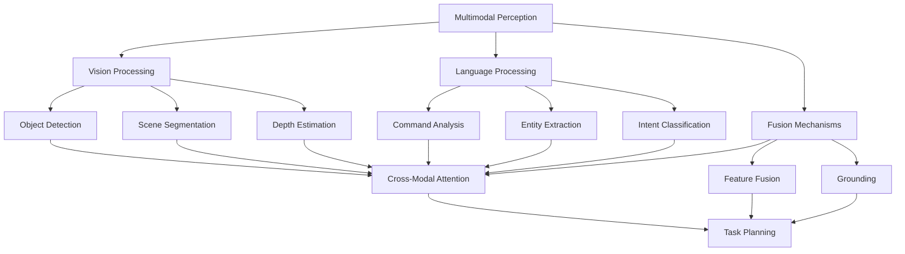

# Multimodal Perception for Humanoid Robotics

## Introduction to Multimodal Perception

Multimodal perception in humanoid robotics refers to the integration of multiple sensory modalities—primarily vision and language—to create a comprehensive understanding of the environment and tasks. Unlike traditional robotics approaches that often treat perception as a separate component, multimodal perception in Vision-Language-Action (VLA) systems tightly couples visual processing with linguistic understanding to enable more natural and capable robot behavior.

For humanoid robots, multimodal perception is particularly important because:
- **Human-like interaction**: Robots can understand natural language commands in the context of visual scenes
- **Complex manipulation**: Visual guidance combined with language understanding enables precise manipulation tasks
- **Social navigation**: Understanding both visual obstacles and linguistic instructions for navigation
- **Context awareness**: Combining visual and linguistic cues for better decision-making

## Architecture of Multimodal Perception Systems

### Sensor Fusion Architecture

The foundation of multimodal perception is effective sensor fusion that combines data from multiple sources:

```python
# multimodal_fusion_architecture.py
import torch
import torch.nn as nn
import numpy as np
from transformers import CLIPProcessor, CLIPModel
from sensor_msgs.msg import Image, CameraInfo
from std_msgs.msg import String
import rospy

class MultimodalFusionNetwork(nn.Module):
    def __init__(self, vision_dim=512, language_dim=512, fusion_dim=1024):
        super(MultimodalFusionNetwork, self).__init__()

        # Vision encoder (simplified CLIP-like architecture)
        self.vision_encoder = nn.Sequential(
            nn.Linear(3 * 224 * 224, 1024),
            nn.ReLU(),
            nn.Linear(1024, vision_dim),
            nn.LayerNorm(vision_dim)
        )

        # Language encoder (simplified BERT-like architecture)
        self.language_encoder = nn.Sequential(
            nn.Linear(768, 1024),  # Assuming BERT base output
            nn.ReLU(),
            nn.Linear(1024, language_dim),
            nn.LayerNorm(language_dim)
        )

        # Cross-attention mechanism
        self.cross_attention = nn.MultiheadAttention(
            embed_dim=fusion_dim,
            num_heads=8,
            dropout=0.1
        )

        # Fusion layers
        self.fusion_layers = nn.Sequential(
            nn.Linear(vision_dim + language_dim, fusion_dim),
            nn.ReLU(),
            nn.Dropout(0.1),
            nn.Linear(fusion_dim, fusion_dim),
            nn.ReLU(),
            nn.Dropout(0.1),
            nn.Linear(fusion_dim, 512)  # Output representation
        )

        # Task-specific heads
        self.object_detection_head = nn.Linear(512, 100)  # For object detection
        self.action_prediction_head = nn.Linear(512, 20)  # For action prediction
        self.scene_understanding_head = nn.Linear(512, 50)  # For scene understanding

    def forward(self, vision_input, language_input):
        # Encode vision input
        vision_features = self.vision_encoder(vision_input)

        # Encode language input
        language_features = self.language_encoder(language_input)

        # Concatenate features for fusion
        combined_features = torch.cat([vision_features, language_features], dim=-1)

        # Apply fusion
        fused_features = self.fusion_layers(combined_features)

        # Generate task-specific outputs
        object_predictions = self.object_detection_head(fused_features)
        action_predictions = self.action_prediction_head(fused_features)
        scene_understanding = self.scene_understanding_head(fused_features)

        return {
            'object_predictions': object_predictions,
            'action_predictions': action_predictions,
            'scene_understanding': scene_understanding,
            'fused_features': fused_features
        }

class MultimodalPerceptionSystem:
    def __init__(self):
        # Initialize the fusion network
        self.fusion_network = MultimodalFusionNetwork()

        # Initialize CLIP processor for vision-language alignment
        self.clip_processor = CLIPProcessor.from_pretrained("openai/clip-vit-base-patch32")
        self.clip_model = CLIPModel.from_pretrained("openai/clip-vit-base-patch32")

        # ROS interfaces
        self.image_sub = rospy.Subscriber('/head_camera/rgb/image_raw', Image, self.image_callback)
        self.command_sub = rospy.Subscriber('/natural_language_command', String, self.command_callback)

        # Publishers for perception outputs
        self.object_detection_pub = rospy.Publisher('/perception/object_detections', String, queue_size=10)
        self.action_intent_pub = rospy.Publisher('/perception/action_intents', String, queue_size=10)
        self.scene_description_pub = rospy.Publisher('/perception/scene_description', String, queue_size=10)

        # Internal buffers
        self.current_image = None
        self.current_command = None
        self.perception_cache = {}

        rospy.loginfo("Multimodal Perception System initialized")

    def image_callback(self, msg):
        """
        Process incoming camera image
        """
        # Convert ROS image to tensor
        image_tensor = self.ros_image_to_tensor(msg)

        # Store for later fusion with language input
        self.current_image = image_tensor

        # Process if we have both image and command
        if self.current_command is not None:
            self.process_multimodal_input()

    def command_callback(self, msg):
        """
        Process incoming natural language command
        """
        command = msg.data
        self.current_command = command

        # Process if we have both image and command
        if self.current_image is not None:
            self.process_multimodal_input()

    def process_multimodal_input(self):
        """
        Process combined vision and language input
        """
        if self.current_image is None or self.current_command is None:
            return

        # Preprocess inputs
        vision_features = self.preprocess_vision(self.current_image)
        language_features = self.preprocess_language(self.current_command)

        # Apply multimodal fusion
        with torch.no_grad():
            fusion_output = self.fusion_network(vision_features, language_features)

        # Extract results
        object_predictions = fusion_output['object_predictions']
        action_predictions = fusion_output['action_predictions']
        scene_understanding = fusion_output['scene_understanding']

        # Publish results
        self.publish_perception_results(
            object_predictions,
            action_predictions,
            scene_understanding
        )

        # Clear processed inputs
        self.current_image = None
        self.current_command = None

    def preprocess_vision(self, image_tensor):
        """
        Preprocess vision input for the fusion network
        """
        # Normalize image tensor
        image_tensor = image_tensor / 255.0
        image_tensor = (image_tensor - 0.5) / 0.5  # Normalize to [-1, 1]

        # Flatten if needed
        if image_tensor.dim() == 4:
            batch_size = image_tensor.size(0)
            image_tensor = image_tensor.view(batch_size, -1)

        return image_tensor

    def preprocess_language(self, command):
        """
        Preprocess language input for the fusion network
        """
        # Tokenize command using transformer tokenizer
        inputs = self.clip_processor(text=command, return_tensors="pt", padding=True, truncation=True)

        # Get language embeddings (simplified - in practice, you'd use the actual model)
        with torch.no_grad():
            text_features = self.clip_model.get_text_features(**inputs)

        return text_features

    def ros_image_to_tensor(self, ros_image):
        """
        Convert ROS image message to PyTorch tensor
        """
        # Convert to numpy array
        image_np = np.frombuffer(ros_image.data, dtype=np.uint8)
        image_np = image_np.reshape((ros_image.height, ros_image.width, 3))

        # Convert to tensor and permute to (C, H, W)
        image_tensor = torch.from_numpy(image_np).float().permute(2, 0, 1)

        # Resize to expected input size (224x224 for CLIP)
        import torchvision.transforms as T
        transform = T.Compose([
            T.Resize((224, 224)),
            T.Normalize(mean=[0.485, 0.456, 0.406], std=[0.229, 0.224, 0.225])
        ])

        image_tensor = transform(image_tensor.unsqueeze(0))  # Add batch dimension
        return image_tensor

    def publish_perception_results(self, object_predictions, action_predictions, scene_understanding):
        """
        Publish perception results to ROS topics
        """
        # Publish object detections
        object_msg = String()
        object_msg.data = self.format_object_detections(object_predictions)
        self.object_detection_pub.publish(object_msg)

        # Publish action intents
        action_msg = String()
        action_msg.data = self.format_action_intents(action_predictions)
        self.action_intent_pub.publish(action_msg)

        # Publish scene description
        scene_msg = String()
        scene_msg.data = self.format_scene_description(scene_understanding)
        self.scene_description_pub.publish(scene_msg)

    def format_object_detections(self, predictions):
        """
        Format object detection results for publication
        """
        # In practice, this would decode the predictions to meaningful object labels
        # For now, return a placeholder
        return f"Object detections: {predictions.shape[0]} potential objects identified"

    def format_action_intents(self, predictions):
        """
        Format action intent results for publication
        """
        # Decode action predictions to meaningful actions
        # For now, return a placeholder
        return f"Action intents: {predictions.shape[0]} possible actions identified"

    def format_scene_description(self, understanding):
        """
        Format scene understanding for publication
        """
        # Generate natural language description of scene
        # For now, return a placeholder
        return f"Scene understanding: {understanding.shape[0]} scene elements identified"
```

### Vision Processing Pipeline

The vision component of multimodal perception handles visual scene understanding:

```python
# vision_processing_pipeline.py
import torch
import torch.nn as nn
import torchvision.transforms as T
from torchvision.models import detection
import cv2
import numpy as np
from sensor_msgs.msg import Image
import rospy

class VisionProcessingPipeline:
    def __init__(self):
        # Initialize vision models
        self.object_detector = self.load_object_detector()
        self.scene_segmenter = self.load_scene_segmenter()
        self.depth_estimator = self.load_depth_estimator()

        # Preprocessing transforms
        self.transform = T.Compose([
            T.Resize((224, 224)),
            T.ToTensor(),
            T.Normalize(mean=[0.485, 0.456, 0.406], std=[0.229, 0.224, 0.225])
        ])

        rospy.loginfo("Vision Processing Pipeline initialized")

    def load_object_detector(self):
        """
        Load object detection model (e.g., DETR, YOLO, etc.)
        """
        # Using torchvision's pre-trained model as an example
        model = detection.fasterrcnn_resnet50_fpn(pretrained=True)
        model.eval()
        return model

    def load_scene_segmenter(self):
        """
        Load scene segmentation model
        """
        # Using torchvision's pre-trained segmentation model
        import torchvision.models.segmentation as seg_models
        model = seg_models.deeplabv3_resnet50(pretrained=True)
        model.eval()
        return model

    def load_depth_estimator(self):
        """
        Load depth estimation model
        """
        # This would be a monocular depth estimation model like MiDaS
        # For this example, we'll use a placeholder
        class MockDepthModel(nn.Module):
            def __init__(self):
                super().__init__()

            def forward(self, x):
                # Return a mock depth map
                batch_size, _, height, width = x.shape
                return torch.ones(batch_size, 1, height, width) * 1.0

        return MockDepthModel()

    def process_image(self, image_msg):
        """
        Process a single image message through the vision pipeline
        """
        # Convert ROS image to OpenCV
        cv_image = self.ros_image_to_cv2(image_msg)

        # Convert to tensor
        tensor_image = self.cv2_to_tensor(cv_image)

        # Run through different vision models
        object_detections = self.run_object_detection(tensor_image)
        segmentation = self.run_scene_segmentation(tensor_image)
        depth_map = self.run_depth_estimation(tensor_image)

        # Combine results
        vision_results = {
            'objects': object_detections,
            'segmentation': segmentation,
            'depth': depth_map,
            'features': self.extract_visual_features(tensor_image)
        }

        return vision_results

    def run_object_detection(self, image_tensor):
        """
        Run object detection on the image
        """
        with torch.no_grad():
            # Prepare image for detection model
            original_size = image_tensor.shape[-2:]
            detection_input = [image_tensor.squeeze(0)]  # Remove batch dimension for detection

            outputs = self.object_detector(detection_input)

            # Process outputs
            result = outputs[0]  # Get first (and only) image results
            boxes = result['boxes'].cpu().numpy()
            labels = result['labels'].cpu().numpy()
            scores = result['scores'].cpu().numpy()

            # Filter by confidence threshold
            confidence_threshold = 0.5
            valid_indices = scores > confidence_threshold

            filtered_boxes = boxes[valid_indices]
            filtered_labels = labels[valid_indices]
            filtered_scores = scores[valid_indices]

            return {
                'boxes': filtered_boxes,
                'labels': filtered_labels,
                'scores': filtered_scores
            }

    def run_scene_segmentation(self, image_tensor):
        """
        Run scene segmentation on the image
        """
        with torch.no_grad():
            outputs = self.scene_segmenter(image_tensor)['out']
            predictions = torch.argmax(outputs, dim=1)
            return predictions.cpu().numpy()

    def run_depth_estimation(self, image_tensor):
        """
        Run depth estimation on the image
        """
        with torch.no_grad():
            depth_map = self.depth_estimator(image_tensor)
            return depth_map.cpu().numpy()

    def extract_visual_features(self, image_tensor):
        """
        Extract high-level visual features for multimodal fusion
        """
        # This would typically use a pre-trained vision model's intermediate layers
        # For this example, we'll use a simple feature extractor
        batch_size, channels, height, width = image_tensor.shape

        # Global average pooling to get image-level features
        features = torch.mean(image_tensor, dim=[2, 3])  # Average over spatial dimensions
        return features

    def ros_image_to_cv2(self, image_msg):
        """
        Convert ROS Image message to OpenCV image
        """
        # Convert ROS image to numpy array
        dtype = np.uint8
        img_buf = np.frombuffer(image_msg.data, dtype=dtype)

        if image_msg.encoding == "rgb8":
            img_buf = img_buf.reshape((image_msg.height, image_msg.width, 3))
        elif image_msg.encoding == "bgr8":
            img_buf = img_buf.reshape((image_msg.height, image_msg.width, 3))
        elif image_msg.encoding == "mono8":
            img_buf = img_buf.reshape((image_msg.height, image_msg.width))

        return img_buf

    def cv2_to_tensor(self, cv_image):
        """
        Convert OpenCV image to PyTorch tensor
        """
        # Convert BGR to RGB if needed
        if len(cv_image.shape) == 3 and cv_image.shape[2] == 3:
            cv_image = cv2.cvtColor(cv_image, cv2.COLOR_BGR2RGB)

        # Convert to tensor and add batch dimension
        tensor = torch.from_numpy(cv_image).float().permute(2, 0, 1).unsqueeze(0)

        # Normalize to [0, 1] range
        tensor = tensor / 255.0

        return tensor

class VisualSceneUnderstanding:
    def __init__(self):
        self.vision_pipeline = VisionProcessingPipeline()
        self.spatial_reasoning = SpatialReasoningEngine()
        self.object_relationships = ObjectRelationshipExtractor()

    def understand_scene(self, image_msg, language_context=""):
        """
        Generate comprehensive scene understanding from image and language context
        """
        # Process the image through vision pipeline
        vision_results = self.vision_pipeline.process_image(image_msg)

        # Apply spatial reasoning
        spatial_relationships = self.spatial_reasoning.analyze_spatial_layout(
            vision_results['objects'],
            vision_results['depth']
        )

        # Extract object relationships
        object_relationships = self.object_relationships.extract_relationships(
            vision_results['objects'],
            vision_results['segmentation']
        )

        # Combine all information
        scene_understanding = {
            'objects': vision_results['objects'],
            'spatial_layout': spatial_relationships,
            'object_relationships': object_relationships,
            'visual_features': vision_results['features'],
            'semantic_description': self.generate_semantic_description(
                vision_results['objects'],
                spatial_relationships,
                object_relationships,
                language_context
            )
        }

        return scene_understanding

    def generate_semantic_description(self, objects, spatial_layout, relationships, language_context):
        """
        Generate natural language description of the scene
        """
        # This would use a language model to generate description
        # For now, create a simple description

        description_parts = []

        # Object count
        obj_count = len(objects['labels'])
        description_parts.append(f"The scene contains {obj_count} objects.")

        # Spatial relationships
        if spatial_layout:
            description_parts.append(f"Objects are arranged with the following spatial relationships.")

        # Contextual description based on language context
        if language_context:
            description_parts.append(f"The scene is relevant to the command: '{language_context}'")

        return " ".join(description_parts)
```

### Language Processing Pipeline

The language component handles natural language understanding and interpretation:

```python
# language_processing_pipeline.py
import torch
import torch.nn as nn
from transformers import AutoTokenizer, AutoModel, AutoModelForSequenceClassification
import rospy
from std_msgs.msg import String

class LanguageProcessingPipeline:
    def __init__(self, model_name="bert-base-uncased"):
        self.tokenizer = AutoTokenizer.from_pretrained(model_name)
        self.language_model = AutoModel.from_pretrained(model_name)

        # Task-specific heads
        self.intent_classifier = nn.Linear(self.language_model.config.hidden_size, 20)  # 20 intent classes
        self.entity_extractor = nn.Linear(self.language_model.config.hidden_size, 100)  # 100 entity types

        # Initialize weights
        nn.init.xavier_uniform_(self.intent_classifier.weight)
        nn.init.xavier_uniform_(self.entity_extractor.weight)

        self.language_model.eval()

        rospy.loginfo("Language Processing Pipeline initialized")

    def process_command(self, command_text):
        """
        Process a natural language command
        """
        # Tokenize the command
        inputs = self.tokenizer(
            command_text,
            return_tensors="pt",
            padding=True,
            truncation=True,
            max_length=512
        )

        # Get language embeddings
        with torch.no_grad():
            outputs = self.language_model(**inputs)
            sequence_output = outputs.last_hidden_state  # [batch, seq_len, hidden_size]
            pooled_output = outputs.pooler_output  # [batch, hidden_size]

        # Extract intent
        intent_logits = self.intent_classifier(pooled_output)
        intent_probs = torch.softmax(intent_logits, dim=-1)
        predicted_intent = torch.argmax(intent_probs, dim=-1).item()

        # Extract entities
        entity_logits = self.entity_extractor(sequence_output)
        entity_probs = torch.softmax(entity_logits, dim=-1)
        predicted_entities = torch.argmax(entity_probs, dim=-1)

        # Decode results
        command_analysis = {
            'intent': predicted_intent,
            'intent_probabilities': intent_probs.squeeze().tolist(),
            'entities': predicted_entities.squeeze().tolist(),
            'language_features': pooled_output.squeeze().tolist(),
            'tokenized_input': inputs['input_ids'].squeeze().tolist(),
            'attention_mask': inputs['attention_mask'].squeeze().tolist()
        }

        return command_analysis

    def extract_command_components(self, command_analysis):
        """
        Extract structured components from command analysis
        """
        # This would map intent and entity IDs to meaningful actions and objects
        # For now, return a placeholder structure

        intent_map = {
            0: "move_to",
            1: "pick_up",
            2: "place_down",
            3: "navigate",
            4: "greet",
            5: "follow",
            6: "stop",
            7: "continue",
            8: "answer_question",
            9: "wait"
        }

        entity_map = {
            0: "object",
            1: "location",
            2: "person",
            3: "action",
            4: "time",
            5: "direction",
            6: "distance",
            7: "color",
            8: "size",
            9: "shape"
        }

        intent_name = intent_map.get(command_analysis['intent'], "unknown")

        # Extract entities from the token sequence
        entities = []
        tokens = self.tokenizer.convert_ids_to_tokens(command_analysis['tokenized_input'])

        for i, entity_id in enumerate(command_analysis['entities']):
            if entity_id != 0:  # 0 is typically "O" (no entity)
                entity_name = entity_map.get(entity_id, f"entity_{entity_id}")
                if i < len(tokens):
                    entities.append({
                        'token': tokens[i],
                        'entity_type': entity_name,
                        'position': i
                    })

        return {
            'intent': intent_name,
            'entities': entities,
            'command_features': command_analysis['language_features']
        }

class LanguageGroundingSystem:
    def __init__(self):
        self.language_pipeline = LanguageProcessingPipeline()
        self.grounding_model = self.build_grounding_model()

        rospy.loginfo("Language Grounding System initialized")

    def build_grounding_model(self):
        """
        Build model for grounding language in visual space
        """
        # This would typically be a model that can map language to visual concepts
        # For this example, we'll create a simple cross-modal attention model
        class CrossModalAttention(nn.Module):
            def __init__(self, hidden_dim=768):
                super().__init__()
                self.attention = nn.MultiheadAttention(
                    embed_dim=hidden_dim,
                    num_heads=8,
                    dropout=0.1
                )
                self.projection = nn.Linear(hidden_dim, 512)  # Project to visual feature space

            def forward(self, language_features, visual_features):
                # language_features: [batch, lang_seq, hidden_dim]
                # visual_features: [batch, vis_seq, hidden_dim]

                # Cross-attention between language and visual features
                attended_visual, attention_weights = self.attention(
                    visual_features.transpose(0, 1),  # Query from visual
                    language_features.transpose(0, 1),  # Key from language
                    language_features.transpose(0, 1)   # Value from language
                )

                # Project to common space
                grounded_features = self.projection(attended_visual.transpose(0, 1))

                return grounded_features, attention_weights

        return CrossModalAttention()

    def ground_language_in_visual_context(self, command, visual_features):
        """
        Ground language command in visual context
        """
        # Process the command linguistically
        command_analysis = self.language_pipeline.process_command(command)
        command_components = self.language_pipeline.extract_command_components(command_analysis)

        # Convert visual features to appropriate format
        if isinstance(visual_features, torch.Tensor):
            vis_features = visual_features
        else:
            vis_features = torch.tensor(visual_features).float()

        # Add batch dimension if needed
        if vis_features.dim() == 1:
            vis_features = vis_features.unsqueeze(0)
        if vis_features.dim() == 2:
            vis_features = vis_features.unsqueeze(1)  # Add sequence dimension

        # Convert language features to tensor
        lang_features = torch.tensor(command_analysis['language_features']).float().unsqueeze(0).unsqueeze(1)

        # Apply cross-modal attention
        with torch.no_grad():
            grounded_features, attention_weights = self.grounding_model(lang_features, vis_features)

        # Package results
        grounding_result = {
            'command_components': command_components,
            'grounded_features': grounded_features.squeeze().tolist(),
            'attention_weights': attention_weights.squeeze().tolist(),
            'visual_reference': self.extract_visual_reference(
                command_components,
                attention_weights
            )
        }

        return grounding_result

    def extract_visual_reference(self, command_components, attention_weights):
        """
        Extract which visual elements are most relevant to the command
        """
        # This would analyze attention weights to identify relevant visual elements
        # For now, return a placeholder
        return {
            'referenced_objects': [],
            'attention_distribution': attention_weights.mean(dim=0).tolist()  # Average over sequence
        }
```

## Vision-Language Fusion Techniques

### Cross-Modal Attention Mechanisms

Cross-modal attention is a key technique for fusing vision and language information:

```python
# cross_modal_attention.py
import torch
import torch.nn as nn
import math

class CrossModalAttention(nn.Module):
    def __init__(self, hidden_dim=768, num_heads=8):
        super(CrossModalAttention, self).__init__()

        self.hidden_dim = hidden_dim
        self.num_heads = num_heads
        self.head_dim = hidden_dim // num_heads

        # Linear projections for Q, K, V
        self.vision_query = nn.Linear(hidden_dim, hidden_dim)
        self.vision_key = nn.Linear(hidden_dim, hidden_dim)
        self.vision_value = nn.Linear(hidden_dim, hidden_dim)

        self.language_query = nn.Linear(hidden_dim, hidden_dim)
        self.language_key = nn.Linear(hidden_dim, hidden_dim)
        self.language_value = nn.Linear(hidden_dim, hidden_dim)

        # Output projection
        self.output_projection = nn.Linear(hidden_dim, hidden_dim)

        # Layer normalization
        self.layer_norm = nn.LayerNorm(hidden_dim)

        # Dropout
        self.dropout = nn.Dropout(0.1)

    def forward(self, vision_features, language_features):
        """
        Apply cross-modal attention between vision and language features

        Args:
            vision_features: [batch_size, vision_seq_len, hidden_dim]
            language_features: [batch_size, language_seq_len, hidden_dim]

        Returns:
            attended_features: [batch_size, combined_seq_len, hidden_dim]
        """
        batch_size, vision_seq_len, _ = vision_features.shape
        _, language_seq_len, _ = language_features.shape

        # Project vision features
        v_query = self.vision_query(vision_features).view(batch_size, vision_seq_len, self.num_heads, self.head_dim).transpose(1, 2)
        v_key = self.vision_key(vision_features).view(batch_size, vision_seq_len, self.num_heads, self.head_dim).transpose(1, 2)
        v_value = self.vision_value(vision_features).view(batch_size, vision_seq_len, self.num_heads, self.head_dim).transpose(1, 2)

        # Project language features
        l_query = self.language_query(language_features).view(batch_size, language_seq_len, self.num_heads, self.head_dim).transpose(1, 2)
        l_key = self.language_key(language_features).view(batch_size, language_seq_len, self.num_heads, self.head_dim).transpose(1, 2)
        l_value = self.language_value(language_features).view(batch_size, language_seq_len, self.num_heads, self.head_dim).transpose(1, 2)

        # Cross-modal attention: vision attends to language
        vision_to_language_attn = torch.matmul(v_query, l_key.transpose(-2, -1)) / math.sqrt(self.head_dim)
        vision_to_language_attn = torch.softmax(vision_to_language_attn, dim=-1)
        vision_attended = torch.matmul(vision_to_language_attn, l_value)

        # Cross-modal attention: language attends to vision
        language_to_vision_attn = torch.matmul(l_query, v_key.transpose(-2, -1)) / math.sqrt(self.head_dim)
        language_to_vision_attn = torch.softmax(language_to_vision_attn, dim=-1)
        language_attended = torch.matmul(language_to_vision_attn, v_value)

        # Reshape back to original format
        vision_attended = vision_attended.transpose(1, 2).contiguous().view(batch_size, vision_seq_len, self.hidden_dim)
        language_attended = language_attended.transpose(1, 2).contiguous().view(batch_size, language_seq_len, self.hidden_dim)

        # Concatenate attended features
        attended_features = torch.cat([vision_attended, language_attended], dim=1)

        # Apply output projection and layer norm
        attended_features = self.output_projection(attended_features)
        attended_features = self.layer_norm(attended_features)
        attended_features = self.dropout(attended_features)

        return attended_features

class VisionLanguageFusionBlock(nn.Module):
    def __init__(self, hidden_dim=768, num_heads=8, ffn_dim=2048):
        super(VisionLanguageFusionBlock, self).__init__()

        # Cross-modal attention
        self.cross_attention = CrossModalAttention(hidden_dim, num_heads)

        # Feed-forward network
        self.feed_forward = nn.Sequential(
            nn.Linear(hidden_dim, ffn_dim),
            nn.ReLU(),
            nn.Dropout(0.1),
            nn.Linear(ffn_dim, hidden_dim),
            nn.Dropout(0.1)
        )

        # Layer normalizations
        self.norm1 = nn.LayerNorm(hidden_dim)
        self.norm2 = nn.LayerNorm(hidden_dim)

    def forward(self, vision_features, language_features):
        """
        Forward pass through the fusion block
        """
        # Cross-modal attention
        attended_features = self.cross_attention(vision_features, language_features)

        # Residual connection and layer norm
        attended_features = self.norm1(attended_features + torch.cat([vision_features, language_features], dim=1))

        # Feed-forward network
        ffn_output = self.feed_forward(attended_features)

        # Residual connection and layer norm
        fused_features = self.norm2(ffn_output + attended_features)

        return fused_features

class MultimodalFusionTransformer(nn.Module):
    def __init__(self, num_layers=6, hidden_dim=768, num_heads=8):
        super(MultimodalFusionTransformer, self).__init__()

        self.layers = nn.ModuleList([
            VisionLanguageFusionBlock(hidden_dim, num_heads)
            for _ in range(num_layers)
        ])

        # Final projection layers for different tasks
        self.object_detection_head = nn.Linear(hidden_dim * 2, 100)  # Vision + Language
        self.action_prediction_head = nn.Linear(hidden_dim * 2, 50)
        self.scene_classification_head = nn.Linear(hidden_dim * 2, 20)

    def forward(self, vision_features, language_features):
        """
        Forward pass through the multimodal transformer
        """
        # Process through fusion layers
        for layer in self.layers:
            fused_features = layer(vision_features, language_features)

            # Split back into vision and language components for next iteration
            # (This is a simplified approach; in practice, you might keep them combined)
            seq_len_vision = vision_features.size(1)
            vision_features = fused_features[:, :seq_len_vision, :]
            language_features = fused_features[:, seq_len_vision:, :]

        # Use final fused features for predictions
        final_features = torch.cat([
            torch.mean(vision_features, dim=1),  # Global vision features
            torch.mean(language_features, dim=1)  # Global language features
        ], dim=1)  # Concatenate global features

        # Generate task-specific outputs
        object_predictions = self.object_detection_head(final_features)
        action_predictions = self.action_prediction_head(final_features)
        scene_predictions = self.scene_classification_head(final_features)

        return {
            'object_predictions': object_predictions,
            'action_predictions': action_predictions,
            'scene_predictions': scene_predictions,
            'fused_features': final_features
        }
```

## Real-time Multimodal Processing

### Efficient Processing Pipelines

For humanoid robots, real-time processing is crucial:

```python
# real_time_multimodal_processing.py
import rospy
import threading
import queue
from sensor_msgs.msg import Image
from std_msgs.msg import String
import time
import torch

class RealTimeMultimodalProcessor:
    def __init__(self):
        # Initialize models
        self.vision_model = self.load_optimized_vision_model()
        self.language_model = self.load_optimized_language_model()
        self.fusion_model = self.load_optimized_fusion_model()

        # Processing queues
        self.image_queue = queue.Queue(maxsize=2)  # Only keep latest 2 images
        self.command_queue = queue.Queue(maxsize=10)  # Commands can be processed in batch

        # Results queue
        self.results_queue = queue.Queue(maxsize=10)

        # Threading
        self.processing_thread = threading.Thread(target=self.processing_loop, daemon=True)
        self.publishing_thread = threading.Thread(target=self.publishing_loop, daemon=True)

        # ROS interfaces
        self.image_sub = rospy.Subscriber('/head_camera/rgb/image_raw', Image, self.image_callback)
        self.command_sub = rospy.Subscriber('/natural_language_command', String, self.command_callback)

        self.results_pub = rospy.Publisher('/multimodal_results', String, queue_size=10)

        # Start processing threads
        self.processing_thread.start()
        self.publishing_thread.start()

        # Performance monitoring
        self.frame_times = []
        self.processing_rate = 0

        rospy.loginfo("Real-time Multimodal Processor initialized")

    def load_optimized_vision_model(self):
        """
        Load optimized vision model (could be quantized or pruned)
        """
        # For this example, we'll use a simplified model
        class OptimizedVisionModel(torch.nn.Module):
            def __init__(self):
                super().__init__()
                # Use smaller, faster model for real-time processing
                self.feature_extractor = torch.nn.Sequential(
                    torch.nn.Conv2d(3, 32, 3, stride=2, padding=1),
                    torch.nn.ReLU(),
                    torch.nn.Conv2d(32, 64, 3, stride=2, padding=1),
                    torch.nn.ReLU(),
                    torch.nn.AdaptiveAvgPool2d((4, 4))
                )
                self.classifier = torch.nn.Linear(64 * 4 * 4, 256)

            def forward(self, x):
                features = self.feature_extractor(x)
                features = features.view(features.size(0), -1)
                return self.classifier(features)

        model = OptimizedVisionModel()
        model.eval()
        return model

    def load_optimized_language_model(self):
        """
        Load optimized language model
        """
        # For real-time, we might use a smaller, faster model
        class OptimizedLanguageModel(torch.nn.Module):
            def __init__(self):
                super().__init__()
                self.embedding = torch.nn.Embedding(10000, 128)  # Smaller vocab
                self.encoder = torch.nn.LSTM(128, 256, batch_first=True)
                self.classifier = torch.nn.Linear(256, 128)

            def forward(self, x):
                embedded = self.embedding(x)
                encoded, (hidden, _) = self.encoder(embedded)
                # Use last hidden state
                return self.classifier(hidden[-1])

        model = OptimizedLanguageModel()
        model.eval()
        return model

    def load_optimized_fusion_model(self):
        """
        Load optimized fusion model
        """
        class OptimizedFusionModel(torch.nn.Module):
            def __init__(self):
                super().__init__()
                self.fusion = torch.nn.Linear(256 + 128, 256)  # Vision + Language
                self.output = torch.nn.Linear(256, 100)  # Task-specific output

            def forward(self, vision_features, language_features):
                combined = torch.cat([vision_features, language_features], dim=1)
                fused = torch.relu(self.fusion(combined))
                return self.output(fused)

        model = OptimizedFusionModel()
        model.eval()
        return model

    def image_callback(self, msg):
        """
        Non-blocking image callback
        """
        try:
            self.image_queue.put_nowait(msg)
        except queue.Full:
            # Drop oldest image if queue is full
            try:
                self.image_queue.get_nowait()
                self.image_queue.put_nowait(msg)
            except:
                pass  # Queue is empty, just drop the image

    def command_callback(self, msg):
        """
        Non-blocking command callback
        """
        try:
            self.command_queue.put_nowait(msg.data)
        except queue.Full:
            # Commands are less critical, we can drop some
            pass

    def processing_loop(self):
        """
        Main processing loop running in separate thread
        """
        while True:
            start_time = time.time()

            # Get latest image
            current_image = None
            try:
                while not self.image_queue.empty():
                    current_image = self.image_queue.get_nowait()
            except queue.Empty:
                pass

            # Get latest command
            current_command = None
            try:
                while not self.command_queue.empty():
                    current_command = self.command_queue.get_nowait()
            except queue.Empty:
                pass

            # Process if we have both inputs
            if current_image is not None and current_command is not None:
                try:
                    # Process multimodal input
                    results = self.process_multimodal_input(current_image, current_command)

                    # Add to results queue
                    try:
                        self.results_queue.put_nowait(results)
                    except queue.Full:
                        # Drop oldest result if queue is full
                        try:
                            self.results_queue.get_nowait()
                            self.results_queue.put_nowait(results)
                        except:
                            pass
                except Exception as e:
                    rospy.logerr(f"Error in multimodal processing: {e}")

            # Calculate processing time
            processing_time = time.time() - start_time
            self.frame_times.append(processing_time)

            # Maintain processing rate (target 10 FPS)
            sleep_time = max(0, (1.0/10.0) - processing_time)
            time.sleep(sleep_time)

    def process_multimodal_input(self, image_msg, command):
        """
        Process combined vision and language input
        """
        # Preprocess image
        image_tensor = self.preprocess_image(image_msg)

        # Preprocess command
        command_tensor = self.preprocess_command(command)

        # Run through models
        with torch.no_grad():
            vision_features = self.vision_model(image_tensor)
            language_features = self.language_model(command_tensor)
            fusion_output = self.fusion_model(vision_features, language_features)

        # Format results
        results = {
            'timestamp': rospy.Time.now().to_sec(),
            'command': command,
            'fusion_output': fusion_output.tolist(),
            'processing_time': time.time()
        }

        return results

    def preprocess_image(self, image_msg):
        """
        Preprocess image for vision model
        """
        # Convert ROS image to tensor (simplified)
        image_np = np.frombuffer(image_msg.data, dtype=np.uint8)
        image_np = image_np.reshape((image_msg.height, image_msg.width, 3))

        # Resize to model input size (e.g., 224x224)
        import cv2
        image_resized = cv2.resize(image_np, (224, 224))

        # Convert to tensor and normalize
        image_tensor = torch.from_numpy(image_resized).float().permute(2, 0, 1).unsqueeze(0)
        image_tensor = image_tensor / 255.0  # Normalize to [0, 1]

        return image_tensor

    def preprocess_command(self, command):
        """
        Preprocess command for language model
        """
        # Simple tokenization (in practice, use proper tokenizer)
        tokens = command.lower().split()

        # Convert to token IDs (simplified)
        token_ids = []
        for token in tokens[:50]:  # Limit sequence length
            # In practice, use a proper vocabulary
            token_id = hash(token) % 10000  # Simple hash-based tokenization
            token_ids.append(token_id)

        # Pad or truncate to fixed length
        token_ids = token_ids[:50] + [0] * max(0, 50 - len(token_ids))

        return torch.tensor([token_ids])  # Add batch dimension

    def publishing_loop(self):
        """
        Publishing loop running in separate thread
        """
        while True:
            try:
                # Get results from queue
                results = self.results_queue.get(timeout=1.0)

                # Publish results
                result_msg = String()
                result_msg.data = str(results)
                self.results_pub.publish(result_msg)

            except queue.Empty:
                continue
            except Exception as e:
                rospy.logerr(f"Error in publishing loop: {e}")

    def get_performance_stats(self):
        """
        Get performance statistics
        """
        if self.frame_times:
            avg_time = sum(self.frame_times[-100:]) / len(self.frame_times[-100:])
            fps = 1.0 / avg_time if avg_time > else 0 else 0
            return {
                'avg_processing_time': avg_time,
                'current_fps': fps,
                'frame_count': len(self.frame_times)
            }
        else:
            return {
                'avg_processing_time': 0,
                'current_fps': 0,
                'frame_count': 0
            }
```

## Multimodal Perception for Humanoid Tasks

### Object Recognition and Manipulation

```python
# humanoid_task_perception.py
import torch
import numpy as np
from geometry_msgs.msg import Pose, Point
import rospy

class HumanoidTaskPerception:
    def __init__(self):
        self.multimodal_processor = RealTimeMultimodalProcessor()
        self.object_detector = self.load_object_detector()
        self.manipulation_planner = ManipulationPlanner()

        # Task-specific perception
        self.grasp_point_detector = GraspPointDetector()
        self.navigation_target_detector = NavigationTargetDetector()

        rospy.loginfo("Humanoid Task Perception system initialized")

    def detect_manipulation_targets(self, image_msg, command):
        """
        Detect objects that can be manipulated based on command
        """
        # Process with multimodal system
        vision_results = self.multimodal_processor.vision_model(
            self.multimodal_processor.preprocess_image(image_msg)
        )

        language_results = self.multimodal_processor.language_model(
            self.multimodal_processor.preprocess_command(command)
        )

        # Combine results
        fusion_results = self.multimodal_processor.fusion_model(vision_results, language_results)

        # Extract relevant objects based on command
        target_objects = self.extract_relevant_objects(command, fusion_results)

        # For each target object, find grasp points
        manipulation_targets = []
        for obj in target_objects:
            grasp_points = self.grasp_point_detector.find_grasp_points(obj)
            manipulation_targets.append({
                'object': obj,
                'grasp_points': grasp_points,
                'manipulation_action': self.determine_manipulation_action(command, obj)
            })

        return manipulation_targets

    def extract_relevant_objects(self, command, fusion_results):
        """
        Extract objects relevant to the given command
        """
        # This would use the fusion results to identify relevant objects
        # For now, return a placeholder
        return [
            {
                'name': 'target_object',
                'bbox': [0.1, 0.2, 0.3, 0.4],  # [x, y, width, height]
                'confidence': 0.95,
                'position_3d': [0.5, 0.3, 1.0]  # [x, y, z] in robot frame
            }
        ]

    def determine_manipulation_action(self, command, object_info):
        """
        Determine appropriate manipulation action based on command and object
        """
        command_lower = command.lower()

        if any(word in command_lower for word in ['pick', 'grasp', 'take', 'lift']):
            return 'grasp'
        elif any(word in command_lower for word in ['place', 'put', 'set', 'drop']):
            return 'place'
        elif any(word in command_lower for word in ['move', 'relocate', 'transfer']):
            return 'move'
        else:
            return 'inspect'  # Default action

class ManipulationPlanner:
    def __init__(self):
        # Initialize manipulation planning components
        self.ik_solver = self.load_ik_solver()
        self.collision_checker = self.load_collision_checker()

    def plan_manipulation(self, target_pose, current_pose):
        """
        Plan manipulation trajectory to reach target pose
        """
        # Calculate inverse kinematics
        joint_trajectory = self.ik_solver.calculate_trajectory(current_pose, target_pose)

        # Check for collisions
        collision_free = self.collision_checker.check_trajectory(joint_trajectory)

        if collision_free:
            return {
                'success': True,
                'trajectory': joint_trajectory,
                'collision_free': True
            }
        else:
            # Try alternative approach
            alternative_trajectory = self.find_alternative_trajectory(current_pose, target_pose)
            collision_free_alt = self.collision_checker.check_trajectory(alternative_trajectory)

            return {
                'success': collision_free_alt,
                'trajectory': alternative_trajectory if collision_free_alt else None,
                'collision_free': collision_free_alt
            }

    def load_ik_solver(self):
        """
        Load inverse kinematics solver
        """
        # Placeholder for IK solver
        class MockIKSolver:
            def calculate_trajectory(self, start_pose, end_pose):
                # Simplified trajectory calculation
                return [start_pose, end_pose]  # Linear interpolation
        return MockIKSolver()

    def load_collision_checker(self):
        """
        Load collision checking system
        """
        # Placeholder for collision checker
        class MockCollisionChecker:
            def check_trajectory(self, trajectory):
                # Simplified collision check
                return True  # Assume no collisions for this example
        return MockCollisionChecker()

    def find_alternative_trajectory(self, start_pose, end_pose):
        """
        Find alternative trajectory if primary path has collisions
        """
        # Implement alternative path planning
        return [start_pose, end_pose]

class GraspPointDetector:
    def __init__(self):
        # Initialize grasp point detection model
        pass

    def find_grasp_points(self, object_info):
        """
        Find optimal grasp points for an object
        """
        # This would use the object's shape and properties to determine grasp points
        # For now, return a placeholder
        return [
            {
                'position': [0.5, 0.3, 1.05],  # Slightly above object center
                'orientation': [0, 0, 0, 1],   # Default orientation
                'quality_score': 0.9
            }
        ]

class NavigationTargetDetector:
    def __init__(self):
        # Initialize navigation target detection
        pass

    def find_navigation_targets(self, image_msg, command):
        """
        Find navigation targets based on command and visual input
        """
        # This would detect locations relevant to navigation commands
        # For now, return a placeholder
        return [
            {
                'position': [2.0, 1.0, 0.0],  # [x, y, z] in robot frame
                'type': 'waypoint',
                'confidence': 0.8
            }
        ]
```

## Best Practices for Multimodal Perception

### Performance Optimization

When implementing multimodal perception systems for humanoid robots:

1. **Model Optimization**: Use quantized or pruned models for real-time performance
2. **Pipeline Optimization**: Optimize data flow between components
3. **Resource Management**: Efficiently manage computational resources
4. **Latency Reduction**: Minimize processing delays for interactive applications

### Accuracy Considerations

- **Calibration**: Ensure proper calibration of all sensors
- **Synchronization**: Synchronize vision and language inputs temporally
- **Validation**: Continuously validate perception outputs
- **Error Handling**: Implement robust error handling for incorrect perceptions



## Troubleshooting Common Issues

### Performance Issues
- **Slow processing**: Optimize models or reduce input resolution
- **Memory issues**: Use model quantization or streaming processing
- **Synchronization problems**: Implement proper timestamp handling

### Accuracy Issues
- **Misidentification**: Improve training data diversity
- **Context confusion**: Enhance multimodal fusion techniques
- **Ambiguous commands**: Implement clarification requests

:::tip
Start with simple multimodal tasks and gradually increase complexity. Use synthetic data generation from Isaac Sim (Module 3) to augment your training datasets for better real-world performance.
:::

:::warning
Multimodal perception systems can be computationally intensive. Ensure your humanoid robot has sufficient computational resources, especially for real-time applications. Consider edge-cloud hybrid approaches for complex tasks.
:::

## Summary

Multimodal perception is the foundation of Vision-Language-Action integration for humanoid robots, enabling them to understand both visual scenes and linguistic commands simultaneously. The integration of vision and language processing through sophisticated fusion mechanisms allows robots to perform complex tasks that require both environmental understanding and natural interaction.

In the next section, we'll explore Large Language Model integration, which builds upon the multimodal perception foundation to enable more sophisticated language understanding and reasoning capabilities for humanoid robots.