# Safety Validation for Vision-Language-Action Systems

## Introduction to Safety in VLA Systems

Safety validation is paramount in Vision-Language-Action (VLA) systems for humanoid robotics. Unlike traditional robotic systems, VLA systems introduce additional complexity through the integration of artificial intelligence, natural language processing, and multimodal perception, creating new safety challenges that require comprehensive validation frameworks.

The safety challenges in VLA systems include:
- **AI Model Uncertainty**: Neural networks can behave unpredictably in edge cases
- **Natural Language Ambiguity**: Language commands can be misinterpreted
- **Perception Errors**: Vision systems can fail under certain conditions
- **Action Execution Risks**: Physical actions can have unintended consequences
- **Human Interaction Safety**: Close interaction with humans requires extra precautions

## Safety Framework Architecture

### Layered Safety Architecture

VLA systems require a multi-layered safety approach:

```python
# safety_framework.py
import rospy
import numpy as np
from std_msgs.msg import String, Bool
from geometry_msgs.msg import Pose, Twist
from sensor_msgs.msg import JointState, LaserScan
from enum import Enum
import threading
import time

class SafetyLevel(Enum):
    SAFE = 0
    WARNING = 1
    DANGER = 2
    EMERGENCY_STOP = 3

class SafetyValidationFramework:
    def __init__(self):
        # Initialize safety validators
        self.perception_validator = PerceptionSafetyValidator()
        self.language_validator = LanguageSafetyValidator()
        self.action_validator = ActionSafetyValidator()
        self.environment_validator = EnvironmentSafetyValidator()

        # Safety monitoring
        self.safety_monitor = SafetyMonitor()
        self.emergency_handler = EmergencyHandler()

        # Publishers and subscribers
        self.safety_status_pub = rospy.Publisher('/safety/status', String, queue_size=10)
        self.emergency_stop_pub = rospy.Publisher('/emergency_stop', Bool, queue_size=10)
        self.safety_override_pub = rospy.Publisher('/safety/override', Bool, queue_size=10)

        # Safety state
        self.safety_level = SafetyLevel.SAFE
        self.last_safety_check = time.time()
        self.safety_lock = threading.Lock()

        # Safety parameters
        self.safety_check_interval = 0.1  # 100ms
        self.emergency_stop_threshold = SafetyLevel.DANGER

        rospy.loginfo("Safety Validation Framework initialized")

    def validate_action_plan(self, action_plan, vision_input, language_input, robot_state):
        """
        Validate an action plan against all safety criteria
        """
        with self.safety_lock:
            # Validate perception safety
            perception_safety = self.perception_validator.validate(vision_input, robot_state)

            # Validate language safety
            language_safety = self.language_validator.validate(language_input)

            # Validate action safety
            action_safety = self.action_validator.validate(action_plan, robot_state)

            # Validate environment safety
            environment_safety = self.environment_validator.validate(robot_state)

            # Combine all safety validations
            overall_safety = self.combine_safety_validations([
                perception_safety, language_safety, action_safety, environment_safety
            ])

            # Update safety level
            self.safety_level = overall_safety['level']

            # Publish safety status
            self.publish_safety_status(overall_safety)

            # Handle emergency situations
            if self.safety_level.value >= self.emergency_stop_threshold.value:
                self.emergency_handler.activate_emergency_stop()

            return overall_safety

    def combine_safety_validations(self, validation_results):
        """
        Combine multiple safety validation results
        """
        # Determine the highest risk level
        max_level = SafetyLevel.SAFE
        total_risk_score = 0
        validation_details = {}

        for i, result in enumerate(validation_results):
            if result['level'].value > max_level.value:
                max_level = result['level']

            total_risk_score += result.get('risk_score', 0)
            validation_details[f'validator_{i}'] = result

        # Calculate average risk score
        avg_risk_score = total_risk_score / len(validation_results) if validation_results else 0

        # Determine overall safety level based on risk score
        if avg_risk_score > 0.8:
            final_level = SafetyLevel.EMERGENCY_STOP
        elif avg_risk_score > 0.6:
            final_level = SafetyLevel.DANGER
        elif avg_risk_score > 0.3:
            final_level = SafetyLevel.WARNING
        else:
            final_level = SafetyLevel.SAFE

        # Override with maximum level if any validator indicates higher risk
        if max_level.value > final_level.value:
            final_level = max_level

        return {
            'level': final_level,
            'risk_score': avg_risk_score,
            'details': validation_details,
            'timestamp': time.time()
        }

    def publish_safety_status(self, safety_result):
        """
        Publish current safety status
        """
        status_msg = String()
        status_msg.data = f"LEVEL:{safety_result['level'].name}|SCORE:{safety_result['risk_score']:.2f}"
        self.safety_status_pub.publish(status_msg)

    def run_safety_monitoring(self):
        """
        Run continuous safety monitoring
        """
        rate = rospy.Rate(10)  # 10 Hz monitoring

        while not rospy.is_shutdown():
            # Perform periodic safety checks
            self.safety_monitor.perform_periodic_checks()

            # Check for safety violations
            violations = self.safety_monitor.check_for_violations()

            if violations:
                rospy.logwarn(f"Safety violations detected: {violations}")
                # Handle violations
                self.handle_safety_violations(violations)

            rate.sleep()

    def handle_safety_violations(self, violations):
        """
        Handle detected safety violations
        """
        for violation in violations:
            if violation['severity'] == 'critical':
                self.emergency_handler.activate_emergency_stop()
            elif violation['severity'] == 'warning':
                rospy.logwarn(f"Safety warning: {violation['description']}")
            else:
                rospy.loginfo(f"Safety notice: {violation['description']}")

class PerceptionSafetyValidator:
    def __init__(self):
        # Initialize perception safety parameters
        self.confidence_threshold = 0.7
        self.tracking_stability_threshold = 0.8
        self.ambiguity_threshold = 0.3

    def validate(self, vision_input, robot_state):
        """
        Validate perception safety
        """
        risk_score = 0
        issues = []

        # Check object detection confidence
        if 'objects' in vision_input:
            for obj in vision_input['objects']:
                if obj.get('confidence', 0) < self.confidence_threshold:
                    risk_score += 0.2
                    issues.append(f"Low confidence detection: {obj.get('name', 'unknown')} ({obj.get('confidence', 0):.2f})")

        # Check tracking stability
        if 'tracking' in vision_input:
            stability = vision_input['tracking'].get('stability', 1.0)
            if stability < self.tracking_stability_threshold:
                risk_score += 0.3
                issues.append(f"Unstable tracking: {stability:.2f}")

        # Check for ambiguous detections
        if 'ambiguity' in vision_input:
            ambiguity = vision_input['ambiguity'].get('score', 0)
            if ambiguity > self.ambiguity_threshold:
                risk_score += 0.25
                issues.append(f"Ambiguous detection: {ambiguity:.2f}")

        # Determine safety level based on risk score
        if risk_score > 0.5:
            level = SafetyLevel.DANGER
        elif risk_score > 0.2:
            level = SafetyLevel.WARNING
        else:
            level = SafetyLevel.SAFE

        return {
            'level': level,
            'risk_score': min(risk_score, 1.0),
            'issues': issues,
            'type': 'perception'
        }

class LanguageSafetyValidator:
    def __init__(self):
        # Initialize language safety parameters
        self.ambiguity_keywords = [
            'maybe', 'perhaps', 'possibly', 'could', 'might', 'uncertain', 'not sure'
        ]
        self.risky_command_patterns = [
            'break', 'damage', 'destroy', 'hurt', 'dangerous', 'unsafe'
        ]
        self.contradictory_indicators = [
            'but', 'however', 'nevertheless', 'on the other hand'
        ]

    def validate(self, language_input):
        """
        Validate language safety
        """
        risk_score = 0
        issues = []

        command = language_input.get('command', '').lower()

        # Check for ambiguous language
        for keyword in self.ambiguity_keywords:
            if keyword in command:
                risk_score += 0.15
                issues.append(f"Ambiguous keyword detected: {keyword}")

        # Check for risky command patterns
        for pattern in self.risky_command_patterns:
            if pattern in command:
                risk_score += 0.3
                issues.append(f"Risky command pattern detected: {pattern}")

        # Check for contradictory instructions
        contradictions = 0
        for indicator in self.contradictory_indicators:
            if indicator in command:
                contradictions += 1

        if contradictions > 1:
            risk_score += 0.2
            issues.append(f"Multiple contradiction indicators: {contradictions}")

        # Check command clarity
        command_words = command.split()
        if len(command_words) < 2:
            risk_score += 0.1
            issues.append("Command too brief for safe execution")

        # Determine safety level
        if risk_score > 0.5:
            level = SafetyLevel.DANGER
        elif risk_score > 0.2:
            level = SafetyLevel.WARNING
        else:
            level = SafetyLevel.SAFE

        return {
            'level': level,
            'risk_score': min(risk_score, 1.0),
            'issues': issues,
            'type': 'language'
        }

class ActionSafetyValidator:
    def __init__(self):
        # Initialize action safety parameters
        self.max_velocity_threshold = 1.0  # m/s
        self.max_acceleration_threshold = 2.0  # m/s²
        self.joint_limit_threshold = 0.95  # 95% of joint limits
        self.force_threshold = 50.0  # N

    def validate(self, action_plan, robot_state):
        """
        Validate action safety
        """
        risk_score = 0
        issues = []

        # Check velocity limits
        if 'velocity' in action_plan:
            velocity = action_plan['velocity']
            if isinstance(velocity, (list, tuple)) and len(velocity) >= 2:
                vel_magnitude = np.sqrt(sum(v**2 for v in velocity[:2]))  # 2D velocity
                if vel_magnitude > self.max_velocity_threshold:
                    risk_score += 0.4
                    issues.append(f"Excessive velocity: {vel_magnitude:.2f} m/s (max: {self.max_velocity_threshold})")

        # Check acceleration limits
        if 'acceleration' in action_plan:
            acceleration = action_plan['acceleration']
            if isinstance(acceleration, (list, tuple)) and len(acceleration) >= 2:
                acc_magnitude = np.sqrt(sum(a**2 for a in acceleration[:2]))
                if acc_magnitude > self.max_acceleration_threshold:
                    risk_score += 0.3
                    issues.append(f"Excessive acceleration: {acc_magnitude:.2f} m/s² (max: {self.max_acceleration_threshold})")

        # Check joint limits
        if 'joint_commands' in action_plan and 'joint_limits' in robot_state:
            joint_commands = action_plan['joint_commands']
            joint_limits = robot_state['joint_limits']

            for i, (command, limits) in enumerate(zip(joint_commands, joint_limits)):
                if isinstance(limits, (list, tuple)) and len(limits) >= 2:
                    min_limit, max_limit = limits[0], limits[1]
                    if command < min_limit * self.joint_limit_threshold or command > max_limit * self.joint_limit_threshold:
                        risk_score += 0.2
                        issues.append(f"Joint {i} command {command:.2f} near limit (range: {min_limit:.2f}-{max_limit:.2f})")

        # Check force/torque limits
        if 'forces' in action_plan:
            for force in action_plan['forces']:
                if force > self.force_threshold:
                    risk_score += 0.35
                    issues.append(f"Excessive force: {force:.2f} N (max: {self.force_threshold})")

        # Determine safety level
        if risk_score > 0.6:
            level = SafetyLevel.EMERGENCY_STOP
        elif risk_score > 0.4:
            level = SafetyLevel.DANGER
        elif risk_score > 0.1:
            level = SafetyLevel.WARNING
        else:
            level = SafetyLevel.SAFE

        return {
            'level': level,
            'risk_score': min(risk_score, 1.0),
            'issues': issues,
            'type': 'action'
        }

class EnvironmentSafetyValidator:
    def __init__(self):
        # Initialize environment safety parameters
        self.min_obstacle_distance = 0.5  # meters
        self.human_proximity_threshold = 1.0  # meters
        self.dynamic_object_threshold = 0.3  # m/s

    def validate(self, robot_state):
        """
        Validate environment safety
        """
        risk_score = 0
        issues = []

        # Check proximity to obstacles
        if 'obstacle_distances' in robot_state:
            for dist in robot_state['obstacle_distances']:
                if dist < self.min_obstacle_distance:
                    risk_score += 0.4
                    issues.append(f"Obstacle too close: {dist:.2f}m (min: {self.min_obstacle_distance}m)")

        # Check proximity to humans
        if 'human_distances' in robot_state:
            for dist in robot_state['human_distances']:
                if dist < self.human_proximity_threshold:
                    risk_score += 0.5
                    issues.append(f"Human too close: {dist:.2f}m (min: {self.human_proximity_threshold}m)")

        # Check for dynamic objects
        if 'dynamic_objects' in robot_state:
            for obj in robot_state['dynamic_objects']:
                velocity = obj.get('velocity', 0)
                if abs(velocity) > self.dynamic_object_threshold:
                    risk_score += 0.2
                    issues.append(f"Fast-moving object detected: {velocity:.2f} m/s (threshold: {self.dynamic_object_threshold})")

        # Check robot state validity
        if 'position' not in robot_state:
            risk_score += 0.3
            issues.append("Robot position unknown")

        # Determine safety level
        if risk_score > 0.7:
            level = SafetyLevel.EMERGENCY_STOP
        elif risk_score > 0.4:
            level = SafetyLevel.DANGER
        elif risk_score > 0.1:
            level = SafetyLevel.WARNING
        else:
            level = SafetyLevel.SAFE

        return {
            'level': level,
            'risk_score': min(risk_score, 1.0),
            'issues': issues,
            'type': 'environment'
        }

class SafetyMonitor:
    def __init__(self):
        self.safety_log = []
        self.violation_history = []
        self.monitoring_active = True

    def perform_periodic_checks(self):
        """
        Perform periodic safety checks
        """
        # This would interface with various sensors and systems
        # For now, we'll just log that checks are happening
        pass

    def check_for_violations(self):
        """
        Check for current safety violations
        """
        violations = []

        # In real implementation, this would check various safety parameters
        # For this example, return empty list (no violations)
        return violations

    def log_safety_event(self, event_type, severity, description):
        """
        Log safety-related events
        """
        event = {
            'timestamp': time.time(),
            'type': event_type,
            'severity': severity,
            'description': description
        }
        self.safety_log.append(event)

        if severity in ['warning', 'critical']:
            self.violation_history.append(event)

class EmergencyHandler:
    def __init__(self):
        self.emergency_active = False
        self.last_emergency_time = 0

    def activate_emergency_stop(self):
        """
        Activate emergency stop procedures
        """
        if not self.emergency_active:
            rospy.logerr("EMERGENCY STOP ACTIVATED")

            # Publish emergency stop command
            stop_msg = Bool()
            stop_msg.data = True

            # In real implementation, this would publish to emergency stop topic
            # self.emergency_stop_pub.publish(stop_msg)

            self.emergency_active = True
            self.last_emergency_time = time.time()

    def deactivate_emergency_stop(self):
        """
        Deactivate emergency stop
        """
        if self.emergency_active:
            rospy.loginfo("Emergency stop deactivated")

            # Publish deactivation command
            stop_msg = Bool()
            stop_msg.data = False

            # In real implementation, this would publish to emergency stop topic
            # self.emergency_stop_pub.publish(stop_msg)

            self.emergency_active = False

    def is_emergency_active(self):
        """
        Check if emergency is currently active
        """
        return self.emergency_active
```

### Safety Validation Pipelines

Implementing comprehensive safety validation pipelines:

```python
# validation_pipelines.py
import asyncio
import threading
from concurrent.futures import ThreadPoolExecutor
import time

class SafetyValidationPipeline:
    def __init__(self):
        self.executor = ThreadPoolExecutor(max_workers=4)
        self.validation_lock = threading.Lock()

        # Initialize validation components
        self.pre_action_validator = PreActionValidator()
        self.real_time_validator = RealTimeValidator()
        self.post_action_validator = PostActionValidator()

        # Validation history
        self.validation_history = []
        self.max_history_length = 1000

        rospy.loginfo("Safety Validation Pipeline initialized")

    def validate_before_action(self, action_plan, context):
        """
        Validate action plan before execution
        """
        validation_results = {}

        # Run pre-action validations in parallel
        futures = {
            'perception_check': self.executor.submit(
                self.pre_action_validator.check_perception_safety, context
            ),
            'environment_check': self.executor.submit(
                self.pre_action_validator.check_environment_safety, context
            ),
            'robot_state_check': self.executor.submit(
                self.pre_action_validator.check_robot_state, context
            ),
            'action_feasibility_check': self.executor.submit(
                self.pre_action_validator.check_action_feasibility, action_plan, context
            )
        }

        # Collect results
        for name, future in futures.items():
            try:
                result = future.result(timeout=2.0)  # 2 second timeout
                validation_results[name] = result
            except Exception as e:
                rospy.logerr(f"Validation {name} failed: {e}")
                validation_results[name] = {
                    'passed': False,
                    'risk_score': 1.0,
                    'issues': [str(e)]
                }

        # Overall validation result
        overall_passed = all(result['passed'] for result in validation_results.values())
        avg_risk = np.mean([result['risk_score'] for result in validation_results.values()])

        # Log validation result
        self.log_validation_result('pre_action', overall_passed, avg_risk, validation_results)

        return {
            'passed': overall_passed,
            'risk_score': avg_risk,
            'details': validation_results,
            'timestamp': time.time()
        }

    def validate_during_action(self, current_state, action_in_progress):
        """
        Validate safety during action execution (real-time)
        """
        # Real-time validation is continuous
        # This method would typically be called from a high-frequency loop
        validation_results = {}

        # Check current state against expected state
        state_validation = self.real_time_validator.validate_current_state(
            current_state, action_in_progress
        )
        validation_results['state_validation'] = state_validation

        # Check for unexpected obstacles
        obstacle_validation = self.real_time_validator.validate_obstacle_avoidance(
            current_state
        )
        validation_results['obstacle_validation'] = obstacle_validation

        # Check for human safety
        human_safety_validation = self.real_time_validator.validate_human_safety(
            current_state
        )
        validation_results['human_safety_validation'] = human_safety_validation

        # Overall validation
        overall_passed = all(result['passed'] for result in validation_results.values())
        avg_risk = np.mean([result['risk_score'] for result in validation_results.values()])

        # Log validation result
        self.log_validation_result('real_time', overall_passed, avg_risk, validation_results)

        return {
            'passed': overall_passed,
            'risk_score': avg_risk,
            'details': validation_results,
            'timestamp': time.time()
        }

    def validate_after_action(self, action_result, expected_outcomes):
        """
        Validate action outcomes after completion
        """
        validation_results = {}

        # Check if action achieved expected outcomes
        outcome_validation = self.post_action_validator.validate_outcomes(
            action_result, expected_outcomes
        )
        validation_results['outcome_validation'] = outcome_validation

        # Check for any safety violations during execution
        safety_check = self.post_action_validator.validate_safety_during_execution()
        validation_results['safety_check'] = safety_check

        # Check robot state post-action
        state_check = self.post_action_validator.validate_post_action_state()
        validation_results['state_check'] = state_check

        # Overall validation
        overall_passed = all(result['passed'] for result in validation_results.values())
        avg_risk = np.mean([result['risk_score'] for result in validation_results.values()])

        # Log validation result
        self.log_validation_result('post_action', overall_passed, avg_risk, validation_results)

        return {
            'passed': overall_passed,
            'risk_score': avg_risk,
            'details': validation_results,
            'timestamp': time.time()
        }

    def log_validation_result(self, stage, passed, risk_score, details):
        """
        Log validation result to history
        """
        result = {
            'stage': stage,
            'passed': passed,
            'risk_score': risk_score,
            'details': details,
            'timestamp': time.time()
        }

        self.validation_history.append(result)

        # Maintain history size
        if len(self.validation_history) > self.max_history_length:
            self.validation_history.pop(0)

class PreActionValidator:
    def __init__(self):
        # Initialize pre-action validation parameters
        pass

    def check_perception_safety(self, context):
        """
        Check perception safety before action
        """
        # Check if perception is reliable
        vision_quality = context.get('vision_quality', 1.0)
        detection_confidence = context.get('detection_confidence', 1.0)

        if vision_quality < 0.5 or detection_confidence < 0.7:
            return {
                'passed': False,
                'risk_score': 0.8,
                'issues': ['Poor vision quality', 'Low detection confidence']
            }

        return {
            'passed': True,
            'risk_score': 0.1,
            'issues': []
        }

    def check_environment_safety(self, context):
        """
        Check environment safety before action
        """
        # Check for safe operating conditions
        obstacles = context.get('obstacles', [])
        humans_nearby = context.get('humans_nearby', 0)
        dynamic_objects = context.get('dynamic_objects', [])

        issues = []
        risk_score = 0.0

        if len(obstacles) > 10:  # Too many obstacles
            risk_score += 0.3
            issues.append(f"Too many obstacles: {len(obstacles)}")

        if humans_nearby > 0:
            risk_score += 0.4
            issues.append(f"Humans detected: {humans_nearby}")

        if len(dynamic_objects) > 5:  # Too many moving objects
            risk_score += 0.2
            issues.append(f"Too many dynamic objects: {len(dynamic_objects)}")

        return {
            'passed': risk_score < 0.5,
            'risk_score': min(risk_score, 1.0),
            'issues': issues
        }

    def check_robot_state(self, context):
        """
        Check robot state before action
        """
        battery_level = context.get('battery_level', 100.0)
        joint_temperatures = context.get('joint_temperatures', [])
        error_codes = context.get('error_codes', [])

        issues = []
        risk_score = 0.0

        if battery_level < 20:
            risk_score += 0.3
            issues.append(f"Low battery: {battery_level}%")

        if any(temp > 80 for temp in joint_temperatures):  # Overheating
            risk_score += 0.4
            issues.append("Joint overheating detected")

        if error_codes:
            risk_score += 0.5
            issues.append(f"Active error codes: {error_codes}")

        return {
            'passed': risk_score < 0.6,
            'risk_score': min(risk_score, 1.0),
            'issues': issues
        }

    def check_action_feasibility(self, action_plan, context):
        """
        Check if action is feasible given current state
        """
        # Check if action is physically possible
        action_type = action_plan.get('type', 'unknown')
        action_parameters = action_plan.get('parameters', {})

        issues = []
        risk_score = 0.0

        # Check if action is within capabilities
        if action_type == 'navigation' and context.get('navigation_disabled', False):
            risk_score += 1.0
            issues.append("Navigation disabled")
        elif action_type == 'manipulation' and context.get('manipulation_disabled', False):
            risk_score += 1.0
            issues.append("Manipulation disabled")

        # Check action parameters
        if 'target_position' in action_parameters:
            target_pos = action_parameters['target_position']
            if np.any(np.abs(target_pos) > 10):  # Unreasonable target
                risk_score += 0.3
                issues.append("Target position too far")

        return {
            'passed': risk_score < 0.5,
            'risk_score': min(risk_score, 1.0),
            'issues': issues
        }

class RealTimeValidator:
    def __init__(self):
        # Initialize real-time validation parameters
        self.state_consistency_threshold = 0.1
        self.obstacle_detection_frequency = 10  # Hz
        self.human_safety_buffer = 0.5  # meters

    def validate_current_state(self, current_state, action_in_progress):
        """
        Validate that current state matches expected state during action
        """
        # This would compare current state to expected state based on action
        # For this example, assume state validation passes
        return {
            'passed': True,
            'risk_score': 0.05,
            'issues': []
        }

    def validate_obstacle_avoidance(self, current_state):
        """
        Validate that robot is avoiding obstacles during navigation
        """
        obstacles = current_state.get('obstacles', [])
        robot_position = current_state.get('position', [0, 0, 0])

        issues = []
        risk_score = 0.0

        for obs in obstacles:
            if 'position' in obs and 'distance' in obs:
                distance = obs['distance']
                if distance < 0.5:  # Too close to obstacle
                    risk_score += 0.6
                    issues.append(f"Obstacle too close: {distance:.2f}m")

        return {
            'passed': risk_score < 0.5,
            'risk_score': min(risk_score, 1.0),
            'issues': issues
        }

    def validate_human_safety(self, current_state):
        """
        Validate human safety during action execution
        """
        humans = current_state.get('humans', [])
        robot_position = current_state.get('position', [0, 0, 0])

        issues = []
        risk_score = 0.0

        for human in humans:
            if 'position' in human:
                human_pos = human['position']
                distance = np.linalg.norm(np.array(robot_position) - np.array(human_pos))

                if distance < self.human_safety_buffer:
                    risk_score += 0.8
                    issues.append(f"Human too close: {distance:.2f}m (min: {self.human_safety_buffer}m)")

        return {
            'passed': risk_score < 0.6,
            'risk_score': min(risk_score, 1.0),
            'issues': issues
        }

class PostActionValidator:
    def __init__(self):
        # Initialize post-action validation parameters
        pass

    def validate_outcomes(self, action_result, expected_outcomes):
        """
        Validate that action achieved expected outcomes
        """
        issues = []
        risk_score = 0.0

        # Check if action completed successfully
        if not action_result.get('success', False):
            risk_score += 0.7
            issues.append("Action did not complete successfully")

        # Check if outcomes match expectations
        actual_outcomes = action_result.get('outcomes', {})
        for expected_key, expected_value in expected_outcomes.items():
            actual_value = actual_outcomes.get(expected_key)
            if actual_value is None:
                risk_score += 0.2
                issues.append(f"Expected outcome {expected_key} not achieved")
            elif abs(actual_value - expected_value) > 0.1:  # Significant deviation
                risk_score += 0.3
                issues.append(f"Outcome {expected_key} deviated significantly: expected {expected_value}, got {actual_value}")

        return {
            'passed': risk_score < 0.5,
            'risk_score': min(risk_score, 1.0),
            'issues': issues
        }

    def validate_safety_during_execution(self):
        """
        Validate that no safety violations occurred during execution
        """
        # This would check safety logs during action execution
        # For this example, assume no violations occurred
        return {
            'passed': True,
            'risk_score': 0.05,
            'issues': []
        }

    def validate_post_action_state(self):
        """
        Validate robot state after action completion
        """
        # This would check if robot is in expected state after action
        # For this example, assume state is acceptable
        return {
            'passed': True,
            'risk_score': 0.05,
            'issues': []
        }
```

## Risk Assessment and Mitigation

### Dynamic Risk Assessment

Implementing dynamic risk assessment for VLA systems:

```python
# risk_assessment.py
import numpy as np
import pandas as pd
from sklearn.ensemble import RandomForestClassifier
from sklearn.model_selection import train_test_split
import pickle

class DynamicRiskAssessor:
    def __init__(self):
        # Initialize risk assessment model
        self.risk_model = self.train_risk_model()
        self.risk_factors = [
            'perception_confidence',
            'language_ambiguity',
            'environment_complexity',
            'robot_state_stability',
            'action_complexity',
            'human_proximity',
            'time_of_day',
            'weather_conditions'
        ]

        # Risk mitigation strategies
        self.mitigation_strategies = {
            'high_uncertainty': self.mitigate_high_uncertainty,
            'human_safety_risk': self.mitigate_human_safety_risk,
            'environment_risk': self.mitigate_environment_risk,
            'action_complexity_risk': self.mitigate_action_complexity_risk
        }

        rospy.loginfo("Dynamic Risk Assessor initialized")

    def train_risk_model(self):
        """
        Train risk assessment model (simplified for example)
        """
        # In practice, this would be trained on historical safety data
        # For this example, create a simple model

        try:
            # Create synthetic training data
            n_samples = 1000
            X = np.random.rand(n_samples, 8)  # 8 risk factors
            # Create risk labels based on synthetic rules
            y = (X[:, 0] * 0.2 + X[:, 1] * 0.3 + X[:, 2] * 0.1 +
                 X[:, 3] * 0.15 + X[:, 4] * 0.1 + X[:, 5] * 0.1 +
                 X[:, 6] * 0.05 + X[:, 7] * 0.05 > 0.6).astype(int)

            # Train a simple classifier
            model = RandomForestClassifier(n_estimators=100, random_state=42)
            model.fit(X, y)

            return model
        except Exception as e:
            rospy.logerr(f"Failed to train risk model: {e}")
            # Return a simple fallback
            class FallbackRiskModel:
                def predict_proba(self, X):
                    # Return conservative risk estimates
                    return np.array([[0.3, 0.7]] * len(X))
            return FallbackRiskModel()

    def assess_risk(self, current_context):
        """
        Assess risk based on current context
        """
        # Extract risk factors from context
        risk_features = self.extract_risk_features(current_context)

        # Get risk prediction
        risk_probability = self.risk_model.predict_proba([risk_features])[0][1]  # Probability of high risk

        # Determine risk level
        if risk_probability > 0.8:
            risk_level = 'critical'
            mitigation_needed = True
        elif risk_probability > 0.5:
            risk_level = 'high'
            mitigation_needed = True
        elif risk_probability > 0.2:
            risk_level = 'medium'
            mitigation_needed = False
        else:
            risk_level = 'low'
            mitigation_needed = False

        return {
            'risk_level': risk_level,
            'risk_probability': float(risk_probability),
            'mitigation_needed': mitigation_needed,
            'risk_factors': dict(zip(self.risk_factors, risk_features)),
            'timestamp': time.time()
        }

    def extract_risk_features(self, context):
        """
        Extract risk features from current context
        """
        features = []

        # Perception confidence (0-1, low confidence = high risk)
        features.append(1.0 - context.get('perception_confidence', 0.8))

        # Language ambiguity (0-1, high ambiguity = high risk)
        features.append(context.get('language_ambiguity', 0.1))

        # Environment complexity (0-1, high complexity = high risk)
        features.append(context.get('environment_complexity', 0.3))

        # Robot state stability (0-1, low stability = high risk)
        features.append(1.0 - context.get('robot_state_stability', 0.9))

        # Action complexity (0-1, high complexity = high risk)
        features.append(context.get('action_complexity', 0.4))

        # Human proximity risk (0-1, high proximity = high risk)
        features.append(context.get('human_proximity_risk', 0.2))

        # Time of day factor (0-1, assume evening/night = higher risk)
        features.append(context.get('time_factor', 0.3))

        # Weather conditions (0-1, bad weather = higher risk)
        features.append(context.get('weather_factor', 0.1))

        return features

    def recommend_mitigation(self, risk_assessment):
        """
        Recommend risk mitigation strategies based on assessment
        """
        recommendations = []
        risk_level = risk_assessment['risk_level']
        risk_factors = risk_assessment['risk_factors']

        # Identify key risk factors
        for factor, value in risk_factors.items():
            if value > 0.7:  # High contribution to risk
                if factor == 'perception_confidence' and value > 0.7:
                    recommendations.append({
                        'strategy': 'request_clarification',
                        'priority': 'high',
                        'description': 'Request clarification due to low perception confidence'
                    })
                elif factor == 'language_ambiguity' and value > 0.7:
                    recommendations.append({
                        'strategy': 'request_clarification',
                        'priority': 'high',
                        'description': 'Request clarification due to ambiguous language'
                    })
                elif factor == 'human_proximity_risk' and value > 0.7:
                    recommendations.append({
                        'strategy': 'increase_safety_margin',
                        'priority': 'critical',
                        'description': 'Increase safety margins due to human proximity'
                    })
                elif factor == 'environment_complexity' and value > 0.7:
                    recommendations.append({
                        'strategy': 'slow_down',
                        'priority': 'medium',
                        'description': 'Reduce speed due to complex environment'
                    })

        return recommendations

    def mitigate_high_uncertainty(self, context):
        """
        Mitigation strategy for high uncertainty situations
        """
        mitigation_actions = []

        # Request clarification from human operator
        mitigation_actions.append({
            'action': 'request_clarification',
            'description': 'Request clarification due to high uncertainty',
            'urgency': 'medium'
        })

        # Reduce action speed
        mitigation_actions.append({
            'action': 'reduce_speed',
            'description': 'Reduce action execution speed',
            'factor': 0.5  # 50% of normal speed
        })

        # Increase safety margins
        mitigation_actions.append({
            'action': 'increase_safety_margin',
            'description': 'Increase safety margins around obstacles',
            'factor': 1.5  # 150% of normal margin
        })

        return mitigation_actions

    def mitigate_human_safety_risk(self, context):
        """
        Mitigation strategy for human safety risks
        """
        mitigation_actions = []

        # Activate safety protocols
        mitigation_actions.append({
            'action': 'activate_human_safety_protocol',
            'description': 'Activate enhanced human safety protocols',
            'urgency': 'high'
        })

        # Reduce speed significantly
        mitigation_actions.append({
            'action': 'reduce_speed',
            'description': 'Significantly reduce movement speed',
            'factor': 0.2  # 20% of normal speed
        })

        # Increase distance from humans
        mitigation_actions.append({
            'action': 'maintain_distance',
            'description': 'Maintain minimum safe distance from humans',
            'distance': 2.0  # 2 meters
        })

        # Pause non-essential actions
        mitigation_actions.append({
            'action': 'pause_non_essential',
            'description': 'Pause non-essential movements/actions',
            'duration': 5.0  # 5 seconds
        })

        return mitigation_actions

    def mitigate_environment_risk(self, context):
        """
        Mitigation strategy for environment risks
        """
        mitigation_actions = []

        # Use alternative navigation paths
        mitigation_actions.append({
            'action': 'use_alternative_path',
            'description': 'Use safer alternative navigation path',
            'urgency': 'medium'
        })

        # Increase sensor monitoring
        mitigation_actions.append({
            'action': 'increase_sensor_frequency',
            'description': 'Increase sensor update frequency',
            'factor': 2.0  # Double the frequency
        })

        # Reduce operational complexity
        mitigation_actions.append({
            'action': 'simplify_operation',
            'description': 'Simplify current operation',
            'complexity_reduction': 0.3  # 30% reduction
        })

        return mitigation_actions

    def mitigate_action_complexity_risk(self, context):
        """
        Mitigation strategy for high complexity actions
        """
        mitigation_actions = []

        # Break action into simpler steps
        mitigation_actions.append({
            'action': 'decompose_action',
            'description': 'Decompose complex action into simpler steps',
            'urgency': 'medium'
        })

        # Increase planning time
        mitigation_actions.append({
            'action': 'increase_planning_time',
            'description': 'Allow more time for action planning',
            'factor': 2.0  # Double planning time
        })

        # Use conservative parameters
        mitigation_actions.append({
            'action': 'conservative_parameters',
            'description': 'Use conservative operational parameters',
            'conservatism': 0.2  # 20% more conservative
        })

        return mitigation_actions

class RiskMitigationManager:
    def __init__(self):
        self.risk_assessor = DynamicRiskAssessor()
        self.active_mitigations = []
        self.mitigation_history = []

    def apply_mitigations(self, context):
        """
        Apply appropriate mitigations based on current context
        """
        # Assess current risk
        risk_assessment = self.risk_assessor.assess_risk(context)

        # Get mitigation recommendations
        recommendations = self.risk_assessor.recommend_mitigation(risk_assessment)

        # Apply mitigations
        applied_mitigations = []
        for recommendation in recommendations:
            strategy = recommendation['strategy']
            if strategy in self.risk_assessor.mitigation_strategies:
                mitigation_actions = self.risk_assessor.mitigation_strategies[strategy](context)
                applied_mitigations.extend(mitigation_actions)

                # Log the mitigation
                self.log_mitigation(strategy, mitigation_actions, risk_assessment)

        return {
            'risk_assessment': risk_assessment,
            'recommendations': recommendations,
            'applied_mitigations': applied_mitigations,
            'timestamp': time.time()
        }

    def log_mitigation(self, strategy, actions, risk_assessment):
        """
        Log mitigation actions taken
        """
        mitigation_record = {
            'strategy': strategy,
            'actions': actions,
            'risk_level': risk_assessment['risk_level'],
            'risk_probability': risk_assessment['risk_probability'],
            'timestamp': time.time()
        }

        self.mitigation_history.append(mitigation_record)

        # Keep history manageable
        if len(self.mitigation_history) > 1000:
            self.mitigation_history.pop(0)
```

## Safety Validation Tools and Testing

### Comprehensive Testing Framework

```python
# safety_testing_framework.py
import unittest
import numpy as np
import rospy
from std_msgs.msg import String
from geometry_msgs.msg import Pose
import threading
import time

class SafetyValidationTester(unittest.TestCase):
    def setUp(self):
        """
        Set up test environment
        """
        self.framework = SafetyValidationFramework()
        self.pipeline = SafetyValidationPipeline()
        self.risk_manager = RiskMitigationManager()

    def test_perception_safety_validation(self):
        """
        Test perception safety validation
        """
        # Create test vision input with low confidence
        vision_input = {
            'objects': [{'name': 'object1', 'confidence': 0.3, 'bbox': [100, 100, 200, 200]}]
        }
        robot_state = {'position': [0, 0, 0]}

        result = self.framework.perception_validator.validate(vision_input, robot_state)

        # Should be flagged as dangerous due to low confidence
        self.assertLessEqual(result['level'].value, SafetyLevel.DANGER.value)
        self.assertGreater(result['risk_score'], 0.5)

    def test_language_safety_validation(self):
        """
        Test language safety validation
        """
        # Test ambiguous language
        language_input = {
            'command': 'Maybe go somewhere, perhaps near the thing that might be dangerous'
        }

        result = self.framework.language_validator.validate(language_input)

        # Should be flagged due to ambiguous keywords
        self.assertGreater(result['risk_score'], 0.2)

    def test_action_safety_validation(self):
        """
        Test action safety validation
        """
        # Test action with excessive velocity
        action_plan = {
            'velocity': [2.0, 2.0, 0.0],  # Exceeds threshold of 1.0 m/s
            'acceleration': [3.0, 0.0, 0.0],  # Exceeds threshold of 2.0 m/s²
            'joint_commands': [1.5, -1.5],  # Within limits for this test
            'forces': [60.0]  # Exceeds threshold of 50.0 N
        }
        robot_state = {
            'joint_limits': [(-1.0, 1.0), (-1.0, 1.0)]
        }

        result = self.framework.action_validator.validate(action_plan, robot_state)

        # Should be flagged as dangerous due to excessive velocity and force
        self.assertLessEqual(result['level'].value, SafetyLevel.DANGER.value)
        self.assertGreater(result['risk_score'], 0.5)

    def test_environment_safety_validation(self):
        """
        Test environment safety validation
        """
        # Test with obstacles too close and humans nearby
        robot_state = {
            'obstacle_distances': [0.3, 0.4, 0.6],  # Some < 0.5m threshold
            'human_distances': [0.8, 1.2],  # Some < 1.0m threshold
            'dynamic_objects': [{'velocity': 0.5}, {'velocity': 0.2}],  # Some > 0.3m/s threshold
            'position': [0, 0, 0]
        }

        result = self.framework.environment_validator.validate(robot_state)

        # Should be flagged due to close obstacles and humans
        self.assertLessEqual(result['level'].value, SafetyLevel.DANGER.value)
        self.assertGreater(result['risk_score'], 0.5)

    def test_complete_validation_pipeline(self):
        """
        Test the complete validation pipeline
        """
        # Create a complete action plan with context
        action_plan = {'type': 'navigation', 'velocity': [0.5, 0.0, 0.0]}
        vision_input = {'objects': [{'name': 'table', 'confidence': 0.9, 'bbox': [100, 100, 200, 200]}]}
        language_input = {'command': 'Navigate to the table'}
        robot_state = {
            'position': [0, 0, 0],
            'obstacle_distances': [2.0, 3.0],
            'human_distances': [3.0, 4.0],
            'joint_limits': [(-1.0, 1.0)],
            'battery_level': 80.0
        }

        result = self.framework.validate_action_plan(action_plan, vision_input, language_input, robot_state)

        # With good inputs, should be safe
        self.assertLessEqual(result['level'].value, SafetyLevel.SAFE.value)
        self.assertLess(result['risk_score'], 0.3)

    def test_risk_assessment(self):
        """
        Test dynamic risk assessment
        """
        # Create test context
        context = {
            'perception_confidence': 0.9,
            'language_ambiguity': 0.1,
            'environment_complexity': 0.2,
            'robot_state_stability': 0.95,
            'action_complexity': 0.3,
            'human_proximity_risk': 0.1,
            'time_factor': 0.2,
            'weather_factor': 0.05
        }

        assessment = self.risk_manager.risk_assessor.assess_risk(context)

        # With good context, risk should be low
        self.assertLess(assessment['risk_probability'], 0.5)
        self.assertEqual(assessment['risk_level'], 'low')

    def test_safety_monitoring(self):
        """
        Test safety monitoring functionality
        """
        # This would test the continuous monitoring loop
        # For this example, just verify the monitor can be instantiated
        monitor = SafetyMonitor()
        self.assertIsNotNone(monitor)

    def test_emergency_handling(self):
        """
        Test emergency handling
        """
        handler = EmergencyHandler()

        # Test emergency activation
        handler.activate_emergency_stop()
        self.assertTrue(handler.is_emergency_active())

        # Test emergency deactivation
        handler.deactivate_emergency_stop()
        self.assertFalse(handler.is_emergency_active())

class SafetyValidationSuite:
    def __init__(self):
        self.tester = SafetyValidationTester()
        self.test_results = {}

    def run_comprehensive_tests(self):
        """
        Run comprehensive safety validation tests
        """
        rospy.loginfo("Running comprehensive safety validation tests...")

        # Load test suite
        loader = unittest.TestLoader()
        suite = loader.loadTestsFromTestCase(SafetyValidationTester)

        # Run tests
        runner = unittest.TextTestRunner(verbosity=2)
        result = runner.run(suite)

        # Store results
        self.test_results = {
            'total_tests': result.testsRun,
            'failures': len(result.failures),
            'errors': len(result.errors),
            'success_rate': (result.testsRun - len(result.failures) - len(result.errors)) / result.testsRun if result.testsRun > 0 else 0
        }

        rospy.loginfo(f"Safety validation test results: {self.test_results}")

        return result

    def validate_safety_requirements(self):
        """
        Validate that all safety requirements are met
        """
        requirements_checklist = {
            'perception_safety': False,
            'language_safety': False,
            'action_safety': False,
            'environment_safety': False,
            'emergency_procedures': False,
            'risk_assessment': False,
            'continuous_monitoring': False
        }

        # Run tests to validate each requirement
        # This would involve running specific tests for each safety aspect
        # For this example, assume all requirements are validated
        for req in requirements_checklist:
            requirements_checklist[req] = True

        return requirements_checklist

class SafetyValidationDashboard:
    def __init__(self):
        self.validation_results = []
        self.safety_metrics = {}
        self.alerts = []

    def update_dashboard(self, validation_result):
        """
        Update safety dashboard with new validation result
        """
        self.validation_results.append(validation_result)

        # Calculate safety metrics
        self.calculate_safety_metrics()

        # Check for alerts
        self.check_for_alerts(validation_result)

    def calculate_safety_metrics(self):
        """
        Calculate overall safety metrics
        """
        if not self.validation_results:
            return

        recent_results = self.validation_results[-100:]  # Last 100 results

        # Calculate safety level distribution
        level_counts = {level: 0 for level in SafetyLevel}
        for result in recent_results:
            level = result.get('level', SafetyLevel.SAFE)
            level_counts[level] += 1

        # Calculate average risk score
        avg_risk = np.mean([r.get('risk_score', 0) for r in recent_results])

        # Calculate success rate (safe results)
        safe_count = sum(1 for r in recent_results if r.get('level', SafetyLevel.SAFE) == SafetyLevel.SAFE)
        success_rate = safe_count / len(recent_results) if recent_results else 0

        self.safety_metrics = {
            'level_distribution': {k.name: v for k, v in level_counts.items()},
            'average_risk_score': float(avg_risk),
            'success_rate': float(success_rate),
            'total_evaluations': len(recent_results),
            'timestamp': time.time()
        }

    def check_for_alerts(self, validation_result):
        """
        Check if validation result triggers any alerts
        """
        level = validation_result.get('level', SafetyLevel.SAFE)
        risk_score = validation_result.get('risk_score', 0)

        if level == SafetyLevel.EMERGENCY_STOP or risk_score > 0.8:
            alert = {
                'type': 'critical_safety_violation',
                'severity': 'critical',
                'message': f"Critical safety violation: {level.name} with risk score {risk_score:.2f}",
                'timestamp': validation_result.get('timestamp', time.time())
            }
            self.alerts.append(alert)
        elif level == SafetyLevel.DANGER or risk_score > 0.6:
            alert = {
                'type': 'high_risk_detected',
                'severity': 'high',
                'message': f"High risk detected: {level.name} with risk score {risk_score:.2f}",
                'timestamp': validation_result.get('timestamp', time.time())
            }
            self.alerts.append(alert)

    def get_safety_report(self):
        """
        Generate comprehensive safety report
        """
        return {
            'safety_metrics': self.safety_metrics,
            'recent_alerts': self.alerts[-10:],  # Last 10 alerts
            'validation_history_count': len(self.validation_results),
            'report_timestamp': time.time()
        }
```

## Human-in-the-Loop Safety

### Safety Oversight and Intervention

```python
# human_safety_oversight.py
import rospy
from std_msgs.msg import String, Bool
from geometry_msgs.msg import Pose
import threading
import time

class HumanSafetyOversight:
    def __init__(self):
        # Publishers and subscribers
        self.operator_alert_pub = rospy.Publisher('/safety/operator_alert', String, queue_size=10)
        self.operator_approval_sub = rospy.Subscriber('/safety/operator_approval', Bool, self.operator_approval_callback)
        self.intervention_request_pub = rospy.Publisher('/safety/intervention_request', String, queue_size=10)

        # Operator state
        self.operator_present = True
        self.operator_approval_pending = False
        self.last_intervention_time = 0
        self.intervention_timeout = 10.0  # seconds

        # Approval queue
        self.approval_requests = []
        self.approval_lock = threading.Lock()

        rospy.loginfo("Human Safety Oversight system initialized")

    def operator_approval_callback(self, msg):
        """
        Handle operator approval response
        """
        with self.approval_lock:
            if self.approval_requests:
                # Process the oldest request
                request = self.approval_requests.pop(0)
                request['approved'] = msg.data
                request['response_time'] = time.time()

                if msg.data:
                    rospy.loginfo("Operator approved safety-critical action")
                else:
                    rospy.logwarn("Operator rejected safety-critical action")

    def request_operator_approval(self, action_description, risk_level="medium"):
        """
        Request operator approval for safety-critical actions
        """
        if not self.operator_present:
            rospy.logerr("No operator present for approval request")
            return False

        approval_request = {
            'description': action_description,
            'risk_level': risk_level,
            'request_time': time.time(),
            'approved': None
        }

        with self.approval_lock:
            self.approval_requests.append(approval_request)

        # Alert operator
        alert_msg = String()
        alert_msg.data = f"APPROVAL_REQUIRED: {action_description} (Risk: {risk_level})"
        self.operator_alert_pub.publish(alert_msg)

        # Wait for approval with timeout
        start_time = time.time()
        while time.time() - start_time < self.intervention_timeout:
            with self.approval_lock:
                if approval_request['approved'] is not None:
                    return approval_request['approved']
            time.sleep(0.1)

        # Timeout reached
        rospy.logwarn(f"Timeout waiting for operator approval for: {action_description}")
        return False

    def request_human_intervention(self, situation_description):
        """
        Request human intervention for critical situations
        """
        rospy.logerr(f"HUMAN INTERVENTION REQUIRED: {situation_description}")

        # Publish intervention request
        request_msg = String()
        request_msg.data = situation_description
        self.intervention_request_pub.publish(request_msg)

        self.last_intervention_time = time.time()

        # Optionally trigger emergency stop while waiting
        return self.wait_for_human_acknowledgment()

    def wait_for_human_acknowledgment(self):
        """
        Wait for human acknowledgment of intervention request
        """
        start_time = time.time()
        while time.time() - start_time < self.intervention_timeout:
            # In real implementation, this would wait for human input
            # For simulation, return True after a short delay
            time.sleep(0.1)
            # Return True to continue (in real system, this would be based on human input)
            return True

        rospy.logerr("No human acknowledgment received, taking protective action")
        return False

class SafetyOverrideSystem:
    def __init__(self):
        # Override publishers
        self.emergency_stop_pub = rospy.Publisher('/emergency_stop', Bool, queue_size=10)
        self.motion_override_pub = rospy.Publisher('/motion_override', Bool, queue_size=10)

        # Override state
        self.override_active = False
        self.override_reason = ""
        self.override_start_time = 0

        rospy.loginfo("Safety Override System initialized")

    def activate_safety_override(self, reason, severity="medium"):
        """
        Activate safety override based on situation
        """
        if self.override_active:
            rospy.logwarn(f"Safety override already active: {self.override_reason}")
            return

        self.override_active = True
        self.override_reason = reason
        self.override_start_time = time.time()

        rospy.logwarn(f"SAFETY OVERRIDE ACTIVATED: {reason} (Severity: {severity})")

        # Send override commands
        override_msg = Bool()
        override_msg.data = True
        self.motion_override_pub.publish(override_msg)

        # For critical situations, also send emergency stop
        if severity == "critical":
            emergency_msg = Bool()
            emergency_msg.data = True
            self.emergency_stop_pub.publish(emergency_msg)

    def deactivate_safety_override(self):
        """
        Deactivate safety override when safe
        """
        if not self.override_active:
            return

        rospy.loginfo(f"Safety override deactivated: {self.override_reason}")

        # Send deactivation commands
        override_msg = Bool()
        override_msg.data = False
        self.motion_override_pub.publish(override_msg)

        self.override_active = False
        self.override_reason = ""
        self.override_start_time = 0

    def is_override_active(self):
        """
        Check if safety override is currently active
        """
        return self.override_active

class CollaborativeSafetyManager:
    def __init__(self):
        self.human_oversight = HumanSafetyOversight()
        self.safety_override = SafetyOverrideSystem()
        self.validation_framework = SafetyValidationFramework()

        # Collaborative safety parameters
        self.autonomy_levels = {
            'fully_autonomous': 0,
            'supervised': 1,
            'human_in_control': 2
        }
        self.current_autonomy_level = self.autonomy_levels['supervised']

    def evaluate_collaborative_safety(self, action_plan, context):
        """
        Evaluate safety with consideration for human collaboration
        """
        # Validate action plan through standard framework
        validation_result = self.validation_framework.validate_action_plan(
            action_plan,
            context.get('vision_input', {}),
            context.get('language_input', {}),
            context.get('robot_state', {})
        )

        # Adjust safety approach based on autonomy level
        if self.current_autonomy_level == self.autonomy_levels['human_in_control']:
            # Require human approval for all actions
            if validation_result['level'].value >= SafetyLevel.WARNING.value:
                approved = self.human_oversight.request_operator_approval(
                    f"Action with safety level {validation_result['level'].name}",
                    "high" if validation_result['level'].value >= SafetyLevel.DANGER.value else "medium"
                )
                if not approved:
                    return {
                        'allowed': False,
                        'reason': 'Operator disapproved action',
                        'original_validation': validation_result
                    }
        elif self.current_autonomy_level == self.autonomy_levels['supervised']:
            # Allow autonomous action but request approval for high-risk situations
            if validation_result['level'].value >= SafetyLevel.DANGER.value:
                approved = self.human_oversight.request_operator_approval(
                    f"High-risk action: {validation_result['level'].name}",
                    "critical"
                )
                if not approved:
                    return {
                        'allowed': False,
                        'reason': 'Operator disapproved high-risk action',
                        'original_validation': validation_result
                    }
        else:
            # Fully autonomous - rely on validation framework
            pass

        # Check if override is needed despite validation
        if validation_result['level'].value >= SafetyLevel.EMERGENCY_STOP.value:
            self.safety_override.activate_safety_override(
                f"Critical safety violation: {validation_result['level'].name}",
                "critical"
            )
            return {
                'allowed': False,
                'reason': 'Critical safety violation detected',
                'original_validation': validation_result
            }

        return {
            'allowed': validation_result['level'].value < SafetyLevel.DANGER.value,
            'validation_result': validation_result,
            'autonomy_level': self.current_autonomy_level
        }

    def adjust_autonomy_level(self, new_level):
        """
        Adjust autonomy level based on situation
        """
        if new_level in self.autonomy_levels.values():
            old_level = self.current_autonomy_level
            self.current_autonomy_level = new_level
            rospy.loginfo(f"Autonomy level changed from {old_level} to {new_level}")
        else:
            rospy.logerr(f"Invalid autonomy level: {new_level}")
```

## Best Practices for Safety Validation

### Implementation Guidelines

1. **Defense in Depth**: Implement multiple layers of safety validation
2. **Fail-Safe Defaults**: Ensure systems default to safe states
3. **Continuous Monitoring**: Maintain real-time safety assessment
4. **Human Oversight**: Provide human intervention capabilities
5. **Comprehensive Testing**: Validate across diverse scenarios
6. **Documentation**: Maintain detailed safety validation records

### Validation Standards

- **ISO 13482**: Safety requirements for personal care robots
- **ISO 10218**: Safety requirements for industrial robots
- **IEC 61508**: Functional safety for electrical/electronic systems
- **ISO 26262**: Functional safety for automotive systems (applicable to mobile robots)

```mermaid
graph TD
    A[Safety Validation Framework] --> B[Perception Safety]
    A --> C[Language Safety]
    A --> D[Action Safety]
    A --> E[Environment Safety]
    A --> F[Risk Assessment]
    A --> G[Human Oversight]

    B --> B1[Confidence Validation]
    B --> B2[Tracking Stability]
    B --> B3[Ambiguity Detection]

    C --> C1[Ambiguity Check]
    C --> C2[Risky Pattern Detection]
    C --> C3[Contradiction Detection]

    D --> D1[Velocity Limits]
    D --> D2[Acceleration Limits]
    D --> D3[Joint Limits]
    D --> D4[Force Limits]

    E --> E1[Obstacle Proximity]
    E --> E2[Human Safety]
    E --> E3[Dynamic Objects]

    F --> F1[Risk Modeling]
    F --> F2[Mitigation Strategies]
    F --> F3[Risk Monitoring]

    G --> G1[Operator Approval]
    G --> G2[Intervention System]
    G --> G3[Autonomy Levels]

    A --> H[Validation Pipeline]
    H --> H1[Pre-Action Validation]
    H --> H2[Real-Time Validation]
    H --> H3[Post-Action Validation]
```



## Troubleshooting Safety Issues

### Common Safety Validation Problems

1. **False Positives**: Overly conservative safety validation
2. **False Negatives**: Missing actual safety issues
3. **Performance Impact**: Safety validation slowing down system
4. **Integration Issues**: Safety systems conflicting with other functions
5. **Edge Cases**: Unhandled scenarios causing safety failures

### Validation and Testing

- **Unit Testing**: Test individual safety components
- **Integration Testing**: Test safety system integration
- **Stress Testing**: Test under extreme conditions
- **Field Testing**: Test in real-world scenarios
- **Regression Testing**: Ensure safety updates don't break existing functionality

:::tip
Always implement a "safety-first" approach where the system defaults to a safe state when uncertain. It's better to be overly cautious than to risk harm to humans or property.
:::

:::warning
Safety validation is not a one-time activity but an ongoing process. Regularly review and update safety validation procedures as your VLA system evolves and as you encounter new operational scenarios.
:::

## Summary

Safety validation for Vision-Language-Action systems in humanoid robotics requires a comprehensive, multi-layered approach that addresses the unique challenges introduced by AI integration, natural language processing, and multimodal perception. The framework must provide real-time validation, dynamic risk assessment, human oversight capabilities, and robust testing procedures to ensure safe operation in diverse scenarios.

The key to effective safety validation lies in combining automated safety checks with human oversight, implementing defense-in-depth strategies, and maintaining continuous monitoring of all system components. As VLA systems become more sophisticated, safety validation frameworks must evolve to address new challenges while maintaining the highest safety standards.

In the next section, we'll explore Human-Robot Interaction (HRI) through natural language, building upon the safety validation framework to enable safe and effective communication between humans and humanoid robots.