# Sim-to-Real Transfer for Vision-Language-Action Systems

## Introduction to Sim-to-Real Transfer

Sim-to-Real transfer, often called "sim2real," is the critical process of transferring knowledge, models, and behaviors learned in simulation environments to real-world robotic systems. For Vision-Language-Action (VLA) systems in humanoid robotics, this transfer is particularly challenging due to the complexity of multimodal perception, the richness of natural language understanding, and the precision required for physical action execution.

The sim-to-real gap encompasses several distinct challenges:
- **Visual Domain Gap**: Differences between synthetic and real imagery (textures, lighting, noise)
- **Physics Domain Gap**: Discrepancies between simulated and real physics
- **Language Grounding Gap**: Differences in how language concepts map to real-world entities
- **Action Execution Gap**: Differences between simulated and real action outcomes

## Understanding the Reality Gap

### Types of Simulation-to-Reality Gaps

The reality gap manifests in multiple dimensions that must be addressed for successful VLA transfer:

```python
# reality_gap_analysis.py
import numpy as np
import matplotlib.pyplot as plt
from scipy import stats
import seaborn as sns

class RealityGapAnalyzer:
    def __init__(self):
        self.gap_characteristics = {
            'visual': {
                'color_distribution_shift': 0.0,
                'texture_realism': 0.0,
                'lighting_variability': 0.0,
                'sensor_noise': 0.0
            },
            'physics': {
                'friction_coefficients': 0.0,
                'contact_dynamics': 0.0,
                'actuator_dynamics': 0.0,
                'inertia_properties': 0.0
            },
            'language': {
                'object_name_mapping': 0.0,
                'spatial_reference_accuracy': 0.0,
                'context_understanding': 0.0,
                'ambiguity_handling': 0.0
            },
            'action': {
                'execution_precision': 0.0,
                'timing_accuracy': 0.0,
                'force_application': 0.0,
                'safety_compliance': 0.0
            }
        }

    def analyze_visual_gap(self, synthetic_images, real_images):
        """
        Analyze the visual domain gap between synthetic and real images
        """
        gap_metrics = {}

        # Color distribution comparison
        for i, (syn_img, real_img) in enumerate(zip(synthetic_images, real_images)):
            syn_hist = self.calculate_color_histogram(syn_img)
            real_hist = self.calculate_color_histogram(real_img)

            # Calculate histogram distance (Earth Mover's Distance or similar)
            color_distance = self.calculate_histogram_distance(syn_hist, real_hist)
            gap_metrics[f'color_distance_{i}'] = color_distance

        # Texture analysis
        texture_distances = []
        for syn_img, real_img in zip(synthetic_images, real_images):
            syn_texture = self.extract_texture_features(syn_img)
            real_texture = self.extract_texture_features(real_img)
            texture_dist = np.linalg.norm(syn_texture - real_texture)
            texture_distances.append(texture_dist)

        gap_metrics['texture_distance_mean'] = np.mean(texture_distances)
        gap_metrics['texture_distance_std'] = np.std(texture_distances)

        # Lighting analysis
        lighting_metrics = self.analyze_lighting_differences(synthetic_images, real_images)
        gap_metrics.update(lighting_metrics)

        return {
            'gap_type': 'visual',
            'metrics': gap_metrics,
            'severity_score': self.calculate_gap_severity(gap_metrics),
            'recommendations': self.generate_visual_gap_recommendations(gap_metrics)
        }

    def calculate_color_histogram(self, image):
        """
        Calculate color histogram for image
        """
        if len(image.shape) == 3:
            # RGB image
            hist_r = np.histogram(image[:,:,0], bins=256, range=(0, 256))[0]
            hist_g = np.histogram(image[:,:,1], bins=256, range=(0, 256))[0]
            hist_b = np.histogram(image[:,:,2], bins=256, range=(0, 256))[0]
            return np.concatenate([hist_r, hist_g, hist_b])
        else:
            # Grayscale
            return np.histogram(image, bins=256, range=(0, 256))[0]

    def calculate_histogram_distance(self, hist1, hist2):
        """
        Calculate distance between two histograms (using Bhattacharyya distance)
        """
        # Normalize histograms
        hist1 = hist1 / np.sum(hist1)
        hist2 = hist2 / np.sum(hist2)

        # Bhattacharyya distance
        bc = np.sum(np.sqrt(hist1 * hist2))
        bhattacharyya_dist = np.sqrt(1 - bc)

        return bhattacharyya_dist

    def extract_texture_features(self, image):
        """
        Extract texture features using Local Binary Patterns (simplified)
        """
        # In real implementation, this would use more sophisticated texture descriptors
        # For this example, use basic statistical features
        if len(image.shape) == 3:
            gray = np.mean(image, axis=2)
        else:
            gray = image

        # Calculate basic texture features
        features = [
            np.std(gray),           # Contrast
            np.mean(gray),          # Mean intensity
            np.var(gray),           # Variance
            self.calculate_gradient_magnitude(gray).mean()  # Edge density
        ]

        return np.array(features)

    def calculate_gradient_magnitude(self, image):
        """
        Calculate gradient magnitude for edge detection
        """
        grad_x = np.gradient(image, axis=1)
        grad_y = np.gradient(image, axis=0)
        return np.sqrt(grad_x**2 + grad_y**2)

    def analyze_lighting_differences(self, synthetic_images, real_images):
        """
        Analyze lighting differences between synthetic and real images
        """
        lighting_metrics = {}

        # Analyze brightness distribution
        syn_brightness = [np.mean(img) for img in synthetic_images]
        real_brightness = [np.mean(img) for img in real_images]

        brightness_shift = np.mean(np.abs(np.array(syn_brightness) - np.array(real_brightness)))
        lighting_metrics['brightness_difference'] = brightness_shift

        # Analyze contrast differences
        syn_contrast = [np.std(img) for img in synthetic_images]
        real_contrast = [np.std(img) for img in real_images]

        contrast_shift = np.mean(np.abs(np.array(syn_contrast) - np.array(real_contrast)))
        lighting_metrics['contrast_difference'] = contrast_shift

        return lighting_metrics

    def analyze_physics_gap(self, simulation_data, real_robot_data):
        """
        Analyze physics domain gap
        """
        gap_metrics = {}

        # Joint position accuracy
        joint_errors = []
        for sim_state, real_state in zip(simulation_data['joint_positions'], real_robot_data['joint_positions']):
            error = np.mean(np.abs(np.array(sim_state) - np.array(real_state)))
            joint_errors.append(error)

        gap_metrics['joint_position_error_mean'] = np.mean(joint_errors)
        gap_metrics['joint_position_error_std'] = np.std(joint_errors)

        # Velocity tracking accuracy
        velocity_errors = []
        for sim_vel, real_vel in zip(simulation_data['joint_velocities'], real_robot_data['joint_velocities']):
            error = np.mean(np.abs(np.array(sim_vel) - np.array(real_vel)))
            velocity_errors.append(error)

        gap_metrics['velocity_tracking_error_mean'] = np.mean(velocity_errors)
        gap_metrics['velocity_tracking_error_std'] = np.std(velocity_errors)

        # Contact force differences
        if 'contact_forces' in simulation_data and 'contact_forces' in real_robot_data:
            contact_errors = []
            for sim_force, real_force in zip(simulation_data['contact_forces'], real_robot_data['contact_forces']):
                error = np.mean(np.abs(np.array(sim_force) - np.array(real_force)))
                contact_errors.append(error)

            gap_metrics['contact_force_error_mean'] = np.mean(contact_errors)
            gap_metrics['contact_force_error_std'] = np.std(contact_errors)

        return {
            'gap_type': 'physics',
            'metrics': gap_metrics,
            'severity_score': self.calculate_gap_severity(gap_metrics),
            'recommendations': self.generate_physics_gap_recommendations(gap_metrics)
        }

    def analyze_language_grounding_gap(self, sim_language_data, real_language_data):
        """
        Analyze language grounding differences between simulation and reality
        """
        gap_metrics = {}

        # Object reference accuracy
        object_reference_accuracy = []
        for sim_ref, real_ref in zip(sim_language_data['object_references'], real_language_data['object_references']):
            # Calculate how accurately object references map to same physical entities
            accuracy = self.calculate_reference_accuracy(sim_ref, real_ref)
            object_reference_accuracy.append(accuracy)

        gap_metrics['object_reference_accuracy_mean'] = np.mean(object_reference_accuracy)
        gap_metrics['object_reference_accuracy_std'] = np.std(object_reference_accuracy)

        # Spatial relation understanding
        spatial_accuracy = []
        for sim_spatial, real_spatial in zip(sim_language_data['spatial_relations'], real_language_data['spatial_relations']):
            accuracy = self.calculate_spatial_accuracy(sim_spatial, real_spatial)
            spatial_accuracy.append(accuracy)

        gap_metrics['spatial_relation_accuracy_mean'] = np.mean(spatial_accuracy)
        gap_metrics['spatial_relation_accuracy_std'] = np.std(spatial_accuracy)

        # Command interpretation consistency
        command_consistency = []
        for sim_cmd, real_cmd in zip(sim_language_data['commands'], real_language_data['commands']):
            consistency = self.calculate_command_consistency(sim_cmd, real_cmd)
            command_consistency.append(consistency)

        gap_metrics['command_consistency_mean'] = np.mean(command_consistency)
        gap_metrics['command_consistency_std'] = np.std(command_consistency)

        return {
            'gap_type': 'language',
            'metrics': gap_metrics,
            'severity_score': self.calculate_gap_severity(gap_metrics),
            'recommendations': self.generate_language_gap_recommendations(gap_metrics)
        }

    def analyze_action_execution_gap(self, sim_actions, real_actions):
        """
        Analyze differences in action execution between simulation and reality
        """
        gap_metrics = {}

        # Action success rate comparison
        sim_success_rate = np.mean([action['success'] for action in sim_actions])
        real_success_rate = np.mean([action['success'] for action in real_actions])
        success_rate_gap = abs(sim_success_rate - real_success_rate)
        gap_metrics['success_rate_gap'] = success_rate_gap

        # Action precision metrics
        position_errors = []
        orientation_errors = []

        for sim_action, real_action in zip(sim_actions, real_actions):
            if 'target_position' in sim_action and 'target_position' in real_action:
                pos_error = np.linalg.norm(
                    np.array(sim_action['target_position']) - np.array(real_action['target_position'])
                )
                position_errors.append(pos_error)

            if 'target_orientation' in sim_action and 'target_orientation' in real_action:
                # Calculate orientation error using quaternion distance
                q_sim = np.array(sim_action['target_orientation'])
                q_real = np.array(real_action['target_orientation'])
                # Quaternion distance
                quat_dot = np.abs(np.dot(q_sim, q_real))
                quat_error = 2 * np.arccos(np.minimum(quat_dot, 1.0))  # Clamp to avoid numerical issues
                orientation_errors.append(quat_error)

        if position_errors:
            gap_metrics['position_error_mean'] = np.mean(position_errors)
            gap_metrics['position_error_std'] = np.std(position_errors)

        if orientation_errors:
            gap_metrics['orientation_error_mean'] = np.mean(orientation_errors)
            gap_metrics['orientation_error_std'] = np.std(orientation_errors)

        # Timing differences
        timing_errors = []
        for sim_action, real_action in zip(sim_actions, real_actions):
            if 'execution_time' in sim_action and 'execution_time' in real_action:
                time_error = abs(sim_action['execution_time'] - real_action['execution_time'])
                timing_errors.append(time_error)

        if timing_errors:
            gap_metrics['timing_error_mean'] = np.mean(timing_errors)
            gap_metrics['timing_error_std'] = np.std(timing_errors)

        return {
            'gap_type': 'action',
            'metrics': gap_metrics,
            'severity_score': self.calculate_gap_severity(gap_metrics),
            'recommendations': self.generate_action_gap_recommendations(gap_metrics)
        }

    def calculate_gap_severity(self, metrics):
        """
        Calculate overall severity score for gap metrics
        """
        # Normalize and weight different metrics
        normalized_scores = []

        for key, value in metrics.items():
            if isinstance(value, (int, float)):
                # Normalize based on expected ranges and weight appropriately
                if 'error' in key.lower():
                    # Errors - higher is worse
                    normalized = min(value / 10.0, 1.0)  # Assume 10.0 is maximum meaningful error
                elif 'accuracy' in key.lower() or 'success' in key.lower():
                    # Accuracies - higher is better
                    normalized = 1.0 - min(value, 1.0)
                else:
                    # Default normalization
                    normalized = min(abs(value) / 5.0, 1.0)  # Arbitrary normalization

                normalized_scores.append(normalized)

        if normalized_scores:
            return np.mean(normalized_scores)
        else:
            return 0.0

    def generate_visual_gap_recommendations(self, metrics):
        """
        Generate recommendations for addressing visual domain gap
        """
        recommendations = []

        if metrics.get('color_distance_mean', 0) > 0.3:
            recommendations.append({
                'action': 'implement_domain_randomization',
                'priority': 'high',
                'description': 'Apply extensive domain randomization to visual training data'
            })

        if metrics.get('texture_distance_mean', 0) > 0.4:
            recommendations.append({
                'action': 'add_texture_augmentation',
                'priority': 'high',
                'description': 'Include texture augmentation in synthetic data generation'
            })

        if metrics.get('brightness_difference', 0) > 50:
            recommendations.append({
                'action': 'calibrate_brightness',
                'priority': 'medium',
                'description': 'Implement brightness and contrast calibration between sim and real'
            })

        return recommendations

    def generate_physics_gap_recommendations(self, metrics):
        """
        Generate recommendations for addressing physics domain gap
        """
        recommendations = []

        if metrics.get('joint_position_error_mean', 0) > 0.1:  # 10cm threshold
            recommendations.append({
                'action': 'improve_system_identification',
                'priority': 'high',
                'description': 'Perform detailed system identification to calibrate physics parameters'
            })

        if metrics.get('velocity_tracking_error_mean', 0) > 0.5:  # 0.5 rad/s threshold
            recommendations.append({
                'action': 'enhance_control_robustness',
                'priority': 'high',
                'description': 'Implement more robust control strategies to handle dynamics mismatch'
            })

        if metrics.get('contact_force_error_mean', 0) > 10.0:  # 10N threshold
            recommendations.append({
                'action': 'calibrate_contact_models',
                'priority': 'high',
                'description': 'Refine contact models and friction parameters'
            })

        return recommendations

    def generate_language_gap_recommendations(self, metrics):
        """
        Generate recommendations for addressing language grounding gap
        """
        recommendations = []

        if metrics.get('object_reference_accuracy_mean', 1.0) < 0.7:  # Less than 70% accuracy
            recommendations.append({
                'action': 'improve_vision_grounding',
                'priority': 'high',
                'description': 'Enhance vision-language grounding with real-world data'
            })

        if metrics.get('spatial_relation_accuracy_mean', 1.0) < 0.6:  # Less than 60% accuracy
            recommendations.append({
                'action': 'collect_spatial_data',
                'priority': 'high',
                'description': 'Collect more spatial relation data with real robots'
            })

        if metrics.get('command_consistency_mean', 1.0) < 0.8:  # Less than 80% consistency
            recommendations.append({
                'action': 'refine_nlu_model',
                'priority': 'medium',
                'description': 'Retrain NLU model with real-world interaction data'
            })

        return recommendations

    def generate_action_gap_recommendations(self, metrics):
        """
        Generate recommendations for addressing action execution gap
        """
        recommendations = []

        if metrics.get('success_rate_gap', 0) > 0.2:  # 20% difference in success rate
            recommendations.append({
                'action': 'implement_safety_margins',
                'priority': 'high',
                'description': 'Add conservative safety margins to improve real-world success'
            })

        if metrics.get('position_error_mean', 0) > 0.05:  # 5cm threshold
            recommendations.append({
                'action': 'enhance_calibration',
                'priority': 'high',
                'description': 'Improve robot calibration and coordinate system alignment'
            })

        if metrics.get('timing_error_mean', 0) > 1.0:  # 1 second threshold
            recommendations.append({
                'action': 'model_actuator_dynamics',
                'priority': 'medium',
                'description': 'Better model actuator dynamics and delays'
            })

        return recommendations
```

## Domain Randomization and Adaptation Techniques

### Visual Domain Randomization

Visual domain randomization is crucial for bridging the visual gap between simulation and reality:

```python
# domain_randomization.py
import numpy as np
import cv2
import torch
import random
from PIL import Image, ImageEnhance, ImageFilter
import imgaug.augmenters as iaa

class VisualDomainRandomizer:
    def __init__(self):
        # Define randomization ranges
        self.color_augmentation_params = {
            'brightness_range': (0.5, 1.5),
            'contrast_range': (0.5, 1.5),
            'saturation_range': (0.5, 1.5),
            'hue_range': (-0.1, 0.1)
        }

        self.texture_randomization_params = {
            'noise_types': ['gaussian', 'poisson', 'salt_pepper'],
            'noise_intensity_range': (0.01, 0.1),
            'blur_range': (0.5, 2.0)
        }

        self.lighting_randomization_params = {
            'lighting_positions': [(x, y) for x in range(-2, 3) for y in range(-2, 3)],
            'intensity_range': (0.5, 2.0),
            'color_temperature_range': (3000, 8000)  # Kelvin
        }

        # Initialize ImgAug augmenters
        self.imgaug_pipeline = self.setup_imgaug_pipeline()

    def setup_imgaug_pipeline(self):
        """
        Set up ImgAug pipeline for domain randomization
        """
        return iaa.Sequential([
            iaa.Sometimes(0.3, iaa.GaussianBlur(sigma=(0, 1.0))),  # Blur images
            iaa.Sometimes(0.2, iaa.AdditiveGaussianNoise(scale=(0, 0.1*255))),  # Add noise
            iaa.Sometimes(0.2, iaa.Dropout(p=(0, 0.05))),  # Dropout
            iaa.Sometimes(0.1, iaa.CoarseDropout(p=(0, 0.02), size_percent=(0.02, 0.25))),  # Coarse dropout
            iaa.Sometimes(0.3, iaa.Add((-20, 20))),  # Add random values
            iaa.Sometimes(0.3, iaa.Multiply((0.8, 1.2))),  # Multiply values
            iaa.Sometimes(0.1, iaa.ContrastNormalization((0.9, 1.1)))  # Normalize contrast
        ])

    def randomize_image(self, image, mode='training'):
        """
        Apply domain randomization to an image
        """
        if mode == 'training':
            # Apply comprehensive randomization for training
            augmented_image = self.apply_comprehensive_randomization(image)
        elif mode == 'validation':
            # Apply minimal randomization for validation
            augmented_image = self.apply_light_randomization(image)
        else:
            # No randomization for testing
            augmented_image = image

        return augmented_image

    def apply_comprehensive_randomization(self, image):
        """
        Apply comprehensive domain randomization
        """
        # Convert to numpy array if PIL Image
        if isinstance(image, Image.Image):
            image_np = np.array(image)
        else:
            image_np = image.copy()

        # Apply color augmentations
        image_np = self.apply_color_augmentations(image_np)

        # Apply texture randomizations
        image_np = self.apply_texture_randomizations(image_np)

        # Apply lighting effects
        image_np = self.apply_lighting_effects(image_np)

        # Apply ImgAug pipeline
        image_np = self.imgaug_pipeline(image=image_np)

        return image_np

    def apply_light_randomization(self, image):
        """
        Apply light domain randomization
        """
        if isinstance(image, Image.Image):
            image_np = np.array(image)
        else:
            image_np = image.copy()

        # Apply mild color adjustments
        brightness_factor = random.uniform(0.8, 1.2)
        image_np = np.clip(image_np * brightness_factor, 0, 255).astype(np.uint8)

        # Apply mild contrast adjustment
        contrast_factor = random.uniform(0.9, 1.1)
        image_np = self.adjust_contrast(image_np, contrast_factor)

        return image_np

    def apply_color_augmentations(self, image):
        """
        Apply color-based augmentations
        """
        # Brightness adjustment
        brightness_factor = random.uniform(
            self.color_augmentation_params['brightness_range'][0],
            self.color_augmentation_params['brightness_range'][1]
        )
        image = np.clip(image * brightness_factor, 0, 255).astype(np.uint8)

        # Contrast adjustment
        contrast_factor = random.uniform(
            self.color_augmentation_params['contrast_range'][0],
            self.color_augmentation_params['contrast_range'][1]
        )
        image = self.adjust_contrast(image, contrast_factor)

        # Saturation adjustment (for RGB images)
        if len(image.shape) == 3 and image.shape[2] == 3:
            hsv = cv2.cvtColor(image, cv2.COLOR_RGB2HSV)
            hsv[:, :, 1] = np.clip(hsv[:, :, 1] * random.uniform(
                self.color_augmentation_params['saturation_range'][0],
                self.color_augmentation_params['saturation_range'][1]
            ), 0, 255).astype(np.uint8)
            image = cv2.cvtColor(hsv, cv2.COLOR_HSV2RGB)

        # Hue adjustment
        hue_shift = random.uniform(
            self.color_augmentation_params['hue_range'][0],
            self.color_augmentation_params['hue_range'][1]
        )
        if len(image.shape) == 3 and image.shape[2] == 3:
            hsv = cv2.cvtColor(image, cv2.COLOR_RGB2HSV)
            hsv[:, :, 0] = (hsv[:, :, 0] + hue_shift * 180) % 180
            image = cv2.cvtColor(hsv, cv2.COLOR_HSV2RGB)

        return image

    def adjust_contrast(self, image, factor):
        """
        Adjust image contrast
        """
        # Convert to float to prevent overflow
        image_float = image.astype(np.float32)

        # Calculate mean for contrast adjustment
        mean = np.mean(image_float, axis=(0, 1), keepdims=True)

        # Apply contrast adjustment
        adjusted = (image_float - mean) * factor + mean

        # Clip and convert back to uint8
        return np.clip(adjusted, 0, 255).astype(np.uint8)

    def apply_texture_randomizations(self, image):
        """
        Apply texture-based randomizations
        """
        # Add noise
        noise_type = random.choice(self.texture_randomization_params['noise_types'])
        noise_intensity = random.uniform(
            self.texture_randomization_params['noise_intensity_range'][0],
            self.texture_randomization_params['noise_intensity_range'][1]
        )

        if noise_type == 'gaussian':
            noise = np.random.normal(0, noise_intensity * 255, image.shape)
        elif noise_type == 'poisson':
            noise = np.random.poisson(noise_intensity * 255, image.shape) - noise_intensity * 255 / 2
        elif noise_type == 'salt_pepper':
            noise = np.random.random(image.shape)
            image[noise < noise_intensity * 0.5] = 0  # Salt
            image[noise > 1 - noise_intensity * 0.5] = 255  # Pepper
            return image  # Return early for salt&pepper as it modifies in place

        image = np.clip(image.astype(np.float32) + noise, 0, 255).astype(np.uint8)

        # Apply blur
        blur_amount = random.uniform(
            self.texture_randomization_params['blur_range'][0],
            self.texture_randomization_params['blur_range'][1]
        )
        kernel_size = int(blur_amount * 2) + 1  # Ensure odd kernel size
        if kernel_size > 1:
            image = cv2.GaussianBlur(image, (kernel_size, kernel_size), blur_amount)

        return image

    def apply_lighting_effects(self, image):
        """
        Apply lighting-based effects
        """
        # Simulate different lighting conditions
        intensity_factor = random.uniform(
            self.lighting_randomization_params['intensity_range'][0],
            self.lighting_randomization_params['intensity_range'][1]
        )

        # Apply intensity adjustment
        image = np.clip(image.astype(np.float32) * intensity_factor, 0, 255).astype(np.uint8)

        # Simulate different color temperatures
        color_temp = random.uniform(
            self.lighting_randomization_params['color_temperature_range'][0],
            self.lighting_randomization_params['color_temperature_range'][1]
        )

        # Apply color temperature adjustment (simplified)
        image = self.apply_color_temperature(image, color_temp)

        return image

    def apply_color_temperature(self, image, temperature):
        """
        Apply color temperature adjustment (simplified implementation)
        """
        # This is a simplified color temperature adjustment
        # Real implementation would use more sophisticated color science
        if temperature < 4000:  # Warm light
            image = image.astype(np.float32)
            image[:, :, 0] *= 1.1  # Increase red
            image[:, :, 2] *= 0.9  # Decrease blue
        elif temperature > 7000:  # Cool light
            image = image.astype(np.float32)
            image[:, :, 0] *= 0.9  # Decrease red
            image[:, :, 2] *= 1.1  # Increase blue

        return np.clip(image, 0, 255).astype(np.uint8)

class PhysicsDomainRandomizer:
    def __init__(self):
        # Physics parameter ranges for randomization
        self.physics_params = {
            'friction_range': (0.3, 1.2),
            'restitution_range': (0.0, 0.3),
            'mass_multiplier_range': (0.8, 1.2),
            'damping_range': (0.1, 1.0),
            'stiffness_range': (1e6, 1e8)
        }

        self.joint_params = {
            'position_noise_std': (0.001, 0.01),
            'velocity_noise_std': (0.01, 0.1),
            'effort_noise_std': (0.1, 1.0),
            'delay_range': (0.001, 0.02)  # 1-20ms delay
        }

    def randomize_physics_parameters(self, robot_model):
        """
        Randomize physics parameters for robot model
        """
        randomized_params = {}

        # Randomize friction coefficients
        randomized_params['friction'] = random.uniform(
            self.physics_params['friction_range'][0],
            self.physics_params['friction_range'][1]
        )

        # Randomize restitution (bounciness)
        randomized_params['restitution'] = random.uniform(
            self.physics_params['restitution_range'][0],
            self.physics_params['restitution_range'][1]
        )

        # Randomize mass properties
        randomized_params['mass_multiplier'] = random.uniform(
            self.physics_params['mass_multiplier_range'][0],
            self.physics_params['mass_multiplier_range'][1]
        )

        # Randomize damping
        randomized_params['damping'] = random.uniform(
            self.physics_params['damping_range'][0],
            self.physics_params['damping_range'][1]
        )

        # Randomize joint properties
        randomized_params['joint_noise'] = {
            'position_std': random.uniform(
                self.joint_params['position_noise_std'][0],
                self.joint_params['position_noise_std'][1]
            ),
            'velocity_std': random.uniform(
                self.joint_params['velocity_noise_std'][0],
                self.joint_params['velocity_noise_std'][1]
            ),
            'effort_std': random.uniform(
                self.joint_params['effort_noise_std'][0],
                self.joint_params['effort_noise_std'][1]
            )
        }

        # Randomize sensor delays
        randomized_params['sensor_delay'] = random.uniform(
            self.joint_params['delay_range'][0],
            self.joint_params['delay_range'][1]
        )

        return randomized_params

    def apply_physics_randomization(self, simulation_step):
        """
        Apply physics randomization at each simulation step
        """
        # This would modify physics parameters in the simulation engine
        # For this example, return a function that can be applied
        def randomize_step():
            # Add small random perturbations to simulate real-world physics variations
            position_noise = np.random.normal(0, 0.005, size=3)  # 5mm position noise
            velocity_noise = np.random.normal(0, 0.01, size=3)   # 1cm/s velocity noise
            force_disturbance = np.random.normal(0, 0.5, size=3) # 0.5N force disturbance

            return {
                'position_noise': position_noise,
                'velocity_noise': velocity_noise,
                'force_disturbance': force_disturbance
            }

        return randomize_step

    def setup_randomization_schedule(self, total_training_steps):
        """
        Set up schedule for gradually reducing randomization during training
        """
        # Start with high randomization, gradually reduce to minimal randomization
        randomization_schedule = []

        for step in range(total_training_steps):
            progress = step / total_training_steps
            reduction_factor = np.exp(-progress * 3)  # Exponential decay

            schedule_entry = {
                'step': step,
                'reduction_factor': reduction_factor,
                'effective_params': self.scale_parameters_by_factor(reduction_factor)
            }

            randomization_schedule.append(schedule_entry)

        return randomization_schedule

    def scale_parameters_by_factor(self, factor):
        """
        Scale randomization parameters by a factor
        """
        scaled_params = {}
        for param_name, param_range in self.physics_params.items():
            original_range = param_range[1] - param_range[0]
            new_range = original_range * factor
            new_mid = (param_range[0] + param_range[1]) / 2
            scaled_params[param_name] = (
                new_mid - new_range / 2,
                new_mid + new_range / 2
            )

        return scaled_params

class AdaptiveDomainRandomizer:
    def __init__(self):
        self.performance_monitor = PerformanceMonitor()
        self.randomization_strength = 1.0  # Start with full randomization
        self.min_randomization = 0.1
        self.adaptation_rate = 0.01

    def adapt_randomization_strength(self, performance_metrics):
        """
        Adapt randomization strength based on performance feedback
        """
        # If performance is good in simulation but poor in reality, increase randomization
        sim_performance = performance_metrics.get('simulation_performance', 0.9)
        real_performance = performance_metrics.get('real_performance', 0.1)

        if sim_performance > 0.8 and real_performance < 0.6:
            # Large sim-to-real gap detected, increase randomization
            self.randomization_strength = min(
                1.0,
                self.randomization_strength + self.adaptation_rate
            )
        elif sim_performance > 0.8 and real_performance > 0.7:
            # Performance is good in both domains, reduce randomization
            self.randomization_strength = max(
                self.min_randomization,
                self.randomization_strength - self.adaptation_rate
            )

        # Ensure randomization stays within bounds
        self.randomization_strength = max(0.0, min(1.0, self.randomization_strength))

        return self.randomization_strength

    def get_adapted_parameters(self):
        """
        Get current adapted randomization parameters
        """
        return {
            'visual_randomization_strength': self.randomization_strength,
            'physics_randomization_strength': self.randomization_strength,
            'sensor_randomization_strength': self.randomization_strength
        }
```

## Transfer Learning and Fine-tuning Strategies

### Cross-Domain Adaptation Networks

```python
# cross_domain_adaptation.py
import torch
import torch.nn as nn
import torch.nn.functional as F
from torch.utils.data import DataLoader, Dataset
import numpy as np

class DomainAdaptationNetwork(nn.Module):
    def __init__(self, input_dim=512, hidden_dim=256, num_classes=10):
        super(DomainAdaptationNetwork, self).__init__()

        # Feature extractor (shared between domains)
        self.feature_extractor = nn.Sequential(
            nn.Linear(input_dim, hidden_dim),
            nn.ReLU(),
            nn.Dropout(0.5),
            nn.Linear(hidden_dim, hidden_dim),
            nn.ReLU(),
            nn.Dropout(0.5),
            nn.Linear(hidden_dim, hidden_dim // 2),
            nn.ReLU()
        )

        # Label predictor (domain-specific)
        self.label_predictor = nn.Sequential(
            nn.Linear(hidden_dim // 2, hidden_dim // 4),
            nn.ReLU(),
            nn.Linear(hidden_dim // 4, num_classes)
        )

        # Domain classifier (for adversarial training)
        self.domain_classifier = nn.Sequential(
            nn.Linear(hidden_dim // 2, hidden_dim // 4),
            nn.ReLU(),
            nn.Linear(hidden_dim // 4, 2)  # 2 domains: sim and real
        )

    def forward(self, x, alpha=0.0):
        """
        Forward pass with gradient reversal for domain adaptation
        """
        # Extract features
        features = self.feature_extractor(x)

        # Label prediction
        label_output = self.label_predictor(features)

        # Domain classification with gradient reversal
        reversed_features = GradientReversalFunction.apply(features, alpha)
        domain_output = self.domain_classifier(reversed_features)

        return label_output, domain_output, features

class GradientReversalFunction(torch.autograd.Function):
    """
    Gradient Reversal Layer implementation
    """
    @staticmethod
    def forward(ctx, input, alpha):
        ctx.alpha = alpha
        return input.view_as(input)

    @staticmethod
    def backward(ctx, grad_output):
        output = grad_output.neg() * ctx.alpha
        return output, None

class DomainAdversarialAdapter:
    def __init__(self, model, learning_rate=1e-3):
        self.model = model
        self.optimizer = torch.optim.Adam(model.parameters(), lr=learning_rate)
        self.criterion = nn.CrossEntropyLoss()
        self.domain_criterion = nn.CrossEntropyLoss()

    def train_step(self, sim_data, real_data, sim_labels, real_labels, alpha=1.0):
        """
        Training step for domain adversarial adaptation
        """
        self.model.train()

        # Combine data
        all_data = torch.cat([sim_data, real_data], dim=0)
        all_domains = torch.cat([
            torch.zeros(sim_data.size(0)),  # Sim domain = 0
            torch.ones(real_data.size(0))    # Real domain = 1
        ], dim=0).long()

        # Forward pass
        label_pred, domain_pred, features = self.model(all_data, alpha)

        # Calculate losses
        # Label prediction loss (only on labeled data - sim in this case)
        label_loss = self.criterion(label_pred[:sim_data.size(0)], sim_labels)

        # Domain classification loss
        domain_loss = self.domain_criterion(domain_pred, all_domains)

        # Total loss
        total_loss = label_loss + domain_loss

        # Backward pass
        self.optimizer.zero_grad()
        total_loss.backward()
        self.optimizer.step()

        return {
            'total_loss': total_loss.item(),
            'label_loss': label_loss.item(),
            'domain_loss': domain_loss.item()
        }

class VisionLanguageAdaptor:
    def __init__(self, vision_model, language_model, fusion_model):
        self.vision_model = vision_model
        self.language_model = language_model
        self.fusion_model = fusion_model

        # Domain adaptation components
        self.visual_adaptor = nn.Linear(512, 512)  # Adapt visual features
        self.lang_adaptor = nn.Linear(768, 768)    # Adapt language features
        self.fusion_adaptor = nn.Linear(1024, 1024) # Adapt fused features

        self.domain_discriminator = nn.Sequential(
            nn.Linear(1024, 256),
            nn.ReLU(),
            nn.Linear(256, 2)
        )

    def adapt_visual_features(self, visual_features, domain='sim'):
        """
        Adapt visual features for domain transfer
        """
        if domain == 'sim_to_real':
            # Apply adaptation for simulation to real transfer
            adapted_features = self.visual_adaptor(visual_features)
        else:
            # No adaptation needed
            adapted_features = visual_features

        return adapted_features

    def adapt_language_features(self, language_features, domain='sim'):
        """
        Adapt language features for domain transfer
        """
        if domain == 'sim_to_real':
            adapted_features = self.lang_adaptor(language_features)
        else:
            adapted_features = language_features

        return adapted_features

    def adapt_fusion_features(self, fusion_features, domain='sim'):
        """
        Adapt fused vision-language features
        """
        if domain == 'sim_to_real':
            adapted_features = self.fusion_adaptor(fusion_features)
        else:
            adapted_features = fusion_features

        return adapted_features

    def forward(self, visual_input, language_input, domain='sim'):
        """
        Forward pass with domain adaptation
        """
        # Extract features
        vision_features = self.vision_model(visual_input)
        language_features = self.language_model(language_input)

        # Apply domain adaptation
        adapted_vision = self.adapt_visual_features(vision_features, domain)
        adapted_language = self.adapt_language_features(language_features, domain)

        # Fuse features
        fused_features = torch.cat([adapted_vision, adapted_language], dim=1)
        adapted_fusion = self.adapt_fusion_features(fused_features, domain)

        # Apply final fusion model
        output = self.fusion_model(adapted_fusion)

        # Domain discrimination for adversarial training
        domain_pred = self.domain_discriminator(adapted_fusion)

        return output, domain_pred

class ProgressiveDomainTransfer:
    def __init__(self):
        self.transfer_stage = 0
        self.max_stages = 5
        self.current_adaptation_level = 0.0

    def advance_transfer_stage(self):
        """
        Advance to the next transfer stage
        """
        if self.transfer_stage < self.max_stages:
            self.transfer_stage += 1
            self.current_adaptation_level = self.transfer_stage / self.max_stages

            # Adjust adaptation parameters based on stage
            self.adjust_adaptation_parameters()

            return True
        else:
            return False

    def adjust_adaptation_parameters(self):
        """
        Adjust adaptation parameters based on current transfer stage
        """
        # In early stages, focus on visual adaptation
        if self.transfer_stage <= 1:
            self.visual_adaptation_weight = 0.8
            self.language_adaptation_weight = 0.2
            self.action_adaptation_weight = 0.3
        # In middle stages, balance all modalities
        elif self.transfer_stage <= 3:
            self.visual_adaptation_weight = 0.6
            self.language_adaptation_weight = 0.5
            self.action_adaptation_weight = 0.6
        # In late stages, focus on action and fine-tuning
        else:
            self.visual_adaptation_weight = 0.4
            self.language_adaptation_weight = 0.3
            self.action_adaptation_weight = 0.8

    def get_adaptation_schedule(self, total_steps):
        """
        Get adaptation schedule over training steps
        """
        schedule = []
        steps_per_stage = total_steps // self.max_stages

        for step in range(total_steps):
            current_stage = min(step // steps_per_stage, self.max_stages - 1)
            stage_progress = (step % steps_per_stage) / steps_per_stage

            adaptation_params = {
                'stage': current_stage,
                'stage_progress': stage_progress,
                'visual_weight': self.interpolate_weight(0.2, 0.8, current_stage, stage_progress),
                'language_weight': self.interpolate_weight(0.1, 0.5, current_stage, stage_progress),
                'action_weight': self.interpolate_weight(0.1, 0.9, current_stage, stage_progress)
            }

            schedule.append(adaptation_params)

        return schedule

    def interpolate_weight(self, start_val, end_val, stage, progress):
        """
        Interpolate weight based on stage and progress within stage
        """
        stage_completion = stage + progress
        total_stages = self.max_stages
        overall_progress = stage_completion / total_stages

        return start_val + (end_val - start_val) * overall_progress
```

## Reality Capture and System Identification

### Calibrating Simulation to Reality

```python
# reality_capture.py
import numpy as np
import rospy
from sensor_msgs.msg import JointState, Image, CameraInfo
from geometry_msgs.msg import Pose, Twist
from std_msgs.msg import Float64
import tf2_ros
import tf2_geometry_msgs
from scipy.optimize import minimize
import pickle

class RealityCaptureSystem:
    def __init__(self):
        # Initialize ROS interfaces
        self.joint_state_sub = rospy.Subscriber('/joint_states', JointState, self.joint_state_callback)
        self.camera_info_sub = rospy.Subscriber('/camera_info', CameraInfo, self.camera_info_callback)
        self.imu_sub = rospy.Subscriber('/imu/data', Imu, self.imu_callback)

        # Data storage
        self.joint_data_buffer = []
        self.camera_params_buffer = []
        self.imu_data_buffer = []

        # System identification parameters
        self.system_parameters = {
            'mass_properties': {},
            'inertia_tensors': {},
            'friction_coefficients': {},
            'actuator_dynamics': {},
            'sensor_biases': {}
        }

        # Calibration state
        self.calibration_data = {}
        self.is_calibrated = False

        rospy.loginfo("Reality Capture System initialized")

    def joint_state_callback(self, msg):
        """
        Capture joint state data for system identification
        """
        joint_data = {
            'timestamp': rospy.Time.now().to_sec(),
            'position': list(msg.position),
            'velocity': list(msg.velocity),
            'effort': list(msg.effort),
            'names': list(msg.name)
        }

        self.joint_data_buffer.append(joint_data)

        # Maintain buffer size
        if len(self.joint_data_buffer) > 10000:  # Keep last 10000 samples
            self.joint_data_buffer.pop(0)

    def camera_info_callback(self, msg):
        """
        Capture camera calibration data
        """
        camera_params = {
            'timestamp': rospy.Time.now().to_sec(),
            'K': list(msg.K),  # Camera matrix
            'D': list(msg.D),  # Distortion coefficients
            'R': list(msg.R),  # Rectification matrix
            'P': list(msg.P),  # Projection matrix
            'width': msg.width,
            'height': msg.height
        }

        self.camera_params_buffer.append(camera_params)

    def imu_callback(self, msg):
        """
        Capture IMU data for dynamics identification
        """
        imu_data = {
            'timestamp': rospy.Time.now().to_sec(),
            'linear_acceleration': [msg.linear_acceleration.x, msg.linear_acceleration.y, msg.linear_acceleration.z],
            'angular_velocity': [msg.angular_velocity.x, msg.angular_velocity.y, msg.angular_velocity.z],
            'orientation': [msg.orientation.x, msg.orientation.y, msg.orientation.z, msg.orientation.w]
        }

        self.imu_data_buffer.append(imu_data)

    def collect_calibration_data(self, duration=60.0):
        """
        Collect calibration data for system identification
        """
        rospy.loginfo(f"Starting calibration data collection for {duration} seconds")

        start_time = rospy.Time.now().to_sec()
        collection_time = 0.0

        while collection_time < duration and not rospy.is_shutdown():
            collection_time = rospy.Time.now().to_sec() - start_time
            rospy.sleep(0.1)  # 10Hz collection

        rospy.loginfo(f"Collected {len(self.joint_data_buffer)} joint samples, "
                     f"{len(self.camera_params_buffer)} camera samples, "
                     f"{len(self.imu_data_buffer)} IMU samples")

        return {
            'joint_samples': len(self.joint_data_buffer),
            'camera_samples': len(self.camera_params_buffer),
            'imu_samples': len(self.imu_data_buffer),
            'collection_time': collection_time
        }

    def identify_mass_properties(self):
        """
        Identify mass properties of robot links using collected data
        """
        if len(self.joint_data_buffer) < 1000:
            rospy.logwarn("Insufficient data for mass property identification")
            return None

        # Use collected data to estimate mass properties
        # This is a simplified approach - real implementation would use system ID techniques
        mass_estimates = {}

        # Example: estimate mass from motor effort during known motions
        for i, joint_name in enumerate(self.joint_data_buffer[0]['names']):
            # Extract data for this joint
            joint_positions = [sample['position'][i] for sample in self.joint_data_buffer if i < len(sample['position'])]
            joint_velocities = [sample['velocity'][i] for sample in self.joint_data_buffer if i < len(sample['velocity']) and len(sample['velocity']) > i]
            joint_efforts = [sample['effort'][i] for sample in self.joint_data_buffer if i < len(sample['effort']) and len(sample['effort']) > i]

            if len(joint_positions) > 100:  # Need sufficient data
                # Calculate average effort per unit acceleration (rough mass estimate)
                pos_array = np.array(joint_positions)
                vel_array = np.array(joint_velocities)
                effort_array = np.array(joint_efforts)

                # Estimate acceleration from velocity
                acceleration = np.gradient(vel_array)

                # Remove zero acceleration points to avoid division by zero
                valid_indices = np.abs(acceleration) > 0.01
                if np.sum(valid_indices) > 10:  # Need some valid data
                    avg_mass_estimate = np.mean(
                        np.abs(effort_array[valid_indices] / acceleration[valid_indices])
                    )
                    mass_estimates[joint_name] = max(0.1, avg_mass_estimate)  # Minimum 0.1kg

        return mass_estimates

    def identify_friction_coefficients(self):
        """
        Identify friction coefficients for joints
        """
        friction_estimates = {}

        for i, joint_name in enumerate(self.joint_data_buffer[0]['names'] if self.joint_data_buffer else []):
            # Extract velocity and effort data for friction estimation
            velocities = []
            efforts = []

            for sample in self.joint_data_buffer:
                if (i < len(sample['velocity']) and len(sample['velocity']) > i and
                    i < len(sample['effort']) and len(sample['effort']) > i):
                    if abs(sample['velocity'][i]) > 0.01:  # Only consider when moving
                        velocities.append(sample['velocity'][i])
                        efforts.append(sample['effort'][i])

            if len(velocities) > 100:
                velocities = np.array(velocities)
                efforts = np.array(efforts)

                # Estimate static and dynamic friction
                # Static friction: effort at low velocities
                low_vel_indices = np.abs(velocities) < 0.05
                if np.sum(low_vel_indices) > 10:
                    static_friction = np.mean(np.abs(efforts[low_vel_indices]))
                else:
                    static_friction = 0.0

                # Dynamic friction: slope of effort vs velocity
                if len(velocities) > 50:
                    # Remove outliers
                    effort_vel_ratio = efforts / (velocities + 1e-6)  # Add small value to avoid division by zero
                    clean_indices = np.abs(effort_vel_ratio) < np.percentile(np.abs(effort_vel_ratio), 95)
                    dynamic_friction = np.mean(np.abs(effort_vel_ratio[clean_indices]))
                else:
                    dynamic_friction = 0.0

                friction_estimates[joint_name] = {
                    'static_friction': static_friction,
                    'dynamic_friction': dynamic_friction
                }

        return friction_estimates

    def identify_actuator_dynamics(self):
        """
        Identify actuator dynamics (time constants, delays, etc.)
        """
        actuator_dynamics = {}

        # This would involve more complex system identification
        # For this example, return mock dynamics
        for joint_name in self.joint_data_buffer[0]['names'] if self.joint_data_buffer else []:
            actuator_dynamics[joint_name] = {
                'time_constant': 0.05,  # 50ms time constant
                'delay': 0.01,          # 10ms delay
                'bandwidth': 20.0,      # 20 rad/s bandwidth
                'efficiency': 0.85      # 85% efficiency
            }

        return actuator_dynamics

    def update_simulation_parameters(self, identified_params):
        """
        Update simulation parameters with identified values
        """
        # This would update the simulation model with identified parameters
        # For this example, store in class variable
        self.system_parameters.update(identified_params)

        rospy.loginfo("Simulation parameters updated with identified values")
        self.is_calibrated = True

        # Save calibration data
        self.save_calibration_data()

    def save_calibration_data(self, filepath=None):
        """
        Save calibration data to file
        """
        if filepath is None:
            filepath = "/tmp/humanoid_calibration_data.pkl"

        calibration_data = {
            'timestamp': rospy.Time.now().to_sec(),
            'system_parameters': self.system_parameters,
            'collection_summary': {
                'joint_samples': len(self.joint_data_buffer),
                'camera_samples': len(self.camera_params_buffer),
                'imu_samples': len(self.imu_data_buffer)
            },
            'calibration_flags': {
                'mass_properties_identified': 'mass_properties' in self.system_parameters,
                'friction_identified': 'friction_coefficients' in self.system_parameters,
                'actuator_dynamics_identified': 'actuator_dynamics' in self.system_parameters
            }
        }

        with open(filepath, 'wb') as f:
            pickle.dump(calibration_data, f)

        rospy.loginfo(f"Calibration data saved to {filepath}")

    def load_calibration_data(self, filepath):
        """
        Load calibration data from file
        """
        try:
            with open(filepath, 'rb') as f:
                calibration_data = pickle.load(f)

            self.system_parameters.update(calibration_data['system_parameters'])
            self.is_calibrated = True

            rospy.loginfo(f"Calibration data loaded from {filepath}")
            return True

        except Exception as e:
            rospy.logerr(f"Failed to load calibration data: {e}")
            return False

class SimulationToRealMapper:
    def __init__(self, calibration_data_path=None):
        self.sim_to_real_mappings = {}
        self.calibration_loaded = False

        if calibration_data_path:
            self.load_calibration(calibration_data_path)

    def load_calibration(self, filepath):
        """
        Load calibration data and create sim-to-real mappings
        """
        try:
            with open(filepath, 'rb') as f:
                self.calibration_data = pickle.load(f)

            # Create mappings based on calibration
            self.create_sim_to_real_mappings()
            self.calibration_loaded = True

            rospy.loginfo("Sim-to-real mappings created from calibration data")
            return True

        except Exception as e:
            rospy.logerr(f"Failed to load calibration: {e}")
            return False

    def create_sim_to_real_mappings(self):
        """
        Create mappings from simulation to real-world parameters
        """
        # Map mass properties
        if 'mass_properties' in self.calibration_data['system_parameters']:
            self.sim_to_real_mappings['mass'] = self.scale_mass_properties(
                self.calibration_data['system_parameters']['mass_properties']
            )

        # Map friction coefficients
        if 'friction_coefficients' in self.calibration_data['system_parameters']:
            self.sim_to_real_mappings['friction'] = self.calibration_data['system_parameters']['friction_coefficients']

        # Map actuator dynamics
        if 'actuator_dynamics' in self.calibration_data['system_parameters']:
            self.sim_to_real_mappings['actuators'] = self.calibration_data['system_parameters']['actuator_dynamics']

        # Map sensor characteristics
        self.sim_to_real_mappings['sensors'] = self.estimate_sensor_characteristics()

    def scale_mass_properties(self, calibrated_masses):
        """
        Scale simulation mass properties to match real values
        """
        scaling_factors = {}
        for joint_name, real_mass in calibrated_masses.items():
            # In simulation, we might use nominal values
            # Calculate scaling factor to match real mass
            sim_nominal_mass = 1.0  # Default simulation mass
            scaling_factor = real_mass / sim_nominal_mass
            scaling_factors[joint_name] = scaling_factor

        return scaling_factors

    def estimate_sensor_characteristics(self):
        """
        Estimate real sensor characteristics from calibration data
        """
        sensor_characteristics = {}

        # Estimate camera parameters
        if self.calibration_data['collection_summary']['camera_samples'] > 0:
            # Use the most recent camera parameters
            latest_camera = self.calibration_data['system_parameters'].get('camera_params', {})
            sensor_characteristics['camera'] = {
                'intrinsics': latest_camera.get('K', [615.0, 0.0, 320.0, 0.0, 615.0, 240.0, 0.0, 0.0, 1.0]),
                'distortion': latest_camera.get('D', [0.0, 0.0, 0.0, 0.0, 0.0]),
                'resolution': [640, 480]
            }

        # Estimate IMU characteristics
        sensor_characteristics['imu'] = {
            'accelerometer_noise_density': 0.01,    # (m/s²)/√Hz
            'gyroscope_noise_density': 0.001,       # (rad/s)/√Hz
            'accelerometer_random_walk': 0.001,     # (m/s²)/s/√Hz
            'gyroscope_random_walk': 0.0001,        # (rad/s)/s/√Hz
            'bias_instability': 0.01                # Bias instability
        }

        # Estimate joint encoder characteristics
        sensor_characteristics['encoders'] = {
            'resolution': 16,  # bits
            'noise_std': 0.001,  # rad
            'delay': 0.005  # 5ms delay
        }

        return sensor_characteristics

    def map_action_from_sim_to_real(self, sim_action, context=None):
        """
        Map action from simulation space to real robot space
        """
        real_action = sim_action.copy()

        # Apply actuator dynamics compensation
        if 'actuators' in self.sim_to_real_mappings:
            real_action = self.compensate_actuator_dynamics(real_action)

        # Apply friction compensation
        if 'friction' in self.sim_to_real_mappings:
            real_action = self.compensate_friction(real_action)

        # Apply sensor delay compensation if needed
        real_action = self.compensate_sensor_delays(real_action)

        return real_action

    def compensate_actuator_dynamics(self, action):
        """
        Compensate for real actuator dynamics
        """
        compensated_action = action.copy()

        # Pre-compensate for actuator delays and time constants
        # This would involve more sophisticated control techniques in practice
        if 'torques' in compensated_action:
            for i, torque in enumerate(compensated_action['torques']):
                # Simple first-order compensation
                compensated_action['torques'][i] = torque * 1.1  # 10% boost for delays

        return compensated_action

    def compensate_friction(self, action):
        """
        Compensate for friction effects
        """
        compensated_action = action.copy()

        if 'torques' in compensated_action and 'friction' in self.sim_to_real_mappings:
            for i, (torque, joint_name) in enumerate(zip(compensated_action['torques'], action.get('joint_names', []))):
                if joint_name in self.sim_to_real_mappings['friction']:
                    friction_params = self.sim_to_real_mappings['friction'][joint_name]
                    # Add friction compensation
                    velocity = action.get('velocities', [0] * len(compensated_action['torques']))[i]

                    friction_compensation = friction_params['static_friction'] * np.sign(velocity) if abs(velocity) > 0.01 else friction_params['static_friction'] * np.sign(torque)
                    dynamic_compensation = friction_params['dynamic_friction'] * velocity

                    compensated_action['torques'][i] += friction_compensation + dynamic_compensation

        return compensated_action

    def compensate_sensor_delays(self, action):
        """
        Compensate for sensor delays in action execution
        """
        # In practice, this would involve predictive control techniques
        # For this example, just log the compensation
        rospy.logdebug("Applied sensor delay compensation to action")
        return action

    def map_perception_from_real_to_sim(self, real_perception):
        """
        Map real perception data to simulation-equivalent format
        """
        sim_equivalent = real_perception.copy()

        # Apply sensor noise models to make real data look more like simulation
        sim_equivalent = self.add_simulated_sensor_noise(sim_equivalent)

        # Apply simplifications that exist in simulation
        sim_equivalent = self.apply_simulation_simplifications(sim_equivalent)

        return sim_equivalent

    def add_simulated_sensor_noise(self, perception_data):
        """
        Add noise characteristics similar to simulation to real sensor data
        """
        noisy_data = perception_data.copy()

        # Add camera noise similar to simulation
        if 'rgb_image' in noisy_data:
            # Apply similar noise patterns as in simulation
            image = noisy_data['rgb_image']
            noise = np.random.normal(0, 0.02, image.shape)  # Similar to simulation noise
            noisy_data['rgb_image'] = np.clip(image.astype(np.float32) + noise * 255, 0, 255).astype(np.uint8)

        # Add IMU noise similar to simulation
        if 'imu_data' in noisy_data:
            imu = noisy_data['imu_data']
            # Add noise similar to simulation IMU model
            accel_noise = np.random.normal(0, 0.01, 3)  # Similar to simulation
            gyro_noise = np.random.normal(0, 0.001, 3)  # Similar to simulation
            noisy_data['imu_data']['linear_acceleration'] = [a + n for a, n in zip(imu['linear_acceleration'], accel_noise)]
            noisy_data['imu_data']['angular_velocity'] = [g + n for g, n in zip(imu['angular_velocity'], gyro_noise)]

        return noisy_data

    def apply_simulation_simplifications(self, perception_data):
        """
        Apply simplifications that make real data more similar to simulation
        """
        simplified_data = perception_data.copy()

        # Reduce object detail to simulation level
        if 'detected_objects' in simplified_data:
            # In simulation, objects might be represented as simple primitives
            # Reduce detailed real-world objects to simpler representations
            for obj in simplified_data['detected_objects']:
                # Simplify object representation
                if 'mesh' in obj:
                    # Replace detailed mesh with bounding box or primitive
                    bbox = obj.get('bbox', [0, 0, 0, 1, 1, 1])
                    obj['shape'] = 'box'
                    obj['dimensions'] = [bbox[3]-bbox[0], bbox[4]-bbox[1], bbox[5]-bbox[2]]

        return simplified_data
```

## Validation and Testing Framework

### Comprehensive Validation Suite

```python
# validation_framework.py
import unittest
import numpy as np
import rospy
from std_msgs.msg import String, Float64
from geometry_msgs.msg import Pose, Twist
import time

class SimToRealValidationFramework:
    def __init__(self):
        self.validation_results = []
        self.transfer_success_rate = 0.0
        self.failure_modes = []
        self.performance_metrics = {}

    def validate_transfer_success(self, sim_behavior, real_behavior, tolerance=0.1):
        """
        Validate that behavior transfers successfully from sim to real
        """
        validation_result = {
            'test_name': 'behavior_transfer_validation',
            'sim_behavior': sim_behavior,
            'real_behavior': real_behavior,
            'tolerance': tolerance,
            'passed': False,
            'difference': 0.0,
            'timestamp': time.time()
        }

        # Calculate behavioral similarity
        if isinstance(sim_behavior, dict) and isinstance(real_behavior, dict):
            # Compare key behavioral metrics
            metrics_to_compare = ['success_rate', 'execution_time', 'accuracy', 'safety_score']

            total_difference = 0.0
            comparison_count = 0

            for metric in metrics_to_compare:
                if metric in sim_behavior and metric in real_behavior:
                    sim_val = sim_behavior[metric]
                    real_val = real_behavior[metric]
                    difference = abs(sim_val - real_val)
                    total_difference += difference
                    comparison_count += 1

            if comparison_count > 0:
                avg_difference = total_difference / comparison_count
                validation_result['difference'] = avg_difference
                validation_result['passed'] = avg_difference <= tolerance

        self.validation_results.append(validation_result)
        return validation_result

    def validate_safety_preservation(self, sim_safety_metrics, real_safety_metrics):
        """
        Validate that safety properties are preserved in transfer
        """
        safety_validation = {
            'test_name': 'safety_preservation_validation',
            'sim_safety': sim_safety_metrics,
            'real_safety': real_safety_metrics,
            'passed': True,
            'issues': [],
            'timestamp': time.time()
        }

        # Check critical safety metrics
        critical_metrics = [
            'collision_rate',
            'human_safety_violations',
            'force_limit_exceedances',
            'stability_maintained'
        ]

        for metric in critical_metrics:
            if metric in sim_safety_metrics and metric in real_safety_metrics:
                sim_val = sim_safety_metrics[metric]
                real_val = real_safety_metrics[metric]

                # For safety-critical metrics, real values should not be worse than sim
                if metric in ['collision_rate', 'human_safety_violations', 'force_limit_exceedances']:
                    # These should be equal or better in real (lower values)
                    if real_val > sim_val * 1.2:  # Allow 20% tolerance
                        safety_validation['passed'] = False
                        safety_validation['issues'].append(
                            f"{metric} worse in real: {real_val} vs sim {sim_val}"
                        )
                elif metric == 'stability_maintained':
                    # This should be equal or better in real (higher values)
                    if real_val < sim_val * 0.95:  # Allow 5% tolerance
                        safety_validation['passed'] = False
                        safety_validation['issues'].append(
                            f"{metric} worse in real: {real_val} vs sim {sim_val}"
                        )

        self.validation_results.append(safety_validation)
        return safety_validation

    def validate_performance_consistency(self, sim_performance, real_performance):
        """
        Validate performance consistency across sim and real
        """
        performance_validation = {
            'test_name': 'performance_consistency_validation',
            'sim_performance': sim_performance,
            'real_performance': real_performance,
            'passed': True,
            'deviations': {},
            'acceptance_threshold': 0.2,  # 20% acceptable deviation
            'timestamp': time.time()
        }

        # Compare performance metrics
        for key in sim_performance:
            if key in real_performance:
                sim_val = sim_performance[key]
                real_val = real_performance[key]

                if sim_val != 0:
                    deviation = abs(real_val - sim_val) / abs(sim_val)
                else:
                    deviation = abs(real_val) if real_val != 0 else 0

                performance_validation['deviations'][key] = deviation

                if deviation > performance_validation['acceptance_threshold']:
                    performance_validation['passed'] = False

        self.validation_results.append(performance_validation)
        return performance_validation

    def run_comprehensive_transfer_validation(self, test_scenarios):
        """
        Run comprehensive validation across multiple test scenarios
        """
        comprehensive_results = {
            'overall_passed': True,
            'scenario_results': [],
            'aggregate_metrics': {},
            'failure_analysis': [],
            'recommendations': []
        }

        for scenario in test_scenarios:
            scenario_result = self.run_scenario_validation(scenario)
            comprehensive_results['scenario_results'].append(scenario_result)

            if not scenario_result['passed']:
                comprehensive_results['overall_passed'] = False
                comprehensive_results['failure_analysis'].append(scenario_result)

        # Calculate aggregate metrics
        if comprehensive_results['scenario_results']:
            passed_count = sum(1 for result in comprehensive_results['scenario_results'] if result['passed'])
            total_count = len(comprehensive_results['scenario_results'])
            comprehensive_results['aggregate_metrics']['success_rate'] = passed_count / total_count

            # Calculate average performance differences
            avg_differences = {}
            for result in comprehensive_results['scenario_results']:
                if 'deviations' in result:
                    for key, value in result['deviations'].items():
                        if key not in avg_differences:
                            avg_differences[key] = []
                        avg_differences[key].append(value)

            for key, values in avg_differences.items():
                avg_differences[key] = sum(values) / len(values) if values else 0

            comprehensive_results['aggregate_metrics']['average_deviations'] = avg_differences

        # Generate recommendations based on failures
        if comprehensive_results['failure_analysis']:
            comprehensive_results['recommendations'] = self.generate_failure_recommendations(
                comprehensive_results['failure_analysis']
            )

        return comprehensive_results

    def run_scenario_validation(self, scenario):
        """
        Run validation for a specific scenario
        """
        scenario_result = {
            'scenario_name': scenario['name'],
            'tasks': [],
            'overall_passed': True,
            'passed_tasks': 0,
            'total_tasks': 0,
            'timestamp': time.time()
        }

        for task in scenario['tasks']:
            task_result = self.run_task_validation(task)
            scenario_result['tasks'].append(task_result)

            if task_result['passed']:
                scenario_result['passed_tasks'] += 1

            if not task_result['passed']:
                scenario_result['overall_passed'] = False

            scenario_result['total_tasks'] += 1

        return scenario_result

    def run_task_validation(self, task):
        """
        Run validation for a specific task
        """
        # This would execute the task in both sim and real, then compare results
        # For this example, return mock validation result

        task_result = {
            'task_name': task['name'],
            'sim_execution': task.get('sim_result', {}),
            'real_execution': task.get('real_result', {}),
            'passed': True,
            'metrics': {
                'success': True,
                'accuracy': 0.95,
                'efficiency': 0.88,
                'safety': 0.99
            },
            'deviations': {},
            'timestamp': time.time()
        }

        # Calculate deviations between sim and real
        sim_metrics = task_result['sim_execution'].get('metrics', {})
        real_metrics = task_result['real_execution'].get('metrics', {})

        for key in set(sim_metrics.keys()) | set(real_metrics.keys()):
            if key in sim_metrics and key in real_metrics:
                if sim_metrics[key] != 0:
                    deviation = abs(real_metrics[key] - sim_metrics[key]) / abs(sim_metrics[key])
                else:
                    deviation = abs(real_metrics[key]) if real_metrics[key] != 0 else 0
                task_result['deviations'][key] = deviation

        # Determine pass/fail based on deviations
        max_deviation = max(task_result['deviations'].values()) if task_result['deviations'] else 0
        task_result['passed'] = max_deviation < 0.3  # 30% threshold

        return task_result

    def generate_failure_recommendations(self, failure_analysis):
        """
        Generate recommendations based on validation failures
        """
        recommendations = []

        # Analyze failure patterns
        failure_types = {}
        for failure in failure_analysis:
            for task in failure.get('tasks', []):
                if not task['passed']:
                    for key, deviation in task.get('deviations', {}).items():
                        if deviation > 0.3:  # Significant deviation
                            if key not in failure_types:
                                failure_types[key] = 0
                            failure_types[key] += 1

        # Generate specific recommendations
        for failure_type, count in failure_types.items():
            if failure_type == 'accuracy':
                recommendations.append({
                    'issue': 'Localization accuracy degradation',
                    'recommendation': 'Improve visual-inertial odometry calibration and lighting adaptation',
                    'priority': 'high',
                    'frequency': count
                })
            elif failure_type == 'stability':
                recommendations.append({
                    'issue': 'Balance stability issues',
                    'recommendation': 'Retune balance controllers with real-world dynamics and improve sensor fusion',
                    'priority': 'critical',
                    'frequency': count
                })
            elif failure_type == 'timing':
                recommendations.append({
                    'issue': 'Timing discrepancies',
                    'recommendation': 'Account for real-world computation delays and communication latencies',
                    'priority': 'medium',
                    'frequency': count
                })
            elif failure_type == 'force_control':
                recommendations.append({
                    'issue': 'Force control accuracy',
                    'recommendation': 'Improve force/torque sensor calibration and admittance control parameters',
                    'priority': 'high',
                    'frequency': count
                })

        return recommendations

    def generate_validation_report(self):
        """
        Generate comprehensive validation report
        """
        if not self.validation_results:
            return "No validation results available"

        report = f"""
        SIM-TO-REAL TRANSFER VALIDATION REPORT
        ======================================

        Total Validations Run: {len(self.validation_results)}

        Success Rate: {self.calculate_overall_success_rate():.2%}

        Validation Summary:
        - Behavior Transfer: {self.count_validation_type('behavior_transfer_validation')} tests
        - Safety Preservation: {self.count_validation_type('safety_preservation_validation')} tests
        - Performance Consistency: {self.count_validation_type('performance_consistency_validation')} tests

        Critical Issues Identified:
        {self.generate_critical_issues_summary()}

        Recommendations:
        {self.generate_system_recommendations()}

        Detailed Results Available in Validation History
        """

        return report

    def calculate_overall_success_rate(self):
        """
        Calculate overall validation success rate
        """
        if not self.validation_results:
            return 0.0

        passed_count = sum(1 for result in self.validation_results if result.get('passed', False))
        return passed_count / len(self.validation_results)

    def count_validation_type(self, validation_type):
        """
        Count validations of specific type
        """
        return sum(1 for result in self.validation_results if result.get('test_name') == validation_type)

    def generate_critical_issues_summary(self):
        """
        Generate summary of critical issues
        """
        critical_issues = []
        for result in self.validation_results:
            if not result.get('passed', True) and 'issues' in result:
                critical_issues.extend(result['issues'])

        if critical_issues:
            return "\n".join([f"  - {issue}" for issue in critical_issues[:5]])  # Show first 5
        else:
            return "  No critical issues identified"

    def generate_system_recommendations(self):
        """
        Generate system-level recommendations
        """
        # This would analyze all validation results to provide system recommendations
        # For this example, return mock recommendations
        return """
  - Enhance domain randomization for visual perception
  - Improve physics parameter identification
  - Implement adaptive control strategies
  - Add more comprehensive safety validation protocols
  - Develop better sim-to-real calibration procedures
        """
```

## Best Practices for Sim-to-Real Transfer

### Implementation Guidelines

1. **Progressive Transfer**: Start with simple tasks and gradually increase complexity
2. **Systematic Calibration**: Perform thorough system identification and calibration
3. **Robust Control**: Implement robust control strategies that handle model uncertainties
4. **Continuous Validation**: Maintain validation throughout the transfer process
5. **Safety-First Approach**: Prioritize safety in all transfer attempts

### Validation Checklist

- [ ] Simulation model validated against real robot dynamics
- [ ] Domain randomization implemented for visual components
- [ ] Physics parameters identified and calibrated
- [ ] Safety constraints enforced in both domains
- [ ] Performance metrics defined and measurable
- [ ] Failure recovery procedures implemented
- [ ] Human safety protocols validated
- [ ] Transfer success rate above threshold (>80%)

```mermaid
graph TD
    A[Sim-to-Real Transfer] --> B[System Identification]
    A --> C[Domain Randomization]
    A --> D[Reality Capture]
    A --> E[Validation Framework]
    A --> F[Transfer Strategies]

    B --> B1[Mass Properties]
    B --> B2[Friction Coefficients]
    B --> B3[Actuator Dynamics]
    B --> B4[Sensor Characteristics]

    C --> C1[Visual Randomization]
    C --> C2[Physics Randomization]
    C --> C3[Sensor Noise Modeling]
    C --> C4[Lighting Variation]

    D --> D1[Calibration Protocols]
    D --> D2[Parameter Estimation]
    D --> D3[System Modeling]
    D --> D4[Validation Testing]

    E --> E1[Behavior Validation]
    E --> E2[Safety Validation]
    E --> E3[Performance Validation]
    E --> E4[Comprehensive Testing]

    F --> F1[Progressive Transfer]
    F --> F2[Adaptive Control]
    F --> F3[Robust Control]
    F --> F4[Continuous Validation]
```



## Troubleshooting Common Transfer Issues

### Performance Issues
- **Large Behavior Gap**: Increase domain randomization and improve system identification
- **Safety Violations**: Implement stricter safety constraints and validation protocols
- **Control Instability**: Retune controllers with real-world dynamics
- **Perception Failures**: Improve sensor calibration and visual domain adaptation

### Accuracy Issues
- **Localization Drift**: Enhance visual-inertial odometry with real-world calibration
- **Manipulation Errors**: Improve grasp planning with real-world contact models
- **Navigation Failures**: Retrain navigation policies with real-world data
- **Language Misinterpretation**: Fine-tune language models with embodied experiences

:::tip
Start with simple, low-risk tasks when transferring from simulation to reality. Gradually increase complexity only after establishing baseline performance and safety protocols.
:::

:::warning
Always maintain human oversight during initial sim-to-real transfer attempts. The reality gap can manifest in unexpected ways that automated validation might miss.
:::

## Summary

Sim-to-real transfer for Vision-Language-Action systems in humanoid robotics requires careful consideration of multiple domain gaps, systematic calibration procedures, and robust validation frameworks. Success depends on understanding and addressing the differences between simulation and reality across visual, physical, linguistic, and action domains.

The key to successful transfer lies in combining domain randomization techniques, system identification, adaptive control strategies, and comprehensive validation protocols. This ensures that VLA systems can effectively bridge the gap between simulation training and real-world deployment while maintaining safety and performance standards.

In the next section, we'll explore the complete integration of all VLA components into a cohesive system architecture for humanoid robotics applications.