# Module 4 Summary: Vision-Language-Action Integration for Humanoid Robotics

## Overview

Module 4 has provided a comprehensive exploration of Vision-Language-Action (VLA) integration for humanoid robotics, covering the essential components needed to create intelligent, interactive humanoid robots that can perceive their environment, understand natural language commands, and execute complex physical actions. This module has bridged the gap between theoretical AI concepts and practical humanoid robot implementation.

The module covered six critical areas:
1. **Multimodal Perception**: Integrating vision and language inputs for comprehensive scene understanding
2. **Large Language Model Integration**: Connecting advanced LLMs with humanoid robot control systems
3. **Vision for Action**: Translating visual perception into executable actions
4. **Safety Validation**: Ensuring safe operation of VLA systems
5. **Human-Robot Interaction**: Natural language communication and social interaction
6. **Sim-to-Real Transfer**: Bridging simulation and real-world deployment

## Key Learning Objectives Achieved

By completing this module, you should now be proficient in:

1. **Multimodal Integration**: Successfully combining visual and linguistic inputs for robotic decision-making
2. **LLM Integration**: Connecting state-of-the-art language models with humanoid robot control systems
3. **Action Execution**: Translating high-level language commands into precise physical actions
4. **Safety Validation**: Implementing comprehensive safety frameworks for VLA systems
5. **Natural HRI**: Creating intuitive human-robot interaction through natural language
6. **Sim-to-Real Transfer**: Effectively transferring VLA systems from simulation to reality

## Technical Concepts Mastered

### Multimodal Perception Systems

You've learned to implement sophisticated multimodal perception systems that:
- Fuse visual and linguistic information for comprehensive scene understanding
- Use attention mechanisms to focus on relevant environmental elements
- Handle uncertainty and ambiguity in multimodal inputs
- Integrate multiple sensor modalities for robust perception

### Large Language Model Integration

Key LLM integration techniques covered:
- Context-aware prompting for robotic applications
- Safety validation frameworks for LLM outputs
- Real-time processing optimization for interactive applications
- Embodied language understanding for spatial references
- Human-in-the-loop safety oversight systems

### Vision-Language-Action Pipelines

Essential VLA pipeline components:
- End-to-end training approaches for unified VLA systems
- Modular architectures for flexible system composition
- Real-time processing considerations for interactive robotics
- Performance optimization for resource-constrained platforms

### Safety and Validation Frameworks

Comprehensive safety approaches:
- Multi-layered safety validation systems
- Runtime monitoring and intervention capabilities
- Risk assessment and mitigation strategies
- Formal verification techniques for critical systems

```python
# example_vla_system.py - Complete VLA system integration
import rospy
import torch
import numpy as np
from sensor_msgs.msg import Image, CameraInfo
from std_msgs.msg import String
from geometry_msgs.msg import Pose, Twist
from cv_bridge import CvBridge
import threading
import queue

class IntegratedVLASystem:
    def __init__(self):
        # Initialize components
        self.vision_processor = MultimodalVisionProcessor()
        self.llm_interface = OptimizedLLMInterface()
        self.action_executor = SafeActionExecutor()
        self.safety_validator = SafetyValidationFramework()
        self.hri_manager = HumanRobotInteractionManager()

        # ROS interfaces
        self.bridge = CvBridge()

        # Subscribers
        self.image_sub = rospy.Subscriber('/head_camera/rgb/image_raw', Image, self.image_callback)
        self.command_sub = rospy.Subscriber('/natural_language_command', String, self.command_callback)
        self.camera_info_sub = rospy.Subscriber('/head_camera/camera_info', CameraInfo, self.camera_info_callback)

        # Publishers
        self.response_pub = rospy.Publisher('/robot_response', String, queue_size=10)
        self.action_pub = rospy.Publisher('/safe_action_command', Twist, queue_size=10)
        self.safety_status_pub = rospy.Publisher('/vsa/safety_status', String, queue_size=10)

        # Internal state
        self.current_image = None
        self.pending_commands = queue.Queue(maxsize=10)
        self.system_state = {
            'vision_ready': False,
            'llm_connected': True,
            'safety_verified': True,
            'last_action_time': rospy.Time.now().to_sec()
        }

        # Processing threads
        self.processing_thread = threading.Thread(target=self.processing_loop, daemon=True)
        self.processing_thread.start()

        rospy.loginfo("Integrated VLA System initialized successfully")

    def image_callback(self, msg):
        """
        Handle incoming camera images
        """
        try:
            self.current_image = self.bridge.imgmsg_to_cv2(msg, "bgr8")
            self.system_state['vision_ready'] = True
        except Exception as e:
            rospy.logerr(f"Error processing image: {e}")

    def command_callback(self, msg):
        """
        Handle incoming natural language commands
        """
        try:
            self.pending_commands.put_nowait({
                'command': msg.data,
                'timestamp': rospy.Time.now().to_sec()
            })
        except queue.Full:
            rospy.logwarn("Command queue full, dropping command")

    def camera_info_callback(self, msg):
        """
        Handle camera calibration information
        """
        self.vision_processor.update_camera_parameters(msg)

    def processing_loop(self):
        """
        Main processing loop for integrated VLA system
        """
        rate = rospy.Rate(10)  # 10 Hz processing

        while not rospy.is_shutdown():
            # Process pending commands
            while not self.pending_commands.empty():
                try:
                    command_data = self.pending_commands.get_nowait()
                    self.process_command_and_execute(command_data['command'])
                except queue.Empty:
                    break

            rate.sleep()

    def process_command_and_execute(self, command):
        """
        Complete VLA pipeline: Process command -> Plan action -> Validate safety -> Execute
        """
        start_time = rospy.Time.now().to_sec()

        # Step 1: Multimodal Perception
        if not self.system_state['vision_ready']:
            rospy.logwarn("Vision not ready, using context-free processing")
            vision_context = {}
        else:
            vision_context = self.vision_processor.process_current_scene(self.current_image)

        # Step 2: LLM Processing with Context
        llm_input = {
            'command': command,
            'vision_context': vision_context,
            'robot_state': self.get_robot_state_context()
        }

        llm_response = self.llm_interface.process_command_with_context(llm_input)

        # Step 3: Action Planning
        action_plan = self.plan_action_from_llm_response(llm_response, vision_context)

        # Step 4: Safety Validation
        safety_check = self.safety_validator.validate_action_plan(
            action_plan,
            vision_context,
            self.get_robot_state_context()
        )

        if safety_check['is_safe']:
            # Step 5: Action Execution
            execution_result = self.action_executor.execute_action_plan(action_plan)

            # Publish response
            response_msg = String()
            response_msg.data = f"Executed: {command} - Result: {execution_result['status']}"
            self.response_pub.publish(response_msg)

            rospy.loginfo(f"VLA pipeline completed successfully: {command}")
        else:
            # Handle unsafe action plan
            rospy.logerr(f"Unsafe action plan rejected: {safety_check['violations']}")

            # Generate safety-aware response
            safety_response = self.generate_safety_response(command, safety_check)
            response_msg = String()
            response_msg.data = safety_response
            self.response_pub.publish(response_msg)

            # Publish safety status
            safety_status_msg = String()
            safety_status_msg.data = f"UNSAFE_ACTION_REJECTED: {safety_check['violations']}"
            self.safety_status_pub.publish(safety_status_msg)

        end_time = rospy.Time.now().to_sec()
        rospy.loginfo(f"VLA pipeline completed in {end_time - start_time:.3f}s")

    def plan_action_from_llm_response(self, llm_response, vision_context):
        """
        Plan specific actions based on LLM response and visual context
        """
        intent = llm_response.get('intent', 'unknown')
        entities = llm_response.get('entities', [])

        action_plan = {
            'intent': intent,
            'entities': entities,
            'primitive_actions': [],
            'execution_context': {
                'vision_context': vision_context,
                'spatial_references': self.extract_spatial_references(entities, vision_context),
                'temporal_constraints': self.extract_temporal_constraints(llm_response)
            }
        }

        # Generate primitive actions based on intent
        if intent == 'navigation':
            action_plan['primitive_actions'] = self.plan_navigation_action(entities, vision_context)
        elif intent == 'manipulation':
            action_plan['primitive_actions'] = self.plan_manipulation_action(entities, vision_context)
        elif intent == 'interaction':
            action_plan['primitive_actions'] = self.plan_interaction_action(entities, vision_context)
        else:
            action_plan['primitive_actions'] = self.plan_default_action(intent, entities)

        return action_plan

    def plan_navigation_action(self, entities, vision_context):
        """
        Plan navigation-specific actions
        """
        actions = []

        # Find target location
        target_location = self.find_target_location(entities, vision_context)

        if target_location:
            # Move to target
            move_action = {
                'type': 'navigation',
                'target': target_location,
                'approach_method': 'path_planning',
                'safety_margin': 0.5
            }
            actions.append(move_action)

        return actions

    def plan_manipulation_action(self, entities, vision_context):
        """
        Plan manipulation-specific actions
        """
        actions = []

        # Find target object
        target_object = self.find_target_object(entities, vision_context)

        if target_object:
            # Approach object
            approach_action = {
                'type': 'approach',
                'target_object': target_object,
                'approach_distance': 0.1  # 10cm from object
            }
            actions.append(approach_action)

            # Grasp object
            grasp_action = {
                'type': 'grasp',
                'target_object': target_object,
                'grasp_type': self.select_appropriate_grasp(target_object)
            }
            actions.append(grasp_action)

        return actions

    def find_target_location(self, entities, vision_context):
        """
        Find target location from entities and visual context
        """
        # Look for location entities
        location_entities = [ent for ent in entities if ent.get('type') == 'location']

        if location_entities:
            # Use first location entity
            location_name = location_entities[0].get('value', '')

            # In real implementation, this would look up location coordinates
            # For this example, return mock location
            location_map = {
                'kitchen': {'x': 2.0, 'y': 1.0, 'theta': 0.0},
                'living room': {'x': -1.0, 'y': 0.5, 'theta': 1.57},
                'bedroom': {'x': 0.0, 'y': -2.0, 'theta': 3.14}
            }

            if location_name.lower() in location_map:
                return location_map[location_name.lower()]

        # If no named location, look for visual landmarks
        if 'landmarks' in vision_context:
            for landmark in vision_context['landmarks']:
                if any(entity.get('value', '').lower() in landmark.get('name', '').lower()
                      for entity in entities if entity.get('type') == 'object'):
                    return landmark.get('position')

        return None

    def find_target_object(self, entities, vision_context):
        """
        Find target object from entities and visual context
        """
        # Look for object entities
        object_entities = [ent for ent in entities if ent.get('type') == 'object']

        if object_entities and 'objects' in vision_context:
            target_name = object_entities[0].get('value', '').lower()

            # Find matching object in vision context
            for obj in vision_context['objects']:
                if target_name in obj.get('name', '').lower():
                    return obj

        return None

    def select_appropriate_grasp(self, target_object):
        """
        Select appropriate grasp type based on object properties
        """
        obj_shape = target_object.get('shape', 'unknown')
        obj_size = target_object.get('size', [0.1, 0.1, 0.1])  # width, height, depth

        if obj_shape == 'cylinder' or max(obj_size) / min(obj_size) > 2:
            # Elongated object - use power grasp
            return 'power_grasp'
        elif all(s < 0.15 for s in obj_size):  # Small object
            # Small object - use precision grasp
            return 'precision_grasp'
        else:
            # Default to power grasp
            return 'power_grasp'

    def get_robot_state_context(self):
        """
        Get current robot state for context-aware processing
        """
        # In real implementation, this would interface with robot state
        # For this example, return mock state
        return {
            'position': [0.0, 0.0, 0.0],
            'orientation': [0.0, 0.0, 0.0, 1.0],
            'battery_level': 85.0,
            'current_task': 'idle',
            'joint_states': {
                'head_pan': 0.0,
                'head_tilt': 0.0,
                'left_shoulder': [0.0, 0.0, 0.0],  # Example joint positions
                'right_shoulder': [0.0, 0.0, 0.0]
            }
        }

    def extract_spatial_references(self, entities, vision_context):
        """
        Extract spatial references from entities and resolve with vision context
        """
        spatial_refs = []

        for entity in entities:
            if entity.get('type') == 'spatial_reference':
                resolved_position = self.resolve_spatial_reference(entity, vision_context)
                if resolved_position:
                    spatial_refs.append({
                        'original': entity,
                        'resolved_position': resolved_position
                    })

        return spatial_refs

    def resolve_spatial_reference(self, spatial_entity, vision_context):
        """
        Resolve spatial reference (e.g., "the red cup on the table") with visual context
        """
        reference_text = spatial_entity.get('value', '').lower()

        # Simple resolution based on color and object type
        if 'red' in reference_text:
            for obj in vision_context.get('objects', []):
                if 'red' in obj.get('color', '').lower():
                    return obj.get('position')

        # Resolution based on spatial relationships
        if 'on the table' in reference_text:
            for obj in vision_context.get('objects', []):
                if obj.get('name', '').lower() == 'table':
                    # Return objects that are on this table
                    table_top_z = obj.get('position', [0, 0, 0])[2] + obj.get('dimensions', [0, 0, 0.1])[2]/2
                    for other_obj in vision_context.get('objects', []):
                        obj_pos = other_obj.get('position', [0, 0, 0])
                        if abs(obj_pos[2] - table_top_z) < 0.1:  # On the table
                            return obj_pos

        return None

    def generate_safety_response(self, original_command, safety_check):
        """
        Generate appropriate response when action is deemed unsafe
        """
        violations = safety_check.get('violations', [])

        if violations:
            violation_descriptions = []
            for violation in violations:
                if violation['type'] == 'collision_risk':
                    violation_descriptions.append(f"collision risk with {violation.get('object', 'unknown object')}")
                elif violation['type'] == 'human_safety':
                    violation_descriptions.append("risk to human safety")
                elif violation['type'] == 'joint_limit':
                    violation_descriptions.append(f"joint limit violation for {violation.get('joint', 'unknown joint')}")
                elif violation['type'] == 'force_limit':
                    violation_descriptions.append("excessive force/torque limits")

            violation_str = ", ".join(violation_descriptions)
            return f"I cannot execute '{original_command}' due to safety concerns: {violation_str}. Please provide an alternative command or ensure the environment is safe."

        return f"I cannot execute '{original_command}' due to safety constraints. Please modify your request."

    def shutdown(self):
        """
        Properly shut down the VLA system
        """
        rospy.loginfo("Shutting down Integrated VLA System")
        # Add any cleanup code here
```

## Architecture and Design Patterns

### System Architecture

The VLA system follows a modular architecture with clear separation of concerns:

```mermaid
graph TB
    A[Human User] --> B[Natural Language Input]
    B --> C[Speech Recognition]
    C --> D[Language Understanding]

    E[Camera System] --> F[Visual Processing]
    F --> G[Object Detection]
    G --> H[Scene Understanding]

    D --> I[Intent Parser]
    H --> I

    I --> J[Action Planner]
    J --> K[Safety Validator]
    K --> L[Action Executor]
    L --> M[Humanoid Robot]

    M --> N[Sensor Feedback]
    N --> O[State Estimator]
    O --> P[Context Manager]
    P --> I  % Feedback loop

    D --> Q[Dialogue Manager]
    Q --> R[Response Generator]
    R --> S[Speech Synthesis]
    S --> A
```

### Design Patterns Implemented

1. **Observer Pattern**: For sensor data processing and system state monitoring
2. **Strategy Pattern**: For different action execution strategies
3. **Factory Pattern**: For creating different types of perception and action components
4. **Command Pattern**: For encapsulating and executing robot actions
5. **Mediator Pattern**: For coordinating between different system components

## Safety-First Approach

### Critical Safety Components

The module emphasized safety throughout all VLA components:

1. **Perception Safety**: Validating sensor data integrity and reliability
2. **Language Safety**: Filtering and validating LLM outputs for safety
3. **Action Safety**: Ensuring planned actions are safe for execution
4. **Environmental Safety**: Continuous monitoring of surroundings
5. **Human Safety**: Prioritizing human wellbeing in all interactions

### Safety Validation Layers

```python
# safety_validation_layers.py
class SafetyValidationLayers:
    def __init__(self):
        self.layers = [
            SemanticSafetyValidator(),    # Validates language understanding safety
            PhysicalSafetyValidator(),    # Validates physical action safety
            EnvironmentalSafetyValidator(), # Validates environment safety
            HumanSafetyValidator()        # Validates human interaction safety
        ]

    def validate_completely(self, action_plan, context):
        """
        Validate through all safety layers
        """
        overall_result = {
            'is_safe': True,
            'violations': [],
            'warnings': [],
            'layer_results': []
        }

        for layer in self.layers:
            result = layer.validate(action_plan, context)
            overall_result['layer_results'].append(result)

            if not result['is_safe']:
                overall_result['is_safe'] = False
                overall_result['violations'].extend(result.get('violations', []))

            overall_result['warnings'].extend(result.get('warnings', []))

        return overall_result
```

## Performance Optimization Strategies

### Real-time Processing Optimizations

1. **Asynchronous Processing**: Non-blocking operations for responsive interaction
2. **Caching Mechanisms**: Efficient caching of expensive computations
3. **Model Optimization**: Quantization and pruning for efficient inference
4. **Resource Management**: Proper allocation and deallocation of resources
5. **Pipeline Optimization**: Parallel processing where possible

### Computational Efficiency

The module covered techniques to maintain real-time performance:
- Efficient data structures and algorithms
- GPU acceleration for vision and language processing
- Model compression and quantization
- Adaptive processing based on system load
- Multi-threading for parallel operations

## Integration Considerations

### ROS 2 Integration

The VLA system integrates seamlessly with ROS 2:
- Standard message types for interoperability
- Proper node lifecycle management
- Efficient publisher/subscriber patterns
- Service and action interfaces for complex operations
- Parameter management for configuration

### Hardware Integration

Considerations for deploying on humanoid robot hardware:
- Real-time operating system requirements
- Sensor fusion and calibration
- Actuator control and feedback
- Power management and thermal considerations
- Communication latency optimization

## Best Practices Summary

### Development Best Practices

1. **Modular Design**: Keep components loosely coupled and highly cohesive
2. **Error Handling**: Implement comprehensive error handling and recovery
3. **Testing**: Maintain high test coverage for all components
4. **Documentation**: Document interfaces, algorithms, and system behavior
5. **Version Control**: Use proper version control for reproducible results

### Safety Best Practices

1. **Defense in Depth**: Multiple layers of safety validation
2. **Fail-Safe Defaults**: Systems default to safe states
3. **Human Oversight**: Maintain human-in-the-loop for critical decisions
4. **Continuous Monitoring**: Real-time safety monitoring
5. **Emergency Procedures**: Well-defined emergency stop procedures

### Performance Best Practices

1. **Profiling**: Regular performance profiling and optimization
2. **Resource Management**: Efficient memory and computation usage
3. **Scalability**: Design for different hardware configurations
4. **Latency Optimization**: Minimize processing delays
5. **Throughput Optimization**: Maximize system efficiency

## Advanced Topics Covered

### Vision-Language Integration

- **Cross-Modal Attention**: Attending to relevant visual elements based on language
- **Embodied Language Understanding**: Grounding language in physical context
- **Spatial Reasoning**: Understanding spatial relationships in language
- **Multi-Modal Fusion**: Combining information from different modalities

### Language-Action Grounding

- **Semantic Parsing**: Converting language to actionable commands
- **Symbol Grounding**: Connecting symbols to physical referents
- **Instruction Following**: Executing complex multi-step instructions
- **Context Awareness**: Understanding commands in situational context

### Deep Learning Integration

- **End-to-End Learning**: Training unified VLA models
- **Reinforcement Learning**: Learning from interaction with environment
- **Imitation Learning**: Learning from human demonstrations
- **Transfer Learning**: Adapting pre-trained models to robotics tasks

## Troubleshooting and Debugging

### Common Issues and Solutions

1. **Perception Failures**: Improve lighting conditions and recalibrate sensors
2. **Language Misunderstanding**: Enhance training data and context awareness
3. **Action Execution Errors**: Verify calibration and improve control parameters
4. **Safety System Overhead**: Optimize validation without compromising safety
5. **Performance Bottlenecks**: Profile and optimize critical code paths

### Debugging Strategies

- **Comprehensive Logging**: Detailed logging for system behavior analysis
- **Visualization Tools**: Visual debugging for perception and planning
- **Simulation Testing**: Extensive testing in safe simulation environments
- **Incremental Development**: Gradual complexity increase with validation
- **Monitoring Dashboards**: Real-time system monitoring and alerting

## Future Considerations

### Emerging Technologies

The module prepared you for emerging trends in VLA systems:
- **Foundation Models**: Large-scale pre-trained models for robotics
- **Neural-Symbolic Integration**: Combining neural networks with symbolic reasoning
- **Multimodal Learning**: Learning from multiple sensory modalities
- **Human-Robot Collaboration**: Advanced collaborative robotics
- **Ethical AI**: Responsible development of intelligent robots

### Research Directions

Areas for continued research and development:
- **Improved Sim-to-Real Transfer**: Better bridging of simulation and reality
- **Common Sense Reasoning**: Robots with human-like reasoning capabilities
- **Lifelong Learning**: Robots that continuously learn and adapt
- **Social Intelligence**: Understanding and responding to social cues
- **Causal Reasoning**: Understanding cause-and-effect relationships

## Integration with Broader Robotics Ecosystem

### Relationship to Other Modules

This module connects with the broader robotics curriculum:
- **Module 1 (ROS 2)**: Provides the communication and framework foundation
- **Module 2 (Simulation)**: Enables safe development and testing environments
- **Module 3 (Isaac Sim)**: Provides advanced simulation capabilities for VLA development
- **Capstone Project**: Integrates all knowledge for complete humanoid robot systems

### Industrial Applications

VLA systems have applications across various domains:
- **Service Robotics**: Assistive robots for healthcare and domestic tasks
- **Manufacturing**: Collaborative robots for flexible manufacturing
- **Logistics**: Autonomous mobile robots for warehouse automation
- **Research**: Platforms for studying human-robot interaction
- **Entertainment**: Interactive robots for education and entertainment

```mermaid
graph TD
    A[Vision-Language-Action Systems] --> B[Multimodal Perception]
    A --> C[LLM Integration]
    A --> D[Action Execution]
    A --> E[Safety Validation]
    A --> F[Human-Robot Interaction]
    A --> G[Sim-to-Real Transfer]

    B --> B1[Object Detection]
    B --> B2[Scene Understanding]
    B --> B3[Visual Grounding]
    B --> B4[Multi-Camera Fusion]

    C --> C1[Context-Aware Prompting]
    C --> C2[Safety Filtering]
    C --> C3[Embodied Language]
    C --> C4[Dialogue Management]

    D --> D1[Action Planning]
    D --> D2[Skill Learning]
    D --> D3[Control Execution]
    D --> D4[Multi-Modal Control]

    E --> E1[Perception Safety]
    E --> E2[Action Safety]
    E --> E3[Human Safety]
    E --> E4[Environmental Safety]

    F --> F1[Speech Recognition]
    F --> F2[Natural Language Understanding]
    F --> F3[Social Interaction]
    F --> F4[Cultural Adaptation]

    G --> G1[System Identification]
    G --> G2[Domain Randomization]
    G --> G3[Reality Gap Analysis]
    G --> G4[Transfer Validation]

    A --> H[Integrated System]
    H --> I[Complete Humanoid Robot]
    I --> J[Real-World Deployment]
```



## Key Takeaways

### Technical Mastery

You now have the technical expertise to:
- Design and implement multimodal perception systems
- Integrate large language models with robotic control
- Create safe and robust VLA systems
- Validate system performance and safety
- Transfer systems from simulation to reality

### Engineering Excellence

The module emphasized:
- **Safety-First Design**: Prioritizing safety in all system components
- **Modular Architecture**: Building maintainable and extensible systems
- **Performance Optimization**: Ensuring real-time operation capabilities
- **Validation Rigor**: Comprehensive testing and validation procedures
- **Human-Centered Design**: Creating intuitive and accessible systems

### Professional Development

This module has prepared you to:
- Lead VLA system development projects
- Contribute to cutting-edge robotics research
- Design safe and effective human-robot interaction systems
- Bridge the gap between AI research and practical robotics
- Navigate the complex landscape of embodied AI systems

:::tip
Remember that VLA systems are complex and require iterative development. Start with simple capabilities and gradually increase complexity while maintaining safety and reliability throughout the development process.
:::

:::warning
Always prioritize safety when deploying VLA systems with physical robots. The combination of AI decision-making and physical action requires extra caution and thorough validation before real-world deployment.
:::

## Next Steps

With the completion of Module 4, you have acquired comprehensive knowledge of Vision-Language-Action integration for humanoid robotics. This knowledge base prepares you for:

1. **Capstone Project**: Applying all learned concepts to a complete humanoid robot system
2. **Research Projects**: Contributing to cutting-edge VLA research
3. **Industry Applications**: Developing commercial VLA robot systems
4. **Further Specialization**: Deepening expertise in specific VLA areas
5. **Technology Leadership**: Leading VLA system development teams

The foundation established in this module will serve you well as you continue to advance in the field of humanoid robotics and embodied AI. The integration of vision, language, and action represents one of the most exciting frontiers in robotics, and you are now equipped with the knowledge and skills to contribute meaningfully to this rapidly evolving field.

In the next module, we will integrate all the knowledge from Modules 1-4 into a comprehensive capstone project that brings together the complete humanoid robotics system.