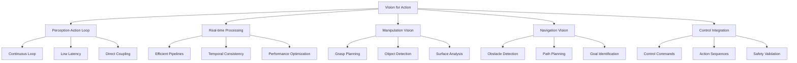

# Vision for Action in Humanoid Robotics

## Introduction to Vision for Action

Vision for Action represents the critical integration between computer vision and robotic action execution in humanoid robotics. Unlike traditional computer vision that focuses solely on scene understanding, Vision for Action emphasizes the direct connection between visual perception and motor control, enabling humanoid robots to perform complex tasks by translating visual information into appropriate actions.

The Vision for Action paradigm encompasses:
- **Perception-Action Coupling**: Direct connection between visual input and motor output
- **Goal-Directed Vision**: Vision systems optimized for specific action tasks
- **Online Processing**: Real-time vision processing for dynamic action execution
- **Embodied Cognition**: Understanding how visual perception guides physical interaction

## Architecture of Vision for Action Systems

### Perception-Action Loop

The core of Vision for Action is the tight coupling between perception and action in a continuous loop:

```python
# vision_action_loop.py
import rospy
import numpy as np
import torch
import cv2
from sensor_msgs.msg import Image
from geometry_msgs.msg import Pose, Point
from std_msgs.msg import String
from cv_bridge import CvBridge
import time

class VisionActionLoop:
    def __init__(self):
        # Initialize vision components
        self.vision_processor = OnlineVisionProcessor()
        self.action_selector = ActionSelector()
        self.motor_controller = MotorController()

        # ROS interfaces
        self.bridge = CvBridge()
        self.image_sub = rospy.Subscriber('/head_camera/rgb/image_raw', Image, self.image_callback)
        self.command_sub = rospy.Subscriber('/task_command', String, self.command_callback)

        # Internal state
        self.current_image = None
        self.current_task = "idle"
        self.action_buffer = []
        self.last_action_time = time.time()

        # Control parameters
        self.control_frequency = 30  # Hz
        self.action_delay_threshold = 0.1  # seconds

        rospy.loginfo("Vision-Action Loop initialized")

    def image_callback(self, msg):
        """
        Process incoming camera image
        """
        try:
            # Convert ROS image to OpenCV
            cv_image = self.bridge.imgmsg_to_cv2(msg, "bgr8")
            self.current_image = cv_image

            # Process image through vision pipeline
            vision_output = self.vision_processor.process_frame(cv_image)

            # If we have a current task, select appropriate action
            if self.current_task != "idle":
                action = self.action_selector.select_action(
                    vision_output,
                    self.current_task
                )

                # Execute action if sufficient time has passed
                current_time = time.time()
                if current_time - self.last_action_time > self.action_delay_threshold:
                    self.motor_controller.execute_action(action)
                    self.last_action_time = current_time

        except Exception as e:
            rospy.logerr(f"Error processing image: {e}")

    def command_callback(self, msg):
        """
        Update current task
        """
        self.current_task = msg.data
        rospy.loginfo(f"Task updated to: {self.current_task}")

    def run_control_loop(self):
        """
        Main control loop running at specified frequency
        """
        rate = rospy.Rate(self.control_frequency)

        while not rospy.is_shutdown():
            # The main work is done in callbacks
            # This loop maintains the control frequency
            rate.sleep()

class OnlineVisionProcessor:
    def __init__(self):
        # Initialize lightweight vision models for real-time processing
        self.object_detector = self.initialize_lightweight_detector()
        self.pose_estimator = self.initialize_pose_estimator()
        self.scene_analyzer = SceneAnalyzer()

        rospy.loginfo("Online Vision Processor initialized")

    def initialize_lightweight_detector(self):
        """
        Initialize efficient object detection model for real-time processing
        """
        # Using YOLOv5 nano or similar lightweight model
        import torch
        try:
            model = torch.hub.load('ultralytics/yolov5', 'yolov5n', pretrained=True)
            model.eval()
            return model
        except:
            # Fallback to simple detector
            class MockDetector:
                def __call__(self, img):
                    # Return mock detections
                    return {
                        'boxes': torch.tensor([[100, 100, 200, 200]], dtype=torch.float32),
                        'labels': torch.tensor([0]),
                        'scores': torch.tensor([0.9])
                    }
            return MockDetector()

    def initialize_pose_estimator(self):
        """
        Initialize pose estimation for action planning
        """
        # For real-time applications, use efficient pose estimation
        class MockPoseEstimator:
            def estimate_pose(self, image, object_name):
                # Return mock pose
                return {
                    'position': [1.0, 0.5, 0.8],  # x, y, z in robot frame
                    'orientation': [0, 0, 0, 1],  # quaternion
                    'confidence': 0.85
                }
        return MockPoseEstimator()

    def process_frame(self, image):
        """
        Process a single frame for action selection
        """
        # Convert image to tensor
        img_tensor = self.preprocess_image(image)

        # Run object detection
        with torch.no_grad():
            detections = self.object_detector(img_tensor)

        # Extract relevant information for action planning
        detected_objects = self.extract_objects_for_action(detections, image)

        # Analyze scene for action context
        scene_analysis = self.scene_analyzer.analyze_scene(image, detected_objects)

        # Estimate poses for objects of interest
        for obj in detected_objects:
            if obj['name'] in ['cup', 'bottle', 'box']:  # Manipulable objects
                obj['pose'] = self.pose_estimator.estimate_pose(image, obj['name'])

        return {
            'detected_objects': detected_objects,
            'scene_analysis': scene_analysis,
            'image_features': self.extract_visual_features(img_tensor),
            'timestamp': rospy.Time.now().to_sec()
        }

    def preprocess_image(self, image):
        """
        Preprocess image for vision models
        """
        # Resize for model input
        resized = cv2.resize(image, (640, 640))
        # Convert BGR to RGB
        rgb_image = cv2.cvtColor(resized, cv2.COLOR_BGR2RGB)
        # Normalize and convert to tensor
        tensor_image = torch.from_numpy(rgb_image).float().permute(2, 0, 1) / 255.0
        # Add batch dimension
        return tensor_image.unsqueeze(0)

    def extract_objects_for_action(self, detections, original_image):
        """
        Extract objects relevant for action selection
        """
        objects = []

        # Process detections
        boxes = detections.xyxy[0].cpu().numpy() if hasattr(detections, 'xyxy') else detections['boxes'].cpu().numpy()
        scores = detections.xyxyn[0][:, 4].cpu().numpy() if hasattr(detections, 'xyxyn') else detections['scores'].cpu().numpy()
        labels = detections.xyxyn[0][:, 5].cpu().numpy() if hasattr(detections, 'xyxyn') else detections['labels'].cpu().numpy()

        # COCO dataset class names (first 20)
        coco_names = [
            'person', 'bicycle', 'car', 'motorcycle', 'airplane', 'bus', 'train', 'truck', 'boat',
            'traffic light', 'fire hydrant', 'stop sign', 'parking meter', 'bench', 'bird', 'cat',
            'dog', 'horse', 'sheep', 'cow'
        ]

        for i, (box, score, label) in enumerate(zip(boxes, scores, labels)):
            if score > 0.5:  # Confidence threshold
                x1, y1, x2, y2 = box
                center_x = (x1 + x2) / 2
                center_y = (y1 + y2) / 2

                # Convert to original image scale
                scale_x = original_image.shape[1] / 640
                scale_y = original_image.shape[0] / 640

                obj = {
                    'name': coco_names[int(label)] if int(label) < len(coco_names) else f'object_{int(label)}',
                    'bbox': [x1 * scale_x, y1 * scale_y, x2 * scale_x, y2 * scale_y],
                    'center': [center_x * scale_x, center_y * scale_y],
                    'confidence': float(score),
                    'area': (x2 - x1) * (y2 - y1)
                }

                objects.append(obj)

        return objects

    def extract_visual_features(self, image_tensor):
        """
        Extract high-level visual features for action planning
        """
        # Use a lightweight feature extractor
        # In practice, this could use a pre-trained CNN backbone
        batch_size, channels, height, width = image_tensor.shape

        # Global average pooling for scene-level features
        features = torch.mean(image_tensor, dim=[2, 3])  # Average over spatial dimensions
        return features.squeeze().tolist()

class SceneAnalyzer:
    def __init__(self):
        # Initialize scene analysis components
        self.spatial_analyzer = SpatialRelationshipAnalyzer()
        self.navigation_analyzer = NavigationSpaceAnalyzer()

    def analyze_scene(self, image, detected_objects):
        """
        Analyze scene for action-relevant information
        """
        # Analyze spatial relationships between objects
        spatial_relationships = self.spatial_analyzer.analyze_relationships(detected_objects)

        # Analyze navigable space
        navigable_areas = self.navigation_analyzer.analyze_navigable_space(image)

        # Determine scene type (indoor, outdoor, cluttered, etc.)
        scene_type = self.classify_scene_type(image, detected_objects)

        return {
            'spatial_relationships': spatial_relationships,
            'navigable_areas': navigable_areas,
            'scene_type': scene_type,
            'action_relevance': self.assess_action_relevance(detected_objects)
        }

    def classify_scene_type(self, image, objects):
        """
        Classify scene type for action planning
        """
        # Simple classification based on object types and arrangement
        object_names = [obj['name'] for obj in objects]

        if 'person' in object_names and ('chair' in object_names or 'table' in object_names):
            return 'indoor_social'
        elif 'car' in object_names or 'road' in object_names:
            return 'outdoor_navigation'
        elif 'cup' in object_names or 'bottle' in object_names:
            return 'indoor_manipulation'
        else:
            return 'general_indoor'

    def assess_action_relevance(self, objects):
        """
        Assess which objects are relevant for action
        """
        manipulable_objects = ['cup', 'bottle', 'box', 'book', 'phone', 'keys']
        return [obj for obj in objects if obj['name'] in manipulable_objects]
```

### Action Selection and Execution

The action selection component translates visual information into appropriate motor commands:

```python
# action_selection.py
import numpy as np
import rospy
from geometry_msgs.msg import Pose, Point, Vector3
from std_msgs.msg import Float64MultiArray

class ActionSelector:
    def __init__(self):
        # Initialize action selection models
        self.action_classifier = ActionClassifier()
        self.motion_planner = MotionPlanner()
        self.grasp_planner = GraspPlanner()

        rospy.loginfo("Action Selector initialized")

    def select_action(self, vision_output, task_command):
        """
        Select appropriate action based on vision output and task command
        """
        # Determine action type based on task and visual input
        action_type = self.action_classifier.classify_action(
            vision_output['detected_objects'],
            vision_output['scene_analysis'],
            task_command
        )

        # Plan specific action
        if action_type == 'navigation':
            action = self.plan_navigation_action(vision_output, task_command)
        elif action_type == 'manipulation':
            action = self.plan_manipulation_action(vision_output, task_command)
        elif action_type == 'inspection':
            action = self.plan_inspection_action(vision_output, task_command)
        else:
            action = self.plan_idle_action()

        return action

    def plan_navigation_action(self, vision_output, task_command):
        """
        Plan navigation action based on visual input
        """
        scene_analysis = vision_output['scene_analysis']
        navigable_areas = scene_analysis['navigable_areas']

        # Extract target location from command
        target_location = self.extract_target_location(task_command)

        # Plan path to target while avoiding obstacles
        path = self.motion_planner.plan_path_to_target(
            target_location,
            vision_output['detected_objects'],
            navigable_areas
        )

        return {
            'type': 'navigation',
            'path': path,
            'target': target_location,
            'confidence': 0.9
        }

    def plan_manipulation_action(self, vision_output, task_command):
        """
        Plan manipulation action based on visual input
        """
        detected_objects = vision_output['detected_objects']
        relevant_objects = vision_output['scene_analysis']['action_relevance']

        if not relevant_objects:
            return self.plan_idle_action()

        # Select target object based on command
        target_object = self.select_target_object(relevant_objects, task_command)

        if not target_object:
            return self.plan_idle_action()

        # Plan grasping action
        grasp_pose = self.grasp_planner.plan_grasp(
            target_object,
            vision_output['scene_analysis']
        )

        # Plan approach motion
        approach_pose = self.calculate_approach_pose(target_object, grasp_pose)

        return {
            'type': 'manipulation',
            'target_object': target_object,
            'grasp_pose': grasp_pose,
            'approach_pose': approach_pose,
            'manipulation_type': self.determine_manipulation_type(task_command),
            'confidence': target_object['confidence']
        }

    def plan_inspection_action(self, vision_output, task_command):
        """
        Plan inspection action based on visual input
        """
        # For inspection, plan to look at or approach interesting objects
        detected_objects = vision_output['detected_objects']

        if detected_objects:
            # Select most interesting object
            target_obj = max(detected_objects, key=lambda x: x['confidence'] * x['area'])

            # Plan to look at the object
            look_pose = self.calculate_look_pose(target_obj)

            return {
                'type': 'inspection',
                'target_object': target_obj,
                'look_pose': look_pose,
                'confidence': target_obj['confidence']
            }

        return self.plan_idle_action()

    def plan_idle_action(self):
        """
        Plan idle action when no specific task can be performed
        """
        return {
            'type': 'idle',
            'target': None,
            'motion': 'stationary',
            'confidence': 1.0
        }

    def extract_target_location(self, command):
        """
        Extract target location from navigation command
        """
        # Simple keyword-based extraction
        command_lower = command.lower()

        if 'kitchen' in command_lower:
            return {'name': 'kitchen', 'coordinates': [2.0, 1.0, 0.0]}
        elif 'living room' in command_lower:
            return {'name': 'living_room', 'coordinates': [-1.0, 0.5, 0.0]}
        elif 'bedroom' in command_lower:
            return {'name': 'bedroom', 'coordinates': [0.0, -2.0, 0.0]}
        else:
            # Try to extract coordinates from command
            import re
            coords = re.findall(r'[-+]?\d*\.\d+|\d+', command)
            if len(coords) >= 2:
                return {'name': 'coordinates', 'coordinates': [float(coords[0]), float(coords[1]), 0.0]}

        return {'name': 'current_position', 'coordinates': [0.0, 0.0, 0.0]}

    def select_target_object(self, relevant_objects, command):
        """
        Select target object based on command
        """
        command_lower = command.lower()

        # Prioritize objects mentioned in command
        for obj in relevant_objects:
            if obj['name'] in command_lower:
                return obj

        # Otherwise, select most confident object
        if relevant_objects:
            return max(relevant_objects, key=lambda x: x['confidence'])

        return None

    def calculate_approach_pose(self, target_object, grasp_pose):
        """
        Calculate approach pose before grasping
        """
        # Approach 10cm away from the object
        approach_offset = 0.1  # meters

        # Calculate approach position
        obj_center = np.array(target_object['center'])
        grasp_pos = np.array(grasp_pose['position'])

        # Direction from object to grasp point
        approach_dir = grasp_pos - np.array([obj_center[0], obj_center[1], grasp_pos[2]])
        approach_dir = approach_dir / np.linalg.norm(approach_dir)

        # Calculate approach position
        approach_pos = grasp_pos - approach_dir * approach_offset

        return {
            'position': approach_pos.tolist(),
            'orientation': grasp_pose['orientation']
        }

    def calculate_look_pose(self, target_object):
        """
        Calculate pose to look at target object
        """
        # Calculate position to look at object
        obj_center = target_object['center']
        obj_position = [obj_center[0], obj_center[1], 1.0]  # Assume object at 1m height

        return {
            'position': obj_position,
            'orientation': [0, 0, 0, 1]  # Default orientation
        }

    def determine_manipulation_type(self, command):
        """
        Determine type of manipulation based on command
        """
        command_lower = command.lower()

        if any(word in command_lower for word in ['pick', 'grasp', 'take', 'lift']):
            return 'grasp'
        elif any(word in command_lower for word in ['place', 'put', 'set', 'drop']):
            return 'place'
        elif any(word in command_lower for word in ['move', 'relocate', 'transfer']):
            return 'relocate'
        else:
            return 'inspect'

class ActionClassifier:
    def __init__(self):
        # Initialize action classification model
        pass

    def classify_action(self, detected_objects, scene_analysis, task_command):
        """
        Classify the appropriate action type based on inputs
        """
        command_lower = task_command.lower()

        # Navigation commands
        if any(word in command_lower for word in ['go to', 'move to', 'navigate to', 'walk to', 'drive to']):
            return 'navigation'

        # Manipulation commands
        if any(word in command_lower for word in ['pick', 'grasp', 'take', 'lift', 'hold', 'carry', 'move']):
            if scene_analysis['action_relevance']:  # If there are manipulable objects
                return 'manipulation'

        # Inspection commands
        if any(word in command_lower for word in ['look at', 'examine', 'check', 'inspect', 'observe']):
            return 'inspection'

        # Default to navigation if no manipulable objects but movement is requested
        if any(word in command_lower for word in ['move', 'go', 'walk']) and not scene_analysis['action_relevance']:
            return 'navigation'

        return 'idle'

class MotionPlanner:
    def __init__(self):
        # Initialize motion planning components
        pass

    def plan_path_to_target(self, target_location, detected_objects, navigable_areas):
        """
        Plan path to target location avoiding obstacles
        """
        # This would implement a path planning algorithm like A* or RRT
        # For this example, return a simple straight-line path with obstacle avoidance

        # Calculate straight-line path
        current_pos = [0.0, 0.0, 0.0]  # Assume current position is origin
        target_pos = target_location['coordinates']

        # Simple path with obstacle avoidance
        path = self.simple_path_with_obstacle_avoidance(
            current_pos, target_pos, detected_objects
        )

        return path

    def simple_path_with_obstacle_avoidance(self, start, goal, obstacles):
        """
        Simple path planning with basic obstacle avoidance
        """
        # For this example, return a straight line
        # In practice, this would use proper path planning algorithms
        return [start, goal]

class GraspPlanner:
    def __init__(self):
        # Initialize grasp planning components
        pass

    def plan_grasp(self, target_object, scene_analysis):
        """
        Plan grasp pose for target object
        """
        # Calculate grasp pose based on object properties
        obj_bbox = target_object['bbox']
        obj_center = target_object['center']

        # Simple grasp planning: grasp at center of object
        grasp_pose = {
            'position': [obj_center[0], obj_center[1], 1.0],  # Lift slightly above object
            'orientation': [0, 0, 0, 1],  # Default orientation
            'grasp_type': self.determine_grasp_type(target_object)
        }

        return grasp_pose

    def determine_grasp_type(self, target_object):
        """
        Determine appropriate grasp type based on object properties
        """
        bbox = target_object['bbox']
        width = bbox[2] - bbox[0]
        height = bbox[3] - bbox[1]

        if width > height * 1.5:
            return 'top_grasp'  # Grasp from top for wide objects
        elif height > width * 1.5:
            return 'side_grasp'  # Grasp from side for tall objects
        else:
            return 'pinch_grasp'  # Pinch grasp for cube-like objects
```

## Real-time Vision Processing for Action

### Efficient Visual Processing Pipelines

For real-time action execution, vision processing must be optimized:

```python
# efficient_vision_processing.py
import torch
import torch.nn as nn
import numpy as np
import cv2
import time
from collections import deque

class EfficientVisionPipeline:
    def __init__(self, target_fps=30):
        self.target_fps = target_fps
        self.frame_time = 1.0 / target_fps

        # Initialize optimized models
        self.feature_extractor = self.load_optimized_feature_extractor()
        self.object_detector = self.load_optimized_detector()
        self.pose_estimator = self.load_optimized_pose_estimator()

        # Frame buffering for temporal consistency
        self.frame_buffer = deque(maxlen=5)
        self.processing_times = deque(maxlen=10)

        # Performance monitoring
        self.last_process_time = 0
        self.average_process_time = 0

        rospy.loginfo(f"Efficient Vision Pipeline initialized for {target_fps} FPS")

    def load_optimized_feature_extractor(self):
        """
        Load optimized feature extraction model
        """
        # Use MobileNet or similar efficient backbone
        class EfficientFeatureExtractor(nn.Module):
            def __init__(self):
                super().__init__()
                # Simplified feature extractor for speed
                self.features = nn.Sequential(
                    nn.Conv2d(3, 16, 3, stride=2, padding=1),
                    nn.ReLU(inplace=True),
                    nn.Conv2d(16, 32, 3, stride=2, padding=1),
                    nn.ReLU(inplace=True),
                    nn.Conv2d(32, 64, 3, stride=2, padding=1),
                    nn.ReLU(inplace=True),
                    nn.AdaptiveAvgPool2d((4, 4))
                )
                self.classifier = nn.Linear(64 * 4 * 4, 128)  # Compact feature vector

            def forward(self, x):
                x = self.features(x)
                x = x.view(x.size(0), -1)
                return self.classifier(x)

        model = EfficientFeatureExtractor()
        model.eval()
        return model

    def load_optimized_detector(self):
        """
        Load optimized object detection model
        """
        # For real-time, use efficient model like NanoDet or Tiny-YOLO
        class MockEfficientDetector:
            def __init__(self):
                pass

            def detect(self, image):
                # Return mock detections quickly
                # In practice, this would use an optimized detector
                return {
                    'boxes': [],
                    'labels': [],
                    'scores': []
                }
        return MockEfficientDetector()

    def load_optimized_pose_estimator(self):
        """
        Load optimized pose estimation model
        """
        class MockPoseEstimator:
            def estimate(self, image, object_info):
                return {
                    'position': [0, 0, 0],
                    'orientation': [0, 0, 0, 1],
                    'confidence': 0.8
                }
        return MockPoseEstimator()

    def process_frame_efficiently(self, image):
        """
        Process frame with efficiency optimizations
        """
        start_time = time.time()

        # Add frame to buffer
        self.frame_buffer.append(image)

        # Preprocess image efficiently
        processed_image = self.preprocess_frame(image)

        # Extract features
        with torch.no_grad():
            features = self.feature_extractor(processed_image)

        # Run object detection
        detections = self.object_detector.detect(image)

        # Estimate poses for detected objects
        for det in detections:
            det['pose'] = self.pose_estimator.estimate(image, det)

        # Calculate processing time
        process_time = time.time() - start_time
        self.processing_times.append(process_time)
        self.last_process_time = process_time

        # Update average
        if self.processing_times:
            self.average_process_time = sum(self.processing_times) / len(self.processing_times)

        # Check if we're meeting timing requirements
        if process_time > self.frame_time:
            rospy.logwarn(f"Frame processing took {process_time:.3f}s, exceeding target of {self.frame_time:.3f}s")

        return {
            'features': features,
            'detections': detections,
            'processing_time': process_time,
            'timestamp': time.time()
        }

    def preprocess_frame(self, image):
        """
        Efficiently preprocess frame for neural network
        """
        # Resize to model input size (smaller for speed)
        resized = cv2.resize(image, (320, 320))  # Smaller input for speed

        # Convert BGR to RGB
        rgb_image = cv2.cvtColor(resized, cv2.COLOR_BGR2RGB)

        # Normalize and convert to tensor
        tensor_image = torch.from_numpy(rgb_image).float().permute(2, 0, 1) / 255.0

        # Add batch dimension
        return tensor_image.unsqueeze(0)

    def get_performance_stats(self):
        """
        Get performance statistics
        """
        return {
            'current_fps': 1.0 / self.average_process_time if self.average_process_time > 0 else 0,
            'average_process_time': self.average_process_time,
            'last_process_time': self.last_process_time,
            'target_fps': self.target_fps,
            'timing_met': self.average_process_time < self.frame_time
        }

class TemporalConsistencyManager:
    def __init__(self):
        self.object_trackers = {}
        self.pose_history = {}
        self.max_history_length = 10

    def update_tracking(self, current_detections, timestamp):
        """
        Update object tracking for temporal consistency
        """
        # Simple tracking based on overlap and appearance
        for detection in current_detections:
            best_match = self.find_best_match(detection)

            if best_match is not None:
                # Update existing track
                track_id = best_match['track_id']
                self.object_trackers[track_id]['detections'].append(detection)
                self.object_trackers[track_id]['last_seen'] = timestamp

                # Update pose history
                if 'pose' in detection:
                    if track_id not in self.pose_history:
                        self.pose_history[track_id] = deque(maxlen=self.max_history_length)
                    self.pose_history[track_id].append(detection['pose'])
            else:
                # Create new track
                new_track_id = self.generate_new_track_id()
                self.object_trackers[new_track_id] = {
                    'detections': [detection],
                    'last_seen': timestamp,
                    'track_id': new_track_id
                }

        # Clean up old tracks
        self.cleanup_old_tracks(timestamp)

    def find_best_match(self, detection):
        """
        Find best matching track for detection
        """
        best_match = None
        best_score = 0

        for track_id, track in self.object_trackers.items():
            if track['last_seen'] < rospy.Time.now().to_sec() - 2.0:  # 2 seconds old
                continue

            # Calculate similarity score
            score = self.calculate_detection_similarity(detection, track['detections'][-1])

            if score > best_score:
                best_score = score
                best_match = track

        return best_match if best_score > 0.3 else None  # Threshold

    def calculate_detection_similarity(self, det1, det2):
        """
        Calculate similarity between two detections
        """
        # Calculate IoU (Intersection over Union)
        x1_1, y1_1, x2_1, y2_1 = det1['bbox']
        x1_2, y1_2, x2_2, y2_2 = det2['bbox']

        # Calculate intersection
        x1_i = max(x1_1, x2_1)
        y1_i = max(y1_1, y2_1)
        x2_i = min(x2_1, x2_2)
        y2_i = min(y2_1, y2_2)

        if x2_i < x1_i or y2_i < y1_i:
            intersection = 0
        else:
            intersection = (x2_i - x1_i) * (y2_i - y1_i)

        # Calculate union
        area1 = (x2_1 - x1_1) * (y2_1 - y1_1)
        area2 = (x2_2 - x1_2) * (y2_2 - y1_2)
        union = area1 + area2 - intersection

        iou = intersection / union if union > 0 else 0

        # Also consider class similarity and confidence
        class_sim = 1.0 if det1.get('name') == det2.get('name') else 0.5
        conf_sim = min(det1.get('confidence', 0), det2.get('confidence', 0))

        return iou * 0.5 + class_sim * 0.3 + conf_sim * 0.2

    def generate_new_track_id(self):
        """
        Generate new track ID
        """
        import random
        return f"track_{int(time.time())}_{random.randint(1000, 9999)}"

    def cleanup_old_tracks(self, current_time):
        """
        Remove old tracks that haven't been seen recently
        """
        tracks_to_remove = []
        for track_id, track in self.object_trackers.items():
            if current_time - track['last_seen'] > 5.0:  # 5 seconds
                tracks_to_remove.append(track_id)

        for track_id in tracks_to_remove:
            del self.object_trackers[track_id]
            if track_id in self.pose_history:
                del self.pose_history[track_id]

    def get_smoothed_poses(self):
        """
        Get temporally smoothed poses
        """
        smoothed_poses = {}

        for track_id, pose_history in self.pose_history.items():
            if len(pose_history) > 1:
                # Calculate average pose from history
                avg_position = np.mean([pose['position'] for pose in pose_history], axis=0)
                avg_orientation = np.mean([pose['orientation'] for pose in pose_history], axis=0)

                smoothed_poses[track_id] = {
                    'position': avg_position.tolist(),
                    'orientation': avg_orientation.tolist()
                }

        return smoothed_poses
```

## Manipulation-Specific Vision Processing

### Grasp Planning and Execution

Vision processing for manipulation tasks requires specialized approaches:

```python
# manipulation_vision.py
import numpy as np
import cv2
import torch
import rospy
from geometry_msgs.msg import Pose, Point
from sensor_msgs.msg import Image
from cv_bridge import CvBridge

class ManipulationVisionProcessor:
    def __init__(self):
        self.bridge = CvBridge()
        self.grasp_detector = GraspPoseDetector()
        self.surface_analyzer = SurfaceAnalyzer()
        self.stability_analyzer = StabilityAnalyzer()

        # Manipulation-specific subscribers
        self.manipulation_image_sub = rospy.Subscriber('/manipulation_camera/rgb/image_raw', Image, self.manipulation_image_callback)
        self.depth_sub = rospy.Subscriber('/manipulation_camera/depth/image_raw', Image, self.depth_callback)

        # Internal state
        self.current_rgb_image = None
        self.current_depth_image = None
        self.object_candidates = []

        rospy.loginfo("Manipulation Vision Processor initialized")

    def manipulation_image_callback(self, msg):
        """
        Process manipulation camera image
        """
        try:
            self.current_rgb_image = self.bridge.imgmsg_to_cv2(msg, "bgr8")
        except Exception as e:
            rospy.logerr(f"Error processing manipulation image: {e}")

    def depth_callback(self, msg):
        """
        Process depth image for 3D information
        """
        try:
            self.current_depth_image = self.bridge.imgmsg_to_cv2(msg, "32FC1")
        except Exception as e:
            rospy.logerr(f"Error processing depth image: {e}")

    def detect_manipulation_targets(self):
        """
        Detect objects suitable for manipulation
        """
        if self.current_rgb_image is None or self.current_depth_image is None:
            return []

        # Find object candidates
        candidates = self.find_object_candidates(self.current_rgb_image)

        # Analyze each candidate for manipulation suitability
        manipulation_targets = []
        for candidate in candidates:
            target = self.analyze_candidate_for_manipulation(candidate)
            if target:
                manipulation_targets.append(target)

        self.object_candidates = manipulation_targets
        return manipulation_targets

    def find_object_candidates(self, image):
        """
        Find potential manipulation objects in image
        """
        # Use color-based segmentation for object detection
        hsv = cv2.cvtColor(image, cv2.COLOR_BGR2HSV)

        # Define color ranges for common objects
        color_ranges = [
            ([0, 40, 40], [10, 255, 255]),    # Red objects
            ([170, 40, 40], [180, 255, 255]), # Red objects (wrapping)
            ([36, 40, 40], [70, 255, 255]),   # Green objects
            ([20, 40, 40], [40, 255, 255]),   # Yellow objects
            ([100, 40, 40], [130, 255, 255]), # Blue objects
        ]

        candidates = []
        for lower, upper in color_ranges:
            lower = np.array(lower)
            upper = np.array(upper)

            mask = cv2.inRange(hsv, lower, upper)
            contours, _ = cv2.findContours(mask, cv2.RETR_EXTERNAL, cv2.CHAIN_APPROX_SIMPLE)

            for contour in contours:
                area = cv2.contourArea(contour)
                if area > 500:  # Minimum area threshold
                    # Get bounding box
                    x, y, w, h = cv2.boundingRect(contour)

                    candidate = {
                        'bbox': [x, y, x+w, y+h],
                        'area': area,
                        'contour': contour,
                        'center': [x + w//2, y + h//2]
                    }
                    candidates.append(candidate)

        return candidates

    def analyze_candidate_for_manipulation(self, candidate):
        """
        Analyze candidate object for manipulation suitability
        """
        bbox = candidate['bbox']
        x1, y1, x2, y2 = bbox

        # Extract region of interest
        roi_rgb = self.current_rgb_image[y1:y2, x1:x2]
        roi_depth = self.current_depth_image[y1:y2, x1:x2]

        # Analyze surface properties
        surface_properties = self.surface_analyzer.analyze_surface(roi_rgb)

        # Estimate 3D position using depth
        avg_depth = np.nanmedian(roi_depth[roi_depth > 0])
        if np.isnan(avg_depth) or avg_depth == 0:
            return None  # Invalid depth

        object_3d_position = self.convert_pixel_to_3d(
            candidate['center'][0], candidate['center'][1], avg_depth
        )

        # Check if object is manipulable
        if not self.is_manipulable_object(surface_properties, roi_rgb.shape):
            return None

        # Plan grasps for the object
        grasp_poses = self.grasp_detector.find_grasp_poses(roi_rgb, roi_depth)

        return {
            'position_3d': object_3d_position,
            'bbox': bbox,
            'surface_properties': surface_properties,
            'grasp_poses': grasp_poses,
            'suitability_score': self.calculate_manipulation_suitability(surface_properties, roi_rgb.shape),
            'confidence': candidate.get('confidence', 0.8)
        }

    def is_manipulable_object(self, surface_properties, shape):
        """
        Determine if object is suitable for manipulation
        """
        height, width = shape[:2]

        # Check size constraints
        if height < 20 or width < 20:  # Too small
            return False
        if height > 300 or width > 300:  # Too large
            return False

        # Check surface properties
        if surface_properties['reflectivity'] > 0.8:  # Too reflective
            return False

        return True

    def calculate_manipulation_suitability(self, surface_properties, shape):
        """
        Calculate suitability score for manipulation
        """
        height, width = shape[:2]
        aspect_ratio = max(width, height) / min(width, height)

        # Size bonus (prefer medium-sized objects)
        size_score = 1.0 - abs(aspect_ratio - 1.0) * 0.2

        # Surface texture bonus (prefer textured surfaces for grip)
        texture_score = min(surface_properties['texture_contrast'], 1.0)

        # Shape bonus (prefer objects with good grasp points)
        shape_score = 0.5 + 0.5 * (1.0 - abs(aspect_ratio - 1.0))

        return (size_score * 0.4 + texture_score * 0.3 + shape_score * 0.3)

    def convert_pixel_to_3d(self, u, v, depth):
        """
        Convert pixel coordinates and depth to 3D world coordinates
        """
        # Camera intrinsic parameters (these would come from camera_info in real implementation)
        fx = 525.0  # Focal length x
        fy = 525.0  # Focal length y
        cx = 319.5  # Principal point x
        cy = 239.5  # Principal point y

        # Convert to 3D
        x = (u - cx) * depth / fx
        y = (v - cy) * depth / fy
        z = depth

        return [x, y, z]

class GraspPoseDetector:
    def __init__(self):
        # Initialize grasp detection models
        self.antipodal_grasp_detector = AntipodalGraspDetector()
        self.suction_point_detector = SuctionPointDetector()

    def find_grasp_poses(self, rgb_image, depth_image):
        """
        Find suitable grasp poses for the object
        """
        grasp_poses = []

        # Detect antipodal grasps (for pinch gripping)
        antipodal_grasps = self.antipodal_grasp_detector.detect(rgb_image)
        grasp_poses.extend(antipodal_grasps)

        # Detect suction points (for vacuum grippers)
        suction_points = self.suction_point_detector.detect(rgb_image)
        grasp_poses.extend(suction_points)

        # Filter and rank grasps
        ranked_grasps = self.rank_grasps(grasp_poses, rgb_image)

        return ranked_grasps

    def rank_grasps(self, grasps, image):
        """
        Rank grasps by quality
        """
        ranked = []
        for grasp in grasps:
            quality = self.evaluate_grasp_quality(grasp, image)
            grasp['quality'] = quality
            ranked.append(grasp)

        # Sort by quality (descending)
        ranked.sort(key=lambda x: x['quality'], reverse=True)
        return ranked[:5]  # Return top 5 grasps

    def evaluate_grasp_quality(self, grasp, image):
        """
        Evaluate quality of a grasp
        """
        if grasp['type'] == 'antipodal':
            # Evaluate based on edge alignment and surface properties
            quality = 0.7 + 0.3 * grasp.get('confidence', 0.5)
        elif grasp['type'] == 'suction':
            # Evaluate based on surface flatness and texture
            quality = 0.6 + 0.4 * grasp.get('flatness_score', 0.5)
        else:
            quality = 0.5

        return min(quality, 1.0)

class AntipodalGraspDetector:
    def __init__(self):
        # Initialize edge detection and geometric analysis
        pass

    def detect(self, image):
        """
        Detect antipodal grasp points
        """
        # Convert to grayscale
        gray = cv2.cvtColor(image, cv2.COLOR_BGR2GRAY)

        # Apply edge detection
        edges = cv2.Canny(gray, 50, 150)

        # Find contours
        contours, _ = cv2.findContours(edges, cv2.RETR_EXTERNAL, cv2.CHAIN_APPROX_SIMPLE)

        grasps = []
        for contour in contours:
            # Approximate contour to polygon
            epsilon = 0.02 * cv2.arcLength(contour, True)
            approx = cv2.approxPolyDP(contour, epsilon, True)

            # Look for graspable features
            if len(approx) >= 4:  # Likely to be a graspable corner or edge
                for i in range(len(approx)):
                    pt1 = approx[i][0]
                    pt2 = approx[(i + 1) % len(approx)][0]

                    # Calculate midpoint and direction
                    mid_x = (pt1[0] + pt2[0]) / 2
                    mid_y = (pt1[1] + pt2[1]) / 2

                    # Calculate perpendicular direction for grasp
                    dx = pt2[0] - pt1[0]
                    dy = pt2[1] - pt1[1]
                    perp_dx = -dy
                    perp_dy = dx

                    # Normalize
                    length = np.sqrt(perp_dx**2 + perp_dy**2)
                    if length > 0:
                        perp_dx /= length
                        perp_dy /= length

                    grasp = {
                        'type': 'antipodal',
                        'position': [mid_x, mid_y],
                        'orientation': [perp_dx, perp_dy],
                        'confidence': 0.8
                    }
                    grasps.append(grasp)

        return grasps

class SuctionPointDetector:
    def __init__(self):
        # Initialize flat surface detection
        pass

    def detect(self, image):
        """
        Detect suitable suction points
        """
        # Convert to grayscale
        gray = cv2.cvtColor(image, cv2.COLOR_BGR2GRAY)

        # Apply Gaussian blur to reduce noise
        blurred = cv2.GaussianBlur(gray, (5, 5), 0)

        # Detect flat regions using variance (low variance = flat)
        blockSize = 15
        mean_deviation = cv2.filter2D(blurred.astype(np.float32), -1,
                                    np.ones((blockSize, blockSize)) / (blockSize**2))

        # Calculate local variance
        squared_image = blurred.astype(np.float32) ** 2
        mean_squared = cv2.filter2D(squared_image, -1,
                                  np.ones((blockSize, blockSize)) / (blockSize**2))
        local_variance = mean_squared - mean_deviation**2

        # Find regions with low variance (flat surfaces)
        flat_regions = local_variance < 50  # Threshold for flatness

        # Find centroids of flat regions
        grasps = []
        contours, _ = cv2.findContours(flat_regions.astype(np.uint8), cv2.RETR_EXTERNAL, cv2.CHAIN_APPROX_SIMPLE)

        for contour in contours:
            area = cv2.contourArea(contour)
            if area > 100:  # Minimum area for suction cup
                # Get moments to find centroid
                M = cv2.moments(contour)
                if M["m00"] != 0:
                    cx = int(M["m10"] / M["m00"])
                    cy = int(M["m01"] / M["m00"])

                    grasp = {
                        'type': 'suction',
                        'position': [cx, cy],
                        'orientation': [0, 0, 1],  # Normal pointing up
                        'flatness_score': 1.0 - (local_variance[cy, cx] / 255.0),
                        'confidence': 0.7
                    }
                    grasps.append(grasp)

        return grasps

class SurfaceAnalyzer:
    def __init__(self):
        pass

    def analyze_surface(self, image):
        """
        Analyze surface properties for manipulation
        """
        # Convert to grayscale
        gray = cv2.cvtColor(image, cv2.COLOR_BGR2GRAY)

        # Calculate texture contrast (using local binary patterns concept)
        texture_contrast = self.calculate_texture_contrast(gray)

        # Calculate reflectivity (bright regions indicate reflectivity)
        mean_brightness = np.mean(gray)
        reflectivity = mean_brightness / 255.0

        # Calculate surface roughness
        sobelx = cv2.Sobel(gray, cv2.CV_64F, 1, 0, ksize=5)
        sobely = cv2.Sobel(gray, cv2.CV_64F, 0, 1, ksize=5)
        gradient_magnitude = np.sqrt(sobelx**2 + sobely**2)
        surface_roughness = np.mean(gradient_magnitude)

        return {
            'texture_contrast': texture_contrast,
            'reflectivity': reflectivity,
            'surface_roughness': surface_roughness,
            'colorfulness': self.calculate_colorfulness(image)
        }

    def calculate_texture_contrast(self, gray_image):
        """
        Calculate texture contrast using local variance
        """
        # Use Laplacian to detect edges and texture
        laplacian = cv2.Laplacian(gray_image, cv2.CV_64F)
        variance = np.var(laplacian)
        return min(variance / 1000.0, 1.0)  # Normalize to [0, 1]

    def calculate_colorfulness(self, image):
        """
        Calculate colorfulness of the surface
        """
        # Convert to HSV
        hsv = cv2.cvtColor(image, cv2.COLOR_BGR2HSV)
        saturation = hsv[:, :, 1]
        return np.mean(saturation) / 255.0

class StabilityAnalyzer:
    def __init__(self):
        pass

    def analyze_stability(self, object_info, grasp_pose):
        """
        Analyze stability of grasp
        """
        # This would analyze the physical stability of the grasp
        # considering object properties, grasp geometry, and robot dynamics

        stability_score = 0.8  # Placeholder

        return {
            'stability_score': stability_score,
            'center_of_mass_alignment': 0.9,  # How well grasp aligns with COM
            'torque_resistance': 0.7,  # Resistance to rotational forces
            'slip_probability': 0.1  # Probability of object slipping
        }
```

## Navigation-Specific Vision Processing

### Visual Navigation and Path Planning

Vision processing for navigation tasks requires different approaches:

```python
# navigation_vision.py
import numpy as np
import cv2
import rospy
from sensor_msgs.msg import Image, LaserScan
from geometry_msgs.msg import Pose, Point, Twist
from nav_msgs.msg import OccupancyGrid
from cv_bridge import CvBridge

class NavigationVisionProcessor:
    def __init__(self):
        self.bridge = CvBridge()

        # Navigation-specific subscribers
        self.nav_image_sub = rospy.Subscriber('/navigation_camera/rgb/image_raw', Image, self.nav_image_callback)
        self.depth_sub = rospy.Subscriber('/navigation_camera/depth/image_raw', Image, self.depth_callback)
        self.laser_sub = rospy.Subscriber('/scan', LaserScan, self.laser_callback)

        # Publishers
        self.obstacle_map_pub = rospy.Publisher('/vision_obstacle_map', OccupancyGrid, queue_size=10)
        self.navigation_goals_pub = rospy.Publisher('/vision_navigation_goals', Point, queue_size=10)

        # Internal state
        self.current_nav_image = None
        self.current_depth_image = None
        self.laser_data = None
        self.obstacle_map = None

        # Navigation parameters
        self.map_resolution = 0.1  # meters per pixel
        self.map_width = 200  # pixels (20m x 20m map)
        self.map_height = 200

        rospy.loginfo("Navigation Vision Processor initialized")

    def nav_image_callback(self, msg):
        """
        Process navigation camera image
        """
        try:
            self.current_nav_image = self.bridge.imgmsg_to_cv2(msg, "bgr8")
        except Exception as e:
            rospy.logerr(f"Error processing navigation image: {e}")

    def depth_callback(self, msg):
        """
        Process navigation depth image
        """
        try:
            self.current_depth_image = self.bridge.imgmsg_to_cv2(msg, "32FC1")
        except Exception as e:
            rospy.logerr(f"Error processing navigation depth: {e}")

    def laser_callback(self, msg):
        """
        Process laser scan data for navigation
        """
        self.laser_data = msg

    def process_navigation_scene(self):
        """
        Process navigation scene for obstacle detection and path planning
        """
        if self.current_nav_image is None:
            return None

        # Detect obstacles and free space
        obstacle_map = self.create_obstacle_map()

        # Detect navigable pathways
        navigable_paths = self.detect_navigable_paths(obstacle_map)

        # Identify potential navigation goals
        navigation_goals = self.identify_navigation_goals()

        # Publish results
        self.publish_obstacle_map(obstacle_map)

        return {
            'obstacle_map': obstacle_map,
            'navigable_paths': navigable_paths,
            'navigation_goals': navigation_goals
        }

    def create_obstacle_map(self):
        """
        Create obstacle map from visual and depth data
        """
        if self.current_depth_image is None:
            # Fallback to image-based obstacle detection
            return self.create_image_based_obstacle_map()

        # Create map
        obstacle_map = np.zeros((self.map_height, self.map_width), dtype=np.int8)

        # Convert depth image to obstacle information
        height, width = self.current_depth_image.shape
        center_x, center_y = width // 2, height // 2

        # Define robot's field of view in the map
        fov_range = 100  # pixels

        for y in range(max(0, center_y - fov_range), min(height, center_y + fov_range)):
            for x in range(max(0, center_x - fov_range), min(width, center_x + fov_range)):
                depth_value = self.current_depth_image[y, x]

                if depth_value > 0 and depth_value < 3.0:  # Obstacle within 3m
                    # Convert image coordinates to map coordinates
                    map_x = int((x - center_x) * self.map_resolution + self.map_width // 2)
                    map_y = int((y - center_y) * self.map_resolution + self.map_height // 2)

                    if 0 <= map_x < self.map_width and 0 <= map_y < self.map_height:
                        obstacle_map[map_y, map_x] = 100  # Occupied

        # Also use image features to detect obstacles
        image_obstacles = self.detect_image_obstacles()
        obstacle_map = np.maximum(obstacle_map, image_obstacles)

        return obstacle_map

    def create_image_based_obstacle_map(self):
        """
        Create obstacle map using image features when depth is unavailable
        """
        if self.current_nav_image is None:
            return np.zeros((self.map_height, self.map_width), dtype=np.int8)

        # Convert to grayscale
        gray = cv2.cvtColor(self.current_nav_image, cv2.COLOR_BGR2GRAY)

        # Detect edges (likely obstacles)
        edges = cv2.Canny(gray, 50, 150)

        # Create obstacle map based on edge density
        obstacle_map = np.zeros((self.map_height, self.map_width), dtype=np.int8)

        # Divide image into grid and calculate obstacle density
        grid_size = 32
        h, w = gray.shape
        grid_h, grid_w = h // grid_size, w // grid_size

        for i in range(grid_h):
            for j in range(grid_w):
                y_start, y_end = i * grid_size, min((i + 1) * grid_size, h)
                x_start, x_end = j * grid_size, min((j + 1) * grid_size, w)

                # Calculate edge density in this grid cell
                edge_region = edges[y_start:y_end, x_start:x_end]
                edge_density = np.sum(edge_region > 0) / (grid_size * grid_size)

                # Map to map coordinates
                map_x = int((x_start + x_end) / 2 * self.map_resolution)
                map_y = int((y_start + y_end) / 2 * self.map_resolution)

                if 0 <= map_x < self.map_width and 0 <= map_y < self.map_height:
                    obstacle_map[map_y, map_x] = min(int(edge_density * 100), 100)

        return obstacle_map

    def detect_image_obstacles(self):
        """
        Detect obstacles using image features
        """
        if self.current_nav_image is None:
            return np.zeros((self.map_height, self.map_width), dtype=np.int8)

        # Use optical flow or other visual features to detect obstacles
        gray = cv2.cvtColor(self.current_nav_image, cv2.COLOR_BGR2GRAY)

        # Detect corners (potential obstacle edges)
        corners = cv2.goodFeaturesToTrack(gray, maxCorners=100, qualityLevel=0.01, minDistance=10)

        obstacle_map = np.zeros((self.map_height, self.map_width), dtype=np.int8)

        if corners is not None:
            for corner in corners:
                x, y = corner.ravel()

                # Convert to map coordinates
                map_x = int(x * self.map_resolution)
                map_y = int(y * self.map_resolution)

                if 0 <= map_x < self.map_width and 0 <= map_y < self.map_height:
                    obstacle_map[map_y, map_x] = 80  # Likely obstacle

        return obstacle_map

    def detect_navigable_paths(self, obstacle_map):
        """
        Detect potential navigable paths
        """
        # Simple path detection - find areas with low obstacle density
        free_space = obstacle_map < 20  # Areas with <20% obstacle probability

        # Use morphological operations to clean up the map
        kernel = np.ones((3, 3), np.uint8)
        free_space = cv2.morphologyEx(free_space.astype(np.uint8), cv2.MORPH_CLOSE, kernel)
        free_space = cv2.morphologyEx(free_space, cv2.MORPH_OPEN, kernel)

        # Find connected components (potential path segments)
        num_labels, labels, stats, centroids = cv2.connectedComponentsWithStats(free_space)

        paths = []
        for i in range(1, num_labels):  # Skip background (label 0)
            area = stats[i, cv2.CC_STAT_AREA]
            if area > 100:  # Minimum area for a valid path segment
                centroid = centroids[i]
                paths.append({
                    'centroid': centroid,
                    'area': area,
                    'bbox': stats[i]  # x, y, width, height, area
                })

        return paths

    def identify_navigation_goals(self):
        """
        Identify potential navigation goals based on visual scene
        """
        if self.current_nav_image is None:
            return []

        # Look for distinctive visual features that might indicate goals
        gray = cv2.cvtColor(self.current_nav_image, cv2.COLOR_BGR2GRAY)

        # Detect corners that might indicate interesting locations
        corners = cv2.goodFeaturesToTrack(gray, maxCorners=20, qualityLevel=0.05, minDistance=20)

        goals = []
        if corners is not None:
            for corner in corners:
                x, y = corner.ravel()

                # Convert pixel to world coordinates (simplified)
                world_x = (x - gray.shape[1] // 2) * 0.05  # Approximate conversion
                world_y = (y - gray.shape[0] // 2) * 0.05

                goal = Point()
                goal.x = world_x
                goal.y = world_y
                goal.z = 0.0

                goals.append(goal)

        return goals

    def publish_obstacle_map(self, obstacle_map):
        """
        Publish obstacle map for navigation system
        """
        if self.obstacle_map_pub.get_num_connections() == 0:
            return

        msg = OccupancyGrid()
        msg.header.stamp = rospy.Time.now()
        msg.header.frame_id = "map"

        msg.info.resolution = self.map_resolution
        msg.info.width = self.map_width
        msg.info.height = self.map_height
        msg.info.origin.position.x = -self.map_width * self.map_resolution / 2
        msg.info.origin.position.y = -self.map_height * self.map_resolution / 2
        msg.info.origin.position.z = 0.0
        msg.info.origin.orientation.w = 1.0

        # Flatten the map for the message
        flat_map = obstacle_map.flatten()
        msg.data = flat_map.tolist()

        self.obstacle_map_pub.publish(msg)

class VisualPathPlanner:
    def __init__(self):
        self.vision_processor = NavigationVisionProcessor()
        self.path_finder = PathFinder()

    def plan_visual_path(self, start_pose, goal_pose):
        """
        Plan path using visual obstacle information
        """
        # Get current visual scene information
        scene_info = self.vision_processor.process_navigation_scene()

        if not scene_info:
            rospy.logwarn("No visual scene information available for path planning")
            return None

        # Plan path using visual obstacle map
        path = self.path_finder.plan_path(
            start_pose,
            goal_pose,
            scene_info['obstacle_map']
        )

        return path

    def update_path_with_visual_feedback(self, current_path, current_pose):
        """
        Update path based on new visual information
        """
        # Get updated obstacle information
        scene_info = self.vision_processor.process_navigation_scene()

        if not scene_info or len(current_path) < 2:
            return current_path

        # Check if path is still valid
        updated_path = self.validate_and_update_path(
            current_path,
            scene_info['obstacle_map'],
            current_pose
        )

        return updated_path

    def validate_and_update_path(self, path, obstacle_map, current_pose):
        """
        Validate path against current obstacles and update if needed
        """
        # Check if any part of the path is now blocked
        for i, pose in enumerate(path):
            # Convert pose to map coordinates
            map_x = int((pose.position.x - obstacle_map.info.origin.position.x) / obstacle_map.info.resolution)
            map_y = int((pose.position.y - obstacle_map.info.origin.position.y) / obstacle_map.info.resolution)

            if (0 <= map_x < obstacle_map.info.width and
                0 <= map_y < obstacle_map.info.height):

                map_idx = map_y * obstacle_map.info.width + map_x
                if obstacle_map.data[map_idx] > 70:  # Highly occupied
                    # Path is blocked, replan from current position
                    goal_pose = path[-1]  # Keep the same goal
                    new_path = self.path_finder.plan_path(
                        current_pose,
                        goal_pose,
                        obstacle_map
                    )
                    return new_path

        return path

class PathFinder:
    def __init__(self):
        pass

    def plan_path(self, start_pose, goal_pose, obstacle_map):
        """
        Plan path using A* or similar algorithm
        """
        # This would implement A* or another path planning algorithm
        # For this example, return a simple straight-line path

        path = []

        # Calculate straight-line path
        start_x = int((start_pose.position.x - obstacle_map.info.origin.position.x) / obstacle_map.info.resolution)
        start_y = int((start_pose.position.y - obstacle_map.info.origin.position.y) / obstacle_map.info.resolution)
        goal_x = int((goal_pose.position.x - obstacle_map.info.origin.position.x) / obstacle_map.info.resolution)
        goal_y = int((goal_pose.position.y - obstacle_map.info.origin.position.y) / obstacle_map.info.resolution)

        # Simple line drawing algorithm (Bresenham)
        points = self.line_bresenham(start_x, start_y, goal_x, goal_y)

        # Convert back to world coordinates
        for x, y in points:
            world_x = x * obstacle_map.info.resolution + obstacle_map.info.origin.position.x
            world_y = y * obstacle_map.info.resolution + obstacle_map.info.origin.position.y

            pose = Pose()
            pose.position.x = world_x
            pose.position.y = world_y
            pose.position.z = 0.0
            path.append(pose)

        return path

    def line_bresenham(self, x0, y0, x1, y1):
        """
        Bresenham's line algorithm to get points along a line
        """
        points = []
        dx = abs(x1 - x0)
        dy = abs(y1 - y0)
        x, y = x0, y0
        sx = -1 if x0 > x1 else 1
        sy = -1 if y0 > y1 else 1
        err = dx - dy

        while True:
            points.append((x, y))
            if x == x1 and y == y1:
                break
            e2 = 2 * err
            if e2 > -dy:
                err -= dy
                x += sx
            if e2 < dx:
                err += dx
                y += sy

        return points
```

## Integration with Control Systems

### Vision-Control Integration

Integrating vision processing with robot control systems:

```python
# vision_control_integration.py
import rospy
from geometry_msgs.msg import Twist, Pose
from std_msgs.msg import String
import numpy as np

class VisionControlIntegrator:
    def __init__(self):
        # Initialize vision processors
        self.manipulation_vision = ManipulationVisionProcessor()
        self.navigation_vision = NavigationVisionProcessor()
        self.action_selector = ActionSelector()

        # Control publishers
        self.cmd_vel_pub = rospy.Publisher('/cmd_vel', Twist, queue_size=10)
        self.task_pub = rospy.Publisher('/selected_task', String, queue_size=10)

        # State tracking
        self.current_task = "idle"
        self.vision_action_loop = VisionActionLoop()

        rospy.loginfo("Vision-Control Integrator initialized")

    def process_vision_for_control(self, task_command):
        """
        Process vision information for control decisions
        """
        if "manipulation" in task_command.lower():
            # Process for manipulation
            manipulation_targets = self.manipulation_vision.detect_manipulation_targets()

            if manipulation_targets:
                # Select best target for manipulation
                best_target = self.select_best_manipulation_target(manipulation_targets)

                # Generate control commands for manipulation
                control_commands = self.generate_manipulation_controls(best_target)

                return control_commands, "manipulation"

        elif "navigation" in task_command.lower():
            # Process for navigation
            scene_info = self.navigation_vision.process_navigation_scene()

            if scene_info:
                # Plan navigation path
                navigation_commands = self.generate_navigation_controls(scene_info)

                return navigation_commands, "navigation"

        # Default to idle
        return [], "idle"

    def select_best_manipulation_target(self, targets):
        """
        Select the best target for manipulation
        """
        if not targets:
            return None

        # Select target with highest suitability score
        best_target = max(targets, key=lambda x: x['suitability_score'])
        return best_target

    def generate_manipulation_controls(self, target):
        """
        Generate control commands for manipulation
        """
        if not target:
            return []

        controls = []

        # Move to approach position
        approach_cmd = self.create_move_to_command(target['position_3d'], approach=True)
        controls.append(('move_to_approach', approach_cmd))

        # Execute grasp
        grasp_cmd = self.create_grasp_command(target['grasp_poses'][0] if target['grasp_poses'] else None)
        controls.append(('execute_grasp', grasp_cmd))

        # Lift object
        lift_cmd = self.create_lift_command()
        controls.append(('lift_object', lift_cmd))

        return controls

    def generate_navigation_controls(self, scene_info):
        """
        Generate control commands for navigation
        """
        if not scene_info or not scene_info['navigable_paths']:
            return []

        # Select a navigable path
        best_path = scene_info['navigable_paths'][0]  # Simple selection

        # Generate navigation command
        nav_cmd = Twist()
        nav_cmd.linear.x = 0.2  # Move forward at 0.2 m/s
        nav_cmd.angular.z = 0.0  # No rotation initially

        # Adjust direction based on path
        if len(best_path) > 1:
            target_x, target_y = best_path['centroid']
            current_x, current_y = 0, 0  # Assume current position

            # Calculate direction to target
            dx = target_x - current_x
            dy = target_y - current_y

            # Simple proportional controller for direction
            nav_cmd.angular.z = np.arctan2(dy, dx) * 0.5  # Proportional gain

        return [('navigate', nav_cmd)]

    def create_move_to_command(self, target_position, approach=False):
        """
        Create command to move to target position
        """
        cmd = Pose()
        cmd.position.x = target_position[0]
        cmd.position.y = target_position[1]
        cmd.position.z = target_position[2] if not approach else target_position[2] + 0.1  # Slightly above for approach
        cmd.orientation.w = 1.0

        return cmd

    def create_grasp_command(self, grasp_pose):
        """
        Create command for grasping
        """
        if not grasp_pose:
            return None

        cmd = Pose()
        cmd.position.x = grasp_pose['position'][0]
        cmd.position.y = grasp_pose['position'][1]
        cmd.position.z = grasp_pose['position'][2]

        # Use grasp orientation
        cmd.orientation.x = grasp_pose['orientation'][0]
        cmd.orientation.y = grasp_pose['orientation'][1]
        cmd.orientation.z = grasp_pose['orientation'][2]
        cmd.orientation.w = grasp_pose['orientation'][3] if len(grasp_pose['orientation']) > 3 else 1.0

        return cmd

    def create_lift_command(self):
        """
        Create command to lift object
        """
        cmd = Pose()
        cmd.position.z += 0.1  # Lift 10cm
        cmd.orientation.w = 1.0

        return cmd

    def execute_control_sequence(self, control_sequence):
        """
        Execute a sequence of control commands
        """
        for action_type, command in control_sequence:
            if action_type == 'navigate':
                self.cmd_vel_pub.publish(command)
            elif action_type == 'move_to_approach':
                # This would interface with arm controller in real implementation
                pass
            elif action_type == 'execute_grasp':
                # This would interface with gripper controller
                pass
            elif action_type == 'lift_object':
                # This would interface with arm controller
                pass

            # Small delay between commands
            rospy.sleep(0.1)
```

## Best Practices for Vision for Action

### Implementation Guidelines

1. **Real-time Processing**: Optimize for frame rates required by action execution
2. **Temporal Consistency**: Maintain consistent object tracking across frames
3. **Robust Detection**: Handle lighting variations and occlusions
4. **Action-Object Coupling**: Directly link visual features to action parameters
5. **Safety Integration**: Ensure vision-based actions are safe and validated

### Performance Optimization

- **Model Efficiency**: Use lightweight models optimized for speed
- **Multi-threading**: Process vision and control in parallel
- **Caching**: Cache frequently accessed visual features
- **Resolution Management**: Use appropriate image resolutions for tasks



## Troubleshooting Common Issues

### Performance Issues
- **Slow Processing**: Optimize model architectures and use efficient algorithms
- **Tracking Failures**: Implement robust tracking with multiple features
- **Occlusion Handling**: Use predictive tracking and context awareness

### Accuracy Issues
- **False Positives**: Implement confidence thresholds and validation
- **Drift Accumulation**: Use temporal filtering and consistency checks
- **Calibration Errors**: Ensure proper camera and robot calibration

:::tip
For real-time Vision for Action systems, prioritize speed over perfection. A slightly imperfect but fast response is often better than a perfect but slow one for interactive applications.
:::

:::warning
Always validate vision-based actions through multiple sensors when possible. Vision can be fooled by lighting conditions, reflections, or unusual objects, so redundancy is important for safety.
:::

## Summary

Vision for Action represents the critical integration between computer vision and robotic action execution, enabling humanoid robots to perform complex tasks by directly translating visual information into appropriate actions. The key to successful Vision for Action systems lies in the tight coupling between perception and action, real-time processing capabilities, and robust validation of visual interpretations before action execution.

The architecture typically involves continuous loops of perception, action selection, and execution with feedback, optimized for the specific requirements of manipulation or navigation tasks. Efficient processing pipelines, temporal consistency, and safety integration are essential components of production-ready Vision for Action systems.

In the next section, we'll explore safety validation frameworks that ensure Vision-Language-Action systems operate safely and reliably in real-world environments.